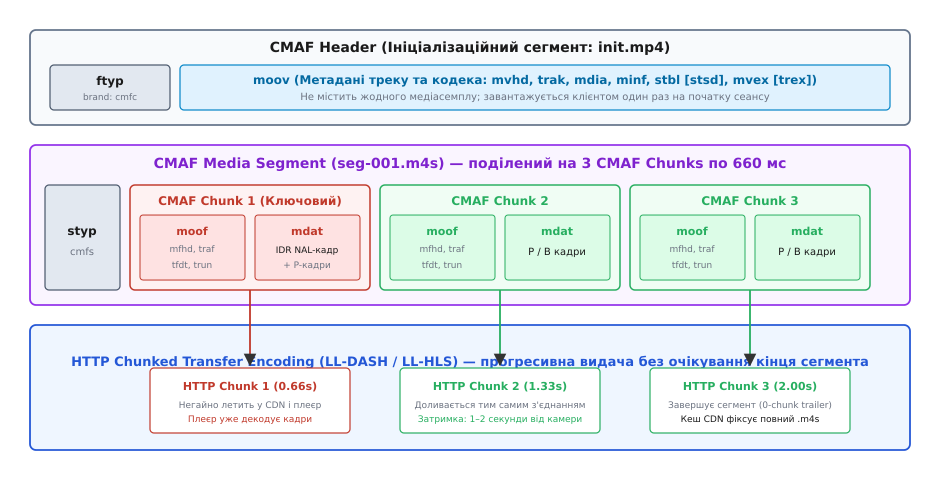
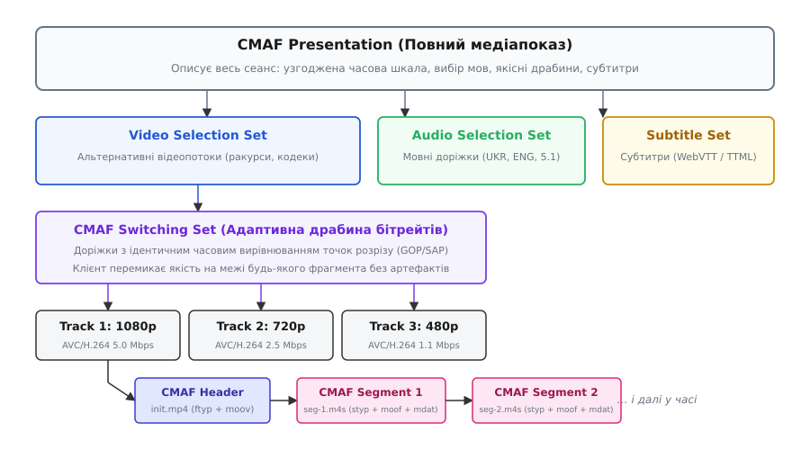
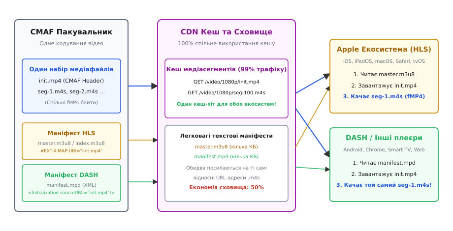
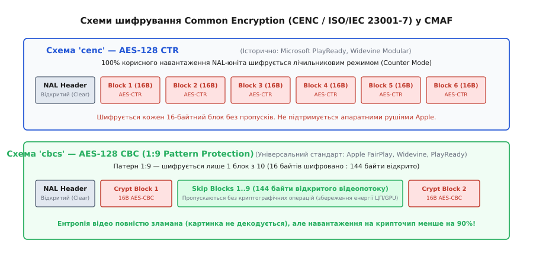

# CMAF: один комплект сегментів для HLS і DASH

<preknowlist>
- [HTTP-кешування](root:com-protocol/http-caching) — як проміжні вузли мережі та CDN кешують ресурси за точним URL і чому байтова ідентичність файлів критична для ефективності роздачі.
- [HLS і DASH](root:com-protocol/hls-dash) — потокове відео сегментами поверх HTTP: маніфести m3u8 та mpd, адаптивні драбини та клієнтський вибір якості.
- [Медіаконтейнер](root:com-signal/media-container) — як медіадані упаковуються в доріжки, синхронізуються часовими мітками та розбиваються на кадри.
- [Транспортний потік MPEG-TS](root:com-protocol/mpeg-ts) — телевізійний формат фіксованих 188-байтних пакетів із таблицями PAT/PMT та часовими мітками PCR/PTS.
- [Спільне шифрування CENC](root:sf-security/common-encryption) — захист медіаданих без повторного шифрування контейнерних заголовків.
- [Міжкадрове стиснення](root:com-signal/inter-frame) — ключові кадри IDR (точки синхронізації SAP), різницеві кадри P/B та структури GOP.
</preknowlist>

У 2015 році великий стрімінговий сервіс під час трансляції фіналу спортивного турніру на десять мільйонів одночасних глядачів стикався з нерозв'язною інфраструктурною кризою. Половина аудиторії дивилася матч через браузер Safari на iPhone та iPad, а інша половина — через браузери Chrome, додатки на Android та розумні телевізори Smart TV. Камери на стадіоні були одні й ті самі, а кодувальник стискав відео в абсолютно однаковий потік кадрів H.264/AVC з ідентичною роздільністю 1080p і бітрейтом 5 Мбіт/с.

Проте доставити ці кадри глядачам в одному файлі було неможливо. Специфікація Apple HLS вимагала пакувати шматки відео у застарілий контейнер MPEG-2 Transport Stream (файли `.ts`), створений для кабельного телебачення ще у вісімдесятих роках. Решта індустрії в межах стандарту MPEG-DASH вимагала сучасний фрагментований MP4 (файли `.m4s`). Для медіакомпаній це означало подвійне кодування, подвійне сховище на серверах-джерелах і падіння ефективності кешування в мережах доставки контенту (CDN) рівно вдвічі: коли користувач iPhone і користувач Android зверталися до крайового проксі-сервера за тим самим фрагментом тієї самої секунди матчу, вони надсилали запити на абсолютно різні URL-адреси й отримували різні байти.

Розв'язанням цієї кризи став стандарт **CMAF** (англ. *Common Media Application Format*, ISO/IEC 23000-19). Він розділив систему доставки на два незалежні шари: стандартизував єдиний двійковий медіаконтейнер на основі фрагментованого MP4, на який одночасно посилаються як текстові плейлисти HLS (`.m3u8`), так і XML-маніфести DASH (`.mpd`). Завдяки цьому сервер кодує й зберігає рівно один набір медіафайлів, мережа CDN обслуговує всіх клієнтів зі спільного кешу, а затримка прямого ефіру скорочується до одиниць секунд.

---

### Чому монолітний MP4 не підходить для трансляцій

Звичайний файл MP4 (ISO/IEC 14496-14), знайомий за локальними відеозаписами, влаштований як жорстка статична структура. Він складається з двох головних блоків (боксів): контейнера метаданих `moov` (англ. *movie box*) та контейнера сирих медіаданих `mdat` (англ. *media data box*). У боксі `moov` розміщено вичерпні таблиці індексації (`stbl`): точні байти зміщення кожного кадру у файлі (`stco`/`co64`), розмір кожного окремого кадру в байтах (`stsz`), його тривалість у тіках таймера (`stts`) та прапорці ключових кадрів (`stss`).

Така конструкція має фундаментальне обмеження: **бокс `moov` неможливо згенерувати доти, доки не закодовано весь файл до останнього кадру**. Якщо трансляція триває у прямому ефірі, загальна кількість кадрів і їхні точні зміщення наперед невідомі. Щоб почати відтворення класичного MP4, відеоплеєр зобов'язаний спершу повністю завантажити `moov`, розібрати індексні таблиці й лише після цього запитувати потрібні байти з `mdat`. Якщо розмістити `moov` у кінці файлу (як це роблять більшість простих відеоредакторів), веб-плеєр взагалі не зможе почати показ, доки не викачає всі гігабайти фільму цілком.

Фрагментований MP4 (fMP4, ISO/IEC 14496-12) розв'язує цю суперечність через декомпозицію монолітного індексу на невеликі незалежні порції. Файл розбивається на дві структурні частини:

1. **Ініціалізаційний сегмент (CMAF Header):** містить бокс типу файлу `ftyp` та мінімальний бокс `moov`. У ньому записано лише загальну конфігурацію: кількість доріжок, часову шкалу (`timescale`), геометричні розміри дисплея та параметри декодера кодека (SPS/PPS для H.264, VPS/SPS/PPS для HEVC або AudioSpecificConfig для AAC) у боксі `stsd`. Усі важкі таблиці вибірок (`stts`, `stsz`, `stco`) залишаються порожніми заглушками із нульовою кількістю записів. Додатково бокс `mvex` (англ. *movie extends*) оголошує, що цей файл розширюватиметься подальшими фрагментами. Цей сегмент важить лише кілька кілобайтів, не містить жодного кадру відео і завантажується клієнтом рівно один раз на початку сеансу.
2. **Медіафрагменти (CMAF Fragments):** кожен фрагмент складається з пари послідовних боксів — `moof` (англ. *movie fragment*) та `mdat`. Бокс `moof` містить локальний заголовок фрагмента `mfhd` із порядковим номером та дескриптор треку `traf`, де записано абсолютну часову мітку першого кадру `tfdt` і таблицю розмірів та тривалостей вибірок лише для цього короткого відрізка `trun`. Одразу за `moof` слідує локальний `mdat`, що містить байти стиснених кадрів, описаних у цьому `moof`.


*Структура ініціалізаційного сегмента init.mp4 та медіасегмента seg-001.m4s. Сегмент розбито на три незалежні чанки moof+mdat, що дозволяє передавати їх за допомогою HTTP Chunked Transfer Encoding до завершення всього 2-секундного сегмента.*

Така модульність дозволяє кодувальнику записувати й віддавати фрагменти миттєво: щойно закодовано чергову групу кадрів (наприклад, тривалістю 500 мілісекунд), формується крихітний заголовок `moof`, за ним записується `mdat`, і ці байти негайно передаються в мережу. Детальний побайтовий опис полів усіх службових заголовків зібрано у [довідці бінарної структури боксів ISOBMFF та CMAF](root:com-protocol/cmaf/api-cmaf-boxes.md).

---

### Ієрархія та модель даних CMAF

Специфікація ISO/IEC 23000-19 встановлює строгу ієрархічну модель представлення адаптивного медіаконтенту, яку підтримують сучасні клієнтські рушії:

```
CMAF Presentation (Повний медіапоказ: спільний таймлайн)
 ├── CMAF Selection Set (Відео: альтернативи кодеків/ракурсів)
 │    └── CMAF Switching Set (Адаптивна якісна драбина: вирівняні точки SAP)
 │         ├── CMAF Track (1080p: init.mp4 + послідовність seg-*.m4s)
 │         ├── CMAF Track (720p:  init.mp4 + послідовність seg-*.m4s)
 │         └── CMAF Track (480p:  init.mp4 + послідовність seg-*.m4s)
 ├── CMAF Selection Set (Аудіо: мовні доріжки)
 │    ├── CMAF Switching Set (Українська мова: Stereo 128k, 5.1 Surround 384k)
 │    └── CMAF Switching Set (Англійська мова: Stereo 128k, 5.1 Surround 384k)
 └── CMAF Selection Set (Субтитри: WebVTT / TTML)
```

Розглянемо кожен рівень моделі за призначенням:

**CMAF Track (Медіадоріжка).** Базова неподільна сутність — один закодований медіапотік фіксованої якості (наприклад, відеопотік 1080p із бітрейтом 4.5 Мбіт/с або аудіодоріжка AAC 128 кбіт/с). Трек складається з одного заголовка `init.mp4` (CMAF Header) та послідовності медіасегментів `.m4s`. Усі сегменти всередині одного треку мають монотонно зростаючі мітки часу без часових розривів чи перекриттів.

**CMAF Switching Set (Набір перемикання).** Група треків однакового медіатипу (наприклад, набір відеодоріжок 1080p, 720p, 480p, 360p), між якими відеоплеєр може безшовно перемикатися на льоту під час зміни пропускної здатності інтернет-каналу. Стандарт накладає найжорсткіші вимоги на доріжки в межах одного Switching Set:
* **Ідентичне часове вирівнювання:** межі сегментів і фрагментів у всіх треках зобов'язані збігатися з точністю до одного кадру. Якщо в доріжці 1080p сегмент №5 починається на часовій позначці `12.000` секунд, то й у доріжках 720p та 480p сегмент №5 повинен починатися рівно на позначці `12.000` секунд.
* **Спільна часова шкала:** значення `timescale` у боксі `mdhd` має бути однаковим або кратним між усіма треками (типово 90000 для відео).
* **Синхронізація точок випадкового доступу (SAP):** кожен фрагмент зобов'язаний починатися з замкненого ключового кадру (IDR, SAP Type 1 або SAP Type 2), щоб декодер міг миттєво підхопити нову якість без звернення до попередніх кадрів.


*Ієрархічна структура CMAF: презентація містить набори вибору (Selection Sets), які об'єднують набори адаптивного перемикання (Switching Sets), що складаються з окремих доріжок (Tracks).*

**CMAF Selection Set (Набір вибору).** Група взаємовиключних наборів перемикання, між якими користувач або плеєр обирає один варіант. Типовий приклад — вибір мови звукової доріжки (українська, англійська, польська) або вибір відеокодека нового покоління (набір Switching Set у кодеку AV1 для сучасних пристроїв та паралельний Switching Set у кодеку H.264 для застарілих телевізорів).

**CMAF Presentation (Показ).** Повна узгоджена колекція всіх Selection Sets, що утворюють закінчений мультимедійний сеанс. У маніфесті DASH показ відповідає елементу `<Period>`, а в HLS — загальному набору варіантних плейлистів під керуванням майстер-плейлиста.

---

### Анатомія заголовків: `tfdt`, `tfhd`, `trun`, `prft` та `emsg`

Критична перевага CMAF над іншими форматами полягає в уніфікації правил заповнення службових полів всередині фрагментів `moof`. Розглянемо ключові бокси, що забезпечують безшовне відтворення:

#### 1. Бокс абсолютного часу декодування `tfdt`

У класичному MP4 час вираховувався шляхом послідовного додавання тривалостей усіх попередніх вибірок із таблиці `stts`. У живому ефірі це призводило до накопичення похибок заокруглення: якщо фрагменти надходили із мікроскопічними зсувами, аудіо та відео розсинхронізовувалися вже за кілька годин трансляції.

Бокс `tfdt` (англ. *Track Fragment Base Media Decode Time*) записується всередині кожного `traf` і несе одне абсолютне число — часову мітку декодування (DTS) найпершого кадру цього фрагмента у шкалі `timescale`.
CMAF вимагає використання `tfdt` версії 1 із 64-бітним цілим числом.

**Розрахунок часу для відео з частотою 30 кадр/с (timescale = 90000):**

```
тривалість одного кадру = 90000 ÷ 30 = 3000 тіків
кадрів у сегменті (2 с) = 30 · 2 = 60
тривалість сегмента     = 60 · 3000 = 180000 тіків

tfdt для сегмента #1    = 0
tfdt для сегмента #2    = 0 + 180000 = 180000
tfdt для сегмента #3    = 180000 + 180000 = 360000
```

Коли клієнт перемикає бітрейт із 720p на 1080p, плеєр зчитує `tfdt` нового сегмента, бачить точну мітку `360000` і безшовно подає семпли у буфер декодера без найменшого стрибка картинки.

#### 2. Бокс налаштувань треку `tfhd` та прапорець `default-base-is-moof`

У ранніх реалізаціях ISOBMFF адресація даних у боксі `trun` відлічувалася як абсолютне байтове зміщення від початку всього файлу (`base_data_offset`). Для потокового передавання це було катастрофою: пакувальник не міг сформувати заголовок фрагмента, не знаючи, де саме у суцільному потоці чи на диску опиниться цей шматок.

CMAF ввів жорстке правило: у боксі `tfhd` обов'язково встановлюється прапорець `default-base-is-moof` (бітова маска `0x020000`). Цей прапорець вказує плеєру, що всі зміщення вибірок `data_offset` у наступному боксі `trun` відлічуються **виключно від першого байта батьківського бокса `moof`**. Це перетворює кожен фрагмент на автономний самоописний модуль, який можна передавати ізольовано будь-яким мережевим транспортом.

#### 3. Бокс часу виробника `prft` для вимірювання затримки

Бокс `prft` (англ. *Producer Reference Time Box*) зв'язує часову мітку медіапотоку з реальним світовим настінним часом UTC за шкалою NTP (англ. *Network Time Protocol*).

```
 0                   1                   2                   3
 0 1 2 3 4 5 6 7 8 9 0 1 2 3 4 5 6 7 8 9 0 1 2 3 4 5 6 7 8 9 0 1
+-+-+-+-+-+-+-+-+-+-+-+-+-+-+-+-+-+-+-+-+-+-+-+-+-+-+-+-+-+-+-+-+
|    Version    |                  Flags (24 bits)              |
+-+-+-+-+-+-+-+-+-+-+-+-+-+-+-+-+-+-+-+-+-+-+-+-+-+-+-+-+-+-+-+-+
|                      reference_track_ID                       |
+-+-+-+-+-+-+-+-+-+-+-+-+-+-+-+-+-+-+-+-+-+-+-+-+-+-+-+-+-+-+-+-+
|                   ntp_timestamp (64 bits, UTC)                |
|                                                               |
+-+-+-+-+-+-+-+-+-+-+-+-+-+-+-+-+-+-+-+-+-+-+-+-+-+-+-+-+-+-+-+-+
|               media_time (32/64 bits, decode timestamp)       |
|                                                               |
+-+-+-+-+-+-+-+-+-+-+-+-+-+-+-+-+-+-+-+-+-+-+-+-+-+-+-+-+-+-+-+-+
```

Коли кодувальник захоплює кадр із камери об `18:45:00.250` UTC, він записує це значення в `ntp_timestamp`, а відповідну мітку кадру — в `media_time`. Коли відеоплеєр на пристрої глядача розбирає цей бокс, він порівнює `ntp_timestamp` із власним поточним системним годинником і обчислює точну наскрізну затримку (*glass-to-glass latency*) у мілісекундах. Якщо затримка починає зростати через коливання мережі, плеєр непомітно для глядача прискорює відтворення на 3–5% (до швидкості 1.03–1.05x), синхронізуючи показ із реальним часом.

#### 4. Бокс повідомлень про події `emsg`

Бокс `emsg` (англ. *Event Message Box*) дозволяє вбудовувати динамічні метадані безпосередньо у двійковий потік фрагментів. Найчастіше його застосовують для вставки рекламних міток SCTE-35, передачі ID3-метаданих (назва пісні, виконавець) або сповіщень про завершення трансляції. Завдяки розміщенню всередині сегмента метадані прибувають до плеєра суворо синхронно з відеокадрами, усуваючи розсинхронізацію між показом відео та перемиканням на рекламу.

---

### Архітектура єдиного сховища: один комплект сегментів для двох світів

Головний економічний виграш від упровадження CMAF полягає у переході на схему **Dual-Manifest / Single-Segment**.

У класичній схемі трансляція вимагала підтримки двох паралельних ланцюгів:
* HLS: кодувальник створює плейлисти `.m3u8` та сегменти `segment-001.ts`, `segment-002.ts` (MPEG-TS);
* DASH: кодувальник створює маніфест `.mpd` та сегменти `segment-001.m4s`, `segment-002.m4s` (fMP4).

Уніфікована архітектура CMAF повністю позбувається дублювання медіаданих.


*Єдиний виробничий конвеєр: пакувальник створює один набір файлів .m4s у сховищі. Обидва маніфести (.m3u8 та .mpd) посилаються на однакові відносні шляхи. Крайовий кеш CDN обслуговує запити від обох клієнтських екосистем з єдиного кеш-шаблону.*

#### Як формуються маніфести для одного набору сегментів

Сервер-пакувальник створює у файловому сховищі єдину структуру файлів:
* `video_1080p/init.mp4` — ініціалізаційний заголовок;
* `video_1080p/seg-1.m4s`, `seg-2.m4s`, `seg-3.m4s` — медіасегменти fMP4;
* `audio_ukr/init.mp4`, `audio_ukr/seg-1.m4s`... — аудіосегменти.

Паралельно сервер генерує два легковажні текстові файли-описи:

**1. Медіаплейлист HLS (`video_1080p.m3u8`):**

```m3u8
#EXTM3U
#EXT-X-VERSION:7
#EXT-X-TARGETDURATION:2
#EXT-X-MEDIA-SEQUENCE:1
#EXT-X-MAP:URI="init.mp4"

#EXTINF:2.000,
seg-1.m4s
#EXTINF:2.000,
seg-2.m4s
#EXTINF:2.000,
seg-3.m4s
```

Тег `#EXT-X-MAP:URI="init.mp4"` вказує HLS-плеєру, що перед початком відтворення сегментів `.m4s` необхідно завантажити вказаний ініціалізаційний бокс.

**2. Маніфест MPEG-DASH (`manifest.mpd`):**

```xml
<?xml version="1.0" encoding="utf-8"?>
<MPD xmlns="urn:mpeg:dash:schema:mpd:2011" profiles="urn:mpeg:dash:profile:isoff-live:2011"
     minBufferTime="PT2S" type="dynamic">
  <Period id="0" start="PT0S">
    <AdaptationSet mimeType="video/mp4" codecs="avc1.640028" startWithSAP="1">
      <Representation id="1080p" bandwidth="5000000" width="1920" height="1080">
        <SegmentTemplate timescale="90000" duration="180000" startNumber="1"
                         initialization="$RepresentationID$/init.mp4"
                         media="$RepresentationID$/seg-$Number$.m4s" />
      </Representation>
    </AdaptationSet>
  </Period>
</MPD>
```

Обидва протоколи вказують клієнтам на абсолютно ідентичні відносні адреси: `video_1080p/init.mp4` та `video_1080p/seg-*.m4s`.

> 🔧 **Навіщо це.** Економія сховища на 50% — це лише частина вигоди. Головний ефект дає робота крайових серверів CDN (Edge Caches). При навантаженні у сотні тисяч запитів за секунду кеш-проксі Nginx або Varnish перевіряє URI запиту `/video_1080p/seg-42.m4s`. Запит від iPhone (через HLS) та запит від Android TV (через DASH) створюють **один і той самий кеш-ключ**. Перший запит прогріває кеш, а наступні 99 999 запитів миттєво віддаються з оперативної пам'яті вузла доставки без жодного навантаження на магістральні канали та вихідний сервер (Origin). Докладніше про історію об'єднання стандартів — в [історії контейнерних воєн та народження CMAF](root:com-protocol/cmaf/hist-cmaf-convergence.md).

---

### Наднизька затримка: CMAF Chunks та Chunked Transfer Encoding

Традиційні сегментовані протоколи мали вроджену затримку на рівні 20–30 секунд. Причина полягала в дискретній природі сегмента: веб-сервер не міг віддати файл клієнту доти, доки кодувальник не завершить його формування і не закриє дескриптор файлу на диску.

**Бюджет затримки класичного HLS/DASH (сегменти по 6 с):**

```
1. Генерація сегмента кодувальником       = 6.0 с (чекаємо запису всіх 6 секунд)
2. Публікація та оновлення маніфесту       = 0.5 с
3. Опитування маніфесту клієнтом (HTTP GET) = 3.0 с (у середньому половина інтервалу)
4. Завантаження файлу сегмента через мережу = 0.5 с
5. Буфер безпеки клієнта (3 сегменти)       = 18.0 с
────────────────────────────────────────────────────
Повна наскрізна затримка від камери до ока  = 28.0 с
```

Якщо скоротити розмір сегмента з 6 секунд до 1 секунди, затримка зменшиться, але стрімко зросте навантаження: кількість HTTP-запитів збільшиться вшестеро, бітрейт зросте через необхідність вставляти ключовий IDR-кадр щосекунди, а відсоток службових заголовків IP/TCP/HTTP стане критичним.

CMAF знайшов геніальний компроміс: **CMAF Chunks (чанки)** у поєднанні з механізмом **HTTP/1.1 Chunked Transfer Encoding (CTE)** або фреймами `DATA` у HTTP/2 та HTTP/3.

```
[Повний CMAF Segment (seg-1.m4s, тривалість 2.0 секунди)]
├── CMAF Chunk 1 (moof + mdat, 330 мс, IDR-кадр) ──► негайно летить у HTTP CTE
├── CMAF Chunk 2 (moof + mdat, 330 мс, P-кадри)   ──► негайно летить у HTTP CTE
├── CMAF Chunk 3 (moof + mdat, 330 мс, P-кадри)   ──► негайно летить у HTTP CTE
├── CMAF Chunk 4 (moof + mdat, 330 мс, P-кадри)   ──► негайно летить у HTTP CTE
├── CMAF Chunk 5 (moof + mdat, 330 мс, P-кадри)   ──► негайно летить у HTTP CTE
└── CMAF Chunk 6 (moof + mdat, 330 мс, P-кадри)   ──► фінальний чанк (завершення відповіді)
```

#### Механізм наскрізної передачі

1. Сегмент зберігає тривалість 2–6 секунд і містить лише один дорогий ключовий кадр на початку (що гарантує високу ефективність компресії відео).
2. Всередині сегмент нарізається на мікрофрагменти (CMAF Chunks) тривалістю 200–500 мс. Кожен чанк — це самодостатня пара `moof` + `mdat`.
3. Клієнт надсилає стандартний HTTP GET-запит на сегмент `seg-1.m4s` у той самий момент, коли кодувальник лише починає його створювати.
4. Сервер відповідає заголовком `Transfer-Encoding: chunked` і починає видавати байти порціями. Щойно кодувальник стиснув перші 330 мс відео, він генерує `moof` + `mdat` першого чанка і негайно відправляє його у відкритий HTTP-сокет.
5. Проміжний сервер CDN не накопичує весь 2-секундний файл, а працює у режимі наскрізного прокидання (*chunk streaming*), ретранслюючи отримані байти клієнтам у режимі реального часу.
6. Браузерний відеоплеєр через інтерфейс Media Source Extensions (MSE) підхоплює байти першого чанка за допомогою виклику `SourceBuffer.appendBuffer()`, передає їх у відеобуфер декодера й починає відтворення картинки, поки камера на стадіоні ще знімає четвертий чанк цього самого сегмента.

#### Тонкощі мережевого проходження CTE через проксі

Наскрізна передача чанків через HTTP висуває особливі вимоги до налаштування веб-серверів та реверс-проксі. За замовчуванням більшість HTTP-проксі (зокрема Nginx, HAProxy або вузли CDN) використовують буферизацію відповідей для оптимізації сокетів: проксі накопичує кілька десятків кілобайтів від бекенда перед тим, як надіслати їх клієнту.

Для роботи Low-Latency CMAF буферизацію необхідно обов'язково вимикати директивами `proxy_buffering off` або надсиланням заголовка `X-Accel-Buffering: no` від сервера генерації. Якщо цього не зробити, виникає ефект роздування буфера (*bufferbloat*): чанки накопичуються в пам'яті проксі, після чого вистрілюють пачкою, руйнуючи плавність доставки та змушуючи плеєр збільшувати буфер відтворення.

#### Реалізація у Low-Latency HLS (LL-HLS) та Low-Latency DASH (LL-DASH)

Індустрія стандартизувала цей підхід у двох взаємодоповнюючих специфікаціях:

* **Low-Latency DASH (LL-DASH):** використовує пряме зчитування сегмента через Chunked Transfer Encoding. Клієнт орієнтується на настінний годинник UTC (синхронізований через елемент `<UTCTiming>`), розраховує час генерації наступного сегмента і запитує його ще до того, як той почне створюватися на сервері.
* **Low-Latency HLS (LL-HLS від Apple):** Apple стандартизувала роботу з чанками як з явними адресовними ресурсами — **частковими сегментами** (*Partial Segments* або *Parts*). У плейлисті `.m3u8` чанки оголошуються тегом `#EXT-X-PART:URI="seg-1.m4s",BYTERANGE="14500@0",DURATION=0.333`. Додатково протокол використовує механізм блокуючого опитування (*Playlist Delta Updates* та *Blocking Playlist Reload*) і підказки про попереднє завантаження (`#EXT-X-PRELOAD-HINT`), коли клієнт відкриває з'єднання на наступний чанк до його появи.

Завдяки передачі чанками наскрізна затримка відео падає з 28 секунд до **1.5–2.5 секунд**, що повністю ліквідує відставання інтернет-трансляцій від традиційного кабельного та супутникового телебачення.

---

### Спільне шифрування Common Encryption (CENC): схеми `cenc` та `cbcs`

До появи стандарту CMAF захист платного контенту (DRM) вимагав окремих файлів через несумісність алгоритмів шифрування між вендорами.

Стандарт **Common Encryption (CENC, ISO/IEC 23001-7)** визначає загальні принципи захисту медіаданих у середовищі ISOBMFF:
* Заголовки файлу (`ftyp`, `moov`, `moof`, `traf`, `tfhd`, `trun`) та метадані кодека завжди залишаються **відкритими** (незашифрованими). Це дозволяє будь-якому стандартному демультиплексору, кеш-серверу CDN та системному відеоплеєру вільно аналізувати структуру боксів, часові мітки та розміри кадрів без доступу до криптографічних ключів.
* Шифрується виключно корисне навантаження медіасемплів (байти зрізів NAL-юнітів відео або фрейми аудіо) всередині бокса `mdat`.
* Дескриптори DRM-систем виносяться в уніфікований бокс `pssh` (Protection System Specific Header), де кожна система захисту (Widevine, PlayReady, FairPlay) записує власний унікальний 16-байтний ідентифікатор `SystemID` та приватні дані ініціалізації ліцензії.


*Порівняння схем шифрування CENC: схема cenc (AES-CTR) шифрує 100% навантаження суцільними блоками; схема cbcs (AES-CBC) застосовує патерн 1:9, захищаючи лише 10% блоків, що знижує витрати енергії апаратного криптомодуля на 90%.*

Специфікація CENC визначає чотири схеми шифрування, з яких у CMAF критичне значення мають дві:

| Схема | Режим шифрування | Патерн захисту | Сумісність із DRM |
| :--- | :--- | :--- | :--- |
| **`cenc`** | AES-128 CTR (Counter Mode) | Немає (100% блоків шифруються) | Google Widevine, Microsoft PlayReady |
| **`cbcs`** | AES-128 CBC (Cipher Block Chaining) | Патерн 1:9 (1 блок шифровано, 9 відкрито) | Apple FairPlay, Widevine (Android 7+), PlayReady 4.0+ |

#### Підсемплове шифрування та устрій схеми `cbcs`

Ключовим механізмом безпеки у відеопотоках є **підсемплове шифрування** (англ. *Subsample Encryption*). Відеокадр H.264 або HEVC складається з NAL-юнітів, де перші кілька байтів визначають тип кадру (SPS, PPS, заголовок зрізу Slice Header). Якщо зашифрувати ці заголовки, демультиплексор не зможе визначити межі кадрів.

Тому стандарт CENC розбиває кожен NAL-юніт на дві зони:
1. **Clear Bytes (відкриті байти):** довжина NAL-юніта та його заголовок залишаються відкритими.
2. **Protected Bytes (захищені байти):** корисне ентропійне навантаження пікселів макроблоків піддається шифруванню.

У схемі `cbcs` захищені байти шифруються за алгоритмом AES-128 у режимі CBC із вектором ініціалізації (IV). Після відкритих байтів запускається патерн 1:9:
* 1 блок (16 байтів) шифрується алгоритмом AES-CBC із поточним вектором ініціалізації;
* 9 наступних блоків (144 байти) пропускаються у відкритому вигляді без змін;
* цикл повторюється до кінця NAL-юніта; залишок менше 16 байтів не шифрується.

#### Чому індустрія перейшла на `cbcs`

Історично Microsoft PlayReady та Google Widevine використовували режим лічильника `cenc` (AES-CTR). У цьому режимі алгоритм AES генерує потік псевдовипадкових бітів (гаму), що накладається операцією XOR на 100% байтів відеокадру.

Компанія Apple для своєї системи FairPlay Streaming категорично відмовилася від AES-CTR на користь режиму зчеплення блоків AES-CBC із патерним захистом (`cbcs`). Причина полягала в оптимізації енергоспоживання мобільних процесорів:
* Відеопотік високої роздільності 4K HDR генерує бітрейт від 15 до 25 Мбіт/с.
* У схемі `cbcs` із захисним патерном 1:9 криптографічний блок шифрує лише **один 16-байтний блок (16 байтів), після чого пропускає дев'ять 16-байтних блоків (144 байти)** відкритого тексту, і повторює цей цикл.
* Шифрування лише 10% інформації повністю ламає ентропію стисненого потоку: без ключа декодер не здатний відновити жоден макроблок відео чи опорні вектори руху. Водночас апаратний крипточип виконує на **90% менше обчислень**, зберігаючи заряд акумулятора смартфонів і запобігаючи перегріву пристроїв.

Оскільки апаратні декодери Apple Silicon не підтримували схему `cenc`, єдиним шляхом до створення універсального файлу стало впровадження підтримки `cbcs` рештою гравців ринку. Google інтегрувала підтримку `cbcs` у Widevine Modular (починаючи з Android 7.0 та Chrome 68), а Microsoft додала `cbcs` у PlayReady 4.0 для Windows 10 та Xbox.

Сьогодні схема `cbcs` є де-факто загальносвітовим стандартом захисту CMAF: **один і той самий зашифрований файл `.m4s` одночасно розшифровується пристроями Apple (через FairPlay), пристроями Android (через Widevine) та комп'ютерами на Windows (через PlayReady)**.

---

### Медіапрофілі CMAF та кодеки

Стандарт ISO/IEC 23000-19 регламентує не лише контейнер, але й точні профілі кодування медіапотоків (англ. *CMAF Media Profiles*). Це гарантує, що плеєр, сумісний із певним профілем, гарантовано зможе декодувати потік:

* **CMAF AVC Progressive High Profile (`cfhd`):** базовий профіль для відео H.264/AVC (High Profile, Level 4.0–4.2), роздільність до 1080p60, глибина кольору 8 біт, ентропійне кодування CABAC.
* **CMAF HEVC Main Profile (`chv1`) та Main 10 (`chv2`):** профілі для відео високої чіткості H.265/HEVC з роздільністю 4K (3840×2160) та 8K, підтримка розширеного динамічного діапазону HDR (HDR10, Dolby Vision) та 10-бітного кольору.
* **CMAF AV1 Profile (`cmaf-av1`):** профіль для відкритого відеокодека нового покоління AV1 від Alliance for Open Media (AOMedia).
* **CMAF Core AAC Profile (`caac`):** стерео та багатоканальний звук AAC-LC (частоти 44.1/48 кГц, бітрейти 64–320 кбіт/с).
* **CMAF Opus Profile (`copu`):** сучасний високоефективний аудіокодек Opus для передачі мови та високоякісного звуку з наднизькою затримкою.
* **CMAF WebVTT Profile (`cwvt`):** упакування текстових субтитрів WebVTT у бокси `vttc` всередині сегментів fMP4.

Практичний приклад написання парсера на рівні C/C++ для аналізу чанків, вилучення таймкодів та валідації боксів розібрано у [проєкті розбору структури боксів та валідації чанків](root:com-protocol/cmaf/proj-cmaf-parser.md).

---

### Підсумок

CMAF здійснив революцію, усунувши останній бар'єр між пропрієтарною екосистемою Apple та відкритими стандартами решти ІТ-індустрії. Замість війни форматів інтернет-мовлення отримало чіткий розподіл обов'язків:
1. **Медіадані** існують в єдиному екземплярі як набір незмінних фрагментів fMP4 (`.m4s`), спільних для всіх пристроїв планети.
2. **Мережі CDN** кешують байти за спільними URL-адресами з максимальною ефективністю та мінімальними витратами на зберігання.
3. **Шифрування** уніфіковано за схемою `cbcs`, дозволяючи різним DRM-системам безпечно ділити спільні медіафайли.
4. **Затримка доставки** знижена до рівня прямого телеефіру завдяки наскрізному прокиданню чанків CMAF через HTTP Chunked Transfer Encoding.

У результаті протоколи HLS і DASH перетворилися з ворогуючих форматів на прості альтернативні маніфести над єдиним універсальним тілом медіаконтенту.
