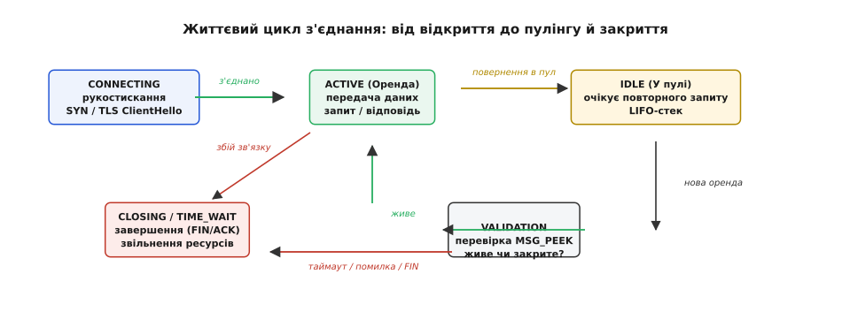
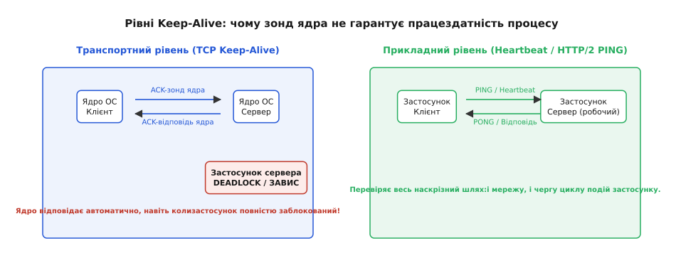
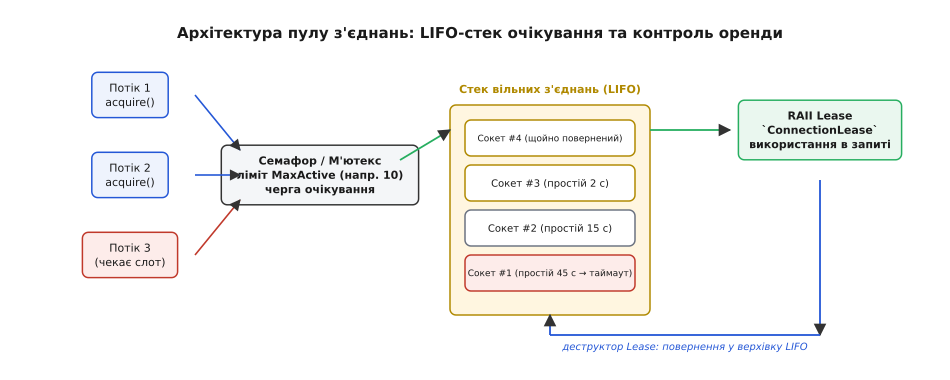
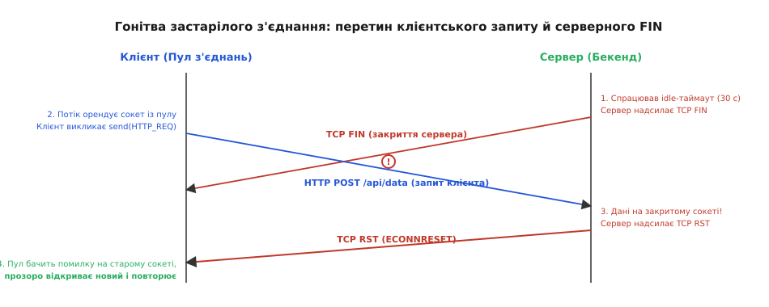

# Керування з'єднаннями, пулінг та keep-alive

<preknowlist>
- [Сокети TCP/UDP](root:sf-os/sockets-tcp-udp) — створення дескриптора сокета, виклики `connect`, `accept`, `send`, `recv` та завершення зв'язку.
- [Опції сокета: буфери, таймаути, TCP_NODELAY, TTL](root:sf-os/socket-options) — керування поведінкою сокета на рівні ядра через виклик `setsockopt`.
- [Кадрування повідомлень у потоці TCP](root:com-protocol/tcp-message-framing) — поділ безперервного байтового потоку на окремі прикладні повідомлення.
- [Пул об'єктів](root:sf-apps/object-pool) — концепція повторного використання виділених ресурсів для уникнення накладних витрат.
- [Блокуючий і неблокуючий ввід-вивід](root:sf-tasks/blocking-vs-nonblocking-io) — блокування потоків на очікуванні подій вводу-виводу.
</preknowlist>

## Ціна одноразового з'єднання: від затримок до вичерпання портів

Мікросервіс обробляє п'ять тисяч запитів за секунду й на кожен запит відкриває новий TCP-сокет до бази даних або внутрішнього HTTP-бекенда. Якщо відстань між серверами в дата-центрі становить лише один мілісекундний час обігу пакета (англ. *Round-Trip Time*, RTT), кожен запит витрачає цей мілісекунд на тристороннє рукостискання `SYN`–`SYN-ACK`–`ACK`, ще два RTT на узгодження сесії криптографічного протоколу TLS 1.2 або один RTT для TLS 1.3, пів мілісекунди на саму передачу даних і завершується чотиристороннім обміном пакетами `FIN`–`ACK`. У результаті понад 80% загального часу обробки кожного запиту витрачається не на виконання бізнес-логіки, а на безперервне відкриття та закриття сокетів в операційній системі.

Через тридцять секунд роботи такого сервісу на клієнтській машині починають масово падати прикладні запити з системною помилкою `EADDRNOTAVAIL` («Cannot assign requested address»). Мережевий канал вільний, процесорні ядра завантажені менш ніж на третину, оперативної пам'яті вдосталь, але операційна система категорично відмовляється відкривати будь-які нові вихідні мережеві з'єднання.

Причина цієї відмови криється у фундаментальній моделі адресації протоколів сімейства TCP/IP. Кожне активне мережеве з'єднання ідентифікується в ядрі операційної системи строго фіксованим кортежем із чотирьох параметрів:

```
(IP джерела, Порт джерела, IP призначення, Порт призначення)
```

Адреса та порт сервера є незмінними (наприклад, `10.0.0.5:5432` для вузла бази даних PostgreSQL або `10.0.0.8:443` для внутрішнього API-шлюзу), як і вихідна IP-адреса клієнтського вузла. Єдиний змінний параметр у цьому кортежі — локальний вихідний ефемерний порт (англ. *ephemeral port*), який операційна система виділяє клієнтському процесу під час виклику `connect()`.

У ядрі Linux стандартний діапазон доступних ефемерних портів визначається системною змінною `net.ipv4.ip_local_port_range` і за замовчуванням становить інтервал від 32768 до 60999. Це надає рівно 28 231 унікальний числовий номер порту для одночасного зв'язку з конкретною парою цільової IP-адреси та порту.

Коли клієнтська програма закінчує передачу даних і викликає системний виклик `close()`, вона надсилає серверу пакет `FIN` та ініціює активне закриття з'єднання. За специфікацією протоколу TCP (RFC 793), сторона, яка першою ініціювала закриття сокета, зобов'язана перевести його у фінальний стан `TIME_WAIT` і утримувати його в пам'яті ядра протягом подвійного максимального часу життя сегмента (`2·MSL`, що в сучасних дистрибутивах Linux жорстко зафіксовано на рівні 60 секунд). Стан `TIME_WAIT` є критично необхідним для запобігання пошкодженню даних: якщо старий пакет запізнився в мережевих маршрутизаторах і блукав каналами зв'язку, він не повинен бути помилково прийнятий новим з'єднанням, яке випадково отримало той самий номер порту.

Підрахунок вичерпання ресурсів при інтенсивному навантаженні демонструє неминучу катастрофу одноразових з'єднань:

```
5 000 нових з'єднань/с · 60 секунд утримання TIME_WAIT
= 300 000 одночасно заблокованих номерів портів
```

Потреба в 300 000 портах більш ніж удесятеро перевищує фізичну місткість усього діапазону з 28 231 ефемерного порту. Як наслідок, увесь запас доступних адрес вичерпується менш ніж за шість секунд роботи сервісу. Після цього будь-яка спроба виклику `connect()` миттєво повертає `EADDRNOTAVAIL`, а клієнтський застосунок повністю втрачає здатність взаємодіяти із зовнішнім світом.

Окрім блокування адресного простору портів, безперервне відкриття одноразових з'єднань створює колосальні невидимі накладні витрати всередині операційної системи:

1. **Виділення системної пам'яті ядра:** під кожен новий сокет виділяються структури ядра `struct sock`, черги керування та буфери передачі й прийому (`SO_SNDBUF` та `SO_RCVBUF`). При виділенні навіть мінімальних буферів по 128 КіБ тисячі короткоживучих сокетів у станах `TIME_WAIT` та `FIN_WAIT` споживають гігабайти пам'яті ядра (Slab-алокатор `sock_inode_cache` та `tcp_bind_bucket`), яка не підлягає скиданню у файл підкачки.
2. **Переповнення таблиць відстеження з'єднань (conntrack):** якщо між вузлами працює міжмережевий екран iptables/nftables або шлюз трансляції адрес NAT, кожне з'єднання займає рядок у глобальній таблиці `nf_conntrack`. Переповнення ліміту `net.netfilter.nf_conntrack_max` призводить до мовчазного відкидання нових вхідних і вихідних пакетів (`table full, dropping packet`).
3. **Обмеження повільного старту TCP (Slow Start):** кожен новий сокет починає передачу даних із мінімального початкового вікна перевантаження (англ. *Initial Congestion Window*, `initcwnd`, зазвичай 10 сегментів MSS). Щоб розігнати пропускну здатність каналу до гігабітних швидкостей, TCP потребує кількох послідовних RTT для експоненційного нарощування розміру вікна. В одноразовому з'єднанні сокет закривається ще до того, як протокол встигне використати навіть 10% пропускної здатності мережевого інтерфейсу.

**Керування з'єднаннями** (англ. *connection management*) — це дисципліна проєктування мережевого програмного забезпечення, яка переводить роботу з мережевими сокетами від одноразових викликів до довготривалого керованого життєвого циклу. Вона охоплює підтримання стану каналів через зондування активності (keep-alive), спільне використання прогрітих сокетів через пулінг (pooling), неблокуючу валідацію здоров'я та безпечний дренаж ресурсів при зупинці систем.


*Життєвий цикл керованого з'єднання: початкове встановлення зв'язку, оренда клієнтським потоком, повернення у вільний стан у пулі, перевірка здоров'я та остаточне вивільнення ресурсів.*

## Підтримання активності: транспортний рівень проти прикладного

Коли між клієнтом і сервером встановлено повноцінне з'єднання TCP, за повної відсутності передачі корисних даних у фізичний дріт не надсилається жодного байта. Архітектурно протокол TCP розроблявся як енергоощадний та пасивний: якщо обидві кінцеві точки мовчать, встановлений канал зв'язку може перебувати у стані очікування годинами чи тижнями без жодної службової активності.

Проте сучасні комп'ютерні мережі не є статичними мідними лініями. Між кінцевими вузлами розташовані десятки проміжних маршрутизаторів, міжмережевих екранів, балансувальників навантаження та шлюзів трансляції мережевих адрес (NAT).

Кожен NAT-шлюз або мережевий екран зі збереженням стану (англ. *Stateful Firewall*) зберігає динамічний запис трансляції у внутрішній оперативній пам'яті. Щоб захиститися від нескінченного витоку пам'яті на покинутих з'єднаннях, проміжне обладнання реалізує **таймаут бездіяльності** (англ. *idle timeout*). Якщо через відкритий сокет не проходило жодного TCP-пакета протягом інтервалу від 30 до 300 секунд (стандартне замовчування для багатьох хмарних шлюзів), маршрутизатор мовчки стирає запис відповідності зі своєї таблиці трансляцій.

Наслідки такого стирання є асиметричними й підступними:

- Жодна зі сторін (ані клієнт, ані сервер) не отримує пакетів `FIN` чи `RST`. Сокети на обох хостах залишаються у формально бездоганному стані `ESTABLISHED`.
- Клієнтська програма, заблокована у виклику `recv()`, очікує відповіді нескінченно довго.
- Коли одна зі сторін нарешті спробує надіслати корисні дані через цей сокет, пакет надійде на NAT-маршрутизатор, який уже не має інформації про цей сеанс. Маршрутизатор відкине пакет або згенерує у відповідь `TCP RST`, спричинивши раптовий розрив транзакції.

Аналогічна проблема виникає при аварійному вимкненні живлення сервера, пошкодженні мережевого кабелю або перезавантаженні проміжного комутатора: «тихий обрив» не генерує повідомлень про закриття сокета.

Для гарантованого виявлення втрати зв'язку та запобігання видаленню записів із таблиць NAT застосовують механізми **підтримки активності** (англ. *keep-alive*). Вони діють на двох принципово різних рівнях абстракції.

### Транспортний рівень: TCP Keep-Alive

На рівні транспортного стека протоколу TCP ядро операційної системи здатне самостійно формувати та надсилати службові зондувальні пакети. Цей функціонал вмикається для конкретного сокета через виставлення прапорця `SO_KEEPALIVE` викликом `setsockopt`.

Поведінка зондування визначається трьома параметрами ядра:

1. **Час очікування початку зондування (`TCP_KEEPIDLE`):** тривалість повної тиші в сокеті в секундах, після якої ядро генерує перший тестовий пакет.
2. **Інтервал між зондами (`TCP_KEEPINTVL`):** періодичність надсилання повторних зондів у разі відсутності відповіді.
3. **Лічильник невдалих спроб (`TCP_KEEPCNT`):** гранична кількість втрачених зондів поспіль, після якої ядро вважає зв'язок остаточно зруйнованим.

Протокольна механіка зонда є витонченою: стек ядра відправляє порожній TCP-сегмент (довжиною 0 байтів або 1 фіктивний байт), у якому номер послідовності навмисно виставляється на одиницю меншим за очікуваний номер наступного непідтвердженого байта:

```
seq = SND.UNA - 1
```

Оскільки віддалений вузол уже прийняв цей номер послідовності раніше, він сприймає цей пакет як безпечний дублікат і зобов'язаний за стандартом RFC 1122 негайно надіслати у відповідь сегмент `ACK` із зазначенням актуального очікуваного номера `ack = SND.UNA`.

Отримання цього `ACK` підтверджує локальному ядру наявність зв'язку та оновлює таймери бездіяльності на всіх проміжних маршрутизаторах NAT. Якщо ж відповіді немає, ядро повторює спроби відповідно до `TCP_KEEPCNT`, після чого закриває сокет із помилкою `ETIMEDOUT`.

Повний перелік параметрів `setsockopt`, системних змінних `/proc/sys/net/ipv4/tcp_keepalive_*` та кросплатформних викликів наведено в довіднику [Опції сокета та системні параметри TCP Keep-Alive](root:com-protocol/connection-management/api-tcp-keepalive-tuning.md).

### Прикладний рівень: Heartbeat та кадри PING

Транспортний механізм TCP Keep-Alive вирішує проблему контролю фізичного каналу та стану NAT, але має фундаментальне системне обмеження: **він перевіряє виключно працездатність мережевого стека ядра операційної системи віддаленого хоста**.

Стек TCP у сучасних ОС функціонує в просторі ядра (у контексті апаратних переривань або черг SoftIRQ) і абсолютно не залежить від стану призначеного для користувача процесу. Якщо серверна програма потрапила у взаємне блокування потоків (deadlock), вичерпала пам'ять і зависла в нескінченній збірці сміття (Stop-the-World GC Pause) або застрягла на повільному зверненні до диска, ядро її операційної системи продовжить бездоганно відповідати пакетами `ACK` на всі вхідні зонди TCP Keep-Alive. З погляду транспортного рівня з'єднання є абсолютно здоровим, проте для клієнтського застосунку сервер повністю паралізований.


*Зонд ядра TCP лише підтверджує наявність зв'язку з мережевим стеком ОС віддаленого вузла, тоді як прикладний Heartbeat проходить повний наскрізний шлях через цикл обробки подій програми.*

Саме тому сучасні протоколи високого рівня використовують обов'язковий прикладний контроль працездатності (англ. *application-level heartbeat*):

- **HTTP/2 та HTTP/3:** специфікація впроваджує спеціальні 8-байтові кадри `PING`, на які віддалений застосунок зобов'язаний негайно згенерувати відповідь `PING` із виставленим прапорцем підтвердження `ACK`.
- **WebSocket (RFC 6455):** протокол резервує спеціальні опкоди `0x9` (Ping) та `0xA` (Pong). Отримавши Ping, прикладний обробник зобов'язаний повернути Pong з ідентичним корисним навантаженням.
- **Бази даних та черги повідомлень (gRPC, Redis, AMQP, PostgreSQL):** підтримують регулярний обмін легкими прикладними командами валідації каналу на рівні черги циклу подій (event loop).

> 🔧 **Навіщо це.** Тільки поєднання обох рівнів забезпечує справжню надійність: системний `SO_KEEPALIVE` із періодом 30–60 секунд запобігає закриттю з'єднання проміжними хмарними балансувальниками NAT, а прикладний Heartbeat із періодом 5–10 секунд виявляє зависання робочих потоків сервера й перемикає клієнта на резервні інстанси.

Історичний шлях розвитку тривалих з'єднань від найперших версій вебу до сучасних мультиплексованих протоколів викладено у вставці [Еволюція постійних з'єднань у HTTP: від одноразових сокетів до мультиплексування](root:com-protocol/connection-management/hist-http-keepalive.md).

## Архітектура пулу з'єднань: оренда, повернення й життєвий цикл

Використання постійного з'єднання (Keep-Alive) усуває витрати на постійні рукостискання, але породжує проблему координації між паралельними потоками програми. У протоколах зі строгою послідовною моделлю «запит-відповідь» (HTTP/1.1, драйвери баз даних PostgreSQL/MySQL, клієнти Redis) одночасний запис кількох потоків в один TCP-сокет призведе до змішування байтів і неминучого пошкодження протокольного кадрування.

Розв'язанням є **пул з'єднань** (англ. *connection pool*) — синхронізована керуюча структура даних, яка утримує набір попередньо відкритих та прогрітих сокетів, видає їх у тимчасову ексклюзивну оренду клієнтським потокам і повертає назад для повторного використання після завершення транзакції.


*Внутрішня будова пулу: семафор обмежує максимальну кількість відкритих сокетів, вільні з'єднання зберігаються у LIFO-стеку для максимізації локальності кешу, а видача оформлюється через RAII-оренду.*

### Внутрішні компоненти пулу

Класична архітектура пулу з'єднань містить чотири функціональні блоки:

1. **Сховище вільних з'єднань (Idle Pool / Stack):** колекція готових відкритих сокетів, які очікують на надходження нових завдань.
2. **Реєстр активної оренди (Active Set / Counter):** облік сокетів, які наразі перебувають у користуванні робочих потоків застосунку.
3. **Синхронізатор місткості (Capacity Semaphore / Mutex + Condition Variable):** механізм обмеження максимальної кількості одночасно створених сокетів (`maxCapacity`). Якщо всі сокети зайняті, нові потоки блокуються на умовній змінній до вивільнення ресурсу або настання таймауту очікування (`acquireTimeout`).
4. **Фоновий збирач застарілих ресурсів (Idle Evictor / Reaper):** таймерний потік, що періодично інспектує вільні з'єднання та закриває ті з них, які перевищили ліміт часу простою (`maxIdleTime`) або максимальний абсолютний час життя (`maxLifetime`).

### Вибір дисципліни черги: LIFO проти FIFO

Для організації колекції вільних з'єднань застосовують дві протилежні моделі:

- **FIFO (First-In, First-Out — черга):** з'єднання, яке звільнилося першим, буде видано першим. Це рівномірно розподіляє навантаження між усіма відкритими сокетами. Проте в умовах змінного трафіку (наприклад, під час нічного спаду активності) черга FIFO виявляється шкідливою: кожен новий запит бере по черзі наступний сокет, «торкаючись» усіх сокетів пулу. Жоден сокет не встигає досягти таймауту бездіяльності `maxIdleTime`, тому пул не може зменшити свій розмір і продовжує утримувати зайві ресурси ядра.
- **LIFO (Last-In, First-Out — стек):** сокет, який щойно повернувся в пул, розміщується на вершині стека й видається наступному запиту негайно. Ця дисципліна забезпечує дві фундаментальні інженерні переваги:
  1. **Локальність кешу процесора (CPU Cache Locality):** дескриптор сокета, буфери ядра та структури TLS-сесії нещодавно використаного з'єднання вже завантажені в кеш-пам'ять L1/L2 процесорного ядра.
  2. **Природне очищення зайвих з'єднань:** гарячі сокети на вершині стека безперервно обслуговують запити, тоді як надлишкові холодні з'єднання на дні стека остигають, досягають таймауту простою й безпечно ліквідуються фоновим збирачем.

### Розрахунок оптимального розміру пулу: закон Літтла

Поширена помилка системних розробників — конфігурація необґрунтовано великого пулу з'єднань (наприклад, сотні сокетів на процес) за наївним припущенням «більше з'єднань — вища паралельність».

На практиці пропускна здатність будь-якого бекенда обмежена кількістю апаратних процесорних ядер, дисковим вводом-виводом (IOPS) та конкуренцією за блокування пам'яті. Якщо база даних має 16 ядер процесора, вона фізично здатна виконувати не більше 16 операцій одночасно. Створення пулу на 500 з'єднань призведе до того, що сотні потоків конкуруватимуть за кванти часу процесора, змушуючи операційну систему витрачати всю обчислювальну потужність на непродуктивне перемикання контексту ядра (context switching) та скидання ліній процесорного кешу.

Математичний зв'язок між кількістю необхідних з'єднань, пропускною здатністю та затримкою описується законом Літтла (англ. *Little's Law*):

```
N = X · R
```

де:
- `N` — середня кількість одночасно зайнятих з'єднань у системі;
- `X` — цільова пропускна здатність (кількість оброблених запитів за секунду);
- `R` — середній час виконання одного запиту (затримка / latency в секундах).

**Приклад практичного розрахунку:**

```
Цільове навантаження сервісу:   X = 20 000 запитів/с
Середній час відповіді бекенда: R = 1.5 мс = 0.0015 с

Базова кількість з'єднань:
    N = 20 000 · 0.0015 = 30 з'єднань
```

Додавання 20–30% запасу на гасіння випадкових сплесків затримки (jitter) дає оптимальний розмір пулу в 36–40 з'єднань. Цього компактного пулу повністю достатньо для обслуговування колосального навантаження у 20 000 запитів за секунду без створення черг блокувань на стороні сервера.

Повну реалізацію потокобезпечного пулу з підтримкою LIFO-стека, неблокуючої перевірки валідності та RAII-оренди розібрано у вставці [Потокобезпечний пул з'єднань із контролем здоров'я та часом оренди](root:com-protocol/connection-management/proj-connection-pool.md).

## Пастки життєвого циклу: напівзакриті сокети та гонитва застарілих з'єднань

Повторне використання з'єднань неминуче стикається зі специфічними мережевими гонитвами станів (race conditions), які не проявляються в простих одноразових скриптах.

### Пастка 1: Напівзакритий сокет і сигнал SIGPIPE

Стандарт TCP підтримує концепцію напівзакритого з'єднання (англ. *half-closed connection*). Коли віддалений сервер вирішує закрити сокет за власним таймаутом бездіяльності, він надсилає клієнту керівний сегмент `FIN`.

Ядро клієнта приймає `FIN`, автоматично генерує у відповідь `ACK` і переводить локальний сокет у стан `CLOSE_WAIT`. Проте, якщо цей сокет у цей момент мирно лежить у пулі вільних з'єднань, клієнтська програма не отримує жодного асинхронного сповіщення.

Коли робочий потік клієнта нарешті викликає `pool.acquire()` і виконує запис у сокет через системний виклик `write()` або `send()`, операційна система успішно записує байти в локальний буфер відправлення — адже вихідний напрямок сокета формально залишається відкритим. Пакет відправляється в мережу, але сервер, який уже повністю знищив стан з'єднання, негайно відповідає пакетом `TCP RST` (скидання).

Подальший розвиток подій є критичним для стабільності процесу:

1. Будь-яка наступна спроба читання повертає помилку `ECONNRESET` («Connection reset by peer»).
2. Якщо ж клієнтський процес виконає повторний виклик `write()` у сокет, який уже отримав `RST`, ядро операційної системи генерує системний сигнал `SIGPIPE`. За замовчуванням у стандартах POSIX реакцією на сигнал `SIGPIPE` є **негайне аварійне завершення роботи всього процесу**.

Для запобігання падінню сервісу мережеві програми зобов'язані нейтралізувати цей сигнал:

:::tabs
```c
// Глобальне ігнорування сигналу на рівні процесу
signal(SIGPIPE, SIG_IGN);

// Або локальне вимкнення генерації сигналу для кожного окремого виклику send
send(fd, buffer, length, MSG_NOSIGNAL);
```
```cpp
// Ігнорування сигналу SIGPIPE на рівні ініціалізації середовища
#include <csignal>

void configureProcessSignals() noexcept {
    std::signal(SIGPIPE, SIG_IGN);
}

// Передача прапорця MSG_NOSIGNAL при відправленні даних
ssize_t sendDataSafely(int fd, std::string_view data) noexcept {
    return ::send(fd, data.data(), data.size(), MSG_NOSIGNAL);
}
```
:::

### Пастка 2: Гонитва застарілого з'єднання (Stale Connection Race)

Найбільш невловимою проблемою розподілених систем є гонитва станів під час закриття простоюючого сокета.


*Гонітва застарілого з'єднання: сервер закриває сокет за таймаутом бездіяльності в той самий момент, коли клієнт бере його з пулу; пакети перетинаються в мережі, спричиняючи скидання RST.*

Хронологія розвитку збою розгортається на рівні мілісекунд:

1. Сокет перебуває у стані спокою всередині пулу клієнта рівно 29.999 секунди.
2. Серверний бекенд має налаштування `idle_timeout = 30.0 с`. Таймер сервера спрацьовує, і сервер надсилає в мережу сегмент `TCP FIN`.
3. У ту саму мікросекунду потік клієнта викликає `pool.acquire()`, успішно отримує цей сокет (який у цю мить ще вважається абсолютно здоровим) і виконує запис нового важливого запиту `POST /orders HTTP/1.1`.
4. Пакети `FIN` від сервера та `POST` від клієнта **рухаються назустріч один одному й фізично перетинаються в мережевому комутаторі чи оптичному волокні**.
5. Сервер приймає дані на вже закритому сокеті й миттєво відкидає їх пакетом `TCP RST`.
6. Клієнт намагається прочитати відповідь і стикається з раптовою помилкою `ECONNRESET` посеред виконання відповідальної фінансової транзакції.

### Стратегії захисту пулу

Для нейтралізації гонитви закриття та напівзакритих сокетів застосовують комплекс із трьох захисних механізмів:

1. **Неблокуюча перевірка перед видачею (Test-on-Borrow через MSG_PEEK):**
   Перед тим як передати сокет із пулу клієнтському коду, пул виконує швидке неблокуюче підглядання в буфер прийому ядра:

:::tabs
```c
char probe;
ssize_t r = recv(fd, &probe, 1, MSG_PEEK | MSG_DONTWAIT);
if (r == 0) {
    // Сокет отримав FIN від сервера — з'єднання мертве, його слід негайно закрити
}
```
```cpp
char probe;
ssize_t r = ::recv(fd, &probe, 1, MSG_PEEK | MSG_DONTWAIT);
if (r == 0) {
    // Сокет отримав FIN від сервера — з'єднання мертве, його слід негайно закрити
}
```
:::

   Якщо `r == 0`, ядро вже отримало пакет `FIN`. Пул тихо закриває пошкоджений дескриптор і бере зі стека наступне з'єднання без повернення помилки клієнту.

2. **Асиметрія таймаутів (Агресивний клієнтський таймаут):**
   Клієнтський пул **завжди** повинен мати ліміт часу бездіяльності (`maxIdleTime`), який є суттєво меншим за таймаут сервера. Якщо на сервері або хмарному балансувальнику навантаження встановлено таймаут закриття 60 секунд, клієнтський пул зобов'язаний виставляти `maxIdleTime = 45–50` секунд. Завдяки цьому клієнт завжди закриває сокет першим, виключаючи ймовірність зустрічного перетину пакетів у мережі.

3. **Прозорий повтор ідемпотентних запитів (Transparent Retry):**
   Якщо запит є ідемпотентним (безпечним для повторного виконання, наприклад, HTTP `GET`, `HEAD` або операція читання з репліки бази даних), і під час першого звернення через старе з'єднання з пулу сталася помилка `ECONNRESET`, клієнтська бібліотека не повинна повертати аварійний статус користувачеві. Вона зобов'язана прозоро відкрити новий чистий сокет і повторити запит автоматично.

## Витоки ресурсів та коректне завершення роботи (Graceful Drain)

Найбільш підступною проблемою довготривалої експлуатації мережевих застосунків є поступовий **витік дескрипторів сокетів** (англ. *socket file descriptor leak*).

Якщо робочий потік орендував з'єднання з пулу, а під час обробки відповіді сталася непередбачена помилка (наприклад, збій синтаксичного аналізу пошкодженого документа JSON або спрацювання тайм-ауту читання), достроковий вихід із функції через звичайний `return` або генерацію винятку минає виклик `pool.release(conn)`. Сокет залишається заблокованим у лічильнику активної оренди назавжди.

У міру накопичення таких покинутих з'єднань кількість доступних вільних слотів зменшується. Зрештою всі робочі потоки застосунку блокуються в черзі очікування `pool.acquire()`, настає повний колапс обробки (deadlock), а операційна система починає повертати фатальну помилку вичерпання дескрипторів `EMFILE` («Too many open files»).

### Захист через ідіому RAII

Для повного виключення витоків ресурсів у сучасних мовах програмування керування орендою сокета реалізують виключно через детерміновані об'єкти-охоронці:

:::tabs
```c
// Ризикований підхід у C: ручне повернення сокета
PooledConnection *conn = pool_acquire(pool, 5);
if (!conn) return -1;

if (process_transaction(conn->fd) < 0) {
    // ПОМИЛКА: достроковий вихід залишає сокет заблокованим у пулі назавжди!
    return -1; 
}
pool_release(pool, conn, 0);
return 0;
```
```cpp
// Надійний підхід у C++: обгортка RAII
int executeTransaction(ConnectionPool& pool) {
    // Деструктор об'єкта lease гарантовано поверне сокет у пул
    // при будь-якому шляху виходу з функції, включно з генерацією винятків
    auto lease = pool.acquire(std::chrono::seconds(5));
    if (!lease) {
        return -1;
    }

    if (processTransaction(lease->fd()) < 0) {
        lease->markBroken(); // Позначаємо сокет як пошкоджений для закриття
        return -1;
    }
    return 0;
}
```
:::

### Дренаж з'єднань під час зупинки процесу (Graceful Shutdown)

Під час планового оновлення прошивки сервісу або розгортання нової версії в контейнері процес отримує системний сигнал зупинки (`SIGTERM`). Раптове закриття всіх сокетів процесу призведе до обриву тисяч активних клієнтських транзакцій, генерації помилок `502 Bad Gateway` на зовнішніх балансувальниках та пошкодження незавершених транзакцій у базах даних.

Процедура коректного вивільнення ресурсів (англ. *graceful drain*) реалізується за суворим чотирифазним протоколом:

1. **Блокування нових запитів:** стан пулу переводиться в режим `is_shutdown = true`. Будь-які наступні виклики `acquire()` миттєво відхиляються або перенаправляються на сусідні інстанси сервісу.
2. **Миттєве закриття вільних сокетів:** усі з'єднання, що перебувають у колекції очікування (`Idle List`), закриваються системним викликом `close()` негайно, оскільки вони не виконують корисної роботи.
3. **Пільговий період очікування (Grace Period):** пулу виділяється фіксований час (наприклад, 10–30 секунд). Головний потік чекає, поки лічильник орендованих сокетів `active_count` природно зменшиться до нуля, коли всі робочі потоки закінчать поточні запити й повернуть сокети через свої деструктори.
4. **Примусова ліквідація:** якщо після завершення пільгового періоду окремі з'єднання все ще залишаються активними (наприклад, зависли на повільній відповіді стороннього сервера), пул примусово закриває їхні файлові дескриптори, розблоковує всі очікуючі черги та безпечно передає керування системі завершення процесу.

## Підсумкова інженерна дисципліна

Надійне керування мережевими з'єднаннями у високопродуктивних системах спирається на п'ять фундаментальних правил:

1. **Повторне використання замість відкриття:** пулінг усуває затримки на рукостискання TCP/TLS та унеможливлює вичерпання ефемерних портів і пам'яті в стані `TIME_WAIT`.
2. **Дворівневий контроль активності:** транспортний `SO_KEEPALIVE` утримує записи в динамічних таблицях трансляції NAT, а прикладний Heartbeat/Ping перевіряє життєздатність обробника подій віддаленої програми.
3. **LIFO-організація черги пулу:** стек підтримує локальність кеш-пам'яті процесора для найгарячіших з'єднань і дозволяє надлишковим сокетам природно остигати й закриватися фоновим збирачем.
4. **Сувора асиметрія таймаутів:** таймаут бездіяльності в клієнтському пулі має бути завжди меншим за таймаут сервера, що унеможливлює гонитву закриття та скидання з'єднань через `RST`.
5. **Детерміноване володіння ресурсом (RAII):** оренда сокетів повинна захищатися автоматичними деструкторами або блоками очищення, що виключає витоки дескрипторів та блокування сервісу під час збоїв.
