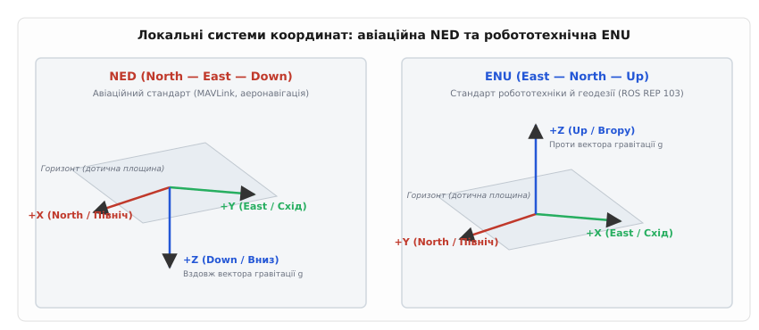
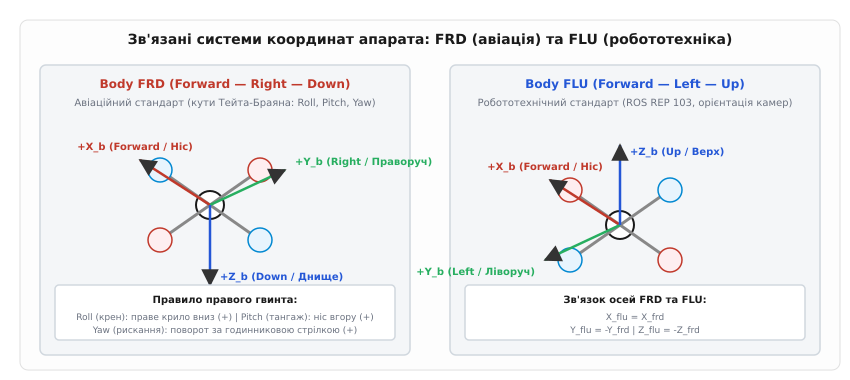
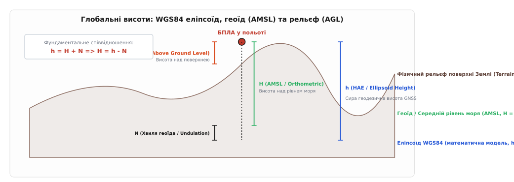
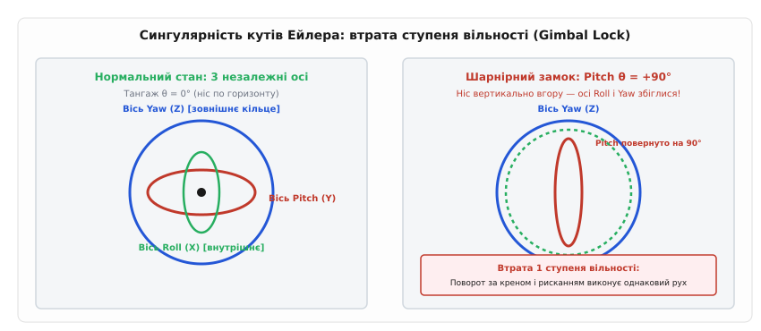
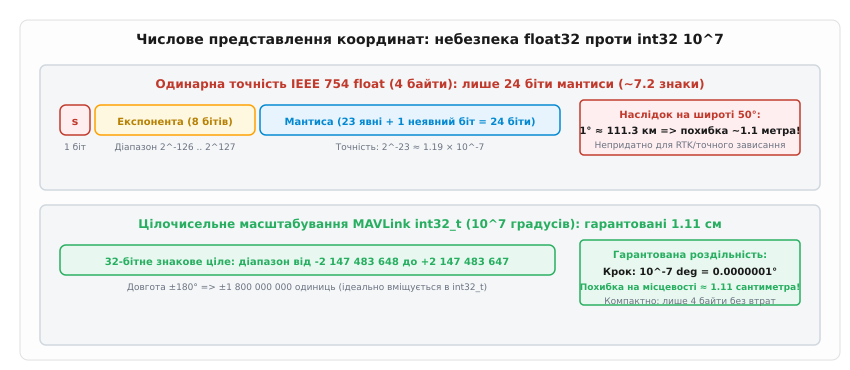

# Координати, орієнтація й фізичні одиниці в протоколах

<preknowlist>
- [Конструкція пакета](root:com-transport/packet-design) — двійкове пакування даних, службові поля та корисне навантаження.
- [Матриці повороту](root:math-algebra/rotation-matrices) — лінійні ортогональні перетворення векторів у тривимірному просторі.
- [Кути Ейлера](root:math-geometry/euler-angles) — опис просторової орієнтації через послідовні тривісні повороти.
- [Кватерніони](root:math-geometry/quaternions) — гіперкомплексні числа для представлення орієнтації без сингулярностей.
- [Пакет MAVLink](root:sys-dron/mavlink-packet) — структура повідомлень та транспорт телеметрії між автопілотом і наземною станцією.
</preknowlist>

Автономний квадрокоптер отримує від бортового комп'ютера з операційною системою ROS команду зльоту: зміститися по вертикалі на `+5.0` метрів зі швидкістю `+1.5` м/с. Протокол серіалізує ці числа у корисне навантаження пакета і передає їх контролеру польоту. Замість набору висоти апарат на повній тязі врізається в ґрунт, ламаючи пропелери й раму. Причина катастрофи полягає не в помилці обчислень чи апаратній відмові моторів: бортовий комп'ютер передав координати у геодезичному базисі ENU (East-North-Up), де додатна вісь Z спрямована вгору, а автопілот розібрав пакет в авіаційному стандарті NED (North-East-Down), де додатна вісь Z спрямована вертикально вниз у напрямку гравітації. Значення `+5.0` контролер сприйняв як наказ піти на 5 метрів під землю.

Цей сценарій розкриває головний інваріант обміну навігаційними даними: передане двійкове число позбавлене будь-якого фізичного сенсу, доки відправник і приймач явно не погодили три незалежні контракти. Перший контракт — **система координат** (де розташований початок відліку і куди дивляться просторові осі). Другий контракт — **конвенція орієнтації** (як представлено просторовий поворот корпусу і в якому порядку виконуються кутові обертання). Третій контракт — **фізична розмірність та двійковий формат** (метри чи сантиметри, радіани чи градуси, числа з рухомою комою чи цілі числа з фіксованим масштабним множником).

---

### Локальні системи координат: конфлікт авіації та робототехніки

Навігація рухомого апарата на невеликих відстанях від точки зльоту (у радіусі від кількох метрів до десятків кілометрів) спирається на локальну дотичну площину горизонту (англ. *Local Tangent Plane*). Початком відліку цієї площини обирають точку старту або місце ініціалізації навігаційного фільтра оцінки стану (англ. *Extended Kalman Filter*, EKF). Проте напрямки головних осей у різних інженерних школах виявилися протилежними.


*Локальні декартові базиси дотичної площини: авіаційний стандарт NED узгоджує додатну вісь Z із вектором сили тяжіння, тоді як робототехнічний стандарт ENU спрямовує вісь Z вгору проти сили тяжіння.*

#### 1. Авіаційний стандарт NED (North — East — Down)

В авіації, морській навігації та протоколі [MAVLink](root:sys-dron/mavlink-packet) історично панує правостороння система координат **NED**:
* **Вісь X (North)** спрямована горизонтально на географічну Північ.
* **Вісь Y (East)** спрямована горизонтально на географічний Схід під кутом 90° праворуч від осі X.
* **Вісь Z (Down)** спрямована вертикально вниз, до центру мас Землі вздовж вектора прискорення вільного падіння `g`.

Такий вибір осей пояснюється аеродинамікою літака: коли літак летить за курсом на Північ у горизонтальному польоті, вісь X збігається з віссю фюзеляжу, вісь Y виходить уздовж правого крила на Схід, а вісь Z проходить крізь дно кабіни вниз. Завдяки цьому падіння висоти (втрата потенціальної енергії) відповідає додатному зміщенню за віссю Z, а вектор ваги літака має додатну проєкцію `+m·g`.

#### 2. Робототехнічний і геодезичний стандарт ENU (East — North — Up)

У наземній робототехніці, картографії, геодезії та фреймворку ROS (стандарт REP 103) використовують правосторонню систему координат **ENU**:
* **Вісь X (East)** спрямована горизонтально на Схід.
* **Вісь Y (North)** спрямована горизонтально на Північ.
* **Вісь Z (Up)** спрямована вертикально вгору, проти вектора гравітації `g`.

Для наземних колісних і крокуючих роботів висота природно асоціюється з підйомом над поверхнею підлоги чи дороги. Збільшення висоти означає додатне значення `Z`, що відповідає класичній декартовій геометрії шкільної математики.

#### 3. Математичний зв'язок між NED та ENU

Обидві системи є правосторонніми (англ. *right-handed*): векторний добуток перших двох осей дає третю вісь (`X × Y = Z`). Щоб перейти від вектора у системі NED до системи ENU, виконують перестановку двох горизонтальних координат та інверсію вертикальної:

```
x_enu =  y_ned       [вісь Сходу]
y_enu =  x_ned       [вісь Півночі]
z_enu = -z_ned       [вісь висоти: вгору = -вниз]
```

У матричній формі лінійне перетворення задається ортогональною матрицею переходу `T_NED_to_ENU`:

```
[ x_enu ]   [ 0  1  0 ] [ x_ned ]
[ y_enu ] = [ 1  0  0 ] [ y_ned ]
[ z_enu ]   [ 0  0 -1 ] [ z_ned ]
```

Визначник цієї матриці дорівнює `det(T) = (0·0 − 1·(−1)) = +1`. Додатний одиничний визначник свідчить про збереження орієнтації простору: поворот не перетворює праву трійку векторів на ліву, тому стандартні правила векторного множення залишаються незмінними. Проте нехтування зміною знака осі `Z` під час надсилання цільових уставок швидкості чи положення є однією з найчастіших причин аварій безпілотних апаратів на етапі автономного зльоту та посадки.

---

### Зв'язані системи координат корпусу: FRD проти FLU

Коли автопілот стабілізує політ, зчитує показники датчиків кутової швидкості (гіроскопів) та лінійних прискорень (акселерометрів), він оперує координатами, жорстко прив'язаними до самого апарата. Цю систему називають **зв'язаною системою координат** (англ. *Body Frame*). Початок відліку зв'язаної системи завжди розташований у центрі мас (англ. *Center of Gravity*, CG) транспортного засобу і рухається разом із ним у просторі.


*Зв'язані системи координат апарата: авіаційний базис FRD орієнтує ніс вперед, праве крило праворуч і днище вниз; робототехнічний базис FLU орієнтує ніс вперед, ліве крило ліворуч і дах вгору.*

#### 1. Авіаційний базис Body FRD (Forward — Right — Down)

В авіації та протоколі MAVLink (ідентифікатор `MAV_FRAME_BODY_FRD`) зв'язані осі визначаються так:
* **Поздовжня вісь X_b (Forward)** спрямована вперед уздовж будівельної осі носа апарата.
* **Поперечна вісь Y_b (Right)** спрямована праворуч уздовж правого крила або правої балки мотора.
* **Вертикальна вісь Z_b (Down)** спрямована перпендикулярно до площини фюзеляжу вниз крізь днище.

#### 2. Робототехнічний базис Body FLU (Forward — Left — Up)

У робототехніці, комп'ютерному зорі та стандартах ROS застосовують зв'язаний базис **FLU** (ідентифікатор `MAV_FRAME_BODY_FLU`):
* **Поздовжня вісь X_b (Forward)** спрямована вперед по ходу руху.
* **Поперечна вісь Y_b (Left)** спрямована ліворуч.
* **Вертикальна вісь Z_b (Up)** спрямована вертикально вгору крізь верхню кришку корпусу.

#### 3. Напрямки обертань за правилом правого гвинта

Орієнтація зв'язаних осей безпосередньо диктує додатні напрямки трьох кутів обертання літального апарата — крену (англ. *Roll*, `ϕ`), тангажу (англ. *Pitch*, `θ`) та рискання (англ. *Yaw*, `ψ`):
* **Крен (Roll, поворот навколо осі X):** За правилом правого гвинта в системі FRD додатний кут крену опускає праве крило вниз. У системі FLU додатний крен опускає ліве крило.
* **Тангаж (Pitch, поворот навколо осі Y):** У системі FRD додатний тангаж піднімає ніс літака вгору.
* **Рискання (Yaw, поворот навколо осі Z):** У системі FRD вісь Z дивиться вниз, тому додатний поворот навколо осі Z за правилом правої руки відповідає обертанню за годинниковою стрілкою при погляді зверху (збільшення курсу на Схід). У системі FLU вісь Z спрямована вгору, тому додатне рискання обертає апарат проти годинникової стрілки.

Якщо алгоритм стабілізації отримує кутову швидкість із гіроскопа в осях FLU, але інтерпретує її як FRD, зворотний зв'язок регулятора за креном і рисканням замість гасіння коливань створює позитивний зворотний зв'язок, що призводить до миттєвого перевертання дрона під час спроби відриву від землі.

---

### Глобальні географічні координати: модель WGS84 та парадокс трьох висот

Для міжміських перельотів і глобального позиціонування декартової дотичної площини недостатньо: форма Землі є сфероїдом, сплюснутим біля полюсів. Міжнародним стандартом супутникової навігації є геодезична система **WGS84** (англ. *World Geodetic System 1984*, від лат. *geodaesia* — землемірство).

Геодезичні координати визначаються трьома параметрами:
1. **Широта (Latitude, `ϕ`):** Кут між площиною екватора та нормаллю до поверхні еліпсоїда у точці спостереження (від −90° на Південному полюсі до +90° на Північному полюсі).
2. **Довгота (Longitude, `λ`):** Двогранний кут між площиною нульового Гринвіцького меридіана та площиною меридіана точки спостереження (від −180° на Захід до +180° на Схід).
3. **Висота (Altitude):** Відстань по вертикалі, що вимірюється у метрах.

Саме з висотою у протоколах зв'язку пов'язана найбільша кількість інженерних непорозумінь, оскільки в навігації одночасно існують три принципово різні фізичні поверхні.


*Три фізичні поверхні відліку висоти: математичний еліпсоїд WGS84 (`h`), гравітаційний геоїд середнього рівня моря AMSL (`H`) та фізичний рельєф місцевості AGL (`h_AGL`). Хвиля геоїда `N` пов'язує еліпсоїдну та ортометричну висоти.*

#### 1. Еліпсоїдна висота (`h`, Height Above Ellipsoid — HAE)

Це чиста геометрична відстань від точки у просторі до поверхні математичного еліпсоїда WGS84 вздовж нормалі. Супутникові приймачі GNSS (GPS, Galileo) обчислюють власну позицію в системі координат ECEF (англ. *Earth-Centered, Earth-Fixed*) через розв'язання задачі перетину сфер від супутників. Первинна висота, яку видає супутниковий приймач на виході математичного розв'язку, є суто еліпсоїдною висотою `h`.

Проте еліпсоїд WGS84 є штучною ідеалізованою фігурою з великою піввіссю `a = 6 378 137.0 м` та коефіцієнтом стиснення `f = 1 / 298.257223563`. Він не враховує нерівномірності гравітаційного поля Землі, зумовлені неоднорідною густиною земної кори та рухом океанічних мас.

#### 2. Ортометрична висота над рівнем моря (`H`, Above Mean Sea Level — AMSL)

Фізичний рух повітря, води та політ літальних апаратів визначаються гравітаційним полем, а не абстрактним еліпсоїдом. Поверхня, на якій гравітаційний потенціал Землі є всюди сталим (еквіпотенціальна поверхня сили тяжіння), називається **геоїдом** (англ. *Geoid*). У спокійному стані рівень води у світовому океані встановлюється строго вздовж геоїда.

Висота точки над геоїдом називається **ортометричною висотою** або висотою над середнім рівнем моря (AMSL). Саме за висотою AMSL калібруються аеронавігаційні карти, схеми польотів цивільної авіації та висоти пагорбів.

Різниця між еліпсоїдною висотою `h` та висотою над рівнем моря `H` називається **хвилею геоїда** або геоїдною ундуляцією (англ. *Geoid Undulation*, `N`):

```
h = H + N
H = h - N
```

Величина `N` на поверхні нашої планети коливається у межах від −106 метрів (глибока гравітаційна западина в Індійському океані) до +85 метрів (гравітаційна аномалія в Північній Атлантиці поблизу Ісландії). На території України різниця між еліпсоїдом WGS84 та рівнем моря становить від +15 до +35 метрів залежно від регіону.

Якщо безпілотний літак завантажить польотне завдання з висотою польоту 50 метрів відносно рівня моря (AMSL), а бортовий контролер помилково візьме сиру GNSS-висоту відносно еліпсоїда `h`, літак летітиме на 35 метрів нижче запланованого ешелону, що створює критичну загрозу зіткнення з лініями електропередач та деревами. Сучасні автопілоти (PX4, ArduPilot) обов'язково містять у прошивці компактну табличну модель геоїда (наприклад, сітку гравітаційної моделі EGM96 з кроком 15') для автоматичного коригування сирої супутникової висоти до стандарту AMSL.

#### 3. Висота над рівнем землі (`h_AGL`, Above Ground Level)

Висота `h_AGL` — це дійсна геометрична відстань від нижньої точки апарата до фізичної поверхні ґрунту під ним. Її вимірюють бортовими оптичними лідарами, ультразвуковими сонарами чи радіолокаційними висотомірами на малих висотах, або розраховують відніманням висоти рельєфу місцевості цифрової моделі висот (англ. *Digital Elevation Model*, DEM / SRTM) від поточної висоти AMSL:

```
h_AGL = H_AMSL - H_Terrain
```

У протоколах керування польотом висота AGL використовується під час виконання завдань сканування поверхні, огинання рельєфу (англ. *Terrain Following*) та автоматичної посадки.

---

### Просторова орієнтація: кути Тейта-Браяна та пастка Gimbal Lock

Орієнтація корпусу апарата відносно нерухомої системи навігації вимагає завдання трьох ступенів вільності (англ. *Degrees of Freedom*, DOF). Найбільш інтуїтивним способом опису орієнтації є кути Тейта-Браяна (названі на честь шотландського фізика Пітера Тейта та математика Джорджа Браяна, англ. *Tait-Bryan angles*).

Послідовність поворотів у протоколах строго стандартизована: застосовується схема **внутрішніх обертань Z-Y-X (3-2-1)**:
1. **Рискання (`ψ`, Yaw):** Початковий базис повертається навколо своєї осі Z на кут курсу `ψ`.
2. **Тангаж (`θ`, Pitch):** Отриманий проміжний базис повертається навколо своєї нової осі Y' на кут нахилу носа `θ`.
3. **Крен (`ϕ`, Roll):** Отриманий базис повертається навколо своєї кінцевої поздовжньої осі X'' на кут нахилу крила `ϕ`.

Будь-який просторовий поворот може бути виражений матрицею напрямних косинусів (англ. *Direction Cosine Matrix*, DCM) розміром 3 × 3, детальний вивід та властивості якої наведено у вставці [Математика матриць повороту, кватерніонів та кутів Ейлера](root:com-protocol/coordinate-frames-units/math-rotations-dcm.md).

Однак представлення просторової орієнтації трьома кутами Ейлера має фундаментальну топологічну ваду, властиву всім трипараметричним описам групи поворотів SO(3) — явище **шарнірного замка** (англ. *Gimbal Lock*).


*Фізична сингулярність кутів Ейлера: коли кут тангажу `θ` досягає ±90° (ніс апарата дивиться вертикально вгору або вниз), осі крену (Roll) та рискання (Yaw) вирівнюються в одній площині, позбавляючи систему одного ступеня вільності.*

#### Механізм виникнення Gimbal Lock

Розглянемо фізичну ситуацію, коли пілотований літак чи ракета здійснює вертикальний набір висоти «свічкою»: кут тангажу `θ` досягає +90° (+π/2 рад).

При підстановці `θ = 90°` у матрицю повороту Z-Y-X виявляється, що тригонометричні функції `cos(90°) = 0` та `sin(90°) = 1` перетворюють елементи матриці на вирази, які залежать виключно від різниці або суми двох інших кутів: `(ϕ − ψ)`. 

У цей момент вісь обертання внутрішнього кільця крену (Roll) фізично лягає у площину зовнішнього кільця рискання (Yaw). Поворот апарата навколо поздовжньої осі стає невідрізненним від повороту навколо вертикальної осі горизонту. Два незалежні ступені вільності зливаються в один. Математично це призводить до ділення на `cos(θ) = 0` у диференціальних рівняннях кінематики кутових швидкостей:

```
ψ̇ = (q · sin(ϕ) + r · cos(ϕ)) / cos(θ)     [при θ = 90° знаменник прямує до 0 => похідна прямує до ∞]
```

Для цифрової системи керування це означає миттєвий арифметичний збій: похідні кутів розриваються, фільтр орієнтації втрачає збіжність, а приводи рулів починають здійснювати хаотичні неконтрольовані ривки. Саме тому передавати поточну орієнтацію через кути Ейлера у швидких каналах керування польотом неприпустимо.

---

### Кватерніони у протоколах: орієнтація без сингулярностей

Щоб уникнути сингулярностей та позбутися тригонометричних обчислень у реальному часі, сучасні протоколи телеметрії передають орієнтацію за допомогою **унітарних кватерніонів** (від лат. *quaterni* — по чотири, винайдені ірландським математиком Вільямом Гамільтоном у 1843 році).

Кватерніон `q` є гіперкомплексним числом із чотирма дійсними компонентами:
```
q = [w, x, y, z]ᵀ = w + x·i + y·j + z·k
```
де `w` — скалярна частина, а `v = [x, y, z]ᵀ` — векторна частина, для яких виконується фундаментальне правило Гамільтона:
```
i² = j² = k² = i·j·k = -1
```

Для опису орієнтації використовують **нормовані (одиничні) кватерніони**, норма яких строго дорівнює одиниці:
```
||q|| = √(w² + x² + y² + z²) = 1
```

#### Чому протоколи передають кватерніони:

1. **Повна відсутність сингулярностей:** Кватерніонний простір однозначно покриває групу поворотів SO(3) без жодних крайових особливих точок чи втрати осей при будь-яких кутах нахилу (навіть при переворотах на 180° і вертикальних піке).
2. **Компактність у каналі зв'язку:** Для передачі орієнтації потрібно лише 4 числа типу `float` (16 байтів у повідомленні MAVLink `ATTITUDE_QUATERNION`), на відміну від повної матриці повороту 3 × 3, яка вимагає 9 чисел (36 байтів).
3. **Легка корекція накопичення похибок:** Якщо через радіозавади чи похибки округлення норма кватерніона відхиляється від одиниці, її миттєво відновлюють простим діленням на евклідову норму (`q ← q / ||q||`), тоді як для матриці DCM ортогоналізація вимагає ресурсомісткого алгоритму Грама-Шмідта.
4. **Швидке обертання векторів:** Поворот будь-якого вектора `v` (наприклад, вектора прискорення акселерометра) у світову систему координат виконується кватерніонним множенням:
   ```
   v_world = q ⊗ (0, v_body) ⊗ q*
   ```
   де `q* = [w, -x, -y, -z]ᵀ` — спряжений кватерніон.

Практичні алгоритми швидкого повороту векторів мовами C та C++ без зайвих виділень пам'яті реалізовано у вставці [Реалізація перетворень координат та векторів орієнтації](root:com-protocol/coordinate-frames-units/proj-frame-transform.md).

---

### Фізичні одиниці та двійкове масштабування: ціна кожного байта

У вузькосмугових радіоканалах зв'язку (наприклад, телеметрія діапазонів 433/868/915 МГц або протокол Crossfire/ELRS на швидкостях 9600–57600 бод) кожен байт корисного навантаження має критичне значення. Розробники протоколів змушені шукати баланс між обсягом переданих даних та необхідною просторовою точністю.

На перший погляд, універсальним форматом для будь-яких фізичних величин є стандартне число з рухомою комою одинарної точності IEEE 754 (`float`, 4 байти). Проте застосування `float` для глобальних координат містить приховану небезпеку.


*Порівняння точності представлення глобальних координат: обмеження 24 бітів мантиси у форматі IEEE 754 float32 дає похибку до 1.1 метра, тоді як цілочисельне масштабування int32_t з множником 10⁷ забезпечує міліметрову точність на всій поверхні земної кулі.*

#### Чому `float32` непридатний для координат

Число `float` формату IEEE 754 займає 32 біти: 1 біт знака, 8 бітів експоненти та 23 біти мантиси (плюс 1 неявний біт, разом 24 біти значущих цифр). Це забезпечує точність приблизно у 7.22 десяткових знака:
```
2⁻²³ ≈ 1.192 · 10⁻⁷
```

Розглянемо політ дрона в районі міста Києва (широта 50.45°, довгота 30.52°). Один градус широти відповідає лінійній дузі довжиною приблизно 111.3 км = 111 300 метрів.

Якщо записати координату довготи 30.523456° у тип `float`, число матиме 7 значущих цифр:
```
30.52346°
```
Найменший крок молодшого розряду мантиси при значенні кута близько 30° .. 50° становить:
```
Δϕ_min ≈ 50° · 2⁻²³ ≈ 50 · 1.192 · 10⁻⁷ ≈ 0.00000596°
```
Переведемо цей кутовий крок у метри на місцевості:
```
ΔL = 0.00000596° · 111 300 м/° ≈ 0.66 ... 1.12 метра!
```

Похибка квантування одинарної точності сягає **понад один метр**. Дрон, керований через координати у форматі `float32`, не здатен здійснити точну посадку на платформу, зависнути з RTK-точністю чи утримати камеру на об'єкті: координата у пам'яті буде дискретно стрибати кроками по метру.

Перехід на подвійну точність `double` (IEEE 754 `float64`, 8 байтів) вирішує проблему точності, але подвоює обсяг пакетів телеметрії, перевантажуючи вузький радіоефір.

#### Рішення MAVLink: Цілочисельне масштабування 10⁷ (`int32_t`)

Протокол MAVLink знайшов оптимальне рішення у повідомленні `GLOBAL_POSITION_INT`: координати широти й довготи кодуються 32-бітним знаковим цілим числом `int32_t`, помноженим на фіксований коефіцієнт 10⁷:

```
lat_packet = (int32_t)(latitude_deg · 10 000 000)
lon_packet = (int32_t)(longitude_deg · 10 000 000)
```

1. **Діапазон:** Діапазон значень довготи від −180° до +180° перетворюється на діапазон від −1 800 000 000 до +1 800 000 000, що ідеально вміщується у межі типу `int32_t` (від −2 147 483 648 до +2 147 483 647).
2. **Роздільна здатність:** Крок молодшого біта строго дорівнює:
   ```
   Δϕ = 10⁻⁷ градуса = 0.0000001°
   ```
   На місцевості це відповідає відстані:
   ```
   ΔL = 0.0000001° · 111 300 м/° ≈ 0.0111 метра = 1.11 сантиметра!
   ```
3. **Обсяг:** Повідомлення зберігає високу сантиметрову точність, займаючи рівно 4 байти на координату без жодного спотворення мантиси.

Повний звід усіх форматів двійкового кодування, структур повідомлень та одиниць вимірювання задокументовано у вставці [Стандарти систем координат, повідомлень та одиниць MAVLink](root:com-protocol/coordinate-frames-units/api-mavlink-coordinates.md).

---

### Систематизація одиниць вимірювання у телеметрії

Щоб запобігти помилкам інтерпретації, міжнародні протоколи телеметрії дотримуються наступних жорстких правил розмірностей:

| Фізична категорія | Основна одиниця в обчисленнях | Компактна одиниця передачі в ефірі | Принцип перерахунку |
| :--- | :--- | :--- | :--- |
| **Географічні кути** | Градуси (°) | Градуси × 10⁷ (`int32_t`) | `deg = val / 1e7` |
| **Кути орієнтації** | Радіани (rad) | Сантиградуси 0.01° (`int16_t` / `uint16_t`) | `cdeg = deg * 100` |
| **Кутова швидкість**| Радіани за секунду (rad/s) | Сантиградуси/с або мілірадіани/с | rad/s = cdeg/s · (π / 18000) |
| **Лінійна швидкість**| Метри за секунду (м/с) | Сантиметри за секунду (см/с, `int16_t`) | м/с = val / 100.0 |
| **Прискорення** | м/с² | Мілі-g (1 mg = 10⁻³ g₀ ≈ 0.00981 м/с²) | м/с² = val · 0.00980665 |
| **Висота** | Метри (м) | Міліметри (мм, `int32_t`) | м = val / 1000.0 |
| **Час бортовий** | Мілісекунди (мс, `uint32_t`) | `time_boot_ms` від старту процесора | Скидається при перезавантаженні |
| **Час світовий** | Мікросекунди (мкс, `uint64_t`) | `time_usec` UNIX Epoch (від 1970 року) | Синхронізується за GNSS PPS |

> 🔧 **Навіщо це.** Коли інтегратор підключає зовнішню систему комп'ютерного зору (наприклад, трекінг орієнтації за камерою VIO) до автопілота через протокол MAVLink, дані позиції та швидкості повинні потрапляти у фільтр EKF у строго визначеному базисі. Якщо VIO-камера видає зміщення у системі осей оптичного сенсора (Z вперед, X праворуч, Y вниз), а автопілот очікує повідомлення `VISION_POSITION_ESTIMATE` в осях `MAV_FRAME_LOCAL_NED`, відсутність правильної матриці трансформації миттєво підірве коваріаційну матрицю навігаційного фільтра, викликавши відмову EKF та аварійну зупинку моторів.

---

### Інженерна дисципліна інтеграції: чотири правила надійного шлюзу

Розробка надійного зв'язку між різнорідними робототехнічними вузлами вимагає суворого дотримання чотирьох правил:

1. **Трансформація на межі інтерфейсу (Boundary Conversion):** Усі конвертації систем координат і розмірностей (NED ⇄ ENU, радіани ⇄ сантиградуси) повинні виконуватися виключно у вхідних та вихідних адаптерах драйверів зв'язку (Ingress/Egress). Внутрішня бізнес-логіка ядра системи повинна працювати виключно в єдиному канонічному базисі.
2. **Явна типізація структур:** Ніколи не зберігайте координати у безіменних масивах типу `float pos[3]`. Використовуйте строго типізовані структури із зазначенням базису в імені типу: `Point3d_NED`, `Point3d_ENU`, `GeodeticCoord_WGS84`.
3. **Обов'язкова нормалізація кватерніонів:** При отриманні кватерніона з мережевого пакета або після обчислення інтерполяції завжди перевіряйте його евклідову норму. Якщо `||q||² ≠ 1.0`, нормалізуйте кватерніон перед подальшими матричними операціями.
4. **Контроль доменів часу:** Ніколи не віднімайте часову мітку `time_boot_ms` одного пристрою від `time_boot_ms` іншого: бортові таймери різних процесорів не синхронізовані і мають незалежний дрейф тактового генератора. Для міжсистемного аналізу затримок використовуйте лише абсолютний час `time_usec`, прив'язаний до секундного імпульсу [PPS](root:hw-sensing/pps-pulse) від супутників [GNSS](root:hw-sensing/gnss).
