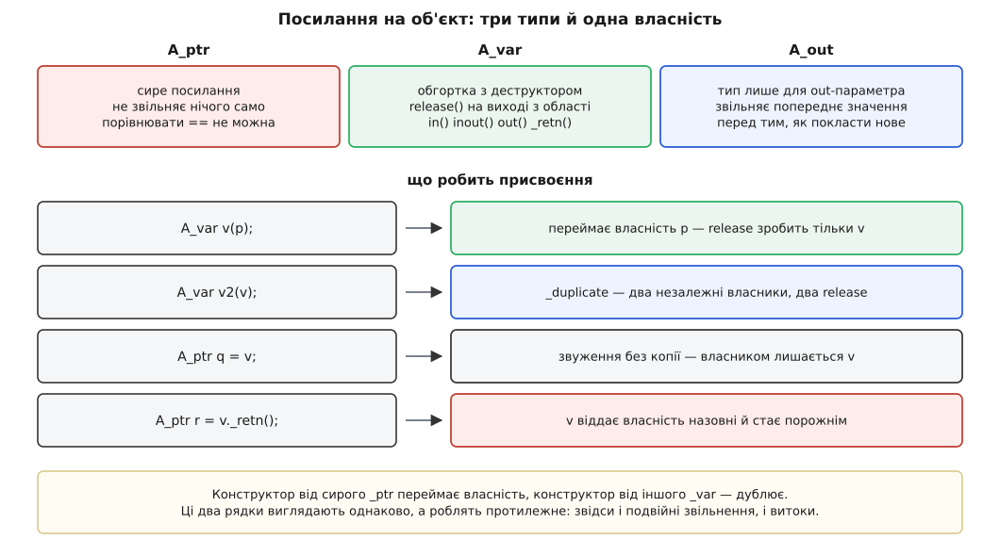
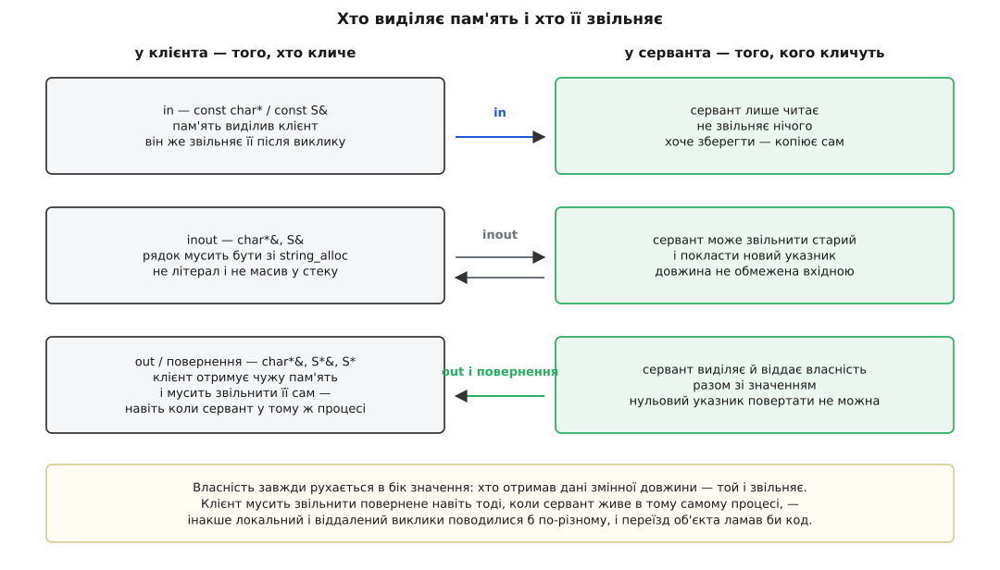

# 📋 Контракт CORBA: типи IDL і відображення на C++

Це перелік усього, що можна написати в контракті IDL, і того, що компілятор породжує з кожної конструкції в C++ — разом із головним, чого в сигнатурі не видно: хто з двох боків володіє пам'яттю кожного параметра й хто мусить її звільнити. Саме тут, а не в мережевому коді, ховається більшість аварій, через які CORBA заслужила репутацію засобу, на якому легко зібрати програму, що падає раз на добу.

Правила нижче взяті з двох чинних документів OMG: семантика IDL — з **CORBA 3.3, Part 1: Interfaces**; відображення на C++ — з окремої специфікації **C++ Language Mapping v1.3** (OMG formal/2012-07-02). Це важливо розділяти: одна й та сама IDL має різні відображення на C++, Java, Python, і те, що виглядає як властивість CORBA, часто є властивістю саме C++-мапінгу.

## Типи IDL

### Базові

| IDL | C++ (простір імен `CORBA`) | Нотатка |
|---|---|---|
| `short`, `unsigned short` | `Short`, `UShort` | 16 біт незалежно від платформи |
| `long`, `unsigned long` | `Long`, `ULong` | завжди 32 біти, навіть де рідний `long` 64-бітний |
| `long long`, `unsigned long long` | `LongLong`, `ULongLong` | 64 біти |
| `float`, `double` | `Float`, `Double` | IEEE 754 |
| `long double` | `LongDouble` | розширена точність; підтримують не всі брокери |
| `char` | `Char` | один символ у переговореному наборі |
| `wchar` | `WChar` | `wchar_t` у стандартному середовищі |
| `boolean` | `Boolean` | визначені **тільки** значення 1 і 0; будь-яке інше — невизначена поведінка |
| `octet` | `Octet` | байт, який ніколи не перекодовують |
| `enum` | однойменний C++-`enum` | 32 біти в проводі |
| `any` | `Any` | значення разом із його `TypeCode` |
| `Object` | `Object_ptr` / `Object_var` | базовий тип усіх посилань |

Дві пастки з цієї таблиці одразу. Перша: `boolean`, `char` і `octet` **можуть відобразитися на той самий C++-тип**, тому перевантажувати функції за ними не можна — компілятор не розрізнить. Друга: `CORBA::Long` — це рівно 32 біти на будь-якій машині, тож `long x = acc->balance()` на 64-бітній платформі мовчки розширює тип, а зворотне присвоєння так само мовчки ріже.

### Рядки

| IDL | C++ |
|---|---|
| `string` | `char*` (завершений нулем) |
| `string<N>` | `char*` — межу N перевіряє **програміст** |
| `wstring` | `CORBA::WChar*` |
| `wstring<N>` | `CORBA::WChar*` — те саме |

Обмежені рядки в C++ не мають відповідника, тому мапінг чесно віддає межу на совість програміста. Брокер має право її перевіряти; якщо перевіряє й бачить порушення — зобов'язаний кинути `BAD_PARAM`.

### Складені типи

| IDL | C++ | Що з'являється додатково |
|---|---|---|
| `struct S { … };` | `struct S` | `S_var`, `S_out` |
| `union U switch (T) { case … };` | `class U` | акцесор/модифікатор на гілку, `_d()` для дискримінанта, `_default()` |
| `enum E { … };` | `enum E` | `E_out` |
| `sequence<T>` | клас із `length()`, `maximum()`, `operator[]` | `allocbuf`/`freebuf`, `_var`, `_out` |
| `sequence<T,N>` | те саме, але `maximum()` сталий | конструктор без параметра `max` |
| `typedef T A[10];` | `T A[10]` | `A_slice`, `A_var`, `A_out`, `A_forany`, `A_alloc`, `A_free`, `A_dup` |
| `fixed<d,s>` | `CORBA::Fixed` | десяткове з фіксованою комою, до 31 цифри |

`union` в IDL — це не C++-`union`, а розмічене об'єднання: разом зі значенням завжди їде **дискримінант**, який каже, яка гілка активна. У C++ він стає класом, де дискримінант читають і пишуть функцією `_d()`, а кожна гілка має власну пару функцій. Читання гілки, що не збігається з поточним дискримінантом, — невизначена поведінка, і брокер не зобов'язаний це ловити.

### Самоописові типи

`any` несе всередині і значення, і його `TypeCode` — повний опис типу, за яким приймач може розібрати значення, не маючи IDL наперед. Це єдина конструкція, яка ламає загальне правило CDR «у потоці немає тегів»; ціною є розмір і повільний розбір.

### valuetype

`valuetype` — не посилання, а **значення**: воно їде проводом цілком, разом зі станом, і на тому боці відтворюється як окремий об'єкт. З'явився у CORBA 2.3 саме тому, що інтерфейси не вміли передати структуру з поведінкою.

```idl
valuetype Statement {
  public long amount;          // стан їде проводом
  private string internal_id;  // стан їде проводом, але поза інтерфейсом
  long fee();                  // метод виконується локально в приймача
};
```

Керування пам'яттю в `valuetype` окреме від усього іншого: замість `release` — `_add_ref()` / `_remove_ref()`, і це єдиний вид параметра, для якого нульовий указник — законне значення.

### Стала і змінна довжина

Це найважливіший поділ у всій таблиці, бо саме від нього залежать сигнатури C++.

**Тип має сталу довжину**, коли розмір його подання не залежить від значення: усі примітиви, `enum`, `fixed`, `struct`/`union` лише з таких членів, масиви з таких елементів.

**Тип має змінну довжину**, коли розмір залежить від значення: `string`, `wstring`, `sequence`, `any`, `valuetype`, посилання на об'єкт — і будь-який `struct`, `union` чи масив, що містить хоч один такий член.

Наслідок прямий: тип сталої довжини повертається **за значенням** і `out`-параметром іде як `T&` — його можна покласти в стек. Тип змінної довжини повертається **указником**, і разом з указником через межу виклику переходить обов'язок звільнити пам'ять.

## Операції

### Оголошення

```
[oneway] <тип-результату> <ім'я> ( [in|out|inout] <тип> <ім'я>, … )
                                  [ raises (E1, E2, …) ]
                                  [ context ("ключ1", "ключ2") ]
```

### Напрямки параметрів

| Напрямок | Куди їдуть байти | Хто дає початкове значення |
|---|---|---|
| `in` | клієнт → сервер | клієнт |
| `out` | сервер → клієнт | ніхто; початкове значення не передають |
| `inout` | обидва боки | клієнт, сервер може замінити |

Напрямок обов'язковий — беззнакового параметра в IDL не існує. Кожен `out` та `inout` коштує байтів **у відповіді**, тому «просто додати ще один вихідний параметр» — це не безкоштовно.

Якщо операція завершилася винятком, значення результату й усіх `out`/`inout`-параметрів **невизначені**. Читати їх після `catch` не можна.

### `oneway`

| Властивість | Звичайна операція | `oneway` |
|---|---|---|
| Семантика виклику | exactly-once при успішному поверненні; at-most-once, якщо прилетів виняток | best-effort: доставка не гарантована, виконання — щонайбільше раз |
| Тип результату | будь-який | тільки `void` |
| `out` / `inout` | дозволені | **заборонені** |
| `raises` | дозволений | **заборонений** |
| Системний виняток | може прилетіти | може прилетіти й тут |

Остання клітинка — та, через яку `oneway` регулярно розуміють неправильно. Заборона `raises` стосується лише **користувацьких** винятків; системний виняток (наприклад, `COMM_FAILURE` під час спроби відкрити з'єднання) `oneway`-виклик кинути може.

І окремо — рішення мапінгу, яке варте того, щоб його знати напам'ять: у згенерованому C++ `oneway`-операція виглядає **точно так само**, як звичайна. Специфікація формулює це прямо — з C++-коду неможливо дізнатися, чи операція `oneway`. Тобто рядок `acc->ping();` може означати «виклик відбувся» або «повідомлення пішло в порожнечу», і відрізнити одне від одного можна лише зазирнувши в IDL.

### Атрибути

`attribute` — це не поле, а скорочення для пари операцій-доступу.

| IDL | Логічний еквівалент | C++ |
|---|---|---|
| `attribute long x;` | `long _get_x(); void _set_x(in long);` | `CORBA::Long x(); void x(CORBA::Long);` |
| `readonly attribute string owner;` | `string _get_owner();` | `char* owner();` |

Справжні імена акцесорів залежать від мапінгу; гарантія одна — вони не зіткнуться з жодним законним іменем операції IDL. Кожне звертання до атрибута — **окремий похід у мережу**, тому `acc->owner()` у циклі з тисячі ітерацій — це тисяча запитів.

Із CORBA 3.0 атрибут може оголошувати винятки: `getraises` для читача, `setraises` для писача, а `readonly attribute` бере звичайний `raises`.

```idl
interface Account {
  readonly attribute string owner raises (NotAuthorized);
  attribute long limit getraises (NotAuthorized) setraises (LimitTooHigh);
};
```

## Винятки: дві сім'ї

| | Користувацький виняток | Системний виняток |
|---|---|---|
| Оголошений в IDL | так, у `raises` операції | ніколи; у `raises` з'явитися **не може** |
| Звідки прилітає | лише з операцій, що його оголосили | з **будь-якої** операції |
| Базовий клас у C++ | `CORBA::UserException` | `CORBA::SystemException` |
| Несе | ті поля, що описав автор | мінорний код і статус завершення |
| Що означає | передбачений стан предметної області | зламався сам виклик |

Обидві сім'ї походять від спільного `CORBA::Exception`, тож `catch (const CORBA::Exception&)` ловить усе.

```cpp
class CORBA::Exception {
public:
    virtual ~Exception();
    virtual void        _raise() const = 0;   // кинути себе, зберігши справжній тип
    virtual const char* _name() const;        // неповне ім'я, наприклад "InsufficientFunds"
    virtual const char* _rep_id() const;      // "IDL:bank/InsufficientFunds:1.0"
};
```

Повернуте з `_name()` і `_rep_id()` **звільняти не можна** — пам'ять належить винятку.

Для спуску по ієрархії винятків мапінг дає `_downcast`, а не `_narrow`. Різниця принципова: `_downcast` поводиться як `dynamic_cast` — повертає указник **на той самий об'єкт**, нічого не створює й нічого не вимагає звільняти. Ім'я `_narrow` для винятків залишили лише заради сумісності й позначили застарілим саме через плутанину з керуванням пам'яттю.

### Тіло системного винятку

```cpp
enum CORBA::CompletionStatus {
    COMPLETED_YES,    // реалізація завершила роботу до того, як виник виняток
    COMPLETED_NO,     // реалізація навіть не почалася
    COMPLETED_MAYBE   // стан завершення невизначений
};

class CORBA::SystemException : public CORBA::Exception {
public:
    ULong            minor() const;      void minor(ULong);
    CompletionStatus completed() const;  void completed(CompletionStatus);
};
```

Типовий конструктор дає `minor() == 0` і `completed() == COMPLETED_NO`.

### Мінорний код

Мінорний код — це 32-бітове число, поділене на два поля: хто його призначив і що саме сталося.

```
мінорний код (unsigned long, 32 біти)

 біти 31…12   VMCID — Vendor Minor Codeset ID, 20 біт: чий це простір кодів
 біти 11…0    власне код підпричини, 12 біт: 4096 значень на виробника

CORBA::OMGVMCID = 0x4f4d0000        простір, закріплений за OMG
VMCID 0x00000 і 0xfffff             залишені для експериментів
VMCID 0x00001…0x0000f               теж за OMG

стандартний мінорний код 4 у просторі OMG:
0x4f4d0000 | 4 = 0x4f4d0004
```

Практично це означає: побачивши в журналі `minor = 0x4f4d0004`, ти маєш **стандартний** код 4 зі специфікації; побачивши щось інше в старших бітах — код виробника, і шукати його треба в документації брокера, а не в OMG.

### Стандартні системні винятки, які варто впізнавати

| Виняток | Що каже специфікація |
|---|---|
| `TRANSIENT` | тимчасова відмова — запит можна повторити |
| `OBJECT_NOT_EXIST` | об'єкта немає; посилання треба **викинути**, повтор не допоможе |
| `COMM_FAILURE` | зв'язок обірвався після відправлення запиту й до отримання відповіді |
| `NO_RESPONSE` | відповіді ще немає |
| `MARSHAL` | повідомлення структурно неправильне — майже завжди різні IDL на двох боках |
| `UNKNOWN` | сервант кинув не-CORBA-виняток, або користувацький, якого нема в `raises` |
| `BAD_OPERATION` | посилання дійсне, але об'єкт не підтримує цю операцію |
| `BAD_PARAM` | параметр поза діапазоном або незаконний (зокрема нульовий указник) |
| `INV_OBJREF` | посилання спотворене всередині |
| `OBJ_ADAPTER` | відмову виявив адаптер об'єктів |
| `NO_PERMISSION` | у того, хто кличе, бракує прав |
| `BAD_INV_ORDER` | операції викликано в неправильному порядку |
| `TIMEOUT` | скінчився відведений час |
| `IMP_LIMIT` | перевищено внутрішню межу брокера |
| `INITIALIZE` | брокер не піднявся |
| `NO_IMPLEMENT` | означення операції є, реалізації немає |

Повний перелік більший — тридцять із гаком, і специфікація прямо попереджає, що клієнт мусить бути готовий і до незнайомих: майбутні версії додають нові, а брокери мають право визначати власні. Незнайомий системний виняток чужий брокер зобов'язаний подати як `UNKNOWN`, зберігши статус завершення.

Дві пари з таблиці варто розрізняти автоматично. **`TRANSIENT` проти `OBJECT_NOT_EXIST`** — це відповідь на питання «повторювати чи ні»: перший каже «спробуй ще», другий каже «цього об'єкта більше немає, забудь посилання». **`MARSHAL` проти `BAD_OPERATION`** — це відповідь на питання «хто винен»: перший майже завжди означає, що дві сторони зібрані з різних версій IDL, другий — що посилання вказує не на той тип, який ти думав.

> 🔧 **Навіщо це.** `UNKNOWN` у клієнта — найдорожчий діагноз у CORBA, бо він стирає причину. Сервант кинув `std::bad_alloc`, `std::out_of_range` чи будь-що інше поза контрактом — клієнт побачить лише «щось пішло не так», без тексту, без коду, без місця. Тому кожна операція серванта мусить мати зовнішній `catch (...)`, який перекладає рідні винятки або в оголошений користувацький, або в конкретний системний. Інакше журнал клієнта не містить жодної інформації про справжню поломку.

## Ідентифікатор репозиторію

Кожен іменований тип IDL має рядковий ідентифікатор, за яким його впізнають у проводі, у сховищі інтерфейсів і в `_is_a`.

```
IDL:<префікс>/<складене ім'я через />:<major>.<minor>

IDL:bank/Account:1.0
IDL:omg.org/CORBA/Object:1.0
IDL:SoftCo/Office/Printer:1.0
```

Три компоненти, розділені двокрапками: назва формату (`IDL`), список ідентифікаторів через `/`, і версія `major.minor`. Ідентифікатори можуть містити літери, цифри, `_`, `-` і `.`; вони не можуть починатися з `_`, `-` або `.` і не можуть закінчуватися скісною рискою.

Формат `IDL:` — не єдиний. Специфікація визначає ще три: `RMI:` (класи Java з їхнім serialVersionUID), `DCE:` (UUID) і `LOCAL:` (довільний рядок для внутрішнього вжитку). Компілятор зобов'язаний прийняти будь-який рядок вигляду `<формат>:<рядок>`.

### Прагми

| Прагма | Що робить |
|---|---|
| `#pragma prefix "SoftCo"` | задає префікс для всіх ідентифікаторів далі — до кінця області або до наступної такої прагми |
| `#pragma version <ім'я> <major>.<minor>` | задає версію конкретного типу; без неї — `1.0` |
| `#pragma ID <ім'я> "<id>"` | задає ідентифікатор цілком, довільним рядком |

Правила взаємодії, у яких найлегше помилитися:

```idl
#pragma prefix "A"
interface A {};                    // IDL:A/A:1.0
interface B {};
interface C {};
#pragma ID      B "IDL:myB:1.0"    // IDL:myB:1.0    — префікс НЕ застосовано
#pragma version C 9.9              // IDL:A/C:9.9    — префікс застосовано
```

Тобто `#pragma ID` перекриває все, включно з префіксом, а `#pragma version` — ні. Файл є окремою областю дії: `#include` не переносить префікс ані всередину, ані назовні. Призначити той самий тип двічі з різними значеннями — помилка компіляції; з однаковими — законно.

### Чим версія в ідентифікаторі **не** є

Вона не є заявою про сумісність. `IDL:bank/Account:1.1` — це **інший тип**, ніж `IDL:bank/Account:1.0`, і `_narrow` до старого просто поверне порожнє посилання. Правила «мінорна версія сумісна знизу» ніде в протоколі немає, і бути не може: CDR не несе тегів полів, тож у приймача немає жодного способу пропустити те, чого він не знає. Ідентифікатор — це не діапазон, а точка.

## Успадкування інтерфейсів

```idl
interface A { void f(); };
interface B : A { };
interface C : A { };
interface D : B, C { };      // «діамант» законний
```

| Правило | |
|---|---|
| Кількість прямих баз | будь-яка; порядок не має значення |
| Той самий інтерфейс двічі як **пряма** база | заборонено |
| Той самий інтерфейс двічі як **непряма** база | дозволено (це і є діамант) |
| Спільний базовий тип усіх інтерфейсів | `CORBA::Object` — неявно |
| Перевизначити успадковану **операцію або атрибут** | **заборонено** |
| Успадкувати дві операції/атрибути з однаковим іменем | **заборонено** |
| Перевизначити успадкований тип, константу, виняток | дозволено; неоднозначність знімають через `::` |

Заборона на однакові імена операцій має конкретну причину, і вона пояснює, чому в IDL немає перевантаження взагалі: ім'я операції їде **в проводі** й використовується під час виконання і стабом, і динамічним викликом. Два різні методи з однаковою назвою зробили б диспетчеризацію неоднозначною.

Константи, типи й винятки прив'язуються до інтерфейсу **в момент його означення**, а не в момент успадкування. Тому перевизначення константи в похідному інтерфейсі не змінює сигнатур операцій, успадкованих від базового: те, що `A::f` брало масив із трьох елементів, лишиться масивом із трьох, хоч би що похідний інтерфейс потім оголосив під тим самим іменем.

## Що генерує компілятор IDL

| Конструкція IDL | Що з'являється в C++ |
|---|---|
| `module M` | `namespace M` |
| `interface A` | `class A`; `A_ptr`, `A_var`, `A_out`; статичні `_duplicate`, `_narrow`, `_nil`; вкладені `A::_ptr_type`, `_var_type`, `_out_type` |
| те саме, серверний бік | скелет `POA_A` (успадкування) і `POA_A_tie` (делегування) |
| `struct S` | `struct S`, `S_var`, `S_out` |
| `union U` | `class U` з `_d()`, `_default()`, акцесорами й модифікаторами |
| `enum E` | `enum E`, `E_out` |
| `sequence<T> Seq` | `class Seq` з `length`/`maximum`/`operator[]`/`replace`/`get_buffer`/`allocbuf`/`freebuf`; `Seq_var`, `Seq_out` |
| `typedef T A[N]` | `T A[N]`, `A_slice`, `A_forany`, `A_var`, `A_out`, `A_alloc`, `A_dup`, `A_free` |
| `exception E` | `class E : public CORBA::UserException` з `_raise`, `_name`, `_rep_id`, `_downcast` і конструктором на кожне поле |
| `attribute T x` | пара перевантажених `T x()` / `void x(T)` |
| `operation` | однойменна функція; якщо ім'я — ключове слово C++, попереду додається `_cxx_` |

Один нюанс, що коштує годин: сигнатури **не мають** `throw`-специфікацій. Це навмисно — будь-яка операція може кинути системний виняток, тому перелічити все неможливо.

## Трійка `_ptr` / `_var` / `_out`

Кожен інтерфейс `A` породжує три типи, і плутанина між ними — джерело номер один аварій у C++-коді CORBA.

| Тип | Що це | Хто звільняє |
|---|---|---|
| `A_ptr` | примітивне посилання, схоже на указник | **ніхто автоматично** — треба `CORBA::release` |
| `A_var` | обгортка, що звільняє посилання у своєму деструкторі | сама |
| `A_out` | тип **тільки** для `out`-параметра | звільняє те, що лежало в `_var`, перед записом нового |

Мапінг має право означити `A_ptr` як `A*`, але не зобов'язаний. Тому над `A_ptr` **заборонені** перетворення до `void*`, арифметика й **порівняння, включно з `==`**. Брокер не зобов'язаний ловити ці порушення — вони просто дають різний результат на різних реалізаціях.

### Операції над посиланням

```cpp
namespace CORBA {
    void    release(Object_ptr obj);   // на порожньому посиланні — нічого не робить
    Boolean is_nil(Object_ptr obj);    // єдиний законний спосіб перевірити на порожнечу
}
// жодна з цих двох не кидає винятків

class bank::Account {
public:
    static Account_ptr _duplicate(Account_ptr obj);      // може кинути системний виняток
    static Account_ptr _narrow(CORBA::Object_ptr obj);   // може кинути системний виняток
    static Account_ptr _nil();                           // не кидає нічого
};
```

| Функція | Поведінка на порожньому посиланні | Головне правило |
|---|---|---|
| `release` | нічого не робить | після неї посиланням користуватися не можна |
| `is_nil` | повертає `TRUE` | `==` для цього непридатний |
| `_duplicate` | повертає порожнє | створює **новий** рахунок посилання |
| `_narrow` | повертає порожнє | **не споживає** аргумент: звільняти треба **і** старе, **і** нове |
| `_nil` | — | результат звільняти не потрібно |

Рядок про `_narrow` варто перечитати. Він створює нове посилання й **не забирає** старе, тож після типового

```cpp
CORBA::Object_ptr obj = orb->string_to_object(ior);
bank::Account_ptr acc = bank::Account::_narrow(obj);
```

у пам'яті живуть **два** посилання, і звільнити треба обидва.

### Розширення й звуження

| Перетворення | Чи неявне |
|---|---|
| `B_ptr` → `A_ptr` (де `B : A`) | так |
| `B_ptr` → `Object_ptr` | так |
| `B_var` → `A_ptr` | так; `B_var` лишається власником |
| `B_var` → `Object_ptr` | так; `B_var` лишається власником |
| `B_var` → `A_var` | **ні — помилка компіляції за вимогою специфікації** |

Останній рядок навмисний: якби `_var` розширювався неявно, було б неможливо одночасно зберегти правильну семантику дублювання. Розширення між `_var` роблять явно: `A_var av = B::_duplicate(bv);`.

### Правила `A_var`

`A_var` — це [RAII](root:sf-lang/raii) над посиланням: ресурс прив'язаний до часу життя змінної, звільнення відбувається в деструкторі. Але одна деталь ламає інтуїцію тих, хто звик до `std::unique_ptr`.

| Дія | Що відбувається |
|---|---|
| `A_var v(p);` де `p` — `A_ptr` | **переймає** власність: `_duplicate` **не** викликається |
| `A_var v2(v);` | `_duplicate` — два незалежні власники |
| `v = p;` | звільняє старе, переймає `p` |
| `v = v2;` | звільняє старе, `_duplicate` від `v2` |
| деструктор | `release` |
| `v.in()` | віддає `A_ptr` без передачі власності |
| `v.inout()` | віддає `A_ptr&` |
| `v.out()` | звільняє поточне значення, обнуляє і віддає посилання на нього |
| `v._retn()` | **віддає власність** назовні й лишає `v` порожнім |



*Конструктор від сирого `_ptr` переймає власність, конструктор від іншого `_var` дублює. Ці два рядки виглядають однаково, а роблять протилежне — саме звідси беруться і подвійні звільнення, і витоки.*

`_retn()` існує заради безпеки винятків, і його ідіома варта того, щоб її знати: тримай результат у `_var`, поки код може кинути, і віддай власність рівно в момент `return`.

## Рядки в C++

`string` відображається на `char*` — і це єдиний неелементарний тип, для якого мапінг вимагає конкретного C++-подання. Разом із ним ідуть три функції, і **тільки** ними можна виділяти й звільняти рядки CORBA.

```cpp
namespace CORBA {
    char* string_alloc(ULong len);   // виділяє len+1 символів — місце під нуль у кінці
    char* string_dup(const char*);   // копія разом із нулем
    void  string_free(char*);        // звільняє те, що дав string_alloc або string_dup
}
// жодна з трьох не кидає винятків; string_free(nullptr) законний і нічого не робить
// при невдачі виділення string_alloc і string_dup повертають нульовий указник
```

Чому не `new[]` і `delete[]`: щоб брокер міг тримати рядки у власному розподільнику, не підміняючи глобальні оператори.

`CORBA::String_var` — та сама RAII-обгортка, але з асиметрією, яку помітно не одразу.

| Форма | Що робить |
|---|---|
| `String_var(char* p)` | **споживає** `p` — копії немає |
| `String_var(const char* p)` | **копіює** |
| `String_var(const String_var&)` | копіює |
| `operator=(char*)` | споживає |
| `operator=(const char*)` | копіює |
| `out()`, `_retn()` | обнуляють внутрішній указник |

Отже, `CORBA::String_var s = "готово";` безпечне (літерал — це `const char*`, отже копія), а `CORBA::String_var s = buf;` для `char buf[64]` — ні: масив «зів'яв» до `char*`, обгортка вважає його своїм і колись викличе `string_free` на пам'яті зі стека. Специфікація попереджає про це окремим абзацом.

## Хто володіє пам'яттю

Тепер головна таблиця всього мапінгу: як напрямок параметра перетворюється на C++-тип. Дивитися на неї треба через ту саму межу «стала довжина / змінна довжина».

| Тип IDL | `in` | `inout` | `out` | Повернення |
|---|---|---|---|---|
| примітив, `enum` | `T` | `T&` | `T&` | `T` |
| посилання на об'єкт | `A_ptr` | `A_ptr&` | `A_ptr&` | `A_ptr` |
| `struct`/`union`, стала довжина | `const S&` | `S&` | `S&` | `S` |
| `struct`/`union`, змінна довжина | `const S&` | `S&` | `S*&` | `S*` |
| `string` | `const char*` | `char*&` | `char*&` | `char*` |
| `sequence` | `const Seq&` | `Seq&` | `Seq*&` | `Seq*` |
| `any` | `const Any&` | `Any&` | `Any*&` | `Any*` |
| масив, стала довжина | `const A` | `A` | `A` | `A_slice*` |
| масив, змінна довжина | `const A` | `A` | `A_slice*&` | `A_slice*` |
| `fixed` | `const Fixed&` | `Fixed&` | `Fixed&` | `Fixed` |
| `valuetype` | `V*` | `V*&` | `V*&` | `V*` |

Масив не можна повернути з функції C++, тому повертають указник на **зріз** — масив із тими самими розмірностями, крім першої.

Якщо всюди користуватися `_var`-типами, різниця між сталою і змінною довжиною зникає: усі рядки таблиці стають однаковими — `const T_var&` для `in`, `T_var&` для решти. Це і є причина, чому досвідчений код CORBA написаний майже без сирих типів.

### Правила звільнення



*Власність завжди рухається в бік значення. Хто отримав дані змінної довжини — той і звільняє, і це правило не залежить від того, чи сервант живе в тому самому процесі.*

| Що | Хто виділяє | Хто звільняє |
|---|---|---|
| `in` будь-якого типу | клієнт | клієнт, після повернення |
| `inout`, `out`, повернення сталої довжини | клієнт | клієнт (за значенням, можна в стеку) |
| `out` і повернення змінної довжини | сервант | **клієнт** |
| `out` і повернення посилання на об'єкт | сервант | **клієнт** — через `release` |
| `inout` рядка | клієнт — обов'язково через `string_alloc` | клієнт, через `string_free` |
| `inout` посилання | клієнт | сервант робить `release` старого, якщо підміняє |
| `valuetype` у будь-якому напрямку | — | `_remove_ref` на боці отримувача |

Три наслідки, кожен із яких у специфікації записаний окремим реченням.

**Клієнт звільняє повернене навіть тоді, коли сервант поруч.** Це не оптимізаційна недбалість, а вимога: інакше локальний і віддалений виклики поводилися б по-різному, і прозорість розташування розсипалася б на першому ж переїзді об'єкта.

**Сервант не має права повернути нульовий указник** для `out` чи результату змінної довжини — ні для рядка, ні для послідовності, ні для `any`, ні для змінного `struct`. Виняток один: `valuetype`, де нуль законний скрізь. Симетрично клієнт не має права передати нульовий указник як `in`/`inout` рядок або масив. Брокер **може**, але не зобов'язаний, кинути на це `BAD_PARAM`.

**`inout` рядок може вирости.** Сервант має право звільнити вхідний рядок і покласти на його місце довший — саме тому вхідний рядок мусить бути з `string_alloc` чи `string_dup`, а не літералом і не масивом. Розмір вихідного рядка довжиною вхідного не обмежений.

## Послідовності й прапорець `release`

```cpp
class Seq {                                     // необмежена sequence<T>
public:
    Seq();
    Seq(ULong max);
    Seq(ULong max, ULong length, T* data, Boolean release = FALSE);

    ULong   maximum() const;
    void    length(ULong);   ULong length() const;
    T&      operator[](ULong index);
    Boolean release() const;
    void    replace(ULong max, ULong length, T* data, Boolean release = FALSE);
    T*      get_buffer(Boolean orphan = FALSE);

    static T*   allocbuf(ULong nelems);
    static void freebuf(T*);
};
// обмежена sequence<T,N> — те саме, але без параметра max у конструкторах
```

Прапорець `release` вирішує єдине питання: **чи володіє послідовність буфером, який їй дали**.

| `release` | Присвоєння в елемент | Знищення послідовності |
|---|---|---|
| `FALSE` | нічого не звільняє й не копіює | буфер лишається чужим і живим |
| `TRUE` | спершу звільняє старе значення | звільняє кожен елемент, потім `freebuf` буфера |

Коли `release == TRUE` і елементи — рядки або посилання, послідовність звільняє їх правильними функціями: `string_free` для рядків, `CORBA::release` для посилань.

Два правила, які специфікація формулює як застереження, а практика — як залізо:

- **Не присвоюй в елемент через `operator[]`, коли `release == FALSE`.** Це законно лише тоді, коли ти свідомо керуєш чужою пам'яттю сам.
- **Ніколи не передавай послідовність із `release == FALSE` як `inout`.** Той, кого кличуть, не має переносного способу дізнатися прапорець і мусить припускати `TRUE` — тобто спробує звільнити те, що йому не належить.

`get_buffer(TRUE)` віддає буфер назовні: послідовність повертається в стан щойно збудованої, а отримувач стає відповідальним за звільнення кожного елемента й самого буфера через `freebuf`. Якщо послідовність буфером не володіла, `get_buffer(TRUE)` поверне нульовий указник.

Буфер із `allocbuf` звільняють **тільки** через `freebuf` — не `delete[]`.

## Серверний бік: сервант і його лічильник

```cpp
namespace PortableServer {
    class ServantBase {
    public:
        virtual ~ServantBase();
        virtual POA_ptr _default_POA();
        virtual Boolean _is_a(const char* logical_type_id);
        virtual Boolean _non_existent();
        virtual void    _add_ref();
        virtual void    _remove_ref();
        virtual ULong   _refcount_value();
    };
    typedef ServantBase* Servant;
}
```

Сервант живе за [підрахунком посилань](root:sf-lang/reference-counting): конструктор ставить лічильник у одиницю, `_remove_ref` при переході в нуль викликає `delete this`. У багатопотоковому брокері ці три функції **зобов'язані** бути потокобезпечними.

| Операція | Що робить із лічильником |
|---|---|
| виклик операції через POA | POA тримає посилання на весь час виклику — сервант не зникне посеред роботи |
| `activate_object`, `activate_object_with_id`, `set_servant` | POA робить `_add_ref` і згодом стільки ж `_remove_ref` |
| `reference_to_servant`, `id_to_servant`, `get_servant` | повертають **із `_add_ref`** — звільняти мусить той, хто викликав |
| `deactivate_object`, `destroy` POA | спричиняють `_remove_ref` із боку POA |
| `_this()` | якщо активує об'єкт — робить `_add_ref` |

Тому канонічне заведення серванта виглядає так:

```cpp
Account_i* servant = new Account_i(100);
PortableServer::ObjectId_var oid = poa->activate_object(servant);  // POA бере своє +1
bank::Account_var ref = servant->_this();
servant->_remove_ref();     // віддаємо власну одиницю: далі життям керує POA
```

`PortableServer::ServantBase_var` робить те саме автоматично для тих випадків, коли лічильник повернули тобі. А `RefCountServantBase`, який у старих брокерах треба було домішувати вручну, у мапінгу 1.3 оголошено застарілим і залишено порожнім класом лише заради сумісності.

Копіювання серванта **не копіює** його реєстрацію в адаптері: копія — це просто інший об'єкт із власним лічильником.

## Класичні пастки

**1. Подвійне звільнення: `_var` плюс ручний `release`.**

```cpp
// ✗
bank::Account_var acc = bank::Account::_narrow(obj);
CORBA::release(acc);          // деструктор _var звільнить те саме вдруге

// ✓
bank::Account_var acc = bank::Account::_narrow(obj);
// нічого не робимо — деструктор звільнить рівно один раз
```

**2. `_narrow` не споживає аргумент.**

```cpp
// ✗ — obj лишився невизволеним назавжди
CORBA::Object_ptr obj = orb->string_to_object(ior);
bank::Account_ptr acc = bank::Account::_narrow(obj);

// ✓ — обидва посилання під наглядом
CORBA::Object_var obj = orb->string_to_object(ior);
bank::Account_var acc = bank::Account::_narrow(obj);
```

**3. Витік на `out`-параметрі в циклі.**

```cpp
// IDL: void last_statement(out string s);

// ✗ — десять рядків, жоден не звільнено
char* s;
for (int i = 0; i < 10; ++i)
    acc->last_statement(s);

// ✓ — out() звільняє попереднє значення сам
CORBA::String_var s;
for (int i = 0; i < 10; ++i)
    acc->last_statement(s);
```

Сира `char*`-змінна нічого про попереднє значення не знає, тому повторне використання її як `out` — це витік на кожній ітерації.

**4. Звуження `_var` до `_var`.**

```cpp
// ✗ — помилка компіляції, і це навмисно
bank::Account_var acc = savings_var;

// ✓ — явне дублювання, потім неявне розширення _ptr
bank::Account_var acc = bank::Savings::_duplicate(savings_var);
```

**5. `String_var` від масиву в стеку.**

```cpp
char buf[64];
std::snprintf(buf, sizeof buf, "рахунок %ld", n);

// ✗ — масив зів'яв до char*, обгортка усиновила стек
CORBA::String_var s = buf;

// ✓ — копія в пам'яті брокера, її ж він і звільнить
CORBA::String_var s = CORBA::string_dup(buf);
```

Ті самі два рядки з літералом безпечні обидва, бо літерал — `const char*`. Тип аргументу тут вирішує все, а виглядає це однаково.

**6. Витік на винятку між виділенням і поверненням.**

Це та сама [безпека винятків](root:sf-lang/exception-safety), що й у будь-якому C++: між моментом виділення й моментом передачі власності не має бути коду, що кидає.

```cpp
// ✗ — якщо audit() кине, послідовність загублено
bank::StatementSeq* Account_i::history() {
    bank::StatementSeq* out = new bank::StatementSeq(n);
    fill(*out);
    audit("history");
    return out;
}

// ✓ — власність тримає _var, а _retn() віддає її рівно на виході
bank::StatementSeq* Account_i::history() {
    bank::StatementSeq_var out = new bank::StatementSeq(n);
    fill(*out);
    audit("history");
    return out._retn();
}
```

**7. Послідовність із `release == FALSE` як `inout`.**

```cpp
char* names[] = { "Петренко", "Коваль" };

// ✗ — сервант вважає, що прапорець TRUE, і спробує звільнити літерали
bank::NameSeq seq(2, 2, names, FALSE);
svc->rename(seq);

// ✓ — послідовність володіє власними рядками
bank::NameSeq seq(2);
seq.length(2);
seq[0] = CORBA::string_dup("Петренко");
seq[1] = CORBA::string_dup("Коваль");
svc->rename(seq);
```

**8. Сервант із пулу потоків.**

POA з типовою політикою віддає виклики з пулу, тож у той самий сервант легко потрапляють два клієнти одночасно. Локальний об'єкт, який усе життя був однопотоковим, після реєстрації в адаптері стає спільним ресурсом — і далі діють звичайні правила [потокобезпечності](root:sf-tasks/thread-safety).

```cpp
// ✗ — перевірка й зміна не атомарні
void Account_i::withdraw(CORBA::Long amount) {
    if (amount > balance_) throw bank::InsufficientFunds(amount - balance_);
    balance_ -= amount;
}

// ✓
void Account_i::withdraw(CORBA::Long amount) {
    std::lock_guard<std::mutex> lock(mu_);
    if (amount > balance_) throw bank::InsufficientFunds(amount - balance_);
    balance_ -= amount;
}
```

Альтернатива — окремий POA з політикою односерійної обробки; вона знімає замки ціною пропускної здатності.

**9. Явне `delete` серванта.**

```cpp
// ✗ — інший потік міг щойно взяти цей сервант із reference_to_servant
poa->deactivate_object(oid);
delete servant;

// ✓ — зникне, коли його відпустить останній тримач
poa->deactivate_object(oid);
servant->_remove_ref();
```

Той самий сервант може бути зареєстрований у кількох POA — тоді явне видалення гарантовано лишає комусь висячий указник.

**10. Рідний виняток C++, що втік із серванта.**

```cpp
// ✗ — клієнт побачить CORBA::UNKNOWN без жодної підказки
void Account_i::withdraw(CORBA::Long a) {
    history_.push_back(a);            // може кинути std::bad_alloc
    balance_ -= a;
}

// ✓ — перекладаємо на те, що є в контракті
void Account_i::withdraw(CORBA::Long a) {
    try {
        history_.push_back(a);
    } catch (const std::bad_alloc&) {
        throw CORBA::NO_MEMORY(0, CORBA::COMPLETED_NO);
    }
    balance_ -= a;
}
```

Точний конструктор похідних системних винятків мапінг не фіксує, але форму `(мінорний код, статус завершення)` дають усі брокери. Ставити `COMPLETED_NO` треба чесно: якщо частина роботи вже зроблена, значенням мусить бути `COMPLETED_YES` або `COMPLETED_MAYBE` — саме за цим полем клієнт вирішує, чи можна повторити виклик.

> 🔧 **Навіщо це.** Дев'ять із десяти пасток вище — це одна й та сама помилка в різних масках: **у сигнатурі не написано, хто власник**. `char*` виглядає однаково і коли він твій, і коли чужий; `A_ptr` виглядає однаково і коли тримає рахунок посилання, і коли ні. Тому єдине робоче правило для C++-коду CORBA — не тримати сирих типів у прикладному коді взагалі: `_var` скрізь, `String_var` замість `char*`, `ServantBase_var` для сервантів. Тоді питання «звільняти чи ні» просто не виникає, і таблицю власності можна не пам'ятати.
