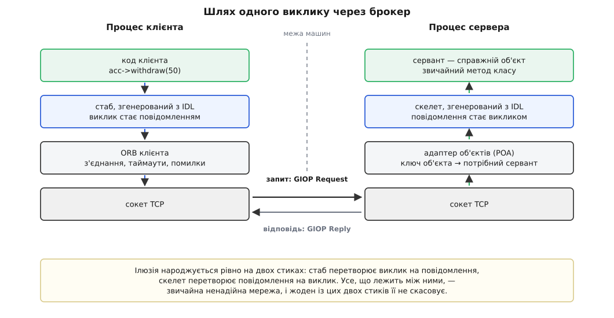
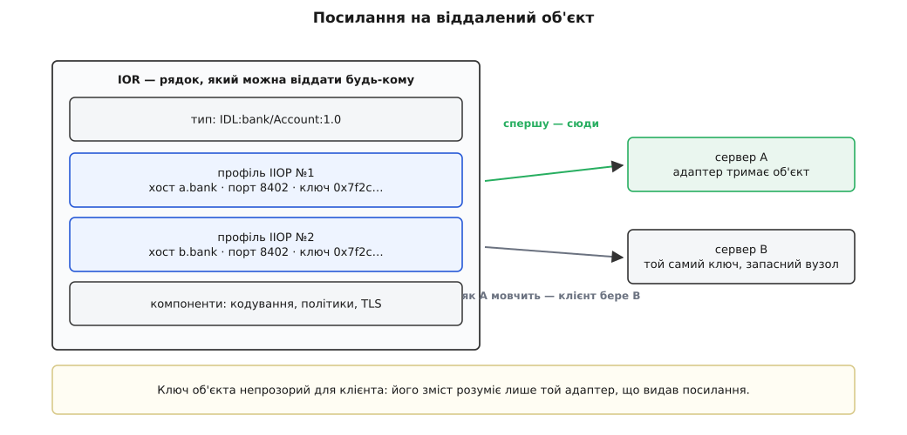
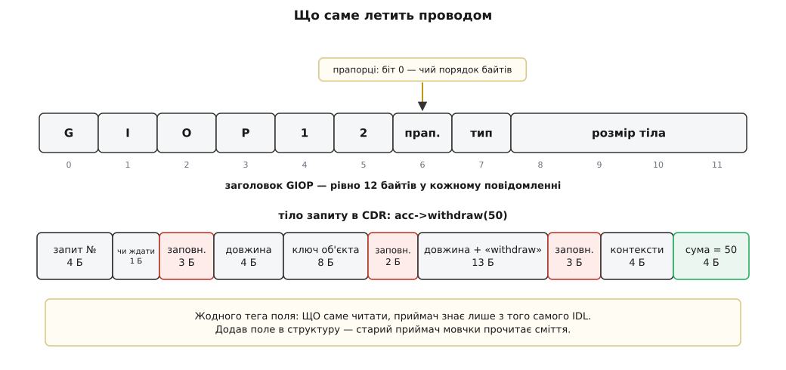
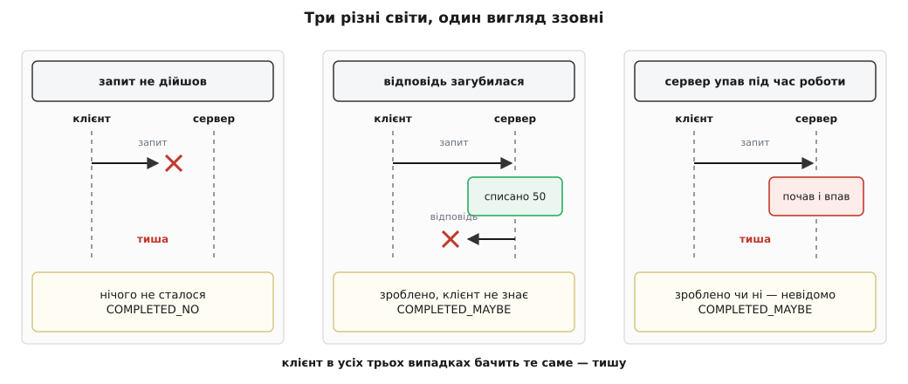

# CORBA і брокер об'єктних запитів

<preknowlist>
- [RPC і серіалізація](topic:com-protocol/rpc) — ідея викликати процедуру на іншій машині і навіщо дані перед відправкою перетворюють на байти.
- [Інтерфейс проти реалізації](topic:sf-apps/interface-vs-implementation) — межа між обіцянкою, яку річ дає назовні, і механізмом усередині.
- [Поліморфізм і динамічне зв'язування](topic:sf-lang/polymorphism) — виклик через інтерфейс, коли справжній тип відомий лише під час виконання.
- [Сокети TCP/UDP](topic:sf-os/sockets-tcp-udp) — потік байтів між двома процесами і те, що з'єднання будь-коли може обірватися.
- [Порядок байтів](topic:sf-algorithms/bits-bytes-endianness) — чому те саме число дві машини кладуть у пам'ять по-різному.
- [Серіалізація даних](topic:com-protocol/data-serialization) — перетворення структури на потік байтів і назад.
- [Вісім оман розподілених обчислень](topic:sf-distributed/distributed-fallacies) — мережа не надійна, затримка не нульова, і частина системи відмовляє окремо від решти.
</preknowlist>

У тебе в руках об'єкт — банківський рахунок. Ти пишеш `acc->withdraw(50)`, і компілятор перетворює цей рядок на десяток машинних інструкцій: покласти аргумент, стрибнути за адресою, забрати результат. Операція коштує наносекунди й не має стану «можливо». Якщо процес живий, метод виконався; якщо процес мертвий, ти цього рядка вже не досягнув.

Тепер той самий рахунок живе на іншій машині, в чужому процесі, написаному іншою мовою, на іншій архітектурі. Що має статися між тим самим рядком коду й тим самим списанням п'ятдесяти?

Відповісти можна двома способами. Чесний: визнати, що це вже не виклик, а обмін повідомленнями, і змусити програміста писати саме обмін — з адресами, кодуванням, таймаутами й невизначеністю. Спокусливий: залишити рядок `acc->withdraw(50)` недоторканим і сховати мережу під ним. Другий шлях у 1990-х пройшли до самого кінця, і зробила це **CORBA** — Common Object Request Broker Architecture, «загальна архітектура брокера об'єктних запитів». Її механізми досі працюють усередині майже кожного сучасного засобу віддалених викликів. Її обіцянка не збулася жодного разу.

## Робота, яку хтось мусить зробити

Почнімо з найнаївнішої спроби. Хай клієнт просто відправить на сервер рядок `"withdraw 50"`, а сервер його розбере й виконає. Спроба розсипається на першому ж питанні, і кожен уламок стає окремою роботою.

**Кому саме?** На сервері не один рахунок, а мільйон. Локальний виклик мав адресу в пам'яті — вона однозначно вказувала на об'єкт. Через мережу адреса нічого не означає: чужа пам'ять, чужий процес, і після перезапуску сервера всі адреси інші. Отже, потрібне **посилання іншої природи**: щось, що переживає перезапуск, передається байтами і на сервері перетворюється назад на конкретний об'єкт.

**Що саме викликати?** Локально ім'я методу зникає ще під час компіляції — лишається зміщення у таблиці віртуальних функцій. Дві різні програми, зібрані різними компіляторами, не мають спільних зміщень. Значить, операцію треба назвати **явно**, і обидві сторони мусять однаково розуміти цю назву.

**Як передати аргументи?** Число `50` у пам'яті клієнта — це чотири байти в якомусь порядку, з якимось вирівнюванням, у якомусь поданні знака. Просто скопіювати шматок пам'яті не можна: сервер може класти байти навпаки. Потрібні **правила кодування**, однакові для обох, і код, що за цими правилами пакує й розпаковує.

**Хто донесе?** Байти самі не переходять з машини на машину: треба відкрити з'єднання, дочекатися, поки воно встановиться, послати, дочекатися відповіді. І треба вирішити, що робити, коли з'єднання рветься посеред обміну.

**Хто розбере на тому боці?** Прийшли байти. Треба зрозуміти, до якого об'єкта вони адресовані, знайти цей об'єкт (можливо, підняти його з бази даних), розпакувати аргументи, викликати справжній метод, спакувати результат.

**А якщо не вийшло?** Локальний виклик або відбувся, або програму вбито. Віддалений має третій вихід: не відбувся, відбувся, або **невідомо**. І цю третю можливість хтось мусить якось назвати клієнтові.

Шість робіт, і жодну не можна прибрати. Компонент, який бере їх на себе, називають **брокером об'єктних запитів** — ORB, Object Request Broker (англ. *broker* — маклер, посередник: той, хто зводить двох, які не знають один одного напряму). Клієнт віддає брокерові виклик, брокер знаходить того, хто вміє його виконати, і повертає результат. Сама назва CORBA — це опис такого посередника, зроблений так, щоб брокери різних виробників розуміли один одного.

## Контракт, який розуміють обидві сторони

Дві роботи — «як назвати операцію» і «як спакувати аргументи» — насправді одна: обидві сторони мусять мати **однаковий опис інтерфейсу**. І цей опис не може бути заголовним файлом C++, бо сервер може бути написаний на Java, а клієнт на Ada. Він не може бути й документацією для людини, бо код пакування й розпакування писати руками — це десятки місць, де помилка в один байт тихо псує число.

Отже, опис має бути **окремою мовою**, яку жодна зі сторін не виконує, але з якої обидві сторони породжують свій код. Така мова називається мовою опису інтерфейсів — IDL (Interface Definition Language). У CORBA вона виглядає так:

```idl
module bank {
  exception InsufficientFunds { long shortfall; };

  interface Account {
    readonly attribute string owner;
    long balance();
    void withdraw(in long amount) raises (InsufficientFunds);
    oneway void ping();
  };
};
```

Тут немає жодного рядка виконуваного коду — це чистий контракт. `in` означає, що аргумент іде тільки в один бік (є ще `out` і `inout`, і кожен коштує байтів у відповіді). `raises` оголошує помилку, яку операція має право повернути замість результату. `oneway` каже, що на цей виклик відповіді не буде взагалі — клієнт не чекає нічого й не дізнається навіть про невдачу. А `readonly attribute` виглядає як поле, але перетворюється на звичайну операцію-читача, тобто на окремий похід у мережу за кожним зверненням: дешевизна запису `acc->owner()` тут суто зорова.

Ідея відокремленого мовно-нейтрального контракту, з якого генерують код обом сторонам, ширша за CORBA і живе досі у всьому — від protobuf до опису повідомлень апаратів; окремо про сам цей прийом і його ціну — у статті про [мову опису інтерфейсів](topic:com-protocol/interface-definition-language).

Контракт пропускають через **компілятор IDL**, і він видає дві половини. Клієнтові — **стаб** (англ. *stub* — обрубок, корінець): клас із тими самими методами, що в інтерфейсі, але всередині кожного методу замість роботи стоїть пакування аргументів і відправка. Серверові — **скелет** (англ. *skeleton* — кістяк): код, який приймає повідомлення, розпаковує аргументи й викликає справжній метод справжнього об'єкта. Справжній об'єкт у термінах CORBA називають **сервантом** (англ. *servant* — той, хто прислуговує); скелет — це його кістяк, на який ORB натягує мережевий виклик.

Найважливіше про стаб: він реалізує **той самий інтерфейс**, що й сервант, тому код клієнта не бачить різниці. Це та сама механіка, що в патерні [проксі](topic:sf-apps/proxy), тільки замість делегування сусідньому об'єктові стаб делегує через провід. Один контракт — два різні втілення, і клієнт зв'язується з тим, яке йому підсунули.

Одне IDL дає код різними мовами. Ось той самий виклик у двох відображеннях, згенерованих з опису вище:

:::tabs
```cpp
// C++: посилання приходить нетипізованим, тому його треба звузити до інтерфейсу
CORBA::Object_var obj = orb->string_to_object(ior_string);
bank::Account_var acc = bank::Account::_narrow(obj);
if (CORBA::is_nil(acc)) { /* за цим посиланням не рахунок */ }

try {
    acc->withdraw(50);
    CORBA::Long left = acc->balance();
} catch (const bank::InsufficientFunds& e) {
    // помилка, оголошена в IDL: не вистачило e.shortfall
} catch (const CORBA::SystemException& e) {
    // помилка, якої в IDL немає: зламався сам виклик
}
```
```java
// Java: те саме IDL, те саме звуження, інші імена згенерованих класів
org.omg.CORBA.Object obj = orb.string_to_object(iorString);
bank.Account acc = bank.AccountHelper.narrow(obj);

try {
    acc.withdraw(50);
    int left = acc.balance();
} catch (bank.InsufficientFunds e) {
    // не вистачило e.shortfall
} catch (org.omg.CORBA.SystemException e) {
    // зламався сам виклик
}
```
:::

У цьому коді сховані дві речі, яких у локальному виклику не буває взагалі.

Перша — **звуження** (`_narrow` / `narrow`). Брокер віддає посилання нетипізованим, як `CORBA::Object`. Щоб дістати з нього `Account`, треба явно спитати: «а це справді рахунок?» І перевірити це локально неможливо — тип живе на іншій машині, тому звуження в загальному випадку означає **ще один похід у мережу**. Рядок, який виглядає як приведення типу, насправді може бути мережевим запитом; це перша тріщина в ілюзії, і вона з'являється ще до першого справжнього виклику.

Друга — **дві сім'ї винятків**. `InsufficientFunds` оголошений в IDL: це помилка предметної області, її передбачив автор інтерфейсу, вона однакова локально й віддалено. `SystemException` в IDL не оголошений і може прилетіти з **будь-якої** операції: обірвалося з'єднання, сервер не знайшов об'єкт, скінчився таймаут. Мова начебто дала звичайний виклик — а разом із ним віддала новий клас помилок, від яких локальний код не захищався ніколи.

Повна анатомія контракту — які типи взагалі є в IDL, як `oneway` відрізняється від звичайної операції, що таке ідентифікатор репозиторію `IDL:bank/Account:1.0`, і чому відображення на C++ з його `_var`, `_ptr` і ручним звільненням стало найчастішою причиною витоків і аварій, — винесена в [довідник контракту й відображення на C++](topic:com-protocol/corba-object-broker/api-idl-cpp-mapping.md).



*Виклик спускається клієнтською колонкою до проводу і піднімається серверною. Обидва згенеровані шари — стаб і скелет — існують лише заради того, щоб на краях ланцюга виклик виглядав звичайним. Усе, що між ними, лишається мережею з усіма її властивостями.*

## Посилання, у якому захована адреса

Стаб знає, **що** викликати. Лишається питання, **де**. Локальний вказівник тут не годиться, тому CORBA вводить власне подання посилання — **IOR**, Interoperable Object Reference, «сумісне посилання на об'єкт». Це не адреса в пам'яті, а структура, яку можна записати байтами, надрукувати рядком і передати хоч поштою.

Усередині IOR лежить ідентифікатор типу (`IDL:bank/Account:1.0`) і **список профілів**. Профіль — це один спосіб дістатися об'єкта: для найпоширенішого, IIOP, він містить хост, порт і **ключ об'єкта** — непрозорий шматок байтів, який щось означає тільки для сервера, що це посилання видав.



*Посилання несе в собі маршрут, а не адресу пам'яті. Кілька профілів — це кілька входів до того самого об'єкта, тож клієнт може обійти мовчазний вузол, нічого не знаючи про топологію.*

Непрозорість ключа — рішення, а не недбалість. Якби клієнт розумів, що всередині, він почав би на це спиратися, і сервер утратив би право змінити спосіб зберігання об'єктів. Ключ пише адаптер об'єктів, читає той самий адаптер, і між ними немає нікого, хто мав би право знати його будову; це та сама межа інтерфейсу й реалізації, тільки проведена всередині одного посилання.

Список профілів дає дещо більше за адресу. Кілька профілів означають кілька входів до того самого об'єкта, тому клієнтський ORB може мовчки перебрати їх, коли перший не відповідає — балансування й відмовостійкість, зашиті прямо в посилання, без жодного стороннього вузла. Скільки цього досить і де починається справжнє [балансування навантаження](topic:sf-distributed/load-balancing) з окремим розподільником — окрема тема; тут важливо, що посилання перестало бути просто адресою і стало **носієм політики**.

Лишається питання курки і яйця: щоб покликати об'єкт, потрібен IOR, а щоб дістати IOR, треба когось покликати. Найгрубіше рішення — надрукувати IOR у файл: він виглядає як `IOR:010000002000000049444c3a…`, тобто шістнадцятковий запис тих самих байтів, і його можна передати як завгодно. Практичне рішення — окрема служба імен: об'єкт із наперед відомим посиланням, у якого можна спитати «дай мені рахунок Петренка» й отримати IOR. Це рівно та сама роль, яку в сучасних системах грає [виявлення сервісів](topic:sf-distributed/service-discovery): один вузол, який знає, де решта, і сам мусить бути знайдений якось інакше.

## Байти в проводі

Найдовше CORBA була несумісною сама з собою. Перша версія 1991 року описала мову інтерфейсів і поведінку брокера, але **не описала формат повідомлень** — тож брокери різних виробників однаково виглядали з коду й не могли обмінятися жодним байтом. Спільний провід з'явився лише у версії 2.0 в серпні 1996 року, і саме він зробив CORBA тим, чим її пам'ятають.

Формат складається з двох шарів. **GIOP** (General Inter-ORB Protocol) описує повідомлення: запит, відповідь, скасування, закриття з'єднання, помилку. **IIOP** (Internet Inter-ORB Protocol) — це GIOP, покладений на TCP/IP; підтримка IIOP стала обов'язковою умовою називатися сумісним із CORBA 2.0.

Кожне повідомлення починається з дванадцяти байтів заголовка: чотири букви `GIOP`, два байти версії, байт прапорців, байт типу повідомлення, чотири байти розміру тіла. У байті прапорців сидить рішення, варте окремої уваги: **нульовий біт каже, у якому порядку байтів написане повідомлення**. Відправник пише так, як йому природно, і просто зізнається в цьому; перекладає той, кому це потрібно. Дві машини однакової архітектури — а це переважна більшість пар — не витрачають на перестановку байтів жодного такту.

Тіло кодують за правилами **CDR** (Common Data Representation, «спільне подання даних»). Правила короткі: кожен примітив лежить на межі, кратній його розміру, а між полями за потреби вставляють байти-заповнювачі; рядок — це довжина плюс символи плюс нуль у кінці; послідовність — довжина плюс елементи. Це те саме вирівнювання, що й у структурах у пам'яті, тільки рахується від початку повідомлення — детальніше про сам прийом і його пастки в [пакуванні бінарного протоколу](topic:com-protocol/wire-format-packing).

І тут ховається властивість, яка згодом коштувала CORBA дуже дорого: **у потоці немає жодного тега поля**. Ні імені, ні номера, ні типу — самі значення підряд. Приймач знає, що читати, виключно з того, що в нього є **той самий IDL**.

**Умова: виклик `withdraw(50)` для об'єкта з восьмибайтовим ключем, GIOP 1.2, аргумент типу `long`.** Порахуймо, де що лежить, відлічуючи зміщення від початку повідомлення:

```
0…3     "GIOP"                                    4 Б
4…5     версія 1.2                                2 Б
6       прапорці: 0x01 (little-endian)            1 Б
7       тип повідомлення: 0 = Request             1 Б
8…11    розмір тіла                               4 Б
12…15   номер запиту = 1            (вирівн. 4)   4 Б
16      чи потрібна відповідь = 3                 1 Б
17…19   зарезервовано                             3 Б
20…21   вид адресації = 0 (за ключем)(вирівн. 2)  2 Б
22…23   заповнювач до межі 4                      2 Б
24…27   довжина ключа = 8                         4 Б
28…35   ключ об'єкта                              8 Б
36…39   довжина рядка = 9           (вирівн. 4)   4 Б
40…48   "withdraw\0"                              9 Б
49…51   заповнювач до межі 4                      3 Б
52…55   службові контексти: 0 штук                4 Б
56…59   amount = 50                 (вирівн. 4)   4 Б
                                                 ────
разом                                            60 Б
поле «розмір тіла» = 60 − 12 =                   48 Б
```

Шістдесят байтів на чотири байти корисного аргументу, з них вісім — чистий заповнювач заради вирівнювання. Це не марнотратство: службова частина майже вся піде на ідентифікацію об'єкта й назву операції, без яких обійтися не можна, і текстовий формат на тих самих даних вийшов би вдвічі-втричі більшим. Дорого коштує інше — **жорсткість**. Додай у структуру одне поле, і зміщення всіх наступних поповзуть; старий приймач читатиме ті самі байти за старою розкладкою й отримає не помилку, а тихо неправильні числа.



*Заголовок сталої довжини, далі — щільно вкладені поля з проміжками рівно там, де вимагає вирівнювання. Тег поля не передають ніколи, тож розуміння потоку цілком тримається на тому, що обидві сторони зібрані з одного опису.*

> 🔧 **Навіщо це.** Коли розподілена система «мовчить», уміння прочитати перші дванадцять байтів у перехопленому трафіку відрізняє годину від тижня: за буквами `GIOP` видно, що з'єднання взагалі живе, за байтом типу — хто кого не дочекався, за розміром тіла — чи повідомлення обірвалося посередині. І та сама розкладка одразу пояснює, чому «ми ж тільки додали поле» зламало сусідній сервіс, який ніхто не перезбирав.

Серед типів відповіді є один, вартий уваги окремо: **LOCATION_FORWARD**. Замість результату сервер має право відповісти «цей об'єкт тепер тут» і віддати нове посилання; клієнтський ORB мовчки повторює виклик за новою адресою, а код клієнта не дізнається нічого. Цим одним рішенням закриваються переїзд об'єкта на інший вузол, розвантаження перевантаженого сервера й підміна адреси під час оновлення — усе те, що сьогодні роблять переспрямуванням у HTTP і оновленням запису в реєстрі сервісів.

## Хто на тому боці

Повідомлення долетіло. Тепер сервер має за ключем знайти об'єкт і викликати метод. Наївне рішення — тримати в пам'яті таблицю «ключ → вказівник» — розсипається на перших же реальних числах: банк має мільйони рахунків, і тримати мільйон живих об'єктів заради десятка, до яких сьогодні звернуться, безглуздо.

Тому між проводом і сервантами стоїть окремий шар — **адаптер об'єктів**. Його робота ширша за пошук у таблиці: вирішити, чи існує такий об'єкт узагалі; якщо існує, але зараз не в пам'яті — створити сервант і підняти стан із бази; якщо об'єктів мільйон, а поведінка в них однакова — обслужити всіх одним сервантом, який щоразу дивиться на ключ; вирішити, з якого потоку робити виклик. Адаптер — це те місце, де віддалений об'єкт перестає бути фікцією й стає конкретною змінною в конкретному процесі.

У ранніх версіях адаптер описали настільки нечітко, що серверний код доводилося переписувати під кожного виробника брокера — і саме сервер, а не клієнт, виявився непереносним. Заміну — **POA**, Portable Object Adapter, «переносний адаптер об'єктів» — увели у версії 2.2 в лютому 1998 року, і вона витіснила старий адаптер зі специфікації. POA описує поведінку через набір політик: чи переживають посилання перезапуск процесу; хто призначає ключі — адаптер чи програміст; чи тримати сервант між викликами, чи створювати щоразу; що робити, коли об'єкта немає — відмовити чи спитати менеджер сервантів. Один процес може мати кілька POA з різними політиками: рахунки — постійні й піднімаються з бази, тимчасові підписки — живуть лише поки живий процес.

Серверний бік із такою будовою виглядає просто:

```cpp
// Сервант — звичайний клас C++, що успадковує згенерований скелет.
class AccountImpl : public POA_bank::Account {
    CORBA::Long balance_;
public:
    explicit AccountImpl(CORBA::Long start) : balance_(start) {}

    CORBA::Long balance() override { return balance_; }

    void withdraw(CORBA::Long amount) override {
        if (amount > balance_) {
            bank::InsufficientFunds e;
            e.shortfall = amount - balance_;
            throw e;                    // помилка з IDL — долетить до клієнта як є
        }
        balance_ -= amount;             // виклик прийшов із пулу потоків ORB:
    }                                   // без блокування тут буде гонитва

    void ping() override {}
};
```

Метод не знає, що його покликали з мережі, — і це рівно те, чого домагалися. Але коментар про гонитву не декоративний: брокер обслуговує з'єднання [пулом потоків](topic:sf-tasks/thread-pool), тож два клієнти легко потрапляють у той самий сервант одночасно. Локальний об'єкт, який усе життя був однопотоковим, від переїзду за мережу мовчки стає спільним ресурсом. Ілюзія прозорості тримається на рівні синтаксису й ламається на рівні семантики — і це ще найлагідніший спосіб, яким вона ламається.

Щоб побачити всі шість робіт брокера в одному місці, їх варто один раз написати самому: таблиця ключів, диспетчеризація за назвою операції, пакування з вирівнюванням, дванадцятибайтовий заголовок. Мініатюрний брокер на C++, який робить справжній віддалений виклик через TCP і на якому видно кожен байт, розібрано покроково в [проєкті «власний брокер за триста рядків»](topic:com-protocol/corba-object-broker/proj-mini-broker.md).

## Де ілюзія тріскає

Тепер видно всю машинерію — і видно, що вона працює. Питання, яке вирішило долю всієї ідеї, інше: чи можна на цій машинерії втримати обіцянку, що віддалений виклик **не відрізняється** від локального.

Найглибша тріщина — у самому понятті невдачі. Локальний виклик має два наслідки: виконався або процес помер разом із тобою. Віддалений має три, і третій новий.



*Три різні світи — гроші не рушили, гроші пішли, гроші пішли наполовину — і в усіх трьох клієнт отримує однакову тишу. Розрізнити їх з боку клієнта неможливо в принципі, тому будь-яка відповідь на таймаут — це рішення під невизначеністю.*

CORBA не сховала цього — навпаки, зафіксувала в самому типі помилки. Кожен системний виняток несе поле **completion status** із трьома значеннями: `COMPLETED_NO` (операція точно не почалася), `COMPLETED_YES` (точно завершилася, зламалося вже потім) і `COMPLETED_MAYBE` — «не знаю». Специфікація, збудована на обіцянці, що віддалений виклик такий самий, як локальний, у власному типі помилки письмово зізналася, що це неправда: локальний виклик значення `MAYBE` не має.

> 🔧 **Навіщо це.** З `COMPLETED_MAYBE` випливає геть практичне правило, яке пережило CORBA й діє в кожному сучасному сервісі: **операцію, яку клієнт може повторити, треба спроєктувати так, щоб повтор нічого не змінював**. Тому `withdraw(50)` — поганий інтерфейс для мережі, а `apply_transfer(id, −50)` із перевіркою вже застосованого `id` — добрий. Механіка цього — в [ідемпотентності](topic:sf-distributed/idempotency), а рішення «повторювати чи ні і скільки» — у [повторах із відступом](topic:sf-distributed/retries-backoff) і [бюджеті часу](topic:sf-distributed/timeouts-deadlines).

Друга тріщина — **ціна виклику**. Локальний метод коштує наносекунди, тому інтерфейси проєктують дрібними: окремий метод на кожне поле, цикл із тисячею звернень — нормально. Той самий інтерфейс за мережею коштує сотні мікросекунд на виклик у межах машинної зали й десятки мілісекунд між містами. Балакучий інтерфейс, який локально працював бездоганно, після переїзду за провід стає непридатним, і полагодити це можна лише **зміною самого інтерфейсу** — віддавати одразу структуру замість десяти окремих запитань. Прозорість розташування обіцяла, що об'єкт можна пересунути за мережу, не чіпаючи код; на практиці саме код і доводилося переписувати.

Третя — **час життя**. Локальний об'єкт хтось звільняє: власник, [підрахунок посилань](topic:sf-lang/reference-counting) або [збирач сміття](topic:sf-lang/garbage-collection). Обидва механізми спираються на те, що всі учасники живі й досяжні. Клієнт за мережею може зникнути, не сказавши нічого: вимкнули живлення, обірвався канал. Розподілений підрахунок посилань у такому світі перетворюється на генератор вічних витоків, тому CORBA розподіленого збирача сміття не має взагалі. Замість нього — тайм-аути й витіснення сервантів адаптером, тобто те, що в загальному вигляді називають [м'яким станом](topic:sf-distributed/soft-state): об'єкт живе, доки хтось підтверджує, що він потрібен.

Ці три тріщини — не помилки реалізації. Вони описані в роботі «A Note on Distributed Computing» (Jim Waldo, Geoff Wyant, Ann Wollrath, Sam Kendall; Sun Microsystems Laboratories, технічний звіт TR-94-29, листопад 1994), і головна її теза сформульована задовго до занепаду CORBA: об'єкти, що взаємодіють через мережу, **принципово інші** за об'єкти в спільному просторі пам'яті — через затримку, інший доступ до пам'яті, одночасність і часткову відмову. Спроби заретушувати різницю, писали автори, тримаються лише поки система мала; на масштабі підприємства вони розсипаються. Це не легенда й не післясмак поразки — стаття вийшла на піку зростання CORBA і читається сьогодні як точний прогноз. Той самий висновок ширше розгорнуто у [восьми оманах розподілених обчислень](topic:sf-distributed/distributed-fallacies).

## Версія, якої не було

Є ще одна рана, і вона вбила більше проєктів, ніж усі тріщини прозорості разом.

Система живе роками, інтерфейси змінюються. У CORBA версія вшита в ідентифікатор типу: `IDL:bank/Account:1.0`. Здається, що механізм є. Але подивімося, що станеться, коли до структури, яку повертає операція, треба додати одне поле.

Формат CDR не має тегів. Приймач читає поля підряд, за розкладкою зі свого IDL. Новий сервер пише на одне поле більше — старий клієнт прочитає його байти як частину наступного поля. Помилки не буде: буде число не з того місця. Єдиний спосіб цього уникнути — оголосити **новий інтерфейс** (`Account2`, або `IDL:bank/Account:1.1`) і змусити сервер підтримувати обидва, або перезібрати й перезапустити геть усіх учасників одночасно. У системі з двох програм це прикро; у системі з двохсот — неможливо.

Те, що прийшло на зміну, різниться в одній деталі кодування. У protobuf кожне поле має номер, а незнайомі поля приймач зберігає й передає далі незміненими; додавання поля не ламає нікого й не вимагає узгодженого перезапуску. Це не хитріше кодування — це **інша відповідь на питання, чи буде схема колись іншою**. CORBA відповіла «схема одна на всіх, бо контракт спільний»; світ відповів «схема змінюватиметься завжди, і формат мусить це витримати». Механіку сумісності вперед і назад розібрано в [еволюції схем](topic:com-protocol/schema-registry), а спосіб змінювати живий контракт без зупинки — у [прийомі expand–contract](topic:sf-release/expand-contract) і [версіонуванні API](topic:com-protocol/api-versioning).

## Мережа, що не пускає

Остання перешкода прийшла не з архітектури, а з реальності 2000-х. IIOP відкриває з'єднання на довільний порт, часто в обидва боки: для зворотних викликів сервер сам стукає до клієнта. Усередині однієї машинної зали це природно. Крізь корпоративний міжмережевий екран і [трансляцію адрес](topic:com-transport/nat) це не проходить майже ніколи: назовні відкриті кілька портів, вхідних з'єднань до клієнта не буває взагалі.

Спробу описати проходження екранів OMG зробила, але жодного широко втіленого рішення з неї не вийшло. Тим часом інший спосіб віддаленого виклику — SOAP, а згодом і звичайний [HTTP](topic:com-protocol/http) із текстовими тілами — мав вирішальну перевагу: він ішов портом, який і так відкритий скрізь. Технічно він був гірший — багатослівніший, повільніший, без нормальної типізації. Розгортався він у корпоративній мережі за півдня, а не за квартал перемовин із безпекою, і цього виявилося досить.

## Що з цього лишилося живим

CORBA перестала бути мейнстримом дуже швидко, і причини описав зсередини Michi Henning, автор однієї з канонічних книжок про CORBA й учасник процесу стандартизації, у статті «The Rise and Fall of CORBA» (ACM Queue, 2006). Його претензії поділені надвоє. Технічні: роздуті й непослідовні інтерфейси — на адаптер об'єктів пішло понад двісті рядків опису там, де вистачило б близько тридцяти; відображення на C++ із пастками в керуванні пам'яттю, безпеці винятків і потокобезпечності; відсутність вбудованих засобів захисту й версіонування. І глибша, процесна: стандарт ухвалювали **до того, як хтось його реалізовував**, — від подавачів не вимагали робочого втілення, тому в специфікацію потрапляли красиві на папері речі, які на практиці не працювали, а голосування виробників зводило конкурентні пропозиції в одну, що збирала їхні особливості разом. Це погляд учасника, а не нейтральний вимір: Douglas C. Schmidt, автор одного з найшвидших брокерів, публічно сперечався з частиною висновків. Але напрям критики визнали навіть опоненти. Як саме консорціум ішов від задуму 1989 року до цього фіналу — розібрано в [історії злету й падіння CORBA](topic:com-protocol/corba-object-broker/hist-corba-rise-fall.md).

Кінець цієї лінії добре видно за однією датою: у Java 9 підтримку CORBA оголосили застарілою, а в Java 11 модулі просто вилучили з платформи — рішенням JEP 320 у 2018 році. Мова, яка колись возила корпоративні застосунки поверх IIOP, викинула це зі стандартної бібліотеки.

І при цьому майже все, що CORBA придумала, працює просто зараз під іншими іменами.

Опис інтерфейсу окремою мовою з генерацією коду обом сторонам — це protobuf, Thrift, Cap'n Proto, описи повідомлень апаратів. Стаб і скелет живуть у кожному з них під власними назвами. Двійковий формат із вирівнюванням, де тип відомий наперед, а не з потоку, дійшов до логічної межі в [форматах без копіювання](topic:sf-data/zero-copy-serialization). Службові контексти, які CORBA чіпляла до кожного запиту, і перехоплювачі, які їх читали, — це метадані й перехоплювачі сучасних засобів віддалених викликів, і саме на цьому механізмі тримається [розподілений трейсинг](topic:sf-release/distributed-tracing). Відповідь LOCATION_FORWARD — предок переспрямування задля живої міграції. Кілька профілів в одному посиланні — предок списку адрес, який віддає реєстр сервісів. Адаптер об'єктів із політиками часу життя й пулом потоків стоїть усередині будь-якого серверного каркаса, навіть якщо його ніхто так не називає. Сам консорціум OMG нікуди не зник і веде живий стандарт розподіленої взаємодії — DDS, побудований на іншій моделі: не виклик віддаленого об'єкта, а публікація даних у теми, як у [публікації-підписці](topic:sf-distributed/publish-subscribe); саме він працює основою обміну в ROS 2.

Не вижила рівно одна річ — сама обіцянка. Сучасний віддалений виклик не вдає, що він локальний: у ньому термін виконання видно в сигнатурі, статус помилки відділений від значення, потокова передача оголошена явно, а повтор — свідоме рішення того, хто кличе. Механізми брокера виявилися правильними, і їх успадкували всі. Хибним був намір сховати за ними мережу — бо приховати можна синтаксис виклику, а не той факт, що між двома половинами програми лежить простір, у якому повідомлення губляться, а відповідь «не знаю» є повноцінною відповіддю.
