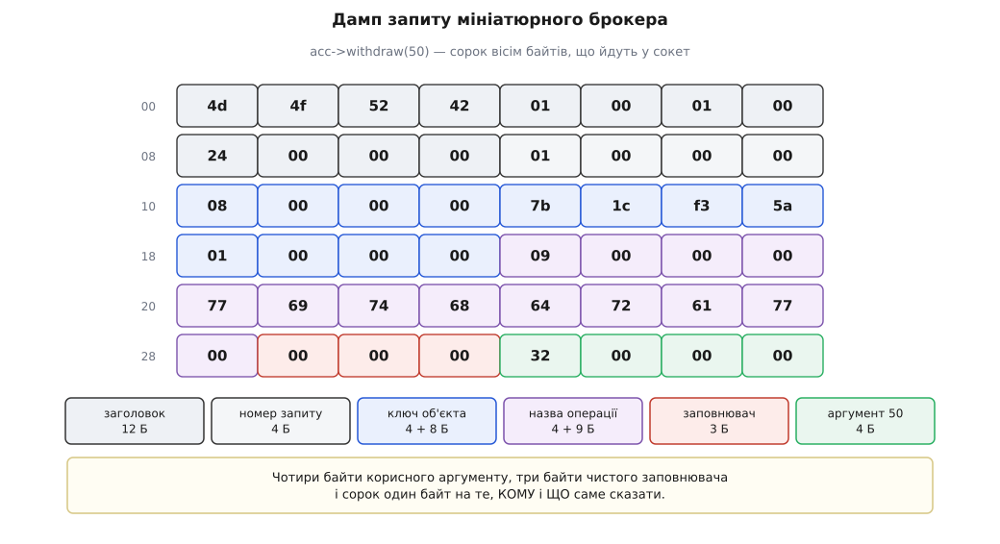
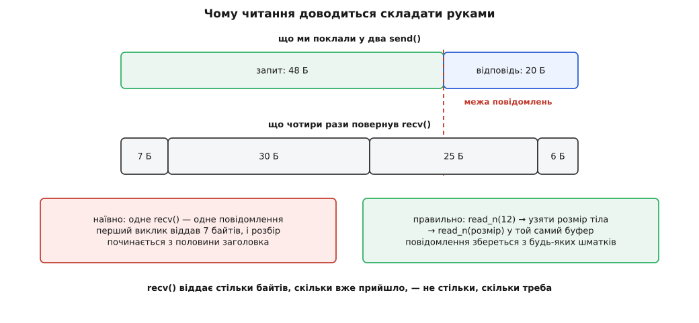

# ⚙️ Брокер об'єктних запитів за триста рядків

Тут зібрано робочий мініатюрний ORB на C++: клієнт виконує `acc->withdraw(50)`, і ці п'ятдесят справді списуються з об'єкта в іншому процесі — через TCP, власним двійковим форматом, з таблицею об'єктів і диспетчеризацією за назвою операції. Сенс вправи не в тому, щоб отримати ще один брокер, а в тому, щоб побачити кожен байт: усе, що звичайно ховає генератор коду, тут лежить рядком коду й парою цифр у дампі.

<preknowlist>
- [Сокети TCP/UDP](topic:sf-os/sockets-tcp-udp) — потік байтів між двома процесами; `send` і `recv` не зберігають меж повідомлень, а з'єднання будь-коли рветься.
- [Кадрування повідомлень у потоці TCP](topic:com-protocol/tcp-message-framing) — як із суцільного потоку дістати назад окремі повідомлення: префікс довжини й накопичувач, що збирає шматки.
- [Пакування бінарного протоколу](topic:com-protocol/wire-format-packing) — правила, за якими число перетворюється на певні байти в певному місці буфера.
- [Порядок байтів](topic:sf-algorithms/bits-bytes-endianness) — чому те саме число дві машини кладуть у пам'ять по-різному.
- [Поліморфізм і динамічне зв'язування](topic:sf-lang/polymorphism) — виклик через інтерфейс, коли справжній тип відомий лише під час виконання; саме на цьому тримається підміна справжнього об'єкта посередником.
</preknowlist>

## Умова

Два процеси. У серверному живе звичайний клас C++ із балансом усередині. У клієнтському є вказівник на інтерфейс:

```idl
interface Account {
  long balance();
  void withdraw(in long amount) raises (InsufficientFunds);
};
```

Правила гри навмисно жорсткі, бо кожне послаблення сховало б щось цікаве.

**Без компілятора IDL.** Стаб і скелет пишемо руками — рівно те, що згенерував би компілятор, приблизно по сорок рядків на інтерфейс. Так видно, що саме генерація робить і чому її взагалі вигадали.

**Клієнт не бачить мережі.** У коді клієнта стоїть `Account*` і жодного згадування сокета, порту чи буфера.

**Три типи.** `long`, `string` і `sequence<octet>` — цього досить, щоб описати і сам протокол, і корисне навантаження.

**Одне з'єднання, один потік, синхронний обмін.** Іграшка не бореться за паралельність, зате чесно доводить виклик до кінця.

**Помилка не мовчить.** Клієнт має розрізняти «не вистачило грошей» і «зламався виклик», а в другому випадку — знати, чи встигла операція виконатися.

Критерій готовності один: побачити дамп справжнього повідомлення й пояснити в ньому кожен байт.

## Задум: шість шматків

Робіт, які бере на себе будь-який брокер, шість, і кожна перетворюється на окремий шматок коду:

```
назвати аргументи байтами           Out / In                   ≈ 70 рядків
сказати, де початок і кінець        put_header, recv_message    ≈ 45 рядків
донести до іншого процесу           read_n, write_all, tcp_*    ≈ 55 рядків
знайти потрібний об'єкт             ObjectTable                 ≈ 30 рядків
зрозуміти, що саме викликати        AccountSkeleton             ≈ 35 рядків
зробити виклик схожим на локальний  AccountStub                 ≈ 55 рядків
                                                                ───────────
                                                                ≈ 290 рядків
```

Плюс два коротких `main`. Більше половини — це буфер і транспорт, тобто саме те, чого в локальному виклику немає взагалі.

## Буфер: де саме лежить число

Покласти `int32_t` у вектор байтів мало. Приймач мусить знати дві речі, яких у самих байтах не написано: **за яким зміщенням** шукати значення і **в якому порядку** складати з байтів число. Обидві домовленості треба ухвалити один раз і тримати обома сторонами.

Порядок байтів вирішується не так, як підказує звичка. Спокуса — оголосити один порядок мережевим і завжди перекладати в нього; ціна — перестановка на кожному числі в кожному повідомленні, навіть коли обидві машини однакові. Дешевше зробити навпаки: **відправник пише так, як йому природно, і ставить у заголовку прапорець**, а перекладає той приймач, чия природа інша. Оскільки переважна більшість пар — це дві машини однакової архітектури, перестановки не відбувається взагалі ніколи. Саме так зроблено в GIOP, і ми повторюємо це рішення.

Зміщення вирішується правилом вирівнювання: кожен примітив лежить на межі, кратній його розміру, а проміжки заповнюють байтами-заповнювачами. Але від чого відлічувати межу?

Це найтихіша пастка всієї конструкції. Здається природним рахувати від початку **тіла** — адже заголовок службовий і до даних не належить. У CDR рахують від початку **всього повідомлення**, разом із дванадцятибайтовим заголовком. Різниця в дванадцять байтів здається несуттєвою — і справді не помітна, доки в протоколі лише чотирибайтові числа: `12 % 4 == 0`, обидва способи дають те саме. А потім хтось додає в структуру `double`:

```
розкладка від початку повідомлення     розкладка від початку тіла
──────────────────────────────────     ──────────────────────────
12…15  номер запиту (4)                12…15  номер запиту (4)
16…23  double          (16 % 8 == 0)   16…19  заповнювач до межі 8
                                       20…27  double  (тіло: 8 % 8 == 0)
```

Числа лягли зі зсувом у чотири байти. Помилки при цьому не буде: приймач прочитає вісім байтів, з яких половина — верхівка справжнього числа, а половина — те, що лежало далі, складе з них цілком законний `double` і віддасть його як результат — без жодної ознаки, що біти взялися не звідти. Тому в коді нижче буфер тримає **все повідомлення разом із заголовком**, а не саме тіло: тоді вирівнювання рахується від нуля буфера й помилитися ніде.

> 🔧 **Навіщо це.** Правило «межа відлічується від початку повідомлення, а не від початку твого шматка» переживає CORBA й діє скрізь, де кадр складають із кількох шарів. Якщо два незалежно написані розбирачі сходяться на всіх полях і розходяться рівно там, де з'явилося восьмибайтове число, — шукати треба не помилку в коді, а розбіжність у тому, звідки кожен із них лічить нуль. Механіку самого вирівнювання, вже в пам'яті, а не в проводі, розібрано у [вирівнюванні даних](topic:sf-apps/memory-alignment).

Ось увесь буфер запису:

```cpp
#include <cstdint>
#include <cstring>
#include <string>
#include <vector>
#include <array>
#include <fstream>
#include <cstdio>
#include <stdexcept>

inline bool host_is_little() {
    const uint16_t probe = 0x0001;
    uint8_t first;
    std::memcpy(&first, &probe, 1);      // memcpy, а не каст: без порушення аліасування
    return first == 1;
}

inline uint32_t bswap32(uint32_t v) {
    return (v >> 24) | ((v >> 8) & 0x0000FF00u)
         | ((v << 8) & 0x00FF0000u) | (v << 24);
}

class Out {
    std::vector<uint8_t> b_;
public:
    const std::vector<uint8_t>& bytes() const { return b_; }

    void align(size_t a) { while (b_.size() % a) b_.push_back(0); }

    void raw(const void* p, size_t n) {
        const uint8_t* s = static_cast<const uint8_t*>(p);
        b_.insert(b_.end(), s, s + n);
    }
    void u8 (uint8_t  v) { b_.push_back(v); }
    void u32(uint32_t v) { align(4); raw(&v, 4); }   // рідний порядок байтів
    void i32(int32_t  v) { align(4); raw(&v, 4); }
    void f64(double   v) { align(8); raw(&v, 8); }

    void str(const std::string& s) {
        u32(static_cast<uint32_t>(s.size() + 1));    // нуль у кінці ВХОДИТЬ у довжину
        raw(s.data(), s.size());
        b_.push_back(0);
    }
    void patch_u32(size_t at, uint32_t v) { std::memcpy(&b_[at], &v, 4); }
};
```

Рядок кодується як довжина, символи й нуль у кінці — і нуль **входить** у довжину. Це виглядає надлишковим: довжина вже все сказала, нащо ще термінатор? Пояснення історичне й прикладне водночас: приймач на C може віддати вказівник просто в буфер як `const char*` без копіювання й дописування нуля. Ціна — постійна плутанина, чи `len` уже містить нуль, чи ще ні. Помилка на одиницю тут не падає, а зсуває всі наступні поля рівно на байт, тож правило варте того, щоб записати його в коментарі поруч із кодом.

Буфер читання дзеркальний, з одним доповненням: він перевіряє межі на **кожній** операції, бо довжини в повідомленні прислав хтось чужий.

```cpp
class In {
    const uint8_t* p_;
    size_t n_, at_ = 0;
    bool swap_;
    void need(size_t k) const {
        if (k > n_ - at_) throw std::runtime_error("повідомлення обірване або збрехало про довжину");
    }
public:
    In(const uint8_t* p, size_t n, bool swap) : p_(p), n_(n), swap_(swap) {}

    void skip(size_t k)  { need(k); at_ += k; }
    void align(size_t a) { size_t k = (a - at_ % a) % a; need(k); at_ += k; }

    void raw(void* dst, size_t k) { need(k); std::memcpy(dst, p_ + at_, k); at_ += k; }

    uint8_t  u8()  { uint8_t v; raw(&v, 1); return v; }
    uint32_t u32() { align(4); uint32_t v; raw(&v, 4); return swap_ ? bswap32(v) : v; }
    int32_t  i32() { return static_cast<int32_t>(u32()); }

    std::string str() {
        uint32_t len = u32();
        if (len == 0) throw std::runtime_error("рядок без нуля в кінці");
        need(len);                                   // перевірка ДО виділення пам'яті
        std::string s(len - 1, '\0');
        raw(&s[0], len - 1);
        if (u8() != 0) throw std::runtime_error("рядок без нуля в кінці");
        return s;
    }
    std::vector<uint8_t> octets(uint32_t k) {
        need(k);
        std::vector<uint8_t> v(k);
        raw(v.data(), k);
        return v;
    }
};
```

Зверни увагу на `octets`: послідовність байтів **не перевертають ніколи**, хоч би який прапорець стояв у заголовку. Байт — уже найменша одиниця, перевертати в ньому нічого, і саме тому ключ об'єкта варто зберігати як байти, а не як числа: тоді жоден проміжний код не спробує бути розумним і поміняти в ньому щось місцями.

## Дванадцять байтів заголовка

Заголовок відповідає на три питання, на які саме тіло відповісти не може: чи це взагалі наше повідомлення, як його читати і де воно закінчується.

```cpp
enum : uint8_t  { MSG_REQUEST = 0, MSG_REPLY = 1 };
enum : uint32_t { REPLY_OK = 0, REPLY_USER_EX = 1, REPLY_SYS_EX = 2 };

void put_header(Out& o, uint8_t type) {
    o.raw("MORB", 4);                       // 0…3   мітка: наш це потік чи ні
    o.u8(1); o.u8(0);                       // 4…5   версія
    o.u8(host_is_little() ? 1 : 0);         // 6     біт 0 — порядок байтів
    o.u8(type);                             // 7     запит чи відповідь
    o.u32(0);                               // 8…11  розмір тіла — залатаємо потім
}

void finish(Out& o) {
    // розмір відомий лише тоді, коли тіло вже написане
    o.patch_u32(8, static_cast<uint32_t>(o.bytes().size() - 12));
}
```

Розкладка навмисно повторює GIOP: чотири байти мітки, два байти версії, байт прапорців із порядком байтів у нульовому біті, байт типу повідомлення, чотири байти розміру тіла. Мітку взято іншу — `MORB` замість `GIOP`, — щоб ніхто не сплутав іграшку зі справжнім протоколом і не спробував нею з чимось з'єднатися.

Розмір тіла записується **після** того, як тіло написане: наперед він невідомий, бо залежить від довжини назви операції й заповнювачів. Звідси й `patch_u32` — правка вже записаного місця. Альтернатива — рахувати розмір заздалегідь окремою функцією — дає другу реалізацію тієї самої розкладки, і рано чи пізно ці дві реалізації розійдуться.

Тіло запиту складається з чотирьох частин: номер запиту, ключ об'єкта, назва операції, аргументи. Тіло відповіді — з номера запиту, статусу й того, що статус обіцяє.

## Таблиця об'єктів: чому в ключі сидить номер життя процесу

Ключ об'єкта для клієнта непрозорий: жменя байтів, яку він отримав і мусить повернути незміненою. Для сервера це те, з чого треба дістати конкретний сервант. Найдешевше рішення — індекс у векторі.

Але самого індексу мало, і причина не в елегантності. Клієнт зберіг ключ, сервер перезапустився, об'єкти створилися в іншому порядку. Індекс `1` після перезапуску вказує вже не на рахунок Петренка, а на рахунок Коваленка — і `withdraw(50)` мовчки спише гроші не в того. Помилки не буде взагалі: ключ дійсний, об'єкт існує, операція є.

Ліки — покласти в ключ **номер життя процесу**: значення, яке щоразу інше. Тоді старий ключ не збігається з поточним і чесно дає «такого об'єкта немає».

```cpp
class AccountSkeleton;                           // визначимо нижче

class ObjectTable {
    uint32_t incarnation_;                       // «номер життя» цього процесу
    std::vector<AccountSkeleton*> slots_;
public:
    explicit ObjectTable(uint32_t inc) : incarnation_(inc) {}

    std::array<uint8_t, 8> activate(AccountSkeleton* sk) {
        uint32_t idx = static_cast<uint32_t>(slots_.size());
        slots_.push_back(sk);
        std::array<uint8_t, 8> key{};
        std::memcpy(key.data(),     &incarnation_, 4);
        std::memcpy(key.data() + 4, &idx,          4);
        return key;                              // для клієнта — просто вісім байтів
    }

    AccountSkeleton* find(const std::vector<uint8_t>& key) const {
        if (key.size() != 8) return nullptr;
        uint32_t inc, idx;
        std::memcpy(&inc, key.data(),     4);
        std::memcpy(&idx, key.data() + 4, 4);
        if (inc != incarnation_) return nullptr; // ключ із минулого життя процесу
        return idx < slots_.size() ? slots_[idx] : nullptr;
    }
};
```

> 🔧 **Навіщо це.** Той самий прийом стоїть скрізь, де ідентифікатор переживає того, хто його видав: номер покоління в записі реєстру, номер епохи в лідерських протоколах, тег версії в кеші. Правило одне — **ідентифікатор мусить нести в собі, ким і коли він виданий**, інакше повторне використання номера перетворює застарілий доступ на успішний доступ не туди. Це найдешевша страховка від помилки, яку неможливо помітити з логів.

Справжній адаптер об'єктів кладе в ключ ще й випадкові байти — щоб ключ не можна було вгадати перебором, — і вміє піднімати сервант із бази на вимогу. Наша таблиця вміє лише знайти вже створене.

## Скелет: диспетчеризація за назвою

Скелет робить рівно одне перетворення: з назви операції й байтів аргументів — у справжній виклик методу.

```cpp
struct InsufficientFunds { int32_t shortfall; };

class Account {                                   // спільний контракт обох сторін
public:
    virtual ~Account() = default;
    virtual int32_t balance() = 0;
    virtual void withdraw(int32_t amount) = 0;
};

class AccountImpl : public Account {              // сервант: звичайний клас C++
    int32_t balance_;
public:
    explicit AccountImpl(int32_t start) : balance_(start) {}
    int32_t balance() override { return balance_; }
    void withdraw(int32_t amount) override {
        if (amount > balance_) throw InsufficientFunds{amount - balance_};
        balance_ -= amount;
    }
};

class AccountSkeleton {
    Account* servant_;
public:
    explicit AccountSkeleton(Account* s) : servant_(s) {}

    void invoke(const std::string& op, In& in, Out& reply) {
        if (op == "balance") {
            int32_t v = servant_->balance();
            reply.u32(REPLY_OK);
            reply.i32(v);
        } else if (op == "withdraw") {
            int32_t amount = in.i32();            // читаємо строго за контрактом
            try {
                servant_->withdraw(amount);
                reply.u32(REPLY_OK);
            } catch (const InsufficientFunds& e) {
                reply.u32(REPLY_USER_EX);
                reply.str("IDL:bank/InsufficientFunds:1.0");
                reply.i32(e.shortfall);
            }
        } else {
            reply.u32(REPLY_SYS_EX);
            reply.str("BAD_OPERATION");
        }
    }
};
```

Ланцюжок `if`-ів за назвою операції — саме те, що генератор коду написав би за тебе. Він і показує, чому виклик через мережу дорожчий за локальний навіть без урахування проводу: локально ім'я методу зникає ще під час компіляції й лишається зміщенням у таблиці віртуальних функцій, а тут воно летить рядком і порівнюється рядком на кожному запиті.

Порядок запису у відповідь важливий: спершу статус, потім те, що цей статус обіцяє. Приймач інакше не знає, чи читати результат, чи виняток. Той самий принцип у справжньому GIOP: `ReplyStatusType` іде першим, і вже від нього залежить розбір решти.

Ідентифікатор винятку в тілі відповіді — не прикраса. Операція може оголосити кілька винятків, і клієнт мусить якось відрізнити, який саме прилетів; за самими байтами вони невідрізненні.

## Стаб: той самий інтерфейс, інше нутро

Стаб успадковує `Account` — той самий клас, що й сервант. Саме тому код клієнта не бачить різниці: він тримає `Account*` і викликає віртуальний метод, а вже який об'єкт за цим вказівником, вирішує той, хто його створив.

```cpp
enum Completion { COMPLETED_NO, COMPLETED_YES, COMPLETED_MAYBE };
struct SystemException { std::string id; Completion completed; };

class AccountStub : public Account {
    int fd_;
    std::vector<uint8_t> key_;
    uint32_t next_id_ = 1;

    void begin(Out& o, const char* op) {
        put_header(o, MSG_REQUEST);
        o.u32(next_id_++);
        o.u32(static_cast<uint32_t>(key_.size()));
        o.raw(key_.data(), key_.size());
        o.str(op);
    }

    In call(Out& o, std::vector<uint8_t>& reply) {
        finish(o);
        size_t sent = 0;
        if (!write_all(fd_, o.bytes().data(), o.bytes().size(), &sent))
            throw SystemException{"COMM_FAILURE",
                                  sent == 0 ? COMPLETED_NO : COMPLETED_MAYBE};
        if (!recv_message(fd_, reply))
            throw SystemException{"COMM_FAILURE", COMPLETED_MAYBE};   // ось вона

        bool swap = ((reply[6] & 1) != 0) != host_is_little();
        In in(reply.data(), reply.size(), swap);
        in.skip(12);
        in.u32();                                   // номер запиту
        uint32_t status = in.u32();

        if (status == REPLY_USER_EX) {
            std::string id = in.str();
            if (id == "IDL:bank/InsufficientFunds:1.0")
                throw InsufficientFunds{in.i32()};
            throw SystemException{"UNKNOWN", COMPLETED_YES};
        }
        if (status == REPLY_SYS_EX)
            throw SystemException{in.str(), COMPLETED_MAYBE};
        return in;
    }
public:
    AccountStub(int fd, std::vector<uint8_t> key) : fd_(fd), key_(std::move(key)) {}

    int32_t balance() override {
        Out o; begin(o, "balance");
        std::vector<uint8_t> r;
        In in = call(o, r);
        return in.i32();
    }
    void withdraw(int32_t amount) override {
        Out o; begin(o, "withdraw"); o.i32(amount);
        std::vector<uint8_t> r;
        call(o, r);
    }
};
```

Найважливіші три рядки тут — ті, що ставлять `Completion`. Якщо `send` зламався, не віддавши ядру жодного байта, операція точно не почалася — `COMPLETED_NO`. Якщо хоч щось пішло, а далі обірвалося, ми вже не знаємо нічого — `COMPLETED_MAYBE`. І якщо запит пішов цілком, а відповідь не прийшла, — теж `MAYBE`: між «сервер не отримав» і «сервер зробив і не встиг відповісти» з боку клієнта немає жодної різниці. Локальний виклик такого значення не має взагалі, і саме в цьому місці ілюзія «це просто метод» уперше стає неправдою на рівні типів.

`std::vector<uint8_t> r` оголошено **зовні** `call` навмисно: `In` тримає вказівник у цей буфер, тож буфер мусить пережити читання результату.

## Транспорт: складати доводиться руками

```cpp
#include <cerrno>
#include <unistd.h>
#include <sys/socket.h>
#include <netinet/in.h>
#include <arpa/inet.h>

bool read_n(int fd, uint8_t* dst, size_t n) {
    size_t got = 0;
    while (got < n) {
        ssize_t k = ::recv(fd, dst + got, n - got, 0);
        if (k == 0) return false;                       // партнер закрив з'єднання
        if (k < 0) { if (errno == EINTR) continue; return false; }
        got += static_cast<size_t>(k);
    }
    return true;
}

bool write_all(int fd, const uint8_t* src, size_t n, size_t* sent) {
    *sent = 0;
    while (*sent < n) {
        ssize_t k = ::send(fd, src + *sent, n - *sent, 0);
        if (k < 0) { if (errno == EINTR) continue; return false; }
        if (k == 0) return false;
        *sent += static_cast<size_t>(k);
    }
    return true;
}

bool recv_message(int fd, std::vector<uint8_t>& msg) {
    msg.assign(12, 0);
    if (!read_n(fd, msg.data(), 12)) return false;
    if (std::memcmp(msg.data(), "MORB", 4) != 0) return false;

    bool swap = ((msg[6] & 1) != 0) != host_is_little();
    uint32_t body;
    std::memcpy(&body, msg.data() + 8, 4);
    if (swap) body = bswap32(body);
    if (body > (1u << 20)) return false;                // стеля: чужий байт не з'їсть пам'ять

    msg.resize(12 + body);                              // заголовок ЛИШАЄТЬСЯ в буфері
    return body == 0 || read_n(fd, msg.data() + 12, body);
}
```

Два рядки тут варті окремої уваги. `msg.resize(12 + body)` дописує тіло до вже прочитаного заголовка — тому все повідомлення лежить одним шматком і вирівнювання лічиться від нуля буфера, як і домовлялися. А `body > (1u << 20)` — це відповідь на просте питання: довжину прислав хтось із мережі, і якщо повірити їй без стелі, чотири байти `ff ff ff ff` перетворяться на спробу виділити чотири гігабайти.

Решта транспорту — прямолінійна:

```cpp
int tcp_listen(uint16_t port) {                  // POSIX; у Winsock ті самі виклики,
    int s = ::socket(AF_INET, SOCK_STREAM, 0);   // але інші типи дескриптора й помилок
    int one = 1;
    ::setsockopt(s, SOL_SOCKET, SO_REUSEADDR, &one, sizeof one);
    sockaddr_in a{};
    a.sin_family = AF_INET;
    a.sin_port = htons(port);
    a.sin_addr.s_addr = htonl(INADDR_LOOPBACK);
    ::bind(s, reinterpret_cast<sockaddr*>(&a), sizeof a);
    ::listen(s, 4);
    return s;
}

int tcp_connect(const char* host, uint16_t port) {
    int s = ::socket(AF_INET, SOCK_STREAM, 0);
    sockaddr_in a{};
    a.sin_family = AF_INET;
    a.sin_port = htons(port);
    ::inet_pton(AF_INET, host, &a.sin_addr);
    if (::connect(s, reinterpret_cast<sockaddr*>(&a), sizeof a) != 0) { ::close(s); return -1; }
    return s;
}
```

## Обидва боки цілком

Сервер: створити сервант, зареєструвати його в таблиці, покласти ключ у файл — це наш найгрубіший замінник посилання на об'єкт — і крутити цикл «прийняти повідомлення, розібрати, відповісти».

```cpp
void serve_one(int fd, ObjectTable& table) {
    std::vector<uint8_t> msg;
    while (recv_message(fd, msg)) {
        if (msg[7] != MSG_REQUEST) continue;
        bool swap = ((msg[6] & 1) != 0) != host_is_little();

        In in(msg.data(), msg.size(), swap);
        in.skip(12);                                  // нуль вирівнювання — початок msg

        Out reply;
        try {
            uint32_t rid = in.u32();
            std::vector<uint8_t> key = in.octets(in.u32());
            std::string op = in.str();

            put_header(reply, MSG_REPLY);
            reply.u32(rid);

            AccountSkeleton* sk = table.find(key);
            if (!sk) { reply.u32(REPLY_SYS_EX); reply.str("OBJECT_NOT_EXIST"); }
            else     { sk->invoke(op, in, reply); }
        } catch (const std::exception&) {
            reply = Out();                            // розбір не вдався — починаємо заново
            put_header(reply, MSG_REPLY);
            reply.u32(0);
            reply.u32(REPLY_SYS_EX);
            reply.str("MARSHAL");
        }
        finish(reply);
        size_t sent = 0;
        if (!write_all(fd, reply.bytes().data(), reply.bytes().size(), &sent)) break;
    }
    ::close(fd);
}

int main() {
    ObjectTable table(0x5AF31C7Bu);                   // у житті — випадкове число
    AccountImpl petrenko(1000);
    AccountSkeleton sk(&petrenko);
    auto key = table.activate(&sk);

    std::ofstream("account.ref", std::ios::binary)
        .write(reinterpret_cast<const char*>(key.data()), key.size());

    int srv = tcp_listen(5099);
    for (;;) {
        int c = ::accept(srv, nullptr, nullptr);
        if (c >= 0) serve_one(c, table);              // один клієнт за раз
    }
}
```

Клієнт після кількох рядків налаштування працює зі звичайним вказівником на інтерфейс:

```cpp
int main() {
    std::ifstream f("account.ref", std::ios::binary);
    std::vector<uint8_t> key((std::istreambuf_iterator<char>(f)),
                              std::istreambuf_iterator<char>());

    AccountStub stub(tcp_connect("127.0.0.1", 5099), key);
    Account* acc = &stub;                             // далі про мережу ні слова

    try {
        acc->withdraw(50);
        std::printf("залишок: %d\n", acc->balance());
    } catch (const InsufficientFunds& e) {
        std::printf("не вистачило %d\n", e.shortfall);
    } catch (const SystemException& e) {
        std::printf("зламався виклик: %s, статус %d\n", e.id.c_str(), (int)e.completed);
    }
}
```

Рядок `acc->withdraw(50)` тепер справді змінює число в чужому процесі. І він же ховає за собою всі триста рядків, які ми щойно написали.

## Дамп: як виклик стає сорока вісьмома байтами

Ось що насправді пішло в сокет, коли клієнт на машині з молодшим байтом попереду виконав `acc->withdraw(50)`:

```
0000  4d 4f 52 42  01 00 01 00   MORB, версія 1.0, прапорці 0x01, тип 0
0008  24 00 00 00  01 00 00 00   розмір тіла = 36, номер запиту = 1
0010  08 00 00 00  7b 1c f3 5a   довжина ключа = 8, номер життя процесу
0018  01 00 00 00  09 00 00 00   індекс об'єкта = 1, довжина назви = 9
0020  77 69 74 68  64 72 61 77   "withdraw"
0028  00 00 00 00  32 00 00 00   нуль рядка, 3 байти заповнювача, 50
```

Проходимо по зміщеннях, лічачи їх від початку повідомлення:

```
0…3     "MORB"                                   4 Б
4…5     версія 1.0                               2 Б
6       прапорці: 0x01 — молодший байт попереду  1 Б
7       тип: 0 = Request                         1 Б
8…11    розмір тіла = 36            (вирівн. 4)  4 Б
12…15   номер запиту = 1            (вирівн. 4)  4 Б
16…19   довжина ключа = 8           (вирівн. 4)  4 Б
20…27   ключ об'єкта: байти, не число            8 Б
28…31   довжина назви = 9           (вирівн. 4)  4 Б
32…40   "withdraw\0"                             9 Б
41…43   заповнювач до межі 4                     3 Б
44…47   amount = 50                 (вирівн. 4)  4 Б
                                                ────
разом                                           48 Б
```



*Кожна клітинка — реальний байт із дампа. Заповнювач між нулем рядка й аргументом узявся не з примхи: наступне чотирибайтове число мусить лягти на межу, кратну чотирьом.*

Число `50` — це `0x32`, і воно лежить як `32 00 00 00`: молодший байт попереду. Приймач із протилежним порядком байтів побачить у прапорцях одиницю, порівняє зі своєю природою і поверне байти на місце. Приймач із таким самим порядком не зробить нічого.

Відповідь на цей запит коротша:

```
0000  4d 4f 52 42  01 00 01 01   MORB, версія 1.0, прапорці 0x01, тип 1 = Reply
0008  08 00 00 00  01 00 00 00   розмір тіла = 8, номер запиту = 1
0010  00 00 00 00               статус: 0 = без винятку, результату немає
```

Двадцять байтів на те, щоб сказати «зроблено». Якби грошей не вистачило, замість нуля стояла б одиниця, а за нею — рядок `IDL:bank/InsufficientFunds:1.0` і чотири байти нестачі.

## Пастки

### З TCP не приходить «повідомлення»

Найчастіша помилка в такому коді — вважати, що одне `recv` віддає одне повідомлення. Не віддає: TCP — це потік байтів, і `recv` повертає стільки, скільки вже прийшло, безвідносно до того, скільки тобі треба. Два послані повідомлення можуть склеїтися в одне читання, а одне послане — розсипатися на чотири.



*Межі, які поставив відправник, у потоці не збереглися. Приймач відновлює їх сам — і єдиний спосіб це зробити тримається на тому, що розмір записано в самому повідомленні.*

Тому `read_n` крутить цикл, доки не набере рівно `n` байтів, а `recv_message` читає двічі: спершу дванадцять байтів заголовка, потім рівно стільки, скільки заголовок пообіцяв. Це і є кадрування префіксом довжини — той самий прийом, яким живуть усі двійкові протоколи поверх потоку; ширше про нього — у [кадруванні повідомлень у потоці TCP](topic:com-protocol/tcp-message-framing).

Симетрична пастка на боці відправника: `send` теж має право взяти лише частину буфера, коли вікно передавання заповнене. Тому `write_all` теж цикл — і саме кількість уже відданих байтів стає тим, від чого залежить `Completion` у помилці.

### Довжина, яку прислав хтось інший

Кожна довжина в повідомленні — це число з мережі. Наївне `msg.resize(12 + body)` без перевірки перетворює чотири байти `ff ff ff ff` на спробу виділити чотири гігабайти, а `std::string s(len - 1, '\0')` із `len == 0` — на виділення близько чотирьох мільярдів символів через беззнакове переповнення. Обидві помилки — не теорія: це класика розбирачів двійкових протоколів. Звідси два правила в коді: стеля на розмір повідомлення й перевірка меж **до** виділення пам'яті, а не після.

### Нуль у кінці рядка

Довжина рядка в CDR містить термінатор, тож `"withdraw"` — це `9`, а не `8`. Помилка тут не падає й не кричить: вона зсуває всі наступні поля на один байт, і аргумент читається зі сміття. Тому `In::str` не просто відрізає останній байт, а **перевіряє**, що він справді нуль: коли розбір поїхав, краще дізнатися про це негайно й локально, ніж отримати списання на мільярд і три дні шукати причину.

### Відповідь загубилася

Клієнт послав запит, сервер списав п'ятдесят, і тут обірвалося з'єднання. Клієнт бачить рівно те саме, що бачив би, якби запит узагалі не дійшов, — тишу. Наш стаб чесно кидає `SystemException` зі статусом `COMPLETED_MAYBE`, і на цьому його чесність закінчується: що робити далі, він не знає й знати не може.

Спокуслива відповідь — повторити. Для `balance()` це безпечно: читання нічого не змінює, повтор дасть те саме число. Для `withdraw(50)` повтор — це друге списання з імовірністю п'ятдесят на п'ятдесят. Різниця не в мережі, а в **інтерфейсі**: операція, яку не можна безпечно повторити, для мережі спроєктована погано. Лікується це не брокером, а формою виклику — переказ із власним номером, який сервер запам'ятовує й другий раз не застосовує; механіку розібрано в [ідемпотентності](topic:sf-distributed/idempotency), а рішення «повторювати чи ні і скільки разів» — у [повторах із відступом](topic:sf-distributed/retries-backoff).

І ще одне: наш `recv` блокується назавжди. Якщо сервер завис, не закривши з'єднання, клієнт висітиме разом із ним, доки хтось не вб'є процес. Найдешевша латка — `SO_RCVTIMEO` на сокеті; правильна відповідь — окремий бюджет часу на весь виклик, а не на одне читання, як у [таймаутах і бюджеті часу](topic:sf-distributed/timeouts-deadlines).

## Скільки це коштує

```
корисне навантаження запиту                  4 Б  (одне число)
службова частина                            44 Б  (заголовок, ключ, назва, заповнювач)
відповідь без результату                    20 Б
на один виклик у проводі                    68 Б
```

Сорок чотири байти службової частини на чотири корисних — це не марнотратство: майже все з них іде на те, КОМУ і ЩО сказати, і без цього виклик не адресується. Найдорожче тут — назва операції рядком: дев'ять байтів плюс довжина плюс заповнювач, разом шістнадцять із сорока чотирьох. Числовий код операції лишив би від цих шістнадцяти чотири, тобто вкоротив би запит на чверть, — але вимагав би узгодженої таблиці кодів, тобто ще одного місця, де дві сторони мусять збігтися й де розбіжність тиха.

Витрат процесора на пакування майже немає: `Out` — це один `std::vector`, який переросте кілька разів на початку й далі житиме на своїй ємності. Перестановки байтів немає взагалі, доки обидві машини однакові. Час виклику визначається геть не цим: на тому самому вузлі це десятки мікросекунд, у межах машинної зали — сотні, між містами — десятки мілісекунд. Локальний виклик того самого методу коштує одиниці наносекунд, тобто різниця в чотири-п'ять десяткових порядків, і жодна оптимізація пакування її не зачепить.

## Чого тут немає порівняно зі справжнім ORB

Іграшка робить усі шість робіт брокера — і саме тому добре видно, скільки роботи лишилося за кадром.

**Немає генератора.** Стаб і скелет написані руками для одного інтерфейсу. Другий інтерфейс — ще сорок рядків тієї самої механічної праці, і кожна її помилка тиха. Компілятор IDL існує не для зручності, а тому що людина неминуче помиляється в такому коді.

**Немає посилання, лише ключ.** Наш «IOR» — вісім байтів у файлі. У ньому немає ні типу об'єкта, ні хоста, ні порту, ні списку запасних входів, ні компонентів із політиками. Клієнт мусить знати адресу наперед; справжнє посилання носить маршрут у собі.

**Немає перевірки типу.** Ми віримо, що за ключем справді `Account`. Немає ні звуження, ні ідентифікатора репозиторію в запиті — надішли ключ від іншого об'єкта, і скелет спробує викликати на ньому `withdraw`.

**Немає одночасності.** Одне з'єднання, один клієнт, суворий порядок «запит — відповідь». Номер запиту в нас декоративний; у справжньому GIOP він потрібен саме тому, що по одному з'єднанню летить багато запитів одночасно й відповіді приходять у довільному порядку. Додати це — означає завести таблицю очікувань і окремий потік читача, а з ним і всі питання [пулу потоків](topic:sf-tasks/thread-pool): два клієнти легко потраплять в один сервант одночасно, і поле `balance_` доведеться захищати.

**Немає розбиття довгих повідомлень.** Справжній GIOP уміє слати повідомлення частинами (`Fragment`), щоб не тримати в пам'яті все одразу. Ми читаємо тіло цілком і тому поставили стелю в мегабайт.

**Немає службових контекстів і перехоплювачів.** До кожного запиту справжній брокер дозволяє причепити пари «ключ — байти», яких не бачить прикладний код: ідентифікатор транзакції, дані про безпеку, ідентифікатор трасування. Саме на цьому механізмі стоїть увесь сучасний наскрізний трейсинг.

**Немає переспрямування.** Відповіді «цей об'єкт тепер за іншою адресою» ми не вміємо ні надіслати, ні виконати, тож жива міграція об'єкта неможлива.

**Немає життєвого циклу серванта.** Наша таблиця тримає всі об'єкти живими вічно. Справжній адаптер має політики: піднімати сервант на вимогу, витісняти невживані, обслуговувати мільйон об'єктів одним сервантом, який щоразу дивиться на ключ, — саме те, без чого банк на мільйон рахунків не працює.

**Немає `oneway`, `out`/`inout`, складених типів.** Ні структур, ні послідовностей, ні `any` з описом типу всередині, ні динамічного виклику операції, назву якої дізналися під час роботи. Кожна з цих можливостей коштує окремих правил кодування.

**Немає безпеки, стиснення, узгодження кодувань, версіонування контракту.** Додай у відповідь одне поле — і старий клієнт мовчки прочитає число не з того місця, бо тегів у потоці немає. Це не наша недоробка, а властивість самого класу форматів: вона однаково є і в іграшці, і в оригіналі.

Список довгий — і в ньому головний висновок вправи. Триста рядків вистачає, щоб віддалений виклик **запрацював**: два процеси, одна машина, одна версія контракту, один клієнт за раз. Усе, чого тут немає, потрібне рівно тоді, коли учасників стає більше двох, машин більше однієї, а версій контракту більше однієї. Саме на цьому «всьому іншому» справжні брокери й виросли до розмірів, за які їх потім лаяли.
