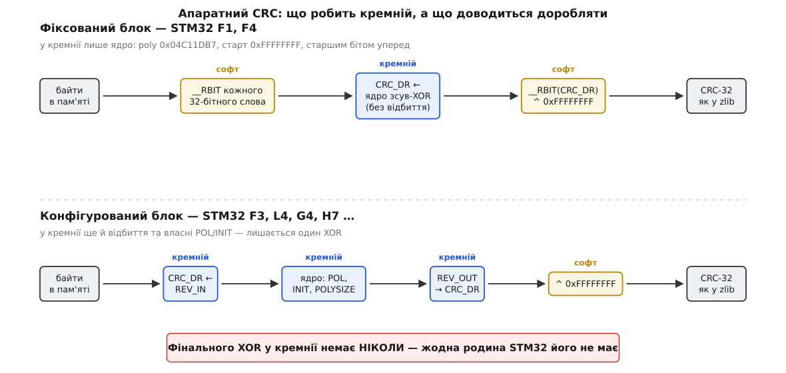
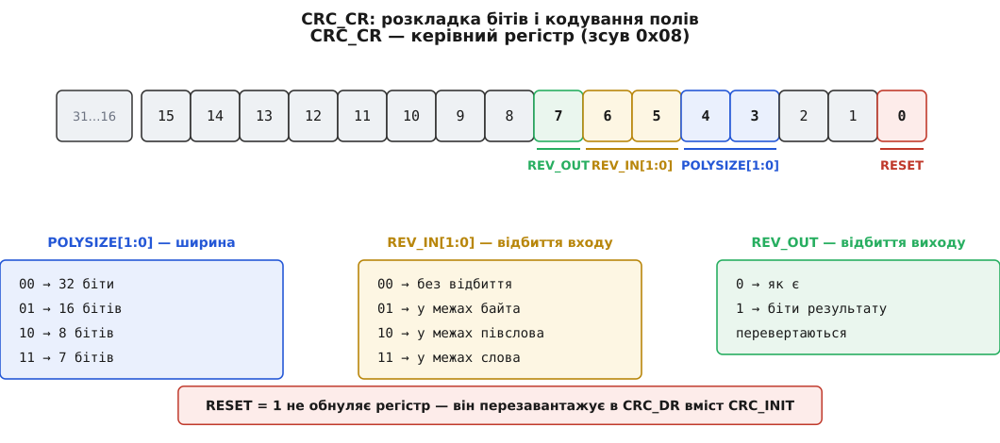

# 📋 Контракт апаратного CRC-блоку: регістри STM32 і ROM-функції ESP32

Це сторінка-контракт: мапа регістрів CRC-периферії STM32 з точними зсувами й полями, сигнатури готових CRC-функцій у ROM ESP32 — і робочий приклад, після якого залізо видає рівно те саме число, що `zlib.crc32` на комп'ютері. Усі адреси, біти й імена звірено з CMSIS-заголовками STMicroelectronics (`stm32f103xb.h`, `stm32f303xe.h`, `stm32f407xx.h`, `stm32l476xx.h`, `stm32g431xx.h`, `stm32h743xx.h`), з драйверами HAL і LL та з заголовком `esp_rom_crc.h` в ESP-IDF; кожне контрольне значення в тексті пораховано, а не переписано.

<preknowlist>
- [Регістри, відображені в пам'ять](topic:hw-arch/memory-mapped-io) — периферія виглядає як комірки за фіксованими адресами, а звертання до них у C йде через `volatile`; уся ця сторінка — саме такі комірки.
- [Біти й порядок байтів](topic:sf-algorithms/bits-bytes-endianness) — старший і молодший біт у байті, порядок байтів у слові; без цього не зрозуміти жодного рядка про «відбиття».
- [Увімкнення тактування периферії](topic:hw-arch/peripheral-clock-enable) — на STM32 вимкнений вузол читається як нулі й мовчки ковтає записи, тож перший крок будь-якої роботи з блоком — біт у RCC.
- [CMSIS](topic:sf-devices/cmsis) — шар ARM і ST, звідки беруться `CRC->DR`, іменовані маски `CRC_CR_REV_IN_0` і вбудована функція `__RBIT`.
</preknowlist>

## Кремнію бракує однієї ручки — і завжди тієї самої

Профіль CRC — це шість параметрів: ширина, поліном, старт, відбиття входу, відбиття виходу, фінальний XOR. Апаратний блок STM32 у найкращому разі має **п'ять** із них. Фінального XOR немає в жодній родині: після останнього байта ви читаєте з `CRC_DR` голу остачу й XOR-ите її самі. Це не недогляд конкретної серії, а стала риса вузла — саме тому будь-який робочий приклад нижче закінчується рядком `^ 0xFFFFFFFF` у програмі.

Друга нерівність — між поколіннями блоку. Старший вузол (STM32 F1, F4) не має ані регістра полінома, ані регістра старту, ані бітів відбиття: у ньому зашито одну-єдину функцію. Новіший (F0, F3, L4, G4, H7 і далі) додає щонайменше регістр старту `CRC_INIT` і біти відбиття, а в більшості родин — ще й регістр полінома `CRC_POL` із полем ширини `POLYSIZE`. Розрізняти їх треба не за назвою серії, а за самим блоком: **є `CRC_POL` — поліном програмований; є лише `DR`, `IDR`, `CR` — блок фіксований.**


*Де проходить шов між кремнієм і програмою. Угорі — фіксований блок (F1, F4): у залізі лише ядро зсув-XOR із зашитим поліномом і стартом, тож обидва відбиття лягають на процесор. Унизу — конфігурований блок: відбиття входу й виходу, старт і поліном задаються регістрами, а програмі лишається єдина дія. Фінального XOR не робить жодна родина — це та ланка, яку контракт залишає вам завжди.*

## Адреси, тактування, склад блоку

| Родина | База CRC | Біт тактування | Регістри в блоці | Що програмується |
| --- | --- | --- | --- | --- |
| STM32F1 | `0x40023000` | `RCC->AHBENR` біт 6 | DR, IDR, CR | нічого (лише скидання) |
| STM32F4 | `0x40023000` | `RCC->AHB1ENR` біт 12 | DR, IDR, CR | нічого (лише скидання) |
| STM32F0 (молодші) | `0x40023000` | `RCC->AHBENR` біт 6 | DR, IDR, CR, INIT | старт, відбиття |
| STM32F3 | `0x40023000` | `RCC->AHBENR` біт 6 | DR, IDR, CR, INIT, POL | усе, крім фінального XOR |
| STM32L4 | `0x40023000` | `RCC->AHB1ENR` біт 12 | DR, IDR, CR, INIT, POL | усе, крім фінального XOR |
| STM32G4 | `0x40023000` | `RCC->AHB1ENR` біт 12 | DR, IDR, CR, INIT, POL | усе, крім фінального XOR |
| STM32H7 | `0x58024C00` | `RCC->AHB4ENR` біт 19 | DR, IDR, CR, INIT, POL | усе, крім фінального XOR |

Молодші STM32F0 (скажімо, F030) — проміжний випадок: `CRC_INIT` і біти відбиття вже є, а `CRC_POL` ще немає, тож поліном лишається `0x04C11DB7` завширшки 32 біти. Родичі з тієї самої серії при цьому можуть мати повний набір — ще одна причина дивитися на склад блоку, а не на назву.

## Мапа регістрів

**Фіксований блок — STM32 F1, F4.** Три регістри, і два з них майже без роботи.

| Зсув | Регістр | Ширина доступу | Після скидання | Що робить |
| --- | --- | --- | --- | --- |
| `0x00` | `CRC_DR` | 32 біти | `0xFFFFFFFF` | запис — згодувати блокові слово; читання — біжуча остача |
| `0x04` | `CRC_IDR` | 8 бітів | `0x00` | вільний байт-нотатник, до обчислення не причетний |
| `0x08` | `CRC_CR` | 32 біти | `0x00000000` | лише біт 0 — `RESET`, який ставлять записом і який самоскидається |

**Конфігурований блок — STM32 F0, F3, L4, G4, H7 і далі.** Ті самі три плюс два нових; зсув `0x0C` зарезервовано.

| Зсув | Регістр | Ширина доступу | Після скидання | Що робить |
| --- | --- | --- | --- | --- |
| `0x00` | `CRC_DR` | 8, 16 або 32 біти | `0xFFFFFFFF` | запис годує блок; **ширина доступу задає, скільки бітів зайде** |
| `0x04` | `CRC_IDR` | 8 бітів (F0, F3, L4) або 32 (G4, H7) | `0x00` | нотатник, який переживає `RESET` |
| `0x08` | `CRC_CR` | 32 біти | `0x00000000` | `RESET`, `POLYSIZE`, `REV_IN`, `REV_OUT` |
| `0x10` | `CRC_INIT` | 32 біти | `0xFFFFFFFF` | значення, що лягає в `CRC_DR` за `RESET` |
| `0x14` | `CRC_POL` | 32 біти | `0x04C11DB7` | поліном у **нормальному** записі, старшим бітом уперед |

Ширина `CRC_IDR` — дрібниця, об яку спотикається переносний код: на L4 це `__IO uint8_t`, на G4 і H7 — `__IO uint32_t`, тож структура `CRC_TypeDef` у цих родин різна за розкладкою, і зсув `CR` тримається на `0x08` лише завдяки полям-заповнювачам.

## CRC_CR — поле за полем


*Керівний регістр цілком уміщається в молодший байт. Ширина полінома, відбиття входу й відбиття виходу — три поля, які й перетворюють «блок з одним зашитим CRC» на «блок під будь-який іменований профіль». Біт `RESET` не обнуляє нічого: він перезавантажує в `CRC_DR` вміст `CRC_INIT`, тому старт із нуля треба задавати явно, записавши нуль у `CRC_INIT`.*

| Біти | Поле | Значення |
| --- | --- | --- |
| 0 | `RESET` | запис 1 перезавантажує `CRC_DR` зі `CRC_INIT`; біт самоскидається |
| 4:3 | `POLYSIZE[1:0]` | `00` — 32 біти, `01` — 16, `10` — 8, `11` — 7 |
| 6:5 | `REV_IN[1:0]` | `00` — без відбиття, `01` — у межах байта, `10` — у межах півслова, `11` — у межах слова |
| 7 | `REV_OUT` | `0` — результат як є, `1` — біти результату перевернуто |
| 31:8 | — | зарезервовано |

Різниця між `01` і `11` у `REV_IN` — не примха. Відбиття «у межах байта» перевертає біти кожного байта, не чіпаючи їхнього порядку: `0x1A2B3C4D` стає `0x58D43CB2`. Відбиття «у межах слова» перевертає всі 32 біти разом, а отже заразом розвертає й порядок байтів: `0x1A2B3C4D` стає `0xB23CD458`. Перше потрібне, коли ви годуєте блок байтами в природному порядку; друге — коли ви вантажите з пам'яті цілі 32-бітні слова на little-endian ядрі, бо тоді розворот байтів усередині слова саме й скасовує розворот, який зробило завантаження.

## CRC_DR: годує не значення, а **ширина доступу**

Найтонше місце всього контракту. `CRC_DR` — не «регістр числа», а вікно, крізь яке дані заходять у зсувний регістр. Скільки бітів зайде за один запис, вирішує **розрядність самої інструкції запису** (`STR`, `STRH`, `STRB`), а не тип змінної в C:

```c
CRC->DR = b;                                  /* 32-бітний STR:  зайде ЧОТИРИ байти */
*(volatile uint8_t *)&CRC->DR = b;            /* 8-бітний STRB:  зайде ОДИН байт    */
*(volatile uint16_t *)&CRC->DR = h;           /* 16-бітний STRH: зайде півслово     */
```

Перший рядок — класична причина «блок рахує якусь дурню»: ви думали, що згодували байт `0x43`, а насправді згодували слово `0x00000043`, тобто чотири байти, три з яких — нулі. На фіксованому блоці (F1, F4) вибору немає взагалі: вхід описано як 32-бітний, і драйвери ST для цих родин пишуть тільки слова.

Читання завжди 32-бітне й завжди безпечне: `CRC_DR` віддає біжучу остачу, не змінюючи стану. Для ширин, менших за 32, результат лежить у молодших бітах, і додаткового зсуву не потрібно.

Чекати нічого не треба: у блоці немає прапорця «готово». Обчислення одного 32-бітного слова забирає близько чотирьох тактів шини AHB, і якщо наступний запис у `CRC_DR` прийде раніше, шина сама притримає ядро тактами очікування. Тому цикл із записів у `CRC_DR` пишеться просто підряд, без опитувань.

> 🔧 **Навіщо це.** Коли апаратна CRC «не сходиться», перевіряйте не поліном, а цей контракт, і в такому порядку: (1) чи увімкнено тактування блоку в RCC — інакше `CRC_DR` читається як нуль; (2) якою інструкцією ви пишете в `CRC_DR` — байтом чи словом; (3) чи зробили ви `RESET` перед новим блоком даних і чи лежить у `CRC_INIT` те, що треба; (4) чи не забули фінальний XOR, якого в кремнії немає. Поліном стоїть у цьому списку останнім, бо він у периферії або зашитий, або записаний вами один раз і більше не змінюється.

## CRC_IDR — комірка, якої скидання блоку не чіпає

Єдиний регістр блоку, що не бере участі в обчисленні: біт `RESET` у `CRC_CR` його не торкається. Це вільне місце, куди зручно покласти байт стану поруч із біжучою остачею, — наприклад, номер сторінки, яку зараз перевіряє завантажувач, щоб не тримати для цього окремої змінної. Системне скидання й скидання периферії через RCC її обнуляють, тож для даних, які мають пережити перезапуск, це не сховок.

## Що фіксований блок рахує «як є»

Зашита в F1 і F4 функція — це повний іменований профіль, лише не той, якого чекає світ:

```
ширина      32
поліном     0x04C11DB7        (нормальний запис, старшим бітом уперед)
старт       0xFFFFFFFF
refin       ні
refout      ні
xorout      0x00000000
──────────────────────────────────────────────
ім'я        CRC-32/MPEG-2
check("123456789") = 0x0376E6E7
```

Для порівняння, CRC-32 із zlib, PNG і Ethernet — це той самий поліном із `refin = refout = так` і `xorout = 0xFFFFFFFF`, і його контрольне значення `0xCBF43926`. Два профілі відрізняються трьома параметрами з шести, тож і числа розходяться цілком: на буфері `"CRC on STM32"` блок сам собою дає `0x91D0304D`, а zlib — `0x414A7EDE`.

## Приклад: CRC-32 як у zlib на фіксованому блоці (F1, F4)

Ключ — у тотожності, яку дає лінійність ділення над GF(2): відбитий CRC дорівнює відбитому результату невідбитого CRC від даних, у яких відбито кожен байт. Оскільки старт `0xFFFFFFFF` симетричний, підганяти нічого не треба — досить перевернути біти на вході й на виході. А перевернути 32 біти Cortex-M уміє однією інструкцією `RBIT`, яку CMSIS подає як `__RBIT`.

Далі зручний збіг. Завантаження `uint32_t` із пам'яті на little-endian ядрі бере байти `b₀ b₁ b₂ b₃` і кладе `b₀` в молодший байт слова. `__RBIT` перевертає всі 32 біти, тож `b₀` опиняється у **старшому** байті — з переверненими бітами. А блок читає записане слово саме старшим бітом уперед. Одна інструкція робить обидві потрібні дії разом: і відбиває біти кожного байта, і повертає байтам природний порядок.

```c
#include <stdint.h>
#include <stddef.h>
#include "stm32f4xx.h"      /* CMSIS: CRC, RCC, __RBIT */

/* buf має бути вирівняний на 4 і кратний 4 байтам */
uint32_t crc32_zlib_hw(const uint32_t *buf, size_t words)
{
    RCC->AHB1ENR |= RCC_AHB1ENR_CRCEN;   /* без цього блок мовчить */
    CRC->CR = CRC_CR_RESET;              /* DR ← 0xFFFFFFFF */

    for (size_t i = 0; i < words; i++)
        CRC->DR = __RBIT(buf[i]);        /* відбиття входу — руками */

    return __RBIT(CRC->DR) ^ 0xFFFFFFFF; /* відбиття виходу + xorout */
}
```

Покроково на буфері `"CRC on STM32"` — дванадцять байтів `43 52 43 20 6F 6E 20 53 54 4D 33 32`:

```
слово   завантажено з пам'яті   після __RBIT   записано в CRC_DR
  0          0x20435243          0xC24AC204      ✔
  1          0x53206E6F          0xF67604CA      ✔
  2          0x32334D54          0x2AB2CC4C      ✔

читаємо CRC_DR                            = 0x8481AD7D
__RBIT(0x8481AD7D)                        = 0xBEB58121
0xBEB58121 ^ 0xFFFFFFFF                   = 0x414A7EDE   ← CRC-32 як у zlib
```

Три обмеження, які цей код успадковує від заліза. Довжина мусить бути кратна чотирьом — хвіст у один-три байти фіксований блок згодувати не вміє, його доганяють програмним циклом. Буфер мусить бути вирівняний, бо `buf[i]` — це 32-бітне завантаження. І `__RBIT` безкоштовний лише там, де є інструкція `RBIT`: на ARMv7-M і ARMv8-M Mainline (Cortex-M3, M4, M7, M33) CMSIS розгортає її в один такт, а на ARMv6-M (Cortex-M0, M0+) підставляє програмний цикл на 31 ітерацію — і тоді «апаратна» CRC виходить повільнішою за звичайну таблицю.

## Той самий результат на конфігурованому блоці (F3, L4, G4, H7)

Тут відбиття робить кремній, і програмі лишається один XOR. Два робочі варіанти — залежно від того, чим ви годуєте блок.

**Байтами.** Годиться для будь-якої довжини, вирівнювання не потрібне.

```c
#include <stdint.h>
#include <stddef.h>
#include "stm32l4xx.h"

uint32_t crc32_zlib_hw_bytes(const uint8_t *buf, size_t len)
{
    RCC->AHB1ENR |= RCC_AHB1ENR_CRCEN;

    CRC->POL  = 0x04C11DB7;                 /* нормальний запис полінома */
    CRC->INIT = 0xFFFFFFFF;
    CRC->CR   = (0u << CRC_CR_POLYSIZE_Pos)  /* 00 = 32 біти            */
              | (1u << CRC_CR_REV_IN_Pos)    /* 01 = відбиття по байту  */
              | CRC_CR_REV_OUT               /* відбиття результату     */
              | CRC_CR_RESET;                /* DR ← INIT               */

    for (size_t i = 0; i < len; i++)
        *(volatile uint8_t *)&CRC->DR = buf[i];   /* саме STRB! */

    return CRC->DR ^ 0xFFFFFFFF;
}
```

**Словами.** Швидше вчетверо, але вимагає вирівнювання й кратності чотирьом; єдина відмінність — `REV_IN = 11` замість `01`, бо тепер треба перевернути ще й порядок байтів, який дало little-endian завантаження:

```c
    CRC->CR = (0u << CRC_CR_POLYSIZE_Pos)
            | CRC_CR_REV_IN                  /* 11 = відбиття по слову */
            | CRC_CR_REV_OUT
            | CRC_CR_RESET;

    for (size_t i = 0; i < words; i++)
        CRC->DR = buf32[i];                  /* 32-бітний STR */
```

Обидва дають на `"CRC on STM32"` те саме `0x414A7EDE`.

## Довільний іменований профіль: CRC-16/Modbus

Конфігурований блок бере будь-який профіль — прямо той, у якого `xorout = 0`, і будь-який інший, якщо фінальний XOR ви зробите в програмі. Modbus — типовий випадок першого роду:

```
POLYSIZE = 01           ширина 16
CRC_POL  = 0x8005       поліном у нормальному записі
CRC_INIT = 0x0000FFFF   старт
REV_IN   = 01           відбиття входу по байту
REV_OUT  = 1            відбиття виходу
xorout   = 0x0000       робити нічого не треба
──────────────────────────────────────────────────
CRC->CR = 0x000000A9    (0xA8 налаштування + біт 0 RESET)
подача: байтами, через *(volatile uint8_t *)&CRC->DR
результат: молодші 16 бітів CRC_DR, без зсуву
check("123456789") = 0x4B37
```

Число `0xA8` розкладається так: біт 7 — `REV_OUT`, біт 5 — молодший біт `REV_IN`, біт 3 — молодший біт `POLYSIZE`; разом із бітом 0 виходить `0xA9`. За подачі байтами `REV_IN = 01` і `REV_IN = 11` дають однаковий результат, бо в одному байті переставляти байти нема з чим, — тому в чужому коді трапляється і `0xA9`, і `0xE9`, і обидва працюють.

## HAL і LL: сигнатури

Драйвери ST не додають нічого понад описані регістри — вони лише пишуть у них за вас. Знати варто дві речі: хто робить `RESET`, і в чому міряється довжина.

```c
/* stm32l4xx_hal_crc.h */
HAL_StatusTypeDef HAL_CRC_Init      (CRC_HandleTypeDef *hcrc);
uint32_t          HAL_CRC_Calculate (CRC_HandleTypeDef *hcrc, uint32_t pBuffer[], uint32_t BufferLength);
uint32_t          HAL_CRC_Accumulate(CRC_HandleTypeDef *hcrc, uint32_t pBuffer[], uint32_t BufferLength);

/* stm32l4xx_hal_crc_ex.h */
HAL_StatusTypeDef HAL_CRCEx_Polynomial_Set   (CRC_HandleTypeDef *hcrc, uint32_t Pol, uint32_t PolyLength);
HAL_StatusTypeDef HAL_CRCEx_Input_Data_Reverse (CRC_HandleTypeDef *hcrc, uint32_t InputReverseMode);
HAL_StatusTypeDef HAL_CRCEx_Output_Data_Reverse(CRC_HandleTypeDef *hcrc, uint32_t OutputReverseMode);
```

| Виклик | Робить `RESET` | Для чого |
| --- | --- | --- |
| `HAL_CRC_Calculate` | так, перед подачею | самостійний блок даних від початку |
| `HAL_CRC_Accumulate` | ні | наступна порція потоку, продовження попередньої |

Поля, які треба заповнити перед `HAL_CRC_Init` на конфігурованому блоці:

| Поле | Що кладемо для CRC-32 як у zlib |
| --- | --- |
| `Init.DefaultPolynomialUse` | `DEFAULT_POLYNOMIAL_ENABLE` (це `0x04C11DB7`, 32 біти) |
| `Init.DefaultInitValueUse` | `DEFAULT_INIT_VALUE_ENABLE` (це `0xFFFFFFFF`) |
| `Init.InputDataInversionMode` | `CRC_INPUTDATA_INVERSION_BYTE` |
| `Init.OutputDataInversionMode` | `CRC_OUTPUTDATA_INVERSION_ENABLE` |
| `InputDataFormat` (поле хендла, не `Init`) | `CRC_INPUTDATA_FORMAT_BYTES` |

Три пастки цього шару. По-перше, `pBuffer` оголошено як `uint32_t[]` навіть у байтовому режимі — масив байтів доводиться приводити типом, і компілятор не скаже ані слова, якщо ви заразом переплутали формат. По-друге, `BufferLength` міряється **в одиницях `InputDataFormat`**: у байтовому режимі це кількість байтів, у словному — кількість слів. По-третє, `InputDataFormat` живе в самому хендлі, а не в структурі `Init`, і його легко забути — тоді `HAL_CRC_Init` поверне помилку через `assert_param`.

На фіксованому блоці той самий HAL значно бідніший: `CRC_HandleTypeDef` у драйвері для F4 містить лише `Instance`, `Lock` і `State` — ані `Init`, ані `InputDataFormat` там немає, тож `HAL_CRC_Calculate` приймає винятково 32-бітні слова й видає MPEG-2. Відбиття лишається на програмі.

Шар LL — тонка обгортка над регістрами, і саме він зручний для потоку:

```c
void     LL_CRC_ResetCRCCalculationUnit(CRC_TypeDef *CRCx);
void     LL_CRC_SetPolynomialCoef      (CRC_TypeDef *CRCx, uint32_t PolynomCoef);
void     LL_CRC_SetInitialData         (CRC_TypeDef *CRCx, uint32_t InitCrc);
void     LL_CRC_FeedData32             (CRC_TypeDef *CRCx, uint32_t InData);
void     LL_CRC_FeedData16             (CRC_TypeDef *CRCx, uint16_t InData);
void     LL_CRC_FeedData8              (CRC_TypeDef *CRCx, uint8_t  InData);
uint32_t LL_CRC_ReadData32             (CRC_TypeDef *CRCx);
```

`LL_CRC_FeedData8` і `LL_CRC_FeedData16` — це рівно ті вузькі записи в `CRC_DR`, загорнуті у функцію; беріть їх замість власних приведень типу, бо тут помилитися ширшим записом найлегше.

## ESP32: CRC-регістра немає, є функції в ROM

У ESP32 апаратного CRC-вузла немає, зате в масковому ROM лежать готові табличні реалізації, які нічого не коштують у флеші застосунку. Заголовок — `esp_rom_crc.h`, і в ньому діє одна незвична домовленість, яку треба знати до першого виклику.

```c
uint32_t esp_rom_crc32_le(uint32_t crc, uint8_t const *buf, uint32_t len);
uint32_t esp_rom_crc32_be(uint32_t crc, uint8_t const *buf, uint32_t len);
uint16_t esp_rom_crc16_le(uint16_t crc, uint8_t const *buf, uint32_t len);
uint16_t esp_rom_crc16_be(uint16_t crc, uint8_t const *buf, uint32_t len);
uint8_t  esp_rom_crc8_le (uint8_t  crc, uint8_t const *buf, uint32_t len);
uint8_t  esp_rom_crc8_be (uint8_t  crc, uint8_t const *buf, uint32_t len);
```

**Домовленість «тильди».** Кожна з цих функцій інвертує значення `crc` на вході й ще раз інвертує результат на виході. Зроблено це заради потоку: щоб порахувати CRC кількох буферів підряд, ви просто передаєте попереднє повернене значення в наступний виклик, і подвійна інверсія посередині сама себе скасовує. Ціна — перший виклик приймає **не** старт профілю, а його побітове доповнення.

```c
uint32_t crc = esp_rom_crc32_le(0, chunk0, n0);   /* 0 = ~0xFFFFFFFF: старт CRC-32 */
         crc = esp_rom_crc32_le(crc, chunk1, n1); /* продовження потоку            */
/* для CRC-32 xorout = 0xFFFFFFFF, а це те саме, що інверсія,
   тож повернене значення вже й є готовою CRC — доробляти нічого */
```

Суфікс `_le` означає відбитий (реверсний) варіант, `_be` — прямий. У перекладі на іменовані профілі, з контрольним значенням для рядка `"123456789"`:

| Виклик із першим аргументом `0` | Профіль | check |
| --- | --- | --- |
| `esp_rom_crc32_le` | CRC-32 (zlib, PNG, Ethernet) | `0xCBF43926` |
| `esp_rom_crc32_be` | CRC-32/BZIP2 | `0xFC891918` |
| `esp_rom_crc16_le` | CRC-16/X-25 (він же IBM-SDLC) | `0x906E` |
| `esp_rom_crc8_le` | CRC-8/ROHC, **інвертований** | `0x2F` |

Останній рядок — приклад того, що домовленість «тильди» збігається з профілем не завжди. У CRC-32 і CRC-16/X-25 фінальний XOR дорівнює всім одиницям, тобто якраз інверсії, тож вихідна тильда випадково робить саме те, що треба. У CRC-8/ROHC фінальний XOR нульовий, і щоб дістати канонічне `0xD0`, результат треба інвертувати назад: `(uint8_t)~esp_rom_crc8_le(0, buf, len)`.

Поліноми, зашиті в ці функції: `0x07` для восьми бітів, `0x1021` для шістнадцяти, `0x04C11DB7` для тридцяти двох. Змінити їх не можна — це ROM.

## Пастки контракту

- **Фінальний XOR у кремнії відсутній завжди.** Жодна родина STM32 його не робить; для CRC-32 це `^ 0xFFFFFFFF` у програмі.
- **`RESET` не обнуляє.** Він кладе в `CRC_DR` вміст `CRC_INIT`. Старт із нуля треба задати явно: `CRC->INIT = 0`.
- **Ширина доступу до `CRC_DR` — це керування, а не деталь.** `CRC->DR = byte` згодує чотири байти замість одного.
- **HAL у байтовому режимі пакує по чотири байти у слово старшим байтом уперед**, тому `REV_IN` для нього має бути `01` (по байту), а не `11` (по слову). Хто пише слова напряму з пам'яті — навпаки.
- **Довжина, не кратна чотирьом, на фіксованому блоці не подається взагалі.** Хвіст доганяйте програмним циклом — доповнити його нулями не можна, бо це вже інші дані й інша CRC.
- **DMA-запиту від CRC немає.** Щоб залити буфер без участі ядра, беруть [DMA](topic:hw-arch/dma) у режимі пам'ять→пам'ять із приймачем на адресі `CRC_DR` і вимкненим інкрементом адреси приймача.
- **Блок один на весь кристал і має стан.** Якщо CRC рахує і перервання, і фонове завдання, і завантажувач — між ними потрібне взаємне виключення: чужий `RESET` посеред вашого потоку зіпсує результат тихо й без сліду.
- **`__RBIT` на Cortex-M0 і M0+ — програмний цикл.** Там «апаратна» CRC через фіксований блок часто програє звичайній байтовій таблиці.
