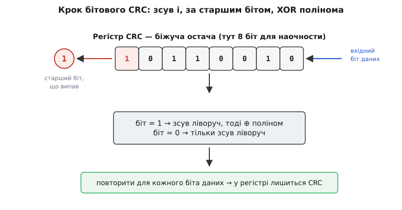
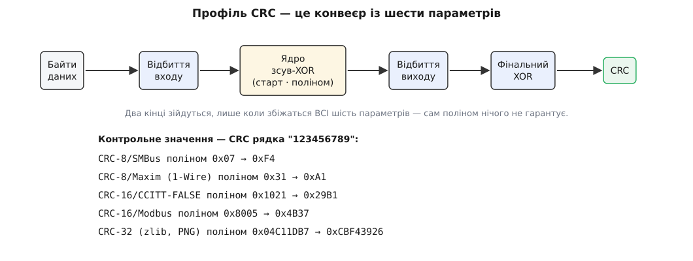
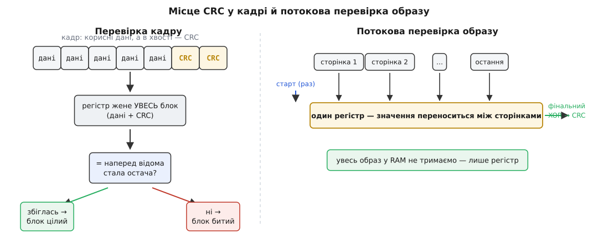

# Контрольна сума CRC

<preknowlist>
- [XOR («виключне АБО»)](root:hw-digital/xor-comparison) — побітова операція, що дає 1 лише там, де біти різні; уся арифметика CRC стоїть саме на ній.
- [Біти й порядок байтів](root:sf-algorithms/bits-bytes-endianness) — біти всередині байта, старший і молодший біт, у якому порядку йдуть байти; без цього не зрозуміти «відбиття» бітів у CRC.
- [Контрольні суми](root:com-modulation/checksums) — загальна ідея дописати до даних короткий контрольний код, щоб приймач помітив псування; CRC — найсильніший його різновид.
</preknowlist>

У флеш щойно ліг новий образ прошивки, який пристрій завантажив по повітрю. За мить процесор стрибне на його точку входу й почне виконувати ці байти як код. Досить одному біту в адресі переходу перевернутися під час завантаження — і замість програми виконається сміття, пристрій перетворюється на цеглину. Або простіше: по UART прийшов кадр MODBUS із командою «крутити привід на 300 обертів», а завада на дроті підмінила одну цифру — і привід зірве різьбу. Перш ніж діяти, прошивка мусить відповісти на одне холодне питання: **чи ці байти дійшли рівно такими, якими їх відправили?**

Потрібен короткий «відбиток», який дописують у хвіст даних, і який має три властивості одразу: він поміщається в кілька байтів кадру, він швидко рахується навіть на повільному ядрі, і він **майже ніколи** не скаже «ціле» для зіпсованого блоку. Це і є контрольна сума; а контрольна сума, що робить усі три речі добре, — це **CRC** (англ. *cyclic redundancy check* — циклічний надлишковий код; *redundancy*, надлишковість, від лат. *redundare* — переливатися через край: ми навмисно доливаємо кілька зайвих байтів, щоб було з чим звірити прийняте). Ця стаття — про те, як перетворити CRC на правильний і швидкий код у прошивці: від бітового циклу до апаратного блоку в мікроконтролері, від збігу з чужим пристроєм до потокової перевірки образу, що не влазить у пам'ять цілком.

### Чому простої суми не досить і чим її замінюють

Найдешевший «відбиток» — скласти всі байти й переслати молодший байт суми. Дешево, але діряво: переставте два байти місцями — сума не змінилась; перекиньте два біти так, що один додав, а другий відняв стільки ж, — знову збіг. Проста сума «забуває» позицію байта й легко скасовується, тож лишає цілі класи типових помилок невидимими.

Лік один: замінити «складати» на «ділити й брати остачу». Остача від ділення реагує на кожен окремий біт діленого — і, що вирішально для дроту й радіо, на цілі **пакети** сусідніх перекинутих бітів, а реальний шум приходить саме такими короткими сплесками. Чому ділення на спеціально дібраний многочлен ловить помилки майже непробивно, які поліноми «золоті» й чому CRC-*n* гарантовано бере будь-який пакет завдовжки до *n* бітів — це окрема, красива теорія кодів; вона нам тут як фундамент, тож приймемо її результат і зосередимось на інженерії. Хто хоче побачити доведення надійности — воно в [сестринській статті про CRC як код виявлення помилок](root:com-modulation/crc): там показано, чому остача від ділення на поліном сильніша за будь-яку суму, і звідки беруться стандартні поліноми. Нам далі важить інше: як це ділення виконати в прошивці, до останнього біта збігаючись із рештою світу.

### Механізм так, як його бачить код

Перше, що варто зрозуміти інженерові: жодного «ділення в стовпчик» прошивка насправді не робить. Замість нього крутиться **регістр**.

Уявімо регістр завширшки з нашу CRC — скажімо, 16 бітів. Він стартує з наперед домовленого значення (поки що хай нулі). Тепер вливаємо дані по одному біту. На кожен вхідний біт робимо дві дії: **зсуваємо** вміст регістра на позицію (старший біт випадає за край) і, **якщо той біт, що випав, був одиницею, XOR-имо** в регістр поліном-дільник. І все. Проженіть крізь цей регістр усі біти повідомлення — те, що лишиться всередині, і є остачею від ділення, тобто CRC.

Чому саме так, видно з одного кроку. Ділення в стовпчик на кожній позиції питає: «чи вміщається дільник?» Відповідь дає старший біт поточного залишку: якщо він 1 — дільник вміщається, його треба відняти; якщо 0 — пропустити й зсунутися далі. А віднімання тут — без позик і переносів, бо арифметику беруть за модулем 2, де відняти означає [XOR](root:hw-digital/xor-comparison). Отже «зсув, і за старшим бітом — XOR полінома» — це буквально довге ділення, розписане на такти. Регістр увесь час тримає біжучу остачу.

Ця форма — регістр, який зсувають, а зі зворотного зв'язку через XOR-«крани» підмішують назад рівно там, де в поліномі одиниці, — має власне ім'я: [лінійний зсувний регістр зі зворотним зв'язком (LFSR)](root:hw-digital/lfsr). У залізі це жменя тригерів і вентилів; у прошивці — короткий цикл. Той самий об'єкт, дві втілення.


*Крок бітового CRC так, як його виконує код. Регістр зсувається на біт ліворуч; біт, що випав за старший край, вирішує долю: був 0 — нічого не робимо, був 1 — XOR-имо в регістр поліном-дільник. Повторіть для кожного біта даних — у регістрі лишається остача від ділення, тобто CRC. Це те саме довге ділення над GF(2), лише розписане на такти зсувного регістра.*

Ось цей механізм у C — еталонна, найповільніша, зате незаперечна реалізація (профіль CRC-16/CCITT-FALSE: поліном `0x1021`, старт `0xFFFF`):

```c
uint16_t crc16_ccitt(const uint8_t *data, size_t len) {
    uint16_t crc = 0xFFFF;                  // стартове значення регістра
    for (size_t i = 0; i < len; i++) {
        crc ^= (uint16_t)data[i] << 8;      // вливаємо байт у старші 8 бітів
        for (int b = 0; b < 8; b++)         // 8 тактів зсуву на байт
            crc = (crc & 0x8000) ? (crc << 1) ^ 0x1021
                                 : (crc << 1);
    }
    return crc;
}
```

Байт вливається у старшу половину регістра (подача старшим бітом уперед), далі вісім тактів зсуву відпрацьовують ділення. Цикл повільний — вісім ітерацій на байт, — але він і є **визначенням**: усе, що буде швидшим, мусить давати рівно те саме число. І перевірити збіг можна одним рядком. У кожного стандартного профілю є **контрольне значення** (*check*) — CRC від ASCII-рядка `"123456789"`; для CRC-16/CCITT-FALSE воно дорівнює `0x29B1`. Порахували цим циклом CRC цих дев'яти байтів, дістали `0x29B1` — ваша реалізація збігається з профілем побітово; дістали інше — десь розійшлися параметри.

### Профіль CRC — це шість чисел, а не один поліном

Тут нас чекає найчастіша пастка прошивника. Ви рахуєте «якийсь CRC-16», а він не сходиться ні з даташитом сенсора, ні з CRC на іншому кінці шини. Причина майже завжди та сама: **CRC задається не поліномом, а шістьма параметрами**, і розійтися досить в одному. Цей набір із шести чисел усталив Росс Вільямс у своєму описі 1993 року, і відтоді ним описують кожен CRC — [історія народження цієї моделі](root:com-protocol/crc-in-firmware/hist-rocksoft.md) пояснює, чому доти світ потерпав від несумісних «діалектів» одного алгоритму.

Ось ці шість ручок і, головне, навіщо кожна:

- **Ширина** (*width*) — скільки бітів у результаті: 8, 16 чи 32. Прямий обмін: ширший код пропускає менше битих блоків, але з'їдає більше місця в кожному кадрі. Коротку команду боронить CRC-8, звичайний кадр — CRC-16, великий чи критичний образ — CRC-32.
- **Поліном** (*poly*) — сам дільник. Пастка: той самий поліном записують **двома способами** — «нормальним» зі старшим бітом уперед (`0x04C11DB7`) і «відбитим» із молодшим уперед (`0xEDB88320`). Це одне й те саме число, прочитане з протилежних кінців; сплутати записи — класична причина неправильної CRC.
- **Старт** (*init*) — з чого починає регістр. Чому не нуль: нульовий старт **сліпий до нулів на початку** даних — допишіть спереду нульовий байт, і CRC не зміниться. Тому більшість профілів стартують з усіх одиниць (`0xFFFF`).
- **Відбиття входу й виходу** (*refin*, *refout*) — чи реверсувати порядок бітів у кожному вхідному байті й у фінальному результаті. Звідки це взагалі взялося: послідовне залізо (UART, Ethernet) висуває біти байта **молодшим уперед**, тож «природна» апаратна CRC обробляє їх у зворотному порядку проти того, як ми пишемо число на папері. Щоб програма давала те саме, що дріт, вона дзеркалить біти. Саме звідси — і два записи полінома, і дві форми коду: «лівозсувна» зі старшим бітом (як вище) та «правозсувна» з молодшим.
- **Фінальний XOR** (*xorout*) — чим інвертувати результат наприкінці. Як і ненульовий старт, це закриває сліпоту вже до нулів у **хвості** й робить контрольний лишок ненульовим.

Звідси перше й головне практичне правило: **не вигадуйте власний профіль**. Для кожної ширини є перевірені десятиліттями стандартні набори з відомими гарантіями; самопальний легко матиме сліпу пляму. Візьміть іменований профіль цілком — і звіряйте його не «на око», а по контрольному значенню. Ось робочий короткий список для вбудованих систем:

```
профіль               W   поліном      старт       refin/out  xorout       check("123456789")
CRC-8/SMBus            8   0x07         0x00        ні / ні    0x00         0xF4
CRC-8/Maxim (1-Wire)   8   0x31         0x00        так / так  0x00         0xA1
CRC-16/CCITT-FALSE    16   0x1021       0xFFFF      ні / ні    0x0000       0x29B1
CRC-16/Modbus         16   0x8005       0xFFFF      так / так  0x0000       0x4B37
CRC-32 (zlib, PNG)    32   0x04C11DB7   0xFFFFFFFF  так / так  0xFFFFFFFF   0xCBF43926
```


*CRC — це конвеєр, а не одне число. Байти входять, за прапорцем відбиваються (реверс порядку бітів), проходять ядро зсув-XOR, налаштоване стартовим значенням і поліномом, тоді результат за прапорцем відбивається ще раз і XOR-иться з фінальною маскою. Два кінці зійдуться, лише коли збіжаться **всі шість** параметрів; збіг самого полінома нічого не гарантує. Праворуч — контрольні значення кількох стандартних профілів: якщо ваш код на рядку «123456789» дає цю саму цифру, він сумісний із профілем до останнього біта.*

> 🔧 **Навіщо це.** Коли ваша CRC не сходиться з еталоном або з чужим пристроєм — у переважній більшості випадків річ у **параметрах**, а не в поліномі. Дійте за списком: спершу звірте ширину, тоді старт (`0x0000` чи `0xFFFF`), тоді відбиття входу/виходу, тоді фінальний XOR — і аж наостанок сам поліном. Найшвидший спосіб не помилитися взагалі: узяти повний іменований профіль (скажімо, «CRC-16/Modbus») і прогнати через свій код рядок `"123456789"`; збіг із табличним *check* означає, що ви заговорите однією мовою з будь-яким пристроєм на цій шині.

### Як зробити це швидко: від біта до таблиці

Еталонний цикл робить вісім кроків зсуву на кожен байт. Для 12-байтового кадру це ніщо. Для образу прошивки на пів мегабайта, який треба перевірити на ядрі 80 МГц перед стрибком, — це вже мільйони ітерацій і відчутна пауза. Прискорення тримається на одному спостереженні: результат восьми кроків зсув-XOR залежить **лише від одного байта** — від того, який вхідний байт «зустрівся» зі старшим байтом регістра. А різних значень цього байта всього 256. Отже, порахуймо всі 256 наслідків **один раз** наперед і складімо в таблицю; тоді кожен байт даних коштує один пошук у таблиці, один XOR і один зсув регістра замість восьми ітерацій.

Це класична [таблиця замін (LUT)](root:sf-algorithms/lookup-table), і працює вона тут не випадково: ділення над GF(2) **лінійне**, тож дія восьми кроків на один байт — це фіксоване лінійне перетворення, яке можна затабулювати без втрати точности (алгебру цієї лінійности розписано в [математиці многочленів над GF(2)](root:com-modulation/crc/math-gf2-polynomials.md)). Між «зовсім без таблиці» і «велика таблиця» лежить ціла драбина розмін «пам'ять проти швидкости»:

```
побітово             0 Б таблиці       8 кроків / байт     коли пам'ять на вагу золота, а даних мало
напівбайтова         16 записів (32 Б) 2 пошуки / байт     компроміс для крихітних МК
байтова              256 записів        1 пошук / байт      стандарт: 256 Б (CRC-8), 512 Б (16), 1 КБ (32)
slice-by-8           8×256 (~8 КБ)      кілька байтів/крок  коли треба гнати мегабайти і є пам'ять
```

На крихітному мікроконтролері таблицю тримають у флеші (`const`), а не в RAM, — вона незмінна, і місце в оперативці економиться. Повний код усіх варіантів — генерація таблиці на етапі збірки, потокова версія й перевірка образу — винесено в [реалізацію CRC у прошивці](root:com-protocol/crc-in-firmware/proj-crc-embedded.md), щоб не роздмухувати виклад тут.

### Апаратний блок CRC — надсила вбудованих систем

У багатьох мікроконтролерів є **периферійний блок CRC**: пишеш байти чи слова в регістр даних, читаєш результат — а ділення робить залізо на швидкості шини, не забираючи в процесора жодного такту на біт. На Cortex-M у цей блок можна навіть завести цілий буфер через DMA, і ядро тим часом займеться іншим. Але тут чигає пастка, об яку спотикається кожен новачок із CRC-периферією.

Блоки з **фіксованою** функцією (STM32 родин F1 і F4) рахують рівно одне: поліном `0x04C11DB7`, вхід 32-бітними словами, старшим бітом уперед, старт `0xFFFFFFFF`, **без відбиття** — тобто CRC-32/MPEG-2. А це **не** відбитий CRC-32 із zlib і Ethernet, який очікує решта світу; щоб дістати «стандартну» CRC-32, вхідні байти й вихід доводиться відбивати самотужки. Новіші блоки (STM32 родин F3, L4, G4, H7 та інші) дозволяють задати ширину полінома (7/8/16/32), старт і відбиття входу/виходу — і тоді периферія прямо збігається з іменованим профілем. ESP32 CRC-регістра не має, зате несе в ROM готові функції (`esp_rom_crc32_le`, її 8- та 16-бітних родичів) зі своєю умовою «тильди» на старті й на виході. Конкретні регістри, точні сигнатури й приклад, що збігається з zlib, зібрано в [контракті апаратного CRC-блоку](root:com-protocol/crc-in-firmware/api-hw-crc.md); загальний устрій такого вузла — в [апаратному CRC](root:com-modulation/crc/comp-hardware-crc.md).

Практичний висновок тверезий: залізо виграє на **великих** образах і потокових даних, які й так течуть через DMA. Для 12-байтового кадру програмна таблиця вже безкоштовна, і пастка з відбиттям з'їсть на налагодженні більше годин, ніж залізо зекономить тактів. Тож апаратний блок беруть свідомо — коли обсяг того вартий, — а не «бо він є».

### Як вписати CRC у справжню систему

Порахувати CRC — пів справи; друга половина в тому, **де** її покласти й **як** перевіряти.

**Місце в кадрі.** CRC дописують у хвіст, а рахують по всьому, що перед нею, — це частина [кадрування даних](root:com-protocol/data-serialization). У приймача два шляхи. Простий: перерахувати CRC по корисній частині й порівняти з тією, що в хвості. Елегантніший: прогнати через регістр **увесь** прийнятий блок разом із CRC і глянути, чи вийшла наперед відома **стала остача** — контрольний лишок профілю. Для «голих» профілів (без відбиття й фінального XOR) цей лишок дорівнює нулю; для профілів із фінальним XOR він — фіксована ненульова стала. Другий спосіб зручний тим, що не треба окремо витягати поле CRC й вирівнювати його — одне порівняння, і готово.

**Потокова перевірка.** CRC **інкрементна**: її можна годувати частинами, переносячи біжуче значення регістра між викликами. Образ прошивки заводять сторінка за сторінкою прямо з флешу; байти з UART — по одному в перериванні. Увесь блок тримати в RAM не треба ніколи — саме тому мікроконтролер із 4 КБ оперативки спокійно перевіряє образ на мегабайт. Одна тонкість, на якій легко обпектися: **стартове значення ставлять раз** на початку потоку, а не перед кожною порцією, а відбиття виходу й фінальний XOR застосовують **лише наприкінці**, коли останній байт уже пройшов.


*Ліворуч — кадр: корисні дані, а за ними в хвості поле CRC, порахованої по всьому, що перед ним. Приймач жене крізь регістр увесь блок (дані + CRC) і перевіряє не рівність двох чисел, а те, що вийшла наперед відома **стала остача**: збіглася — блок цілий, ні — битий. Праворуч — потокова перевірка великого образу: його згодовують сторінками, переносячи біжуче значення регістра з виклику у виклик, тож у пам'яті ніколи не лежить увесь образ; старт задають раз, а фінальний XOR — лише після останньої сторінки.*

**Пастки розкладки.** Не рахуйте CRC по ділянці, у якій ще лежить **старе** поле CRC, — його спершу обнуляють або виключають з обрахунку, інакше нова сума залежатиме від старої. І, перевіряючи щойно записаний флеш, перечитуйте його **як дані**, зважаючи на кеш і на те, що запис міг ще не «сісти», — а не покладайтеся на те, що в комірках уже нове.

### Чесна межа: що CRC не вміє

Лишається сказати те, про що інженери іноді забувають, і дорого за це платять. CRC ловить **випадкове** псування — шум на дроті, згаслу комірку флешу, загублений байт у завантаженні. Але вона **не несе таємниці** й тривіально підробляється: хто завгодно може змінити ваші дані й тут-таки перерахувати CRC, що зійдеться, бо алгоритм і поліном відкриті всім. На питання «чи не підмінив зловмисник цей образ прошивки?» CRC відповісти не може — тут потрібен криптографічний код автентичности або підпис, а не контрольна сума ([чому саме підпис, а не CRC](root:sf-security/hash-and-digital-signature)). Тому серйозна прошивка часто тримає **обидва**: дешеву CRC на питання «чи не згнив флеш, чи не обірвалося завантаження» — і підпис на питання «чи цей образ справді від нас», зокрема під час [оновлення по повітрю](root:sf-devices/ota-update). Математика лишка гарантує, що ви впіймаєте шумний дріт; проти супротивника, який думає, вона не гарантує нічого.

І в цьому — уся суть CRC для прошивника. Це найдешевша майже-певна відповідь на щоденне «чи ці конкретні байти цілі?»: зсувний регістр, заданий шістьма числами; бітовим циклом — для короткого кадру, таблицею — для образу, кремнієм — для потоку. Доведіть свій код до контрольного значення відомого профілю — і він заговорить однією мовою з будь-яким пристроєм на шині, від сенсора по I²C до кадру в CAN.
