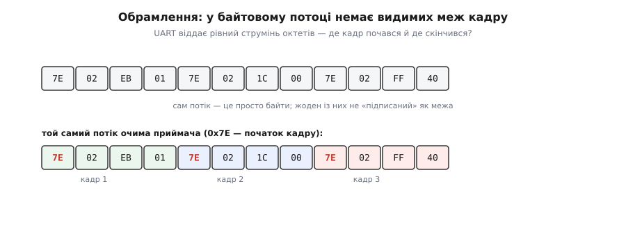
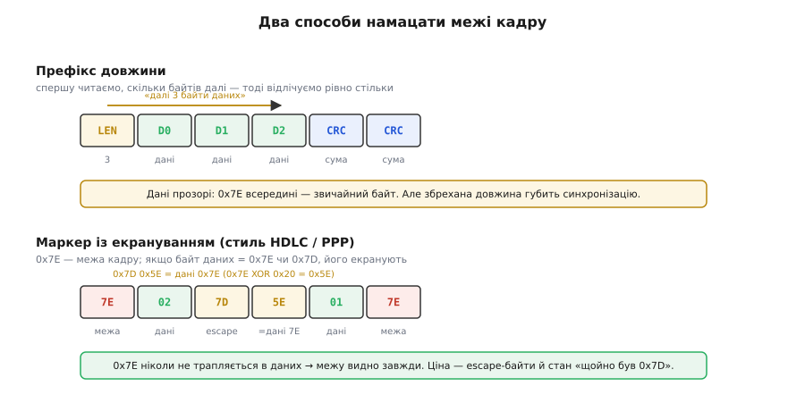
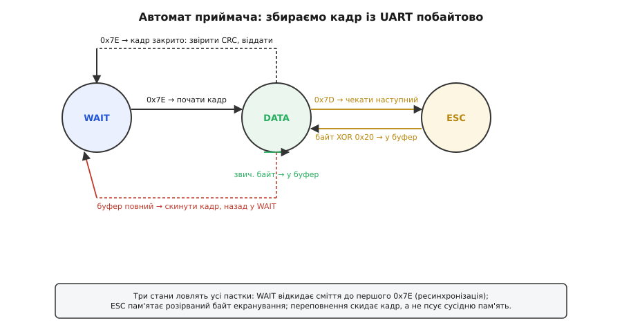

# ⚙️ Обрамлення кадру: намацати початок і кінець у потоці без меж

UART, TCP-сокет, радіоканал віддають те саме — **рівний потік байтів**, один за одним, без жодних пауз-роздільників, без «тут пакет скінчився». Прошивка ж мислить **кадрами** (*frame*): осмислена порція — команда, вимір, рядок телеметрії — має початок, кінець і контрольну суму. Між цими двома світами лежить окрема задача, яку легко проґавити, поки все працює «на столі», і яка потім тижнями дає плаваючі баги: **обрамлення** (*framing*, від *frame* — «рамка») — спосіб намацати в суцільному струмені октетів межі кожного кадру.

Задача підступна саме тим, що на короткому дроті її наче й немає. Ти шлеш шість байтів, приймаєш шість байтів — усе збіглося. А потім у каналі загубиться один байт, або приймач увімкнеться посеред чужого кадру, або два кадри злипнуться в одному читанні `read()` — і без обрамлення приймач уже не знає, де він у потоці. Розберімо це від першопричини й напишемо приймач, який виживає.

## Задача: чому «просто шли байти» ламається

Уяви найпростіше: відправник кладе в UART структуру телеметрії — скажімо, шість байтів `7E 02 EB 01 ...`, — а приймач читає їх і розбирає за фіксованою розкладкою. Поки з'єднання ідеальне й обидві сторони стартують синхронно, усе тримається на мовчазному припущенні: **«байт, який я зараз читаю, — це початок кадру»**. Досить одного збою, щоб припущення луснуло, і збоїв цих рівно три класи.

**Приймач увімкнувся посеред кадру.** Відправник уже секунду шле потік, коли приймач тільки завантажився й відкрив порт. Перший байт, який він упіймає, — не початок кадру, а якийсь середній. Він відлічить від нього «шість байтів кадру» — і розбере впоперек справжніх меж: хвіст одного кадру плюс голова наступного. Число вийде правдоподібним (байти ж валідні), а зміст — сміття. Це **втрата синхронізації** (*loss of sync*): приймач і потік розійшлися в тому, де межа кадру, і сам по собі цей розлад не лікується — приймач так і читатиме зсунуто, кадр за кадром.

**У каналі згубився або спотворився байт.** UART без керування потоком переповнить свій апаратний буфер, якщо приймач на мить забарився в перериванні, — і один байт зникне. Тепер усі наступні байти зсунуті на один: те, що приймач вважає за температуру, — насправді половина температури й половина статусу. Один загублений байт **отруює весь потік далі**, поки щось не відновить синхронізацію.

**Два кадри злиплися, або кадр прийшов половинками.** Потік не поважає меж твоїх кадрів. Один виклик читання з драйвера UART може віддати одразу **півтора кадри**: цілий кадр і початок наступного. Або навпаки — половину кадру зараз, а другу половину за 3 мілісекунди наступним читанням. Код, написаний як «прочитати рівно 6 байтів, розібрати», обидва випадки провалить: у першому він з'їсть зайве, у другому — вдавиться недоотриманим.


*Угорі — те, що фізично тече дротом: рівний ряд октетів, жоден із яких не «підписаний» як межа. Той самий ряд унизу приймач ділить на кадри, лише знайшовши в ньому домовлений маркер початку `0x7E`. Без такого орієнтира приймач, що ввімкнувся посеред потоку чи згубив байт, відлічуватиме кадри зсунуто й тлумачитиме сміття як валідні числа.*

Спільний корінь усіх трьох — потік **не несе в собі меж**, а приймач мусить їх знати. Отже, межі треба **вкласти в самі байти** так, щоб приймач міг їх намацати з будь-якої точки й **відновитися** після збою. Способів зробити це два, і вони віддзеркалюють дві філософії.

## Ідея: маркер із екрануванням проти префікса довжини

**Перший підхід — маркер-роздільник.** Оберемо один байт як **межу кадру** — священний, що в самих даних трапитися не сміє. Класичний вибір, освячений десятиліттями, — `0x7E` (двійково `01111110`): це **прапорець** (*flag*) кадру в протоколі HDLC і в PPP, що стоїть на кінцях кожного кадру [послідовного зв'язку](root:com-protocol/stream-parser). Приймач шукає `0x7E` — і знає: тут кадр почався (або скінчився). Синхронізуватися звідусіль тривіально: загубив себе — читай, аж поки трапиться `0x7E`, і почни кадр звідти.

Але одразу постає питання: **а що, як байт даних сам дорівнює `0x7E`?** Температура, лічильник, будь-яке число законно містить `0x7E` серед своїх байтів. Якщо лишити його як є, приймач вважатиме його межею й розірве кадр посередині. Розв'язок — **екранування** (*escaping*, або *byte stuffing* — «набивання байтів»): домовитися про другий особливий байт, **escape** (`0x7D` у HDLC/PPP), і щоразу, коли в даних трапляється `0x7E` або сам `0x7D`, замінювати його **двобайтовою послідовністю**. За стандартом RFC 1662 (PPP в HDLC-подібному обрамленні) правило таке: підставити `0x7D`, а наступний байт — оригінал, **виключно-або** з `0x20`:

```
дані 0x7E  →  на дроті  0x7D 0x5E     (0x7E XOR 0x20 = 0x5E)
дані 0x7D  →  на дроті  0x7D 0x5D     (0x7D XOR 0x20 = 0x5D)
```

Навіщо XOR з `0x20`, а не просто «наступний байт — це оригінал»? Щоб і після escape у потоці **не з'явилося** випадкового `0x7E`: якби ми лишили `0x7D 0x7E`, приймач, що саме втратив синхронізацію й не знає про попередній `0x7D`, побачив би цей `0x7E` як межу. Перекрутивши байт на `0x5E`, ми гарантуємо: `0x7E` у потоці означає **лише** межу кадру, ніколи — дані. Це властивість, яку варто мати завжди: **межовий байт унікальний у всьому потоці**, тож приймач намацає межу з будь-якого місця.

> 🔧 **Навіщо це.** Унікальність межового байта — це те, що робить протокол **самосинхронним**. Реальний канал шумить: приймач ловить перешкоду, губить байт, перезавантажується посеред чужої передачі. З маркером `0x7E`, якого немає в даних, відновлення безкоштовне — просто чекай наступного `0x7E`. Без цієї гарантії будь-який збій вимагав би переустановлення з'єднання. Саме тому HDLC, PPP і безліч саморобних UART-протоколів десятиліттями будують на прапорці-роздільнику.

Ціна екранування — **змінна довжина на дроті** й неприємний найгірший випадок: якщо кадр складається суціль із `0x7E`, кожен байт роздвоюється, і кадр на дроті вдвічі довший. Для телеметрії, де `0x7E` трапляється зрідка, це дрібниця; для довільних двійкових даних — можлива проблема.

**Другий підхід — префікс довжини.** Замість того щоб шукати кінець кадру за маркером, **оголоси наперед, скільки байтів триватиме кадр**. Перед даними йде поле довжини (один-два байти), приймач читає його, а тоді відлічує рівно стільки байтів даних. Кінець кадру він знає **арифметично**, не шукаючи жодного особливого байта, — тож дані лишаються **прозорими** (*transparent*): `0x7E` усередині — звичайний байт, екранувати нічого не треба, довжина на дроті передбачувана.

Але префікс довжини має власну ахіллесову п'яту, дзеркальну до маркерної. **Якщо поле довжини спотвориться, приймач втратить синхронізацію катастрофічно.** Скажімо, справжня довжина — 6, але біт у ній перевернувся, і приймач прочитав 200. Він слухняно відлічить 200 байтів — з'їсть свій кадр, наступний, ще кілька — і всі вони пропадуть. Гірше: маркер дає **очевидну точку ресинхронізації** (наступний `0x7E`), а гола довжина — **ні**: приймач нізвідки не знає, що збився, аж поки випадково не наткнеться на валідний-на-вигляд заголовок. Тому префікс довжини на ненадійному каналі майже завжди супроводжують **маркером початку** (щоб було від чого відштовхнутись при ресинхронізації) і **контрольною сумою** (щоб відкинути кадр із брехливою довжиною).


*Угорі — префікс довжини: перше поле каже «далі стільки-то байтів», приймач відлічує їх арифметично, дані лишаються прозорими (0x7E всередині — звичайний байт), але збрехана довжина губить синхронізацію без явної точки відновлення. Унизу — маркер із екрануванням у стилі HDLC/PPP: 0x7E позначає межу, а байт даних 0x7E перетворюється на пару 0x7D 0x5E, тож у потоці межовий байт унікальний і ресинхронізація безкоштовна — ціною escape-байтів і стану «щойно бачив 0x7D».*

Є й третій, елегантний вихід — **прибрати екранування зовсім**, лишивши маркер. Так працює **COBS** (*Consistent Overhead Byte Stuffing* — «набивання байтів зі сталою накладкою»; Стюарт Чешир і Мері Бейкер, SIGCOMM 1997, згодом стаття в IEEE/ACM Transactions on Networking, 1999). Ідея красива: за роздільник беруть `0x00`, а COBS так перекодовує дані, що **нуля в них не лишається взагалі** — усі нулі замінено на посилання-стрибки до наступного нуля. Накладка передбачувана й крихітна: рівно один зайвий байт на кожні 254 байти даних, без подвоєння з найгіршого випадку, що властиве наївному екрануванню. Це робить COBS улюбленцем щільних UART-протоколів. Механіку COBS ми тут не розписуватимемо — важливо, що це **той самий клас рішення** (унікальний роздільник + перекодування даних), лише з обмеженою, а не подвійною накладкою.

Незалежно від підходу, **обрамлення саме по собі не перевіряє, чи дані цілі** — воно лише знаходить межі. Тому в кінець кадру кладуть [контрольну суму](root:com-modulation/crc): CRC-16 чи CRC-32 по тілу кадру. Вона ловить і випадковий `0x7E` серед сміття (кадр не збереться — сума не зійдеться), і побиті в каналі байти, і кадр, що зібрався за хибною довжиною. Обрамлення каже «ось межі», CRC каже «і всередині цілісно» — разом вони й дають надійний кадр.

> 🔧 **Навіщо це.** CRC — не формальність, а другий рубіж оборони обрамлення. Маркер `0x7E` цілком може випадково трапитися в потоці сміття (після втрати байта, наприклад), і приймач почне «кадр» не там. Валідних меж без CRC не відрізнити від хибних. CRC у кінці робить кадр **самоперевірним**: не зійшлася сума — кадр тихо відкидається, приймач чекає наступного `0x7E`, потік лікується сам. Пропустиш CRC — і рано чи пізно зіпсутий кадр протече в логіку як «валідний» вимір.

## Робочий код: приймач-автомат на UART

Тепер найголовніше — приймач. Він мусить приймати байти **по одному, як вони приходять** (з переривання UART або з опитування), і не мати права **блокуватися** в очікуванні решти кадру: між байтами можуть минати мілісекунди, а прошивці ніколи стояти. Тому приймач будують як **скінченний автомат** (*finite state machine*, FSM): він тримає лише свій поточний стан і приймальний буфер, з'їдає по байту, оновлює стан — і між викликами спить, нічого не займаючи. Це той самий стиль неблокувального [розбору потоку](root:com-protocol/stream-parser), лише сфокусований на межах кадру.

Візьмемо маркерне обрамлення `0x7E`/`0x7D` (як у PPP) — воно найкраще показує всі стани. Автомат має три:

- **`WAIT`** — «шукаю початок кадру». Ковтає й **викидає** будь-який байт, крім `0x7E`. Це і є механізм ресинхронізації: скільки б сміття не прийшло, приймач мовчки його з'їдає, аж поки трапиться межа.
- **`DATA`** — «всередині кадру, збираю байти». Звичайний байт — у буфер; `0x7E` — кадр скінчився, час звірити CRC; `0x7D` — далі екранований байт, перейти в `ESC`.
- **`ESC`** — «попередній байт був escape». Наступний байт треба перекрутити назад (`XOR 0x20`) і покласти в буфер, повернувшись у `DATA`.


*Три стани приймача й переходи між ними. WAIT відкидає все до першого 0x7E — це безкоштовна ресинхронізація з будь-якої точки. У DATA звичайні байти течуть у буфер, 0x7E закриває кадр (звірити CRC й віддати), а 0x7D веде в ESC. ESC пам'ятає розірваний надвоє байт екранування: наступний октет він перекручує назад через XOR 0x20 і повертається в DATA. Окремий вихід із DATA у WAIT — переповнення буфера: кадр скидається, а не псує сусідню пам'ять.*

Ось повний приймач у справжньому C — саме такий лягає у прошивку. Стан і буфер тримає одна структура, годуємо її по байту:

:::tabs
```c
#include <stdint.h>
#include <stddef.h>
#include <string.h>

#define FLAG   0x7E     // межа кадру (прапорець HDLC/PPP)
#define ESC    0x7D     // байт екранування
#define XOR    0x20     // маска перекручування екранованого байта
#define MAX_FRAME 64    // стеля тіла кадру — рівно стільки ОЗП відводимо

typedef enum { ST_WAIT, ST_DATA, ST_ESC } rx_state_t;

typedef struct {
    rx_state_t state;
    uint8_t    buf[MAX_FRAME];
    size_t     len;                 // скільки байтів уже в buf
} frame_rx_t;

void frame_rx_init(frame_rx_t *rx) {
    rx->state = ST_WAIT;
    rx->len   = 0;
}

// оголошення нижче: перевірка й видача готового кадру (реалізація — далі)
static void frame_complete(frame_rx_t *rx);

// згодувати один прийнятий байт; викликати на кожен октет з UART
void frame_rx_byte(frame_rx_t *rx, uint8_t b) {
    switch (rx->state) {

    case ST_WAIT:                          // шукаємо початок кадру
        if (b == FLAG) {                   // знайшли межу — відкриваємо кадр
            rx->len   = 0;
            rx->state = ST_DATA;
        }
        // будь-що інше — сміття, мовчки викидаємо (ресинхронізація)
        break;

    case ST_DATA:
        if (b == FLAG) {                   // межа: кадр скінчився
            frame_complete(rx);            // звірити CRC й, якщо ок, віддати
            rx->len   = 0;                 // готуємось до наступного кадру
            rx->state = ST_WAIT;
        } else if (b == ESC) {             // далі — екранований байт
            rx->state = ST_ESC;
        } else {                           // звичайний байт даних
            if (rx->len < MAX_FRAME) {
                rx->buf[rx->len++] = b;
            } else {
                rx->state = ST_WAIT;       // ПЕРЕПОВНЕННЯ: скидаємо кадр
                rx->len   = 0;             // (а не пишемо за межі buf!)
            }
        }
        break;

    case ST_ESC:                           // попередній байт був ESC
        if (b == FLAG) {                   // ESC перед межею — кадр порваний
            rx->state = ST_WAIT;           // відкидаємо, чекаємо нового
            rx->len   = 0;
        } else {
            uint8_t d = b ^ XOR;           // перекрутити назад: 0x5E→0x7E, 0x5D→0x7D
            if (rx->len < MAX_FRAME) {
                rx->buf[rx->len++] = d;
                rx->state = ST_DATA;       // повертаємось у тіло кадру
            } else {
                rx->state = ST_WAIT;       // переповнення й тут
                rx->len   = 0;
            }
        }
        break;
    }
}
```
```python
FLAG = 0x7E       # межа кадру (прапорець HDLC/PPP)
ESC  = 0x7D       # байт екранування
XOR  = 0x20       # маска перекручування екранованого байта
MAX_FRAME = 64    # стеля тіла кадру

ST_WAIT, ST_DATA, ST_ESC = range(3)

class FrameRx:
    def __init__(self):
        self.state = ST_WAIT
        self.buf   = bytearray()     # скільки байтів уже в buf = len(self.buf)

    # згодувати один прийнятий байт; викликати на кожен октет з UART
    def rx_byte(self, b):
        if self.state == ST_WAIT:            # шукаємо початок кадру
            if b == FLAG:                    # знайшли межу — відкриваємо кадр
                self.buf.clear()
                self.state = ST_DATA
            # будь-що інше — сміття, мовчки викидаємо (ресинхронізація)

        elif self.state == ST_DATA:
            if b == FLAG:                    # межа: кадр скінчився
                self._complete()            # звірити CRC й, якщо ок, віддати
                self.buf.clear()             # готуємось до наступного кадру
                self.state = ST_WAIT
            elif b == ESC:                   # далі — екранований байт
                self.state = ST_ESC
            else:                            # звичайний байт даних
                if len(self.buf) < MAX_FRAME:
                    self.buf.append(b)
                else:
                    self.state = ST_WAIT     # ПЕРЕПОВНЕННЯ: скидаємо кадр
                    self.buf.clear()

        elif self.state == ST_ESC:           # попередній байт був ESC
            if b == FLAG:                    # ESC перед межею — кадр порваний
                self.state = ST_WAIT         # відкидаємо, чекаємо нового
                self.buf.clear()
            else:
                d = b ^ XOR                  # перекрутити назад: 0x5E→0x7E, 0x5D→0x7D
                if len(self.buf) < MAX_FRAME:
                    self.buf.append(d)
                    self.state = ST_DATA     # повертаємось у тіло кадру
                else:
                    self.state = ST_WAIT     # переповнення й тут
                    self.buf.clear()
```
```go
const (
    FLAG      = 0x7E // межа кадру (прапорець HDLC/PPP)
    ESC       = 0x7D // байт екранування
    XORMask   = 0x20 // маска перекручування екранованого байта
    MaxFrame  = 64   // стеля тіла кадру
)

type rxState int

const (
    stWait rxState = iota
    stData
    stEsc
)

type FrameRx struct {
    state rxState
    buf   []byte // скільки байтів уже в buf = len(buf)
}

// згодувати один прийнятий байт; викликати на кожен октет з UART
func (rx *FrameRx) RxByte(b byte) {
    switch rx.state {

    case stWait: // шукаємо початок кадру
        if b == FLAG { // знайшли межу — відкриваємо кадр
            rx.buf = rx.buf[:0]
            rx.state = stData
        }
        // будь-що інше — сміття, мовчки викидаємо (ресинхронізація)

    case stData:
        if b == FLAG { // межа: кадр скінчився
            rx.complete()      // звірити CRC й, якщо ок, віддати
            rx.buf = rx.buf[:0] // готуємось до наступного кадру
            rx.state = stWait
        } else if b == ESC { // далі — екранований байт
            rx.state = stEsc
        } else { // звичайний байт даних
            if len(rx.buf) < MaxFrame {
                rx.buf = append(rx.buf, b)
            } else {
                rx.state = stWait // ПЕРЕПОВНЕННЯ: скидаємо кадр
                rx.buf = rx.buf[:0]
            }
        }

    case stEsc: // попередній байт був ESC
        if b == FLAG { // ESC перед межею — кадр порваний
            rx.state = stWait // відкидаємо, чекаємо нового
            rx.buf = rx.buf[:0]
        } else {
            d := b ^ XORMask // перекрутити назад: 0x5E→0x7E, 0x5D→0x7D
            if len(rx.buf) < MaxFrame {
                rx.buf = append(rx.buf, d)
                rx.state = stData // повертаємось у тіло кадру
            } else {
                rx.state = stWait // переповнення й тут
                rx.buf = rx.buf[:0]
            }
        }
    }
}
```
```js
const FLAG = 0x7E;      // межа кадру (прапорець HDLC/PPP)
const ESC  = 0x7D;      // байт екранування
const XOR  = 0x20;      // маска перекручування екранованого байта
const MAX_FRAME = 64;   // стеля тіла кадру

const ST_WAIT = 0, ST_DATA = 1, ST_ESC = 2;

class FrameRx {
  constructor() {
    this.state = ST_WAIT;
    this.buf = [];            // скільки байтів уже в buf = this.buf.length
  }

  // згодувати один прийнятий байт; викликати на кожен октет з UART
  rxByte(b) {
    switch (this.state) {

      case ST_WAIT:                       // шукаємо початок кадру
        if (b === FLAG) {                 // знайшли межу — відкриваємо кадр
          this.buf.length = 0;
          this.state = ST_DATA;
        }
        // будь-що інше — сміття, мовчки викидаємо (ресинхронізація)
        break;

      case ST_DATA:
        if (b === FLAG) {                 // межа: кадр скінчився
          this._complete();               // звірити CRC й, якщо ок, віддати
          this.buf.length = 0;            // готуємось до наступного кадру
          this.state = ST_WAIT;
        } else if (b === ESC) {           // далі — екранований байт
          this.state = ST_ESC;
        } else {                          // звичайний байт даних
          if (this.buf.length < MAX_FRAME) {
            this.buf.push(b);
          } else {
            this.state = ST_WAIT;         // ПЕРЕПОВНЕННЯ: скидаємо кадр
            this.buf.length = 0;
          }
        }
        break;

      case ST_ESC:                        // попередній байт був ESC
        if (b === FLAG) {                 // ESC перед межею — кадр порваний
          this.state = ST_WAIT;           // відкидаємо, чекаємо нового
          this.buf.length = 0;
        } else {
          const d = b ^ XOR;              // перекрутити назад: 0x5E→0x7E, 0x5D→0x7D
          if (this.buf.length < MAX_FRAME) {
            this.buf.push(d);
            this.state = ST_DATA;         // повертаємось у тіло кадру
          } else {
            this.state = ST_WAIT;         // переповнення й тут
            this.buf.length = 0;
          }
        }
        break;
    }
  }
}
```
:::

Тіло кадру закінчується двобайтовим CRC-16 — його вклав відправник по всіх байтах даних, що йдуть перед ним. Приймач, зібравши кадр, відділяє ці два байти, рахує CRC по решті й порівнює. Розкладемо `frame_complete`:

:::tabs
```c
// Мінімальний CRC-16/CCITT (поліном 0x1021) — для прикладу побайтово.
// У прошивці частіше беруть табличний варіант заради швидкості.
static uint16_t crc16_ccitt(const uint8_t *p, size_t n) {
    uint16_t crc = 0xFFFF;
    for (size_t i = 0; i < n; i++) {
        crc ^= (uint16_t)p[i] << 8;
        for (int k = 0; k < 8; k++)
            crc = (crc & 0x8000) ? (uint16_t)((crc << 1) ^ 0x1021)
                                 : (uint16_t)(crc << 1);
    }
    return crc;
}

// сюди приймач кладе те, що робити з валідним кадром
extern void handle_frame(const uint8_t *data, size_t len);

static void frame_complete(frame_rx_t *rx) {
    if (rx->len < 3)                        // кадр коротший за 1 байт даних + 2 CRC — брак
        return;

    size_t body = rx->len - 2;              // тіло без двох байтів CRC
    uint16_t got  = ((uint16_t)rx->buf[body] << 8) | rx->buf[body + 1];  // CRC із кадру (big-endian)
    uint16_t calc = crc16_ccitt(rx->buf, body);                          // рахуємо самі

    if (got == calc)                        // сума зійшлася — кадр цілий
        handle_frame(rx->buf, body);        // віддаємо тіло логіці
    // не зійшлася — тихо відкидаємо: приймач уже в WAIT, чекає наступного FLAG
}
```
```python
# Мінімальний CRC-16/CCITT (поліном 0x1021) — для прикладу побайтово.
# У прошивці частіше беруть табличний варіант заради швидкості.
def crc16_ccitt(data):
    crc = 0xFFFF
    for byte in data:
        crc ^= byte << 8
        for _ in range(8):
            crc = ((crc << 1) ^ 0x1021) if (crc & 0x8000) else (crc << 1)
            crc &= 0xFFFF                 # тримаємо 16 біт (Python-int безмежний)
    return crc

# сюди приймач кладе те, що робити з валідним кадром
def handle_frame(data):
    ...

# метод класу FrameRx з попередньої вкладки
def _complete(self):
    if len(self.buf) < 3:                # кадр коротший за 1 байт даних + 2 CRC — брак
        return

    body = len(self.buf) - 2             # тіло без двох байтів CRC
    got  = (self.buf[body] << 8) | self.buf[body + 1]  # CRC із кадру (big-endian)
    calc = crc16_ccitt(self.buf[:body])                # рахуємо самі

    if got == calc:                      # сума зійшлася — кадр цілий
        handle_frame(bytes(self.buf[:body]))  # віддаємо тіло логіці
    # не зійшлася — тихо відкидаємо: приймач уже в WAIT, чекає наступного FLAG
```
```go
// Мінімальний CRC-16/CCITT (поліном 0x1021) — для прикладу побайтово.
// У прошивці частіше беруть табличний варіант заради швидкості.
func crc16CCITT(p []byte) uint16 {
    crc := uint16(0xFFFF)
    for _, b := range p {
        crc ^= uint16(b) << 8
        for k := 0; k < 8; k++ {
            if crc&0x8000 != 0 {
                crc = (crc << 1) ^ 0x1021
            } else {
                crc <<= 1
            }
        }
    }
    return crc
}

// сюди приймач кладе те, що робити з валідним кадром
func handleFrame(data []byte) { /* ... */ }

// метод FrameRx з попередньої вкладки
func (rx *FrameRx) complete() {
    if len(rx.buf) < 3 { // кадр коротший за 1 байт даних + 2 CRC — брак
        return
    }

    body := len(rx.buf) - 2 // тіло без двох байтів CRC
    got := uint16(rx.buf[body])<<8 | uint16(rx.buf[body+1]) // CRC із кадру (big-endian)
    calc := crc16CCITT(rx.buf[:body])                       // рахуємо самі

    if got == calc { // сума зійшлася — кадр цілий
        handleFrame(rx.buf[:body]) // віддаємо тіло логіці
    }
    // не зійшлася — тихо відкидаємо: приймач уже в WAIT, чекає наступного FLAG
}
```
```js
// Мінімальний CRC-16/CCITT (поліном 0x1021) — для прикладу побайтово.
// У прошивці частіше беруть табличний варіант заради швидкості.
function crc16Ccitt(data) {
  let crc = 0xFFFF;
  for (const byte of data) {
    crc ^= byte << 8;
    for (let k = 0; k < 8; k++) {
      crc = (crc & 0x8000) ? ((crc << 1) ^ 0x1021) : (crc << 1);
      crc &= 0xFFFF;                  // тримаємо 16 біт
    }
  }
  return crc;
}

// сюди приймач кладе те, що робити з валідним кадром
function handleFrame(data) { /* ... */ }

// метод класу FrameRx з попередньої вкладки
_complete() {
  if (this.buf.length < 3)             // кадр коротший за 1 байт даних + 2 CRC — брак
    return;

  const body = this.buf.length - 2;    // тіло без двох байтів CRC
  const got  = (this.buf[body] << 8) | this.buf[body + 1];  // CRC із кадру (big-endian)
  const calc = crc16Ccitt(this.buf.slice(0, body));         // рахуємо самі

  if (got === calc)                    // сума зійшлася — кадр цілий
    handleFrame(this.buf.slice(0, body));  // віддаємо тіло логіці
  // не зійшлася — тихо відкидаємо: приймач уже в WAIT, чекає наступного FLAG
}
```
:::

Три речі тут — прямий наслідок усього сказаного. **Приймач ніде не блокується**: `frame_rx_byte` з'їдає рівно один байт і повертається, тож його можна кликати хоч із ISR по перериванню «прийнято байт», хоч із головного циклу опитуванням, — між байтами прошивка вільна. **CRC перевіряється перед видачею**: жоден кадр не протече в `handle_frame`, поки сума не зійшлася, тож і випадковий `0x7E` серед сміття, і побитий у каналі байт відсіюються. **Переповнення буфера не псує пам'ять**: перевищивши `MAX_FRAME`, приймач скидає кадр і йде в `WAIT`, а не пише за межі масиву — про це окремо нижче, бо це найпідступніша з пасток.

Якщо обрати натомість **префікс довжини**, автомат схожий, але простіший на екранування й складніший на облік: стани стають `WAIT_FLAG` (чекаємо маркер початку), `LEN` (читаємо байт-два довжини), `PAYLOAD` (відлічуємо рівно `len` байтів у буфер), `CHECK` (два байти CRC). Немає стану `ESC` — дані прозорі, — зате з'являється **лічильник, скільки байтів іще прийняти**, і жорстка перевірка `len <= MAX_FRAME` **одразу по прочитанні довжини**, інакше збрехана довжина спробує переповнити буфер. Обидва автомати — рідня; вибір між ними — це вибір «прозорі дані ціною крихкої довжини» проти «стійка ресинхронізація ціною екранування».

## Складність і пастки

**Вартість.** Приймач обробляє **O(1) на байт**: один `switch`, одне порівняння, один запис у буфер. CRC додає стало-обмежену роботу на кадр — при табличному CRC це один пошук у таблиці на байт, тобто теж O(1) на байт. Пам'ять — рівно `MAX_FRAME` плюс кілька байтів стану; **жодної динамічної пам'яті**, що на мікроконтролері й потрібно. Автомат ідеально лягає на ISR UART: прийняв байт — згодував — вийшов.

А тепер пастки, кожна з яких у реальному коді коштувала комусь не однієї години.

**Втрата синхронізації й ресинхронізація.** Головне питання до будь-якого приймача: **як він повертається в лад після збою?** У маркерному автоматі відповідь вбудована — стан `WAIT` викидає все до наступного `0x7E`, тож один загублений чи зайвий байт зіпсує щонайбільше **один** кадр (CRC його відкине), а далі потік вирівняється сам на найближчій межі. Це величезна перевага маркера. У префікса довжини ресинхронізації **немає задарма**: збрехана довжина може з'їсти кілька кадрів, поки приймач випадково не наткнеться на валідний заголовок, — саме тому до довжини **обов'язково** додають маркер початку, щоб було від чого ресинхронізуватися.

**Часткові й склеєні кадри.** Це не крайовий випадок, а норма потокового вводу: `read()` з UART чи TCP віддає **скільки завгодно** байтів, не поважаючи меж кадру. Автомат розв'язує обидві біди самою своєю природою: він **не читає «кадр»** — він їсть по байту й тримає стан **між викликами**. Прийшла половина кадру — приймач лишиться в `DATA` з частково повним буфером і спокійно дочекається решти наступним читанням. Прийшло півтора кадри — приймач закриє перший на його `0x7E`, а хвіст (початок наступного) продовжить збирати. Тому будь-який серйозний приймач **байт-орієнтований**, а не «блок-орієнтований»; спроба написати «прочитати рівно N байтів і розібрати» ламається на першому ж частковому читанні.

> 🔧 **Навіщо це.** Це найчастіша помилка новачка в UART-протоколах: код на кшталт `uart_read(buf, FRAME_LEN); parse(buf);`. На столі, де кадр приходить цілим, він працює — і тому доходить до продакшену. У полі, де драйвер віддає байти як заманеться, він розсинхронізується на першому ж розірваному кадрі й сипле сміттям. Автомат, що тримає стан між байтами, — не ускладнення заради краси, а єдиний спосіб коректно жити з потоком, який не знає про твої кадри.

**Розрив байта екранування.** Найтонша пастка. Escape-послідовність — це **два байти**: `0x7D`, а за ним перекручений оригінал. Що, як кадр обірветься **між** ними — прийшов `0x7D`, а наступного байта не буде (з'єднання впало, кадр порвався)? Приймач у стані `ST_ESC` чекає на пару, якої вже не буде. У нашому коді це оброблено: якщо в `ST_ESC` приходить `0x7E`, ми розуміємо, що кадр порваний посеред escape, і відкидаємо його, йдучи в `WAIT`. Без цієї гілки приймач або завис би, чекаючи неможливого байта, або перекрутив би наступний межовий `0x7E` як дані й проковтнув би межу — і два кадри злилися б в один. **Стан `ESC` існує саме для того, щоб пам'ятати розірваний надвоє байт** і коректно його добрати чи відкинути; це головна причина, чому екранування вимагає окремого стану, а не прапорця «наступний перекрутити».

**Переповнення приймального буфера.** Смертельна пастка, бо мовчазна. Приймач відводить `MAX_FRAME` байтів під кадр — але **зловмисник чи збій можуть надіслати нескінченний потік без жодного `0x7E`**. Наївний приймач писатиме байт за байтом, поки не вилізе за межі масиву й не затре сусідні змінні, стек чи що завгодно поряд — класичне [переповнення буфера](root:com-protocol/stream-parser), від якого падіння в кращому разі, а тихе псування пам'яті чи діра в безпеці — у гіршому. Захист єдиний і обов'язковий: **перевіряти `rx->len < MAX_FRAME` перед КОЖНИМ записом** і, перевищивши стелю, **скидати кадр** (у `WAIT`), а не писати далі. У коді вище ця перевірка стоїть в обох станах, що пишуть у буфер (`DATA` і `ESC`), — і жодного шляху записати за межі не лишається. Правило залізне: **приймач ніколи не довіряє тому, що потік поважатиме твою стелю** — стелю стереже сам приймач.

**Межовий байт має бути справді унікальним.** Уся магія маркера тримається на тому, що `0x7E` **не трапляється** в тілі кадру — включно з байтами CRC. Легко забути про них: якщо CRC порахувати й покласти в кадр **до** екранування, а один із двох його байтів вийде рівним `0x7E` чи `0x7D` — і не екранувати його, — приймач розірве кадр на цьому байті. Тому порядок на відправнику строгий: **спершу порахувати CRC по сирому тілу, потім екранувати все тіло разом із CRC, і аж тоді обрамити `0x7E`**. Дзеркально приймач спершу **знімає** екранування (в автоматі це вже зроблено — у буфері лежать сирі байти), і лише потім рахує CRC. Переплутати ці шари — і кадри «іноді» ламатимуться саме на тих значеннях CRC, що збіглися з межею: баг, який годі відтворити на замовлення.

**Ендіанність поля CRC (і довжини).** Двобайтові CRC і довжину відправник кладе в кадр у якомусь порядку байтів, а приймач мусить читати в **тому самому**. У коді вище CRC зчитується як `(buf[body] << 8) | buf[body+1]` — старший байт першим, мережевий (big-endian) порядок, — і відправник має класти його так само. Це той самий клас розбіжностей, що й у [серіалізації чисел](root:sf-algorithms/bits-bytes-endianness/proj-serialization.md): дві сторони мовчки припускають різний порядок — і кадр «правильний» у кожної окремо, а разом не сходиться. Порядок байтів усіх багатобайтових полів кадру (довжина, CRC, самі значення) фіксують у **специфікації протоколу**, а не лишають «як лягло в пам'ять».

Складімо докупи, що робить приймач надійним. Він **байт-орієнтований** — тримає стан між октетами, тож переживає часткові й склеєні читання. Він **самосинхронний** — маркер `0x7E` унікальний, тож ресинхронізація після будь-якого збою безкоштовна. Він **самоперевірний** — CRC відсіює і випадкові межі, і побиті байти. І він **не довіряє потокові** — стереже власну буферну стелю й коректно обробляє обірваний escape, тож ані переповнення, ані розірвана пара байтів не збивають його з ладу. Кожна з цих чотирьох властивостей закриває один із класів збоїв, з яких ми почали, — і разом вони перетворюють сліпий потік октетів на надійний струмінь кадрів.
