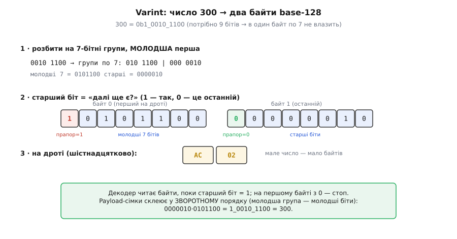
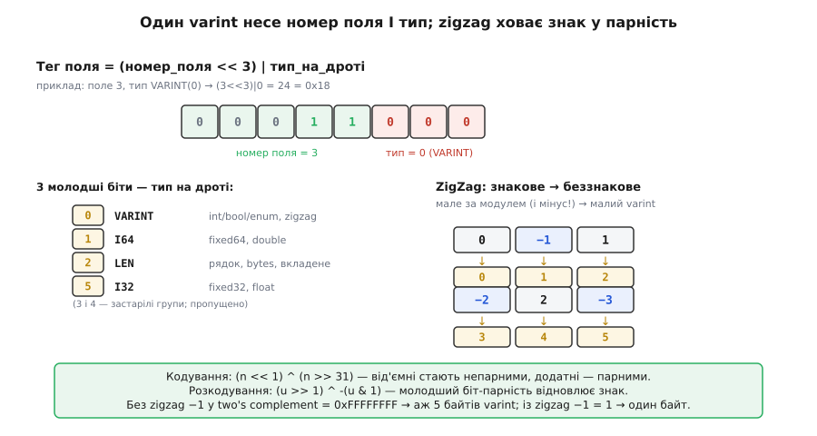

# ⚙️ Varint: цілі числа завдовжки рівно стільки, скільки треба

Уявіть телеметрію дрона: сотні разів на секунду в ефір ідуть номери полів, лічильники, статуси, дрібні координатні прирости. Майже всі ці числа — **малі**. Номер поля — 3, статус — 1, приріст кута — 12. Але оголошені вони як `uint32_t`, і якщо класти їх у потік «як є», кожне з'їдає чотири байти, з яких три — суцільні нулі. На каналі, де кожен байт коштує ефірного часу й заряду, платити чотирма байтами за число, що вміщається в один, — марнотратство, яке за годину польоту виллється в кілограми зайвого трафіку.

Звідси проста, але напрочуд плідна ідея: **нехай число займає стільки байтів, скільки йому справді треба**. Мале — один байт, велике — кілька, дуже велике — багато. Формат, у якому довжина числа не фіксована, а залежить від самого числа, зветься **varint** (від англ. *variable-length integer* — «ціле змінної довжини»). Це той самий механізм, на якому тримається щільність Protocol Buffers і багатьох бінарних протоколів; тут ми зберемо його з нуля в робочому C — так, як він живе у прошивці, — і розберемо всі гострі кути, об які об цей код ріжуться найчастіше.

## Ідея: сім бітів корисних, один — прапорець

Байт має вісім бітів. Питання, яке треба розв'язати: якщо число не вміщається в один байт, як читач **зрозуміє**, що байтів насправді кілька, і де вони закінчуються? У потоці немає розділових ком; є лише суцільний струмінь октетів. Читач мусить дізнатися межу числа **з самих байтів**.

Розв'язок гарний своєю ощадливістю: пожертвувати **одним бітом** у кожному байті на роль прапорця. Домовмося, що **старший біт** (той, що з вагою 128) кожного байта — не частина числа, а сигнал «**далі ще є**»: якщо він `1` — за цим байтом іде наступний байт того самого числа; якщо `0` — це останній байт. Решта сім бітів — корисне навантаження (*payload*), самі цифри числа. Таке кодування семибітними групами зветься **base-128**: у кожному байті вміщається значення від 0 до 127, а старший біт — службовий.

> 🔧 **Навіщо це.** Прапорець-біт розв'язує саме ту задачу, через яку наївне «шлю чотири байти завжди» програє: **самоописну довжину**. Читачеві не треба знати наперед, скільки байтів у числі, — він читає їх один за одним, аж поки не натрапить на байт із нульовим старшим бітом. Це та сама логіка, що дає бінарним самоописним форматам їхню гнучкість: потік сам розповідає свою структуру, а не покладається на зовнішню домовленість про розміри.

Лишається одне рішення — **у якому порядку** класти семибітні групи. Varint кладе їх **молодшою групою вперед** (little-endian на рівні семибіток): перший байт несе наймолодші сім бітів числа, наступний — сім старших, і так далі. Це не примха, а зручність для кодувальника: він щоразу відриває наймолодші сім бітів (`n & 0x7F`), відсуває число на сім позицій праворуч (`n >>= 7`) і повторює, поки лишається що кодувати. Порядок «молодша перша» рівно збігається з тим, що природно вилітає з цього циклу.

Пройдімо один приклад руками, бо на ньому видно все.

**Умова.** Закодувати число 300 у varint.

```
300 у двійковому:  1 0010 1100   (дев'ять значущих бітів — в один байт по 7 не влазить)

крок 1 — відірвати наймолодші 7 бітів:   300 & 0x7F = 010 1100  = 0x2C = 44
крок 2 — лишок зсунути на 7 праворуч:     300 >> 7  = 000 0010  = 2
крок 3 — лишок ≠ 0, тож перший байт іще НЕ останній → прапорець = 1
         байт 0 = 1 0101100 = 0x80 | 0x2C = 0xAC
крок 4 — тепер кодуємо лишок 2:           2 & 0x7F = 0000010 = 2
         2 >> 7 = 0 → лишку більше немає → прапорець = 0
         байт 1 = 0 0000010 = 0x02
```

На дроті: **`0xAC 0x02`** — два байти замість чотирьох. Читач збере число назад так само просто: візьме сім молодших бітів кожного байта й склеїть їх **у зворотному порядку** — молодша група дає молодші біти результату. Тобто `0000010` (з другого байта) стають старшими, `0101100` (з першого) — молодшими: `0000010_0101100 = 1_0010_1100 = 300`. Перевірка звіркою: другий байт несе значення 2 з вагою 128, перший — 44 з вагою 1, разом `2·128 + 44 = 300`. Збіглося.


*Число 300 не влазить у сім бітів, тож іде двома байтами. Кодувальник відриває наймолодші сім бітів (0101100), ставить старший біт у 1 («далі ще є») — виходить 0xAC; лишок 2 кладе в другий байт зі старшим бітом 0 («останній») — 0x02. Декодер читає, поки старший біт = 1, і склеює семибітні payload'и у зворотному порядку: молодша група — у молодші розряди результату.*

## Робочий C: кодування uint32 і uint64

Тепер — код, який реально стоїть у прошивках. Почнемо з кодувальника беззнакового 32-бітного. Ключове рішення інтерфейсу: функція має **не вгадувати**, скільки байтів вона запише, а **сказати** це викликачеві й **не вилізти** за наданий буфер. Тому вона приймає буфер, його місткість, і повертає кількість записаних байтів — або сигнал «не влізло».

:::tabs
```cpp
#include <cstdint>
#include <cstddef>

// Закодувати value у varint у buf місткістю cap байтів.
// Повертає число записаних байтів, або 0 якщо не влізло (буфер замалий).
size_t varint_encode_u32(uint32_t value, uint8_t *buf, size_t cap) {
    size_t i = 0;
    // Поки лишаються біти ПОНАД молодші сім — ставимо прапорець «далі ще є».
    while (value >= 0x80) {              // >= 0x80 означає: є що кодувати після цих 7 бітів
        if (i >= cap) return 0;          // межа буфера — критична перевірка (див. пастки)
        buf[i++] = (uint8_t)(value | 0x80);  // молодші 7 бітів + старший біт = 1
        value >>= 7;                     // з'їли сім бітів, рухаємось далі
    }
    if (i >= cap) return 0;              // місце на останній байт
    buf[i++] = (uint8_t)value;           // останній байт: старший біт = 0 (бо value < 0x80)
    return i;
}
```
```python
# Закодувати value у varint, повернути bytes (Python сам зростає буфер).
def varint_encode_u32(value: int) -> bytes:
    out = bytearray()
    # Поки лишаються біти ПОНАД молодші сім — ставимо прапорець «далі ще є».
    while value >= 0x80:                 # >= 0x80 означає: є що кодувати після цих 7 бітів
        out.append((value & 0x7F) | 0x80)  # молодші 7 бітів + старший біт = 1
        value >>= 7                      # з'їли сім бітів, рухаємось далі
    out.append(value)                    # останній байт: старший біт = 0 (бо value < 0x80)
    return bytes(out)
```
```go
// Закодувати value у varint у buf місткістю len(buf) байтів.
// Повертає число записаних байтів, або 0 якщо не влізло (буфер замалий).
func VarintEncodeU32(value uint32, buf []byte) int {
	i := 0
	// Поки лишаються біти ПОНАД молодші сім — ставимо прапорець «далі ще є».
	for value >= 0x80 { // >= 0x80 означає: є що кодувати після цих 7 бітів
		if i >= len(buf) {
			return 0 // межа буфера — критична перевірка (див. пастки)
		}
		buf[i] = byte(value) | 0x80 // молодші 7 бітів + старший біт = 1
		i++
		value >>= 7 // з'їли сім бітів, рухаємось далі
	}
	if i >= len(buf) {
		return 0 // місце на останній байт
	}
	buf[i] = byte(value) // останній байт: старший біт = 0 (бо value < 0x80)
	i++
	return i
}
```
```js
// Закодувати value у varint, повернути Uint8Array (значення до 2^32-1).
function varintEncodeU32(value) {
    const out = [];
    // Поки лишаються біти ПОНАД молодші сім — ставимо прапорець «далі ще є».
    while (value >= 0x80) {              // >= 0x80 означає: є що кодувати після цих 7 бітів
        out.push((value & 0x7f) | 0x80); // молодші 7 бітів + старший біт = 1
        value = Math.floor(value / 128); // з'їли сім бітів (>>>7 псує 32-й біт)
    }
    out.push(value);                     // останній байт: старший біт = 0 (бо value < 0x80)
    return Uint8Array.from(out);
}
```
:::

Розберімо, чому кожен рядок саме такий. Умова циклу `value >= 0x80` — це перевірка «чи є ще значущі біти поза наймолодшими сімома». Поки число не менше 128, старші біти існують, тож поточний байт **не** останній: беремо `value | 0x80` — це молодші сім бітів разом із виставленим прапорцем — і зсуваємо `value` на сім праворуч. Щойно `value` впало нижче 128, усе, що лишилось, вміщається в сім бітів: пишемо його як є, зі старшим бітом 0 (бо `value < 0x80` гарантує, що восьмий біт нульовий), і завершуємось.

Тонкість, яку легко проґавити: `buf[i++] = (uint8_t)(value | 0x80)` бере наймолодший байт `value`, а старші байти приведення до `uint8_t` просто відкидає — і це правильно, бо старші сім бітів ми однаково зсунемо в наступній ітерації. Прапорець `| 0x80` вплине лише на восьмий біт саме цього байта.

Для `uint64_t` код **буквально той самий**, змінюється лише тип аргумента — цикл сам ітерується стільки разів, скільки треба (до десяти для повного 64-бітного числа):

:::tabs
```cpp
size_t varint_encode_u64(uint64_t value, uint8_t *buf, size_t cap) {
    size_t i = 0;
    while (value >= 0x80) {
        if (i >= cap) return 0;
        buf[i++] = (uint8_t)(value | 0x80);
        value >>= 7;
    }
    if (i >= cap) return 0;
    buf[i++] = (uint8_t)value;
    return i;
}
```
```python
# Той самий цикл — Python-цілі й так довільної ширини, тип не має значення.
def varint_encode_u64(value: int) -> bytes:
    out = bytearray()
    while value >= 0x80:
        out.append((value & 0x7F) | 0x80)
        value >>= 7
    out.append(value)
    return bytes(out)
```
```go
func VarintEncodeU64(value uint64, buf []byte) int {
	i := 0
	for value >= 0x80 {
		if i >= len(buf) {
			return 0
		}
		buf[i] = byte(value) | 0x80
		i++
		value >>= 7
	}
	if i >= len(buf) {
		return 0
	}
	buf[i] = byte(value)
	i++
	return i
}
```
```js
// 64-бітні значення не влазять у Number — беремо BigInt.
function varintEncodeU64(value) {
    const out = [];
    while (value >= 0x80n) {
        out.push(Number((value & 0x7fn) | 0x80n));
        value >>= 7n;
    }
    out.push(Number(value));
    return Uint8Array.from(out);
}
```
:::

Скільки байтів це може дати найбільше? Кожен байт несе сім бітів корисних. Для 32-бітного числа треба вмістити 32 біти: `⌈32 / 7⌉ = 5` байтів. Для 64-бітного — `⌈64 / 7⌉ = 10` байтів. Це верхні межі, підтверджені специфікацією Protocol Buffers: 32-бітний varint — **до 5 байтів**, 64-бітний — **до 10** (усталений факт зі специфікації кодування Protobuf). Звідси випливає розмір буфера, який гарантовано вмістить будь-який varint: **10 байтів** для 64-бітного, п'яти досить для 32-бітного.

```c
#define VARINT_MAX_U32  5    // ⌈32/7⌉
#define VARINT_MAX_U64  10   // ⌈64/7⌉ — і рівно стільки треба на найбільше 64-бітне
```

> 🔧 **Навіщо це.** Ці два числа — 5 і 10 — не абстрактна дрібниця, а те, від чого ви **відлічуєте розмір буфера** у прошивці без динамічної пам'яті. Оголосивши `uint8_t frame[64]`, ви маєте точно знати, що найгірший випадок пакування вкладеться в ці 64 байти. Якщо в кадрі десять `uint64`-полів, кожне з яких може роздутися до 10 байтів varint, — це вже 100 байтів лише на числа, і кадр не влізе. Верхні межі дають змогу **порахувати найгірший випадок наперед**, а не зловити переповнення буфера в польоті.

## Робочий C: декодування з перевіркою обірваного потоку

Декодування — дзеркальне, але саме **тут** живуть найгостріші пастки, бо декодер читає **ненадійний** зовнішній потік: байти могли обірватися посеред числа, канал міг зіпсувати старший біт так, що varint став «нескінченним». Тому декодер мусить, по-перше, **не читати за межу** буфера, і по-друге, **не приймати неможливо довгий** varint.

:::tabs
```cpp
// Розкодувати varint із buf довжиною len у *out.
// Повертає число зчитаних байтів, або 0 при помилці (обірваний або задовгий потік).
size_t varint_decode_u32(const uint8_t *buf, size_t len, uint32_t *out) {
    uint32_t result = 0;
    size_t   i = 0;
    int      shift = 0;

    while (i < len) {
        uint8_t b = buf[i++];
        // Наростити результат: молодші 7 бітів цього байта на позицію shift.
        result |= (uint32_t)(b & 0x7F) << shift;
        if ((b & 0x80) == 0) {           // старший біт 0 → це останній байт числа
            *out = result;
            return i;                    // успіх: повертаємо, скільки байтів з'їли
        }
        shift += 7;
        if (shift >= 32) return 0;        // задовгий varint для 32 бітів → потік зіпсовано
    }
    return 0;                            // дійшли до кінця буфера, а прапорець ще «далі є» → обірвано
}
```
```python
# Повертає (значення, число_зчитаних_байтів); (None, 0) при помилці.
def varint_decode_u32(buf: bytes):
    result = 0
    shift = 0
    for i, b in enumerate(buf):
        # Наростити результат: молодші 7 бітів цього байта на позицію shift.
        result |= (b & 0x7F) << shift
        if (b & 0x80) == 0:              # старший біт 0 → це останній байт числа
            return result & 0xFFFFFFFF, i + 1  # успіх
        shift += 7
        if shift >= 32:                  # задовгий varint для 32 бітів → потік зіпсовано
            return None, 0
    return None, 0                       # прапорець ще «далі є», а буфер скінчився → обірвано
```
```go
// Повертає (значення, число зчитаних байтів); ok=false при помилці.
func VarintDecodeU32(buf []byte) (value uint32, n int, ok bool) {
	var result uint32
	shift := 0
	for i := 0; i < len(buf); i++ {
		b := buf[i]
		// Наростити результат: молодші 7 бітів цього байта на позицію shift.
		result |= uint32(b&0x7F) << shift
		if b&0x80 == 0 { // старший біт 0 → це останній байт числа
			return result, i + 1, true // успіх
		}
		shift += 7
		if shift >= 32 { // задовгий varint для 32 бітів → потік зіпсовано
			return 0, 0, false
		}
	}
	return 0, 0, false // прапорець ще «далі є», а буфер скінчився → обірвано
}
```
```js
// Повертає { value, bytes } при успіху, або null при помилці.
function varintDecodeU32(buf) {
    let result = 0;
    let shift = 0;
    for (let i = 0; i < buf.length; i++) {
        const b = buf[i];
        // Наростити результат: множимо на 2^shift (<< псує 32-й біт).
        result += (b & 0x7f) * 2 ** shift;
        if ((b & 0x80) === 0) {          // старший біт 0 → це останній байт числа
            return { value: result >>> 0, bytes: i + 1 }; // успіх
        }
        shift += 7;
        if (shift >= 32) return null;    // задовгий varint для 32 бітів → потік зіпсовано
    }
    return null;                         // прапорець ще «далі є», а буфер скінчився → обірвано
}
```
:::

Три перевірки в цьому коді — не перестраховка, а те, що відрізняє код, який виживає в полі, від коду, який падає на першому ж збійному пакеті.

**Перша — межа буфера.** Умова циклу `while (i < len)` не дає прочитати байт за кінцем даних. Якщо потік обірвався посеред числа (останній наявний байт іще має прапорець «далі є»), цикл дійде до `i == len`, вийде і поверне `0` — «неповний varint». Без цієї межі декодер поліз би читати чужу пам'ять за буфером — класична вразливість розбору недовірених даних.

**Друга — задовгий varint.** Перевірка `shift >= 32` ловить ситуацію, коли байти йдуть і йдуть, а прапорець усе не гасне: або канал зіпсував старші біти, або хтось зловмисно шле нескінченний varint. Для 32-бітного числа значущих зсувів може бути щонайбільше п'ять (0, 7, 14, 21, 28); коли `shift` доходить до 35, місця в 32-бітному результаті вже немає — це напевно сміття, і ми відмовляємось, а не крутимось вічно. Для `uint64` межа була б `shift >= 64`.

**Третя, тонша — переповнення на останньому байті.** Суворий декодер Protobuf перевіряє ще й те, що на п'ятому байті 32-бітного varint встановлені лише ті біти, що влазять у 32-бітний результат (наймолодші чотири біти payload'у), а решта — нулі. Наш простий варіант цього не робить: `<< shift` при `shift == 28` для п'ятого байта відкине зайві біти зсувом за межу типу, і в C для беззнакового це визначена поведінка (зайві старші біти просто пропадають). Це прийнятно для прошивки, що довіряє власному відправникові, але про цю строгість варто знати: справжня «канонічність» varint вимагає відмовляти й на переповненому останньому байті.

Ось декодер `uint64` — знову майже той самий, лише ширший тип і межа 64:

:::tabs
```cpp
size_t varint_decode_u64(const uint8_t *buf, size_t len, uint64_t *out) {
    uint64_t result = 0;
    size_t   i = 0;
    int      shift = 0;

    while (i < len) {
        uint8_t b = buf[i++];
        result |= (uint64_t)(b & 0x7F) << shift;
        if ((b & 0x80) == 0) {
            *out = result;
            return i;
        }
        shift += 7;
        if (shift >= 64) return 0;
    }
    return 0;
}
```
```python
# Той самий алгоритм; межа зсуву тепер 64.
def varint_decode_u64(buf: bytes):
    result = 0
    shift = 0
    for i, b in enumerate(buf):
        result |= (b & 0x7F) << shift
        if (b & 0x80) == 0:
            return result & 0xFFFFFFFFFFFFFFFF, i + 1
        shift += 7
        if shift >= 64:
            return None, 0
    return None, 0
```
```go
func VarintDecodeU64(buf []byte) (value uint64, n int, ok bool) {
	var result uint64
	shift := 0
	for i := 0; i < len(buf); i++ {
		b := buf[i]
		result |= uint64(b&0x7F) << shift
		if b&0x80 == 0 {
			return result, i + 1, true
		}
		shift += 7
		if shift >= 64 {
			return 0, 0, false
		}
	}
	return 0, 0, false
}
```
```js
// 64-бітний результат тримаємо в BigInt.
function varintDecodeU64(buf) {
    let result = 0n;
    let shift = 0n;
    for (let i = 0; i < buf.length; i++) {
        const b = buf[i];
        result |= BigInt(b & 0x7f) << shift;
        if ((b & 0x80) === 0) {
            return { value: result, bytes: i + 1 };
        }
        shift += 7n;
        if (shift >= 64n) return null;
    }
    return null;
}
```
:::

Зверніть увагу на приведення `(uint64_t)(b & 0x7F)` **перед** зсувом. Це не косметика: якби ми написали `(b & 0x7F) << shift` без приведення, то `b & 0x7F` має тип `int` (через [цілочисельне підвищення](topic:sf-lang/overflow-wraparound)), і зсув на 35, 42, ... позицій — це зсув за розрядність `int`, тобто **невизначена поведінка**. Приведенням до `uint64_t` **перед** зсувом ми робимо операцію в достатньо широкому беззнаковому типі, де великі зсуви коректні. Той самий клас пастки, що й у ручному складанні багатобайтових чисел зсувами взагалі.

## Межові випадки: 0, максимум, обірваний потік

Код без перевірки на межах — код, що працює лише на «зручних» числах. Пройдімо три межі, на яких varint найчастіше ловить помилки.

**Нуль.** Число 0 має кодуватися як **один** байт `0x00`: у циклі кодувальника умова `0 >= 0x80` хибна одразу, тож ми проскакуємо цикл і пишемо єдиний байт `(uint8_t)0 = 0x00` зі старшим бітом 0. Декодер прочитає цей байт, побачить погашений прапорець, поверне `result == 0` і `1` зчитаний байт. Важливо: нуль — це **не порожнеча**, а повноцінний однобайтовий varint; помилкою було б закодувати його нулем байтів.

**Максимум `uint32`.** Число `0xFFFFFFFF` (4294967295) — усі 32 біти в одиницях — розкладається на п'ять байтів:

```
0xFFFFFFFF = 1111...1111 (32 одиниці)
байт 0: 0x7F payload | прапорець → 0xFF
байт 1: 0x7F | прапорець → 0xFF
байт 2: 0x7F | прапорець → 0xFF
байт 3: 0x7F | прапорець → 0xFF
байт 4: лишились наймолодші 4 біти (1111 = 0x0F), прапорець 0 → 0x0F
на дроті: FF FF FF FF 0F  — п'ять байтів, як і передбачає ⌈32/7⌉
```

Це найгірший випадок для 32-бітного: п'ять байтів. Саме тому varint **вигідний лише для малих чисел** — велике число він кодує **гірше**, ніж фіксовані чотири байти. Тут видно суть компромісу: varint ставить на те, що більшість чисел у реальному потоці малі; за це припущення платить один зайвий байт на кожне велике число, яке його не справдило.

**Обірваний потік.** Найпідступніший випадок. Уявіть, що на дроті мало бути `0xAC 0x02` (число 300), але прийшов лише перший байт `0xAC` — пакет обрізало. Його старший біт `1` каже «далі ще є», а «далі» вже немає:

```c
uint8_t buf[] = { 0xAC };          // лише перший байт числа 300
uint32_t v;
size_t n = varint_decode_u32(buf, sizeof(buf), &v);
// цикл прочитав 0xAC (прапорець=1), shift став 7, i == len == 1 → вихід із циклу
// return 0  →  n == 0: декодер чесно каже «неповний varint, не вір результату»
```

Правильна поведінка — повернути `0` і **не** віддавати недороблене `v`. Найгірша помилка тут — повернути «частковий» результат так, наче він повний: тоді на тому боці 44 (значення першого байта) тихо підміняє собою 300, і баг спливе далеко від місця, де народився. Тому інтерфейс декодера свідомо єдиним значенням `0` кричить «дані не склалися», і викликач мусить це перевірити, а не проігнорувати.

## Знакові числа: чому потрібен zigzag

Досі всі числа були беззнакові. А що з від'ємними? Спокуса — просто взяти байти знакового числа й закодувати їх varint'ом як беззнакові. Спробуймо на `−1`.

У двійковому доповненні (*two's complement*), як лежать знакові в пам'яті, `−1` типу `int32_t` — це `0xFFFFFFFF`, усі 32 біти в одиницях. Закодуйте це varint'ом — і вийде **п'ять байтів** (як щойно бачили для максимуму `uint32`). Тобто `−1`, найдрібніше за модулем від'ємне число, коштувало б аж п'ять байтів! Причина: старший (знаковий) біт від'ємного числа завжди `1`, і всі старші розряди в доповненні — суцільні одиниці, тож varint змушений виписати їх усі. Наївне кодування знакових через varint робить **усі** від'ємні числа максимально дорогими — рівно навпаки до того, чого ми хотіли.

Розв'язок — **zigzag-кодування**: перед varint'ом переставити числа так, щоб мале за модулем (байдуже, додатне чи від'ємне) давало малий беззнаковий код. Ідея у назві: пронумерувати цілі числа «зигзагом» навколо нуля.

```
знакове:   0   −1    1   −2    2   −3    3   −4  ...
zigzag:    0    1    2    3    4    5    6    7  ...
```

Нуль лишається нулем; далі по черзі: `−1` → 1, `1` → 2, `−2` → 3, `2` → 4... Додатні числа стають **парними** беззнаковими, від'ємні — **непарними**. Тепер `−1` кодується беззнаковим `1` — **один** байт замість п'яти. Мале від'ємне знову дешеве, як і має бути.

Магія робиться двома бітовими операціями. **Кодування** знакового `n` у беззнакове:

```
zigzag32(n) = (n << 1) ^ (n >> 31)      // для 32-бітного
zigzag64(n) = (n << 1) ^ (n >> 63)      // для 64-бітного
```

Розберімо, **чому** це працює. `n << 1` подвоює число — саме воно дає «парні для додатних». Другий доданок `n >> 31` — це **арифметичний** зсув знакового числа на 31 позицію: він розтягує знаковий біт на всі 32 розряди. Для додатного `n` знаковий біт `0`, тож `n >> 31` дає `0x00000000` (усі нулі), і `XOR` з нулем нічого не змінює — додатне просто подвоїлось. Для від'ємного `n` знаковий біт `1`, тож `n >> 31` дає `0xFFFFFFFF` (усі одиниці), і `XOR` з цією маскою **інвертує** подвоєне число — що в двійковому доповненні рівносильно перетворенню `2·|n| − 1`, тобто дає потрібне непарне. Один рядок акуратно поєднує обидва випадки без жодного `if`.

**Розкодування** — назад із беззнакового `u` у знакове:

```
unzigzag32(u) = (u >> 1) ^ -(u & 1)     // >> тут ЛОГІЧНИЙ (u беззнаковий)
```

Тут `u >> 1` ділить навпіл (скасовує подвоєння), а `-(u & 1)` — уся хитрість: `u & 1` бере наймолодший біт (парність), а мінус перетворює його або на `0` (якщо `u` парне — було додатне), або на `−1 = 0xFFFFFFFF` (якщо `u` непарне — було від'ємне). `XOR` із нулем лишає число як є; `XOR` з `0xFFFFFFFF` інвертує його назад у від'ємне. Парність, яку ми заклали кодуванням, точно відновлює знак.

У коді прошивки це дві короткі функції; тип аргументів навмисне беззнаковий там, де зсуваємо, щоб зсув був логічним, а не арифметичним:

:::tabs
```cpp
// Знакове → беззнакове (перед varint_encode)
uint32_t zigzag_encode_32(int32_t n) {
    return ((uint32_t)n << 1) ^ (uint32_t)(n >> 31);
}
// Беззнакове → знакове (після varint_decode)
int32_t zigzag_decode_32(uint32_t u) {
    return (int32_t)((u >> 1) ^ (~(u & 1) + 1));   // ~(u&1)+1 = -(u&1) без UB на знаковому
}
```
```python
# Знакове → беззнакове (перед varint_encode)
def zigzag_encode_32(n: int) -> int:
    return ((n << 1) ^ (n >> 31)) & 0xFFFFFFFF     # n>>31 у Python розтягує знак сам
# Беззнакове → знакове (після varint_decode)
def zigzag_decode_32(u: int) -> int:
    v = (u >> 1) ^ -(u & 1)                        # -(u&1) = 0 або -1
    return v                                       # уже коректне знакове
```
```go
// Знакове → беззнакове (перед varint_encode)
func ZigzagEncode32(n int32) uint32 {
	return uint32(n<<1) ^ uint32(n>>31) // n>>31 — арифметичний зсув знакового
}
// Беззнакове → знакове (після varint_decode)
func ZigzagDecode32(u uint32) int32 {
	return int32(u>>1) ^ -int32(u&1) // -(u&1) = 0 або -1
}
```
```js
// Знакове → беззнакове (перед varint_encode); | 0 тримає 32 біти зі знаком.
function zigzagEncode32(n) {
    return (((n << 1) ^ (n >> 31)) >>> 0);         // >>> 0 → беззнаковий результат
}
// Беззнакове → знакове (після varint_decode)
function zigzagDecode32(u) {
    return ((u >>> 1) ^ -(u & 1)) | 0;             // -(u&1) = 0 або -1
}
```
:::

Зверніть увагу на дрібну, але важливу деталь у декодері: замість `-(u & 1)` тут написано `~(u & 1) + 1`. Це те саме значення (заперечення в доповненні), але пораховане **в беззнаковому типі**, щоб уникнути формально невизначеної поведінки при діленні знакового мінімуму. У прошивці такі дрібниці економлять години пошуку «неможливих» багів на межових значеннях. І `(uint32_t)(n >> 31)` у кодері: сам зсув `n >> 31` — арифметичний (бо `n` знакове, і нам **потрібно** розтягнути знак), а приведення до `uint32_t` — вже для коректного `XOR` з першим доданком.

**Умова.** Закодувати `−2` через zigzag і varint.

```
zigzag_encode_32(-2):
  (uint32_t)(-2) << 1  = 0xFFFFFFFE << 1 = 0xFFFFFFFC
  (-2) >> 31           = 0xFFFFFFFF          (знаковий біт розтягнуто)
  XOR                  = 0xFFFFFFFC ^ 0xFFFFFFFF = 0x00000003 = 3
varint_encode_u32(3):  3 < 0x80 → один байт 0x03
на дроті: 0x03        — від'ємне −2 коштує один байт
перевірка розкодуванням: unzigzag(3) = (3>>1) ^ -(3&1) = 1 ^ (-1) = 1 ^ 0xFFFFFFFF = 0xFFFFFFFE = -2 ✓
```

Важливо усвідомити межу застосування: zigzag варто вмикати **лише** для полів, значення яких реально бувають від'ємними й зазвичай малі за модулем (координатні прирости, різниці, зсуви). Для полів, що завжди невід'ємні (лічильники, розміри, ідентифікатори), zigzag зайвий — там пряме беззнакове varint-кодування вже оптимальне, а zigzag би тільки подвоїв усі значення. Саме тому Protobuf розрізняє типи `sint32`/`sint64` (кодуються zigzag'ом) і `int32`/`int64` (кодуються прямо, тож від'ємні в них дорогі).

## Розкладка тега Protobuf: номер і тип в одному varint

Varint — не самоціль, а цеглинка, з якої Protocol Buffers складає **тег поля**. Згадаймо задачу схемного формату: перед кожним значенням має стояти маленький заголовок, який каже дві речі — **під яким номером** це поле в схемі й **якого воно типу на дроті** (щоб читач знав, скільки байтів забирати й як їх тлумачити). Марнотратно було б класти номер і тип двома окремими числами; Protobuf **зшиває їх в один varint**:

```
тег = (номер_поля << 3) | тип_на_дроті
```

Три молодші біти несуть **тип на дроті** (*wire type*), решта — **номер поля**. Три біти дають вісім можливих типів, з яких Protobuf використовує (усталено, зі специфікації кодування Protobuf):

```
0  VARINT   — int32/int64/uint32/uint64/sint32/sint64/bool/enum (усе, що varint)
1  I64      — fixed64, sfixed64, double  (рівно 8 байтів)
2  LEN      — string, bytes, вкладене повідомлення, «упаковані» масиви (спереду — довжина varint'ом)
5  I32      — fixed32, sfixed32, float   (рівно 4 байти)
(3 і 4 — SGROUP/EGROUP, застарілі «групи»; у новому коді не вживаються)
```

Чому саме **три** біти під тип, а не два чи чотири? Три — це найменше, що вміщає всі потрібні типи (їх шість) із запасом, і водночас лишає під номер поля цілих 29 бітів у 32-бітному тезі — більш ніж досить для будь-якої реальної схеми. Тип у **молодших** бітах, а не старших, — щоб декодер діставав його однією маскою `& 0x07`, не знаючи наперед, скільки бітів у номері.

**Умова.** Скласти й розібрати тег для поля номер 3 типу VARINT (тобто `uint32 temperature = 3;`).

```
складання:  (3 << 3) | 0 = 24 | 0 = 24 = 0x18
            у двійковому: 0001 1000
                          └номер3┘└тип0┘   (старші біти — номер, три молодші — тип)
varint(24): 24 < 0x80 → один байт 0x18

розбір на тому боці:
  прочитати varint → 24
  тип   = 24 & 0x07 = 0        → VARINT
  номер = 24 >> 3   = 3        → поле 3
```

У коді складання й розбір тега — дві крихітні функції, і обидві спираються на вже написаний varint:

:::tabs
```cpp
// wire types
#define WT_VARINT  0
#define WT_I64     1
#define WT_LEN     2
#define WT_I32     5

// Записати тег поля (номер + тип) у buf; повертає число байтів або 0.
size_t tag_encode(uint32_t field_num, uint8_t wire_type,
                  uint8_t *buf, size_t cap) {
    uint32_t tag = (field_num << 3) | (wire_type & 0x07);
    return varint_encode_u32(tag, buf, cap);      // тег — теж varint
}

// Розібрати тег: дістати номер поля й тип. Повертає число з'їдених байтів або 0.
size_t tag_decode(const uint8_t *buf, size_t len,
                  uint32_t *field_num, uint8_t *wire_type) {
    uint32_t tag;
    size_t n = varint_decode_u32(buf, len, &tag);
    if (n == 0) return 0;                          // обірваний/зіпсований тег
    *wire_type = (uint8_t)(tag & 0x07);            // три молодші біти — тип
    *field_num = tag >> 3;                         // решта — номер поля
    return n;
}
```
```python
# wire types
WT_VARINT, WT_I64, WT_LEN, WT_I32 = 0, 1, 2, 5

# Записати тег поля (номер + тип); повертає bytes.
def tag_encode(field_num: int, wire_type: int) -> bytes:
    tag = (field_num << 3) | (wire_type & 0x07)
    return varint_encode_u32(tag)                  # тег — теж varint

# Розібрати тег: (номер, тип, число з'їдених байтів); (None, None, 0) при помилці.
def tag_decode(buf: bytes):
    tag, n = varint_decode_u32(buf)
    if n == 0:                                     # обірваний/зіпсований тег
        return None, None, 0
    wire_type = tag & 0x07                          # три молодші біти — тип
    field_num = tag >> 3                            # решта — номер поля
    return field_num, wire_type, n
```
```go
// wire types
const (
	WtVarint = 0
	WtI64    = 1
	WtLen    = 2
	WtI32    = 5
)

// Записати тег поля (номер + тип) у buf; повертає число байтів або 0.
func TagEncode(fieldNum uint32, wireType uint8, buf []byte) int {
	tag := (fieldNum << 3) | uint32(wireType&0x07)
	return VarintEncodeU32(tag, buf) // тег — теж varint
}

// Розібрати тег: номер, тип, число з'їдених байтів; ok=false при помилці.
func TagDecode(buf []byte) (fieldNum uint32, wireType uint8, n int, ok bool) {
	tag, n, ok := VarintDecodeU32(buf)
	if !ok { // обірваний/зіпсований тег
		return 0, 0, 0, false
	}
	wireType = uint8(tag & 0x07) // три молодші біти — тип
	fieldNum = tag >> 3          // решта — номер поля
	return fieldNum, wireType, n, true
}
```
```js
// wire types
const WT_VARINT = 0, WT_I64 = 1, WT_LEN = 2, WT_I32 = 5;

// Записати тег поля (номер + тип); повертає Uint8Array.
function tagEncode(fieldNum, wireType) {
    const tag = (fieldNum << 3) | (wireType & 0x07);
    return varintEncodeU32(tag >>> 0);             // тег — теж varint
}

// Розібрати тег: { fieldNum, wireType, bytes } або null при помилці.
function tagDecode(buf) {
    const r = varintDecodeU32(buf);
    if (r === null) return null;                   // обірваний/зіпсований тег
    return {
        wireType: r.value & 0x07,                  // три молодші біти — тип
        fieldNum: r.value >>> 3,                   // решта — номер поля
        bytes: r.bytes,
    };
}
```
:::

Уся щільність Protobuf зводиться до цих кількох рядків: **малий номер поля з простим типом займає рівно один байт тега**. Поле 3 типу VARINT — це один байт `0x18`; поле 1, найчастіше вживане, — `0x08`. Ось звідки береться те, що Protobuf-повідомлення з маленькими номерами полів і малими значеннями виходять напрочуд компактними: і тег, і значення — по одному байту.


*Ліворуч — тег поля 3 типу VARINT: `(3<<3)|0 = 0x18`, де три молодші біти — тип на дроті, старші — номер поля; декодер розділяє їх масками `& 0x07` і `>> 3`. Праворуч — zigzag-перестановка: додатні числа лягають на парні беззнакові коди, від'ємні — на непарні, тож мале за модулем від'ємне (як −1) знову дає короткий varint замість п'яти байтів two's-complement.*

## Складність і пастки

Обчислювальна вартість varint скромна й передбачувана. Кодування одного числа — це `⌈бітів / 7⌉` ітерацій, кожна з парою дешевих операцій (маска, зсув, запис); для 32-бітного — щонайбільше п'ять кроків, для 64-бітного — десять. Декодування симетричне. Жодних множень, ділень, звернень до пам'яті поза буфером — саме тому varint літає навіть на найслабших мікроконтролерах. Ціна щільності — гілка `if ((b & 0x80) == 0)` у декодері на кожен байт, яку процесор не завжди добре передбачає; але на тлі економії трафіку це дрібниця.

Тепер — граблі, зібрані в одному місці, бо саме на них ламається код, що «начебто працює».

**Неперевірена межа буфера — і в кодері, і в декодері.** Найнебезпечніша пастка. Кодер без перевірки `i >= cap` перед кожним записом вилізе за буфер на великому числі й затре сусідню пам'ять — тихо, без падіння, з наслідками десь далеко. Декодер без умови `i < len` полізе читати за кінець прийнятих даних, коли потік обірвано посеред числа. Обидва випадки — не теоретичні: обрізані пакети на UART чи радіо — буденність, і саме на них перевірка меж рятує. **Правило: жодного `buf[i++]` без попередньої перевірки, що `i` ще в межах.**

**Задовгий varint — нескінченний або переповнений.** Якщо канал зіпсував старші біти так, що прапорець «далі є» ніколи не гасне, декодер без ліміту `shift >= 32` (чи `>= 64`) закрутиться, читаючи байт за байтом, аж поки не вийде за буфер. Перевірка на максимальну довжину — це і захист від зациклення, і сигнал «дані сміття, відмовляюсь». Окрема, тонша грань — переповнення на **останньому** дозволеному байті: строгий (канонічний) декодер відхиляє й varint, у якому п'ятий байт 32-бітного числа несе біти поза 32-ма розрядами. Простий декодер це проковтне (зайві біти згубляться зсувом), але про строгість треба **знати** — вона стає важливою, щойно ви приймаєте недовірений вхід.

**Арифметичний зсув там, де треба логічний (і навпаки).** У zigzag-**кодуванні** зсув `n >> 31` має бути **арифметичним** — саме він розтягує знак; для цього `n` мусить лишатися **знаковим** перед зсувом. У zigzag-**розкодуванні** та в декодері varint зсуви `>> 1`, `<< shift` мають бути на **беззнакових** типах, щоб зсув був логічним і не тягнув знаковий біт. Переплутати знаковість операнда перед зсувом — і на межових значеннях (мінімальне від'ємне, старші розряди) вискочить або невизначена поведінка, або тихо неправильне число. Тому в коді типи операндів зсуву виставлені **свідомо**, а не «як компілятор виведе».

**Пропущене приведення типу перед зсувом.** `(b & 0x7F) << shift` без приведення до широкого типу — це зсув `int`-значення на 35, 42, ... позицій, тобто зсув **за розрядність `int`** — невизначена поведінка. У декодері `uint64` приведення `(uint64_t)(b & 0x7F)` **перед** зсувом обов'язкове. Той самий клас пастки, що псує ручне [складання багатобайтових чисел зсувами](topic:sf-algorithms/bits-bytes-endianness/proj-serialization.md) взагалі: підвищення до знакового `int` на межі старшого біта.

**Zigzag там, де не треба (і навпаки).** Увімкнути zigzag на полі, що завжди невід'ємне, — марно подвоїти всі його значення, роздувши потік. Забути zigzag на полі, що буває від'ємним, — зробити кожне від'ємне п'ятибайтовим. Рішення просте: **знаковий і зазвичай малий за модулем → zigzag; завжди невід'ємний → пряме varint**. Обидві сторони мусять узгодити це для кожного поля, бо `zigzag_encode` на одному боці й пряме читання на іншому дадуть беззмістовне число.

**Тег: маска типу й порядок бітів.** Три молодші біти — тип, решта — номер; переплутати порядок (взяти номер з молодших) або забути маску `& 0x07` при виставлянні типу — і весь потік розсиплеться, бо приймач шукатиме поля не за тими номерами. Тут помилка не локальна: один зсунутий тег ламає розбір усього, що йде далі в повідомленні.

Varint — маленький механізм, але в ньому як у краплі відбита вся філософія бінарної серіалізації на мікроконтролері: **платити рівно за те, що передаєш**, самоописувати довжину одним бітом, і над усе — **перевіряти межі**, бо декодер завжди читає дані, яким не можна довіряти. Зібраний правильно, він дає ту саму щільність, на якій тримаються Protobuf і десятки протоколів у прошивках; зібраний без перевірок — стає тихою дірою, крізь яку обірваний пакет валить систему.

Sources:
- [Protocol Buffers — Encoding (protobuf.dev)](https://protobuf.dev/programming-guides/encoding/)
- [Making all your integers positive with zigzag encoding — Daniel Lemire](https://lemire.me/blog/2022/11/25/making-all-your-integers-positive-with-zigzag-encoding/)
