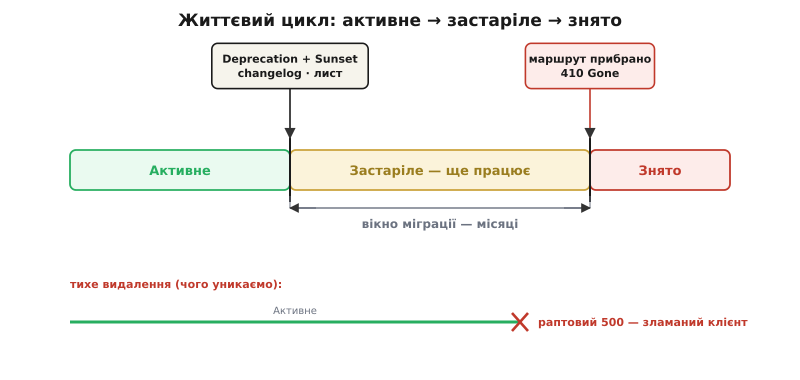
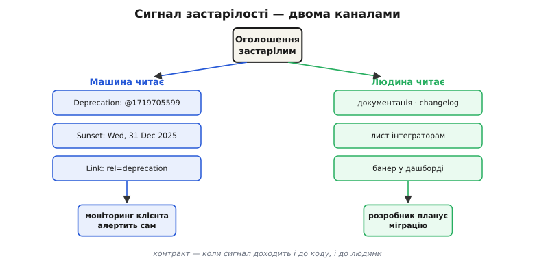
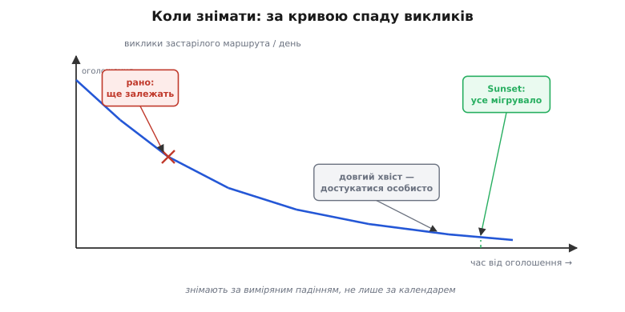

# Деприкейшн API як частина контракту

<preknowlist>
- [REST](root:com-protocol/rest-api) — що таке ресурс і endpoint, методи HTTP, коди відповіді й заголовки: субстрат, на якому живе контракт API.
- [Версіонування API](root:com-protocol/api-versioning) — навіщо в API з'являються версії та як вони співіснують: застарілим часто оголошують саме цілу версію.
</preknowlist>

Коли ви публікуєте endpoint і хтось написав код, що його викликає, ви більше не володієте цим endpoint самі. Ви дали обіцянку — незнайомцям, яких ніколи не побачите: «пошлеш отакий запит — дістанеш отаку відповідь». Їхні застосунки тепер тримаються на вашій обіцянці. І щойно вона стала спільною, її не можна просто змінити, як перейменовуєш локальну змінну.

Ось чому серверний код не правлять так само вільно, як власний. Атом цієї теми — **деприкейшн**: чесний, упорядкований спосіб *завершити* обіцянку, яку більше не хочеш підтримувати. Слово прийшло з латини: *deprecari* (*de-* — геть + *precari* — молити) буквально «відмолювати, відвертати». У коді воно означає «оголосити застарілим»: ця річ ще працює, але ми сповіщаємо, що вона відходить, — не будуйте на ній нового й починайте переходити.

Головна теза проста, і її легко проґавити: деприкейшн — **не подія видалення, а частина контракту**. Добрий контракт API каже не лише «ось що я роблю», а й «ось як я попереджу, що щось відходить, і скільки часу ти матимеш». Ця передбачуваність — сама по собі цінність.

## Чому не можна просто видалити

Локально прибрати поле — тривіальна правка. На бекенді — ні, бо між вами й наслідком стоять споживачі, яких ви не контролюєте. Мобільний застосунок уже стоїть у сотнях тисяч телефонів, і ви не змусите всіх оновитися. Партнер вбудував ваш API у свій продукт торік і забув про нього. Хтось написав нічний скрипт, що звіряє дані. Прибрали поле — і всі вони ламаються одночасно, а дізнаєтесь ви про це як про чужий інцидент о третій ночі.

Гірше, ніж здається. Досить мати достатньо споживачів — і будь-яку *спостережну* поведінку вашої системи хтось починає використовувати, навіть ту, якої ви не обіцяли й не документували. [Це спостереження](root:sf-release/hyrums-law) означає, що ваш фактичний контракт ширший за писаний: порядок полів у JSON, точний текст помилки, округлення в останньому знаку — усе це десь уже вросло в чийсь код. Тому «непомітних» змін на популярному API майже не буває.

Звідси висновок — не «ніколи нічого не міняти» (система, яку не можна розвивати, мертва), а **міняти за правилами**: спершу оголосити застарілим, дати шлях переходу й час, і лише потім прибрати.

## Застаріле — це не видалене

Уся суть тримається на одному розрізненні. **Застаріле** (deprecated) і **знято** (removed) — це дві різні події, розсунуті в часі.

- *Застаріле* — воно **ще працює** точно як раніше. Ви лише оголосили: це відходить, не будуйте нового, починайте мігрувати. Поведінка не змінилась ані на біт.
- *Знято* (інша назва — **sunset**, англ. «захід сонця») — його **більше немає**. Endpoint відповідає `410 Gone` — «пішло назавжди», а не тимчасова помилка `404` чи `500`.

Плутати їх — типова помилка. «Ми задепрекейтили цей endpoint» надто часто означає «ми його вимкнули», і споживач дізнається про деприкейшн і про поломку в одну секунду. Це не деприкейшн — це те саме тихе видалення, лише названо розумним словом. Справжній деприкейшн — це **проміжок**: оголосили сьогодні, а прибрали через місяці, і весь цей час стара поведінка жива.

> 🔧 **Навіщо це.** Проміжок між «застаріле» і «знято» — це і є продукт. Споживач не боїться інтегруватися з вами не тому, що ви ніколи нічого не міняєте, а тому, що знає: коли щось відходитиме, він дістане попередження й місяці на переїзд, а не раптову поломку. Передбачуваність деприкейшну — те, за що, по суті, платять довірою до API.

## Життєвий цикл: активне → застаріле → знято

Отже, у кожного endpoint, поля чи версії є три стани, і перехід між ними — не миттєвий, а по датах.



*Три фази на осі часу: активне, застаріле (ще працює) і знято. Між днем оголошення й днем зняття лежить вікно міграції — місяці. Унизу — тихе видалення, де активне одразу стає зламаним, без цього вікна.*

Активне — нормальна робота. У **день оголошення** endpoint не ламається — він лише вмикає сигнали «застаріле» й дістає дату зняття. Між цим днем і датою зняття лежить **вікно міграції** — місяці, за які споживачі мають перейти. У день зняття (sunset) маршрут прибирають.

Внизу — те, чого уникаємо: тихе видалення, де активне одразу стає зламаним. Різниця не в тому, *що* прибрали, а в тому, що в чесному циклі між рішенням і поломкою є оголошений, виміряний проміжок.

Тривалість вікна — теж частина обіцянки. Зрілі платформи публікують її наперед: «мінімум N місяців від оголошення до зняття». Мова Python пройшла цей шлях у крайньому масштабі — Python 2 давно вважали спадщиною, а остаточно зняли з підтримки лише 1 січня 2020 року, давши екосистемі роки на переїзд.

## Сигнал, який читають і машина, і людина

Оголосити застарілим — означає *повідомити*. І повідомити треба двома каналами одночасно, бо по інший бік дві різні аудиторії: код і людина.



*Одне оголошення розходиться двома каналами: машинним (заголовки Deprecation/Sunset/Link — їх читає моніторинг клієнта) і людським (changelog, лист, банер — їх читає розробник). Контракт тримається, лише коли доходять обидва.*

**Машинний канал** — заголовки прямо у HTTP-відповіді. Стандарт тут усталився недавно й у два кроки: заголовок `Sunset` (RFC 8594, 2019) називає дату, коли ресурс стане недоступним, а заголовок `Deprecation` (RFC 9745, 2025) — момент, коли ресурс оголошено застарілим. [Історія цих двох заголовків](root:com-protocol/deprecation-basics/hist-deprecation-headers.md) пояснює, чому знадобилося дві окремі позначки й ціле десятиліття. Разом із ними йде посилання на інструкцію з переходу:

```http
HTTP/1.1 200 OK
Deprecation: @1719705599
Sunset: Wed, 31 Dec 2025 23:59:59 GMT
Link: <https://api.example.com/docs/migrate-v1>; rel="deprecation"; type="text/html"
```

Тонкість, на якій легко спіткнутися: `Deprecation` несе дату у Unix-форматі з `@`, а `Sunset` — у форматі HTTP-дати; історично це різні представлення часу. І дата зняття не може бути раніша за дату деприкейшну — інакше контракт суперечить сам собі.

Ключове тут — що застарілість тепер може **прочитати машина**. Клієнтський моніторинг бачить заголовок у відповіді й піднімає алерт сам, не чекаючи, поки застосунок зламається на дату зняття. Стамп цих заголовків на маршруті — кілька рядків middleware:

:::tabs
```ts
// Express: помічаємо маршрут застарілим
function deprecate(announced: string, sunset: string, docs: string) {
  const depr = `@${Math.floor(Date.parse(announced) / 1000)}`;
  const sun = new Date(sunset).toUTCString();
  return (_req: Request, res: Response, next: NextFunction) => {
    res.setHeader("Deprecation", depr);            // момент оголошення
    res.setHeader("Sunset", sun);                  // момент зняття
    res.setHeader("Link", `<${docs}>; rel="deprecation"; type="text/html"`);
    next();
  };
}
app.get("/v1/orders", deprecate("2024-06-30", "2025-12-31", DOCS), listOrdersV1);
```
```py
# FastAPI: та сама позначка як залежність
from datetime import datetime, timezone

def deprecate(announced: str, sunset: str, docs: str):
    a = datetime.fromisoformat(announced).replace(tzinfo=timezone.utc)
    s = datetime.fromisoformat(sunset).replace(tzinfo=timezone.utc)
    def stamp(response: Response):
        response.headers["Deprecation"] = f"@{int(a.timestamp())}"
        response.headers["Sunset"] = s.strftime("%a, %d %b %Y %H:%M:%S GMT")
        response.headers["Link"] = f'<{docs}>; rel="deprecation"; type="text/html"'
    return stamp

@app.get("/v1/orders",
         dependencies=[Depends(deprecate("2024-06-30", "2025-12-31", DOCS))])
def list_orders_v1(): ...
```
:::

**Людський канал** — те саме, але для розробника: запис у changelog, банер у дашборді, лист на пошту зареєстрованих інтеграторів, помітка в документації. Заголовок у відповіді ніхто не прочитає очима вчасно; лист і changelog не побачить моніторинг. Тому обидва канали обов'язкові — деприкейшн стає частиною контракту лише тоді, коли сигнал доходить і до коду, і до людини.

> 🔧 **Навіщо це.** Машинний заголовок перетворює «колись зламається» на «система сама попередила за півроку». Без нього єдиний надійний сповіщувач про застарілий виклик — це збій у проді; із ним застарілий виклик видно в моніторингу того ж дня, коли ви оголосили деприкейшн.

## Що саме змушує оголошувати застарілим

Деприкейшн потрібен не на кожну зміну, а лише на **ту, що ламає** чужий код. Тут проходить головна межа.

*Незламні* зміни можна робити без деприкейшну: додати нове необов'язкове поле у відповідь, додати новий endpoint, послабити валідацію входу. Клієнт, написаний терпимо (ігнорує незнайомі поля), їх навіть не помітить.

*Зламні* зміни — ті, що потребують деприкейшну: прибрати чи перейменувати поле, змінити його тип, посилити валідацію (те, що вчора приймалось, сьогодні відхиляється), змінити зміст відповіді за тим самим запитом. У [семантичному версіонуванні](root:sf-release/semantic-versioning) саме такі зміни підіймають старший (major) номер версії.

Звідси зв'язок деприкейшну з версіями: замість ламати наявний endpoint, ви **ставите поряд** новий (нову версію), обидва працюють паралельно, старий позначаєте застарілим — і аж потім знімаєте. Це загальний прийом безпечної еволюції — [expand–contract](root:sf-release/expand-contract): спершу *розширити* (додати нове поруч зі старим), дати всім перейти, тоді *звузити* (прибрати старе). Деприкейшн — це і є впорядкована фаза «звузити».

## Не знімай того, що ще викликають

Останнє питання циклу — коли саме зняти. Спокуса відповісти «на оголошену дату» небезпечна: календар не знає, чи всі перейшли. Відповідь дає вимірювання.



*Після оголошення виклики застарілого маршрута спадають, бо споживачі мігрують. Знімати безпечно там, де крива майже нуль; знімати, поки виклики високі, — зламати тих, хто ще залежить. Довгий хвіст добивають не календарем, а особистим контактом.*

Кожен застарілий endpoint треба **інструментувати**: рахувати виклики, а краще — хто саме (який ключ API, який клієнт) їх шле. [Ці метрики](root:sf-release/metrics-monitoring) малюють криву спаду: після оголошення виклики застарілого маршрута повільно падають, бо споживачі мігрують. Знімати безпечно там, де крива майже торкнулась нуля.

А що з довгим хвостом — кількома інтеграторами, які так і не перейшли? Знімати «за календарем», поки вони активно шлють трафік, — це свідомо зламати живих. Правильний хід — не тихо чекати дати, а **достукатися особисто**: за даними видно, хто саме ще залежить, і з ними варто зв'язатися напряму. Дата зняття — намір, а не сокира; веде її виміряне падіння, не лише число в календарі.

> 🔧 **Навіщо це.** Не можна безпечно зняти те, чого не бачиш. Лічильник на застарілому маршруті — різниця між «зняли, бо крива впала до нуля» і «зняли за календарем і поклали трьох великих клієнтів, про яких не знали». Робочий middleware, що і ставить заголовки, і рахує виклики за клієнтом, — у вставці [Деприкейшн-middleware](root:com-protocol/deprecation-basics/proj-deprecation-middleware.md).

## Деприкейшн як обіцянка

Зберемо в одну думку. Публікуючи API, ви берете зобов'язання перед тими, кого не знаєте. Розвивати систему все одно доведеться — тож питання не «чи міняти», а «як міняти, не зраджуючи обіцянку». Деприкейшн — це відповідь: оголоси заздалегідь, попередь машину й людину, дай шлях і час, зніми лише тоді, коли переконався, що ніхто не лишився зламаним.

Показовий тут Stripe. Вони роблять версії за датами й **прив'язують кожен акаунт** до тієї, з якою він почав: раз інтегрувавшись, ти дістаєш ту саму поведінку роками, бо кожну зламну зміну всередині гасить окремий модуль-перехідник, що зводить нову відповідь до старого вигляду. Наслідок — репутація API, який «ніколи не ламається». Це і є деприкейшн, доведений до принципу: стару обіцянку не рвуть, її акуратно виводять з ужитку. Різниця між API, якому довіряють, і API, якого бояться, — рівно тут.
