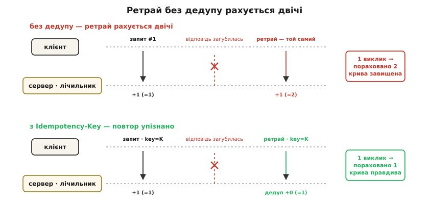
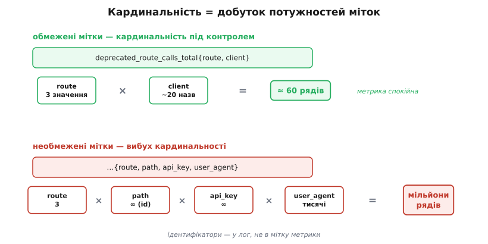

# ⚙️ Робочий деприкейшн-middleware: заголовки і лічильник

## Задача

Є живий маршрут `/v1/orders`, який ми вирішили вивести з ужитку. Він мусить лишитися робочим ще багато місяців — жоден клієнт не має зламатися сьогодні. Але з цього дня кожна його відповідь має нести три позначки: заголовок `Deprecation` із моментом оголошення, `Sunset` із датою зняття і `Link` на інструкцію з переходу. І цього мало: паралельно ми хочемо *бачити*, хто ним ще користується — не «скільки всього викликів на добу», а «який саме клієнт скільки шле». Без цього другого числа ми не знатимемо, коли знімати безпечно, і кому дзвонити, якщо хтось застряг у довгому хвості.

Отже, одна одиниця коду — прокладка навколо хендлера — робить дві роботи заразом: **сигналить** (ставить заголовки) і **спостерігає** (рахує виклики за клієнтом). Умови жорсткі. Вона має вмикатися на *конкретний* маршрут одним рядком, а не розповзатися по всьому застосунку — інакше ми проштампуємо «застаріле» на живих маршрутах. Вона не має сповільнювати гарячий шлях — на кожен запит має лишатися щонайдешевше. І вона має відмовитися стартувати, якщо їй згодували суперечливий контракт (дата зняття раніша за дату оголошення), бо краще впасти при розгортанні, ніж брехати клієнтам у проді.

## Ідея

Middleware — прокладка між приходом запиту й хендлером, яка тримає в руках і запит, і відповідь. Наша задача лягає в неї природно: заголовки треба покласти у відповідь *до* того, як почнеться тіло, а лічильник смикнути рівно раз на кожен вхід.

Головне рішення — **розсунути роботу в часі**. Усе коштовне й одноразове — розбір дат, перевірка їхньої узгодженості, збірка рядка `Link` — робимо один раз, коли маршрут конфігурують при старті застосунку. На кожен запит лишається найдешевше: покласти три *вже готові* рядки в заголовки й додати одиницю до лічильника. Дата не переформатовується мільйон разів на секунду; перевірка «зняття не раніше за оголошення» стається один раз, і якщо контракт суперечить сам собі, застосунок навіть не підніметься.

Другий стовп — *чим* ключувати лічильник. Нам потрібне «хто», але це «хто» мусить бути з короткого, обмеженого списку: людська назва клієнта, розпізнана за його ключем API, а не сам ключ, не повний шлях із ідентифікаторами замовлень усередині й не рядок `User-Agent`. Мітка лічильника має набирати *десятки* різних значень, не мільйони. Чому мільйони — це катастрофа, стане видно на пастці про кардинальність; поки що достатньо цього правила. Сам лічильник — звичайна [метрика-лічильник](topic:sf-release/metrics-monitoring) із двома мітками: логічна назва маршрута і клієнт.

## Робочий код

Той самий middleware трьома мовами. У кожній він ідіоматичний для свого стеку: в Express — функція-хендлер `(req, res, next)`; у FastAPI — залежність, що бере `Response`; у Go — обгортка `http.Handler`. Скрізь лічильник — Prometheus-метрика з мітками `route` і `client`, і скрізь дати форматуються один раз, при конфігурації.

:::tabs
```ts
import type { Request, Response, NextFunction, RequestHandler } from "express";
import { Counter } from "prom-client";

// Один лічильник на весь застосунок. Різні маршрути — це різні ЗНАЧЕННЯ мітки
// route, а не нові метрики.
const deprCalls = new Counter({
  name: "deprecated_route_calls_total",
  help: "Виклики застарілих маршрутів за клієнтом",
  labelNames: ["route", "client"] as const,
});

// ключ API -> людська назва клієнта. Джерело — ваш реєстр інтеграторів.
const KNOWN_CLIENTS = new Map<string, string>([
  ["ak_live_9f3…", "acme-mobile"],
  ["ak_live_2b7…", "partner-erp"],
]);

interface DeprecationOpts {
  route: string;      // логічна назва для мітки, напр. "orders.v1"
  announced: string;  // ISO-дата оголошення, "2024-06-30"
  sunset: string;     // ISO-дата зняття,      "2025-12-31"
  docs: string;       // URL інструкції з переходу
}

export function deprecated(opts: DeprecationOpts): RequestHandler {
  const announcedAt = new Date(`${opts.announced}T00:00:00Z`);
  const sunsetAt = new Date(`${opts.sunset}T23:59:59Z`);

  // Контракт перевіряємо ДО старту: зняття не може бути раніше за оголошення.
  if (!(sunsetAt > announcedAt)) {
    throw new Error(
      `deprecated(${opts.route}): sunset ${opts.sunset} не пізніше за announced ${opts.announced}`,
    );
  }

  // Форматуємо ОДИН раз. Два різні формати — не помилка, а вимога стандартів:
  //   Deprecation — Structured Field Date: '@' + секунди Unix   (RFC 9745)
  //   Sunset      — HTTP-date у GMT, англійські назви днів/міс.  (RFC 8594)
  const deprValue = `@${Math.floor(announcedAt.getTime() / 1000)}`;
  const sunsetValue = sunsetAt.toUTCString();  // "Wed, 31 Dec 2025 23:59:59 GMT"
  const linkValue = `<${opts.docs}>; rel="deprecation"; type="text/html"`;

  return (req: Request, res: Response, next: NextFunction) => {
    res.setHeader("Deprecation", deprValue);
    res.setHeader("Sunset", sunsetValue);
    res.setHeader("Link", linkValue);
    deprCalls.inc({ route: opts.route, client: clientId(req) });
    next();
  };
}

// Обмежена кардинальність: відома назва або єдина мітка "unknown".
function clientId(req: Request): string {
  const key = req.header("x-api-key") ?? "";
  return KNOWN_CLIENTS.get(key) ?? "unknown";
}

// вмикається на ОДИН маршрут, не на весь застосунок:
app.get("/v1/orders",
  deprecated({ route: "orders.v1", announced: "2024-06-30", sunset: "2025-12-31", docs: DOCS }),
  listOrdersV1);
```
```py
from datetime import datetime, timezone
from email.utils import format_datetime
from fastapi import Request, Response, Depends
from prometheus_client import Counter

# Один лічильник; різні маршрути — різні значення мітки route.
depr_calls = Counter(
    "deprecated_route_calls_total",
    "Виклики застарілих маршрутів за клієнтом",
    ["route", "client"],
)

KNOWN_CLIENTS: dict[str, str] = {      # ключ API -> людська назва клієнта
    "ak_live_9f3…": "acme-mobile",
    "ak_live_2b7…": "partner-erp",
}

def deprecated(route: str, announced: str, sunset: str, docs: str):
    announced_at = datetime.fromisoformat(announced).replace(tzinfo=timezone.utc)
    sunset_at = datetime.fromisoformat(f"{sunset}T23:59:59").replace(tzinfo=timezone.utc)

    # Контракт — до старту: зняття не раніше за оголошення.
    if sunset_at <= announced_at:
        raise ValueError(
            f"deprecated({route}): sunset {sunset} не пізніше за announced {announced}")

    # Форматуємо один раз. Deprecation — секунди Unix із '@' (RFC 9745);
    # Sunset — HTTP-date. format_datetime(usegmt=True) завжди дає англійський
    # "…GMT" незалежно від локалі сервера — на відміну від strftime.
    depr_value = f"@{int(announced_at.timestamp())}"
    sunset_value = format_datetime(sunset_at, usegmt=True)  # "Wed, 31 Dec 2025 23:59:59 GMT"
    link_value = f'<{docs}>; rel="deprecation"; type="text/html"'

    def stamp(request: Request, response: Response):
        response.headers["Deprecation"] = depr_value
        response.headers["Sunset"] = sunset_value
        response.headers["Link"] = link_value
        client = KNOWN_CLIENTS.get(request.headers.get("x-api-key", ""), "unknown")
        depr_calls.labels(route=route, client=client).inc()

    return stamp

# залежність вішається на ОДИН маршрут:
@app.get(
    "/v1/orders",
    dependencies=[Depends(deprecated("orders.v1", "2024-06-30", "2025-12-31", DOCS))],
)
def list_orders_v1():
    ...
```
```go
package deprecation

import (
	"fmt"
	"net/http"
	"time"

	"github.com/prometheus/client_golang/prometheus"
)

// Один лічильник; різні маршрути — різні значення мітки route.
var deprCalls = prometheus.NewCounterVec(
	prometheus.CounterOpts{
		Name: "deprecated_route_calls_total",
		Help: "Виклики застарілих маршрутів за клієнтом",
	},
	[]string{"route", "client"},
)

func init() { prometheus.MustRegister(deprCalls) }

var knownClients = map[string]string{ // ключ API -> людська назва клієнта
	"ak_live_9f3…": "acme-mobile",
	"ak_live_2b7…": "partner-erp",
}

// Deprecated повертає обгортку хендлера. Дати розбираються й форматуються один
// раз, при конфігурації; panic при суперечливому контракті валить старт.
func Deprecated(route, announced, sunset, docs string) func(http.Handler) http.Handler {
	announcedAt, err := time.Parse("2006-01-02", announced)
	if err != nil {
		panic(fmt.Sprintf("deprecated(%s): announced %q: %v", route, announced, err))
	}
	sunsetAt, err := time.Parse("2006-01-02", sunset)
	if err != nil {
		panic(fmt.Sprintf("deprecated(%s): sunset %q: %v", route, sunset, err))
	}
	sunsetAt = sunsetAt.Add(24*time.Hour - time.Second) // кінець доби зняття

	// Контракт — до старту.
	if !sunsetAt.After(announcedAt) {
		panic(fmt.Sprintf("deprecated(%s): sunset %s не пізніше за announced %s",
			route, sunset, announced))
	}

	deprValue := fmt.Sprintf("@%d", announcedAt.Unix())   // Structured Field Date (RFC 9745)
	sunsetValue := sunsetAt.UTC().Format(http.TimeFormat) // HTTP-date, завжди GMT/англ. (RFC 8594)
	linkValue := fmt.Sprintf("<%s>; rel=\"deprecation\"; type=\"text/html\"", docs)

	return func(next http.Handler) http.Handler {
		return http.HandlerFunc(func(w http.ResponseWriter, r *http.Request) {
			h := w.Header()
			h.Set("Deprecation", deprValue) // заголовки — ДО запису тіла
			h.Set("Sunset", sunsetValue)
			h.Set("Link", linkValue)
			deprCalls.WithLabelValues(route, clientID(r)).Inc()
			next.ServeHTTP(w, r)
		})
	}
}

func clientID(r *http.Request) string {
	if name, ok := knownClients[r.Header.Get("X-Api-Key")]; ok {
		return name
	}
	return "unknown"
}

// вмикається на ОДИН маршрут:
//   mux.Handle("/v1/orders",
//       Deprecated("orders.v1", "2024-06-30", "2025-12-31", docs)(listOrdersV1))
```
:::

Викликаний застарілий маршрут тепер відповідає так — тіло те саме, що й раніше, додалися лише три заголовки:

```http
HTTP/1.1 200 OK
Deprecation: @1719705600
Sunset: Wed, 31 Dec 2025 23:59:59 GMT
Link: <https://api.example.com/docs/migrate-v1>; rel="deprecation"; type="text/html"
```

А в системі метрик наростає ряд, який за тиждень покаже, чий трафік падає, а чий стоїть на місці:

```
deprecated_route_calls_total{route="orders.v1", client="acme-mobile"}  14203
deprecated_route_calls_total{route="orders.v1", client="partner-erp"}   1897
deprecated_route_calls_total{route="orders.v1", client="unknown"}        342
```

## Покроковий розбір

Три речі тут зроблено навмисно, і кожну легко зробити навпаки.

**Уся коштовна робота — при конфігурації, не при запиті.** Розбір рядка `"2024-06-30"` у момент часу, обчислення секунд Unix, форматування HTTP-дати, склеювання рядка `Link` — усе це стається *раз*, поки замикання (closure) створюють. У самому обробнику запиту лишаються три присвоєння заголовків готовими рядками й один інкремент. Це не мікрооптимізація зі спортивного інтересу: на популярному маршруті обробник крутиться десятки тисяч разів на секунду, і форматувати ту саму незмінну дату щоразу — марно палити процесор на гарячому шляху. Дата оголошення не змінюється між запитами; отже, її місце — поза запитом.

**Два формати дат — вимога, а не недбалість.** `Deprecation` несе час як **Structured Field Date**: символ `@` і ціле число секунд від епохи Unix (це закріпив RFC 9745 у 2025 році, спираючись на структуровані поля RFC 9651). `Sunset` натомість несе **HTTP-date**: `"Wed, 31 Dec 2025 23:59:59 GMT"` — той самий формат, що й у `Date` чи `Last-Modified` (RFC 8594, 2019). Сам стандарт визнає це історичною розбіжністю двох заголовків. Тому в коді два різні шляхи форматування, і кожен обрано так, щоб не наступити на локаль: у JS `toUTCString()` за специфікацією завжди англійський; у Go `http.TimeFormat` теж; а от у Python наївний `strftime("%a, %d %b …")` на сервері з неанглійською локаллю видасть `"Ср, 31 Дек …"` — зламаний заголовок. Тому там `email.utils.format_datetime(..., usegmt=True)`, який завжди дає коректний англійський `GMT`.

**Ключ лічильника — назва клієнта, не що завгодно унікальне.** `clientId` бере заголовок `X-Api-Key`, шукає його в реєстрі відомих інтеграторів і повертає *людську назву* — `acme-mobile`. Незнайомий або відсутній ключ згортається в єдину мітку `unknown`. Це свідомий фільтр: у мітку `client` потрапляє скінченна множина заздалегідь відомих значень. Ми не кладемо туди сам ключ API (їх стільки, скільки клієнтів завели ключів), ні поготів повний шлях чи `User-Agent`. Навіщо ця дисципліна — нижче.

## Складність і пастки

Код вище короткий, і саме тому оманливо простий. Небезпека тут не в тому, що щось не скомпілюється, а в тому, що воно чудово працюватиме й *тихо брехатиме* — або лічильник, або заголовок.

### Подвійний облік на ретраях

Лічильник рахує *отримані HTTP-запити*, а не *логічні виклики*. Це різні речі, щойно на лінії трапляється збій. Клієнт шле запит, сервер його обробляє й інкрементує лічильник — а потім відповідь губиться в мережі, тайм-аут спрацьовує на клієнті, і бібліотека сумлінно шле [той самий запит повторно](topic:sf-distributed/retries-backoff). Сервер бачить другий запит, знову інкрементує. Один логічний виклик, два в лічильнику.



*Без дедупу загублена відповідь обертається повтором, і той самий виклик рахується двічі — крива спаду виглядає вищою за справжню. З Idempotency-Key сервер упізнає повтор і рахує один раз.*

На великому масштабі це не дрібниця: сплеск ретраїв під час короткого мережевого шторму піднімає лічильники саме тоді, коли ви вдивляєтесь у криву спаду, вирішуючи, чи можна знімати. Ви бачите «застряглий» трафік, якого насправді нема, і зволікаєте зі зняттям.

Правильний хід — рахувати за ознакою логічного виклику, а не пакета. Якщо клієнти шлють [ключ ідемпотентності](topic:com-protocol/api-idempotency), повтор несе той самий ключ, і його видно:

```ts
// Обмежений набір «уже бачених» ключів; час життя — довший за будь-який ретрай.
class TTLSet {
  private m = new Map<string, number>();
  constructor(private ttlMs: number, private cap = 100_000) {}
  has(k: string): boolean {
    const t = this.m.get(k);
    if (t === undefined) return false;
    if (Date.now() - t > this.ttlMs) { this.m.delete(k); return false; }
    return true;
  }
  add(k: string): void {
    if (this.m.size >= this.cap) this.m.delete(this.m.keys().next().value); // витісняємо найстаріший
    this.m.set(k, Date.now());
  }
}
const seen = new TTLSet(10 * 60_000);  // 10 хв

function countOnce(route: string, client: string, req: Request): void {
  const key = req.header("idempotency-key");
  if (key) {
    const dedupKey = `${client}:${key}`;
    if (seen.has(dedupKey)) return;   // це ретрай — уже пораховано
    seen.add(dedupKey);
  }
  deprCalls.inc({ route, client });
}
```

Чесно про межі цього прийому: метрики за природою рахують «щонайменше раз», і дедуп прибирає найчастіше джерело роздування — клієнтські повтори того самого виклику, — але не робить облік ідеальним (клієнт без ключа ідемпотентності лишиться неточним). Тому на криву спаду дивляться як на *тенденцію*, а не як на точний перепис до одиниці; від дедупу нам треба, щоб форма кривої не стрибала на кожному мережевому шторму.

### Вибух кардинальності міток

Кожна унікальна комбінація значень міток — це окремий часовий ряд, який система метрик зберігає й тримає в пам'яті окремо. Кількість рядів — це **добуток** потужностей міток. Поки мітки обмежені (маршрут × клієнт = кілька десятків рядів), усе спокійно. Варто покласти в мітку щось необмежене — і добуток вибухає.



*Кількість часових рядів — добуток потужностей міток. route×client дає десятки. Додайте до міток повний шлях з ідентифікаторами, сам ключ API та User-Agent — і добуток вибухає в мільйони рядів, що кладуть систему метрик.*

Класична пастка — покласти в мітку `path` повний URL: `/v1/orders/8412`, `/v1/orders/8413`, … Кожне замовлення народжує новий ряд. Так само вбивчі мітки — сам ключ API (по ряду на клієнтський ключ), `User-Agent` (тисячі версій браузерів), ідентифікатор запиту (унікальний *завжди*). Наслідок не «графік трохи неохайний», а «сервер метрик з'їв усю пам'ять і впав», і разом із ним осліпли всі інші дашборди застосунку.

Звідси й дисципліна `clientId`: маршрут — це *логічна* назва `orders.v1`, а не сирий шлях; клієнт — назва з реєстру, а незнайомці згортаються в один `unknown`. Правило просте: у мітку кладуть лише те, чия множина значень *обмежена й відома наперед*. Усе необмежене — ідентифікатори, повні шляхи, ключі — місце в [структурованому лозі](topic:sf-release/structured-logging), а не в мітці метрики; лог витримає високу кардинальність, метрика — ні.

### Розбіжність форматів дат

Ту саму мить — момент оголошення й момент зняття — два заголовки представляють по-різному, і спокуса «уніфікувати» їх псує обидва. Хтось ставить в обидва ISO-рядок `2025-12-31T23:59:59Z` — і `Deprecation` перестає бути валідним структурованим полем, а `Sunset` — валідною HTTP-датою; охайні клієнти проігнорують обидва. Ліки — тримати один *момент часу* як джерело істини й друкувати з нього два різні рядки, як зроблено вище: `@`-секунди для `Deprecation`, HTTP-date для `Sunset`. Ніколи не збирайте ці рядки руками з кусників — беріть їх зі стандартних функцій дати, які вже знають про англійську локаль і `GMT`.

### Застарілий заголовок на не-застарілому маршруті

Найпідступніша помилка — не в даті, а в *обсязі*. Причепити middleware глобально (`app.use(...)`, обгорнути весь `mux`, повісити глобальний ASGI-middleware) — і `Deprecation` полетить на *кожній* відповіді застосунку, зокрема на свіжому `/v2/orders`, який щойно народився. Клієнти побачать «застаріле» на маршруті, куди ви їх самі щойно покликали мігрувати, і довіра до сигналу випарується: якщо застаріле все, то застаріле ніщо.

Тому в усіх трьох варіантах обгортка вішається на *один* хендлер, не на застосунок. І цю межу варто закріпити тестом, який стежить, щоб застарілість не протекла на живі маршрути:

```ts
it("свіжий маршрут не несе заголовка Deprecation", async () => {
  const res = await request(app).get("/v2/orders");
  expect(res.headers).not.toHaveProperty("deprecation");
  expect(res.headers).not.toHaveProperty("sunset");
});
```

### Sunset раніший за deprecation

Останнє — суперечність у самому контракті. Дата зняття раніша за дату оголошення означає буквально «ми знімемо це раніше, ніж повідомимо, що воно застаріле» — вікна міграції нема, лишається тихе видалення в масці деприкейшну. Здебільшого це не злий намір, а описка в конфізі: переставлені місцями два аргументи, `2024` замість `2025`. Саме тому перевірку винесено в момент конфігурації, і вона *валить старт*, а не пише попередження в лог: `throw` в Express-фабриці, `ValueError` у FastAPI, `panic` у Go. Суперечливий деприкейшн не має дожити до першого запиту — краще зламане розгортання, яке видно інженерові, ніж мовчазна брехня, яку побачить клієнт.

Зберемо в одну думку. Наївний варіант цього middleware — п'ять рядків: постав три заголовки, смикни лічильник. Він скомпілюється й «працюватиме». Різниця між ним і робочим — уся в тому, що робочий не бреше: він рахує логічні виклики, а не пакети; тримає кардинальність метрик обмеженою; друкує кожну дату в її законному форматі; накриває рівно застарілий маршрут і жоден інший; і відмовляється жити з суперечливим контрактом. Кожна з цих п'яти дрібниць — це різниця між числом, якому можна вірити, приймаючи рішення про зняття, і числом, яке має вигляд виміру, а насправді вводить в оману.
