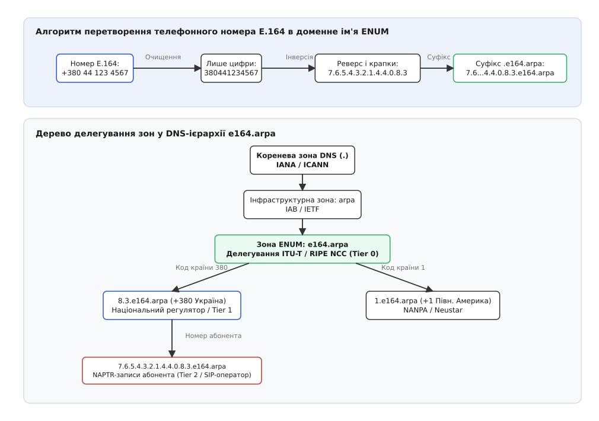
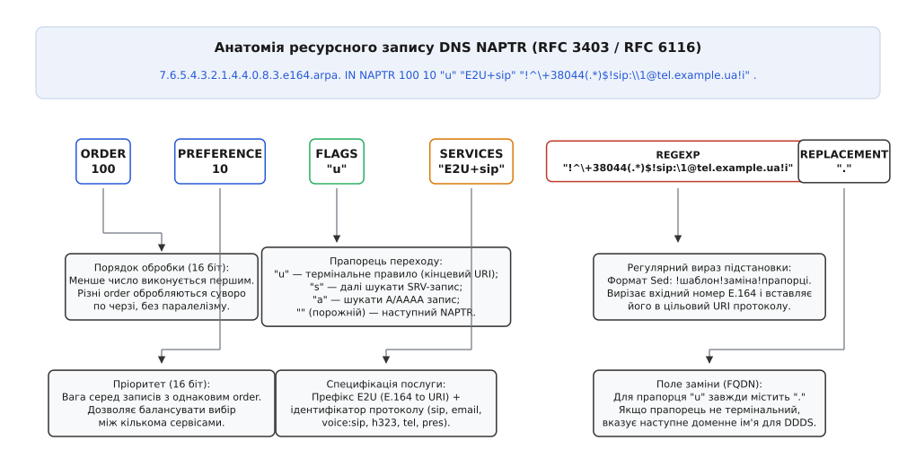
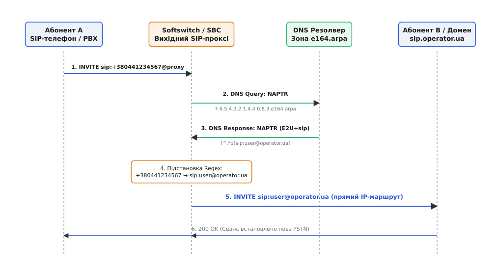

# ENUM: телефонний номер як ім'я в DNS

<preknowlist>
- [Телефонна мережа й нумерація E.164](root:com-transport/pstn-e164) — міжнародний план нумерації, ієрархія кодів країн та обмеження довжини телефонного номера.
- [DHCP і DNS](root:com-transport/dhcp-dns) — структура доменного дерева, ієрархія зон, прямі та реверсні DNS-запити.
- [DNSSEC](root:sf-security/dns-sec) — цифровий підпис ресурсних записів (RRSIG), ключі DNSKEY та ланцюг довіри від кореня.
- [SIP: сигналізація сеансів зв'язку](root:com-protocol/sip) — встановлення з'єднань через запит INVITE, структура адрес запису (AoR) та маршрутизація сеансів.
- [DNS через записи SRV і NAPTR](root:com-transport/dns-srv-naptr) — пошук мережевих служб за назвою сервісу, пріоритетом та вагою.
- [RTP і RTCP](root:com-protocol/rtp-rtcp) — потокове передавання медіаданих між кінцевими IP-адресами без участі комутаторів.
</preknowlist>

Офісний IP-телефон у Києві набирає номер співробітника у варшавській філії: `+48 22 123 4567`. На столі абонента у Варшаві стоїть такий самий цифровий SIP-апарат, підключений до високошвидкісного оптоволоконного інтернет-каналу. Проте телефонний апарат відправника знає лише послідовність із дванадцяти десяткових цифр. Якщо відправити цей виклик традиційним шляхом, він піде через місцевий шлюз у телефонну мережу загального користування (PSTN), пройде через десяток транзитних комутаторів TDM, зазнає подвійного аналого-цифрового перетворення, втратить якість широкосмугового звуку HD Voice і змусить компанію сплатити міжнародний тариф за кожну хвилину розмови.

Виникає фундаментальна інженерна суперечність. Обидва кінцеві пристрої живуть у глобальній IP-мережі та готові передавати голос напряму потоком [RTP](root:com-protocol/rtp-rtcp) із нульовою собівартістю. Але ініціатор виклику знає лише телефонний номер, тоді як протоколу [SIP](root:com-protocol/sip) для надсилання запиту `INVITE` потрібна інтернет-адреса у форматі URI (англ. *Uniform Resource Identifier*) — наприклад, `sip:user@warsaw.company.com`.

Щоб об'єднати два несумісні світи — глобальну телефонну нумерацію та доменну систему Інтернету — було створено протокол **ENUM** (від англ. *E.164 to Uniform Resource Identifiers*, чинна редакція — RFC 6116). Цей протокол перетворює звичайний телефонний номер на доменне ім'я [DNS](root:com-transport/dhcp-dns), знаходить для нього відповідні правила маршрутизації та дозволяє спрямувати голосовий виклик безпосередньо через IP-мережу повз застарілі телефонні лінії.

---

### Проблема геометрії двох просторів імен

Чому не можна було просто записати телефонний номер у звичайний DNS-запит як рядок `48221234567.com`? Причина криється у протилежній логіці побудови ієрархій у телефонії та в Інтернеті.

У міжнародному телефонному плані нумерації [ITU-T E.164](root:com-transport/pstn-e164) старшинство цифр спадає **зліва направо**:
- Перші цифри визначають глобальний код країни (наприклад, `380` для України, `48` для Польщі, `1` для США та Канади).
- Наступні цифри задають національний код зони чи оператора (наприклад, `44` для Києва, `22` для Варшави).
- Останні цифри вказують на конкретний термінал абонента.

У доменній системі імен DNS усе організовано із точністю до навпаки — ієрархія зростає **справа наліво**:
- Справа знаходиться коренева зона `.` та домен верхнього рівня (`.arpa`).
- Ліворуч від неї розміщуються піддомени наступних рівнів.
- Найспадніша, локальна назва хоста стоїть на самому початку рядка.

Якщо надіслати номер у прямому порядку `48.22.1234567`, то найвищим доменом стане номер абонента `1234567`, а код країни опиниться на нижньому рівні. Це повністю зруйнувало б можливість централізованого делегування доменних зон національним телеком-регуляторам.

---

### Алгоритм перетворення E.164 у доменне ім'я

Щоб узгодити лівосторонню ієрархію телефонії з правосторонньою ієрархією DNS, стандарт RFC 6116 визначає строгий математичний алгоритм побудови повністю визначеного доменного імені (англ. *Fully Qualified Domain Name*, FQDN):

1. **Очищення номера:** З вхідного рядка видаляються всі пробіли, круглі дужки, дефіси та розділові знаки, крім обов'язкового міжнародного префікса `+` на початку. Номер перевіряється на відповідність ліміту стандарту E.164 (не більше 15 цифр).
2. **Зняття префікса:** Початковий символ `+` відкидається, залишаючи суто десяткові цифри.
3. **Посимвольне розділення крапками:** Між кожною окремою цифрою ставиться крапка.
4. **Інверсія порядку (Реверс):** Послідовність цифр розгортається у зворотному порядку, щоб найстарший розряд (код країни) перемістився у правий край імені.
5. **Додавання суфікса доменної зони:** До кінця утвореного рядка дописується суфікс `.e164.arpa.` (або суфікс закритої операторської зони).

Для київського міського номера `+380 44 123 4567` процес виконується такими кроками:

```
+380 44 123 4567
= +380441234567                           [видалено пробіли та дужки]
= 380441234567                            [знято префікс +]
= 3.8.0.4.4.1.2.3.4.5.6.7                 [розділено цифри крапками]
= 7.6.5.4.3.2.1.4.4.0.8.3                 [інвертовано порядок цифр]
= 7.6.5.4.3.2.1.4.4.0.8.3.e164.arpa.      [додано суфікс зони e164.arpa]
```

Отриманий рядок є валідним доменним ім'ям, де кожен символ є окремою міткою DNS. Завдяки реверсу авторитетний сервер кореневої зони делегує підзону `8.3.e164.arpa.` національному реєстру України, а той, у свою чергу, делегує зону `4.4.0.8.3.e164.arpa.` операторам київського регіону.


*Два погляди на один телефонний номер. Вгорі: чотири кроки канонізації та реверсу цифр. Внизу: ієрархічна структура делегування зон у DNS від кореня IANA через код країни ITU-T до кінцевого авторитетного сервера абонента.*

Історично вибір саме доменної зони `e164.arpa` став результатом [тривалого політичного протистояння між IETF та ITU-T](root:com-protocol/enum-e164/hist-enum-evolution.md), у якому вирішувалося, хто володітиме глобальним телефонним адресним простором Інтернету.

---

### Нормалізація локальних номерів та плани набору

У реальних корпоративних та операторських мережах користувачі рідко набирають повний міжнародний номер із префіксом `+`. Найчастіше ввід містить локальні або національні формати:
- Локальний міський набір: `123-45-67` (7 цифр у межах одного міста).
- Національний набір через префікс виходу на міжмісто: `044 123 4567` (в Україні) або `022 123 4567` (у Польщі).
- Міжнародний набір через префікс виходу на закордонний зв'язок (англ. *International Direct Dialing*, IDD): `00 48 22 123 4567` або `810 48 22 123 4567`.

Перш ніж сформувати доменне ім'я для DNS, програмний комутатор (Softswitch або IP-АТС) зобов'язаний пропустити введений рядок через локальний транслятор плану набору (Dialplan Normalizer).

Транслятор аналізує контекст абонента:
1. Якщо набрано 7 цифр, комутатор автоматично дописує код міста та код країни абонента, що телефонує: `1234567` → `+380441234567`.
2. Якщо номер починається з національного префікса `0`, префікс зрізається, а замість нього додається міжнародний код держави `+380`.
3. Якщо номер починається з префікса `00` або `810`, префікс замінюється на знак `+`.

Окрему категорію становлять екстрені служби (номери `112`, `911`, `101`, `102`, `103`) та короткі сервісні коди. Такі номери мають суворо локальне значення і **ніколи не передаються в глобальну службу ENUM**. Сигналізаційний модуль комутатора виявляє їх за першими символами та негайно спрямує у виділений канал зв'язку місцевої екстреної диспетчерської служби без звернення до DNS.

---

### Динамічна система делегування DDDS та ресурсні записи NAPTR

Звичайні ресурсні записи DNS — такі як `A` (IP-адреса) або `CNAME` (канонічне ім'я) — призначені для статичного відображення «ім'я → вузол». Для телефонії цього недостатньо з трьох причин:
1. Один телефонний номер може одночасно використовуватися для дзвінків через SIP, надсилання факсів, доставки текстових повідомлень SMS та пошти.
2. Власник номера повинен мати можливість гнучко налаштовувати пріоритети: наприклад, спочатку намагатися додзвонитися на робочий SIP URI, а в разі недосяжності — перенаправляти на резервний шлюз.
3. Доменні імена в DNS мають статичний синтаксис, тоді як правила перетворення номерів потребують регулярних виразів із підстановкою змінних частин.

Для вирішення цих завдань IETF розробив Dynamic Delegation Discovery System (DDDS, RFC 3401–3404) та спеціальний тип ресурсного запису DNS — **NAPTR** (англ. *Naming Authority Pointer*, тип 35).

Ресурсний запис NAPTR зберігає не готову адресу, а **правило переписування рядка**, що містить числовий порядок виконання, вагові коефіцієнти, прапорці завершення, тип протоколу та регулярний вираз підстановки.

```
7.6.5.4.3.2.1.4.4.0.8.3.e164.arpa.  IN  NAPTR  10  100  "u"  "E2U+sip"  "!^\\+38044(.*)$!sip:\\1@tel.example.ua!i"  .
```

Розглянемо призначення кожного з шести полів запису NAPTR:

1. **ORDER (16 біт):** Порядок виконання правил. Менше число означає вищий пріоритет і виконується першим. Правила з різними значеннями `ORDER` обробляються суворо послідовно: клієнт не має права переходити до правил із вищим `ORDER`, доки не перевірить усі правила з поточного значення.
2. **PREFERENCE (16 біт):** Пріоритет запису всередині **однакового** значення `ORDER`. Менше значення вказує на вищу перевагу. Дозволяє власнику номера вказати основний та резервний сервери одного й того самого типу послуги.
3. **FLAGS (рядок ASCII):** Прапорець керування алгоритмом DDDS:
   - `"u"` — термінальне правило (URI). Означає, що в результаті підстановки регулярного виразу отримано кінцевий ідентифікатор ресурсу URI (наприклад, SIP URI). Пошук завершується.
   - `"s"` — після підстановки отримано доменне ім'я, для якого треба виконати наступний запит [SRV-записів](root:com-transport/dns-srv-naptr).
   - `"a"` — після підстановки отримано FQDN, для якого треба надіслати запит адресних записів `A`/`AAAA`.
   - `""` (порожній рядок) — нетермінальне правило, яке вимагає повторного надсилання запиту типу NAPTR для нового отриманого домену.
4. **SERVICES:** Специфікація протоколу та типу послуги. В ENUM це поле обов'язково починається з префікса застосунку `E2U` (англ. *E.164 to URI*), після якого вказується офіційний сервісний тег IANA (наприклад, `E2U+sip`, `E2U+voice:sip`, `E2U+email:mailto`, `E2U+pres`).
5. **REGEXP:** Регулярний вираз формату утиліти `sed`: `!шаблон!заміна!прапорці`. Шаблон перевіряється на відповідність вихідному номеру E.164 зі знаком `+` (`+380441234567`), а вираз заміни формує кінцевий URI із підстановкою захоплених груп `\1`..`\9`.
6. **REPLACEMENT:** Доменне ім'я для наступного кроку DDDS. Для записів із прапорцем `"u"` це поле не використовується і завжди містить єдиний символ крапки `.` (порожній FQDN).


*Анатомія запису NAPTR. Вгорі: канонічний вигляд рядка в зоновому файлі DNS. По центру: шість полів RDATA. Внизу: правила обробки кожного поля скінченним автоматом резолвера DDDS.*

Повний реєстр сервісних тегів, двійковий формат DNS-пакета та правила обробки помилок [детально описано в довіднику інтерфейсу NAPTR](root:com-protocol/enum-e164/api-naptr-record.md).

> 🔧 **Навіщо це.** Помилка у значенні поля `ORDER` — одна з найпоширеніших причин неправильної маршрутизації дзвінків. Якщо для основного SIP-сервера та резервного голосового ящика вказати однаковий `ORDER` і розрізняти їх лише через `PREFERENCE`, резолвер, який підтримує обидва сервіси, може помилково обрати скриньку замість дзвінка. `ORDER` розділяє принципово різні типи поведінки або різні сервіси, а `PREFERENCE` балансує еквівалентні маршрути всередині одного сервісу.

---

### Агрегація номерних блоків та нетермінальні правила

У великих телефонних мережах створення індивідуального запису NAPTR для кожного окремого абонента призвело б до роздування зонових файлів DNS до десятків мільйонів рядків. Щоб оптимізувати розмір баз даних, протокол ENUM надає два механізми масштабування:

#### 1. Агрегація діапазонів через регулярні вирази

Якщо оператор зв'язку володіє номерним пулом на 10 000 номерів у Києві (від `+380 44 500 0000` до `+380 44 500 9999`), йому не потрібно створювати 10 000 окремих записів у зоні `0.0.5.4.4.0.8.3.e164.arpa.`. Замість цього розміщується єдиний запис із груповим захопленням:

```
0.0.5.4.4.0.8.3.e164.arpa.  IN  NAPTR  10  100  "u"  "E2U+sip"  "!^\\+38044500([0-9]{4})$!sip:ext_\\1@ims.telecom.ua!i"  .
```

Коли надходить виклик для номера `+380445001234`, регулярний вираз виділяє останні чотири цифри `1234` і миттєво формує адресу внутрішнього SIP-абонента `sip:ext_1234@ims.telecom.ua`.

#### 2. Нетермінальне делегування (Non-terminal NAPTR Delegation)

Якщо національний реєстратор Tier 1 хоче передати керування всім кодом міста або мобільного оператора безпосередньо на DNS-сервери цього провайдера, він створює нетермінальний запис NAPTR із порожнім прапорцем `""`:

```
4.4.0.8.3.e164.arpa.  IN  NAPTR  10  100  ""  "E2U+sip"  ""  enum.kyiv-telecom.ua.
```

Побачивши порожній рядок прапорців, клієнтський резолвер розуміє: це проміжний крок маршрутизації. Він бере нове доменне ім'я `enum.kyiv-telecom.ua` і надсилає до нього повторний запит типу `NAPTR`, де вже зберігаються детальні абонентські правила цього конкретного оператора.

---

### Взаємодія сигналізації SIP та DNS у процесі маршрутизації

Тепер простежимо, як взаємодіють комутатори Softswitch, прикордонні контролери сесій (SBC) та сервери DNS у реальному телекомунікаційному виклику.

Коли абонент набирає номер `+380 44 123 4567`, комутатор вихідного зв'язку виконує такий детермінований ланцюг дій:

1. **Формування ENUM-запиту:** Softswitch нормалізує номер, інвертує цифри та надсилає DNS-запит `IN NAPTR 7.6.5.4.3.2.1.4.4.0.8.3.e164.arpa` до свого локального кешуючого DNS-резолвера.
2. **Обробка відповіді NAPTR:** Резолвер отримує набір записів, фільтрує їх за тегом `E2U+sip`, сортує за зростанням пари `(order, preference)` та обирає найбільш пріоритетний запис із прапорцем `"u"`.
3. **Виконання підстановки:** Регулярний вираз `!^\+38044(.*)$!sip:\1@sip.operator.ua!i` застосовується до вхідного рядка `+380441234567`. Захоплена група `\1` містить `1234567`. На виході комутатор отримує готовий адресний рядок: `sip:1234567@sip.operator.ua`.
4. **Резолвінг домену SIP (RFC 3263):** Тепер, коли комутатор отримав SIP URI, йому потрібно знайти конкретну IP-адресу та транспортний порт хоста `sip.operator.ua`. Для цього комутатор виконує стандартну процедуру пошуку за RFC 3263:
   - Запитує DNS NAPTR для домену `sip.operator.ua`, щоб дізнатися підтримуваний транспорт (UDP, TCP, TLS).
   - Запитує DNS [SRV-запис](root:com-transport/dns-srv-naptr) (наприклад, `_sip._udp.sip.operator.ua`), щоб дізнатися порт (зазвичай 5060) та цільовий вузол.
   - Запитує DNS `A`/`AAAA` для отримання безпосередньої IP-адреси.
5. **Надсилання виклику:** Softswitch надсилає запит `INVITE sip:1234567@sip.operator.ua` безпосередньо через IP-мережу. Сеанс встановлюється без жодного контакту з телефонними станціями PSTN.


*Послідовність маршрутизації виклику від набору номера до встановлення SIP-сеансу. Softswitch запитує DNS, отримує NAPTR-запис із сервісом SIP, транслює E.164 у SIP URI і відправляє INVITE напряму через IP.*

Чому запис ENUM повертає саме SIP URI, а не пряму IP-адресу?
Якщо вказати в NAPTR сиру IP-адресу `sip:1234567@198.51.100.1`, система втратить гнучкість:
- Буде неможливо автоматично перемикатися між протоколами UDP, TCP та зашифрованим TLS.
- Неможливо буде використовувати стандартне балансування навантаження за SRV-вагами.
- У разі зміни IP-адреси сервера оператору доведеться змінювати мільйони записів NAPTR замість єдиного адресного запису `A` у своєму домені.

Щоб побачити, як цей алгоритм функціонує на рівні системних викликів сокетів і двійкового розбору DNS-відповідей, [зверніться до практичної реалізації ENUM-резолвера мовами C та C++](root:com-protocol/enum-e164/proj-enum-resolver.md).

---

### Каскадні дерева пошуку (Search Trees Cascading)

У великих операторів зв'язку та транснаціональних корпорацій конфігурація маршрутизатора рідко обмежується одним доменом `e164.arpa`. Замість цього комутатор використовує **каскадний пошук по деревах ENUM (Search Trees Cascading)**:

1. **Крок 1 (Внутрішній Private ENUM):**
   Комутатор формує FQDN `7.6.5.4.3.2.1.4.4.0.8.3.e164.corp.local` і запитує внутрішній DNS. Якщо номер належить внутрішній філії компанії, виклик негайно відправляється через локальний VPN без виходу на зовнішніх провайдерів.
2. **Крок 2 (Операторський Carrier ENUM):**
   Якщо внутрішній DNS повернув `NXDOMAIN`, комутатор робить запит до закритої міжоператорської зони пірингу `7.6.5.4.3.2.1.4.4.0.8.3.e164.carrier.net` у мережі IPX. Якщо оператор-отримувач підтримує прямий IP-інтерконект, сеанс встановлюється через високошвидкісний захищений канал.
3. **Крок 3 (Публічний User ENUM):**
   Якщо операторський піринг відсутній, запитується глобальна відкрита зона `e164.arpa`.
4. **Крок 4 (Відкат у PSTN):**
   Якщо всі три DNS-дерева повернули відсутність запису, комутатор остаточно перемикає виклик на транзитний TDM-шлюз телефонної мережі PSTN.

Така багаторівнева стратегія гарантує мінімальну вартість кожного виклику та максимальну якість звуку: спочатку вичерпуються всі безкоштовні та швидкі цифрові канали, і лише в останню чергу задіюються платні аналогові транки.

---

### Три рівні застосування ENUM у телекомунікаціях

У світовій практиці архітектура ENUM розділилася на три самостійні рівні закритістю та призначенням:

#### 1. User ENUM (Публічний користувацький ENUM)
- **Доменна зона:** Глобальна публічна зона `e164.arpa`.
- **Призначення:** Дозволяє кінцевим фізичним та юридичним особам реєструвати свої номери у відкритому DNS через уповноважених національних реєстраторів (Tier 1 Registry).
- **Поточний стан:** Має обмежене поширення через небажання традиційних операторів втрачати транзитні доходи та загрози конфіденційності (публічний збір номерів спамерами).

#### 2. Carrier ENUM / Infrastructure ENUM (Операторський ENUM)
- **Стандарти:** RFC 5067 та RFC 6116.
- **Доменна зона:** Закриті доменні простори всередині магістральних операторських мереж IPX (англ. *IP Exchange*, регульованих асоціацією GSMA) або приватні домени (наприклад, `e164.carrier.net`).
- **Призначення:** Міжоператорський піринг для технологій VoLTE (Voice over LTE), VoWiFi та підсистем IMS (IP Multimedia Subsystem).
- **Особливості:** Коли мобільний абонент набирає номер, комутатор SBC перевіряє закриту базу Carrier ENUM. Якщо номер належить іншому LTE-оператору, виклик спрямовується як чистий цифровий HD-голос через IPX-шлюз. Саме Carrier ENUM обслуговує переважну більшість сучасних дзвінків між мобільними операторами.

#### 3. Private / Enterprise ENUM (Корпоративний ENUM)
- **Доменна зона:** Внутрішні DNS-сервери корпоративних мереж (наприклад, `e164.corp.local`).
- **Призначення:** Маршрутизація телефонних дзвінків між десятками філій та регіональних IP-АТС великої корпорації.
- **Особливості:** Дозволяє набирати короткі чи міські номери інших філій безкоштовно через внутрішні VPN-канали, не виходячи на зовнішніх провайдерів зв'язку.

| Характеристика | User ENUM | Carrier / Infrastructure ENUM | Private ENUM |
| :--- | :--- | :--- | :--- |
| **Доменна зона** | `e164.arpa` | Закриті зони IPX / `e164.carrier.net` | Локальні корпоративні зони |
| **Хто контролює записи** | Кінцевий абонент / реєстратор | Оператори мобільного та фіксованого зв'язку | Системні адміністратори компанії |
| **Доступність DNS** | Відкритий глобальний Інтернет | Закриті VPN / виділені канали IPX | Внутрішня локальна мережа компанії |
| **Головна мета** | Персональна універсальна адресація | HD-піринг VoLTE/IMS, оптимізація MNP | Безкоштовний зв'язок між філіями IP-PBX |

---

### Взаємодія з перенесенням номерів (MNP)

Один із головних викликів сучасної телефонії — послуга збереження номера при переході до іншого оператора (англ. *Mobile Number Portability*, MNP).

У класичній телефонній мережі для маршрутизації перенесеного номера використовувалися складні сигналізаційні запити до баз даних SS7/INAP (Intelligent Network Application Part) із формуванням префіксів маршрутизації (Routing Number, RN). Це створювало додаткові затримки з'єднання та вимагало дорогого обладнання.

У мережах Carrier ENUM проблема MNP вирішується на порядок простіше та швидше:
1. Національний реєстр перенесених номерів синхронізується з авторитетними DNS-серверами Carrier ENUM у режимі реального часу.
2. Щойно абонент переходить від оператора A до оператора B, запис NAPTR у зоні оновлюється: регулярний вираз замінює домен призначення з `@ims.operatorA.ua` на `@ims.operatorB.ua`.
3. Комутатор, що здійснює виклик, одразу отримує актуальний SIP URI оператора-реципієнта. Додаткові транзитні запити через мережу старого оператора взагалі не виконуються.

---

### Трансформація сигналізації на межі мереж (SBC Interworking)

Коли ENUM-запит завершується невдачею або телефонний виклик переходить між світом IP та традиційною мережею PSTN, прикордонний контролер сесій (SBC) виконує двосторонній мапінг сигналізації:

#### 1. Перехід SIP → PSTN (ISUP IAM)
Якщо DNS повернув `NXDOMAIN`, SBC формує повідомлення ISUP `IAM` (англ. *Initial Address Message*):
- Номер E.164 записується в параметр Called Party Number (CdPN).
- Встановлюються біти індикатора плану нумерації (NPI = `ISDN/Telephony numbering plan E.164`) та індикатора природи адреси (NOA = `International number`).
- Якщо SIP-виклик містив префікс маршрутизації перенесеного номера (RN), він поміщається у параметр ISUP `Routing Forwarding Number`.

#### 2. Перехід PSTN → SIP (ENUM Inbound Lookup)
Коли шлюз приймає вхідне повідомлення ISUP IAM із телефонної мережі, він витягує набраний номер E.164, робить власний локальний ENUM-запит і, отримавши SIP URI внутрішнього користувача, надсилає внутрішній `INVITE sip:user@office.domain` замість маршрутизації за загальним шлюзовим номером.

---

### Узгодження кодеків та якість звуку (HD Voice через SDP)

Пряма маршрутизація виклику через ENUM кардинально змінює якість передавання голосу. У традиційних мережах PSTN голосовий потік примусово обмежується смугою частот 300–3400 Гц за допомогою стародавнього кодека G.711 (Pulse Code Modulation, 64 кбіт/с).

Коли ж виклик залишається в IP-середовищі завдяки ENUM:
1. Кінцеві пристрої обмінюються описами сеансу [SDP](root:com-protocol/rtsp-sdp) безпосередньо у тілі повідомлень `INVITE` та `200 OK`.
2. Сторони узгоджують сучасні широкосмугові кодеки високої чіткості (HD Voice): G.722 (смуга до 7 кГц), AMR-WB (Adaptive Multi-Rate Wideband) або універсальний кодек Opus (смуга до 20 кГц, повний спектр людського слуху).
3. Виключається необхідність у проміжному транскодуванні на сигнальних процесорах DSP (англ. *Transcoding-Free Operation*, TrFO). Це не лише зберігає кристальну чистоту голосу, а й усуває додаткові 20–40 мілісекунд затримки на обчислювальне перекодування.

---

### Безпека та криптографічна автентифікація через DNSSEC

Оскільки записи ENUM безпосередньо керують тим, куди піде телефонний виклик, незахищена служба DNS створює критичні загрози безпеці:

1. **Перехоплення викликів (Call Hijacking):** Зловмисник, здійснивши отруєння кешу DNS (DNS Cache Poisoning) або підміну пакетів (DNS Spoofing), повертає сфальсифікований запис NAPTR із власним SIP URI. Усі дзвінки на номер банку чи урядової установи підуть на сервер зловмисника, де відбуватиметься запис конфіденційних розмов.
2. **Телефонне шахрайство (Toll Fraud):** Підміна правил NAPTR може перенаправляти вихідні міжнародні дзвінки компанії на дорогі преміум-номери з погодинною оплатою.
3. **Відмова в обслуговуванні (DoS):** Повернення неіснуючих URI викликає обрив зв'язку для цілих номерних діапазонів.

Єдиним надійним механізмом захисту ENUM є повсюдне застосування технології [DNSSEC](root:sf-security/dns-sec) (RFC 4033–4035).

```
Коренева зона (.) [Ключ KSK]
       │
       ▼ (Запис DS підтверджує відкритий ключ зони arpa)
Зона arpa.
       │
       ▼ (Запис DS підтверджує відкритий ключ зони e164.arpa)
Зона e164.arpa. (Tier 0)
       │
       ▼ (Запис DS підтверджує відкритий ключ коду країни)
Зона 8.3.e164.arpa. (Tier 1: Україна +380)
       │
       ▼ (Запис RRSIG підписує набір записів NAPTR)
NAPTR-записи абонента (Tier 2)
```

Завдяки DNSSEC:
- Кожен ресурсний запис NAPTR супроводжується криптографічним цифровим підписом `RRSIG`.
- Локальний валідуючий резолвер softswitch перевіряє підпис `RRSIG` за ланцюгом довіри від кореневої зони до конкретного номерного запису.
- Якщо відповідь підроблено або ключ скомпрометовано, DNS-сервер повертає помилку `SERVFAIL`, і комутатор відмовляється від скомпрометованого IP-маршруту.

Крім підтвердження наявних записів, DNSSEC вирішує задачу криптографічного доказу **відсутності номера** (Authenticated Denial of Existence) за допомогою записів `NSEC` або `NSEC3`. Якщо зловмисник намагається підробити відповідь `NXDOMAIN`, щоб зірвати виклик або змусити комутатор піти в дорогу мережу PSTN, валідуючий резолвер вимагає наявності підписаного NSEC3-запису. За відсутності дійсного підпису відповідь відкидається.

> 🔧 **Навіщо це.** У конфігураціях SIP-проксі обов'язково перевіряйте статус валідації DNSSEC перед використанням отриманого SIP URI. Якщо локальний резолвер повертає відповідь без встановленого прапорця `AD` (англ. *Authenticated Data*), такий маршрут не повинен вважатися довіреним у публічних мережах.

---

### Продуктивність, затримки Post-Dial Delay та відкат на PSTN

У телефонії одним із ключових показників якості обслуговування (QoS / QoE) є затримка після набору номера — **Post-Dial Delay (PDD)**. Це проміжок часу між моментом, коли абонент натиснув останню цифру чи кнопку виклику, і моментом, коли у слухавці залунав перший сигнал дзвінка (Ringback Tone).

Якщо PDD перевищує 2–3 секунди, користувач підсвідомо вважає, що зв'язок завис, і кладе слухавку.

Операція ENUM додає до PDD мережеву затримку запиту DNS (Round-Trip Time, RTT). Щоб мінімізувати цей вплив, застосовують такі інженерні рішення:

1. **Локальні кешуючі демони:**
   DNS-запити ніколи не надсилаються безпосередньо через Інтернет до віддалених серверів. На кожному вузлі softswitch встановлюється локальний демон DNS (Unbound), який тримає кеш у пам'яті. Час відповіді з локального сокета становить менше 0.5 мілісекунди.
2. **Агресивні таймаути очікування (DNS Timeouts):**
   Якщо локальний кеш порожній і зовнішній DNS-сервер не відповів за 100–200 мс, комутатор не чекає стандартних системних 5 секунд. Спрацьовує таймер аварійного перемикання (Failover), і виклик миттєво відправляється через традиційний телефонний транк PSTN (ISUP IAM через TDM-шлюз).
3. **Негативне кешування (RFC 2308):**
   Якщо для номера повернуто `NXDOMAIN`, комутатор запам'ятовує цей статус на час, заданий у записі SOA зони. Усі наступні виклики на цей номер протягом кількох годин одразу спрямовуються в PSTN без повторних марних запитів до DNS.

ENUM став непомітним, але фундаментальним інженерним клеєм, який дозволив класичній столітній телефонній нумерації органічно влитися в глобальну інфраструктуру Інтернету.
