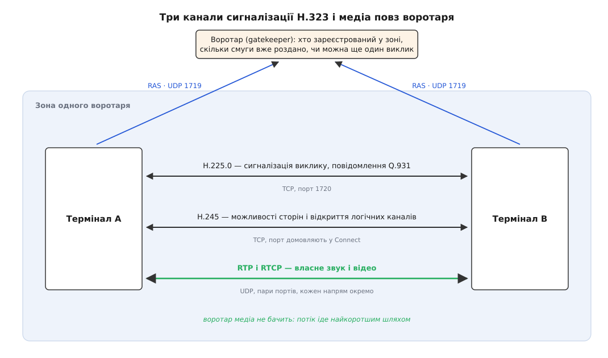
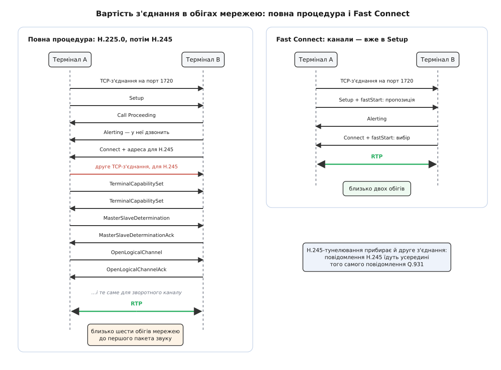

# H.323: телефонна сигналізація ITU-T поверх пакетних мереж

<preknowlist>
- [Комутація каналів проти комутації пакетів](root:com-transport/circuit-vs-packet-switching) — у першій ресурс під розмову виділяють наперед і тримають, у другій пакети просто йдуть і ніхто нічого не обіцяє.
- [Телефонна мережа й нумерація E.164](root:com-transport/pstn-e164) — номер як адреса абонента, комутатор як власник з'єднання.
- [RTP і RTCP](root:com-protocol/rtp-rtcp) — медіа їде окремими датаграмами з номером і міткою часу, кожен напрям окремим потоком.
- [TCP проти UDP](root:com-transport/tcp-vs-udp) — чим надійне з'єднання відрізняється від датаграм без гарантій.
- [Серіалізація даних](root:com-protocol/data-serialization) — схема, відома обом сторонам, і правила, за якими значення перетворюють на байти.
</preknowlist>

1996 рік, звичайна контора. У шафі стоїть офісна АТС, від неї по будинку розходиться пучок телефонних пар. Поруч, по тих самих стінах, уже прокладена локальна мережа, і в неї ввімкнені ті самі столи, де стоять телефони. Питання, яке тоді поставили собі виробники обладнання, звучало вужче й практичніше за «як поговорити через інтернет»: чи може ця локальна мережа перебрати роботу тієї шафи. Ставили його інженери, які до того будували саме шафи.

І перше, що вони помітили: телефонна мережа робить одну річ, якої мережа передавання даних не робить зовсім. Перш ніж прозвучить бодай слово, вона **вирішує, чи дозволити дзвінок**. Є вільна лінія, є маршрут, є ресурс — з'єднання будується; немає — абонент чує короткі гудки й кладе слухавку. У локальній мережі не вирішує ніхто: пакети просто йдуть, а коли їх стає забагато, псується не один дзвінок, а всі одразу й тихо.

Звідси й назва рекомендації, ухваленої ITU-T у листопаді 1996 року: системи зв'язку для локальних мереж, **які не гарантують якості обслуговування**. Не гарантує мережа — отже, гарантувати мусить хтось над нею. Ця думка й породила всю конструкцію H.323, і майже кожна її дивина випливає саме з неї.

### Чотири рішення й три канали

Перш ніж піде звук, треба ухвалити чотири різні рішення. Чи є в мережі місце на ще один дзвінок. Кого ми кличемо і чи візьме він слухавку. Чим саме говоритимемо — які кодеки обидві сторони вміють, ще й уміють одночасно. І куди врешті слати пакети.

Рішення справді різні: перше стосується мережі загалом, друге — людини, третє — заліза на кінцях, четверте — адрес. У телефонному світі кожне з них уже мало свого господаря: доступ до ресурсу розподіляв комутатор, виклик будувала сигналізація ISDN, узгодженням можливостей займалися рекомендації відеоконференцзв'язку. H.323 нічого з цього не переписував — він **зібрав готове докупи**. Тому це не протокол, а перелік протоколів, і в одному виклику їх працює три, кожен своїм каналом.


*Одна розмова — три службові канали й один медійний. RAS іде до воротаря датаграмами, сигналізація виклику — надійним з'єднанням на порт 1720, керування каналами — окремим з'єднанням на порт, про який домовились. Звук не проходить через воротаря взагалі.*

Перший канал — **RAS** (англ. *Registration, Admission and Status* — «реєстрація, допуск і стан»), розмова апарата з **воротарем** (англ. *gatekeeper*) датаграмами UDP на порт 1719. Другий — **сигналізація виклику** H.225.0, надійне з'єднання на порт 1720, яким їдуть повідомлення про сам дзвінок. Третій — **H.245**, ще одне з'єднання, де сторони з'ясовують, хто що вміє, і відкривають канали під медіа. А сам звук їде поверх RTP напряму між апаратами, і жоден із трьох службових каналів його не торкається. [Повний перелік повідомлень і процедур усіх трьох](root:com-protocol/h323/api-h323-messages.md) варто тримати під рукою окремо — тут важить не список, а те, чому список саме такий.

### Воротар вирішує, чи бути дзвінку

Воротар — це комутатор, перенесений у пакетну мережу й позбавлений проводів. Він володіє **зоною**: множиною апаратів, шлюзів і конференц-серверів, які його визнали за старшого.

Апарат, увімкнувшись, шле йому `RRQ` — реєстрацію: ось моя транспортна адреса, а звати мене так. Імен може бути кілька, і вони називаються **псевдонімами** (англ. *alias address*): телефонний номер у форматі E.164, зрозуміла людині назва, адреса електронної пошти. Так номер, який раніше означав пару мідних жил, стає просто ключем у таблиці.

Далі починається те, чого в інтернеті немає взагалі. Перед **кожним** викликом апарат зобов'язаний спитати дозволу: шле `ARQ` — «збираюся дзвонити за таким номером, потрібно стільки-то смуги», і чекає. Прийшов `ACF` — можна дзвонити; прийшов `ARJ` — не можна, і абонент почує відмову ще до того, як щось кудись пішло. Посеред розмови смугу можна перепросити (`BRQ`), а після відбою апарат зобов'язаний сказати `DRQ`, щоб воротар зменшив свій лічильник. Тобто воротар весь час знає, скільки викликів у зоні живих і скільки бітів за секунду він під них пообіцяв.

Смугу в цих повідомленнях рахують в одиницях по 100 біт/с і рахують **обидва напрямки разом**, без урахування заголовків. Дзвінок кодеком G.711 — це 64 кбіт/с в кожен бік, отже апарат просить 128 кбіт/с, тобто 1280 одиниць. Тут же видно й перше місце, де облік розходиться з дійсністю:

**Скільки насправді важить дзвінок G.711 із пакетами по 20 мс**

```
корисних даних у пакеті = 64000 біт/с · 0.020 с / 8 = 160 байтів
+ заголовок RTP                                     =  12 байтів
+ заголовок UDP                                     =   8 байтів
+ заголовок IPv4                                    =  20 байтів
                                                      ───────────
у мережі                                            = 200 байтів
пакетів за секунду = 1 / 0.020                      =  50
навантаження в один бік = 200 · 8 · 50              = 80000 біт/с
```

Заявлено 64 кбіт/с, реально в лінії 80 — на чверть більше, а якщо порахувати ще й кадр Ethernet із міжкадровим проміжком, вийде близько 95 кбіт/с. Воротар, який пустив у канал рівно стільки викликів, скільки «вміщається» за його арифметикою, насправді пустив на третину більше.

Глибша ж вада в іншому. Воротар рахує те, що він **дозволив**, а не те, що тече; він знає число, але не знає шляху. Поки зона — це один поверх з одним відомим вузьким місцем (скажімо, каналом до філії), облік працює. Щойно виклик виходить за зону або вузьких місць стає кілька, число перестає означати будь-що. Та й сама ідея не дурна: краще чесно відмовити одинадцятому дзвінкові, ніж зіпсувати десять уже наявних. Просто вона вимагає влади над мережею, якої в пакетній мережі ні в кого немає.

Про сам виклик воротар може або тільки давати дозвіл і відходити вбік (апарати далі говорять напряму), або лишатися на шляху сигналізації від початку до кінця. Другий спосіб дорожчий, зате дає те, заради чого комутатори й будували: облік тривалості, заборони, перенаправлення, єдину точку контролю.

> 🔧 **Навіщо це.** У мережі H.323 буває стан, якого в інтернет-моделі не існує: дзвінок не відбувся, бо мережа сказала «ні», і сталося це до першого пакета медіа. Тому розбір скарги «не додзвонююся» починається не з медіа, а з `ARQ`: був `ARJ` — і причина в лічильнику смуги або в правах, а не в апараті. Другий бік того самого: якщо апарат після відбою не надіслав `DRQ` (завис, вимкнули живлення), смуга лишається «зайнятою» назавжди, і зона поступово перестає приймати виклики, хоч мережа порожня.

### Повідомлення, привезені з ISDN

Другий канал — сигналізація самого виклику — не вигаданий заново. H.225.0 бере повідомлення [Q.931 з ISDN](root:com-protocol/isdn-q931) прямо як є: `Setup` («дзвоню отуди»), `Call Proceeding` («прийняв, працюю»), `Alerting` («у нього дзвонить»), `Connect` («взяли слухавку»), `Release Complete` («відбій»). Усе специфічно H.323-івське заховане всередині одного поля цих повідомлень — того, що в ISDN призначалося для наскрізного обміну між абонентами.

Це не данина традиції, а розрахунок. Головним пристроєм 1997 року був не програмний телефон, а **шлюз** — коробка між пакетним острівцем і телефонною мережею. Коли повідомлення з обох боків шлюзу однакові, шлюз не перекладає протокол, а зіставляє поле з полем і стан зі станом; програмний код станової машини Q.931 у виробника вже написаний і випробуваний роками. Саме тому H.323 першим пішов у мережі операторів: він був єдиним стандартом, спроєктованим з боку шлюзу, а не з боку інтернету.

### Мова, якою це записано

Усі три канали говорять не текстом, а стисненим двійковим кодом. Опис повідомлень зроблено мовою схем ASN.1, а на дріт вони лягають [за упакованими правилами кодування PER](root:com-protocol/asn1-per).

Головна ідея цих правил проста: схема відома обом сторонам заздалегідь, отже в потоці **не треба нічого називати**. Немає імен полів, немає роздільників, немає лапок — самі значення, у наперед відомому порядку, притиснуті одне до одного з точністю до біта. Якщо поле може мати сім варіантів, номер варіанта займає три біти, а не слово. Якщо ціле число оголошене в межах від 0 до 255 — один байт, і жодного натяку на те, що це число.

**Скільки важить телефонний номер із дванадцяти цифр**

```
алфавіт номера E.164 — цифри, «#», «*», «,»   = 13 символів
бітів на символ = ceil(log₂ 13)                =  4
12 цифр · 4 біти                               = 48 бітів = 6 байтів
плюс короткий префікс довжини                  = ~7 байтів
```

Той самий номер у текстовому вигляді, з іменем схеми й доменом, — за тридцять байтів. Різниця в чотири-п'ять разів, і саме вона мала значення там, де сигналізація йшла каналом у 64 кбіт/с.

Платня за це видно одразу, щойно щось ламається. Двійкове повідомлення не прочитати очима в дампі й не полагодити текстовим редактором. Будь-який пристрій на шляху, якому треба **зрозуміти** виклик — фаєрвол, транслятор адрес, — мусить нести в собі повний декодер ASN.1; звідси окремі модулі розбору H.323 у мережевому обладнанні. І звідси ж — січень 2004 року: набір випробувань PROTOS, зроблений в Університеті Оулу разом із британським NISCC, згодував реалізаціям H.225.0 навмисно спотворені повідомлення й повалив їх десятками, від відмови в обслуговуванні до виконання чужого коду (CERT VU#749342). Двійковість тут не винна сама по собі — винна складність згенерованого розбирача, у який ніхто не заглядає.

### Домовитися, ким бути і що вмієш

Третій канал, H.245, робить те, що в іншому світі роблять двома повідомленнями SDP. Робить довше — і не просто так.

Починається з обміну **наборами можливостей**. Це не список кодеків, а дві різні заяви: що я вмію **приймати** і що я вмію **надсилати**, плюс окремо — які з цього я можу робити **одночасно**. Різниця істотна, бо відеотермінал 1996 року мав один сигнальний процесор: він тягнув або [кодек G.711 з відео H.261](root:com-signal/speech-codecs), або дешевший звук із кращим відео, але не будь-яку комбінацію з переліку. Плаский список, у якому просто перелічено все вміння, такого сказати не може; набори можливостей H.245 — можуть.

Далі йде процедура, яка виглядає дивно, поки не згадати про конференції: сторони визначають, **хто з них старший**. Кожна називає свій тип: звичайний термінал — 50, шлюз — 60, конференц-сервер з усіма процесорами — 190, активний керівник конференції — 240. Це не довільні числа, а ієрархія ролей телефонного світу, записана числом: більший номер виграє. Рівні за номером кидають жереб — випадкове 24-бітове число, більше виграє; збіглися й числа — обидва отримують відмову «однакове число» і тягнуть жереб знову. Старший потім розв'язує всі суперечки: якщо обидва одночасно захочуть однакового ресурсу, рішення за ним, і воно однозначне.

І аж тоді відкривають **логічні канали**. Канал у H.245 односторонній, і відкриває його той, хто **надсилатиме**: `OpenLogicalChannel` з описом того, що піде, у відповідь — підтвердження з портами, куди це слати. Звичайна розмова — це два канали й чотири повідомлення, бо напрямки незалежні. Незалежність тут не формальність: посеред розмови можна переузгодити один канал, не чіпаючи іншого, додати відео третім каналом або вимкнути свій звук, залишивши чужий.

Отже, різниця з обміном «пропозиція — відповідь» не в кількості байтів, а в природі: SDP — це обмін двома документами, H.245 — розмова зі станом на обох кінцях. Розмова дає більше, а коштує обігами мережею.

### Скільки коштує з'єднання

Порахуймо ці обіги чесно, бо саме вони врешті вирішили долю протоколу.


*Кожна пара «запит — відповідь» коштує один обіг. Fast Connect кладе готові описи каналів прямо в перше повідомлення, і відповідь на нього вже містить вибір — усі чотири обіги H.245 зникають разом із другим з'єднанням.*

**Затримка до першого пакета звуку при часі обігу 40 мс**

```
з'єднання TCP на порт 1720                     = 1 обіг
Setup → Connect                                 = 1 обіг
друге з'єднання TCP, під H.245                  = 1 обіг
обмін наборами можливостей                      = 1 обіг
визначення старшого                             = 1 обіг
відкриття каналів у два боки                    = 1 обіг
                                                  ─────────
разом ≈ 6 обігів · 40 мс                        = 240 мс
```

І це без часу на розбір повідомлень і без хвилини, поки людина йде до апарата. По локальній мережі 240 мс непомітні; на міжміському плечі з обігом у 150 мс виходить майже секунда мовчанки після «алло».

Лікували це двічі, і обидві латки повчальні. У другій редакції 1998 року з'явився **Fast Connect**: описи логічних каналів, ті самі структури H.245, кладуть просто в `Setup`, а у відповідь отримують вибрані. Це рівно «пропозиція — відповідь», винайдена вдруге і всередині телефонного повідомлення. Друга латка — **тунелювання H.245**: повідомлення керування їдуть усередині повідомлень Q.931, і друге з'єднання не потрібне зовсім. Окремим додатком дозволили ще й вести сигналізацію виклику датаграмами UDP замість TCP.

Виходить, під тиском тієї самої фізики H.323 прийшов до форми, з якої [SIP](root:com-protocol/sip) почав. Різниця, що лишилася, — не в можливостях, а в тому, з якого боку кожен заходив у задачу.

### Що з цього лишилось

Медійна площина в H.323 із самого початку — це RTP. Той самий RTP, який потім узяв SIP і який сьогодні носить голос у будь-якій мережі. Саме тому два світи взагалі вдалося зшити: шлюз між ними перекладає сигналізацію, а потік іде далі незмінним.

Далі історія розійшлася. Нові розгортання пішли на SIP — це доконаний факт ринку, видний із середини 2000-х: простіше налагоджувати, простіше писати, простіше проходити через трансляцію адрес. H.323 лишився там, куди вкладено багато заліза: у залах відеоконференцзв'язку старшого покоління й на частині операторських стиків із телефонною мережею. [Як два табори ділили телефонію](root:com-protocol/h323/hist-h323-vs-sip.md) — окрема історія, у якій цікаво не «хто переміг», а те, що обидва врешті прийшли до однакової форми виклику.

Ідеї ж переселилися майже всі. Допуск за дозволом мережі повернувся в SIP-мережі окремими прикордонними вузлами — тими, що навмисно ставлять себе на шлях виклику. Псевдоніми у форматі E.164 їздять у сигналізації дотепер, бо номери нікуди не поділися. А узгодження виду «що я можу робити одночасно» знову знадобилося там, де плаского списку не вистачило.

---

Усі помітні відмінності H.323 — двійковий код замість тексту, три протоколи замість одного, воротар замість проксі, шість обігів замість двох — це наслідки одного рішення, ухваленого раніше за них: **хто вирішує, що дзвінок дозволено**. H.323 відповів «мережа», бо його писали люди, для яких мережа була комутатором, а виклик без дозволу комутатора взагалі не був викликом. Знаючи цю відповідь, решту конструкції можна вгадати наперед — і в цьому протоколі, і в будь-якому іншому, що постане з тієї самої суперечки.
