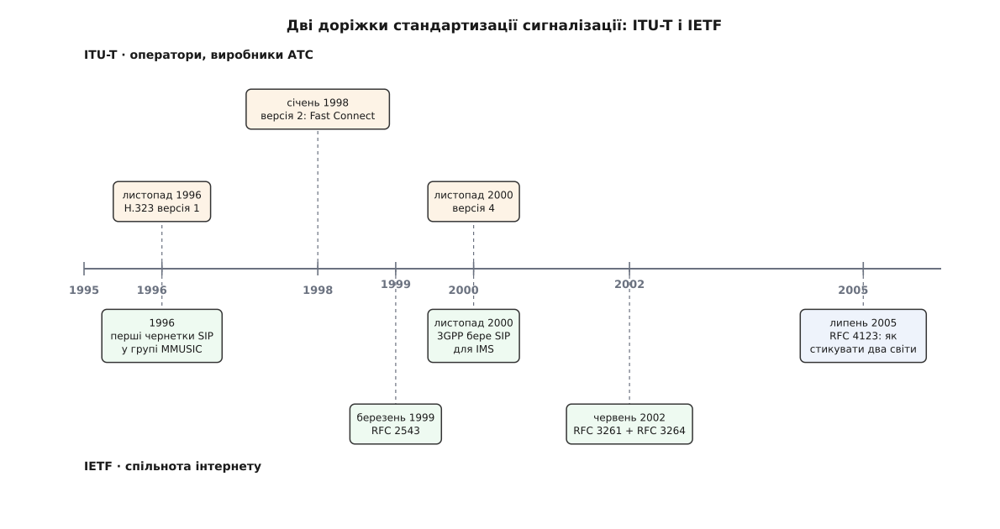

# 📜 Дві школи сигналізації: як ITU-T і IETF десять років сперечалися і зійшлися на одному способі дзвонити

Це історія про те, як дві організації з різними уявленнями про мережу майже одночасно взялися за одну задачу — навчити комп'ютери домовлятися про голосовий виклик, — вирішили її несхожими способами, і як через десять років обидва рішення набули однакової форми: пропозиція можливостей у першому повідомленні, вибір із неї у відповіді.

### Двоє питали різне

Восени 1995 року в підкомітеті ITU-T, що займався мультимедійними терміналами, сиділи люди з телефонної промисловості. За плечима в них була H.320 — відеоконференцзв'язок через ISDN, де смуга виділяється наперед, канал належить викликові, а сигналізація Q.931 будує з'єднання від апарата до апарата. Питання, яке вони собі поставили, звучало так: **що змінити в цій конструкції, щоб вона поїхала по локальній мережі?** Не «як зробити виклик», а «як перенести те, що вже працює».

Приблизно тоді ж, в IETF, у робочій групі MMUSIC (англ. *Multiparty Multimedia Session Control* — «керування багатосторонніми мультимедійними сесіями»), четверо дослідників — Марк Гендлі (Mark Handley), Генінг Шульцрінне (Henning Schulzrinne), Ів Скулер (Eve Schooler) і Джонатан Розенберґ (Jonathan Rosenberg) — розв'язували зовсім іншу задачу. У них уже був Mbone, експериментальна багатоадресна мережа, де семінар чи концерт просто **йшов** на певну групову адресу, а опис сесії (які потоки, які кодеки, яка адреса) розсилали наперед. Бракувало одного: **як покликати конкретну людину** до такої сесії. Не «побудувати з'єднання», а «доставити комусь запрошення й дочекатися відповіді».

Різниця в питаннях і породила все інше. Хто питає «як перенести телефонну станцію», той отримає станцію. Хто питає «як доставити запрошення», той отримає пошту.


*Два табори працювали одночасно, а не по черзі: перші чернетки SIP і публікація H.323 припали на той самий 1996 рік. Розійшлися вони не в часі, а в тому, звідки брали зразок.*

### 1996-й: H.323 приходить першим, бо майже нічого не винаходить

Першу версію H.323 ITU-T опублікував у листопаді 1996 року, під назвою про «системи зв'язку для локальних мереж, які не гарантують якості обслуговування». Це доконаний факт із датою.

Швидкість була не випадковою. H.323 майже нічого не створював з нуля: сигналізація виклику — переписана Q.931 з ISDN, опис можливостей — з відеоконференцзв'язку, кодування повідомлень — ASN.1 у щільному двійковому пакуванні, той самий інструментарій, що вже стояв у виробників телефонного обладнання. Компанія, яка мала стек ISDN, отримувала H.323-шлюз швидше, ніж встигала прочитати чужу специфікацію.

Ринок відреагував негайно. Ще в жовтні 1996-го Microsoft випустила першу бету NetMeeting 2.0 з підтримкою H.323 — і оголосила, що стандарт підтримали понад сотня виробників. У листопаді 1996-го VocalTec, ізраїльська компанія, яка ще з 1995-го продавала програму для голосу через інтернет, показала вбудований у вебсторінку виклик на телефон. Далі пішли шлюзи операторів: у 1997–2002 роках міжміський трафік почали дедалі частіше нести пакетними мережами між двома шлюзами, а H.323 був тим, чим ці шлюзи домовлялися. Паралельно він забрав корпоративний відеоконференцзв'язок цілком — це та ніша, де він тримався найдовше.

У січні 1998-го вийшла друга версія, і в ній з'явилася річ, до якої ми ще повернемося: **Fast Connect**. Тоді ж змінилася й назва рекомендації — з «локальних мереж» на «пакетні мережі», бо стандарт уже давно жив не в межах поверху.

### SIP: та сама задача, мова іншої культури

Перші чернетки SIP лягли в MMUSIC у 1996 році, паралельно з публікацією H.323. Статус документа тоді був скромний — чернетка робочої групи, яких сотні. Проте вигляд він мав такий, якого в телефонному світі не бачили:

```
INVITE sip:oksana@example.net SIP/2.0
Via: SIP/2.0/UDP host.example.com:5060
From: <sip:petro@example.com>
To: <sip:oksana@example.net>
Call-ID: 3848276298220188511@host.example.com
CSeq: 1 INVITE
Content-Type: application/sdp
```

Це HTTP, у якого замінили дієслова. Адресат — не номер, а URI, схожий на поштову адресу. Заголовки — рядки, які видно очима в дампі трафіку. Тіло — окремий документ [SDP](topic:com-protocol/rtsp-sdp), що описує потоки. Відповіді — тризначні коди тієї ж породи, що й «404»: `180 Ringing`, `200 OK`, `486 Busy Here`.

Зверніть увагу, чого тут **немає**. Немає з'єднання, яким усе це їде: повідомлення самодостатнє й може приїхати датаграмою. Немає центральної влади, яка дозволяє виклик: проксі-сервер може переслати запит далі, а може й не бути в ланцюжку взагалі. Немає стану, що живе між повідомленнями: усе потрібне для відповіді написане в самому запиті — той самий принцип, на якому тримається вебсервер.

У березні 1999-го чернетка стала RFC 2543. У червні 2002-го її замінив RFC 3261 — не косметична правка, а переписаний документ, який залишив назву й дієслова, але перебрав механіку майже всю. Обидві дати перевірені за архівом RFC.

> 🔧 **Навіщо це.** Текстовий формат вирішив не питання краси, а питання **порогу входу**. Щоб зробити щось із H.323, потрібен компілятор ASN.1 і бібліотека кодування; щоб зробити щось із SIP, достатньо сокета й уміння складати рядки. Наприкінці 1990-х це означало, що H.323 писали фірми, а SIP міг написати хтось у себе в підвалі — і саме звідти прийшли реалізації, які потім з'їли ринок.

### Що насправді вирішило справу

Розхожа версія «SIP переміг, бо простіший» — оцінка, а не факт, до того ж напівправдива: сучасний SIP зі своїми розширеннями простим ніхто не назве. Тож варто розділити те, що документоване, і те, що є радше поясненням заднім числом.

**Доконаний факт із датою:** у листопаді 2000 року 3GPP — консорціум, що пише стандарти мобільного зв'язку, — обрав SIP за сигналізацію для IMS, підсистеми мультимедіа в мережах наступних поколінь. Це рішення відрізало H.323 від найбільшого ринку, який тільки готувався з'явитися, і зробило SIP обов'язковим для всіх, хто планував продавати обладнання мобільним операторам.

**Теж факт:** у липні 2005-го IETF випустила RFC 4123 — вимоги до функції стикування SIP і H.323. Стандарт про те, як перекладати між двома світами, пишуть тоді, коли обидва світи вже великі й нікуди не діваються. Це радше свідчення про паритет у той момент, ніж про перемогу.

**Оцінка, не факт:** частки ринку. Публічної статистики, яку можна перевірити, по роках майже немає; загальновживане твердження «з середини 2000-х нові розгортання переважно на SIP» спирається на каталоги продуктів і на те, чим торгували оператори, а не на виміряні числа. Обережне формулювання таке: H.323 не зник і не був заміщений — він **перестав з'являтися в нових проєктах**, лишившись у вже вкладеному залізі. Успадковані парки відеоконференцзв'язку працювали на ньому ще й у 2010-х.

І окремо — чинник, який ніяк не стосується техніки. Специфікація SIP була одна й лежала безкоштовно; H.323 — це родина рекомендацій (H.225.0, H.245, H.235 і далі), які роками продавалися за гроші. Коли інженерові треба щось прочитати сьогодні ввечері, це вирішує більше, ніж усі порівняльні таблиці.

### Обидва прийшли до однієї форми виклику

Найцікавіше в цій історії — фінал, до якого табори дійшли **незалежно й з різних боків**.

Спершу H.323 узгоджував медіа так, як це роблять у телефонії: спочатку побудуй з'єднання, потім окремою процедурою обміняйся переліками можливостей, потім визначи, хто головний у суперечці, потім відкрий кожен канал окремим запитом. Це шість обігів мережею до першого пакета звуку — на локальному дроті непомітно, на міжміському каналі це секунди тиші після натискання кнопки.

Fast Connect у другій версії (1998) прибрав це одним ходом: **вкласти пропозицію каналів просто в повідомлення про виклик**. Той, хто дзвонить, кладе в `Setup` перелік описів каналів — по одному на кожен варіант кодека, з адресами, куди слати звук. Той, хто відповідає, повертає в `Connect` підмножину: ці приймаю, ці ні, а ось моя адреса. Один обіг — і медіа тече.

SIP дійшов до того самого, і оформили це в RFC 3264 (червень 2002) як **модель пропозиція-відповідь**: одна сторона кладе в тіло `INVITE` опис SDP із переліком потоків, кодеків і адрес, друга повертає в `200 OK` опис такої самої форми, у якому лишила те, що вміє й хоче.

```
H.323 Fast Connect            SIP offer/answer
──────────────────            ────────────────
Setup + fastStart[]      ←→   INVITE + SDP (offer)
   перелік каналів              перелік m=-рядків
   з адресами й кодеками        з портами й кодеками
Connect + fastStart[]    ←→   200 OK + SDP (answer)
   вибрана підмножина            звужений перелік
один обіг → RTP тече     ←→   один обіг → RTP тече
```

Це не запозичення — Fast Connect старший за RFC 3264 на чотири роки, а сама ідея «пропозиція у виклику» приходила в обидва табори з практики, а не з чужої специфікації. Це збіг, змушений однією й тією ж фізикою: медіа має потекти в мить відповіді, а кожен зайвий обіг мережею коштує затримки, яку чутно вухом. Коли обмежень стільки, простір рішень стискається до одного.

Кінець історії дописав уже третій гравець: [WebRTC](topic:com-transport/webrtc) забрав реальний час у браузер, не взявши з собою жодної сигналізації — але взявши **саме модель пропозиція-відповідь на SDP**. Тобто в суперечці двох таборів урешті переміг не H.323 і не [SIP](topic:com-protocol/sip), а форма домовляння, яку вони незалежно знайшли обидва.
