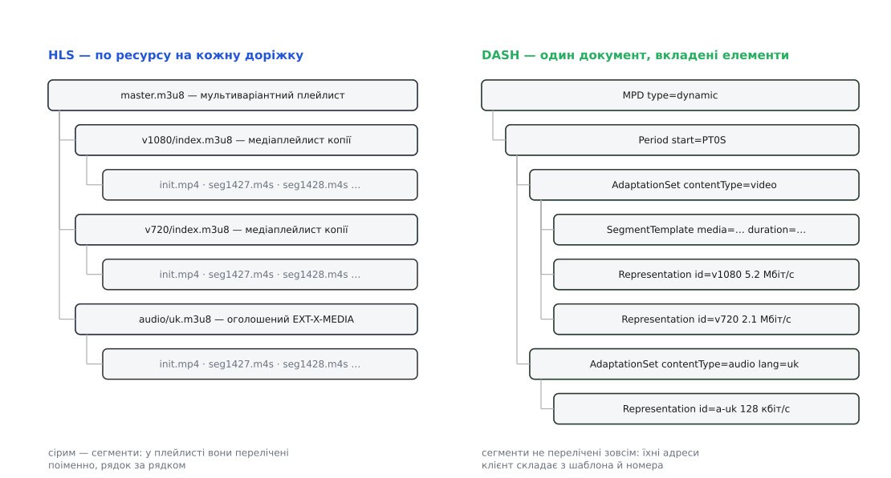

# 📋 Теги плейлиста HLS і елементи MPD: довідка рядок-у-рядок

Це довідка про **опис**, а не про медіа: теги текстового плейлиста `.m3u8` і елементи XML-документа `.mpd` з їхніми атрибутами, поруч, плюс таблиця відповідностей «те саме поняття у двох описах» — з чесним прочерком там, де відповідника немає. Сюди заглядають, коли треба прочитати чужий маніфест, скласти власний або зрозуміти, чому річ, що в одному протоколі робиться одним тегом, у другому не робиться ніяк.

Основа: для HLS — RFC 8216 (інформаційний, 2017) і його чинне продовження `draft-pantos-hls-rfc8216bis`, редакція 22 від 1 травня 2026 року, яка описує тринадцяту версію протоколу; статусу RFC цей документ ще не набув. Для DASH — ISO/IEC 23009-1:2022, п'яте видання (воно ж скасовує четверте, 2020 року); ISO віддає його безкоштовно як публічно доступний стандарт, а схема MPD відкрито лежить у репозиторії MPEG.

### Дві форми одного дерева

Обидва описи виражають ту саму ієрархію — «набір копій → копія → її сегменти». Різниця в тому, **де ця ієрархія живе**.



*Ліворуч: кожна копія має власний файл, який клієнт качає окремо, а сегменти в ньому перелічені поіменно. Праворуч: усе в одному документі, а сегментів у ньому немає взагалі — є шаблон адреси, з якого клієнт складає імена сам.*

Наслідок цієї різниці практичний. У прямому ефірі HLS клієнт перечитує **маленький файл однієї копії** — кількадесят рядків, і тільки тієї копії, яку зараз дивиться. DASH-клієнт перечитує **весь документ**, який описує всі копії й усі доріжки одразу, — тому в DASH оновлення опису намагаються звести до мінімуму: або взагалі не перечитувати (клієнт рахує номери сам), або тягнути лише різницю через MPD Patch, доданий п'ятим виданням.

### HLS: мультиваріантний плейлист

Перший файл, який бачить клієнт. Медіа він не описує зовсім — лише перелічує копії й доріжки.

| Тег | Обов'язкові атрибути | Що задає |
|---|---|---|
| `#EXTM3U` | — | Перший рядок будь-якого плейлиста; без нього файл невалідний |
| `#EXT-X-VERSION:<n>` | — | Найменша версія формату, яку клієнт мусить розуміти |
| `#EXT-X-STREAM-INF:<атрибути>` | `BANDWIDTH` | Оголошує копію; **адреса її медіаплейлиста — окремим рядком одразу під тегом** |
| `#EXT-X-MEDIA:<атрибути>` | `TYPE`, `GROUP-ID`, `NAME` | Альтернативна доріжка: інша мова, коментар, субтитри |
| `#EXT-X-I-FRAME-STREAM-INF` | `BANDWIDTH`, `URI` | Окрема копія з самих ключових кадрів — для перемотки з картинкою |

Атрибути `EXT-X-STREAM-INF`: `BANDWIDTH` — **пікова** швидкість копії в біт/с (верхня межа для будь-якого відрізка сегментів, а не середня); `AVERAGE-BANDWIDTH` — середня; `RESOLUTION=1920x1080`; `CODECS="avc1.640028,mp4a.40.2"` — рядок ідентифікаторів за RFC 6381, за яким клієнт вирішує, чи потягне його декодер; `FRAME-RATE`; `AUDIO`, `SUBTITLES`, `CLOSED-CAPTIONS` — посилання на `GROUP-ID` доріжок з `EXT-X-MEDIA`.

Атрибути `EXT-X-MEDIA`: `TYPE` ∈ `AUDIO | VIDEO | SUBTITLES | CLOSED-CAPTIONS`; `GROUP-ID` — ім'я групи, на яку посилаються копії; `NAME` — те, що побачить глядач у меню; `LANGUAGE`, `ASSOC-LANGUAGE`, `CHANNELS`, `CHARACTERISTICS`; `DEFAULT=YES|NO` і `AUTOSELECT=YES|NO` — вибирати цю доріжку без запитання чи ні; `URI` — адреса медіаплейлиста доріжки (для `CLOSED-CAPTIONS` її бути не може, бо субтитри вшиті в саме відео).

### HLS: медіаплейлист

Другий файл — уже про сегменти конкретної копії.

| Тег | Значення | Що задає |
|---|---|---|
| `#EXT-X-TARGETDURATION:<с>` | ціле, ≥ 1 | Стеля тривалості сегмента: кожен `EXTINF`, округлений до цілого, не сміє її перевищити. Обов'язковий |
| `#EXT-X-MEDIA-SEQUENCE:<n>` | ціле | Номер **першого** сегмента у файлі; за відсутності — 0. В ефірі росте, коли вікно повзе |
| `#EXT-X-DISCONTINUITY-SEQUENCE:<n>` | ціле | Скільки розривів лишилося позаду, за межами вікна |
| `#EXTINF:<тривалість>,[назва]` | дробове | Тривалість сегмента; **адреса — наступним рядком**. Обов'язковий перед кожним сегментом |
| `#EXT-X-MAP:URI="…"` | `URI`, необов'язковий `BYTERANGE` | Ініціалізаційний сегмент: заголовки контейнера й параметри декодера, без яких жоден медіасегмент не розбереться |
| `#EXT-X-BYTERANGE:<n>[@<o>]` | байти | Сегмент — це шматок довшого файла: `n` байтів зі зсуву `o`. Потребує версії ≥ 4 |
| `#EXT-X-DISCONTINUITY` | — | Далі змінюються кодек, роздільність або вісь часу: декодер треба перезапустити |
| `#EXT-X-KEY:<атрибути>` | `METHOD` | Шифрування наступних сегментів (діє до наступного `EXT-X-KEY`) |
| `#EXT-X-PROGRAM-DATE-TIME:<час>` | ISO 8601 | Прив'язує перший відлік наступного сегмента до стінного часу |
| `#EXT-X-PLAYLIST-TYPE:<VOD\|EVENT>` | — | `VOD` — файл більше не зміниться; `EVENT` — сегменти лише дописуються в кінець |
| `#EXT-X-ENDLIST` | — | Кінець: більше нічого не додасться, перечитувати не треба |

`METHOD` у `EXT-X-KEY` — `NONE`, `AES-128`, `SAMPLE-AES`, `SAMPLE-AES-CTR` (у новіших редакціях додано й `AES-256-GCM`); `URI` — звідки взяти ключ (обов'язковий, крім `METHOD=NONE`); `IV` — 128-бітний вектор ініціалізації; `KEYFORMAT` і `KEYFORMATVERSIONS` — чий це ключ і якого покоління.

Формат `BYTERANGE` тут той самий, що й у заголовку `Range` — [часткові запити HTTP](root:com-protocol/http-range-requests) дозволяють попросити довільний відрізок файла й отримати у відповідь код 206; саме на них тримається спосіб «усі сегменти в одному файлі».

### HLS: теги низької затримки

Ці теги додали 2019–2020 років, і кожен розв'язує свій шматок задачі «віддати сегмент, поки він ще пишеться».

| Тег | Атрибути | Що задає |
|---|---|---|
| `#EXT-X-PART-INF` | `PART-TARGET` | Оголошує, що сегменти поділені на частини, і яка в частини цільова тривалість (секунди) |
| `#EXT-X-PART` | `URI`, `DURATION`; далі `INDEPENDENT=YES`, `BYTERANGE`, `GAP=YES` | Частина ще недописаного сегмента з **власною адресою**; `INDEPENDENT` означає, що частина починається з незалежного кадра, тож із неї можна ввійти в потік |
| `#EXT-X-PRELOAD-HINT` | `TYPE` (`PART`\|`MAP`), `URI`; далі `BYTERANGE-START`, `BYTERANGE-LENGTH` | Адреса ресурсу, якого **ще нема**: клієнт відкриває запит завчасно, сервер відповідає в мить народження |
| `#EXT-X-SERVER-CONTROL` | `CAN-BLOCK-RELOAD`, `PART-HOLD-BACK`, `HOLD-BACK`, `CAN-SKIP-UNTIL`, `CAN-SKIP-DATERANGES` | Що сервер уміє і як далеко від краю грати |
| `#EXT-X-RENDITION-REPORT` | `URI`, `LAST-MSN`; далі `LAST-PART` | Стан **сусідньої** копії: до якого сегмента й частини вона дійшла |
| `#EXT-X-SKIP` | `SKIPPED-SEGMENTS` | У дельта-оновленні: стільки сегментів на початку пропущено, клієнт бере їх зі своєї копії |

Числові обмеження прописані в специфікації й не є справою смаку: `HOLD-BACK` — щонайменше три цільові тривалості (і саме стільки береться, якщо тег відсутній), `PART-HOLD-BACK` — щонайменше дві цільові тривалості частини (`PART-TARGET`), `CAN-SKIP-UNTIL` — щонайменше шість цільових тривалостей. `CAN-BLOCK-RELOAD=YES` означає, що сервер **притримає** запит плейлиста: клієнт додає до адреси `_HLS_msn=` і `_HLS_part=` — «віддай, коли з'явиться ось цей номер», — і сервер мовчить, доки не з'явиться.

`RENDITION-REPORT` існує рівно для одного випадку: клієнт вирішив перейти на іншу якість і не знає, який номер зараз на краю в неї; без цього тега довелося б робити зайве завантаження наосліп.

### DASH: ієрархія одного документа

MPD — це [XML](root:sf-data/xml-markup), тобто дерево іменованих елементів з атрибутами; усе, що нижче, — вкладені елементи, і кожен рівень успадковує атрибути від батьківського.

| Рівень | Ключові атрибути | Що задає |
|---|---|---|
| `MPD` | `@profiles` (обов'язковий), `@type="static\|dynamic"`, `@minBufferTime` (обов'язковий), `@availabilityStartTime`, `@publishTime`, `@mediaPresentationDuration`, `@minimumUpdatePeriod`, `@timeShiftBufferDepth`, `@suggestedPresentationDelay`, `@maxSegmentDuration` | Корінь: запис це чи ефір, від якої миті рахувати час і як часто перечитувати опис |
| `Period` | `@id`, `@start`, `@duration` | Відрізок презентації зі своїм набором доріжок; новий `Period` — місце, де все може змінитися (реклама, зміна кодека) |
| `AdaptationSet` | `@contentType`, `@mimeType`, `@lang`, `@segmentAlignment`, `@startWithSAP`, `@par` | Одна доріжка (відео, звук певної мови, субтитри) в усіх її якостях |
| `Representation` | `@id` і `@bandwidth` (обидва обов'язкові), `@codecs`, `@width`, `@height`, `@frameRate`, `@audioSamplingRate` | Одна конкретна копія доріжки — те, що в HLS зветься варіантом |
| `SegmentTemplate` | `@media`, `@initialization`, `@duration`, `@timescale`, `@startNumber`, `@presentationTimeOffset`, `@availabilityTimeOffset` | Правило, за яким складається адреса будь-якого сегмента |
| `SegmentTimeline` → `S` | `@t`, `@d`, `@r`, `@n` | Явна розкладка сегментів у часі, коли тривалості нерівні |
| `SegmentList` → `SegmentURL` | `@media`, `@mediaRange` | Дослівний перелік адрес — те саме, що робить HLS завжди |
| `SegmentBase` | `@indexRange` + `Initialization@range` | Уся копія одним файлом: клієнт качає індекс і далі бере відрізки байтів |
| `UTCTiming` | `@schemeIdUri`, `@value` | Звідки взяти точний час |
| `ContentProtection` | `@schemeIdUri`, `@value`, `cenc:default_KID` | Що зашифровано і якою системою ключів |

Часові атрибути записані двома різними способами, і плутати їх не можна: моменти (`@availabilityStartTime`, `@publishTime`) — це мітки [ISO 8601](root:sf-data/iso-8601) виду `2026-08-08T09:00:00Z`, а тривалості (`@minimumUpdatePeriod`, `@timeShiftBufferDepth`) — записи виду `PT6S`, `PT2M`, `PT1H30M` з того самого стандарту.

Значення `@schemeIdUri` для `UTCTiming` беруться з фіксованого переліку: `urn:mpeg:dash:utc:http-xsdate:2014` і `…:http-iso:2014` (сервер віддає час текстом), `…:http-head:2014` (час беруть із заголовка `Date` відповіді на `HEAD`), `…:direct:2014` (час вписано просто в MPD), `…:ntp:2014`. Для `ContentProtection` перший елемент зазвичай `urn:mpeg:dash:mp4protection:2011` зі `value="cenc"` і атрибутом `cenc:default_KID`, а далі йде по елементу на кожну систему ключів: `urn:uuid:edef8ba9-79d6-4ace-a3c8-27dcd51d21ed` — Widevine, `urn:uuid:9a04f079-9840-4286-ab92-e65be0885f95` — PlayReady. Самі байти сегментів при цьому зашифровані однаково для всіх систем — див. [спільне шифрування медіа](root:sf-security/common-encryption).

### DASH: шаблон адреси і арифметика клієнта

У `@media` та `@initialization` підставляються змінні, обгорнуті доларами:

```
$RepresentationID$   → значення Representation@id
$Number$             → номер сегмента
$Time$               → значення S@t (лише разом із SegmentTimeline)
$Bandwidth$          → значення Representation@bandwidth
$$                   → сам символ «$»

формат-специфікатор у стилі printf:
$Number%05d$         → 00042
```

Ці змінні — не прикраса, а той самий перелік сегментів, лише згорнутий у формулу. Клієнт розгортає його сам:

```
номер сегмента, що містить медіачас t (SegmentTemplate з @duration):
  N = startNumber + ⌊ t · timescale / duration ⌋

мить, коли сегмент N доступний цілком (стінний час):
  T(N) = availabilityStartTime + Period@start
       + (N − startNumber + 1) · duration / timescale
       − availabilityTimeOffset

вікно, доступне для перемотки:
  від «зараз» − timeShiftBufferDepth до «зараз»

рекомендована точка відтворення:
  «зараз» − suggestedPresentationDelay
```

**Приклад для сегментів по 6 с (`timescale=90000`, `duration=540000`, `startNumber=1`):**

```
availabilityStartTime = 09:00:00, Period@start = 0, availabilityTimeOffset = 0
зараз                 = 11:24:36  →  минуло 8676 с
N = 1 + ⌊8676 · 90000 / 540000⌋ = 1 + 1446 = 1447
T(1447) = 09:00:00 + 1447 · 6 с = 11:24:42   ← ще не готовий
T(1446) = 09:00:00 + 1446 · 6 с = 11:24:36   ← щойно з'явився
```

> 🔧 **Навіщо це.** Уся ця арифметика тримається на годиннику клієнта, і саме тут DASH ламається найчастіше. Годинник відстав на десять секунд — клієнт просить сегмент, якого ще не існує, і дістає 404 на цілком справному потоці; забіг наперед — грає далі від краю, ніж мав би, і сам не розуміє чому. Тому `UTCTiming` у живому MPD не «бажаний», а обов'язковий на практиці: він прибирає з рівняння єдину величину, яку сервер не контролює. У HLS такого рівняння немає взагалі — у плейлисті записано лише те, що вже існує.

### Те саме поняття у двох описах

| Поняття | HLS | DASH |
|---|---|---|
| Копія (варіант) | `#EXT-X-STREAM-INF` + рядок з адресою | `Representation` |
| Групування копій за доріжкою | немає — список плоский, зв'язок через `GROUP-ID` | `AdaptationSet` |
| Бітрейт копії | `BANDWIDTH` (пік по сегментах) | `@bandwidth` (у парі з `@minBufferTime`) |
| Роздільність, кадри | `RESOLUTION`, `FRAME-RATE` | `@width`/`@height`, `@frameRate` |
| Кодек | `CODECS="avc1.640028"` | `@codecs="avc1.640028"` — той самий рядок RFC 6381 |
| Альтернативна мова | `#EXT-X-MEDIA` з `LANGUAGE` | `AdaptationSet@lang` |
| Ініціалізаційний сегмент | `#EXT-X-MAP:URI` | `SegmentTemplate@initialization` |
| Тривалість сегмента | `#EXTINF` на кожен сегмент | `@duration`/`@timescale` або `S@d` |
| Перелік сегментів | рядки з адресами | **немає** — шаблон і `$Number$` |
| Нерівні тривалості | `#EXTINF` різні — і все | `SegmentTimeline` з `S@t`/`@d`/`@r` |
| Номер на початку вікна | `#EXT-X-MEDIA-SEQUENCE` (росте з вікном) | `@startNumber` (стала на весь `Period`) |
| Стеля тривалості | `#EXT-X-TARGETDURATION` | `MPD@maxSegmentDuration` |
| Діапазон байтів | `#EXT-X-BYTERANGE` | `@indexRange`, `SegmentURL@mediaRange` |
| Розрив потоку | `#EXT-X-DISCONTINUITY` | новий `Period` |
| Кінець запису | `#EXT-X-ENDLIST` | `@type="static"` + `@mediaPresentationDuration` |
| Ефір, що лише дописується | `#EXT-X-PLAYLIST-TYPE:EVENT` | `@type="dynamic"` без `@timeShiftBufferDepth` |
| Період перечитування опису | неявний: ≈ цільова тривалість | `@minimumUpdatePeriod` |
| Відступ від краю ефіру | `HOLD-BACK`, `PART-HOLD-BACK` | `@suggestedPresentationDelay` |
| Глибина перемотки назад | скільки сегментів лишили у файлі | `@timeShiftBufferDepth` |
| Шифрування | `#EXT-X-KEY` | `ContentProtection` |
| Прив'язка до стінного часу | `#EXT-X-PROGRAM-DATE-TIME` (довідка для показу) | `@availabilityStartTime` + `Period@start` (основа арифметики) |
| Джерело точного часу | **немає** — і не потрібне | `UTCTiming` |
| Адресована частина сегмента | `#EXT-X-PART` | **немає** — сегмент тече по HTTP цілим шматком; `Resync` (п'яте видання) позначає точки входу всередині сегмента, але власних адрес їм не дає |
| Запит на ще ненароджене | `#EXT-X-PRELOAD-HINT` | **немає** — клієнт рахує момент сам |
| Стан сусідньої копії | `#EXT-X-RENDITION-REPORT` | **немає** — усі копії описані в одному документі |
| Притримати відповідь до події | `CAN-BLOCK-RELOAD=YES` + `_HLS_msn` | **немає** |
| Часткове оновлення опису | `#EXT-X-SKIP` (дельта) | MPD Patch (з п'ятого видання) |

Прочерки не випадкові й лягають у дві купки. Усе, чого бракує DASH, — це наслідок того, що сегменти в ньому не адресовані поіменно: не буде переліку — не буде й частин переліку, ані звіту про чужий номер. Усе, чого бракує HLS, — навпаки, наслідок того, що перелік є: клієнтові нічого обчислювати, тож ані спільний годинник, ані `@startNumber` йому не потрібні. Це та сама структурна відмінність, побачена з двох боків.

### Живий m3u8, рядок за рядком

Мультиваріантний плейлист:

```
#EXTM3U
#EXT-X-VERSION:9
#EXT-X-MEDIA:TYPE=AUDIO,GROUP-ID="aac",NAME="Українська",LANGUAGE="uk",DEFAULT=YES,AUTOSELECT=YES,CHANNELS="2",URI="audio/uk.m3u8"
#EXT-X-STREAM-INF:BANDWIDTH=5200000,AVERAGE-BANDWIDTH=4600000,RESOLUTION=1920x1080,FRAME-RATE=30.000,CODECS="avc1.640028,mp4a.40.2",AUDIO="aac"
v1080/index.m3u8
#EXT-X-STREAM-INF:BANDWIDTH=2100000,AVERAGE-BANDWIDTH=1900000,RESOLUTION=1280x720,FRAME-RATE=30.000,CODECS="avc1.64001f,mp4a.40.2",AUDIO="aac"
v720/index.m3u8
```

- `#EXTM3U` — підпис формату; без нього клієнт має право не читати далі.
- `#EXT-X-VERSION:9` — найменший рівень сумісності, з якого клієнт зрозуміє цей набір.
- `#EXT-X-MEDIA:…` — звукова доріжка українською в групі `aac`, два канали, обирається без запитання, живе за власною адресою `audio/uk.m3u8`.
- `#EXT-X-STREAM-INF:…` — перша копія: пікова швидкість 5.2 Мбіт/с, середня 4.6, 1080p30, H.264 High Profile рівня 4.0 плюс AAC-LC, звук брати з групи `aac`.
- `v1080/index.m3u8` — адреса медіаплейлиста цієї копії; **рядок під тегом — частина тега**, не окрема сутність.
- Другий `#EXT-X-STREAM-INF` і `v720/index.m3u8` — те саме для 720p; звук той самий, тому й група та сама.

Медіаплейлист копії 1080p, ефір з низькою затримкою:

```
#EXTM3U
#EXT-X-VERSION:9
#EXT-X-TARGETDURATION:6
#EXT-X-PART-INF:PART-TARGET=0.5
#EXT-X-SERVER-CONTROL:CAN-BLOCK-RELOAD=YES,PART-HOLD-BACK=1.5,CAN-SKIP-UNTIL=36.0
#EXT-X-MEDIA-SEQUENCE:1427
#EXT-X-MAP:URI="init.mp4"
#EXTINF:6.00000,
seg1427.m4s
#EXTINF:6.00000,
seg1428.m4s
#EXT-X-PART:DURATION=0.50000,URI="seg1429.0.m4s",INDEPENDENT=YES
#EXT-X-PART:DURATION=0.50000,URI="seg1429.1.m4s"
#EXT-X-PRELOAD-HINT:TYPE=PART,URI="seg1429.2.m4s"
#EXT-X-RENDITION-REPORT:URI="../v720/index.m3u8",LAST-MSN=1429,LAST-PART=1
```

- `#EXTM3U` і `#EXT-X-VERSION:9` — та сама пара, що й у першому файлі; дев'ятка тут потрібна через дозвіл на дельта-оновлення, оголошений нижче.
- `#EXT-X-TARGETDURATION:6` — жоден сегмент не довший за шість секунд; на це число клієнт орієнтується, вирішуючи, коли перечитувати файл.
- `#EXT-X-PART-INF:PART-TARGET=0.5` — сегменти поділені на частини приблизно по півсекунди.
- `#EXT-X-SERVER-CONTROL:…` — сервер уміє притримувати відповідь; грати слід не ближче ніж за 1.5 с від краю (три `PART-TARGET`); дельта-оновлення можна просити для останніх 36 с (шість цільових тривалостей).
- `#EXT-X-MEDIA-SEQUENCE:1427` — перший сегмент у цьому файлі має номер 1427; наступного разу тут буде 1428, і саме за цим числом клієнт розуміє, наскільки зсунулося вікно.
- `#EXT-X-MAP:URI="init.mp4"` — спільний ініціалізаційний сегмент копії; його качають один раз на весь сеанс.
- `#EXTINF:6.00000,` — тривалість наступного сегмента; кома обов'язкова, назва після неї — ні.
- `seg1427.m4s` — власне адреса сегмента, відносна до адреси плейлиста.
- `#EXT-X-PART:…INDEPENDENT=YES` — перша частина сегмента 1429, який ще пишеться; вона починається з незалежного кадра, тож клієнт, що приєднується просто зараз, може ввійти саме тут.
- Другий `#EXT-X-PART` — наступні півсекунди; без `INDEPENDENT`, отже входити в потік з неї не можна, лише продовжувати.
- `#EXT-X-PRELOAD-HINT:TYPE=PART,URI="seg1429.2.m4s"` — третьої частини ще не існує; клієнт відкриває на неї запит негайно, і сервер відповість у мить, коли кодувальник її допише.
- `#EXT-X-RENDITION-REPORT:…LAST-MSN=1429,LAST-PART=1` — у копії 720p край стоїть на сегменті 1429, частина 1; клієнт, який переходить на неї, знає, що просити, і не витрачає зайвого обміну.

Для запису всі теги низької затримки зникли б, натомість з'явилися б `#EXT-X-PLAYLIST-TYPE:VOD` на початку та `#EXT-X-ENDLIST` у кінці, а `#EXT-X-MEDIA-SEQUENCE` не змінювався б ніколи.

### Живий MPD, рядок за рядком

```xml
<?xml version="1.0" encoding="UTF-8"?>
<MPD xmlns="urn:mpeg:dash:schema:mpd:2011"
     profiles="urn:mpeg:dash:profile:isoff-live:2011"
     type="dynamic"
     availabilityStartTime="2026-08-08T09:00:00Z"
     publishTime="2026-08-08T11:24:36Z"
     minimumUpdatePeriod="PT6S"
     timeShiftBufferDepth="PT2M"
     suggestedPresentationDelay="PT18S"
     minBufferTime="PT6S">
  <UTCTiming schemeIdUri="urn:mpeg:dash:utc:http-iso:2014"
             value="https://time.example.com/?iso"/>
  <Period id="0" start="PT0S">
    <AdaptationSet contentType="video" mimeType="video/mp4"
                   segmentAlignment="true" startWithSAP="1">
      <SegmentTemplate media="$RepresentationID$/seg$Number$.m4s"
                       initialization="$RepresentationID$/init.mp4"
                       timescale="90000" duration="540000" startNumber="1"/>
      <Representation id="v1080" bandwidth="5200000"
                      width="1920" height="1080" codecs="avc1.640028" frameRate="30"/>
      <Representation id="v720" bandwidth="2100000"
                      width="1280" height="720" codecs="avc1.64001f" frameRate="30"/>
    </AdaptationSet>
    <AdaptationSet contentType="audio" mimeType="audio/mp4" lang="uk">
      <SegmentTemplate media="a-uk/seg$Number$.m4s" initialization="a-uk/init.mp4"
                       timescale="48000" duration="288000" startNumber="1"/>
      <Representation id="a-uk" bandwidth="128000"
                      codecs="mp4a.40.2" audioSamplingRate="48000"/>
    </AdaptationSet>
  </Period>
</MPD>
```

- `xmlns="urn:mpeg:dash:schema:mpd:2011"` — простір імен схеми MPD; він не мінявся від першого видання, тож за ним версію стандарту не визначиш.
- `profiles="…isoff-live:2011"` — профіль «живий на ISO-BMFF»: обіцянка, що сегменти фрагментовані й адресуються шаблоном.
- `type="dynamic"` — ефір, а не запис; звідси обов'язковість `availabilityStartTime` і `publishTime`.
- `availabilityStartTime="…T09:00:00Z"` — нуль осі часу: усі обчислення доступності відлічуються від цієї миті.
- `publishTime="…T11:24:36Z"` — коли складено **цю** редакцію документа; за ним клієнт відрізняє свіжий опис від застряглого в кеші.
- `minimumUpdatePeriod="PT6S"` — опис можна вважати чинним шість секунд, далі перечитати.
- `timeShiftBufferDepth="PT2M"` — назад доступні дві хвилини; глибше сегменти вже прибрано зі сховища.
- `suggestedPresentationDelay="PT18S"` — сервер радить грати за вісімнадцять секунд від краю; клієнт має право не послухатися.
- `minBufferTime="PT6S"` — не «скільки буферизувати», а частина оголошення про бітрейт: якщо потік іде зі швидкістю `@bandwidth`, то шести секунд запасу вистачить, щоб не спинитися.
- `<UTCTiming …/>` — за адресою віддають поточний час у форматі ISO; це та сама величина, що стоїть у формулі доступності.
- `<Period id="0" start="PT0S">` — єдиний період, від нуля осі; реклама або зміна кодека створили б другий.
- `contentType="video" … segmentAlignment="true"` — доріжка відео, межі сегментів у всіх її копіях збігаються, і саме тому копії взаємозамінні.
- `startWithSAP="1"` — кожен сегмент починається з точки входу, з якої декодер стартує начисто.
- `media="$RepresentationID$/seg$Number$.m4s"` — правило адреси: підставити `id` копії й номер сегмента.
- `initialization="$RepresentationID$/init.mp4"` — той самий сенс, що `#EXT-X-MAP` у HLS.
- `timescale="90000" duration="540000"` — тривалість сегмента в тіках: 540000 ⁄ 90000 = 6.0 с; 90 кГц — звичайна відеошкала.
- `startNumber="1"` — нумерація починається з одиниці й **не зсувається** з вікном, на відміну від `EXT-X-MEDIA-SEQUENCE`.
- `<Representation id="v1080" bandwidth="5200000" …/>` — копія 1080p; `id` підставиться у шаблон, тому адреси її сегментів — `v1080/seg1447.m4s` і далі.
- Другий `Representation` — та сама доріжка гірше стисненою; `SegmentTemplate` спільний, бо стоїть рівнем вище.
- Другий `AdaptationSet` — звук українською: власна шкала 48 кГц, `288000 ⁄ 48000 = 6.0 с`, тобто ті самі шість секунд, порахованих в одиницях звуку.

Обидва описи вище розповідають про той самий набір файлів на диску — і в цьому головне, що варто винести: маніфест не є ані потоком, ані сеансом. Це папірець з іменами, і його завжди можна переписати з одного вигляду в інший, поки нарізка сегментів спільна.
