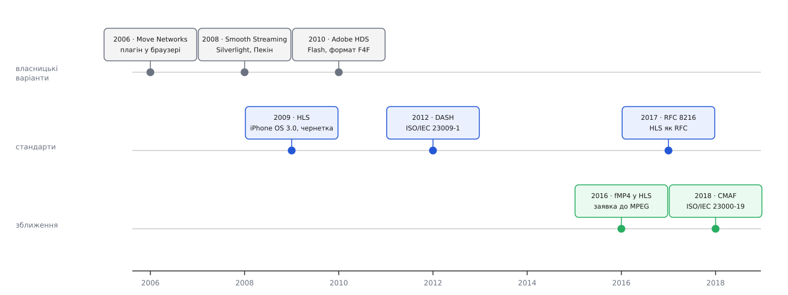

# 📜 Звідки взялися HLS і DASH

Два формати, що сьогодні розносять майже все відео в інтернеті, з'явилися з різних причин і різними шляхами: один зробила одна компанія під один телефон, другий — комітет, щоб припинити війну несумісних варіантів. Нижче — хронологія на перевірених фактах, з позначкою, наскільки твердо стоїть кожне твердження.

*Ідея різати відео на шматки і роздавати їх HTTP-сервером старша за обидва стандарти; стандартами вона стала лише тоді, коли варіантів стало забагато.*

## Move Networks: ідея була раніше за стандарти

Першою широко відомою системою, що роздавала відео шматками через звичайні веб-сервери, стала **Move Networks** — американська компанія зі штату Юта, чию технологію з 2006–2007 років уживали ABC, FOX та ESPN (документально: галузева преса того часу й пізніші патентні матеріали). Свої шматки вони називали *streamlets* — кожен ніс однаковий проміжок часу, існував у кількох якостях, і програвач сам вирішував, яку версію наступного шматка просити. Патентна заявка «Adaptive Bitrate Management for Streaming Media over Packet Networks» подана 10 липня 2007 року — це фіксована дата, а не переказ.

Ловець був у тому, як цю логіку доставляли глядачеві: Move вимагала **окремого плагіна до браузера**. Технічно ідея вже працювала, а от розповсюдження впиралося в те, що людину треба вмовити щось поставити. Це, за галузевими оглядами, і не дало Move стати загальним рішенням, попри технологічну першість.

Уже тут варто розділити рівні, які легко зліпити в одне: **мати ідею** різати потік на адресовані шматки, **побудувати систему, що продає це мовникам**, і **зробити відкриту специфікацію, яку може реалізувати будь-хто**. Move зробила перші дві речі й не зробила третьої — тому в масовій пам'яті лишилися чужі імена.

## Кожен гігант зі своїм несумісним варіантом

Далі та сама ідея повторилася тричі, і щоразу — в чужій екосистемі.

**Microsoft Smooth Streaming.** Прототип адаптивної роздачі через HTTP компанія обкатала на сайті NBC під час літньої Олімпіади 2008 року в Пекіні, а потім випустила як частину IIS Media Services разом із програвачем Silverlight (документально: власні блоги Microsoft 2009 року та тогочасні огляди). Шматки Smooth Streaming — фрагменти MP4; сервер віддавав їх за адресою-шаблоном.

**Adobe HTTP Dynamic Streaming (HDS).** Оголошена 2010 року, зав'язана на Flash: свій опис потоку у форматі F4M і свої фрагменти F4F — знову ж таки фрагментований MP4, але зі своєю обгорткою й своїм індексом.

Виходить, три компанії реалізували одну ідею — і жоден програвач не розумів чужого. Формат [медіаконтейнера](topic:com-signal/media-container) в Microsoft і Adobe був майже той самий, а описи потоку й правила іменування — різні, тож мовник, який хотів дійти до всіх глядачів, пакував ту саму передачу двічі-тричі. Тримати кілька повних наборів файлів на кожну одиницю вмісту — це реальні гроші за сховище й за роботу пакувальника, і саме цей рахунок, за одностайним свідченням галузевих джерел, штовхнув індустрію до стандартизації.

## Apple, 2009: HLS народжується разом з iPhone OS 3.0

Apple зайшла з іншого боку — з боку телефона в стільниковій мережі. **1 травня 2009 року** Роджер Пантос (Roger Pantos) з Apple подав до IETF перший інтернет-чернетку `draft-pantos-http-live-streaming-00` (документально: сама чернетка в архіві IETF). У червні того ж року підтримку HLS отримали iPhone OS 3.0 і QuickTime X у Mac OS X Snow Leopard.

Мотив був практичний: пропускна здатність стільникового каналу стрибає на порядок, поки людина йде вулицею, і потік із фіксованою якістю в таких умовах або постійно зупиняється, або назавжди лишається поганим. Тому в HLS одразу закладено перемикання якості на межах шматків — те, що зараз називають [адаптивним бітрейтом](topic:com-transport/adaptive-bitrate). Тарою для шматків Apple взяла [MPEG-TS](topic:com-protocol/mpeg-ts) — формат, уже вилизаний за десятиліття цифрового мовлення й стійкий до втрати шматка.

Швидке поширення HLS має ще одну задокументовану причину, про яку часто забувають: правила App Store вимагали вживати HLS, якщо застосунок віддає відео стільниковою мережею довше ніж десять хвилин або більше ніж 5 МБ за п'ять хвилин. Тобто підтримка формату для розробників під iOS була не порадою, а умовою потрапляння в магазин. (Це вимога Apple до застосунків, а не властивість самого протоколу — розрізняймо.)

Формальний статус HLS довго був дивним: чернетка оновлювалася роками, реалізували її всі, а документа зі сталим номером не було. **RFC 8216 вийшов лише в серпні 2017 року**, редактори — Роджер Пантос (Apple Inc.) і Вільям Мей (William May, MLB Advanced Media, стримінговий підрозділ Головної бейсбольної ліги). Категорія — **інформаційна**, потік — **Independent Submission**: це не стандарт IETF, а опублікований опис того, що вже робить Apple. Робота на цьому не спинилася: продовження `draft-pantos-hls-rfc8216bis` описує вже 13-ту версію протоколу й станом на 2026 рік передане редакторові RFC — тобто RFC 8216 має бути заміщений.

## DASH: відповідь комітету на фрагментацію

Поки Apple випускала свій формат, MPEG узялася зробити такий, що не належить нікому. Роботу над **DASH** (Dynamic Adaptive Streaming over HTTP) розпочато 2010 року за участі кількох десятків компаній; статусу міжнародного стандарту документ набув у листопаді 2011-го, а опубліковано першу редакцію **ISO/IEC 23009-1 у квітні 2012 року** (документально: каталог ISO).

Дві риси DASH були навмисними, і обидві — пряма відповідь на попередні п'ять років:

- **Незалежність від кодека.** Стандарт описує, як влаштований опис потоку й як адресуються сегменти, і майже нічого не каже про те, чим саме стиснене відео всередині. Тому DASH переживає зміну поколінь кодеків без переписування себе.
- **Незалежність від виробника.** Ніякого Silverlight, ніякого Flash, ніякої обов'язкової платформи.

Але за універсальність довелося заплатити: щоб умістити всі попередні підходи, стандарт дозволяє надто багато. Два формально бездоганні DASH-потоки могли не програтися одним програвачем просто тому, що використовували різні дозволені можливості. Саме звідси — **DASH Industry Forum (DASH-IF)**, створений 2012 року об'єднанням індустрії (нині понад вісім десятків учасників). Він не пише стандарту; він публікує *Interoperability Points* — набори домовленостей на кшталт «беремо оцю підмножину, оцей кодек, оці правила», яких досить, щоб різні реалізації справді працювали одна з одною. Це типова доля великого стандарту: сам текст описує простір можливостей, а профіль звужує його до того, що дійсно взаємодіє.

## 2016–2018: одна коробка на двох

До середини 2010-х у мовника лишалося дві живі системи замість п'яти — і той самий подвійний рахунок: MPEG-TS для HLS, фрагментований MP4 для DASH. Стиснене відео всередині обох було одне й те саме; різнилася лише обгортка.

Розв'язали це за два кроки. У **лютому 2016 року на 114-й зустрічі MPEG у Сан-Дієго** Apple і Microsoft подали спільну заявку на «спільний формат для сегментованих медіа» (документально: реєстр вхідних документів MPEG; до пропозиції протягом року долучилися інші учасники ринку). А на **WWDC у червні 2016 року** Apple оголосила, що HLS відтепер приймає **фрагментований MP4** — з окремим ініціалізаційним сегментом і сьомою версією протоколу. Відтоді той самий набір файлів можна віддавати обом системам, а різняться тільки описи потоку.

Заявка 2016 року стала стандартом **ISO/IEC 23000-19 (CMAF, Common Media Application Format) у 2018 році**; далі вийшли редакції 2020 і 2024 років.

Мораль цієї історії трохи несподівана: перемогла не найкраща й не найперша реалізація, а **спільний знаменник**. Кожен із гравців зберіг свій опис потоку — те, чим він відрізняється й керує, — і віддав у спільне користування коробку з байтами, на якій ніхто не заробляв. Розділити «де ми конкуруємо» і «де ми домовляємося» виявилося цінніше, ніж виграти суперечку про формат.
