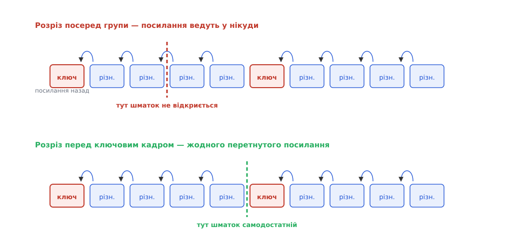
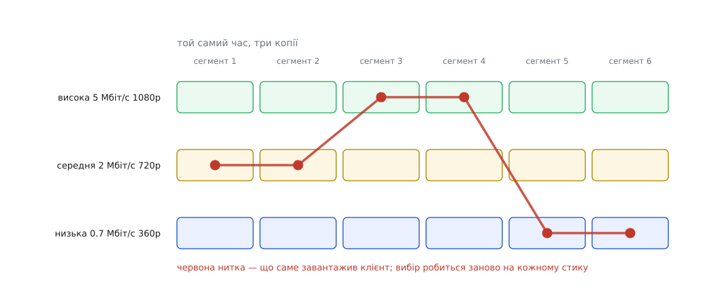
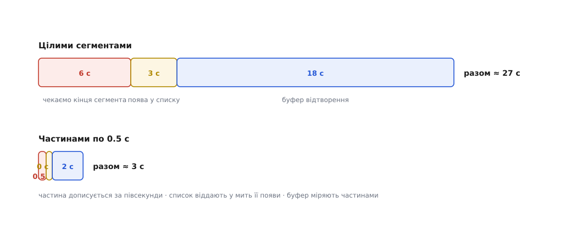

# HLS і DASH: потокове відео сегментами поверх HTTP

<preknowlist>
- [HTTP](root:com-protocol/http) — обмін «запит — відповідь» за адресою: клієнт просить ресурс методом GET, сервер віддає тіло з кодом стану й заголовками.
- [HTTP-кешування](root:com-protocol/http-caching) — чому проміжний вузол має право віддати відповідь замість сервера й що визначає строк її життя.
- [CDN](root:sf-distributed/cdn) — мережа роздавальних вузлів поблизу глядачів, що тримає копії популярних ресурсів.
- [Міжкадрове стиснення](root:com-signal/inter-frame) — більшість кадрів відео описані як різниця від сусідніх і без них не існують; ключовий кадр — єдиний самодостатній.
- [Медіаконтейнер](root:com-signal/media-container) — як стиснені кадри складають у файл із мітками часу, щоб декодер знав, що за чим і коли показувати.
- [TCP проти UDP](root:com-transport/tcp-vs-udp) — чим надійний потік із підтвердженнями відрізняється від датаграм без гарантій.
</preknowlist>

Фінал чемпіонату дивиться мільйон людей одночасно. Камера одна, картинка одна, і всім потрібна та сама. Здавалося б, це найлегший випадок з можливих: дані не залежать від глядача, отже їх можна виготовити раз і роздати всім.

Класичний потоковий сервер робить протилежне. Він відкриває на кожного глядача окремий сеанс: тримає його стан, знає, де саме той зараз у потоці, відмірює йому темп, стежить, що дійшло. Мільйон глядачів — мільйон різних станів на одній машині. Двоє сусідів по будинку дістають ті самі байти двома окремими шляхами, і жоден вузол посередині не може віддати другому те, що щойно проніс першому: з погляду мережі це дві різні розмови, а не той самий вміст. [RTSP разом із RTP](root:com-protocol/rtsp-sdp) влаштовані саме так — і саме тому бездоганно працюють з камерою на десять глядачів і не тягнуть мільйона.

Тим часом та сама мережа роздає мільйону людей логотип на сторінці, не помічаючи навантаження. Логотип — файл за адресою. Він однаковий для всіх, він не залежить від того, хто питає, і будь-який вузол на шляху має право лишити собі копію та віддавати її наступним. Уся веб-інфраструктура — кеші, проксі, [мережі роздачі](root:sf-distributed/cdn) — побудована рівно на цій властивості й більше ні на чому.

Отже, різниця між важким випадком і легким — не в обсязі даних. Вона в тому, чи є відповідь **однаковою для всіх і незалежною від питальника**. Живий потік такою не є. Звідси й задача: що треба зробити з потоком, щоб він набув властивостей файла?

### Розрізати там, де декодер уміє почати

Файл корисний лише тоді, коли самодостатній: хто його завантажив, той має все потрібне. Стиснене відео цій умові не відповідає в жодній точці. Переважна більшість кадрів зберігається як опис відмінностей від сусідів — куди зсунувся блок пікселів, що в ньому змінилося. Витягнутий з середини такий кадр не означає нічого: він посилається на картинку, якої в нас немає.

Виняток один — ключовий кадр (його ще звуть внутрішньокодованим, бо він стиснений сам по собі, без оглядки на сусідів). Від нього декодер здатний почати з чистого аркуша. Тому розріз потоку можливий рівно в одному місці: **безпосередньо перед ключовим кадром**. Розріз деінде дає файл, який неможливо ані відтворити, ані навіть перевірити.

Але ключові кадри в звичайному кодуванні ставлять рідко й нерегулярно — вони в рази більші за решту, і кодувальник вставляє їх тоді, коли картинка різко змінилася. Щоб потік узагалі можна було різати на однакові шматки, кодувальникові ставлять примусову умову: ключовий кадр **кожні N секунд, рівно за розкладом**, незалежно від змісту. Це не безплатно — за ту саму якість доводиться платити більшим бітрейтом, і плата тим більша, чим коротші шматки.

**Що це означає в числах для звичайної трансляції 1080p30:**

```
частота кадрів            = 30 кадр/с
тривалість шматка         = 6 с
кадрів у шматку           = 30 · 6 = 180
з них ключових            = 1 (перший)
розмір ключового кадру    ≈ у 5–15 разів більший за звичайний
```

Шматок, нарізаний за цим правилом, і називають **сегментом** (лат. *segmentum* — «відрізок»). Він самодостатній, він має скінченний розмір, він не змінюється після створення — це вже майже файл. Лишилося покласти в нього мітки часу й опис доріжок, тобто загорнути у [контейнер](root:com-signal/media-container). Історично для цього брали [MPEG-TS](root:com-protocol/mpeg-ts), пізніше перейшли на фрагментований MP4.


*Кадри зв'язані посиланнями назад. Розріз посередині групи (ліворуч) відрізає посилання від того, на що вони посилаються, — такий шматок декодер не розбере. Розріз перед ключовим кадром (праворуч) не перетинає жодного посилання, і кожен шматок відкривається самостійно.*

### Список, який мусить бути окремим ресурсом

Сегменти є, але клієнт про них нічого не знає: скільки їх, як звуться, якої вони тривалості, чи вони ще додаються. Усе це доводиться десь записати, і записати **окремо від медіа** — бо клієнт мусить прочитати опис раніше, ніж почне качати вміст.

Так з'являється другий ресурс — текстовий список сегментів. У ньому три речі, і кожна є не тому, що комусь захотілося, а тому, що без неї клієнт не працює.

**Порядок і адреси** — очевидне: клієнт має знати, що качати наступним.

**Тривалість кожного сегмента** — менш очевидне. Без тривалостей неможливо перемотати: щоб дістатися 43-ї хвилини, довелося б завантажити все попереднє й порахувати. Зі списком тривалостей потрібний сегмент обчислюється додаванням, не торкаючись медіа.

**Ознака завершеності** — чи це запис, який має кінець, чи ефір, який триває. Для запису список пишуть раз, і він більше не міняється. Для ефіру список **живий**: свіжий сегмент дописується в кінець, найстаріший зникає з початку, і клієнт мусить перечитувати список знову й знову, щоб дізнатися, що з'явилося. Разом зі списком іде номер першого сегмента у вікні — інакше клієнт, який на секунду відволікся, не зрозуміє, чи зсунулося вікно на один сегмент, чи на п'ять.

Тут проступає перше протиріччя цієї конструкції. Сегмент — незмінний ресурс, його можна кешувати місяцями, і саме на цьому тримається дешевизна роздачі. Список сегментів у прямому ефірі — навпаки, застаріває за секунди, і будь-який кеш, що потримає його зайву мить, безпосередньо додається до затримки глядача. Один і той самий протокол віддає два ресурси з протилежними вимогами до кешу, і налаштування строку життя для них ніколи не збігаються.

> 🔧 **Навіщо це.** Більшість аварій «відео стало й не йде» — це аварії списку, а не медіа. Кеш віддає застиглий список, у якому останній сегмент уже видалено зі сховища: клієнт бачить адресу, просить її й отримує 404. Або навпаки: список свіжий, а сегмент у ньому оголошено на секунду раніше, ніж пакувальник дописав файл. Перше, що дивляться при розборі, — це не потік, а два числа: коли клієнт узяв список і коли той список створено.

### Адаптивність не додавали — вона випала сама

Тепер сталася річ, задля якої вся конструкція, власне, і перемогла.

Якщо взяти те саме джерело й закодувати його кілька разів з різною якістю, **розрізавши всі копії в тих самих точках**, то сегменти різних копій стають взаємозамінними: третій сегмент з поганенької копії й третій сегмент з добірної описують той самий проміжок часу й закінчуються там само. Клієнт може відтворити перші два з однієї копії, третій — з іншої, і в місці стику декодерові нічого не бракує: там і так стоїть ключовий кадр, з якого він починає з чистого аркуша.

Умова взаємозамінності жорстка й порушується легко. Точки розрізу мають збігатися **до кадра**, тривалості — збігатися, а мітки часу всіх копій — рахуватися від однієї спільної осі. Варто кодувальникам поставити ключові кадри незалежно один від одного — і копії розійдуться: перемикання дасть або чорну діру, або стрибок картинки назад.

Коли умова виконана, з'являється список списків: перелік доступних копій із зазначенням бітрейта, роздільності й кодека, а вже кожен рядок веде на власний список сегментів цієї копії. Клієнт зчитує його першим, обирає, з чого почати, — і далі після **кожного** сегмента вільно вирішує, звідки брати наступний.


*Три копії різної якості нарізані в тих самих точках. Клієнт качає сегменти по одному й на кожному стику вибирає рядок заново: провалилася швидкість — переходить нижче, буфер наповнився — пробує вище. Сервер про цей вибір не знає нічого.*

Рішення про якість приймає **клієнт**, і це не випадковість, а єдиний можливий варіант. Тільки клієнт знає, скільки в нього накопичено в буфері й з якою швидкістю приходили останні сегменти; сервер не знає навіть, скільки в нього глядачів, бо не тримає сеансів. Стратегії такого вибору — окрема тема, від найпростішої «дивимось на швидкість останнього завантаження» до моделей, що оптимізують очікуване враження глядача; про них — [адаптивний бітрейт](root:com-transport/adaptive-bitrate). Написати найпростішого клієнта, який читає списки й перемикає якість, — справа десятків рядків: [розбір списку й вибір копії](root:com-protocol/hls-dash/proj-hls-client.md).

Сервер при цьому лишається тупим роздавачем файлів. Уся розумність переїхала на два кінці — до кодувальника, який нарізає, і до клієнта, який вибирає. Саме тому конструкція масштабується скільки завгодно: посередині нема чого масштабувати.

### Ціна, яку платять затримкою

Незмінний сегмент існує лише тоді, коли він **дописаний до кінця**. Отже, подія, що трапилася на першій секунді шестисекундного сегмента, стане доступною не раніше, ніж мине вся шістка. Це не єдина затримка, і всі вони додаються.

**Бюджет затримки для сегментів по 6 с:**

```
подія → сегмент дописано          = 0…6 с   (у середньому 3 с)
сегмент → клієнт побачив у списку = 0…6 с   (список перечитують раз на сегмент)
завантаження сегмента             ≈ 0.5 с
буфер відтворення (3 сегменти)    = 18 с
─────────────────────────────────────────────
від події до екрана               ≈ 22 с   (у найгіршому разі ≈ 30 с)
```

Головний доданок — буфер. Він там не для краси: клієнт качає сегменти по TCP, швидкість каналу гуляє, і єдиний захист від паузи в показі — мати запас уже завантаженого. Три сегменти запасу означають, що канал може провалитися на вісімнадцять секунд, і глядач цього не помітить. Саме ця стійкість — те, за що платять затримкою.

Спокуса взяти сегменти коротші й скоротити все вп'ятеро наштовхується на три опори одразу. Ключові кадри частішають, бітрейт за ту саму якість росте. Кількість запитів росте пропорційно — на мільйоні глядачів це мільйони зайвих запитів на хвилину. А кожен сегмент став меншим, тож частка службових даних у ньому — більша. Тому шість секунд трималися роками не з упертості: це точка, де ціни збалансовані.

### Дві реалізації одного задуму

Ідею втілили двічі, з різницею в три роки й у зовсім різних обставинах.

**HLS** (англ. *HTTP Live Streaming*) Apple випустила 2009 року разом з iPhone OS 3.0 і того ж року подала першим інтернет-чернетком; статусу інформаційного RFC 8216 документ набув аж 2017-го, за редакцією Роджера Пантоса (Apple) і Вільяма Мея (MLB Advanced Media). Список сегментів у ньому — розширений плейлист `.m3u8`: звичайний текст, де рядки-теги починаються з `#EXT`.

```
#EXTM3U
#EXT-X-TARGETDURATION:6
#EXT-X-MEDIA-SEQUENCE:1427
#EXTINF:6.000,
seg1427.m4s
#EXTINF:6.000,
seg1428.m4s
```

**DASH** (англ. *Dynamic Adaptive Streaming over HTTP*) — відповідь галузі на те, що кожен великий гравець зробив собі власний несумісний варіант тієї самої ідеї. Стандарт ISO/IEC 23009-1 ратифікували 2012 року; він навмисно не прив'язаний ні до кодека, ні до контейнера, ні до виробника. Опис — XML-документ, який називають MPD (*Media Presentation Description*).

Структурна відмінність між ними одна, і вона змістовна. **HLS перелічує сегменти, DASH їх описує.** Замість переліку MPD містить шаблон адреси та правило нумерації:

```
<SegmentTemplate media="v$RepresentationID$/seg$Number$.m4s"
                 duration="6" startNumber="1" timescale="1"/>
```

З цього клієнт сам обчислює адресу будь-якого сегмента — і того, що вже є, і того, який ще з'явиться. Для запису опис не росте зі збільшенням тривалості: фільм на три години описується тими самими кількома рядками, що й ролик на три хвилини. Для ефіру клієнт може взагалі не перечитувати опис — він порахує, коли настане час наступного сегмента, і просто попросить його.

Плата за цю економію — час стає частиною протоколу. Щоб обчислити, який сегмент **уже існує**, клієнтові потрібен годинник, узгоджений із сервером; MPD містить окремий елемент із адресою джерела точного часу. Розійшлися годинники на десять секунд — клієнт просить неіснуючі сегменти й отримує 404 на рівному місці. HLS цієї проблеми не має взагалі: у списку записано лише те, що справді існує.

Решта відмінностей — здебільшого про написання того самого. Порівняння сутностей і тегів обох описів, з відповідностями рядок-у-рядок, винесено окремо: [теги плейлиста й елементи MPD](root:com-protocol/hls-dash/api-manifest-tags.md). А те, чому світ пройшов шлях від пропрієтарних потоків через два стандарти до їх зближення, — [історія народження HLS і DASH](root:com-protocol/hls-dash/hist-hls-dash-birth.md).

### Одне тіло, дві обгортки

Довгий час два стандарти означали подвійні витрати: HLS вимагав сегментів у MPEG-TS, DASH зазвичай користувався фрагментованим MP4. Те саме відео кодували двічі, зберігали двічі й кешували на роздачі двічі — при тому що самі стиснені кадри всередині були ідентичні.

Розв'язок прийшов з двох боків одночасно. На WWDC 2016 Apple додала до HLS підтримку фрагментованого MP4, а Apple з Microsoft подали до MPEG спільну пропозицію про єдиний формат пакування; 2018 року її видали як стандарт ISO/IEC 23000-19 — CMAF (*Common Media Application Format*). Відтоді той самий набір сегментів обслуговує обидва протоколи, а різняться лише описи: `.m3u8` для одного, `.mpd` для другого. Кодування — одне, сховище — одне, кеш на вузлі роздачі — один. Шифрування теж спільне: обидва беруть однаковий формат зашифрованих сегментів, розходячись лише в тому, як добувають ключ.

### Як затримку зменшили, не роздрібнивши сегменти

Двадцять секунд запізнення терпимі для фільму й нестерпні для матчу, який сусід дивиться в іншому додатку. Але просто скоротити сегменти не можна: коротший сегмент дорожчає одразу з трьох боків — частішими ключовими кадрами, більшою кількістю запитів і більшою часткою службових даних. Вихід знайшли інший: **віддавати сегмент, поки він ще пишеться**.

HTTP це вміє з народження. Відповідь можна почати віддавати, не знаючи наперед її довжини, — тіло йде порціями, аж поки сервер не оголосить кінець. Отже, сервер має право відповісти на запит сегмента, якого ще немає цілком, і доливати байти в міру того, як кодувальник їх виробляє. Так побудували низькозатримний DASH: клієнт просить сегмент, ледве той почався, і споживає його синхронно з виробництвом. Затримка перестає залежати від тривалості сегмента й падає до одиниць секунд.

Apple пішла іншим шляхом, і причина — той самий кеш. Недописана відповідь, що тече, погано лягає на проміжні вузли: кеш або тримає її цілком, або не бере зовсім, і вигода від роздачі втрачається. Тому в низькозатримному HLS сегмент офіційно поділили на **частини** по кількасот мілісекунд, кожну з власною адресою — тобто кожна частина лишилася нормальним кешовним ресурсом. До цього додали ще дві речі. Сервер навчився **притримувати** запит списку: клієнт просить «версію, новішу за цю», і сервер не відповідає, доки нового справді не буде, — замість опитування наосліп з'явилося очікування без зайвих запитів. А в списку почали оголошувати **адресу частини, якої ще нема**: клієнт відкриває на неї запит завчасно, і сервер відповідає в ту саму мить, коли частина народжується.


*Верхній рядок: подія чекає завершення сегмента, потім появи в списку, потім наповнення буфера — доданки складаються в двадцять із гаком секунд. Нижній рядок: та сама подія їде частиною завдовжки в частку секунди, список віддають у мить її появи, і буфер міряють уже частинами.*

Дорога до цієї схеми була не пряма. Apple показала перший варіант 2019 року, і там доставку частин будували на серверному проштовхуванні HTTP/2; 2020-го його прибрали й замінили підказками про наступну частину — проштовхування погано вживалося з реальною роздачею й із вставлянням реклами. Підсумок обох гілок близький: замість двадцяти секунд — дві-п'ять.

Нижче цієї межі конструкція не опускається принципово. Затримка в одиниці секунд — це вже вартість самої ідеї «медіа є ресурсом, який хтось просить»: щоб чогось попросити, треба знати, що воно є. Розмова, де слухач нічого не просить, а джерело просто шле, коли має що, будується інакше й дає десятки мілісекунд — це [WebRTC](root:com-transport/webrtc), і воно платить за це втратою кешу й дешевої роздачі.

### Що з цього вийшло насправді

HLS і DASH не передають відео. У них немає ані власного транспорту, ані стану сеансу, ані переговорів між сторонами — жодного байта медіа їхні описи не несуть. Усе, що вони встановлюють, — це **угода про те, як називаються файли й що написано в переліку**. Уся робота лишилася на кодувальнику, який нарізає, і на клієнті, який рахує свій буфер і вибирає, що просити наступним.

Саме тому вони й перемогли протоколи, значно розумніші за них. Розумний посередник треба десь розмістити, налаштувати й оплатити на кожному вузлі роздачі. Файл із іменем не треба розміщувати ніде: його роздасть будь-що, що вміє віддавати файли, — а такого в мережі побудовано на порядки більше, ніж будь-чого іншого.
