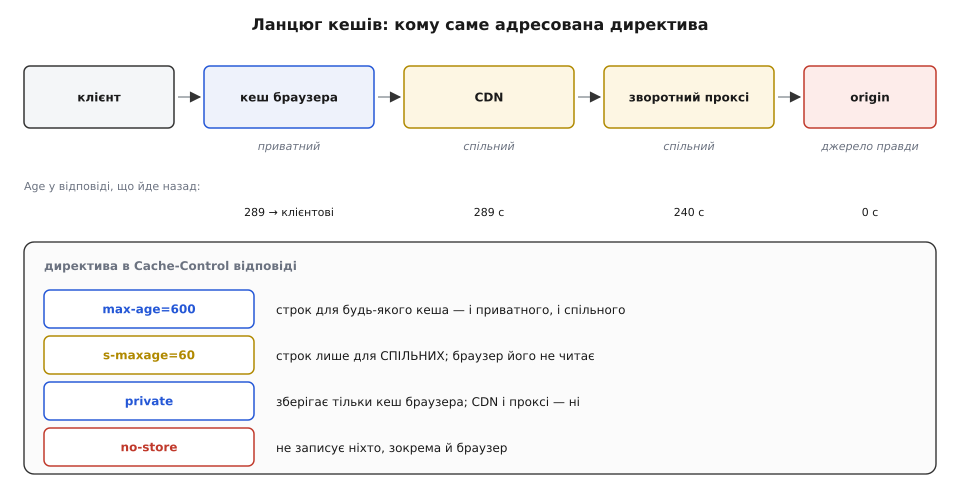
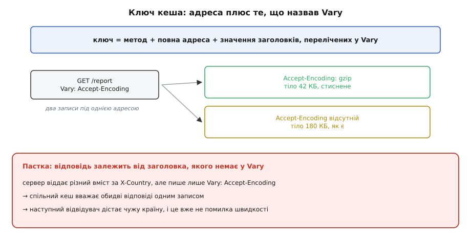
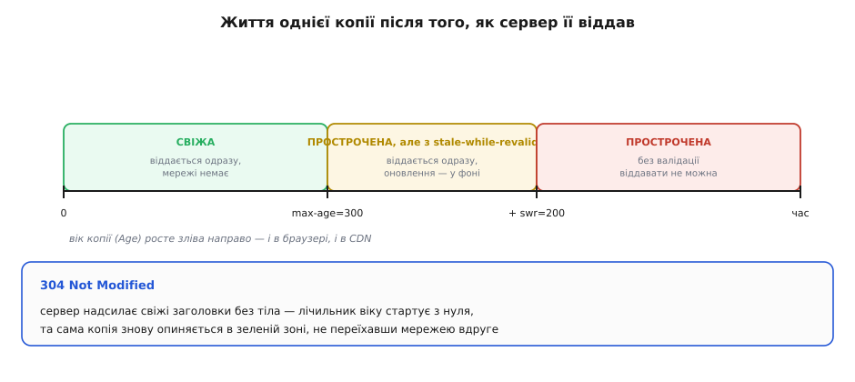

# HTTP-кешування: Cache-Control, ETag й умовні запити

<preknowlist>
- [HTTP](topic:com-protocol/http) — модель «запит → відповідь», заголовки, методи, коди станів (200, 304, 412).
- [REST](topic:com-protocol/rest-api) — ресурс і його представлення; адреса як ім'я речі, а не шлях до файлу.
- [Кеш вводить друге джерело правди](topic:sf-data/cache-invalidation-intro) — щойно з'явилася копія, з'явився ризик, що вона розійшлася з оригіналом.
- [Узгодження вмісту](topic:com-protocol/content-negotiation) — одна адреса може віддавати різні представлення залежно від заголовків запиту: мова, стиснення, формат.
</preknowlist>

Відкрий звичайну сторінку крамниці — у мережу піде близько сотні запитів: розмітка, стилі, шрифти, скрипти, десятки картинок, кілька викликів API. Наступного ранку ти відкриваєш ту саму сторінку. За ніч змінилися дві ціни й банер на головній. Решта відповідей — байт у байт ті самі, що вчора, і сервер сумлінно виготовляє та відправляє їх наново.

Кожен такий зайвий запит коштує трьох різних речей, і плутати їх не варто. Перша — **затримка**, і вона впирається у фізику, а не в потужність заліза:

```
Київ → Франкфурт            ≈ 1300 км
туди й назад                ≈ 2600 км
швидкість світла у склі     ≈ 200 000 км/с
мінімум на один обмін       = 2600 / 200000 = 0.013 с = 13 мс
реально, з чергами й вузлами маршрутизації ≈ 30 мс
```

Тринадцять мілісекунд не прибере ні швидший процесор, ні краща база даних: це час, за який світло долає відстань. Друга витрата — **трафік**: гігабайти шрифтів і картинок, за які хтось платить, а на мобільному з'єднанні ще й чекає. Третя — **робота сервера**: за кожним викликом API стоїть звертання до бази, серіалізація, збирання шаблона.

Жодну з трьох не прибрати оптимізацією відповіді, бо всі три виникають від самого факту запиту. Прибрати всі три одночасно вміє єдина річ — **не робити запиту**. А щоб його не робити, відповідь має вже лежати десь ближче до того, хто питає.

Ось тут і починається справжня складність. Копія мовчазна. Вона не знає, що оригінал змінився, і дізнатися сама не може: у HTTP немає каналу від сервера до кеша, немає повідомлення «те, що я тобі дав годину тому, більше не чинне». Розмову завжди починає клієнт. Сервер не знає навіть, у скількох браузерах лежить його вчорашня відповідь, і достукатися до них не має чим.

Тому все HTTP-кешування — це відповідь на одне питання: **як користуватися копією, не збрехавши читачеві?** Протокол дає на нього дві різні відповіді, і майже кожен заголовок цієї теми — деталь однієї з двох.

## Дві відповіді, і між ними вся різниця

Перша відповідь — **свіжість**. Сервер видає строк довіри наперед: «цій відповіді можна вірити 300 секунд». Поки строк не минув, кеш віддає копію мовчки, нікого не питаючи. Мережі немає взагалі: ні затримки, ні трафіку, ні роботи сервера.

Друга відповідь — **валідація**. Кеш зберігає разом із відповіддю коротку прикмету її вмісту й потім питає сервер: «у мене копія з прикметою "v7" — вона ще чинна?» Якщо чинна, сервер відповідає порожнім `304 Not Modified` — самі заголовки, кількасот байтів, без тіла й без збирання відповіді наново. Один обмін мережею лишається, але зникають трафік і робота.

Різниця між ними — не в кількості коду, а в тому, чим ти платиш. Свіжість платить **точністю**: усередині строку кеш віддає копію навіть тоді, коли оригінал уже змінився, і ніхто цього не помітить. Валідація платить **затримкою**: вона завжди чесна, але кожне звертання — це той самий обмін мережею й ті самі тридцять мілісекунд.


*Свіжа копія коштує нуль. Валідація прибирає тіло й роботу сервера, лишаючи один обмін. Промах платить за все відразу.*

Звідси виростає перше практичне правило: свіжість — для того, що не страшно побачити трохи застарілим (картинка, стиль, публічний перелік), валідація — для того, де застаріла відповідь є брехнею (баланс рахунку, стан замовлення). Обидві відповіді живуть в одній відповіді сервера й чудово поєднуються: короткий строк довіри плюс валідатор на випадок, коли строк минув.

## Свіжість: строк, виданий наперед

Строк задають заголовком `Cache-Control` — головним заголовком усієї теми:

```
HTTP/1.1 200 OK
Date: Tue, 02 Aug 2026 09:00:00 GMT
Cache-Control: max-age=300
Content-Type: application/json
```

`max-age=300` означає «ця відповідь лишається свіжою протягом 300 секунд». Тонкість, на якій спотикаються найчастіше, у слові «протягом»: відлік іде не від миті, коли копія потрапила в цей конкретний кеш, а від миті, коли сервер її **згенерував**. Різниця стає видимою, щойно кешів стає більше одного.

Уяви, що відповідь пролежала в CDN чотири хвилини, і аж тоді її вперше попросив браузер. Якби браузер відлічував свої 300 секунд від власного отримання, копія прожила б 240 + 300 = 540 секунд замість обіцяних 300 — і так на кожному наступному щаблі. Строк розтягувався б рівно на стільки кешів, скільки їх стоїть дорогою, а сервер втратив би контроль над власною обіцянкою.

Щоб цього не сталося, кожен кеш дописує до відповіді заголовок `Age` — скільки секунд, за його підрахунком, цій відповіді вже виповнилося:

```
HTTP/1.1 200 OK
Date: Tue, 02 Aug 2026 09:00:00 GMT
Age: 240
Cache-Control: max-age=300
```

Тепер браузер бачить: копії вже 240 секунд, отже, вірити їй лишилося 60. Обіцянка сервера рахується один раз на всю дорогу, а не на кожному щаблі окремо.

RFC 9111 («HTTP Caching», червень 2022 — чинна редакція, що замінила RFC 7234 від 2014 року) записує цей підрахунок так:

```
apparent_age          = max(0, response_time − date_value)
corrected_initial_age = max(apparent_age, age_value)
current_age           = corrected_initial_age + resident_time
response_is_fresh     = (freshness_lifetime > current_age)
```

`date_value` — час із заголовка `Date`, `response_time` — коли ця відповідь дійшла до кеша, `resident_time` — скільки вона відтоді лежить у ньому, `age_value` — прочитаний `Age`. Формула бере **більше** з двох оцінок віку: власного підрахунку за годинником і того, що сказав попередній кеш. Це навмисна обережність: помилитися в бік «копія старша, ніж є» безпечно (буде зайва перевірка), помилитися в інший бік — означає віддати прострочене.

**Копія в браузері, за нею CDN, обидва годинники розходяться на 3 секунди:**

```
Date у відповіді            09:00:00
CDN віддав її браузеру      09:04:00,  Age: 240
браузер прийняв             09:03:57   (його годинник відстає на 3 с)
apparent_age          = max(0, 09:03:57 − 09:00:00) = 237 c
corrected_initial_age = max(237, 240)               = 240 c
через 45 c у браузері: current_age = 240 + 45       = 285 c
freshness_lifetime = 300 c → 300 > 285 → копія ще свіжа, лишилося 15 c
```

Ця арифметика — не формальність. Саме вона робить кешування стійким до розсинхронізованих годинників: у підрахунку беруть участь **різниці** часу в межах однієї машини, а не порівняння абсолютних міток між машинами. Про те, чому абсолютний час між вузлами взагалі не можна вважати спільним, є окрема розмова про [прикладний час](topic:sf-apps/time-and-scheduling) — тут досить того, що годинники розходяться завжди й кеш це переживає.

Строк можна задати й старішим способом — заголовком `Expires` з абсолютною датою («чинне до 2026-08-02 09:05:00 GMT»). Він лишився від HTTP/1.0 і має вроджену ваду: якщо годинник клієнта збився на добу, обіцянка ламається. `Cache-Control: max-age` задає **тривалість**, а не мить, тому збитий годинник йому не страшний; коли є обидва заголовки, кеш слухає `max-age` і `Expires` ігнорує. Пишуть `Expires` тепер хіба заради дуже старих проміжних вузлів.

Найцікавіше — коли сервер не сказав **нічого**: ні `Cache-Control`, ні `Expires`. Природно припустити, що мовчання означає «не кешуй». Насправді ні. Кешу дозволено вигадати строк самому — це називають евристичною свіжістю. Найпоширеніша евристика бере десяту частину часу, що минув від останньої зміни: RFC 9111 прямо називає 10 % типовим значенням цієї частки. Документ, змінений три місяці тому, кеш може спокійно тримати свіжим дев'ять днів.

> 🔧 **Навіщо це.** Мовчання — не заборона, а дозвіл вгадувати. Класична пригода: сторінка віддається без жодного заголовка кешування, місяцями лежить незмінна, а тоді її правлять — і частина відвідувачів іще тиждень бачить стару, бо кеш чесно вирахував собі евристичний строк. Правило просте: на кожній відповіді, доля якої тобі не байдужа, `Cache-Control` має бути написаний **явно** — навіть якщо це `no-store`.

## Хто саме має право зберігати копію

Кеш між браузером і сервером зазвичай не один: їх кілька, і вони діляться на два класи, різниця між якими — не технічна, а щодо безпеки.

**Приватний кеш** обслуговує одну людину: кеш усередині браузера, кеш мобільного застосунку. Що там лежить, те й так належить власникові пристрою.

**Спільний кеш** обслуговує всіх одразу: [CDN](topic:sf-distributed/cdn), [зворотний проксі](topic:sf-web/reverse-proxy) перед застосунком, кеш корпоративної мережі. Відповідь, покладена туди, буде віддана **наступному, хто попросить ту саму адресу** — а це вже інша людина.

Звідси випливає весь набір директив, що керують зберіганням:

- `private` — зберігати дозволено лише приватному кешу. Це не порада щодо швидкодії, а межа: сторінка «мій кабінет» із чужим ім'ям усередині не має права осісти в CDN.
- `public` — зберігати дозволено всім, зокрема й тоді, коли за звичайними правилами спільний кеш утримався б.
- `s-maxage=N` — строк **лише для спільних** кешів; приватні його не читають і живуть за `max-age`. Так роблять типову зв'язку: коротка свіжість у браузері й довша на CDN, звідки її легко скинути силоміць.
- `no-store` — не записувати нікуди, ні на диск, ні в пам'ять. Єдина директива, що справді означає «забудь одразу».

Протокол підстраховує це і з іншого боку: спільний кеш **не має права** зберігати відповідь на запит, що ніс заголовок `Authorization`, якщо відповідь явно не дозволила цього (директивами `public`, `s-maxage` чи `must-revalidate`). Тобто типова помилка — забути `private` на персональній відповіді — не перетворюється на витік автоматично, коли доступ ішов через стандартну автентифікацію. Але сесія на [куках](topic:sf-web/http-cookies) під це правило не підпадає: там `Authorization` немає, і жодного автоматичного захисту теж немає.



*Одна відповідь лежить одночасно в кількох місцях. `private` і `s-maxage` — це не налаштування швидкодії, а адреса: кому саме дозволено тримати копію.*

> 🔧 **Навіщо це.** Найдорожчі аварії кешування — не повільність, а видача чужих даних. Схема завжди однакова: персональну відповідь віддали без `private`, спільний кеш поклав її під ключем «адреса», наступний відвідувач отримав чужий кабінет. Перевіряй це просто: якщо відповідь залежить від того, **хто** питає, вона або `private`, або взагалі `no-store`.

## `no-cache` нічого не забороняє зберігати

Назва цієї директиви — найгірша в усьому протоколі, і плутанина коштує людям годин.

- `no-store` — **не зберігай**. Копії не існує, наступний запит іде до сервера повністю.
- `no-cache` — **зберігай, але не віддавай без перевірки**. Копія лежить собі, проте перед кожною видачею кеш зобов'язаний спитати сервер, чи вона ще чинна.

`no-cache` — це не заборона, а вимкнена свіжість із увімкненою валідацією. І це дуже вигідний режим: відповідь на 200 кілобайтів, позначена `no-cache` й наділена валідатором, у більшості випадків коштуватиме порожній `304` замість повного тіла. Правильна відповідь на «дані мають бути завжди актуальні» — майже завжди `no-cache`, а не `no-store`.

Поряд стоїть `must-revalidate`: після того, як строк минув, віддавати прострочену копію заборонено **за жодних обставин**, навіть якщо сервер лежить і відповісти не може. Тоді кеш віддасть помилку 504 замість учорашніх даних. Це свідомий вибір на користь правди проти доступності, і для платіжних чи медичних даних він єдино можливий.

Директив у `Cache-Control` набагато більше, ніж потрібно щодня, і частина з них живе тільки в запитах, а не у відповідях — [повний перелік директив, умовних заголовків і кодів станів](topic:com-protocol/http-caching/api-cache-headers.md) зібраний окремо. Одну варто назвати тут, бо з нею ти стикаєшся щодня: коли людина натискає «оновити сторінку», браузер додає до запиту `Cache-Control: max-age=0` — «мене не влаштовує жодна свіжість, перевір усе». Саме тому «а в мене після F5 все правильно» нічого не доводить про кеш інших відвідувачів.

## Валідатори: чим сервер упізнає стару копію

Строк рано чи пізно минає, і кеш стає перед вибором: тягнути всі 200 кілобайтів наново чи спитати, чи вони взагалі змінилися. Щоб спитати, потрібна коротка прикмета вмісту, зрозуміла серверові, — **валідатор**. Їх два.

**`Last-Modified`** — дата останньої зміни представлення:

```
Last-Modified: Mon, 01 Aug 2026 18:20:00 GMT
```

Просто, дешево й із двома вродженими вадами. Перша: роздільність — одна секунда. Дві правки в межах однієї секунди дадуть однакову дату, і друга з них лишиться непоміченою. Друга: дата має сенс тільки для того, що справді має «час зміни» — для файла на диску має, для JSON, зібраного з п'яти таблиць, це вже вигадка.

**`ETag`** (entity tag, від англ. *tag* — мітка) — рядок, який сервер обирає сам:

```
ETag: "a3f9c2e1"
```

Для кеша цей рядок **непрозорий**: його заборонено розбирати, порівнювати як число чи витягати з нього зміст. Дозволено рівно одне — порівняти з тим, що прийшов раніше. Уся свобода в тому, як його породити, лишається серверові, і вибір тут не дрібниця:

- **Геш тіла відповіді** — найточніше: мітка змінюється тоді й лише тоді, коли змінилися байти. Ціна — тіло треба спершу зібрати, тож економиться трафік, але не робота бази. Для гешування тут беруть швидкі некриптографічні функції, бо від мітки не потрібна стійкість до підробки, лише розрізнення; там, де вміст підписують, ідеться вже про [криптографічні гешфункції](topic:sf-security/cryptographic-hash) і зовсім іншу вимогу.
- **Версія запису** — `"user-42-v17"`, де 17 береться зі стовпця версії або `updated_at`. Дешево: мітку видно з бази ще до збирання відповіді, тож можна відповісти `304`, навіть не рендерячи. Вимагає дисципліни: кожна зміна, що впливає на відповідь, мусить піднімати версію — зокрема й зміна пов'язаних сутностей.
- **Атрибути файла** — час зміни й розмір; так типово робить nginx для статики. Пастка з'являється в кластері: два сервери роздають той самий файл із різним часом створення на диску, мітки різні, і кеш перевалідовує вміст, який насправді не змінювався.

Мітки бувають **сильні** й **слабкі**. Слабку позначають префіксом `W/`:

```
ETag: "a3f9c2e1"        сильна — байт у байт той самий вміст
ETag: W/"a3f9c2e1"      слабка — вміст рівнозначний за змістом
```

Різниця не косметична, бо порівнюють їх за різними правилами. `If-None-Match` (питання «чи змінилося?») порівнює **слабко**: слабка мітка тут цілком годиться, бо для перевірки свіжості досить змістової рівнозначності. А `If-Match` і `Range` порівнюють **суворо**: дописувати шматок до тіла чи перезаписувати ресурс можна лише тоді, коли ти певен щодо кожного байта. Звідси реальна пригода: проміжний вузол, що стискає відповіді на льоту, зобов'язаний послабити мітку — бо байти вже інші, — і після цього довантаження перерваного файла тим самим `Range` перестає працювати.

Ця пара — строк плюс валідатор — з'явилася в протоколі не одразу й не випадково: [як народився умовний запит](topic:com-protocol/http-caching/hist-conditional-get.md) простежує дорогу від дати в HTTP/1.0 до `ETag` і `Cache-Control` у HTTP/1.1. Коротко: спершу був лише `If-Modified-Since`, і саме його вади — секундна роздільність, залежність від годинників, безсилля перед згенерованим вмістом — змусили придумати непрозору мітку.

## Умовний запит: питання, на яке дешево відповісти

Маючи валідатор, кеш перетворює важкий запит на легке питання. Це й називають умовним запитом: «віддай мені тіло, **але лише за умови**, що моя копія застаріла».

```
GET /api/orders/42 HTTP/1.1
Host: shop.example
If-None-Match: "a3f9c2e1"
```

Якщо поточна мітка ресурсу така сама, сервер відповідає:

```
HTTP/1.1 304 Not Modified
Date: Tue, 02 Aug 2026 09:31:12 GMT
ETag: "a3f9c2e1"
Cache-Control: max-age=300
```

Тіла немає — і саме тому відповідь коштує кількасот байтів замість двохсот кілобайтів. Але `304` робить іще одну важливу річ, яку часто проминають: **заголовки з нього вписуються в збережену копію**. Прийшов новий `Date`, прийшов новий `Cache-Control` — і лічильник віку стартує з нуля. Стара копія, не переїхавши мережею вдруге, знову опиняється у свіжій зоні. Тому валідація — це не «перевірка перед видачею», а спосіб **продовжити життя** копії, витративши один обмін замість повного завантаження.

Обробник на боці сервера виглядає буденно, і головне в ньому — рахувати мітку **до** збирання важкої відповіді:

:::tabs
```ts
app.get("/api/orders/:id", async (req, res) => {
  // версія береться з бази одним дешевим читанням, без збирання тіла
  const version = await db.orderVersion(req.params.id);   // напр. 17
  if (version === null) return res.sendStatus(404);

  const etag = `"order-${req.params.id}-v${version}"`;
  res.setHeader("ETag", etag);
  res.setHeader("Cache-Control", "private, no-cache");

  if (req.headers["if-none-match"] === etag) {
    return res.status(304).end();       // тіло не збирали взагалі
  }

  const order = await db.loadOrder(req.params.id);        // ось тут дорога робота
  res.json(order);
});
```
```go
func orderHandler(w http.ResponseWriter, r *http.Request) {
    id := r.PathValue("id")

    // версія береться з бази одним дешевим читанням, без збирання тіла
    version, err := db.OrderVersion(id)
    if err != nil {
        http.Error(w, "not found", http.StatusNotFound)
        return
    }

    etag := fmt.Sprintf("\"order-%s-v%d\"", id, version)
    w.Header().Set("ETag", etag)
    w.Header().Set("Cache-Control", "private, no-cache")

    if r.Header.Get("If-None-Match") == etag {
        w.WriteHeader(http.StatusNotModified) // тіло не збирали взагалі
        return
    }

    order, err := db.LoadOrder(id)            // ось тут дорога робота
    if err != nil {
        http.Error(w, "internal", http.StatusInternalServerError)
        return
    }
    json.NewEncoder(w).Encode(order)
}
```
:::

Порядок дій тут і є вся вигода: якщо мітку можна отримати дешево, `304` коштує серверові одного індексного читання. Коли ж мітку рахують від гешу готового тіла, економиться лише трафік — теж чимало, але робота бази лишається на місці.

Уся машина станів такого кеша — підрахунок віку, рішення «свіже чи ні», побудова умовного запиту, вписування заголовків із `304`, ключі за `Vary` — розібрана з робочим кодом у [проєкті кеша-посередника](topic:com-protocol/http-caching/proj-cache-validator.md).

## Той самий валідатор — на запис

Валідатор придумали для читання, але точнісінько та сама мітка розв'язує іншу задачу, зовсім не пов'язану зі швидкістю, — **втрачене оновлення**.

Двоє редакторів відкривають ту саму статтю. Перший править заголовок і зберігає. Другий, який бачить давню версію, править абзац і зберігає теж — його `PUT` перезаписує документ цілком і мовчки затирає чужий заголовок. Ніхто не отримав помилки; просто одна правка зникла.

Умовний запис прибирає цю дірку одним заголовком:

```
PUT /articles/17 HTTP/1.1
If-Match: "v7"
Content-Type: application/json

{ "title": "…", "body": "…" }
```

«Запиши, **але лише за умови**, що поточна версія досі "v7"». Якщо перший редактор уже зберіг свою правку, мітка на сервері стала `"v8"`, умова не справдилася — і сервер відповідає `412 Precondition Failed`, нічого не змінивши. Другий редактор дізнається про конфлікт замість того, щоб непомітно його спричинити. Це той самий механізм, що в базах даних називають [оптимістичним блокуванням](topic:sf-data/optimistic-locking): не забороняємо одночасні правки заздалегідь, а ловимо зіткнення в момент запису.

Поруч живуть іще дві корисні форми:

- `If-None-Match: *` на `PUT` — «створи, тільки якщо такого ресурсу ще немає»: зірочка означає будь-яку наявну мітку, тож умова справджується лише для порожнього місця. Так роблять безпечне створення без гонитви між двома клієнтами.
- `428 Precondition Required` (RFC 6585, квітень 2012) — відповідь сервера, який **відмовляється** приймати сліпий запис узагалі: «повернися з `If-Match`». Це перетворює захист від втраченого оновлення з доброї волі клієнта на вимогу контракту.

## `Vary`: ключем є не сама адреса

Здається природним, що адреса однозначно визначає відповідь. Це неправда, щойно вмикається узгодження вмісту: та сама `/report` віддає стиснене тіло тому, хто прислав `Accept-Encoding: gzip`, і нестиснене — старому клієнтові; ту саму `/help` — українською або англійською залежно від `Accept-Language`.

Для кеша це смертельна пастка. Він поклав стиснений варіант під ключем «GET /report» і віддає його клієнтові, який стиснення не розуміє, — той бачить кашу з байтів. Тому відповідь зобов'язана назвати, **від чого саме вона залежала**:

```
HTTP/1.1 200 OK
Content-Encoding: gzip
Vary: Accept-Encoding
Cache-Control: max-age=600
```

`Vary` добудовує ключ: тепер запис у кеші адресується не самою адресою, а адресою разом зі значеннями перелічених заголовків. Під однією `/report` спокійно живуть два записи.



*Кожен заголовок у `Vary` множить кількість записів під однією адресою. А заголовок, від якого відповідь залежить, але який у `Vary` не названий, змішує ці записи в один.*

Помилитися можна у два боки, і обидва болючі.

**Назвати забагато.** `Vary: User-Agent` виглядає безневинно, але рядків `User-Agent` у світі мільйони — і кеш дробить один ресурс на мільйон записів, кожен із яких майже ніколи не буде використаний повторно. Влучань немає, кеш перетворюється на дорогий спосіб витрачати пам'ять. `Vary: Cookie` на сторінці робить те саме, тільки ще й персонально: у кожного відвідувача своя кука, отже, свій запис.

**Назвати замало.** Це вже не питання швидкості. Якщо відповідь залежить від заголовка, якого немає у `Vary` — скажімо, сервер обирає вміст за власним `X-Country` чи за токеном, — спільний кеш вважає всі варіанти одним записом і роздає перший-ліпший усім. Так виглядає отруєння кеша: атакувальник надсилає запит, який змушує сервер віддати шкідливий варіант, кеш кладе його під загальним ключем, і далі його безкоштовно отримують усі відвідувачі. Дірка тут не в кеші — кеш чесно виконав ключування, яке йому оголосили.

> 🔧 **Навіщо це.** Перевіряти `Vary` треба щоразу, коли перед застосунком з'являється спільний кеш. Правило коротке: перелічи всі заголовки запиту, що впливають на тіло відповіді. Кожен із них має бути або у `Vary`, або усунений із логіки. Якщо серед них опинився `Cookie` чи `Authorization`, відповідь просто не можна віддавати спільному кешу — тут потрібен `private`, а не хитріший ключ.

## Коли строк минув, а швидкість потрібна далі

Прострочена копія в кеші не зникає — вона просто втрачає право бути виданою без перевірки. І тут HTTP дає два розширення, які торгують точністю за час і за живучість (RFC 5861, травень 2010):

```
Cache-Control: max-age=300, stale-while-revalidate=200, stale-if-error=86400
```

`stale-while-revalidate=200` каже: протягом 200 секунд після кінця строку віддавай прострочену копію **одразу**, а перевірку роби у фоні. Читач отримує відповідь за нуль мілісекунд і не знає, що вона на секунду-дві застаріла; наступний уже дістане оновлену. Затримка перевалідації зникає з очей повністю.

`stale-if-error=86400` каже: якщо сервер відповів помилкою або не відповів узагалі, віддавай стару копію ще добу. Кеш перетворюється на щит доступності: коли база лягла, читачі бачать учорашній перелік товарів замість сторінки помилки. Це прямий антипод `must-revalidate`, і вибір між ними — не технічний, а продуктовий: що гірше для цих конкретних даних, застаріле чи відсутнє.



*Успішна валідація не створює нової копії — вона повертає стару в зелену зону, оновивши їй заголовки.*

Одна річ, якої в цій картині більше немає: раніше кеш мав позначати видану прострочену відповідь заголовком `Warning: 110 Response is Stale`. RFC 9111 скасував `Warning` — його майже ніхто не генерував і ніхто не показував людям. Тож клієнт **не може** відрізнити свіжу відповідь від виданої за `stale-while-revalidate` інакше, ніж за `Age`. Це не дрібниця для тих, хто вмикає це розширення на даних, де секунда застарілості має ціну.

Є й зворотний бік довгих строків, про який згадують запізно. Коли тисяча копій однієї популярної відповіді має однаковий `max-age`, вони прострочуються **одночасно** — і в ту саму секунду тисяча запитів б'є в сервер, який щойно не мав навантаження взагалі. Це окрема хвороба з окремим лікуванням (розкид строків, замок на оновлення, злиття однакових запитів у один) — [thundering herd і cache stampede](topic:sf-distributed/cache-stampede).

## Інвалідація: надійно — тільки нова адреса

Тепер найнеприємніше. `max-age=3600` — це обіцянка, яку **не можна відкликати**. Копія лежить у чужому браузері, і каналу до неї немає. Хоч би що ти зробив із сервером, наступну годину той браузер має повне право не питати нічого.

Протокол дає лише дві слабкі форми скасування, і межі обох треба знати точно.

Перша записана в RFC 9111: коли через кеш проходить небезпечний метод (`POST`, `PUT`, `DELETE`) і сервер відповідає не помилкою, кеш **зобов'язаний** визнати збережену копію тієї самої адреси недійсною. Механізм працює, але лише для того кеша, **крізь який реально пройшов запис**. Браузер того, хто редагував, оновить свою копію; браузери решти читачів не дізнаються нічого, бо через них запис не йшов.

Друга — примусове скидання на CDN (purge). Воно ефективне, миттєве й геть **не стандартизоване**: у кожного постачальника свій виклик, свої ключі-мітки для групового скидання, свої ліміти. І головне — воно не сягає браузерів. Скинути можна те, чим володієш; чужий кеш тобі не належить.

Звідси єдиний по-справжньому надійний хід: **не скасовувати обіцянку, а міняти адресу**. Якщо вміст файла зашити в його ім'я, будь-яка зміна вмісту породжує нове ім'я — і скасовувати стає нічого:

```
old:  /static/app.a3f9c2.js     ← лежить у браузерів, max-age=31536000
new:  /static/app.7b1e04.js     ← інша адреса, інший запис у кеші
```

Звідси стандартна дворівнева схема, на якій тримається вся сучасна роздача статики. Незмінні файли з гешем у назві віддаються з максимальним строком і директивою `immutable` (RFC 8246, вересень 2017), яка каже клієнтові не турбувати сервер валідацією навіть після натискання «оновити»:

```
Cache-Control: max-age=31536000, immutable
```

А документ, який на них посилається, — сторінка чи маніфест — не кешується наперед узагалі:

```
Cache-Control: no-cache
```

Вийшло розділення обов'язків: **змінний документ завжди перевіряється** (це один дешевий `304`), а **незмінні шматки не перевіряються ніколи**. Оновлення застосунку зводиться до однієї зміни в документі, який усі й так щоразу перепитують. Ця техніка настільки ввійшла в побут, що про неї забувають як про окреме рішення, — а вона заслуговує власного погляду: [незмінна статика з відбитком вмісту в адресі](topic:sf-distributed/content-addressed-assets).

## Що з чим ставити

Усе сказане згортається в кілька типових виборів. Не тому, що їх треба вивчити напам'ять, а тому, що кожен із них тепер виводиться з причин, а не береться на віру:

```
статика з гешем в імені   Cache-Control: public, max-age=31536000, immutable
сторінка / index.html     Cache-Control: no-cache            + ETag
публічний перелік         Cache-Control: public, max-age=60, s-maxage=300,
                                         stale-while-revalidate=60
дані користувача          Cache-Control: private, no-cache   + ETag
вхід, платіж, токен       Cache-Control: no-store
```

Три речі варто перечитати в цьому переліку двічі. Персональні дані ніколи не йдуть без `private`. `no-store` стоїть лише там, де копії не має існувати навіть на диску власного пристрою, — не як перестраховка «щоб напевно свіже» (для цього є `no-cache`). І `ETag` присутній усюди, де немає довгого строку: без валідатора `no-cache` означає повне завантаження щоразу, а з ним — порожній `304`.

Кожен заголовок цієї теми відповідає рівно на одне з трьох питань: **хто** має право тримати копію, **доки** їй можна вірити без запитання, і **як** спитати дешево. Свіжість без валідатора — це швидкість, куплена за ризик збрехати. Валідатор без строку — це чесність, куплена за обмін мережею. Разом вони дають те, заради чого все це й будувалося: відповідь, що приходить миттєво й при цьому лишається правдою.
