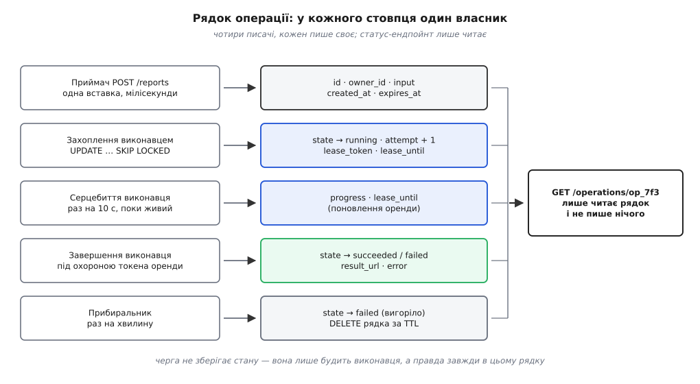
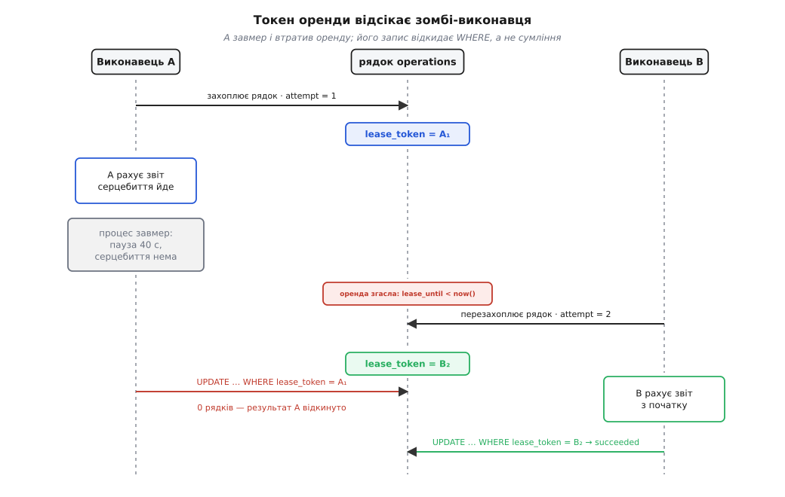

# ⚙️ Приймач, виконавець і статус: код асинхронної операції

Три URL цього обміну — замовлення, статус, результат — це три невеликі обробники й одна таблиця в базі, і зібрати їх треба так, щоб система не брехала клієнтові навіть тоді, коли виконавець посеред роботи помер. Написані «як пишеться», ці обробники дають щось на вигляд робоче: воно показує `running` для операції, чий процес зник півгодини тому, кладе базу тисячею опитувань на секунду й час від часу рахує один звіт двічі.

## Що саме має гарантувати код

Назвімо вголос, що мусить бути правдою в будь-яку мить. Кожен пункт коштує окремої конструкції — жоден не з'являється сам собою:

1. **Операція існує у сховищі раніше, ніж клієнт побачив її URL.** Інакше перше ж опитування дістане `404`, і клієнт вирішить, що замовлення загубилось.
2. **Над операцією працює рівно один виконавець.** Двоє — це подвійна робота, а на операціях зі стороннім ефектом (лист, списання, платіж) — подвійна шкода.
3. **Виконавець, що помер, не тримає роботу вічно.** Процес зникає без попередження, і рядок мусить повернутись у роботу без участі людини.
4. **Той, у кого роботу забрали, не може дописати свій результат.** Померлий не завжди мертвий: він оживає після паузи й пише вчорашню правду поверх сьогоднішньої.
5. **Термінальний стан пишеться раз і не змінюється.** `succeeded` не має ставати `failed` через хвилину — клієнт уже пішов за результатом.
6. **Статус-ендпойнт дешевий і сам гальмує клієнта.** Він дістане більше запитів, ніж усе інше API разом: по одному кожні кілька секунд на кожну живу операцію.

Усі шість тримаються на одному рішенні: де саме живе правда про операцію.

## Правда живе в рядку, черга лише будить

Перша спокуса — зберігати стан у самій черзі: повідомлення вже несе замовлення, хай несе й поступ. Проти цього — сам статус-ендпойнт. [Черга повідомлень](root:sf-distributed/message-queue) (канал, з якого споживач бере наступне повідомлення) не вміє віддавати повідомлення на ім'я: у неї немає операції «покажи стан ось цього». Прочитати з черги «як там `op_7f3`» неможливо в принципі.

Отже стан живе в таблиці, а черга носить самий лише сигнал «прокинься, є робота». Сигнал такий дешевий, що його втрата не смертельна: якщо повідомлення загубиться, виконавець усе одно натрапить на рядок, коли черговий раз обведе таблицю очима. Ця властивість розв'язує вузол, у який упирається кожна така система, — «спочатку записати, потім опублікувати». Записати рядок і надіслати повідомлення в одній транзакції неможливо, бо черга живе поза базою; отже між комітом і публікацією завжди є щілина, у яку може провалитися сигнал. Коли сигнал — лише прискорювач, щілина нікого не ранить: пізніше рядок підбере обхід таблиці. Коли ж від сигналу залежить сам факт виконання, потрібен [transactional outbox](root:sf-distributed/outbox-pattern) — повідомлення пишеться в ту саму базу тією ж транзакцією, а окремий відправник переносить його в чергу.

## Рядок операції

```sql
CREATE TABLE operations (
    id               text        PRIMARY KEY,          -- 'op_7f3…', непередбачуваний
    owner_id         text        NOT NULL,             -- хто замовив; звіряється на кожному читанні
    kind             text        NOT NULL,             -- 'report.build' — що робити
    input            jsonb       NOT NULL,             -- параметри замовлення {"period":"2026-Q2"}
    state            text        NOT NULL DEFAULT 'pending'
                     CHECK (state IN ('pending','running','succeeded','failed','cancelled')),
    progress         real        NOT NULL DEFAULT 0
                     CHECK (progress >= 0 AND progress <= 1),
    result_url       text,                              -- пишеться разом зі 'succeeded'
    error            jsonb,                             -- пишеться разом із 'failed'
    cancel_requested boolean     NOT NULL DEFAULT false,
    attempt          int         NOT NULL DEFAULT 0,   -- скільки разів за роботу бралися
    lease_token      uuid,                              -- хто саме тримає роботу зараз
    lease_until      timestamptz,                       -- доки тримає (за годинником БАЗИ)
    idempotency_key  text,                              -- ключ старту від клієнта
    created_at       timestamptz NOT NULL DEFAULT now(),
    updated_at       timestamptz NOT NULL DEFAULT now(),
    expires_at       timestamptz NOT NULL               -- коли запис можна прибрати
);

-- один ключ ідемпотентності на замовника: повтор POST не створить другої операції
CREATE UNIQUE INDEX operations_idem ON operations (owner_id, idempotency_key)
    WHERE idempotency_key IS NOT NULL;

-- часткові індекси: у них лежить лише незавершене
CREATE INDEX operations_pending ON operations (created_at)  WHERE state = 'pending';
CREATE INDEX operations_running ON operations (lease_until) WHERE state = 'running';
```

Два стовпці тут несуть усю вагу — `lease_token` і `lease_until`. Разом вони — **оренда**: право працювати над рядком, видане на строк. Не замок, який тримають, доки не відпустять, а саме оренда, що гасне сама. Різниця вирішальна: замок, узятий процесом, який помер, залишається взятим назавжди, і зняти його нема кому; оренда протухає без чийогось втручання, бо строк спливає за годинником бази. Це та сама конструкція, що й [лізи в розподілених замках](root:sf-distributed/distributed-locks) (право на ресурс, видане на скінченний час і поновлюване, поки власник живий), тільки в найдешевшому вигляді — двома стовпцями таблиці, яку ти й так маєш.

`attempt` рахує захоплення, а не помилки: кожне взяття рядка в роботу — плюс один, незалежно від того, чим воно скінчилося. Саме тому цей лічильник ловить найгірший вид відмови — коли виконавець мовчки зникає, не встигнувши записати жодної помилки.

Часткові індекси заслуговують окремого слова. Умова `WHERE state = 'pending'` означає, що [індекс](root:sf-data/database-indexes) (окрема структура для швидкого пошуку рядків) містить лише рядки, які ще чекають. Через рік у таблиці буде десять мільйонів завершених операцій — а в цьому індексі так само десятки рядків, бо завершені з нього випадають самі, як тільки `state` змінюється. Черга всередині бази не сповільнюється з ростом історії.



*Кожен стовпець має рівно одного писача, і жоден із них не пише в чужі: приймач створює рядок, захоплення бере оренду, серцебиття її поновлює, завершення ставить термінальний стан, прибиральник підмітає. Статус-ендпойнт читає й не пише нічого.*

## Приймач: одна вставка і негайна відповідь

:::tabs
```ts
// POST /reports — приймач: створити операцію і зразу віддати посилання на неї
app.post("/reports", async (req, res) => {
  const owner = req.user.id;                              // з автентифікації
  const idemKey = req.get("Idempotency-Key") ?? null;
  const opId = "op_" + randomBytes(12).toString("hex");   // 96 біт — перебором не вгадати

  // один statement — одна транзакція: або рядок є, або його нема
  const { rows } = await pool.query(
    `INSERT INTO operations (id, owner_id, kind, input, idempotency_key, expires_at)
     VALUES ($1, $2, 'report.build', $3, $4, now() + interval '24 hours')
     ON CONFLICT (owner_id, idempotency_key) WHERE idempotency_key IS NOT NULL
       DO UPDATE SET updated_at = now()   -- повтор: нічого не створюємо, але рядок повертаємо
     RETURNING id, state`,
    [opId, owner, JSON.stringify(req.body), idemKey],
  );
  const op = rows[0];

  // сигнал у чергу — ПІСЛЯ коміту вставки; втрата сигналу не фатальна
  queue.publish("operations", { id: op.id })
       .catch((e) => log.warn(e, "сигнал у чергу не пішов"));

  res.status(202)                                          // прийнято, ще не зроблено
     .set("Location", `/operations/${op.id}`)
     .set("Retry-After", "2")
     .json({ id: op.id, state: op.state, operation_url: `/operations/${op.id}` });
});
```
```go
// POST /reports — приймач: створити операцію і зразу віддати посилання на неї
func (s *Server) createReport(w http.ResponseWriter, r *http.Request) {
    ctx := r.Context()
    owner := UserID(ctx)                       // з автентифікації

    var input json.RawMessage
    if err := json.NewDecoder(io.LimitReader(r.Body, 64<<10)).Decode(&input); err != nil {
        http.Error(w, "bad request body", http.StatusBadRequest)
        return
    }
    var idem *string                           // NULL, якщо клієнт ключа не дав
    if k := r.Header.Get("Idempotency-Key"); k != "" {
        idem = &k
    }

    id := "op_" + randomHex(12)                // 96 біт — перебором не вгадати
    var opID, state string
    err := s.db.QueryRow(ctx, `
        INSERT INTO operations (id, owner_id, kind, input, idempotency_key, expires_at)
        VALUES ($1, $2, 'report.build', $3, $4, now() + interval '24 hours')
        ON CONFLICT (owner_id, idempotency_key) WHERE idempotency_key IS NOT NULL
          DO UPDATE SET updated_at = now()     -- повтор: рядок той самий
        RETURNING id, state`,
        id, owner, input, idem).Scan(&opID, &state)
    if err != nil {
        http.Error(w, "storage unavailable", http.StatusServiceUnavailable)
        return
    }

    if err := s.queue.Publish(ctx, "operations", opID); err != nil {
        s.log.Warn("сигнал у чергу не пішов", "op", opID, "err", err)  // підбере обхід таблиці
    }

    w.Header().Set("Content-Type", "application/json")
    w.Header().Set("Location", "/operations/"+opID)
    w.Header().Set("Retry-After", "2")
    w.WriteHeader(http.StatusAccepted)         // 202
    json.NewEncoder(w).Encode(acceptedBody{ID: opID, State: state,
        OperationURL: "/operations/" + opID})
}
```
:::

Уся робота приймача — одна вставка. Це не спрощення заради прикладу, а вимога: обробник виконується в потоці HTTP-запиту, і все, що він робить, клієнт чекає стоячи. Одна команда — це ще й одна [транзакція](root:sf-data/transactions-acid) (властивість «усе або нічого»: операція або відбувається цілком, або не відбувається зовсім), тож рядок або є в базі повністю, або його нема зовсім. Проміжного стану, у якому операція наполовину створена, не існує.

Порядок двох дій — вставки й публікації — не переставний. Публікація йде **після** того, як вставка зафіксована. Переставиш — і виконавець, який прокинувся швидко, піде шукати рядок, якого ще нема, і побачить порожнечу.

Дрібниця, на якій спотикаються майже всі: `ON CONFLICT … DO NOTHING` **не повертає рядка**. При повторному запиті з тим самим ключем `RETURNING` дасть нуль рядків, і код піде віддавати `undefined` замість операції. Тому в конфліктній гілці стоїть `DO UPDATE SET updated_at = now()` — нешкідливий запис, єдина мета якого в тому, що `RETURNING` віддасть існуючий рядок із його справжнім `id`. Повтор дістає ту саму операцію, той самий `Location` і той самий `202` — навіть якщо операція вже завершилась; клієнт піде за посиланням і зразу побачить `succeeded`. Сам заголовок `Idempotency-Key` і те, як клієнт його породжує, — це [окрема обіцянка контракту](root:com-protocol/api-idempotency); тут ми лише спираємось на неї одним частковим унікальним індексом.

Тепер про самі заголовки, бо тут є розбіжність між буквою стандарту й галузевою практикою. Код `202 Accepted` описано в RFC 9110 §15.3.3 рівно так, як ми його вживаємо: запит прийнято до обробки, але обробку не завершено. А от `Retry-After` той самий стандарт визначає для інших випадків — `503`, `429` і перенаправлень; жодного слова про `202` там нема. Вживання `Retry-After` разом із `202` — усталена конвенція, а не буква RFC, і клієнти її розуміють, бо великі постачальники API її закріпили: настанови Azure для довгих операцій приписують три речі — повернути `202-Accepted`, додати заголовок з абсолютним URL монітора операції й, доки операція не завершена, віддавати `retry-after` із кількістю секунд. Розходяться постачальники лише в назві заголовка: Azure наполягає на `Operation-Location`, бо `Location` при `202` двозначний — його читають і як «ось створений ресурс». У Google ту саму думку виражено без заголовків узагалі: за AIP-151 метод повертає ресурс `Operation` із полями `name`, `done`, `response`/`error`, а клієнт опитує `GetOperation`, доки `done` не стане істиною. Три способи вимовити одне: **дай посилання на роботу, а не на результат**.

## Захоплення: обійти зайняте, а не чекати на нього

```sql
-- claim.sql — узяти одну доступну операцію й тим самим ходом оголосити себе власником
UPDATE operations SET
    state       = 'running',
    attempt     = attempt + 1,
    lease_token = gen_random_uuid(),                  -- новий токен на КОЖНЕ захоплення
    lease_until = now() + make_interval(secs => $1),
    updated_at  = now()
WHERE id = (
    SELECT id FROM operations
     WHERE state = 'pending'                          -- ще нічия
        OR (state = 'running' AND lease_until < now()) -- покинута попереднім виконавцем
     ORDER BY created_at
     LIMIT 1
     FOR UPDATE SKIP LOCKED                           -- зайнятий рядок обійти, а не чекати
)
RETURNING id, kind, input, attempt, lease_token;
```

Тут два неочевидні місця, і обидва вирішальні.

Перше — `FOR UPDATE SKIP LOCKED`. Без нього десять виконавців, що одночасно шукають роботу, виберуть **той самий** найстаріший рядок, і дев'ятеро стануть у чергу на його замок. Вони не візьмуть другу роботу, поки не дочекаються першої, — черга виконавців вироджується в однопотокову. `SKIP LOCKED` каже базі: рядок, який хтось уже замкнув у своїй транзакції, просто пропусти й дай наступний. Десять виконавців розберуть десять різних рядків за один захід. Ця опція з'явилася в PostgreSQL 9.5 (реліз 7 січня 2016; у списку змін автором названо Thomas Munro); доти чергу в таблиці доводилося або обгороджувати зовнішніми замками, або звужувати до одного читача.

Друге — умова `OR (state = 'running' AND lease_until < now())`. Захоплення бере не лише нічийні рядки, а й ті, чия оренда згасла. Це і є самозцілення з пункту третього: покинуту роботу нікому спеціально повертати в чергу, бо наступний же виконавець, який шукатиме роботу, побачить її як доступну. І щоразу, коли рядок так забирають, `attempt` росте — лічильник сам веде підрахунок, скільки разів робота вислизала.

`UPDATE … WHERE id = (SELECT … FOR UPDATE SKIP LOCKED LIMIT 1)` — це один запит, а не два. Проміжку між «вибрали» і «зайняли», у який могла б утиснутися чужа транзакція, не існує; класичний [розрив «перевір, тоді дій»](root:sf-tasks/atomicity-races) (між перевіркою і дією стан устигає змінитися) закритий тим, що обидві половини — одна команда бази.

## Виконавець: серцебиття тримає оренду

:::tabs
```ts
const LEASE_SEC = 30;      // на скільки береться робота
const BEAT_MS = 10_000;    // серцебиття втричі частіше, ніж гасне оренда

type Job = { id: string; kind: string; input: unknown; attempt: number; lease_token: string };

// поновити оренду і заразом спитати, чи не просили скасувати
async function renewLease(job: Job, ctl: AbortController): Promise<void> {
  const r = await pool.query(
    `UPDATE operations
        SET lease_until = now() + make_interval(secs => $3), updated_at = now()
      WHERE id = $1 AND lease_token = $2 AND state = 'running'
      RETURNING cancel_requested`,
    [job.id, job.lease_token, LEASE_SEC]);
  if (r.rowCount === 0) ctl.abort(new LeaseLost());              // рядок уже не наш
  else if (r.rows[0].cancel_requested) ctl.abort(new Cancelled());
}

async function runOnce(): Promise<boolean> {
  const { rows } = await pool.query(CLAIM_SQL, [LEASE_SEC]);
  if (rows.length === 0) return false;                           // роботи нема
  const job: Job = rows[0];

  const ctl = new AbortController();
  const beat = setInterval(
    () => renewLease(job, ctl).catch((e) => log.warn(e, "удар серця не пройшов")),
    BEAT_MS);

  try {
    const url = await buildReport(job, ctl.signal, progressWriter(job));
    await finish(job, "succeeded", { result_url: url });         // finish — один UPDATE під охороною
  } catch (err) {
    const reason = ctl.signal.reason;
    if (reason instanceof LeaseLost) log.warn({ op: job.id }, "оренду перехоплено, результат викидаємо");
    else if (reason instanceof Cancelled) await finish(job, "cancelled", {});
    else await finish(job, "failed", { error: { code: "build_failed", message: String(err) } });
  } finally {
    clearInterval(beat);
  }
  return true;
}
```
```go
const (
    leaseSec  = 30.0             // на скільки береться робота
    beatEvery = 10 * time.Second // серцебиття втричі частіше, ніж гасне оренда
)

var (
    errLeaseLost = errors.New("оренду забрали")
    errCancelled = errors.New("скасовано клієнтом")
)

// тримає оренду, поки робота йде, і слухає прохання про скасування
func (w *Worker) heartbeat(ctx, jobCtx context.Context, job Job, stop context.CancelCauseFunc) {
    t := time.NewTicker(beatEvery)
    defer t.Stop()
    for {
        select {
        case <-jobCtx.Done():
            return
        case <-t.C:
            var cancelRequested bool
            err := w.db.QueryRow(ctx, `
                UPDATE operations
                   SET lease_until = now() + make_interval(secs => $3), updated_at = now()
                 WHERE id = $1 AND lease_token = $2 AND state = 'running'
                 RETURNING cancel_requested`,
                job.ID, job.Lease, leaseSec).Scan(&cancelRequested)
            switch {
            case errors.Is(err, pgx.ErrNoRows):
                stop(errLeaseLost)                    // рядок уже не наш
            case err != nil:
                w.log.Warn("удар серця не пройшов", "op", job.ID, "err", err)  // спробуємо за 10 с
            case cancelRequested:
                stop(errCancelled)
            }
        }
    }
}

func (w *Worker) runOnce(ctx context.Context) (bool, error) {
    var job Job
    err := w.db.QueryRow(ctx, claimSQL, leaseSec).
        Scan(&job.ID, &job.Kind, &job.Input, &job.Attempt, &job.Lease)
    if errors.Is(err, pgx.ErrNoRows) {
        return false, nil                             // роботи нема
    }
    if err != nil {
        return false, err
    }

    jobCtx, stop := context.WithCancelCause(ctx)
    defer stop(nil)
    go w.heartbeat(ctx, jobCtx, job, stop)

    url, buildErr := w.buildReport(jobCtx, job)
    switch cause := context.Cause(jobCtx); {
    case errors.Is(cause, errLeaseLost):
        w.log.Warn("оренду перехоплено, результат викидаємо", "op", job.ID)
    case errors.Is(cause, errCancelled):
        w.finish(ctx, job, "cancelled", "", nil)
    case buildErr != nil:
        w.finish(ctx, job, "failed", "", &opError{Code: "build_failed", Message: buildErr.Error()})
    default:
        w.finish(ctx, job, "succeeded", url, nil)     // finish — один UPDATE під охороною
    }
    return true, nil
}
```
:::

Співвідношення 10 і 30 секунд обране не навмання. Оренда мусить переживати кілька пропущених ударів: мережа моргнула, база була зайнята, збирач сміття спинив процес на секунду — усе це нормальні події, і за кожної з них віддавати роботу іншому було б марнотратно. Три удари на оренду означають, що загубитись мусять два поспіль, перш ніж роботу заберуть. З другого боку, тримати оренду годину теж не можна: чим вона довша, тим довше мертвий виконавець блокує рядок, і тим пізніше клієнт побачить хоч якийсь рух. Тридцять секунд — розумна середина для роботи, що триває хвилини.

Той самий запит робить дві речі одразу: поновлює оренду й читає `cancel_requested`. Це не економія на запитах, а спосіб зробити скасування **кооперативним**. `DELETE /operations/op_7f3` не вбиває чужий процес — він лише ставить прапорець у рядку; виконавець побачить його на найближчому ударі серця й спиниться сам, у місці, де це безпечно: закривши файли, не лишивши напівзаписаного звіту. Убити потік ззовні означало б лишити систему в стані, якого не передбачає жоден із п'яти станів операції.

> 🔧 **Навіщо це.** Скасування, що просить, а не вбиває, — те саме, що й кооперативне скасування всередині мови: `AbortSignal` у прикладі на TypeScript, `context.Context` у прикладі на Go. Прапорець у базі перетворюється на сигнал усередині процесу, а перевіряє його той код, який знає, де в нього безпечні місця для зупинки. Тому `buildReport` приймає сигнал і зазирає в нього між сторінками звіту, а не між байтами.

## Поступ пишеться рідше, ніж рахується

```ts
// поступ пишемо не частіше, ніж раз на 2 с або на кожен відсоток
function progressWriter(job: Job) {
  let lastValue = 0, lastAt = 0;
  return async (p: number) => {
    const now = Date.now();
    if (p - lastValue < 0.01 && now - lastAt < 2000) return;
    lastValue = p; lastAt = now;
    await pool.query(
      `UPDATE operations SET progress = GREATEST(progress, $3::real), updated_at = now()
        WHERE id = $1 AND lease_token = $2`,
      [job.id, job.lease_token, p]);
  };
}
```

Поступ — єдине, що виконавець пише часто, і саме тому він єдиний, що здатний покласти базу. Циклові по рядках звіту нічого не варто викликати `report(i / total)` мільйон разів; кожен виклик — це `UPDATE`, тобто нова версія рядка, робота для журналу попереднього запису й для збирача сміття бази.

**Звіт на 800 000 рядків, який рахується 180 секунд:**

```
запис на кожен рядок        = 800 000 UPDATE-ів на одну операцію
── із порогом «крок 1 % або 2 с» ──
крок 1 % при 800 000 рядків = кожні 8 000 рядків → 100 записів
1 % набігає кожні 1.8 с     → поріг часу майже не спрацьовує
разом                       ≈ 100 записів
── у скільки разів менше ──
800 000 / 100 = 8 000
```

Вісім тисяч разів менше записів — і клієнт нічого не втратив: смужка поступу, що ворушиться раз на дві секунди, виглядає для ока так само живою. Другий поріг, часовий, потрібен для нерівномірної роботи: якщо етап довго стоїть на 40 %, запис усе одно оновить `updated_at`, і це видно як ознаку життя.

`GREATEST(progress, $3)` не дає поступу задкувати. Два записи, відправлені асинхронно, можуть дійти до бази не в тому порядку, у якому їх породив цикл, — і без `GREATEST` клієнт побачив би 0.62 після 0.65. Смужка, що стрибає назад, читається як збій навіть тоді, коли все гаразд.

## Завершення під охороною токена

```sql
-- finish.sql — термінальний стан; охоронець у WHERE вирішує все
UPDATE operations
   SET state       = $3,                                   -- succeeded | failed | cancelled
       progress    = CASE WHEN $3 = 'succeeded' THEN 1 ELSE progress END,
       result_url  = $4,
       error       = $5,
       lease_token = NULL,
       lease_until = NULL,
       updated_at  = now()
 WHERE id = $1
   AND lease_token = $2        -- оренда й досі наша, токен не змінився
   AND state = 'running';      -- і рядок ще не в термінальному стані
```

Параметри лягають один в один: `$1` — `id` операції, `$2` — той самий токен, з яким її захопили, далі новий стан, посилання на результат і опис помилки. А три умови в `WHERE` — це і є вся безпека завершення, і кожна закриває свою пробоїну.

`lease_token = $2` — **токен-огорожа** (англ. *fencing token*, від *to fence off* — «відгородити»). Виконавець, у якого оренду перехопили, і сам про це не знає: він жив у паузі й прокинувся впевненим, що досі власник. Його `UPDATE` доходить до бази — і не змінює нічого, бо в рядку вже лежить чужий токен. Нуль змінених рядків — це не помилка, а відповідь: твоя робота більше нікому не потрібна, викидай результат. Той самий прийом, що й [оптимістичне блокування](root:sf-data/optimistic-locking) (запис проходить лише тоді, коли рядок не змінився з моменту читання), тільки замість номера версії — токен власника.

`state = 'running'` робить термінальні стани незворотними: у `succeeded` уже не можна записати `failed`, бо рядок більше не `running`. Умова коштує три слова й закриває цілий клас гидких випадків, коли клієнт устиг забрати результат, а потім побачив, що операція «провалилась».



*Токен оренди відсікає ожилого виконавця без жодної домовленості з ним: він шле свій запис, як і збирався, а рядок його просто не приймає. Правильність тут забезпечує умова в `WHERE`, а не сумлінність коду.*

> 🔧 **Навіщо це.** Спокуса перевірити власність окремим читанням — «спитаймо рядок, чи наш іще токен, і якщо наш, запишімо результат» — повертає той самий розрив «перевір, тоді дій»: між читанням і записом оренду встигнуть забрати. Тому перевірка живе **всередині** того самого `UPDATE`, що й запис. Один похід у базу, нуль вікон для гонки.

## Статус-ендпойнт: дешеве читання, що каже, коли вернутись

:::tabs
```ts
// GET /operations/:id — одне читання і порада, коли завітати знову
app.get("/operations/:id", async (req, res) => {
  const { rows } = await pool.query(
    `SELECT id, state, progress, result_url, error, created_at, expires_at
       FROM operations WHERE id = $1 AND owner_id = $2`,    // чужу операцію не покажемо
    [req.params.id, req.user.id]);
  if (rows.length === 0) return res.status(404).json({ error: { code: "not_found" } });

  const op = rows[0];
  const done = ["succeeded", "failed", "cancelled"].includes(op.state);
  res.set("Cache-Control", "no-store");                     // стан живий, кешувати нічого
  if (!done) res.set("Retry-After", String(pollDelay(op.created_at)));

  res.status(200).json({
    id: op.id,
    state: op.state,
    progress: Number(op.progress.toFixed(2)),
    ...(op.state === "succeeded" ? { result: { url: op.result_url } } : {}),
    ...(op.state === "failed" ? { error: op.error } : {}),
    expires_at: op.expires_at,                              // коли це посилання перестане існувати
  });
});

// чим довше триває операція, тим рідше має питати клієнт
function pollDelay(createdAt: Date): number {
  const ageSec = (Date.now() - createdAt.getTime()) / 1000;
  return Math.min(30, Math.max(1, Math.round(ageSec / 10)));
}
```
```go
// GET /operations/{id} — одне читання і порада, коли завітати знову
func (s *Server) getOperation(w http.ResponseWriter, r *http.Request) {
    var op Operation
    err := s.db.QueryRow(r.Context(), `
        SELECT id, state, progress, result_url, error, created_at, expires_at
          FROM operations WHERE id = $1 AND owner_id = $2`,   // чужу операцію не покажемо
        r.PathValue("id"), UserID(r.Context())).
        Scan(&op.ID, &op.State, &op.Progress, &op.ResultURL, &op.Error,
             &op.CreatedAt, &op.ExpiresAt)
    if errors.Is(err, pgx.ErrNoRows) {
        writeJSON(w, http.StatusNotFound, errorBody{Code: "not_found"})
        return
    }
    if err != nil {
        writeJSON(w, http.StatusServiceUnavailable, errorBody{Code: "storage_unavailable"})
        return
    }

    w.Header().Set("Cache-Control", "no-store")               // стан живий, кешувати нічого
    if !op.Terminal() {
        w.Header().Set("Retry-After", strconv.Itoa(pollDelay(op.CreatedAt)))
    }
    writeJSON(w, http.StatusOK, op.Public())                  // result — лише при succeeded,
}                                                             // error — лише при failed

// чим довше триває операція, тим рідше має питати клієнт
func pollDelay(createdAt time.Time) int {
    return min(30, max(1, int(time.Since(createdAt).Seconds()/10)))
}
```
:::

Обробник навмисно порожній: один запит за первинним ключем і жодного запису. Усе, що йому треба знати, уже лежить у рядку — за це й заплачено витратами на серцебиття та поступ. Найчастіший обробник системи виявляється найдешевшим саме тому, що вся робота зроблена до нього.

`pollDelay` — не прикраса, а головний важіль навантаження. Свіжу операцію питають раз на секунду, бо чимало з них завершується за кілька секунд і клієнт має побачити це негайно. Операцію, що йде вже п'ять хвилин, питати частіше ніж раз на півхвилини нема сенсу: вона завершиться нескоро.

**2 000 операцій у роботі одночасно:**

```
сталий інтервал 2 с:
  QPS = 2000 / 2 = 1000 запитів/с — лише на статус-ендпойнт

Retry-After, що росте 1 с → 30 с (у середньому ≈ 20 с на довгих операціях):
  QPS = 2000 / 20 = 100 запитів/с

── у скільки разів менше ──
1000 / 100 = 10
```

Один заголовок вирішує, буде статус-ендпойнт найбільш навантаженим обробником системи чи похибкою округлення. Платить за це клієнт затримкою: про завершення він дізнається щонайпізніше через `Retry-After` секунд після події. Для звіту, що рахується чотири хвилини, півхвилини затримки — шум. Коли ж затримка неприйнятна, інтервал не скорочують, а міняють спосіб: результат [штовхають до клієнта](root:com-protocol/streaming-push-transports), а не тягнуть опитуванням.

Дві дрібниці в тілі відповіді варті окремої уваги. `result` присутній лише при `succeeded`, `error` — лише при `failed`: поле, якого нема, клієнт не переплутає з порожнім, і найпоширеніший баг клієнта — піти за `result.url`, поки той `null`, — стає неможливим. А `expires_at` віддається в кожній відповіді, бо клієнт має право знати, до якої миті його посилання живе.

## Прибиральник: вигоріле й протухле

```sql
-- 1. Вигоріле: оренда протухала знову й знову — далі пробувати нема сенсу
UPDATE operations
   SET state       = 'failed',
       error       = jsonb_build_object('code', 'worker_lost',
                                        'message', 'виконавець не завершив роботу за 5 спроб'),
       lease_token = NULL, lease_until = NULL, updated_at = now()
 WHERE state = 'running' AND lease_until < now() AND attempt >= 5;

-- 2. Протухле: строк життя вийшов — прибрати рядок разом із результатом
DELETE FROM operations
 WHERE expires_at < now()
   AND state IN ('succeeded', 'failed', 'cancelled');
```

Перший запит потрібен рівно для одного: спинити нескінченне коло. Захоплення само повертає покинуту роботу в обіг, і в цьому його сила — але робота, яка щоразу вбиває свого виконавця (звіт, що з'їдає всю пам'ять; вхідні дані, на яких код падає), крутитиметься так вічно, з'їдаючи виконавців, потрібних решті роботи. П'ять спроб — і рядок стає `failed` із чесною причиною. Це та сама думка, що й [мертва черга](root:sf-distributed/dead-letter-queue) (окреме місце для повідомлень, які не вдалося обробити), тільки без окремої черги: [отруйне повідомлення](root:sf-distributed/poison-message) відкладається просто в стан рядка. Скільки саме давати спроб і чи розводити їх [зростаючими паузами](root:sf-distributed/retries-backoff) — питання того, чи бувають у твоєї роботи тимчасові причини падати.

Другий запит стирає історію, і його умова `state IN (…)` не декоративна: без неї прибиральник видалив би операцію, яка досі виконується, просто тому, що вона перевищила добу. Рядок зникає — а виконавець продовжує рахувати звіт для нікого. Разом із рядком має зникати й сам результат: файл в [об'єктному сховищі](root:sf-data/object-storage) прибирають або цим самим проходом, або правилом життєвого циклу самого сховища. Лишити рядок і забрати файл — гірше, ніж не прибирати зовсім: клієнт отримає `succeeded` із посиланням у порожнечу.

## Де тонко

**Ефект поза базою робиться двічі.** Токен-огорожа береже рядок, а не світ. Обидва виконавці — і той, що завмер, і той, що перезахопив, — устигають зверстати звіт; відкидається лише запис у рядок. Якщо результат кладеться в об'єктне сховище під випадковим іменем, у сховищі лишиться сирота, за яку ніхто не заплатить, крім тебе. Ліки прості: адресуй результат детерміновано — `reports/op_7f3.pdf`, а не `reports/<випадковий-uuid>.pdf`. Тоді другий виконавець перезаписує той самий об'єкт, а не плодить новий, і посилання в термінальному стані слушне за будь-якого переможця. Для ефектів, які не перезаписати — лист, платіж, повідомлення в чат, — двічі виконана робота видима користувачеві, і рятує лише [ключ ідемпотентності на стороні одержувача](root:com-protocol/api-idempotency), похідний від `id` операції.

**`now()` у PostgreSQL — це час початку транзакції, а не поточна мить.** Спокуса обгорнути всю роботу однією транзакцією («так надійніше») ламає тут усе одразу: `lease_until = now() + 30s` рахуватиметься від моменту, коли транзакція почалась годину тому, поступ ніхто не побачить до коміту, а рядок весь цей час триматиме замок. Робота мусить іти **поза** транзакцією, а кожен запис стану — окремою короткою командою. Якщо всередині транзакції справді потрібна поточна мить, для цього є `clock_timestamp()`.

**Годинник — один на всіх.** Оренда завжди порівнюється з `now()` бази, а не з часом виконавця. Годинники машин розходяться, і розбіжність у двадцять секунд — звичайна річ там, де синхронізацію налаштували абияк; при порівнянні за місцевим часом два виконавці по-різному відповіли б на питання «оренда вже згасла?» і взяли б одну роботу. База тут — не сховище, а спільна лінійка часу. Заразом варто пам'ятати, що [настінний час стрибає](root:sf-apps/monotonic-vs-wall-time) — переводиться, підтягується службою синхронізації, — тож короткі проміжки всередині процесу вимірюють монотонним годинником, а не ним.

**Штатне вимкнення віддає оренду.** Коли процесу приходить `SIGTERM` — під час викочування нової версії це відбувається щодня, — виконавець може просто зникнути, і рядок простоїть до кінця оренди. Дешевше попрощатися чесно: перед виходом виставити `lease_until = now()`, і сусідній виконавець підбере роботу за секунду. Оскільки нічого не зламалося, тим самим запитом варто повернути `attempt` на одиницю назад: плановий перезапуск не має витрачати спроби, відведені на справжні аварії. Це частина того, що зветься [штатним вимкненням](root:sf-release/graceful-shutdown) (дати процесу дошити почате й акуратно віддати ресурси, замість убити його миттєво).

**Ідентифікатор операції — не лічильник.** `op_1235` дозволяє перебрати чужі операції, а тіло статусу несе посилання на результат — тобто на готовий звіт із чужими даними. Тому в коді приймача `id` береться з криптографічного джерела випадковості, а не з послідовності, і кожне читання додатково звіряє `owner_id`. Дві перепони замість однієї: вгадати ідентифікатор практично неможливо, а вгаданий однаково не віддасть чужого.

**Смерть посилання.** Коли `expires_at` мине й прибиральник забере рядок, статус-ендпойнт відповідатиме `404` — тим самим кодом, яким він відповідає на вигадані ідентифікатори. Розрізнити «не було ніколи» і «було, та протухло» можна лише надгробком: лишати порожній рядок без результату ще на кілька днів і віддавати на нього `410 Gone` — «було, більше нема». Чи варто воно того, вирішує ціна помилки клієнта; але навіть без надгробків клієнт, що отримав `404`, не мусить гадати, чи він щось наплутав, — дата смерті лежала в кожній відповіді, яку він перед тим прочитав.
