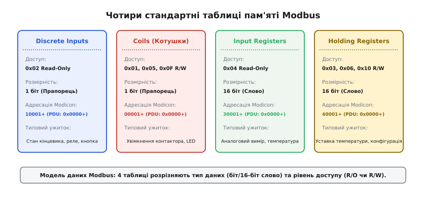
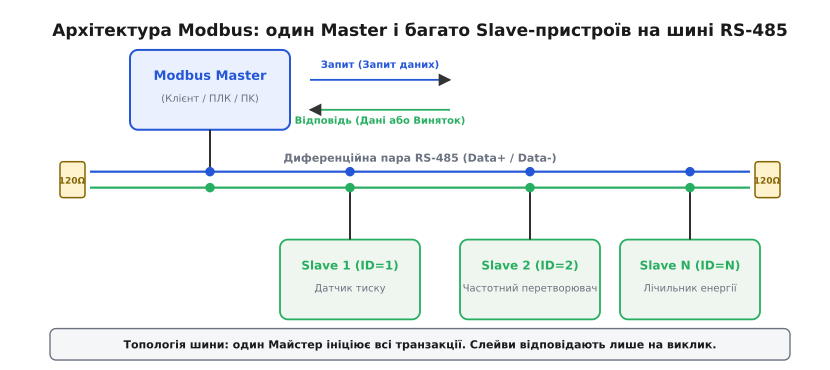
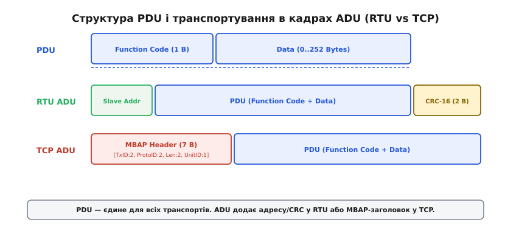
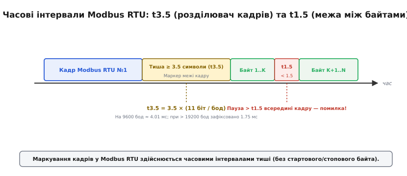
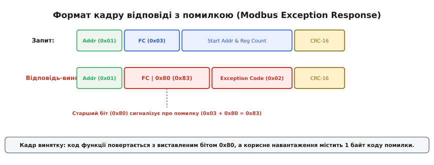

# Modbus: протокол промислової автоматизації

<preknowlist>
- [RS-485](topic:com-medium/rs-485-multidrop-bus) — диференційна шина для напівдуплексної послідовної передачі на великі відстані.
- [CRC](topic:com-modulation/crc) — алгоритм циклічного надлишкового коду для виявлення помилок у двійковому кадрі.
- [Кадр UART](topic:com-devices/uart-frame) — формат послідовного кадру: стартовий біт, 8 біт даних, паритет і стоповий біт.
</preknowlist>

Уявіть цех промислового підприємства, де на одній автоматизованій лінії працюють 50 температурних датчиків, 20 частотних перетворювачів для керування потужними електродвигунами та 10 електронних лічильників електроенергії від п'яти різних світових виробників. Центральний контролер мусить кожні 100 мілісекунд опитувати стан кожного пристрою та надсилати уставки керування по єдиному витому кабелю в умовах потужних електромагнітних завад. Якщо кожен виробник обладнання застосує власний текстовий або двійковий формат повідомлень, створення та підтримка програмного забезпечення перетворяться на технологічний хаос із сотень несумісних між собою парсерів.

Протокол Modbus вирішує цю проблему шляхом жорсткої стандартизації двох основних рівнів: внутрішньої моделі даних пристрою та формату запит-відповідь кадру. Замість обміну довільними текстовими командами чи складними об'єктами, Modbus відображає весь внутрішній стан будь-якого пристрою на чотири уніфіковані таблиці пам'яті, до яких звертаються за допомогою фіксованого набору функціональних кодів.

---

## Проблема узгодження і чотири таблиці пам'яті

У мікроконтролерах 1970-х років розбір текстових рядків на кшталт JSON чи XML вимагав би занадто багатьох обчислювальних ресурсів та обсягу оперативної пам'яті. Тому Modbus було спроєктовано навколо найпростіших двійкових структур: поодиноких бітів (прапорців) та 16-бітних цілих чисел (регістрів).

Усі дані будь-якого пристрою Modbus розділено на чотири незалежні таблиці пам'яті за двома критеріями: розрядністю (1 біт чи 16 біт) та рівнем доступу (тільки читання чи читання і запис).


*Модель даних Modbus: 4 таблиці розрізняють тип даних (біт/16-біт слово) та рівень доступу (R/O чи R/W).*

### 1. Discrete Inputs (Дискретні входи)
- **Розрядність:** 1 біт.
- **Доступ:** Тільки читання (Read-Only).
- **Призначення:** Зчитування фізичних цифрових входів пристрою, таких як стан кінцевого вимикача, датчика протікання, кнопки чи спрацьовування теплового реле.

### 2. Coils (Котушки / Дискретні виходи)
- **Розрядність:** 1 біт.
- **Доступ:** Читання та запис (Read/Write).
- **Призначення:** Керування цифровими виходами та внутрішніми прапорцями. Назва походить від релейних котушок (coils): виставлення біта в `1` подає живлення на обмотку реле, замикаючи контактор, а `0` — знеструмлює його.

### 3. Input Registers (Вхідні регістри)
- **Розрядність:** 16 біт (одне слово, значення `0..65535` або `-32768..+32767`).
- **Доступ:** Тільки читання (Read-Only).
- **Призначення:** Зчитування оцифрованих аналогових величин: поточна температура з датчика, тиск у трубопроводі, швидкість обертання вала чи виміряна напруга мережі.

### 4. Holding Registers (Регістри зберігання)
- **Розрядність:** 16 біт.
- **Доступ:** Читання та запис (Read/Write).
- **Призначення:** Зберігання уставок та конфігураційних параметрів: цільова температура термостата, верхня межа частоти обертання двигуна, мережеві налаштування або коефіцієнти PID-регулятора.

### Адресація: нотація Modicon проти PDU-зсуву

У практичній роботі з Modbus виникає систематична плутанина між двома системами адресації:
1. **Інженерна нотація Modicon (1-based):** Використовує 5-значні або 6-значні номери, де перша цифра позначає тип таблиці: `0xxxx` для Coils, `1xxxx` для Discrete Inputs, `3xxxx` для Input Registers та `4xxxx` для Holding Registers. Нумерація елементів починається з одиниці (наприклад, перший регістр зберігання позначено як `40001`).
2. **Адресація протоколу PDU (0-based):** У самих батах мережевого кадру тип таблиці визначається кодом функції, тому адреса передається як прямий 16-бітний зсув `0x0000..0xFFFF`. Отже, інженерній адресі `40001` відповідає зсув `0x0000` у кадрі, а адресі `40108` — зсув `0x006B` (`107`).

Усі 16-бітні значення в кадрі Modbus передаються у форматі **Big-Endian** (Network Byte Order): спочатку йде старший байт (MSB), потім молодший (LSB).

---

## Архітектура «Майстер–Слейв» та топологія шини

Протокол Modbus працює за суворою асиметричною топологією **«Майстер–Слейв»** (Master/Slave), яку в сучасній термінології також називають «Клієнт–Сервер» (Client/Server). 


*Топологія шини: один Майстер ініціює всі транзакції. Слейви відповідають лише на виклик.*

На фізичній шині (наприклад, [RS-485](topic:com-medium/rs-485-multidrop-bus)) може бути лише **один Майстер** і до 247 ведених пристроїв (Слейвів), кожен із яких має унікальну адресу від `1` до `247`. Адреса `0` зарезервована для широкомовних запитів.

Головні правила взаємодії:
- **Жоден Слейв не має права почати передачу самостійно.** Ведений пристрій мовчить і лише слухає шину.
- **Транзакція завжди складається з двох кроків:** Запит від Майстра → Відповідь від адресованого Слейва.
- **Виняток — широкомовні запити (Broadcast):** Майстер може надіслати запит на адресу `0`. Усі Слейви виконують команду (наприклад, запис загального часу), але **жоден пристрій не відповідає**, щоб уникнути колізій на шині.

Ця схема гарантує відсутність колізій на напівдуплексній шині RS-485 без використання складного арбітражу на кшталт CSMA/CD у Ethernet чи CSMA/CA у CAN-шинах. Детальніше про [історію створення Modicon та Modbus](topic:com-protocol/modbus/hist-modicon-1979.md) дивіться в історичній довідці.

---

## Морфологія кадру: PDU та різновиди ADU

Специфікація Modbus чітко розділяє логіку повідомлення та його транспортну обгортку:

- **PDU (Protocol Data Unit):** Логічний вміст повідомлення, який не залежить від канального та фізичного рівнів. Складається з 1 байта коду функції (Function Code) та поля даних (Data) розміром від 0 до 252 байтів. Максимальний розмір PDU становить 253 байти.
- **ADU (Application Data Unit):** Повний кадр, який передається в мережу. Включає додаткові транспортні поля (адресу пристрою, перевірку помилок або мережевий заголовок) довкола PDU.


*PDU — єдине для всіх транспортів. ADU додає адресу/CRC у RTU або MBAP-заголовок у TCP.*

Залежно від фізичного середовища існує три основні варіанти кадру ADU:

### 1. Modbus RTU (Remote Terminal Unit)
Використовується на послідовних лініях [RS-485](topic:com-medium/rs-485-multidrop-bus) та RS-232. Повідомлення передаються у чистому двійковому форматі для максимальної щільності даних.
- **Структура ADU:** `[Адреса Слейва (1 Б)] + [PDU (1..253 Б)] + [CRC-16 (2 Б)]`. Максимальний розмір кадру RTU ADU становить 256 байтів.
- **Контрольна сума:** [CRC](topic:com-modulation/crc) за поліномом `0xA001` (Modbus CRC-16), передається молодшим байтом уперед (LSB first).

### 2. Modbus ASCII
Застосовується на нестабільних послідовних лініях або під час ручного налагодження. Усі байти двійкового кадру кодуються двома ASCII-символами в шістнадцятковому вигляді (`0x3F` передається як ASCII-символи `'3'` і `'F'`).
- **Маркування:** Кадр починається з двокрапки `:` (`0x3A`) і завершується символами `CR/LF` (`0x0D 0x0A`).
- **Контрольна сума:** Поздовжній контрольний код LRC (Longitudinal Redundancy Check) розміром 1 байт.

### 3. Modbus TCP
Використовується в мережах Ethernet поверх протоколу TCP (стандартний порт `502`). Оскільки TCP гарантує цілісність доставки та розбиття на кадри, поля CRC-16 та інтервали тиші вилучено. Натомість PDU обгортається в 7-байтний заголовок **MBAP** (Modbus Application Protocol Header):
- **Transaction ID (2 байти):** Ідентифікатор транзакції для зіставлення запиту та відповіді при асинхронних викликах.
- **Protocol ID (2 байти):** Завжди дорівнює `0x0000` (ідентифікатор Modbus).
- **Length (2 байти):** Довжина наступних байтів кадру (включаючи Unit ID та PDU).
- **Unit ID (1 байт):** Адреса Слейва, необхідна для шлюзування TCP → RS-485.

---

## Таймінги RTU та фізичний рівень

Оскільки Modbus RTU є двійковим протоколом без спеціальних стартових чи стопових байтів (на відміну від Modbus ASCII чи SLIP), постає питання: як приймач визначає початок і кінець кадру?

Рішенням Modbus є **часове маркування інтервалами тиші** (Silent Interval Framing).


*Маркування кадрів у Modbus RTU здійснюється часовими інтервалами тиші (без стартового/стопового байта).*

### Правило `t3.5` (Міжкадровий інтервал)
Кадр Modbus RTU вважається завершеним, якщо на шині спостерігається тиша (відсутність передачі нових бітів) протягом часу, необхідного для передачі не менше ніж **3.5 символів** (`t3.5`).

Оскільки стандартний [кадр UART](topic:com-devices/uart-frame) складається з 11 бітів (1 стартовий біт + 8 бітів даних + 1 біт паритету + 1 стоповий біт), час `t3.5` обчислюється як:

```
t3.5 = (3.5 × 11 біт) / Швидкість_бод
```

На швидкості **9600 бод** один біт триває `1 / 9600 ≈ 104.17 мкс`, один символ (11 бітів) — `1.146 мс`, а інтервал `t3.5` становить:

```
t3.5 = 3.5 × 1.146 мс ≈ 4.01 мс
```

Якщо приймач виявляє паузу понад 4.01 мс після чергового байта, він вважає кадр повністю отриманим і передає його на перевірку [CRC](topic:com-modulation/crc).

Для високих швидкостей (понад 19200 бод) специфікація зафіксувала константні значення: `t3.5 = 1.75 мс`, а `t1.5 = 750 мкс`, оскільки обробка занадто коротких таймерів створює надмірне навантаження на переривання мікроконтролера.

### Правило `t1.5` (Внутрішньокадровий інтервал)
Пауза між окремими байтами **всередині одного кадру** не повинна перевищувати **1.5 символи** (`t1.5`). Якщо інтервал між байтами перевищує `t1.5`, але менший за `t3.5`, кадр вважається пошкодженим (відбувся розрив передачі), і приймач мусить відкинути накопичені байти.

### Фізичний рівень RS-485 та керування напрямком
На фізичному рівні шина [RS-485](topic:com-medium/rs-485-multidrop-bus) є дифпарою двох дротів (`Data+` / `A` та `Data-` / `B`) з термінальними резисторами `120 Ом` на обидвох кінцях лінії. Мікроконтролер керує трансивером RS-485 через сигнал DE/RE (Data Enable / Receiver Enable).

Послідовність керування при передачі кадру:
1. Виставити `DE = 1` (перевести трансивер у режим передавача).
2. Зачекати час стабілізації лінії (підтяжка підтягуючих резисторів).
3. Передати всі байти кадру через UART.
4. Зачекати прапорець `TC` (Transmission Complete) у регістрі статусу UART, який сигналізує про вихід останнього стопового байта зі зсувного регістра у фізичну лінію.
5. Скинути `DE = 0` (повернути трансивер у режим прийому).

Помилка в реалізації (наприклад, скидання `DE` по перериванню "регістр даних порожній" `TXE` замість `TC`) зрізає останній стоповий біт кадру або останній байт CRC-16, що робить весь кадр недійсним для приймача.

Ознайомитися з прикладом коду для перевірки та обробки кадрів ви можете в матеріалі про [реалізацію парсера RTU-кадрів та обчислення CRC-16](topic:com-protocol/modbus/proj-modbus-rtu-parser.md).

---

## Команди та відповіді: механізм транзакцій

Обмін даними відбувається за допомогою фіксованого набору функціональних кодів. Переглянути повний [довідник функціональних кодів і форматів кадрів](topic:com-protocol/modbus/api-modbus-functions.md) можна в описі API.

Розглянемо найпоширеніші транзакції: читання та запис регістрів і бітових прапорців.

### Читання регістрів зберігання (Function Code `0x03`)

Майстер хоче прочитати 2 регістри зберігання, починаючи з адреси `40108` (PDU зсув `0x006B`), у Слейва з адресою `1`.

**1. Запит Майстра (8 байтів RTU ADU):**
```
01 03 00 6B 00 02 B5 D9
│  │  └───┘ └───┘ └───┘
│  │    │     │     └─ CRC-16 (Modbus: 0xD9B5)
│  │    │     └─ Кількість регістрів (2)
│  │    └─ Початкова адреса PDU (107 = 0x006B)
│  └─ Код функції (0x03 — Read Holding Registers)
└─ Адреса Слейва (1)
```

**2. Нормальна відповідь Слейва (9 байтів RTU ADU):**
Слейв повертає значення першого регістра `0x0258` (600) та другого регістра `0x0064` (100):
```
01 03 04 02 58 00 64 FA 32
│  │  │  └───┘ └───┘ └───┘
│  │  │    │     │     └─ CRC-16
│  │  │    │     └─ Значення другого регістра (100)
│  │  │    └─ Значення першого регістра (600)
│  │  └─ Кількість байтів даних далі (4 байти = 2 * 2 регістри)
│  └─ Код функції (0x03)
└─ Адреса Слейва (1)
```

### Запис одного дискретного виходу (Function Code `0x05`)

Команда `0x05` записує стан одного прапорця (Coil). Для увімкнення (`1`) у поле значення передається константа `0xFF00`, для вимкнення (`0`) — `0x0000`. Будь-які інші значення є неприпустимими.

**1. Запит Майстра (Запис Coil `00173`, PDU зсув `0x00AC` у стан ON):**
```
01 05 00 AC FF 00 4C 3B
│  │  └───┘ └───┘ └───┘
│  │    │     │     └─ CRC-16
│  │    │     └─ Значення ON (0xFF00)
│  │    └─ PDU адреса прапорця (172 = 0x00AC)
│  └─ Код функції (0x05 — Write Single Coil)
└─ Адреса Слейва (1)
```

**2. Відповідь Слейва:**
У разі успішного запису Слейв повертає точну копію кадру запиту (ехо).

### Запис групи прапорців (Function Code `0x0F`)

Команда `0x0F` (Write Multiple Coils) дозволяє атомарно виставити стан блоку до 1968 прапорців. Біти пакуються в байти щільно: найменший індекс прапорця лягає в молодший біт (Bit 0) першого байта даних. Якщо кількість прапорців не кратна 8, найстарші біти останнього байта доповнюються нулями.

---

## Обробка помилок та винятки

Якщо кадри передаються з пошкодженням бітів на лінії, приймач обчислює [CRC](topic:com-modulation/crc) і при розходженні просто **мовчки відкидає кадр**. Майстер чекає відповіді протягом заданого таймауту (наприклад, 100–500 мс) і після його вичерпання фіксує помилку зв'язку.

Проте якщо кадр фізично цілісний (CRC збіглася), але Слейв не може виконати команду (наприклад, Майстер запросив читання 200 регістрів, а в Слейві доступно лише 50), Слейв повертає **кадр винятку (Exception Response)**.


*Кадр винятку: код функції повертається з виставленим бітом 0x80, а корисне навантаження містить 1 байт коду помилки.*

У кадрі винятку:
1. **Код функції видозмінюється:** До нього додається маска `0x80` (встановлюється найстарший біт). Наприклад, для коду `0x03` повертається `0x03 | 0x80 = 0x83`.
2. **Замість даних повертається 1 байт коду винятку:**
   - `0x01` (Illegal Function): Код функції не підтримується Слейвом.
   - `0x02` (Illegal Data Address): Запитана адреса регістра не існує в даному пристрої.
   - `0x03` (Illegal Data Value): Передане значення параметра є неприпустимим (наприклад, кількість регістрів дорівнює 0).
   - `0x04` (Server Device Failure): Внутрішня збійна помилка пристрою під час виконання команди.

---

## Шлюзування Modbus TCP ↔ Modbus RTU

У сучасних автоматизованих системах центральний сервер SCADA взаємодіє через високоефективну мережу Ethernet по протоколу Modbus TCP, але на рівні обладнання датчики та виконавчі приводи підключені до послідовної шині RS-485 Modbus RTU.

Для зв'язування двох середовищ використовуються **мережеві шлюзи (Modbus Gateways)**.

Схема конвертації шлюзом:
1. Шлюз приймає кадри Modbus TCP на порт `502`.
2. Вилучає 7-байтний заголовок MBAP.
3. Зчитує поле `Unit ID` з заголовка MBAP і підставляє його як адресний байт `Slave Address` у кадр RTU.
4. Обчислює контрольною суму [CRC](topic:com-modulation/crc) над PDU і формує двійковий кадр Modbus RTU.
5. Відправляє RTU-кадр у шину RS-485 і очікує відповіді з урахуванням часу `t3.5`.
6. Отримавши відповідь RTU, шлюз перевіряє CRC-16, відкидає адресний байт і контрольною суму, додає заголовок MBAP із тим самим `Transaction ID` та повертає Modbus TCP відповідь клієнту.

---

## Інженерні пастки та реальний світ

Попри уявну простоту специфікації, під час реальної інтеграції Modbus-пристроїв інженери зіштовхуються з чотирма систематичними проблемами:

### 1. Передача 32-бітних чисел та Float (Проблема Endianness)
Специфікація Modbus визначає лише 16-бітні регістри. Для передачі 32-бітних цілих чисел чи чисел із плаваючою крапкою стандарта IEEE 754 (Float) використовують два сусідні регістри. Проте стандарт Modbus **не регламентував порядок слів** (word order).

У результаті на ринку виникло 4 несумісні варіанти упакування 32-бітного Float значення (байти A, B, C, D):
- **Big-Endian (ABCD):** Стандартний порядок (Motorola format).
- **Little-Endian (DCBA):** Повністю зворотний порядок (Intel format).
- **Big-Endian swap (CDAB):** Порядок Mid-Big (Modicon word swap) — найбільш поширений у ПЛК.
- **Little-Endian swap (BADC):** Порядок Mid-Little.

Зчитавши з датчика значення `0x42C8 0x0000` (Float 100.0), залежно від налаштувань байт-ордера в SCADA-системі ви можете отримати або `100.0`, або `0.0`, або неприпустиме число `NaN`.

### 2. Плутанина зі зсувом адреси (1-based vs 0-based)
Деякі виробники описують у паспортах пристроїв адреси у форматі PDU зсуву (`0..65535`), а інші — у форматі Modicon (`40001..46536`). Якщо софт надсилає запит на інженерную адресу `40001` без віднімання одиниці, контролер зчитує регістр `40002` (PDU зсув `1`), що призводить до зсуву всіх зчитаних даних на один регістр.

### 3. Діагностика фізичного рівня RS-485
Більше ніж 80% збоїв у мережах Modbus RTU виникають не на програмному, а на фізичному рівні:
- **Переплутані двори A і B:** Передача неможлива, диференційна напруга стає інвертованою.
- **Відсутність термінаторів 120 Ом:** На довгих лініях (> 100 м) виникає відбиття імпульсів від відкритих кінців кабелю, що спотворює сигнали UART.
- **Відсутність зсувних резисторів (Fail-Safe Biasing):** Коли всі пристрої мовчать, шина перебуває в високоімпедансному стані Z. Електромагнітні завади наводять хибні стартові біти у приймачі UART. Додавання резисторів підтяжки (Pull-Up на A, Pull-Down на B) фіксує стан тиші.

### 4. Пропускна здатність та пропитування (Polling Bottleneck)
Оскільки шина [RS-485](topic:com-medium/rs-485-multidrop-bus) працює в напівдуплексному режимі за схемою «запит–відповідь», пропускна здатність обмежена швидкістю опитування. Якщо на 9600 бод Майстер опитує 30 пристроїв по черзі, середня частота оновлення даних для одного пристрою може впасти до 1–2 секунд. Для прискорення обміну інженери групують регістри у безперервні блоки, читаючи їх однією командою `0x03` (до 125 регістрів за один запит), замість десятків поодиноких запитів.

> 🔧 **Навіщо це.**
> Знання специфікації Modbus критично необхідне для розробників вбудованих систем (Embedded C/C++), програмістів ПЛК, розробників SCADA-систем та інженерів із промислової автоматизації (IoT/IIoT). Розуміння різниці між RTU та TCP, таймінгів `t3.5`, правильного вибору байт-ордера Float-чисел та правил адресації дозволяє швидко налагоджувати зв'язок між контролерами, частотниками, терморегуляторами та промисловими серверами за допомогою утиліт на кшталт `modpoll` або `Wireshark`.
