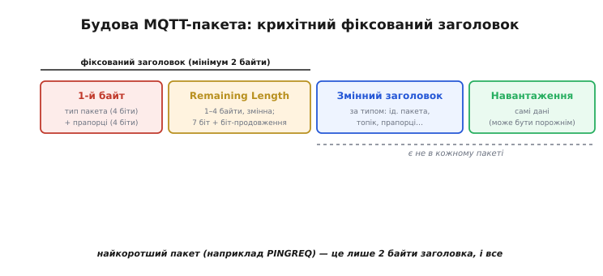
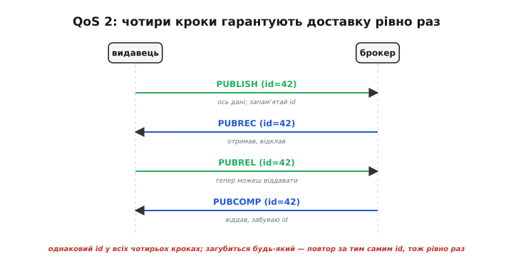
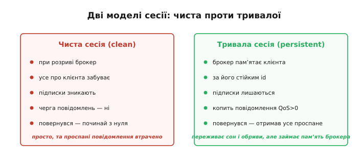
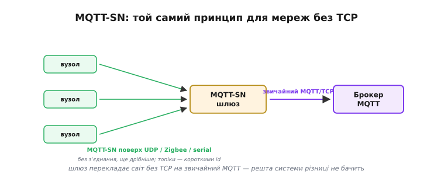

# MQTT: детально

<preknowlist>
- [TCP-з'єднання](root:sf-os/sockets-tcp-udp) — надійний упорядкований потік байтів між двома вузлами; MQTT увесь час тримає одне таке з'єднання до брокера.
</preknowlist>

Базова картина MQTT проста: пристрої не говорять напряму, а лише через [брокера](root:com-protocol/mqtt), обмінюючись повідомленнями за назвою змісту — топіком. Та щойно береш MQTT у справжню систему, простота розкривається на другий шар. Чому заголовок такий крихітний і як він улаштований до біта? Що насправді відбувається в проводах при QoS 2, що дає обіцяне «рівно раз»? Що брокер пам'ятає про клієнта між його під'єднаннями, і чому це міняє поведінку retain і заповіту? Як той самий принцип працює на вузлах, у яких немає навіть TCP? І як усе це захистити, бо голий MQTT шле все відкритим текстом? Розберімо ці шари по черзі — кожен з них або рятує від реальної пастки, або відмикає клас задач, недосяжний для базового рівня.

### Будова пакета: де ховаються ті два байти

Уся ощадність MQTT починається з формату пакета (тут його звуть **контрольним пакетом**, англ. *control packet*). Пакет складається з трьох частин, і лише перша обов'язкова: **фіксований заголовок**, далі — необов'язковий **змінний заголовок** (англ. *variable header*) і необов'язкове **навантаження** (англ. *payload*, «корисний вантаж»).

*Пакет MQTT по шарах. Перший байт — тип пакета (старші 4 біти) і прапорці (молодші 4 біти). Далі поле Remaining Length зі змінною довжиною. Разом це фіксований заголовок — мінімум 2 байти. За ним, якщо потрібні, ідуть змінний заголовок (ідентифікатор пакета, топік тощо) і навантаження (самі дані). Найкоротший пакет — це лише ті 2 байти, і все.*

Перший байт фіксованого заголовка ділиться навпіл. **Старші чотири біти** — це **тип пакета**: яке саме це повідомлення. Типів усього чотирнадцять, і їх легко згрупувати за роллю: з'єднання (`CONNECT`, `CONNACK`, `DISCONNECT`), публікація (`PUBLISH` і його підтвердження), підписка (`SUBSCRIBE`, `SUBACK`, `UNSUBSCRIBE`, `UNSUBACK`) і службові пінги (`PINGREQ`, `PINGRESP`). **Молодші чотири біти** — прапорці; для більшості типів вони фіксовані, але для `PUBLISH` саме тут живуть три знайомі речі: рівень QoS (два біти), прапорець retain і прапорець DUP (англ. *duplicate*, «дублікат» — ознака того, що це повторне надсилання, а не нове).

Другу частину фіксованого заголовка — **Remaining Length** («скільки байтів лишилося в пакеті після цього поля») — зроблено хитро, і саме в ній ключ до ощадності. Її довжина **змінна**: від одного до чотирьох байтів. У кожному байті корисні лише **сім молодших бітів**, а **восьмий — біт-продовження** (англ. *continuation bit*): якщо він піднятий, далі йде ще один байт довжини; якщо опущений — поле скінчилося. Тож короткі пакети (а їх — переважна більшість: показання, команди) витрачають на довжину **один-єдиний байт**, поки тіло вкладається в 127 байтів. Якщо тіло довше — береться другий байт (до 16 383), і так далі до чотирьох байтів, що дають стелю аж 268 435 455 байтів (≈ 256 МБ). Виходить рідкісно вдалий компроміс: дрібному пакетові — крихітний заголовок, а великий усе одно вміститься. Саме тому найтиповіший службовий пакет, `PINGREQ`, — це буквально **два байти**: тип у першому й нуль довжини в другому.

> 🔧 **Навіщо це.** Знати про змінну довжину варто, коли сам читаєш MQTT-потік із сокета (наприклад, пишеш міст чи аналізуєш трафік). Не можна прочитати «фіксовані N байтів заголовка» — треба читати поле Remaining Length **байт за байтом**, доки не трапиться байт з опущеним бітом продовження, і лише тоді знати, скільки ще тіла дочитувати. Хто цього не врахував, той або обрізає довгі пакети, або зависає, чекаючи на байти, яких не буде. Готова бібліотека робить це за тебе — але якщо ліземо нижче за неї, ця механіка стає твоєю.

### Ідентифікатор пакета: нитка, що зшиває запит і підтвердження

Перш ніж розбирати QoS, треба побачити одну дрібну, але наскрізну деталь — **ідентифікатор пакета** (англ. *packet identifier*). Це двобайтове число у змінному заголовку, яким MQTT **пов'язує підтвердження з тим, що воно підтверджує**. Коли видавець шле `PUBLISH` із QoS 1 або 2, він кладе туди ідентифікатор; коли брокер відповідає `PUBACK` (для QoS 1) чи цілою низкою підтверджень (для QoS 2), він повторює **той самий** ідентифікатор. Так обидві сторони розуміють, до якого саме повідомлення стосується це підтвердження, навіть якщо в польоті їх багато водночас. Ідентифікатор несуть саме ті пакети, де є що підтверджувати: `PUBLISH` (за QoS > 0), `PUBACK`, `PUBREC`, `PUBREL`, `PUBCOMP`, `SUBSCRIBE`, `SUBACK`, `UNSUBSCRIBE`, `UNSUBACK`. У QoS 0 ідентифікатора немає — там нема чого зшивати, бо нема підтверджень.

### QoS зблизька: три рівні як три різні розмови

Базово QoS — це «скільки гарантій доставки». Тепер розгляньмо, що саме відбувається в проводах, бо різниця між рівнями — це різниця в **кількості проходів** і в тому, **хто що пам'ятає**.

**QoS 0** — одна стрілка й тиша. Видавець шле `PUBLISH`, брокер нічого не відповідає, ніхто нічого не зберігає. Якщо пакет загубився — його нема, і це нормальний результат, а не помилка. Найдешевше, що буває.

**QoS 1** — стрілка й відповідь. Видавець шле `PUBLISH` з ідентифікатором і **тримає копію** повідомлення, доки не отримає `PUBACK` із тим самим ідентифікатором. Прийшов `PUBACK` — копію викидають, справу закрито. Не прийшов за розумний час — видавець шле `PUBLISH` **ще раз**, тепер уже з піднятим прапорцем DUP («це повтор»). Звідси й береться характерна риса QoS 1 — **можливий дублікат**: якщо саме повідомлення дійшло, а загубилося підтвердження, повтор приведе до другого примірника на приймачі. Тому приймач за QoS 1 має бути готовий побачити те саме повідомлення двічі.

**QoS 2** — чотири кроки, два «коліна». Це єдиний рівень, що дає **рівно раз**, і ціна тому — найдовший обмін.

*QoS 2 крок за кроком. Видавець шле PUBLISH з ідентифікатором (тут 42). Брокер відповідає PUBREC («отримав, відклав») — і саме тут він запам'ятовує ідентифікатор, щоб упізнати повтор. Видавець відповідає PUBREL («тепер віддавай»), і лише по ньому брокер пускає повідомлення підписникам та шле PUBCOMP («готово»). Один ідентифікатор проходить крізь усі чотири кроки; загубиться будь-який — повтор за тим самим ідентифікатором, тож задвоєння неможливе.*

Чому аж чотири кроки? Бо «рівно раз» вимагає, щоб **обидві** сторони були певні, перш ніж повідомлення вважати доставленим, і щоб повтор будь-якого кроку не призводив до подвоєння. `PUBREC` (англ. *publish received*, «публікацію отримано») каже видавцеві: «я взяв, можеш не повторювати PUBLISH». `PUBREL` (англ. *publish release*, «звільнення публікації») каже брокерові: «я знаю, що ти взяв, тепер можеш віддати її далі». `PUBCOMP` (англ. *publish complete*, «публікацію завершено») закриває справу. Хитрість у тому, що брокер запам'ятовує ідентифікатор на кроці `PUBREC` і тримає його, доки не прийде `PUBREL`: якщо `PUBLISH` випадково прийде ще раз (бо видавець не дочекався `PUBREC`), брокер упізнає вже відомий ідентифікатор і **не пустить дублікат** далі, лише повторить `PUBREC`. Так чотири кроки разом дають властивість, недосяжну коротшим обміном: повідомлення доходить **і не двоїться**, хай би який крок довелося повторювати.

### Сесії: що брокер пам'ятає між під'єднаннями

Дотепер ми мовчки припускали, що клієнт під'єднався — і висить на зв'язку. Та реальний пристрій засинає, втрачає радіо, перезавантажується. Що стається з його підписками й з повідомленнями, які надійшли, поки його не було? Відповідь залежить від **сесії** (англ. *session*) — стану, який брокер веде про клієнта. І тут є розвилка, яку треба розуміти, бо вона тихо визначає половину поведінки системи.

Кожен клієнт має **ідентифікатор клієнта** (англ. *client identifier*) — рядок-ім'я, за яким брокер його впізнає. Під'єднуючись, клієнт каже, якої сесії він хоче: **чистої** чи **тривалої**.

*Дві моделі пам'яті брокера про клієнта. Чиста сесія: при розриві брокер забуває про клієнта все — підписки зникають, повернувся він мусить заново. Просто, але все, що надійшло уві сні, втрачено. Тривала сесія: брокер пам'ятає клієнта за стійким ідентифікатором — тримає його підписки й копить для нього повідомлення QoS>0, доки той повернеться. Переживає сон і обриви, але займає пам'ять брокера.*

**Чиста сесія** (англ. *clean session*; у MQTT 5 цю ідею уточнили парою «clean start» + час життя сесії, та суть та сама) — брокер при розриві **викидає весь стан** клієнта. Повернувшись, той починає з чистого аркуша: підписки треба оформити заново, а все, що приходило за час відсутності, для нього пропало. Це простий і легкий режим — добрий для клієнта, якому важливі лише **свіжі** дані тут і зараз.

**Тривала (стійка) сесія** (англ. *persistent session*) — брокер **тримає стан** клієнта навіть коли той відпав: пам'ятає його підписки й, головне, **копить для нього повідомлення QoS 1 і 2**, що надійшли на його топіки за час відсутності. Щойно клієнт повернеться під тим самим ідентифікатором — брокер віддасть йому всю накопичену чергу, ніби він і не зникав. Це безцінно для пристрою, який мусить **нічого не проспати**: лічильник подій, журнал команд, критична телеметрія. Ціна — пам'ять брокера: він мусить десь зберігати ту чергу, тож нескінченно копити для давно зниклого клієнта не можна (звідси й час життя сесії в MQTT 5).

> 🔧 **Навіщо це.** Вибір сесії — це тихе, але доленосне рішення. Поставив чисту сесію давачеві, що шле телеметрію на QoS 0, — і добре: проспані відліки однаково застаріли б. Але поставив чисту сесію вузлові, який мусить отримати **кожну** команду, — і команди, надіслані під час його сну чи перезавантаження, зникнуть назавжди, а ти годинами шукатимеш, «чому інколи команда не доходить». Тут лікує тривала сесія зі стійким ідентифікатором клієнта. Правило просте: важливі лише свіжі дані — чиста; не можна нічого втратити — тривала.

### Retain і LWT зблизька: дрібні правила, що кусаються

Базово retain зберігає останнє значення для нових підписників, а заповіт оголошує раптову смерть. Зблизька в обох є тонкощі, на яких легко спіткнутися.

**Retain — як його стерти.** Оскільки брокер тримає **одне** retained-повідомлення на топік, постає питання: а як його прибрати, коли значення більше не актуальне (пристрій зняли, стан застарів)? Домовленість така: публікація з прапорцем retain і **порожнім** тілом **видаляє** збережене значення топіка. Це зветься «порожнє retained-повідомлення», і саме ним чистять дошку — інакше старе значення висітиме вічно й вводитиме в оману кожного нового підписника. Друга тонкість: retained-повідомлення зберігає свій QoS, але новому підписникові воно віддається з тим QoS, який **менший** з двох — заданого в підписці й того, з яким повідомлення було опубліковано.

**LWT — це теж звичайне повідомлення.** «Остання воля» має ті самі поля, що й будь-яка публікація: топік, тіло, QoS і прапорець retain. І це відмикає дуже корисний прийом: заповіт із **піднятим retain**. Тоді, коли пристрій раптово відпаде, брокер опублікує «offline» **і збереже** його як retained на топіку статусу. Будь-яка панель, що підключиться **потім**, одразу побачить «offline» — навіть якщо пристрій помер ще до її приходу. А «парний» прийом — щоб статус був повним — це публікувати «online» (теж retained) самому, одразу по під'єднанні. Виходить охайна «лампочка присутності»: топік статусу завжди тримає актуальне «online»/«offline», і його видно кожному, хто гляне, будь-якої миті.

### Keepalive у числах: як рахується «клієнт мовчить»

Базово keepalive — це обіцянка «озиватися бодай раз на інтервал». Числово домовленість точніша. Клієнт називає інтервал keepalive у секундах (нерідко 30–60). Це **верхня межа** тиші з боку клієнта: якщо реальних даних нема, він мусить устигнути надіслати `PINGREQ` (на який брокер відповість `PINGRESP`) до того, як інтервал спливе. З боку брокера правило таке: якщо від клієнта не надійшло **нічого** — ні даних, ні пінгу — довше, ніж **півтора** інтервали keepalive, брокер має право вважати клієнта відпалим, розірвати з'єднання й (якщо була «воля») опублікувати його заповіт.

Звідси практичний компроміс при виборі інтервалу. Короткий keepalive (скажімо, 10 с) швидко виявляє «мертвого» клієнта — добре для оперативності, та частіші пінги трохи з'їдають батарею й ефір. Довгий keepalive (кілька хвилин) економить енергію сплячого пристрою, але «смерть» помічається аж за хвилини. Тож інтервал підбирають під природу пристрою: жвавому виконавцеві команд — коротший, рідкісному давачеві на батарейці — довший.

### MQTT-SN: той самий принцип там, де немає TCP

Усе дотепер спиралося на TCP-з'єднання до брокера. Та є цілий світ вузлів, у яких TCP немає й бути не може: крихітні радіо-датчики на батарейці, що живуть у мережах на кшталт Zigbee, або вузли, які спілкуються голими UDP-датаграмами чи навіть послідовним портом. Для них створили окремий, споріднений протокол — **MQTT-SN** (англ. *MQTT for Sensor Networks*, «MQTT для сенсорних мереж»). Це не сам MQTT, а його «худіший родич» з тією самою філософією публікація/підписка, пристосований до мереж **без TCP**.

*Як MQTT-SN вписується в звичну систему. Крихітні вузли говорять MQTT-SN поверх того, що мають — UDP, Zigbee, послідовного зв'язку, — без жодного TCP-з'єднання. Усе це сходиться на MQTT-SN-шлюзі, а він перекладає обмін на звичайний MQTT поверх TCP і веде його зі справжнім брокером. Решта системи бачить лише звичайні MQTT-топіки й навіть не здогадується, що на іншому кінці — світ без TCP.*

Що в ньому інакше й чому. По-перше, **немає постійного TCP-з'єднання** — обмін іде окремими датаграмами, що природно для радіо-вузла, який майже весь час спить. По-друге, **топіки замінюють короткими числовими ідентифікаторами**: довгий рядок `home/garden/soil/moisture` у кожному пакеті був би розкішшю для вузла, що економить кожен біт, тож вузол один раз реєструє топік і далі шле лише його двобайтовий номер. По-третє, додано речі під сон: вузол може сказати шлюзові «я засинаю», і той **притримає** його повідомлення до пробудження. А зв'язує цей світ зі звичайним MQTT окремий **MQTT-SN-шлюз** (англ. *gateway*, «шлюз»): він приймає MQTT-SN від вузлів і веде від їхнього імені звичайний MQTT із брокером. Для брокера й решти системи це виглядає як цілком звичайні клієнти — уся «незвичність» схована у шлюзі.

### Безпека: голий MQTT беззахисний

Лишається те, що в базовій картині лише згадано, а в реальній системі обов'язкове. **Сам по собі MQTT не шифрує нічого**: топіки, тіла повідомлень, ім'я й пароль при під'єднанні — усе летить **відкритим текстом**. Хто слухає мережу між клієнтом і брокером, бачить усе наскрізь, а за бажання й сам під'єднається до брокера й почне публікувати фальшиві команди. Тому захист MQTT будують у три шари, і вони доповнюють один одного.

**Шифрування каналу — TLS.** Так само, як HTTPS — це HTTP усередині захищеного з'єднання, безпечний MQTT — це MQTT усередині **TLS** (англ. *Transport Layer Security*, «захист транспортного рівня»; той самий механізм, що замикає замочок у браузері). TLS робить дві речі одразу: **шифрує** весь обмін (підслуховувач бачить лише шум) і дає клієнтові **впевнитися, що брокер справжній**, а не підставлений. Ціна — TLS помітно важчий: він з'їдає пам'ять і час процесора на кожне з'єднання, що на дрібному чипі відчутно, тож на дуже слабких вузлах інколи покладаються на захищеність самої мережі або на MQTT-SN із шлюзом усередині довіреної зони.

**Хто ти — автентифікація.** Брокер не має пускати кого завгодно. Найпростіше — клієнт при під'єднанні надсилає **ім'я й пароль** (`CONNECT` має для них поля), а брокер звіряє їх зі своїм списком. Надійніше — **сертифікати клієнта** поверх TLS: тоді не лише клієнт перевіряє брокера, а й брокер перевіряє клієнта за його сертифікатом, без жодних паролів у проводах. Без бодай якоїсь автентифікації відкритий брокер — це запрошення публікувати в твої топіки будь-кому з мережі.

**Що тобі можна — авторизація.** Навіть впущеному клієнтові не варто дозволяти все. Брокери вміють **обмежувати доступ за топіками** (англ. *access control list*, «список керування доступом»): цьому давачеві — лише публікувати у свою гілку `home/room/#`, цій панелі — лише читати, а команди в `home/+/cmd` слати дозволено тільки довіреному вузлові. Так навіть викрадений пароль одного давача не дасть зловмисникові керувати всім будинком.

> 🔧 **Навіщо це.** Спокуса «спочатку зробимо, щоб працювало, а безпеку додамо потім» з MQTT особливо небезпечна: відкритий брокер у мережі — це не теоретичний ризик, а пристрій, яким може керувати будь-хто поруч. Мінімум для будь-якої реальної системи — TLS плюс ім'я й пароль; для важливого — ще й сертифікати та обмеження за топіками. На щастя, для клієнта це здебільшого питання конфігурації (увімкнути TLS, дати сертифікат брокера, задати логін), а не переписування логіки — тож закласти захист від початку коштує дешево, а доробляти його на вже розгорнутій системі болісно.

### Куди це виросло: MQTT 5

Усе дотепер описувало MQTT версії 3.1.1 — ту, на якій виросла більшість систем. Версія 5.0 (2019 рік) повела ту саму ощадливу думку далі, і її новинки не випадкові, а прямі продовження вже знайомих механізмів.

Найяскравіше — **псевдоніми топіків** (англ. *topic alias*, «замінник теми»). Довгий рядок топіка `home/garden/soil/moisture` доводилося слати в кожному пакеті — і саме він лишався єдиним по-справжньому «важким» місцем на тлі решти дрібного заголовка. MQTT 5 дозволяє надіслати повний топік лише раз, разом із коротким числом-псевдонімом, а далі слати саме число — рівно той трюк, яким MQTT-SN рятував вузли без TCP, тепер узаконений у самому протоколі.

Друга лінія — зробити явним те, що в 3.1.1 лишалося на здогад. **Час життя сесії** (англ. *session expiry interval*, «інтервал згасання сесії») перетворює розмите «тривала сесія» на точне число секунд, по яких брокер має право забути відпалого клієнта. А **коди причин** (англ. *reason code*, «код причини») у підтвердженнях кажуть не лише «прийнято», а й *чому* відхилено: у 3.1.1 брокер міг хіба мовчки розірвати з'єднання, і причину доводилося вгадувати.

Є й цілком нове. **Автентифікація окремим пакетом** — той самий AUTH, п'ятнадцятий тип, якого в 3.1.1 бракувало, — відмикає складніші, багатокрокові схеми входу. **Користувацькі властивості** (англ. *user properties*, «властивості користувача») додають до повідомлення довільні пари «ключ-значення», куди нарешті можна класти метадані, не запихаючи їх у топік чи тіло. А **спільні підписки** (англ. *shared subscription*, «спільна підписка») міняють саме правило розсилки: потік з одного топіка брокер розподіляє **між** членами групи підписників, а не шле копію кожному, — так навантаження ділиться на кількох рівних споживачів.

Прикметно, що жодна з цих новинок не чіпає стрижень: брокер посередині, топіки замість адрес, три рівні QoS, retain і заповіт лишилися ті самі. MQTT 5 не переписав ідею — лише доточив її там, де практика тисяч розгортань намацала гострі кути. Тому й корисно тримати в голові обидві версії: 3.1.1 показує кістяк думки в найчистішому вигляді, а 5.0 — куди він доростає, коли легкий протокол беруть у справді великі системи.

---
