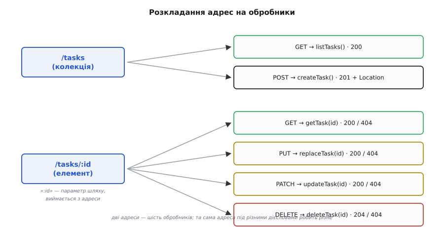
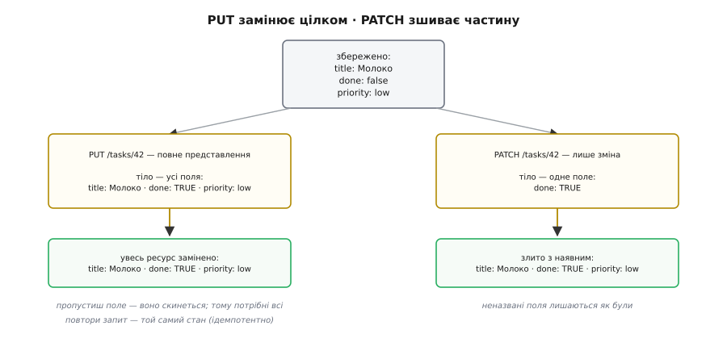

# ⚙️ Дизайн маленького REST-API: від ресурсу до обробника

Принципи легко тримати в голові: назви іменники, дій над ними жменею дієслів HTTP, не пам'ятай клієнта між запитами. Та коли сідаєш писати сервер, принципи мовчать про сотню дрібниць. Яку адресу дати задачі й де в ній межа? Що саме перевірити у вхідному тілі й **до** якого рядка коду? Який код стану віддати, коли задачі немає, а який — коли її створено? Чим `PUT` відрізняється від `PATCH` не на словах, а в тілі обробника? Що зробити, аби подвійний тап на «створити» не породив дві задачі?

Візьмімо один ресурс — **задачі** (речі зі списку справ) — і доведімо його від адреси до робочого обробника у двох стеках: TypeScript на Fastify і Python на FastAPI. Мета не в тому, щоб «якось працювало»: мета — щоб **кожна відповідь несла правильний код**, **невалідний ввід гинув на порозі, не торкнувшись логіки**, **обробник не мав жодної серверної сесії**, а `PUT`, `PATCH` і `POST` поводилися рівно так, як обіцяє їхній контракт. Дизайн — це послідовність невеликих рішень у цьому напрямку; розберімо їх по черзі.

### Ресурс і його форма: одна модель, три тіла

Перше рішення — що таке задача як **представлення**, тобто той JSON, що їде дротом. Внутрішній запис у базі й представлення — різні речі: представлення це навмисна **проєкція** внутрішнього стану, а не його дзеркало. Плутати їх — класична пастка (повернеш клієнтові сирий рядок таблиці — і одного дня протече `owner_id` чи `password_hash`, а формат відповіді намертво зростеться зі схемою БД). Тому форму представлення визначаємо окремо й свідомо.

Задача — це чотири поля:

```
id        число, яке призначає СЕРВЕР (клієнт його не задає)
title     рядок, обов'язковий, не порожній
done      булеве, чи виконано
priority  одне з: low | normal | high
```

Тонкість, яку легко проґавити: `id` **належить серверу**. Клієнт не має права його диктувати — інакше двоє клієнтів заявлять `id: 1` і затруть одне одного. Тож вхідне тіло на створення — це задача **без** `id`. І тут спливає причина, чому одного типу мало: тіло **на створення**, тіло **на повну заміну** й тіло **на часткову зміну** — це три різні контракти. На створення `id` заборонений, а `done` і `priority` можна пропустити (візьмуться усталені). На повну заміну (`PUT`) треба **всі** поля, бо заміна тотальна. На часткову зміну (`PATCH`) — будь-яка непорожня підмножина. Одна доменна модель, три форми вводу.

Це і є [DTO — окреме тіло для дроту, відв'язане від внутрішнього запису](topic:sf-apps/dto): об'єкт-перенесення, чия єдина робота — перетнути межу системи в стійкій формі. Проєкція в обидва боки (ввід валідуємо в модель, модель серіалізуємо в JSON) — і внутрішній запис можна міняти, не ламаючи клієнтів.

Опишімо ці форми так, як їх природно описують у кожному стеку — і одразу отримаймо **валідацію задарма**, бо і Fastify (через JSON-схему), і FastAPI (через Pydantic) перевіряють тіло **самі**, ще до входу в обробник:

:::tabs
```ts
import Fastify, { FastifyRequest } from 'fastify';

type Priority = 'low' | 'normal' | 'high';
interface Task { id: number; title: string; done: boolean; priority: Priority; }

const app = Fastify();
const tasks = new Map<number, Task>();   // СПІЛЬНЕ сховище, а не сесія клієнта
let nextId = 1;

// поля, спільні для схем; на створення title обов'язковий, решта — з усталеними
const fields = {
  title:    { type: 'string', minLength: 1, maxLength: 200 },
  done:     { type: 'boolean' },
  priority: { type: 'string', enum: ['low', 'normal', 'high'] },
} as const;
```
```py
from fastapi import FastAPI, HTTPException, Header, Response
from pydantic import BaseModel, Field, ConfigDict
from typing import Literal, Optional

app = FastAPI()
Priority = Literal['low', 'normal', 'high']

class TaskIn(BaseModel):                        # тіло на СТВОРЕННЯ
    model_config = ConfigDict(extra='forbid')   # зайве поле (напр. id) → відмова
    title: str = Field(min_length=1, max_length=200)
    done: bool = False
    priority: Priority = 'normal'

class TaskReplace(BaseModel):                    # тіло на PUT — усі поля обов'язкові
    model_config = ConfigDict(extra='forbid')
    title: str = Field(min_length=1, max_length=200)
    done: bool
    priority: Priority

class TaskPatch(BaseModel):                      # тіло на PATCH — будь-яка підмножина
    model_config = ConfigDict(extra='forbid')
    title: Optional[str] = Field(default=None, min_length=1, max_length=200)
    done: Optional[bool] = None
    priority: Optional[Priority] = None

class Task(BaseModel):                           # доменна модель / вихідне представлення
    id: int
    title: str
    done: bool
    priority: Priority

tasks: dict[int, Task] = {}                       # СПІЛЬНЕ сховище, а не сесія клієнта
_next_id = 1
```
:::

Зверни увагу на `extra='forbid'` у Pydantic і `additionalProperties: false`, який ми зараз поставимо в JSON-схемах Fastify. Це той самий бар'єр: клієнт **не** протягне зайвого поля. Без нього хтось надішле `{"title": "x", "id": 999}` — і якщо код наївно розкладе тіло в об'єкт, клієнт вкраде право призначати `id`. Заборона зайвих полів — маленький рядок, що закриває цілий клас помилок.

> 🔧 **Навіщо це.** Валідація на порозі означає, що **все тіло обробника має право вважати дані чистими**. Кожна відповідь `4xx` про поганий ввід народжується в **одному** місці — у схемі, — а не розповзається перевірками `if (!title)` по всьому коду. Схема ще й документує контракт: згенеруй із неї OpenAPI — і клієнт бачить точні межі полів, не читаючи твій код.

### Адресний простір: дві адреси, не двадцять

Тепер адреси. Спокуса — завести адресу під кожну дію: `/tasks/create`, `/tasks/42/markDone`, `/tasks/42/delete`. Це шлях назад до хаосу команд, від якого REST і рятує. Насправді **весь** життєвий цикл задачі покривають рівно **дві** адреси-шаблони:

```
/tasks        колекція — усі задачі
/tasks/:id    елемент — одна задача; «:id» виймається зі шляху
```

Дій над ними стільки, скільки дієслів HTTP, а не скільки ми вигадаємо. Лишається **розкласти** ці дві адреси на функції-обробники: кожна пара «дієслово + адреса» веде у свою функцію. Це і є кістяк сервера.


*Розкладання адрес на обробники. Дві адреси-шаблони породжують шість обробників: колекція приймає читання списку й створення, елемент — читання, повну заміну, часткову зміну й видалення. Параметр «:id» виймається з адреси й передається у функцію. Уся маршрутизація — це таблиця «дієслово × адреса → функція», а не дерево спецкоманд.*

Дві пастки в адресах варто назвати одразу, бо вони псують більшість «майже REST» API.

**Дієслово в адресі.** `POST /tasks/42/markDone` виглядає безневинно, та це RPC, перевдягнений під REST: ти знову вигадуєш команду, і завтра їх буде тридцять — `markDone`, `reopen`, `archive`, `pin`. «Виконано» — це не окремий ресурс, а **стан** задачі; змінюють його зміною поля: `PATCH /tasks/42` з тілом `{"done": true}`. Адреса називає **річ**, дієслово каже **дію** — щойно дія полізла в адресу, однорідний інтерфейс зламано, і проміжний кеш уже не знає, що `markDone` щось міняє.

**Надмірна вкладеність.** `GET /users/7/projects/3/tasks/42` здається логічним — задача ж лежить у проєкті, проєкт у користувача. Але ця адреса **вшиває цілу ієрархію** в кожне посилання: клієнт мусить знати весь родовід задачі, щоб її відкрити, а варто задачі переїхати в інший проєкт — і всі старі адреси мертві. Задача має власну тотожність; їй досить `/tasks/42`. А належність висловлюють **фільтром-запитом**, коли він потрібен: `/tasks?project=3`. Вкладай адресу лише тоді, коли дочірній ресурс **не має сенсу поза батьком** і сам по собі не адресується.

### Обробник: конвеєр, де народжується код стану

Дизайн адрес каже, **яка** функція спрацює. Далі — що діється **всередині** функції. І тут криється найпрактичніше рішення дизайну: **добір кодів стану**. Код стану не вигадують наприкінці — він народжується на конкретній стадії обробника, як тільки щось піде не так. Обробник — це конвеєр із фіксованим порядком стадій, і в кожної стадії свій вихід-помилка зі своїм кодом:


*Конвеєр обробника. Запит проходить стадії згори вниз, і кожна рання стадія має власний аварійний вихід із власним кодом: розбір тіла — 400, перевірка схеми — 400/422, контекст-токен — 401, пошук ресурсу — 404, перевірка конфлікту — 409. Якщо всі стадії пройдено, обробник змінює стан і віддає представлення з успішним кодом 200/201/204. Добір кодів — це не окрема таблиця, а те, на якій стадії обірвався конвеєр.*

Прочитаймо цей конвеєр як послідовність причин. Спершу тіло треба **розібрати** — якщо це не JSON, далі йти нема куди: `400`. Розібране тіло **перевіряють за схемою** — не той тип, порожній `title`, зайве поле: `400` (а в FastAPI, як побачимо, `422`). Далі з запиту дістають **контекст** — хто це питає; немає токена: `401`. Тоді **шукають ресурс** за `id`; немає такого: `404`. Якщо операція має передумову (скажімо, версію, яку не можна перезаписати наосліп) — **перевіряють конфлікт**: `409`. І лише коли всі стадії пройдено, обробник **міняє стан** і **віддає представлення** з успішним кодом. Різниця між `4xx` і `5xx` тут теж жива: усе, що ми перелічили, — вина **клієнта** (`4xx`), тож повторювати запит без змін марно. Якщо ж усередині впала база — це вже `5xx`, і повтор має сенс. Ця межа — не формальність: за нею автоматика клієнта вирішує, чи є сенс ретраїти. Принцип «жодна помилка не мовчить» вимагає, щоб **кожен** аварійний вихід повертав чесний код, а не мовчазний `200` з тілом-«ой»; докладніше — у темі [про те, чому помилку не можна ковтати](topic:sf-apps/error-handling).

### Повний CRUD у коді

Тепер зберемо обробники. Кожен — це той самий конвеєр, лише з різними стадіями посередині. Почнімо зі **створення**: тіла ще немає за адресою, тож клієнт шле його на **колекцію**, а сервер сам призначає адресу й повертає її в заголовку `Location` з кодом `201 Created`.

:::tabs
```ts
const createSchema = {
  body: {
    type: 'object',
    required: ['title'],
    additionalProperties: false,            // жодних зайвих полів (напр. id)
    properties: {
      ...fields,
      done:     { ...fields.done, default: false },      // Fastify підставить усталене
      priority: { ...fields.priority, default: 'normal' },
    },
  },
};

app.post('/tasks', { schema: createSchema }, (req, reply) => {
  const body = req.body as Omit<Task, 'id'>;             // схема вже все перевірила
  const task: Task = { id: nextId++, ...body };
  tasks.set(task.id, task);
  reply.code(201).header('Location', `/tasks/${task.id}`).send(task);
});
```
```py
@app.post('/tasks', status_code=201)
def create_task(body: TaskIn, response: Response) -> Task:
    global _next_id
    task = Task(id=_next_id, **body.model_dump())         # Pydantic уже все перевірив
    tasks[task.id] = task
    _next_id += 1
    response.headers['Location'] = f'/tasks/{task.id}'
    return task
```
:::

Обидва обробники короткі саме тому, що валідація лишилася **зовні**: у тілі функції немає жодного `if` про формат — на цю стадію ми входимо з чистими даними. Fastify підставляє усталені значення зі схеми (`done: false`, `priority: 'normal'`), тож `{ id, ...body }` уже повний; FastAPI підставляє усталені з полів моделі.

Тут — перша чесна розбіжність між стеками, і вона не косметична. Коли ввід **не проходить схему**, Fastify віддає `400 Bad Request`, а FastAPI — `422 Unprocessable Content` (так код 422 названо в [RFC 9110](https://www.rfc-editor.org/rfc/rfc9110); у старішому RFC 4918 він звався *Unprocessable Entity*, і більшість бібліотек досі кажуть так). Обидва варіанти захисні й правильні, просто проводять межу в різних місцях: `400` — «я не зміг **розібрати** твій запит», `422` — «розібрав, синтаксис добрий, але **зміст** невалідний». Це якраз приклад того, що вкладки — не транслітерація один одного: кожен стек ідіоматичний по-своєму, і вдавати, ніби вони однакові, було б брехнею.

Читання — найпростіше: `GET` **безпечний**, нічого не міняє, тож обробник лише знаходить і віддає. На колекції — список і `200`; на елементі — або задача й `200`, або `404`:

:::tabs
```ts
app.get('/tasks', (_req, reply) => {
  reply.send([...tasks.values()]);                        // 200 автоматично
});

app.get('/tasks/:id', (req, reply) => {
  const id = Number((req.params as { id: string }).id);
  const task = tasks.get(id);
  if (!task) return reply.code(404).send({ error: 'task not found' });
  reply.send(task);
});
```
```py
@app.get('/tasks')
def list_tasks() -> list[Task]:
    return list(tasks.values())                            # 200 автоматично

@app.get('/tasks/{task_id}')
def get_task(task_id: int) -> Task:                        # не число в id → 422 сам собою
    task = tasks.get(task_id)
    if task is None:
        raise HTTPException(status_code=404, detail='task not found')
    return task
```
:::

Помітна дрібниця: у FastAPI тип параметра `task_id: int` сам валідує адресу — `/tasks/abc` відпаде ще до обробника. У Fastify ми зводимо `id` вручну через `Number(...)`. Дві мови, дві ідіоми, той самий намір: до логіки доходить лише коректний `id`.

Найцікавіша пара — **зміна**. Тут і живе різниця `PUT`/`PATCH`, і саме тут її найлегше зіпсувати. `PUT` кладе **повне** представлення за відомою адресою — заміна цілком; тому його схема вимагає **всіх** полів. `PATCH` міняє **частину** — зшиває названі поля з тим, що вже лежить; його схема не вимагає жодного конкретного поля, лише щоб їх було хоч одне:

:::tabs
```ts
const replaceSchema = {
  body: {
    type: 'object',
    required: ['title', 'done', 'priority'],   // повне представлення — УСІ поля
    additionalProperties: false,
    properties: fields,
  },
};
app.put('/tasks/:id', { schema: replaceSchema }, (req, reply) => {
  const id = Number((req.params as { id: string }).id);
  if (!tasks.has(id)) return reply.code(404).send({ error: 'task not found' });
  const task: Task = { id, ...(req.body as Omit<Task, 'id'>) };
  tasks.set(id, task);                          // заміна ЦІЛКОМ
  reply.send(task);
});

const patchSchema = {
  body: {
    type: 'object',
    minProperties: 1,                           // порожній patch — це помилка
    additionalProperties: false,
    properties: fields,
  },
};
app.patch('/tasks/:id', { schema: patchSchema }, (req, reply) => {
  const id = Number((req.params as { id: string }).id);
  const current = tasks.get(id);
  if (!current) return reply.code(404).send({ error: 'task not found' });
  const updated: Task = { ...current, ...(req.body as Partial<Task>) };   // ЗШИВАННЯ
  tasks.set(id, updated);
  reply.send(updated);
});
```
```py
@app.put('/tasks/{task_id}')
def replace_task(task_id: int, body: TaskReplace) -> Task:   # усі поля обов'язкові
    if task_id not in tasks:
        raise HTTPException(status_code=404, detail='task not found')
    task = Task(id=task_id, **body.model_dump())
    tasks[task_id] = task                                    # заміна ЦІЛКОМ
    return task

@app.patch('/tasks/{task_id}')
def update_task(task_id: int, body: TaskPatch) -> Task:
    current = tasks.get(task_id)
    if current is None:
        raise HTTPException(status_code=404, detail='task not found')
    changes = body.model_dump(exclude_unset=True)            # лише НАЗВАНІ поля
    if not changes:
        raise HTTPException(status_code=400, detail='empty patch')
    updated = current.model_copy(update=changes)             # ЗШИВАННЯ
    tasks[task_id] = updated
    return updated
```
:::

Зверни увагу, як `exclude_unset=True` у Pydantic і `{ ...current, ...body }` у TypeScript висловлюють **одну** ідею: узяти лише те, що клієнт справді назвав, і накласти на наявне. Це і є семантика `PATCH`. А `replaceSchema` з `required: ['title', 'done', 'priority']` та окрема модель `TaskReplace` без усталених — це семантика `PUT`: не дай прислати **неповне** представлення.

І нарешті **видалення** — тіла у відповіді немає, тож `204 No Content`; а якщо видаляти нічого — `404`:

:::tabs
```ts
app.delete('/tasks/:id', (req, reply) => {
  const id = Number((req.params as { id: string }).id);
  if (!tasks.delete(id)) return reply.code(404).send({ error: 'task not found' });
  reply.code(204).send();                       // без тіла
});

app.listen({ port: 3000 });
```
```py
@app.delete('/tasks/{task_id}', status_code=204)
def delete_task(task_id: int) -> Response:
    if tasks.pop(task_id, None) is None:
        raise HTTPException(status_code=404, detail='task not found')
    return Response(status_code=204)            # без тіла
```
:::

`Map.delete` і `dict.pop` обидва повертають, чи існував елемент, — тож одним рядком вирішується вибір `204` проти `404`. Увесь сервер — це шість обробників, одна модель у трьох формах і жодного рядка про формат усередині логіки.

### Безстановий обробник: контекст їде в запиті

Придивись до того, що ми **не** написали. Ніде немає `session[sessionId]`, ніде сервер не пригадує, «хто щойно ввійшов». Сховище `tasks` — це **спільні дані застосунку** (замінник бази), а не пам'ять про конкретного клієнта. Різниця тонка, але вирішальна: спільні дані бачать усі копії сервера однаково, а от пам'ять про клієнта, що осіла в одній машині, робить решту машин сліпими до нього.

Де ж тоді береться «хто питає»? Із **самого запиту**. Кожен обробник, якому потрібна особа клієнта, дістає її із заголовка запиту й перевіряє **чистою функцією**, що залежить лише від переданого токена — не від жодної збереженої сесії:

:::tabs
```ts
function currentUser(req: FastifyRequest): string {
  const auth = req.headers.authorization ?? '';
  if (!auth.startsWith('Bearer ')) {
    throw Object.assign(new Error('no token'), { statusCode: 401 });
  }
  return verifyToken(auth.slice(7));    // залежить ЛИШЕ від токена, не від пам'яті сервера
}
```
```py
def current_user(authorization: str = Header(default='')) -> str:
    if not authorization.startswith('Bearer '):
        raise HTTPException(status_code=401, detail='no token')
    return verify_token(authorization[7:])   # залежить ЛИШЕ від токена
```
:::

`verifyToken` тут — перевірка підпису самонесеного токена, що не читає нічого зі стану сервера; як він улаштований усередині, розібрано в темі [про токени, що несуть контекст у собі](topic:sf-web/jwt-tokens). Саме тому будь-яка з десяти однакових машин обробить запит однаково: усе потрібне вже приїхало в заголовку. Ціна чесна — клієнт **щоразу** несе токен замість «сервер мене пам'ятає», трохи більше даних дротом. Але за цю ціну купується головне: сервери стають взаємозамінними, і систему нарощують простим додаванням копій. Де тримати те, що таки мусить пережити окремий запит, і чому винесення стану — передумова горизонтального масштабу, — окрема тема [про сесії проти безстановості](topic:sf-web/sessions-state).

### PUT проти PATCH: цілісна заміна проти зшивання

Різницю варто закріпити, бо на ній ламаються навіть досвідчені. Уяви збережену задачу й дві однакові на позір операції — «познач виконаною»:


*PUT проти PATCH на одному ресурсі. PUT кладе повне представлення: пропустиш поле — воно скинеться до усталеного, тому контракт вимагає всіх полів, і повтор дає той самий стан (ідемпотентно). PATCH несе лише названі поля й зливає їх із наявним — неназване лишається як було. Плутанина тут тиха й підступна: якщо обробник PUT почне «дозаповнювати» пропущене з наявного, він перестане бути PUT і почне мовчки псувати дані.*

Ось де ховається пастка. Припустимо, клієнт шле `PUT /tasks/42` з тілом `{"title": "Молоко", "done": true}` — **без** `priority`. Якщо обробник `PUT` наївно зіллє це з наявним (як `PATCH`), він начебто «допоможе». Але тим самим він порушить контракт `PUT`: наступний клієнт, певний, що `PUT` **замінює цілком**, надішле повне тіло без застарілого поля, очікуючи, що те зникне, — а воно лишиться. Два клієнти, дві несумісні картини світу, тихе псування даних. Саме тому наша схема `PUT` **вимагає** всіх полів: неповне тіло відпадає з `400`, і двозначності не виникає. `PATCH` натомість **навмисно** зливає — і це його чесний контракт.

Звідси й властивість, на яку спираються надійні клієнти. `PUT` **ідемпотентний**: він **встановлює** весь стан, тож повтори того самого `PUT` дають той самий результат — мережа збрикнула, клієнт повторив, шкоди немає. `PATCH` ідемпотентним **бути може, а може й ні**: `{"done": true}` — ідемпотентний (встановлює поле в значення), а гіпотетичний `{"priority": "+1"}` — уже ні. Тому як контракт `PATCH` беруть **зливання значень**, а не прирости.

### POST не ідемпотентний — і як із цим жити

Лишається дієслово, що не дає такої гарантії. `POST /tasks` **створює**, а отже два однакові `POST` створять **дві** задачі. Це не вада — це чесний зміст «створити новий елемент». Проблема практична: користувач тапнув «додати» двічі, або перший запит завис, клієнт його повторив — і в списку дві «Купити молоко».

Наївне «жити з цим» — списати на клієнта («не тапай двічі»). Насправді розв'язок кладуть на сервер, і він елегантний: **ключ ідемпотентності**. Клієнт генерує унікальний ключ (зазвичай UUID) і шле його заголовком `Idempotency-Key`. Сервер, обробивши перший запит із цим ключем, **запам'ятовує результат** під ним; будь-який повтор із тим самим ключем повертає **той самий** перший результат, не створюючи нічого нового:

:::tabs
```ts
const seen = new Map<string, { status: number; body: Task }>();   // ключ → перший результат

app.post('/tasks', { schema: createSchema }, (req, reply) => {
  const key = req.headers['idempotency-key'] as string | undefined;
  if (key && seen.has(key)) {
    const first = seen.get(key)!;
    return reply.code(first.status).send(first.body);   // повертаємо перший результат
  }
  const body = req.body as Omit<Task, 'id'>;
  const task: Task = { id: nextId++, ...body };
  tasks.set(task.id, task);
  if (key) seen.set(key, { status: 201, body: task });
  reply.code(201).header('Location', `/tasks/${task.id}`).send(task);
});
```
```py
seen: dict[str, Task] = {}                          # ключ → перший результат

@app.post('/tasks', status_code=201)
def create_task(body: TaskIn, response: Response,
                idempotency_key: str | None = Header(default=None)) -> Task:
    global _next_id
    if idempotency_key and idempotency_key in seen:
        return seen[idempotency_key]                # повертаємо перший результат
    task = Task(id=_next_id, **body.model_dump())
    tasks[task.id] = task
    _next_id += 1
    if idempotency_key:
        seen[idempotency_key] = task
    response.headers['Location'] = f'/tasks/{task.id}'
    return task
```
:::

Сховище `seen` тут у пам'яті — лише щоб показати ідею; у проді його кладуть у спільне сховище з терміном життя (скажімо, Redis на добу), інакше різні копії сервера не побачать чужих ключів. `Idempotency-Key` — усталена конвенція, яку популяризували платіжні API (Stripe зберігає код і тіло першої відповіді під ключем і віддає їх на повтори); зараз вона й оформлюється як [чернетка IETF](https://datatracker.ietf.org/doc/draft-ietf-httpapi-idempotency-key-header/). Є й другий шлях — віддати генерацію `id` клієнтові й створювати через `PUT /tasks/{clientUuid}`, що ідемпотентний за побудовою; ціна — відмова від серверних `id`. Обидва підходи, і глибше про те, чому ідемпотентність — частина **контракту**, а не деталь реалізації, — у темі [про ідемпотентність методів](topic:com-protocol/api-idempotency).

### Складність і пастки

Ціна цього дизайну — **наперед**: змоделювати іменники, розписати три форми вводу, звести помилки на коди стану, розкласти адреси на обробники. Вигода — **потім**: обробники читаються згори вниз як конвеєр, валідація живе в одному місці, а половину інфраструктури (кеш на `GET`, ретраї на `5xx`, шлюзи) отримуєш задарма, бо все говорить однорідним інтерфейсом. Зберімо пастки, що псують цю вигоду, докупи — кожну вже видно з коду вище:

- **Дієслово в адресі.** `POST /tasks/42/markDone` замість `PATCH /tasks/42 {"done": true}`. Роздуває словник команд і сліпить кеш — він більше не знає, що запит щось міняє.
- **Надмірна вкладеність.** `/users/7/projects/3/tasks/42` замість `/tasks/42` (+ фільтр `?project=3`, якщо треба). Вшиває крихку ієрархію в кожну адресу.
- **Плутанина ресурс/представлення.** Повернути сирий рядок БД замість навмисної проєкції — протікають внутрішні поля, формат відповіді зростається зі схемою.
- **Клієнтський `id`.** Прийняти `id` з тіла на створення — двоє клієнтів заявлять один `id` і затруть одне одного. `additionalProperties: false` / `extra='forbid'` закривають це.
- **Неправильні коди.** `200` на все (зокрема на помилку з тілом-«ой»); `200` замість `201 + Location` на створення; `404` там, де насправді `409` (ресурс є, та операція конфліктує зі станом).
- **`PUT`, що зливає як `PATCH`.** Тихо псує дані, щойно два клієнти розійдуться в уявленні, що робить `PUT`.

І чесна межа самого стилю. Модель «іменники та їхній стан» гарна, доки операції справді про стан речей. Там, де суть у **складній дії**, яка кепсько зводиться до CRUD (перерахувати маршрут, провести розрахунок, запустити конвеєр обробки), силувати її в адресу-іменник — гірше, ніж чесно визнати виклик процедури; про цей інший підхід і його способи серіалізації — [тема про RPC](topic:com-protocol/rpc). Знати цю межу важливіше, ніж молитися на REST: найгірші «REST API» — це саме RPC, силоміць втиснутий в адреси-іменники. Але для ресурсу на кшталт наших задач — читати, створювати, міняти, видаляти речі — дві адреси, шість обробників і один шар валідації дають рівно те, чого хочеться: маленький сервер, чиї відповіді передбачувані до останнього коду стану, і на який решту (автентифікацію, погортання, версіонування) нарощуєш, не переписуючи кістяка.
