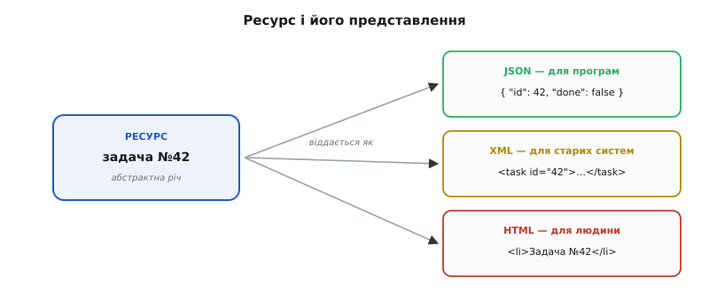
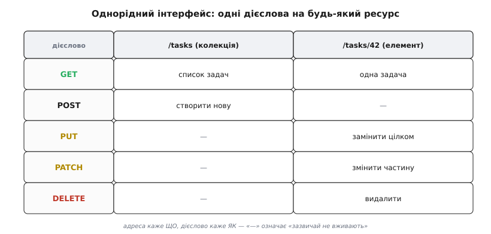
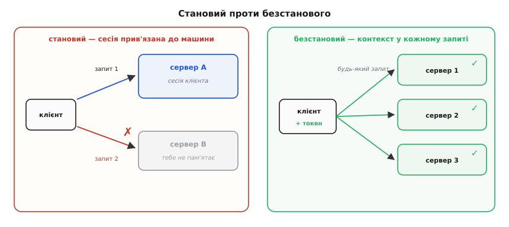
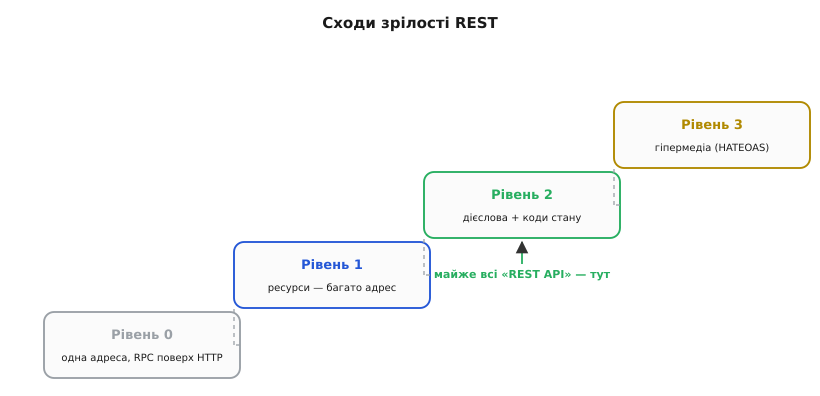

# REST

<preknowlist>
- [HTTP](root:com-protocol/http) — запит і відповідь у вебі: метод, шлях, заголовки, тіло; сервер відповідає кодом стану, заголовками й тілом. Без цього REST не має на що спертися.
</preknowlist>

Уяви два боки однієї розмови в мережі: клієнт — застосунок на телефоні чи сторінка в браузері — і сервер, у якого лежать дані: користувачі, замовлення, повідомлення, задачі. Клієнт хоче ці дані читати й міняти. Питання, з якого починається кожен бекенд: **як саме ці двоє домовляться, хто що каже?** Якою мовою клієнт попросить «дай мені задачу номер сорок два», «створи нову», «познач цю виконаною», «видали ту»?

Найпростіше, що спадає на думку, — вигадати на кожну дію свою команду. Хай сервер уміє `getTask`, `createTask`, `updateTask`, `deleteTask`, `markTaskDone`, `listTasksForUser`… Клієнт шле назву команди й параметри, сервер виконує. Працює? Так. Але кожен такий сервер стає **окремою мовою**, яку доводиться вивчати з нуля: скільки в ньому команд, як вони звуться, що повертають. Дві різні системи домовляються по-різному про те саме. Проміжні вузли мережі — кеші, проксі, шлюзи — не розуміють цих команд: для них `markTaskDone` таке саме темне, як будь-яке інше слово, тож допомогти вони не можуть. І коли систему треба розвинути, кожна зміна ризикує зламати всіх, хто вивчив стару мову.

**REST** (англ. *Representational State Transfer* — «передавання представлень стану») — це набір обмежень, які прибирають цей хаос. Ідея, з якої все випливає, коротка й на диво сильна: **не вигадуй дієслова — назви іменники**. Замість сотні команд-дій опиши світ як **ресурси** (речі, до яких звертаються), дай кожному стійку адресу й дій над усіма ними одним і тим самим **малим набором дієслів**, який уже є в HTTP. Тоді будь-який клієнт розуміє будь-який сервер, а проміжні вузли розуміють увесь рух даних, навіть не знаючи, що це за застосунок. Розберімо, як саме це працює й чому дає таку віддачу.

REST — не стандарт і не бібліотека, яку встановлюють; це **стиль архітектури**, дисципліна побудови. Його вивів [Рой Філдінг у дисертації 2000 року](root:com-protocol/rest-api/hist-rest-fielding.md), узагальнивши принципи, за якими будували сам HTTP. Тому REST так природно лягає на HTTP: він і є опис того, як улаштований вдало спроєктований веб.

### Ресурс — іменник, до якого звертаються

Перший крок REST — поглянути на систему не як на набір дій, а як на набір **ресурсів** (англ. *resource* — «засіб, джерело»: те, до чого звертаються по потребі). Ресурс — це будь-що, що варто назвати й показати: конкретна задача, список усіх задач користувача, профіль, замовлення. Кожен ресурс дістає стійку **адресу** — **URI** (англ. *Uniform Resource Identifier* — «однорідний ідентифікатор ресурсу»), той самий рядок, що ти бачиш у стрічці браузера.

Адреси будують за простим і передбачуваним ладом. **Колекція** — множина однорідних речей — має адресу-іменник у множині; **окремий елемент** усередині неї адресується своїм ідентифікатором:

```
/tasks            → колекція: усі задачі
/tasks/42         → елемент: задача з ідентифікатором 42
/tasks/42/labels  → колекція: мітки, що належать задачі 42
```

Помітна річ: в адресах немає дієслів. Не `/getTask/42` і не `/deleteTask?id=42`, а просто `/tasks/42` — **сама лише назва речі**. Що з нею робити — скаже дієслово HTTP, окремо від адреси. Це навмисне розділення: адреса каже *що*, метод каже *як*.

Тут криється тонкість, яка й дала назву всьому стилю. Коли клієнт просить `/tasks/42`, сервер віддає не «саму задачу» — задача живе в базі як рядок таблиці, це абстракція, — а її **представлення** (англ. *representation* — «зображення, подання»): конкретний знімок стану, зазвичай у форматі JSON. Той самий ресурс можна віддати по-різному: як JSON для програми, як HTML для браузера, як XML для старої системи — це різні представлення однієї речі. Клієнт і сервер обмінюються саме представленнями стану ресурсу — звідси й «передавання представлень стану».


*Ресурс і його представлення. Ресурс — абстрактна річ (задача №42); те, що йде дротом, — завжди її представлення: знімок стану в конкретному форматі. Один ресурс має кілька представлень (JSON для програм, HTML для людини), а клієнт заявляє бажаний формат заголовком. Плутати ресурс із його JSON — як плутати людину з її фотографією.*

### Однорідний інтерфейс — жменя дієслів на все

Ось де REST дає головний виграш. Дій над ресурсом рівно стільки, скільки дієслів у HTTP, і вони **фіксовані** — ті самі для задач, користувачів, замовлень, будь-чого. Це звуть **однорідним інтерфейсом** (англ. *uniform interface* — «однаковий інтерфейс»): один словник на всю систему.

Основних дієслів п'ять, і кожне має усталений зміст:

- **GET** — прочитати представлення ресурсу, нічого не змінивши.
- **POST** — створити новий елемент у колекції (сервер сам дасть йому адресу).
- **PUT** — покласти ресурс за відомою адресою цілком, замінивши те, що там було.
- **PATCH** — змінити частину ресурсу (лише вказані поля).
- **DELETE** — видалити ресурс.

Сила не в самому переліку, а в тому, що зміст дієслів **знають усі наперед**. Клієнту не треба питати документацію, що робить `GET /tasks/42`, — GET завжди читає. Проміжний кеш бачить `GET` і розуміє, що відповідь можна запам'ятати; бачить `DELETE` — розуміє, що запам'ятовувати нічого. Одна й та сама адреса `/tasks/42` під різними дієсловами робить різне, і все це — без жодного нового слова в мові конкретного сервера.


*Однорідний інтерфейс на прикладі задач. Ті самі п'ять дієслів по-різному діють на колекцію й на окремий елемент: GET на колекції — список, GET на елементі — один запис; POST на колекції — створити новий; PUT/PATCH/DELETE на елементі — замінити, підправити, видалити. Цей самий стовпчик дієслів працює для будь-якого ресурсу — досить знати адресу.*

Два дієслова мають властивості, на які спираються надійні системи, тож їх варто назвати окремо. **GET безпечний** (англ. *safe*): він лише читає, тож повторити його байдуже — стан не зміниться, і кеш чи пошуковий робот можуть смикати його вільно. **GET, PUT і DELETE ідемпотентні**: повторити той самий запит удруге — те саме, що виконати раз. Видалив задачу 42, мережа збрикнула, клієнт повторив DELETE — задачі однаково немає, шкоди нема. А от **POST не ідемпотентний**: два `POST /tasks` створять **дві** задачі. Тому саме навколо POST будують захист від подвійного натискання — про це докладніше в темі [ідемпотентності методів як частини контракту](root:com-protocol/api-idempotency).

> 🔧 **Навіщо це.** Однорідний інтерфейс — це чому REST-систему легко нарощувати сторонніми руками. Кеш, що прискорює тисячі API, не знає нічого про твої задачі — він знає лише HTTP: GET кешувати можна, після POST/PUT/DELETE запис протух. CDN, шлюз, балансувальник, автоматичний клієнт — усі говорять цією ж мовою дієслів. Ти пишеш прикладну логіку, а половину інфраструктури дістаєш задарма, бо вона розуміє однорідний інтерфейс, а не твій застосунок.

### Коди стану — словник відповіді сервера

Дієслово — це те, що каже клієнт. У відповідь сервер каже **код стану** (англ. *status code*) — трицифрове число, що одразу, ще до тіла відповіді, повідомляє, чим усе скінчилося. Коди згруповані в родини за першою цифрою, і сама родина вже несе суть:

```
2xx — вдалося:        200 OK · 201 Created · 204 No Content
3xx — шукай деінде:   301 Moved · 304 Not Modified
4xx — винен клієнт:   400 Bad Request · 401 Unauthorized · 404 Not Found · 409 Conflict
5xx — винен сервер:   500 Internal Error · 503 Service Unavailable
```

Розподіл провини між `4xx` і `5xx` — не формальність, а практичний нерв: за ним автоматика вирішує, чи є сенс **повторювати** запит. `4xx` каже «ти прислав щось не те» — повторювати марно, поки клієнт не виправиться. `5xx` каже «зі мною зараз біда» — за мить може минути, тож повтор доречний. Клієнт, що бачить різницю родин, поводиться розумно, знову ж таки не знаючи нічого про прикладну логіку сервера.

### Стан на боці клієнта: сервер без пам'яті між запитами

Наступне обмеження REST спершу здається незручним, а виявляється тим, що дає системі рости. **Кожен запит самодостатній**: він несе все, що потрібно серверу, щоб його обробити. Сервер **не тримає пам'яті про клієнта між запитами** — не пам'ятає, що ти робив хвилину тому. Це зветься **безстановістю** (англ. *stateless* — «без стану»).

Порівняймо два світи. У **становому** сервер по першому запиту завів би тобі сесію у своїй пам'яті («це той, хто щойно ввійшов»), а далі кожен наступний запит спирався б на цю пам'ять. Доки клієнт розмовляє з тим самим сервером — усе гаразд. Але щойно ти ставиш **другий** сервер, щоб витримати навантаження, виникає халепа: наступний запит потрапляє на машину, яка тебе «не пам'ятає», бо сесія лежить на першій. У **безстановому** світі такої проблеми немає за побудовою. Запит несе, наприклад, [токен автентифікації](root:sf-web/jwt-tokens) у своєму заголовку — і будь-який із десяти однакових серверів обробить його однаково, бо все потрібне вже в самому запиті.


*Чому безстановість дає масштаб. Становий сервер прив'язує клієнта до машини, де лежить його сесія, — додати другу машину важко. Безстановий сервер нічого не пам'ятає між запитами: контекст їде в кожному запиті, тож запити вільно розкидаються між скількись завгодно однаковими машинами. За безстановістю стоїть уся горизонтальна масштабованість вебу.*

Ціна є, і про неї чесно сказати. Клієнт мусить **щоразу нести контекст** — той самий токен у кожному запиті замість «сервер мене пам'ятає». Трохи більше даних дротом, трохи більше роботи клієнту. Але саме ця ціна купує головне: сервери стають взаємозамінними, будь-який обробить будь-який запит, і систему можна нарощувати простим додаванням однакових машин. Де тримати те, що таки має пережити один запит, — окрема тема про [сесії та їх стан](root:sf-web/sessions-state).

> 🔧 **Навіщо це.** Безстановість — передумова того, як живуть великі системи в проді. Впала одна машина — балансувальник просто шле запити на решту, і клієнт нічого не помічає, бо на будь-якій машині є все, щоб його обслужити. Треба вдвічі більше потужності на чорну п'ятницю — піднімаєш удвічі більше однакових копій сервера за ними ж таки балансувальником. Нічого з цього не вийшло б, якби «стан розмови» жив у пам'яті конкретної машини.

### Кешованість і шари

Ще два обмеження REST успадковує від HTTP і робить із них правило. **Кешованість**: сервер може позначити відповідь такою, що її вільно запам'ятати на певний час чи звірити на свіжість (заголовками на кшталт `Cache-Control` і `ETag`), — і тоді проміжний вузол чи сам клієнт віддадуть її повторно, не турбуючи сервер. **Шаруватість**: між клієнтом і справжнім сервером можна вставити скільки завгодно проміжних вузлів — кеш, шлюз, балансувальник, — і клієнт цього навіть не помітить, бо всі вони говорять тим самим однорідним інтерфейсом. Ці два обмеження — пряме продовження [патернів кешування](root:sf-data/caching-strategies): REST не вигадує кеш, а дає йому працювати без знання про застосунок.

### Наскільки система «RESTful»: сходи зрілості

На практиці «REST-подібними» звуть дуже різні API, і корисно мати мірку, наскільки система справді дотримується стилю. Таку мірку — **модель зрілості** — запропонував Леонард Річардсон 2008 року (її згодом розтлумачив Мартін Фаулер). Вона розкладає шлях до REST на чотири щаблі:

- **Рівень 0** — одна адреса, усе через POST на неї; по суті виклик віддалених функцій, лише загорнутий у HTTP. HTTP тут — просто труба, його дієслова й коди не використані.
- **Рівень 1** — з'явилися **ресурси**: багато адрес-іменників замість однієї. Уже краще, та дієслово досі одне.
- **Рівень 2** — у гру входять **дієслова й коди стану**: GET читає, DELETE видаляє, `404` означає «нема», `201` — «створено». Це те, що більшість людей і має на увазі під «REST API».
- **Рівень 3** — **гіпермедіа** (HATEOAS, англ. *Hypermedia As The Engine Of Application State*): відповідь несе не лише дані, а й посилання на те, що з ними можна робити далі, — клієнт ходить по системі за посиланнями, як людина по сторінках сайту.


*Сходи зрілості REST. Кожен щабель бере від HTTP більше: спершу лише адреси, тоді дієслова й коди стану, нарешті посилання-переходи. Практична правда: майже всі «REST API» живуть на рівні 2 — ресурси плюс дієслова й коди. Рівень 3 логічно завершує стиль, але в проді трапляється рідко.*

Тут варто бути чесним щодо слів. Сам Філдінг вважав саме гіпермедіа обов'язковою рисою REST, тож те, що галузь звикла називати «REST», строго кажучи, здебільшого зупиняється на рівні 2. Це не робить рівень 2 поганим — навпаки, для більшості систем він і є розумною межею. Просто варто знати, що між «REST за Філдінгом» і «REST, як його називають на роботі» є розрив; звідки він узявся, добре видно з [історії постання REST](root:com-protocol/rest-api/hist-rest-fielding.md).

### REST проти RPC: іменники проти дієслів

Щоб REST став остаточно ясним, корисно поставити його поруч із протилежним підходом — **RPC** (англ. *Remote Procedure Call* — «виклик віддаленої процедури»). RPC мислить **дієсловами**: на сервері є функції, клієнт викликає їх через мережу, ніби вони локальні. `createTask`, `markTaskDone` — це RPC-мислення. REST мислить **іменниками**: на сервері є ресурси, клієнт міняє їх фіксованими дієсловами HTTP. Ту саму дію «позначити задачу виконаною» RPC виразить викликом `markTaskDone(42)`, а REST — зміною поля ресурсу: `PATCH /tasks/42` з тілом `{"done": true}`.

Жоден не «правильніший» узагалі — вони добрі для різного. Там, де операції природно лягають на «речі та їхній стан», REST дає однорідність і всю ту дармову інфраструктуру. Там, де суть у складних діях, що погано зводяться до іменників, чесніший [RPC і його способи серіалізації](root:com-protocol/rpc). Знати межу важливіше, ніж вибрати табір: погана REST-система — це найчастіше RPC, силоміць втиснутий в адреси-іменники.

### Як це виглядає в житті: життя однієї задачі

Складімо все докупи на маленькому прикладі — повний цикл життя ресурсу через HTTP. Кожен крок — справжній обмін: запит клієнта, відповідь сервера з кодом стану.

**Створити задачу — POST на колекцію.** Тіла ресурсу ще немає за адресою, тож клієнт шле його серверові, а той сам призначить адресу:

```http
POST /tasks HTTP/1.1
Content-Type: application/json

{ "title": "Купити молоко", "done": false }
```
```http
HTTP/1.1 201 Created
Location: /tasks/42

{ "id": 42, "title": "Купити молоко", "done": false }
```

Сервер відповів `201 Created` і в заголовку `Location` сказав адресу нового ресурсу — `/tasks/42`. Далі клієнт звертається вже туди.

**Прочитати — GET на елемент.** Безпечно, нічого не міняє, можна повторювати й кешувати:

```http
GET /tasks/42 HTTP/1.1
```
```http
HTTP/1.1 200 OK

{ "id": 42, "title": "Купити молоко", "done": false }
```

**Змінити частину — PATCH.** Міняємо лише одне поле, решту не чіпаємо:

```http
PATCH /tasks/42 HTTP/1.1
Content-Type: application/json

{ "done": true }
```
```http
HTTP/1.1 200 OK

{ "id": 42, "title": "Купити молоко", "done": true }
```

**Видалити — DELETE.** Тіло у відповіді ні до чого, тож `204 No Content`:

```http
DELETE /tasks/42 HTTP/1.1
```
```http
HTTP/1.1 204 No Content
```

**Спробувати ще раз те, чого вже немає.** Повторний GET за тією ж адресою чесно каже, що ресурсу немає:

```http
GET /tasks/42 HTTP/1.1
```
```http
HTTP/1.1 404 Not Found
```

Уся розмова — самі лише адреси-іменники й фіксовані дієслова; жодної команди, придуманої спеціально для цього сервера. Той самий візерунок повторюється для користувачів, замовлень, будь-чого — і в цьому вся суть. Як довести це до робочого серверного коду з розкладанням адрес на обробники, показано в [проєкті-розборі дизайну REST-API](root:com-protocol/rest-api/proj-rest-api-design.md).

### Що з цим межує, коли будуєш по-справжньому

REST задає кістяк, але живий API навколо цього кістяка обростає рішеннями, кожне з яких — окрема тема. Формати помилок і тіла `4xx`-відповідей; погортання довгих колекцій сторінками; [версіонування API](root:com-protocol/api-versioning), щоб міняти контракт, не ламаючи старих клієнтів; [автентифікація](root:sf-security/authentication) й [моделі авторизації](root:sf-security/authorization-models), бо сам REST навмисне про доступ нічого не каже; нарешті [шар BFF](root:sf-web/bff-pattern), який ліпить під кожен різновид клієнта зручний для нього фасад поверх спільних ресурсів. REST не диктує тут відповідей — він лише дає стійку основу, на якій ці рішення тримаються злагоджено, бо всі говорять однією мовою дієслів, адрес і кодів.

Уся віддача REST випливає з двох простих ходів: назви речі іменниками з адресами, дій над ними спільним малим набором дієслів — і не тримай пам'яті про клієнта між запитами. З першого ходу народжується однорідність, яку розуміє вся інфраструктура вебу; з другого — здатність рости, просто додаючи однакові машини. Ні те, ні те не потребує стандарту чи бібліотеки — лише дисципліни бачити систему як ресурси, а не як команди.
