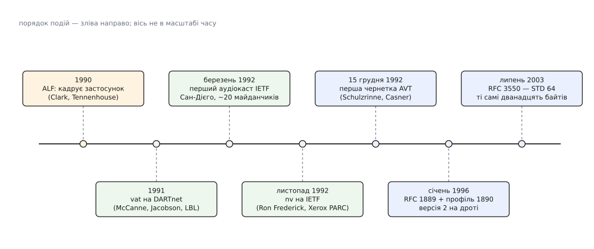

# 📜 Як народився RTP: протокол, що свідомо нічого не обіцяє

RTP не придумали за столом комітету — його спершу двічі написали в робочому коді, у двох різних лабораторіях, і лише потім IETF записала на папері те, що вже літало дротом. Ця історія варта уваги не датами, а однією розвилкою: автори мали всі підстави вбудувати в протокол надійність і стримування швидкості, свідомо цього не зробили — і саме тому специфікація 1996 року досі носить відеодзвінки 2020-х майже без правок.

## Мережа, у якій уже лунав звук

Наприкінці 1980-х передавати мову пакетами вміли давно: перші досліди сягають середини 1970-х, коли по ARPANET ганяли оцифровану мову протоколами NVP (*Network Voice Protocol*) і згодом PVP (*Packet Video Protocol*) — роботи Денні Коена (Danny Cohen) і Ренді Коула (Randy Cole). Але то були досліди на спеціально зібраних стендах. Що змінилося на зламі 1990-х — з'явилися звичайні робочі станції зі вбудованим звуком (гучний приклад — Sun SPARCstation), тобто вперше мікрофон і динамік стали не окремим приладом, а частиною машини, яка й так стояла в мережі.

Другою складовою була **багатоадресна розсилка**. Один канал не витягнув би сотню окремих потоків на сотню слухачів; потрібен спосіб послати пакет **раз**, а мережа хай сама розмножить його по гілках дерева до всіх охочих.

> [Багатоадресна розсилка](root:com-transport/multicast-and-discovery) — режим, у якому пакет адресується не машині, а **групі**: відправник шле одну копію, маршрутизатори дублюють її лише там, де дерево розгалужується до підписаних слухачів. Витрати відправника не залежать від кількості приймачів — саме це робить трансляцію на сотні майданчиків узагалі можливою.

На початку 1992 року Ван Джейкобсон (Van Jacobson), Стів Дірінг (Steve Deering) і Стівен Каснер (Stephen Casner) зшили з таких острівців **MBone** (*multicast backbone* — «багатоадресний кістяк»): віртуальну мережу поверх звичайного Інтернету, де багатоадресні пакети пробиралися крізь маршрутизатори, які про них ще не знали, запхані в звичайні одноадресні тунелі. У березні 1992-го з наради IETF у Сан-Дієго пішла перша жива звукова трансляція — її слухало близько двох десятків майданчиків по світу. Це і є та «експериментальна багатоадресна трансляція ранньої мережі», у якій RTP невдовзі знадобився.

## Два інструменти, один спосіб пакетувати

Слухати трансляцію було чим. У Лоуренсівській національній лабораторії в Берклі (LBL) Стів Мак-Кенн (Steve McCanne) і Ван Джейкобсон писали **vat** — *visual audio tool*, звуковий інструмент із віконцем, де було видно, хто зараз говорить. У дослідницькому центрі Xerox PARC Рон Фредерік (Ron Frederick) писав **nv** — *network video*, програмку, що ганяла по MBone відео; на листопадовій нараді IETF 1992 року нею вже транслювали засідання.

Дві незалежні програми, різні лабораторії, різне медіа — а проблеми в них виявилися однакові до дрібниць. Обидві клали свої дані в UDP-датаграми. Обидві мусили якось сказати приймачеві, котрий пакет по порядку, до якого моменту звуку чи картинки він належить, чим стиснутий і від кого прийшов. Обидві дійшли до того самого — **невеликого власного заголовка перед даними**. І тільки-но такі заголовки завелися в двох програмах одразу, стало очевидно: якщо кожен інструмент вигадуватиме свій, MBone розсиплеться на несумісні острівці, де звук vat не чути в чужому програвачі.

Тут варто розрізняти три різні речі, які легко злипаються в одну фразу «vat придумав RTP». Була **ідея** — пакетна мова й відео з часовими мітками, відома з 1970-х. Була **реалізація** — робочий формат заголовка всередині vat, який справді літав дротом і справді працював. І була **стандартизація** — окремий, довгий і сперечливий процес, у якому цей формат перебрали, переробили й зробили спільним. Заслуги тут не в одних руках: без vat не було б із чого стандартизувати, без IETF формат vat лишився б внутрішньою справою однієї програми.


*Порядок подій від ідеї до стандарту. Помаранчеве — архітектурний принцип, зелене — робочий код, синє — папір IETF. Між першою чернеткою й першим RFC минуло понад три роки, між першим RFC і статусом стандарту Інтернету — ще сім із половиною; за весь цей час формат на дроті майже не змінився.*

## Робоча група AVT і перший текст

Робочу групу IETF назвали **AVT** — *Audio/Video Transport*, «транспорт звуку й відео»; головував у ній Стівен Каснер. Перша чернетка групи, `draft-ietf-avt-rtp-00`, датована **15 грудня 1992 року**; підписали її Геннінг Шульцрінне (Henning Schulzrinne), тоді ще з AT&T Bell Laboratories, і Стівен Каснер із USC/ISI. Розділ подяк у ній чесно називає родовід: протокол походить від NVP і PVP Коена й Коула та від того, що реалізовано в програмі vat Джейкобсона й Мак-Кенна.

Уже в цій найпершій чернетці стоїть фраза, яка визначила все подальше: протокол **не гарантує доставки, не запобігає перестановці пакетів і не припускає, що мережа під ним надійна**. Не «поки що не гарантує» — а не гарантує принципово.

## Розвилка: чи має транспорт лагодити мережу

У 1992 році це рішення виглядало як мінімум дискусійним. Загальний рефлекс тодішньої інженерії був протилежний: транспортний рівень існує саме для того, щоб сховати від застосунку негаразди мережі — так робить TCP, і робить добре. Спокуса зробити «TCP для медіа» — надійний, з повторами й вирівнюванням швидкості — була цілком природна.

Проти неї працювали два аргументи, обидва вже озвучені на той час.

Перший — **наскрізний**. Функцію, повну правильність якої однаково можна забезпечити лише на краях, немає сенсу дублювати всередині мережі: там вона коштує, але не рятує.

> [Наскрізний аргумент](root:sf-apps/end-to-end-argument) каже: якщо перевірку чи відновлення все одно доводиться робити на кінцевому вузлі, то та сама робота, зроблена ще й проміжними ланками, дає щонайбільше виграш у швидкодії — але не в правильності, і платити за неї треба в кожному пакеті. Для живого медіа це не просто теорія: тільки застосунок знає, чи кадр іще потрібен, чи його момент показу вже минув.

Другий — **ALF**, *application level framing*, «кадрування на рівні застосунку». Девід Кларк (David Clark) і Девід Теннгаус (David Tennenhouse) сформулювали його на SIGCOMM 1990: різати дані на шматки має **застосунок**, за власним змістом, а нижчі рівні мають зберігати межі цих шматків недоторканими, щоб кожен шматок можна було обробити самостійно й у будь-якому порядку. RTP — хрестоматійне втілення цього принципу: пакет несе рівно стільки, скільки декодер уміє з'їсти окремо, і межа кадру видима згори, а не схована в потоці байтів.

Обидва аргументи ведуть до одного: транспорт медіа має **називати**, а не **лагодити**. Він мусить дати приймачеві відомості — порядок, час, джерело, тип — і зникнути. Що з цими відомостями робити, вирішує застосунок: чи згладжувати нерівність приходу [буфером джитера](root:com-signal/jitter-buffer) на п'ятдесят мілісекунд, чи на п'ятсот; чи домальовувати втрачений шматок кадру, чи показувати збій; чи знижувати якість при заторі, чи тримати її й миритися з утратами. Жодну з цих відповідей не можна було записати в протокол, бо вона різна для телефонного дзвінка, для трансляції лекції та для камери спостереження.

Показово, як обійшлися з **керуванням швидкістю**. Його не забули — його винесли. Сам RTP не має жодного механізму стримування; RTCP лише **вимірює** й доповідає про втрати й нерівність приходу, а рішення, що з цим робити, лишається відправникові.

> [Керування перевантаженням](root:com-transport/congestion-control) — це петля, у якій відправник знижує швидкість, побачивши ознаки затору, щоб мережа не захлинулася. У TCP вона вбудована й однакова для всіх. Для медіа єдиної правильної реакції немає: один застосунок мусить перемкнути кодек на грубіший, інший — зменшити частоту кадрів, третій — узагалі кинути відео й лишити звук. Тому петля лишилася за межами протоколу, на його краях.

Ціна цього рішення реальна й видима: десятиліттями по тому кожен, хто будував систему на RTP, мусив дописувати власне стримування швидкості й власну реакцію на втрати. Виграш — теж реальний: коли з'явилися нові способи це робити, жоден із них не вимагав змінювати заголовок.

## RFC 1889 і скам'янілість у полі версії

**RFC 1889 вийшов у січні 1996 року**, через три роки й місяць після першої чернетки. Підписали його четверо: Г. Шульцрінне (тоді GMD Fokus, Німеччина), С. Каснер (Precept Software), Р. Фредерік (Xerox PARC) і В. Джейкобсон (Lawrence Berkeley National Laboratory) — тобто автор специфікації, голова робочої групи й автори обох інструментів, з яких усе почалося.

Того ж місяця вийшов і **RFC 1890** — окремий «профіль» за підписом самого Шульцрінне, де прописано зіставлення номерів типу навантаження з кодеками. Це теж рішення про стриманість, тільки в іншому вимірі: перелік кодеків старіє швидко, і якби він жив у тілі протоколу, кожен новий кодек вимагав би переписувати протокол. Профіль винесли в окремий документ саме для того, щоб він старів **окремо** — і 1890 справді відтоді замінили на RFC 3551, тоді як сам RTP лишився.

Найкращий свідок того, що стандарт лише зафіксував уже наявний код, — двобітове поле версії на самому початку заголовка. Там стоїть **2**. Значення **1** належить першій чернетковій версії RTP, а значення **0** — тому формату, який реалізували в vat. Тобто в кожному RTP-пакеті, що летить сьогодні, перші два біти рахують два попередні кроки еволюції — чернетку й ту саму програмку з Берклі.

```
поле V (2 біти) на початку кожного заголовка RTP
V = 0  → формат, реалізований у vat
V = 1  → перша чернеткова версія RTP (AVT, 1992–1993)
V = 2  → RFC 1889 (1996) і RFC 3550 (2003) — те саме значення
```

## Сім років і одна правка

Далі сталося рідкісне. **RFC 3550 вийшов у липні 2003 року** й отримав статус STD 64 — повноцінного стандарту Інтернету, найвищого щабля в IETF. За текстом він майже дослівно повторює RFC 1889, а **на дроті не змінює нічого**: формати пакетів ті самі. Головна змістовна правка — покращення алгоритму, за яким учасники обчислюють момент відправлення чергового звіту RTCP.

Проблема була суто арифметична, але неприємна. Службовий трафік RTCP обмежено приблизно п'ятьма відсотками смуги сеансу, поділеними між усіма учасниками; отже, кожен мусить оцінити, скільки їх усього, і рознести свої звіти тим рідше, чим більша група. Новачок цієї оцінки не має — він щойно приєднався й бачить одиниці учасників замість тисяч, тож обирає надто короткий проміжок. Коли до трансляції одночасно під'єднуються тисячі новачків, усі вони помиляються в один бік і разом видають сплеск службових пакетів у момент, коли мережі й так найважче. Ліки назвали **timer reconsideration** — «переоцінка таймера»: перед самою відправкою учасник ще раз дивиться на свіжу оцінку розміру групи й, якщо та зросла, відкладає звіт. Простий відступ, який гасить сплеск.

Список авторів RFC 3550 — той самий, що й у 1889, змінилися тільки установи: Шульцрінне вже в Колумбійському університеті, Каснер і Джейкобсон — у Packet Design, Фредерік — у Blue Coat Systems. Ті самі четверо, той самий протокол, інша епоха мережі. За ці сім із половиною років Інтернет із дослідницької мережі став споживчим, MBone тихо помер разом із мрією про глобальну багатоадресність, а протокол, зроблений для нього, пережив і саму MBone, і хвилю IP-телефонії, і появу WebRTC.

Причина цього довголіття не в геніальному передбаченні. Автори не вгадали, як виглядатиме мережа 2020-х, — вони просто **не записали в протокол нічого, що можна було б угадати неправильно**. Усе, що залежить від епохи — кодеки, реакція на затор, стратегія відновлення втрат, шифрування, — лишилося на краях, де його можна замінити, не чіпаючи дванадцяти байтів посередині.
