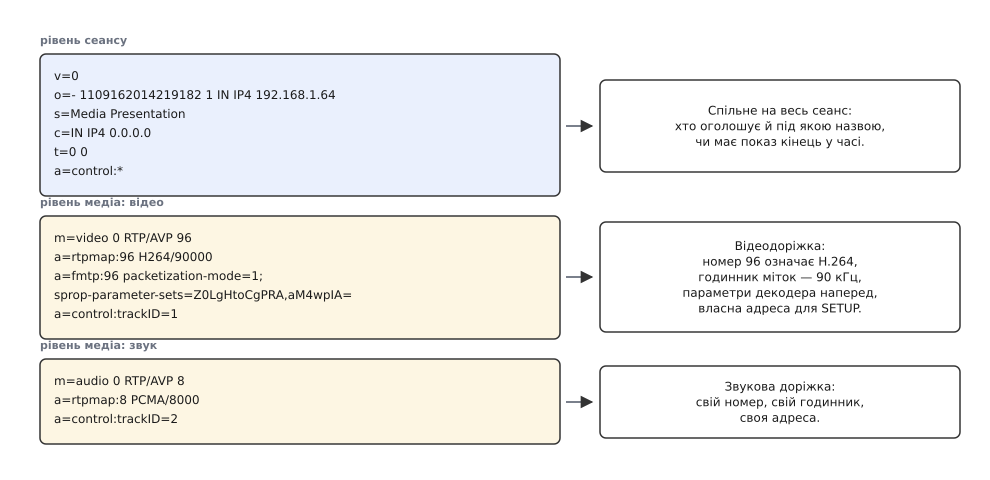
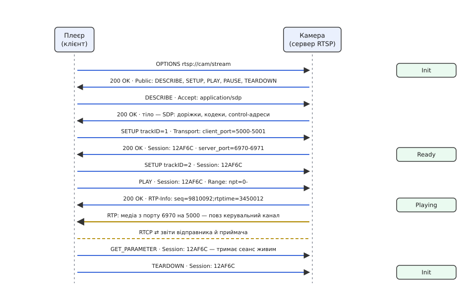
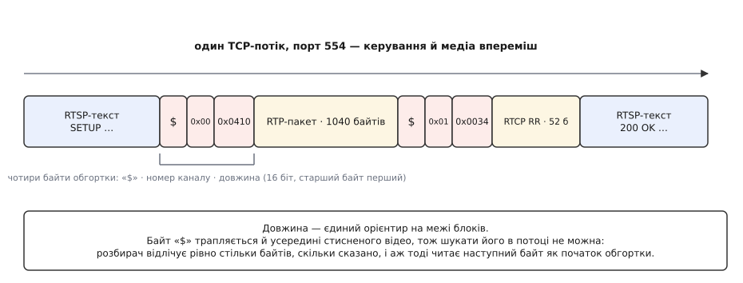

# RTSP і SDP: керування сеансом потокового відео

<preknowlist>
- [RTP і RTCP](topic:com-protocol/rtp-rtcp) — що медіа їде окремими датаграмами, кожна з номером, міткою часу й номером типу навантаження, і що сам потік не каже, яким кодеком стиснутий.
- [TCP проти UDP](topic:com-transport/tcp-vs-udp) — чим надійне з'єднання відрізняється від датаграм без гарантій і чому живому відео частіше пасує друге.
- [HTTP](topic:com-protocol/http) — текстовий обмін «запит — відповідь»: рядок методу, заголовки, код стану, тіло.
- [H.264: NAL-одиниці, SPS/PPS і ключові кадри](topic:com-signal/h264-nal-structure) — що декодерові потрібні параметри послідовності й картинки, перш ніж він розбере бодай один кадр.
- [Багатоадресна розсилка й виявлення вузлів](topic:com-transport/multicast-and-discovery) — що один пакет може дійти до багатьох одержувачів, якщо мережа розмножує його сама.
</preknowlist>

У плеєр вставляють рядок `rtsp://192.168.1.64/Streaming/Channels/101`, і за півсекунди у вікні з'являється картинка з камери. У цьому рядку немає майже нічого: адреса пристрою й ім'я ресурсу. Ані слова про те, скільки в цьому ресурсі доріжок і чи є серед них звук. Ані слова про те, яким кодеком стиснуто картинку та якої вона роздільності. Ані слова про те, на який порт плеєра камері слати дані й з якого моменту починати. Отже, за ті півсекунди хтось усе це з'ясував.

З'ясувати треба дві речі різної природи, і саме ця різниця визначає все далі. Перша — **факти про матеріал**: що є в ресурсі й у якому воно вигляді. Ці факти камера просто **повідомляє**; вони не залежать від того, хто питає, і не потребують відповіді. Друга — **дії над сеансом**: почати, зупинити, перемотати, відпустити ресурси. Дія завжди чиясь, вона змінює стан на сервері й вимагає підтвердження.

Змішати їх спокусливо й невигідно. Опис матеріалу потрібен і там, де ніякого діалогу немає: у багатоадресному оголошенні «о шостій вечора на цій адресі буде трансляція», у файлі-запрошенні, у переговорах телефонного дзвінка. Тому опис зробили **окремою мовою**, яка сама нічого не передає й ні до чого не під'єднується, — **SDP** (англ. *Session Description Protocol* — «протокол опису сеансу»). А дії над сеансом описали окремим протоколом-командиром, **RTSP** (англ. *Real-Time Streaming Protocol* — «протокол потокового передавання в реальному часі»), який не несе жодного байта медіа. Медіа ж їде третім, повністю незалежним шляхом — [пакетами RTP](topic:com-protocol/rtp-rtcp). Три протоколи, три обов'язки, жодного перекриття.

### Опис, що мусив уміститися в одну датаграму

Вигляд SDP спантеличує, поки не знати, для чого його зробили. Кожен рядок — одна латинська літера, знак рівності й значення: `v=0`, `m=video 0 RTP/AVP 96`. Ні лапок, ні дужок, ні закривних тегів, ні вкладеності. Порядок рядків жорсткий, а не довільний.

Причина в первісному застосуванні. SDP описали 1998 року Марк Гендлі й Ван Джейкобсон (RFC 2327; чинна редакція — RFC 4566 від 2006 року, до авторів долучився Колін Перкінс) для довідника сеансів у ранній багатоадресній мережі MBone. Оголошення про конференцію періодично розсилали на службову групу адрес, і воно мало вміститися **в одну датаграму**, яку читатиме програма, написана кимось стороннім, і показуватиме людині. Звідси все: розбирати такий формат можна одним проходом по рядках, без буфера й без пам'яті про вкладеність; зайвий байт у ньому коштує смуги в кожному повторі оголошення; а жорсткий порядок рядків знімає потребу тримати стан розбору.

Відтоді SDP пережив своє походження. Ним домовляються про голосовий дзвінок у [SIP](topic:com-protocol/sip), ним обмінюються браузери у [WebRTC](topic:com-transport/webrtc), ним камера відповідає на запит плеєра. Формат лишився телеграмою, а не документом.

### Що насправді написано в описі камери

Опис поділено рівно на два рівні. Спершу йдуть рядки, що стосуються **всього сеансу**; далі опис розпадається на блоки, кожен з яких починається рядком `m=` і описує **одну доріжку**. Усе, що стоїть після `m=`, належить цій доріжці й нікому більше.


*Два рівні опису. Верхній блок каже, чий це сеанс і чи має він кінець у часі; кожен наступний блок описує окрему доріжку — чим стиснуто, з якою частотою цокає годинник міток, які параметри потрібні декодерові й за якою адресою цю доріжку замовляти.*

Пройдімо рядками, які справді щось вирішують.

**`m=video 0 RTP/AVP 96`** — оголошення доріжки. Тут чотири речі: рід матеріалу (`video`), порт, назва транспорту з профілем (`RTP/AVP` — пакети RTP за базовим профілем для аудіо й відео) і перелік номерів типу навантаження, які ця доріжка може вживати. Порт нульовий, і це не помилка: коли опис приходить у відповідь на запит RTSP, порт узгодять пізніше, окремою командою, і ставити сюди число немає сенсу. У багатоадресному оголошенні, для якого формат і робився, тут стояв би справжній номер порту — бо там домовлятися ні з ким.

**`a=rtpmap:96 H264/90000`** — той самий словник, без якого потік RTP не розшифрувати. Номери типу навантаження від 96 до 127 не закріплені ні за чим: цифра 96 сама по собі не каже нічого. Рядок `rtpmap` прив'язує номер до назви кодека **і до частоти годинника міток часу**. Друге не менш важливе за перше: усі обчислення тривалості й затримки на приймачі діляться на цю частоту, і зашите в код «90 000» тихо бреше на будь-якому потоці з іншим годинником.

**`a=fmtp:96 packetization-mode=1;sprop-parameter-sets=…`** — параметри, специфічні для конкретного кодека. Найцінніше тут `sprop-parameter-sets`: набори параметрів послідовності й картинки, закодовані в base64 просто в описі. Вони потрібні декодерові **раніше за перший кадр** — без них він не знає ні роздільності, ні профілю й не може розібрати навіть ключовий кадр. У потоці ці набори теж їдуть, але лише поруч із ключовими кадрами, а ключовий кадр буває раз на секунду-дві. Різниця між плеєром, що читає `fmtp`, і плеєром, що його ігнорує, — це різниця між картинкою з першого кадру та сірим прямокутником на дві секунди.

**`a=control:trackID=1`** — адреса саме цієї доріжки. Ось як з одного опису виходить кілька окремих потоків: кожна доріжка має власну адресу, і команда налаштування йде **на неї**, а не на сеанс загалом. Значення буває відносним (`trackID=1`), і тоді його дописують до базової адреси, а буває повним рядком `rtsp://…` — обидва варіанти в житті трапляються, і клієнт мусить уміти обидва.

**`t=0 0`** — межі показу в часі. Два нулі означають «початку й кінця немає»: це жива трансляція, вона триває, доки камера ввімкнена. Записаний файл поставив би тут справжні позначки.

> 🔧 **Навіщо це.** Опис — перше місце, куди дивляться, коли потік «не грає». Порожній блок `m=audio` каже, що камері вимкнули мікрофон, а не що зламався плеєр. Відсутній `a=fmtp` пояснює сірий екран до першого ключового кадру. Частота в `rtpmap`, відмінна від 90 000, пояснює, чому обчислена затримка виходить у ціле число разів більшою за правду. Один запит `DESCRIBE` через будь-який клієнт командного рядка знімає більшість здогадок ще до того, як почнеться налагодження коду.

### Опис — не переговори

У SDP немає жодного способу щось спитати. Це односторонній акт: ось що я маю, приймай як є. Для оголошення в багатоадресній мережі більшого й не треба — там нема кому відповідати.

Але щойно двоє мусять домовитися (у мене є H.264 і Opus, у тебе — H.264 і G.711; на чому зійдемося?), одного опису замало. Потрібну домовленість добудували **зверху**, не змінюючи формату: домовилися, що один опис вважається пропозицією, другий — відповіддю на неї, і що у відповіді мають бути **ті самі блоки `m=` у тому самому порядку**, а відмова від доріжки позначається нулем у полі порту. Кожен блок відповіді стоїть строго навпроти свого блока пропозиції — саме тому в SDP не можна переставляти рядки й не можна викидати непотрібне: позиція є ідентифікатором. Так працюють і телефонна сигналізація, і браузерні відеодзвінки.

RTSP цією надбудовою не користується. Опис тече в один бік — від камери до плеєра, — а те, про що справді треба домовитися (куди слати пакети й яким транспортом), винесене з SDP у власний заголовок RTSP. Розділення вийшло чисте: SDP каже, **що** є, RTSP каже, **куди й коли**.

### Керувальний канал: схожий на HTTP і не HTTP

RTSP описали 1998 року Хеннінг Шульцрінне (Колумбійський університет), Ануп Рао (тоді Netscape) і Роб Ланф'єр (тоді RealNetworks) — RFC 2326. Походження видно неозброєним оком: текстовий рядок запиту, заголовки через двокрапку, тризначні коди стану, повторно вжиті цілі шматки граматики HTTP. Типове з'єднання йде на порт 554 поверх TCP.

Схожість поверхова, і три відмінності від HTTP тут принципові.

**Сервер тримає стан.** HTTP-сервер має право забути про клієнта одразу після відповіді. RTSP-сервер не має: команда «грай» безглузда сама по собі — вона означає «грай **те**, що ми щойно налаштували, **туди**, куди домовилися». Налаштування виділяє на сервері справжні ресурси (сокети, місце в конвеєрі кодування, позицію в потоці), і ці ресурси мусять пережити паузу між командами. Тому перша ж відповідь на налаштування несе `Session: 12AF6C` — ідентифікатор, який клієнт відтепер підставляє в кожен запит.

**Стан рухається командами й нічим іншим.** До налаштування сеансу не існує. Після налаштування він **готовий**: ресурси є, дані не йдуть. Після команди відтворення він **грає**. Пауза повертає його в готовий стан, не звільняючи ресурсів, — саме тому після паузи відтворення поновлюється миттєво. Розбирання руйнує сеанс і звільняє все. Команда не на своєму місці — не помилка клієнта в загальному сенсі, а окремий код відмови: «метод недійсний у цьому стані».

**Запити йдуть в обидва боки.** Сервер теж має право надіслати запит клієнтові — переадресувати його на інший вузол чи оголосити зміну опису. У HTTP такого немає взагалі.


*Уся розмова, що вміщається в півсекунди до першого кадру. Ліворуч і праворуч — керувальне з'єднання, посередині позначено, коли починають текти пакети медіа: вони йдуть окремим шляхом і керувального каналу не торкаються. Праворуч — стан сеансу на сервері; його рухають рівно три команди.*

Повний перелік методів, заголовків і кодів відмови зібрано окремо — [довідник команд RTSP і полів SDP](topic:com-protocol/rtsp-sdp/api-rtsp-reference.md): що обов'язкове, що ні, яка граматика в заголовка транспорту й що означають коди на кшталт 454 чи 461.

### Домовитися про труби: заголовок Transport

Уся домовленість про шлях медіа живе в одному заголовку команди налаштування. Клієнт пропонує варіанти в порядку своїх уподобань, сервер обирає один і повертає його доповненим своїми числами.

Одноадресна доставка поверх UDP виглядає так:

```
C → SETUP rtsp://cam/stream/trackID=1 RTSP/1.0
    CSeq: 3
    Transport: RTP/AVP;unicast;client_port=5000-5001

S → RTSP/1.0 200 OK
    CSeq: 3
    Session: 12AF6C;timeout=60
    Transport: RTP/AVP;unicast;client_port=5000-5001;
               server_port=6970-6971;ssrc=1A2B3C4D
```

Порти йдуть парами, бо потоків насправді два: медіа на парному порту, звіти RTCP на наступному непарному. Числа є з обох боків, тож кожна сторона знає, куди слати й звідки чекати.

Другий варіант — багатоадресний: `Transport: RTP/AVP;multicast`, і сервер повертає групову адресу, спільний порт і межу поширення. Тоді камера шле **один** потік незалежно від кількості глядачів, а розмножує його мережа. Це рідна для SDP схема, і в локальній мережі вона працює чудово; за її межами вона не працює майже ніде.

Третій варіант існує з однієї-єдиної причини — через [трансляцію адрес і фаєрволи](topic:com-transport/nat-traversal). Датаграма з камери в бік плеєра приходить незапрошеною, і на шляху її ніхто не пропустить: за трансляцією адрес немає відображення, у корпоративній мережі вхідний UDP закритий за замовчуванням. Часткове лікування є — клієнт шле в бік сервера кілька порожніх пакетів, щоб пробити відображення, — але воно ненадійне й вимагає симетрії. Тому дозволили запхати медіа **в те саме TCP-з'єднання**, яким ідуть команди: `Transport: RTP/AVP/TCP;unicast;interleaved=0-1`. З'єднання вже встановлене клієнтом назовні, і всі проміжні вузли його пропускають.

Ціна відома наперед. TCP тримає порядок, тож одна втрачена датаграма затримує **все, що прийшло після неї**, поки не доїде повтор, — рівно та біда, від якої медіа тікало на UDP. Ба більше: повтор доставить кадр, чий момент показу давно минув, і смуга витратиться намарно. Тому змішаний режим — не рівноправна альтернатива, а запасний хід: беруть його тоді, коли інакше немає картинки взагалі.

Технічно змішування виглядає так: перед кожним пакетом медіа в потік вставляють чотири байти обгортки.


*Байт «$», номер каналу, шістнадцятибітова довжина зі старшим байтом попереду — і рівно стільки байтів даних. Канали призначає команда налаштування: парний — медіа, наступний непарний — звіти. Розбирач тримає межі лише за довжиною, бо той самий байт «$» вільно трапляється всередині стисненого відео.*

**Скільки коштує обгортка**

```
пакет RTP у мережі Ethernet          = 1040 байтів
обгортка «$» + канал + довжина       =    4 байти
частка службових даних               = 4 / 1044        = 0.38 %
пакетів за секунду при 4 Мбіт/с      ≈ 4e6 / (1044·8)  ≈ 479
службовий потік                      = 479 · 4 · 8     ≈ 15.3 кбіт/с
```

Півтора десятка кілобітів на секунду — ніщо. Отже, змішаний режим програє не в обсязі, а тільки в поведінці за втрат: усе, що з ним не так, походить від TCP, а не від обгортки.

### Час: як «з дванадцятої секунди» перекладається на мітки RTP

Команда відтворення несе діапазон: `Range: npt=12.5-` означає «від дванадцятої з половиною секунди від початку показу й далі». `npt` — англ. *normal play time*, звичайний час показу; для живої трансляції вживають `npt=now-`.

Тут виникає проблема, якої в жодному з двох протоколів окремо не видно. Мітка часу в пакеті RTP починається **з випадкового числа**, і номер пакета теж. Число з мітки саме по собі не означає нічого: воно набуває сенсу лише як різниця з якимось іншим числом того ж потоку. Тому клієнт, який щойно попросив показ із дванадцятої з половиною секунди, дивиться на перший пакет, що приїхав, і не знає двох речей: чи це вже новий діапазон, чи затриманий залишок старого, і якій позиції показу відповідає його мітка.

Відповідь дає відповідь сервера на команду відтворення:

```
S → RTSP/1.0 200 OK
    Range: npt=12.500-
    RTP-Info: url=rtsp://cam/stream/trackID=1;seq=9810092;rtptime=3450012
```

Це і є місток. Сервер називає **номер першого пакета нового діапазону** й **мітку часу, що відповідає початку діапазону**. Далі клієнт рахує сам:

**Переклад мітки RTP у позицію показу**

```
годинник відеодоріжки (з a=rtpmap)   = 90 000 Гц
опорна точка з RTP-Info: seq=9810092, rtptime=3450012 ↔ npt = 12.500 с

прийшов пакет із ts = 3 495 012
Δts = 3495012 − 3450012              = 45 000 тіків
Δt  = 45000 / 90000                  = 0.500 с
позиція показу                       = 12.500 + 0.500 = 13.000 с
```

Пакети з номерами, меншими за 9 810 092, клієнт відкидає без вагань: вони належать тому, що грали до перемотування.

Зверніть увагу, чого RTSP тут **не** дає. Він прив'язує потік до шкали показу, але нічого не каже про те, як звести дві доріжки між собою: у відео й звуку різні джерела, різні годинники й різні випадкові початки міток. Спільну точку відліку дає не RTSP, а звіт відправника RTCP, у якому мітка медіа стоїть поруч із показом справжнього годинника. Розподіл обов'язків витриманий і тут: RTSP відповідає за **позицію в матеріалі**, RTCP — за **збіг у реальному часі**.

### Сеанс, що вмирає від мовчання

Сервер тримає під сеанс справжні ресурси й мусить їх колись відпустити, бо клієнт може просто зникнути — вимкнутися, втратити мережу, впасти. Ознаку живості обрали найпростішу: якщо між командами RTSP минуло більше за встановлений час, сеанс закривають. Термін сервер називає сам, у параметрі `timeout` заголовка сеансу; коли він мовчить, чинним вважається значення за замовчуванням — шістдесят секунд.

І тут ховається пастка, на якій спіткнулися майже всі, хто писав клієнта. Коли медіа йде поверх UDP, потік працює **сам по собі**: пакети летять на узгоджені порти, керувальне з'єднання простоює. Клієнт бачить бездоганну картинку, сервер бачить тишу в керувальному каналі — і рівно на шістдесятій секунді розриває сеанс. Симптом характерний до впізнаваності: усе гарно й раптом обривається щоразу приблизно на тій самій хвилині.

Ліки — періодично надсилати будь-який запит із заголовком сеансу. Годиться запит параметра з порожнім тілом, годиться й перелік можливостей. Обидва в житті потрібні: частина камер відповідає помилкою на перший, частина ігнорує заголовок сеансу в другому й не оновлює лічильник, — тому робочі бібліотеки пробують один і за потреби переходять на інший. Розумний період — приблизно половина оголошеного терміну.

> 🔧 **Навіщо це.** Три числа з цього розділу — оголошений термін, реальний період підтримання, поведінка камери на кожен із двох методів — це перше, що перевіряють, коли потік стабільно вмирає «сам». І це ж пояснює, чому реєстратор, що тримає той самий потік цілодобово, може працювати там, де плеєр обривається щохвилини: у реєстратора підтримання сеансу зроблене, у плеєра — ні.

Як усе описане складається в робочий клієнт — від відкриття з'єднання до розбору опису, налаштування доріжок і таймера підтримання — показано з кодом окремо: [мінімальний клієнт RTSP](topic:com-protocol/rtsp-sdp/proj-rtsp-client.md).

### Де він відступив і де лишився

У відкритій мережі RTSP програв, і причини вишиковуються в один ряд. Медіа на UDP не проходить крізь трансляцію адрес; змішаний режим проходить, але повертає всі болячки TCP. Браузери прибрали втулки, у яких жила підтримка. Проміжні кеші не вміють нічого кешувати, бо кешувати нічого — потік не складається з файлів. І головне: у протоколі немає жодного механізму зміни якості на льоту.

Те, що його витіснило, зробило рівно навпаки. У [нарізанні на сегменти поверх HTTP](topic:com-protocol/hls-dash) потік ріжуть на файли по кілька секунд, кожен існує в кількох якостях, а плеєр просто завантажує наступний файл — і сам обирає, якої якості. Виходить звичайний HTTP: проходить скрізь, кешується мережею доставки вмісту без єдиної зміни, масштабується на мільйони глядачів. Ціною затримки в кілька секунд, бо сегмент спершу треба записати цілком. Для трансляції матчу це не має значення; для керування апаратом — має вирішальне.

Саме тому RTSP нікуди не подівся там, де затримка вимірюється кадрами, а мережа своя. Він лишився мовою мережевих камер: профіль ONVIF, за яким сьогодні розмовляє більшість камер із більшістю реєстраторів, вимагає саме RTSP для потоку. Він живе в медіасерверах, у наземних станціях безпілотників, у всьому, де відео йде локальним каналом і має з'явитися на екрані негайно. Оновлена версія протоколу існує (RFC 7826, грудень 2016 року) і майже ніде не вжита — мільйони вже випущених камер розмовляють першою й розмовлятимуть нею далі.

Наостанок варто побачити, що дає це потрійне розділення на практиці. Три протоколи — три різні місця, де ламається, і симптом сам показує, куди дивитися. Немає картинки взагалі, але команди проходять — винен транспорт: пакети не долітають, порти закриті, потрібен змішаний режим. Картинка є, але зелена чи сіра до першого ключового кадру — винен опис: клієнт не взяв параметри декодера. Картинка є, а звук розходиться — винен не RTSP, бо він не зводить доріжки, а звіти RTCP. Сеанс обривається за хвилину — винне підтримання. Той самий поділ обов'язків, який дає камері одного виробника грати в плеєрі іншого, дає й це: несправність тут майже завжди має одну адресу.
