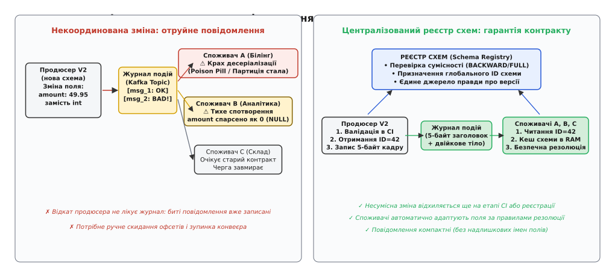
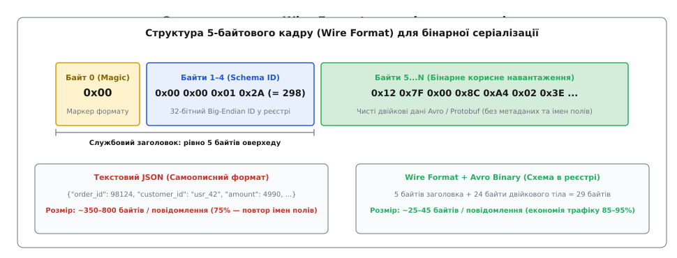
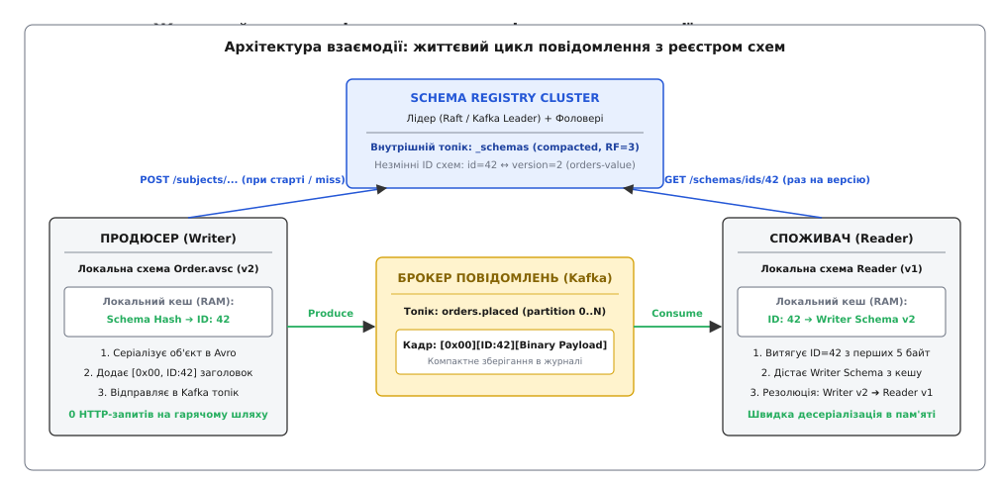
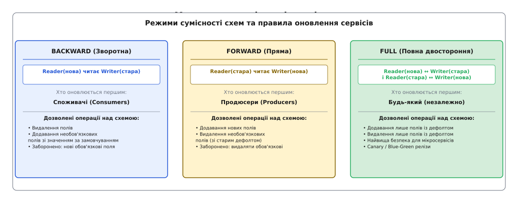
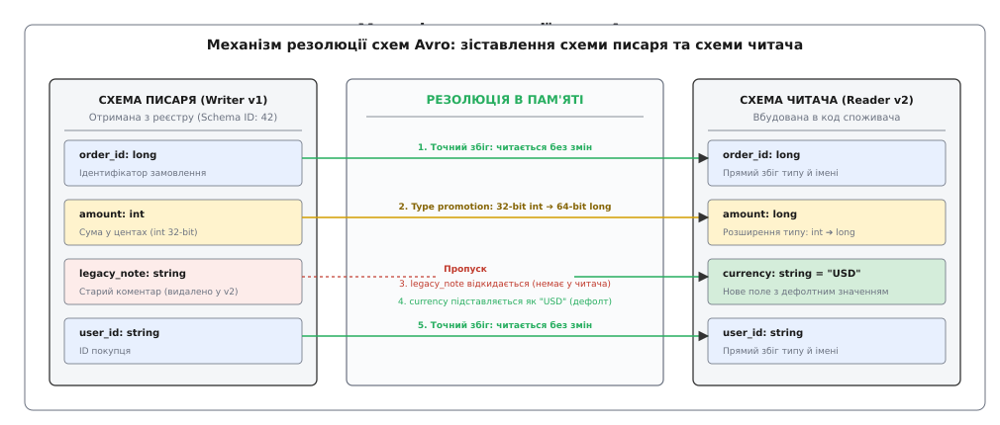

# Еволюція схем і schema-registry: контроль сумісності в розподілених системах

<preknowlist>
- [Журнал подій (Event Log)](root:sf-distributed/event-log) — впорядкований незмінний розподілений журнал повідомлень із тривалим зберіганням.
- [Виявлення сервісів (Service Discovery)](root:sf-distributed/service-discovery) — динамічна реєстрація та пошук мережевих адрес вузлів у кластері.
- [Формати серіалізації](root:com-protocol/data-serialization) — кодування структур даних у двійкові чи текстові послідовності байтів для передачі мережею.
- [Контракти даних](root:sf-data/data-contracts) — формальні угоди між продюсерами та споживачами про структуру, типи та семантику подій.
</preknowlist>

Розподілена платформа електронної комерції обробляє потік замовлень через чергу подій із пропускною здатністю 45 000 повідомлень на секунду. До єдиного топіка замовлень підключено 14 незалежних мікросервісів: модуль списання коштів, складський облік, служба доставки, розрахунок персональних знижок, антифрод-моніторинг, генератор фіскальних чеків та аналітичне сховище даних. Кожну з цих систем розробляє окрема автономна інженерна команда, яка має власний графік релізів і розгортає нові версії контейнерів по кілька разів на день без узгодження з сусідами.

Під час чергового оновлення сервісу оформлення кошика розробник змінює структуру події: поле грошової суми `amount` (яке раніше передавалося цілим числом у центах `4990`) перейменовують на `total_price`, а тип змінюють на дробове число `49.90`. Новий контейнер продюсера починає публікувати оновлені повідомлення в брокер.

Наслідки виникають миттєво і каскадно:
1. Шість сервісів (білінг, склад, антифрод) зазнають фатального збою десеріалізації: їхній код очікував поле `amount` і не знайшов його. Оскільки збій стається на етапі читання повідомлення, зміщення читання (англ. *consumer offset*) не просувається вперед. Уся черга обробки платежів повністю зупиняється — виникає стан «отруєного повідомлення» (англ. *poison pill*).
2. Три аналітичні сервіси зі слабкою типізацією не впали, проте мовчки підставили `null` або `0` замість суми замовлення. Протягом двадцяти хвилин аналітична база зафіксувала безкоштовну видачу товарів на суму 180 000 доларів, спотворивши фінансові звіти компанії.
3. Терміновий відкат версії продюсера до попереднього релізу не вирішує аварію: у незмінному журналі подій брокера вже надійно збережено понад 500 000 дефектних повідомлень. Будь-який споживач під час перезапуску чи повторного вичитування історії знову впирається в ту саму помилку.


*Зліва: некоординована зміна структури події блокує споживачів і псує дані в журналі. Справа: реєстр схем валідує сумісність ще до публікації та передає лише компактний числовий ідентифікатор.*

Ця катастрофа демонструє головну вразливість асинхронних розподілених систем: якщо контракт взаємодії не контролюється машинно на межі запису, система неминуче деградує в хаос через природну еволюцію коду окремих команд.

## Пастка самоопису та ціна бінарної компактності

Щоб зрозуміти, чому проблема форматів у чергах стоїть значно гостріше, ніж у синхронних HTTP-запитах, необхідно розглянути структуру самих даних.

У веб-розробці типовим рішенням для обміну даними є текстовий формат JSON (англ. *JavaScript Object Notation*). Головна його властивість — самоописність (англ. *self-describing*): кожне окреме повідомлення несе в собі не лише корисні значення, але й повні текстові назви всіх полів:

```json
{
  "order_identification_number": 98124019,
  "customer_account_reference": "usr_99214_enterprise",
  "transaction_timestamp_utc": "2026-08-20T11:15:00Z",
  "total_amount_in_cents": 4990
}
```

У цьому повідомленні корисні дані (числа та короткий рядок) займають близько 35 байтів, тоді як текстові ключі та службові символи розмітки забирають понад 190 байтів. Понад 80% мережевого трафіку, пам'яті брокера та дискового простору витрачається на багаторазову передачу однакових назв ключів. У системі, яка генерує один мільярд подій на добу, це перетворюється на терабайти мертвого оверхеду, на які витрачаються процесорні цикли парсерів і дисковий ввід-вивід.

Для усунення надлишковості в інженерії розподілених систем використовують бінарні формати серіалізації: Apache Avro, Google Protocol Buffers або Apache Thrift.

У форматі Apache Avro запис кодується як чиста послідовність двійкових байтів без імен полів, тегів чи роздільників. Одне й те саме замовлення в бінарному вигляді займає рівно 18 байтів. Проте бінарна компактність створює фундаментальну проблему:
* Двійковий потік байтів позбавлений будь-яких підказок про те, де закінчується одне поле і починається інше.
* Десеріалізатор не здатний прочитати жодного байта з отриманого масиву, якщо він не має точного опису структури — **схеми** (англ. *schema*, від грец. *σχῆμα* — форма, образ, будова), яка використовувалася продюсером під час кодування.

Якщо передавати повну JSON-схему (розміром 1.5–3 КБ) разом із кожним 18-байтним двійковим повідомленням, оверхед стане ще гіршим, ніж у текстовому JSON: розмір кадру зросте у 100 разів.

Історично розподілені системи вже намагалися розв'язати цю проблему через жорстко скомпільовані клієнтські заглушки в епоху CORBA та важкі XML-схеми в SOAP ([як розвивалася еволюція від монолітних IDL та XML-схем до потокових бінарних форматів](root:com-protocol/schema-registry/hist-schema-evolution-origins.md)). Сучасна архітектура знайшла інший вихід: відділити схему від тіла повідомлення і перенести управління нею в окремий інфраструктурний компонент.

## Анатомія кадрування: 5-байтовий заголовок Wire Format

Замість передачі тексту схеми в кожному повідомленні, у транспортний потік додають мінімальний стандартизований заголовок фіксованої довжини — **Confluent Wire Format**.

Кожне повідомлення, що записується в топік черги або журналу подій, компонується з трьох обов'язкових зон:


*Заголовок кадру додає рівно 5 службових байтів, перетворюючи сирі двійкові дані на однозначно версійоване повідомлення.*

1. **Байт 0 (Magic Byte):** Фіксований байт зі значенням `0x00`. Він слугує прапорцем формату, дозволяючи клієнту миттєво відрізнити структуроване версійоване повідомлення від сирого бінарного масиву чи legacy-форматів.
2. **Байти 1–4 (Schema ID):** 32-бітне беззнакове ціле число в мережевому порядку байтів (англ. *big-endian*). Це числовий ідентифікатор конкретної версії схеми, зареєстрованої в централізованій базі.
3. **Байти 5...N (Payload):** Двійковий потік корисного навантаження, згенерований бінарним серіалізатором (Avro або Protobuf).

Завдяки такому підходу оверхед метаданих становить рівно 5 байтів на повідомлення. Якщо корисне навантаження становить 30 байтів, повний розмір кадру в черзі дорівнює 35 байтам, що дає 90–95% економії смуги пропускання та пам'яті брокерів у порівнянні з JSON.

Повні технічні вимоги до бінарного кадру, формати для Protobuf з масивом індексів повідомлень та структуру кодів помилок зібрано в окремій специфікації ([специфікація кадру Wire Format та REST API реєстру схем](root:com-protocol/schema-registry/api-schema-registry-contract.md)).

## Архітектура реєстру схем: єдине джерело правди

Щоб числовий ідентифікатор `Schema ID: 42` мав однозначний сенс для всіх учасників обміну, у розподіленій інфраструктурі розгортають спеціалізований сервіс — **Реєстр схем** (англ. *Schema Registry*, від лат. *registrum* — книга записів, перелік).

Реєстр схем виконує роль високодоступної авторитетної бази даних для схем та централізованого арбітра правил їхньої зміни.


*Продюсер і споживач звертаються до реєстру схем лише при першому контакті з новою версією, зберігаючи нульову мережеву затримку на гарячому шляху повідомлень.*

Розгляньмо покроковий життєвий цикл повідомлення від створення об'єкта в коді продюсера до його матеріалізації в пам'яті споживача.

### Фаза 1. Реєстрація та серіалізація на боці продюсера
1. Продюсер ініціалізує подію з використанням локальної моделі даних або файлу схеми (наприклад, `OrderPlaced.avsc`).
2. Продюсер обчислює канонічний хеш (англ. *schema fingerprint*) структури й перевіряє свій внутрішній кеш у пам'яті (RAM Hash Map).
3. **Промах кешу (Cache Miss):** Якщо продюсер запустився вперше або схема змінилася, клієнт виконує HTTP-запит `POST /subjects/orders.placed-value/versions` до реєстру схем.
4. Реєстр схем виконує валідацію: перевіряє, чи не порушує нова схема встановлені правила сумісності з попередніми версіями цього суб'єкта.
5. Якщо сумісність підтверджено, реєстр зберігає схему, присвоює їй глобальний номер (наприклад, `42`) і повертає відповідь продюсеру. Якщо сумісність порушено — реєстр повертає помилку `409 Conflict`, і продюсер відмовляється відправляти небезпечні дані.
6. Продюсер записує зв'язку `Schema Hash → ID: 42` у свій локальний RAM-кеш.
7. Серіалізатор кодує об'єкт у бінарні байти Avro, додає попереду 5 байтів заголовка `[0x00, 0x00, 0x00, 0x00, 0x2A]` і публікує готовий пакет у топік брокера.
8. Усі наступні мільйони повідомлень використовують збережений у пам'яті `ID: 42`, виконуючи нуль HTTP-запитів до мережі.

### Фаза 2. Читання та десеріалізація на боці споживача
1. Споживач вичитує масив байтів із брокера подій.
2. Десеріалізатор перевіряє нульовий байт (`0x00`) і витягує наступні 4 байти, відновлюючи число `Schema ID: 42`.
3. Споживач перевіряє свій локальний кеш у пам'яті за ключем `ID: 42`.
4. **Промах кешу:** Якщо споживач уперше бачить цей ідентифікатор, він надсилає запит `GET /schemas/ids/42` до реєстру схем. Оскільки ідентифікатори в реєстрі є абсолютно незмінними (англ. *immutable*), отримана схема збережеться в пам'яті споживача назавжди.
5. Споживач отримує схему, за якою повідомлення було записано (**схема писаря**, англ. *Writer Schema*).
6. Бібліотека десеріалізації порівнює схему писаря зі своєю власною локальною скомпільованою схемою (**схема читача**, англ. *Reader Schema*) і виконує процедуру резолюції полів.
7. Об'єкт успішно відновлюється в пам'яті програми.

## Матриця сумісності: хто оновлюється першим

Головна функція реєстру схем полягає не просто у збереженні тексту JSON-файлів, а в **активному примусовому контролі сумісності** (англ. *compatibility enforcement*).

Коли інженер додає, видаляє або модифікує поле в схемі, виникає фундаментальне архітектурне питання: у якій послідовності команди повинні розгортати оновлені мікросервіси в продакшені?

Існує три базових режими сумісності, кожен із яких диктує суворий операційний регламент релізів:


*Режим сумісності диктує безпечну послідовність релізів: зворотний вимагає першочергового оновлення читачів, прямий — писарів, а повний усуває залежність між командами.*

### 1. Зворотна сумісність (BACKWARD)
* **Правило:** Нова версія схеми може читати дані, записані попередньою версією схеми:
```
Reader(V_new) ← Writer(V_old)
```
* **Дозволені зміни:**
  * Видалення існуючих полів.
  * Додавання нових **необов'язкових** полів зі значенням за замовчуванням (`default`).
* **Заборонено:** Додавання нових обов'язкових полів без `default`.
* **Порядок оновлення:** **СПОЖИВАЧІ ОНОВЛЮЮТЬСЯ ПЕРШИМИ**.
  * Спершу оновлюють усі мікросервіси-споживачі на нову схему. Вони спокійно продовжують читати старі повідомлення з черги, підставляючи дефолтні значення для відсутніх полів.
  * Лише після оновлення останнього споживача можна розгортати нову версію продюсера.

### 2. Пряма сумісність (FORWARD)
* **Правило:** Стара версія схеми може читати дані, записані новою версією схеми:
```
Reader(V_old) ← Writer(V_new)
```
* **Дозволені зміни:**
  * Додавання нових полів (старі споживачі їх просто ігноруватимуть).
  * Видалення необов'язкових полів (які мали значення за замовчуванням у старій схемі).
* **Заборонено:** Видалення обов'язкових полів.
* **Порядок оновлення:** **ПРОДЮСЕРИ ОНОВЛЮЮТЬСЯ ПЕРШИМИ**.
  * Спершу розгортають оновлений сервіс-продюсер, який починає відправляти розширені повідомлення. Старі споживачі успішно читають ці повідомлення, пропускаючи незнайомі нові поля.
  * Команди споживачів можуть оновлювати свої сервіси пізніше у будь-який зручний час.

### 3. Повна двостороння сумісність (FULL)
* **Правило:** Нова схема може читати старі повідомлення, а стара схема може читати нові повідомлення одночасно:
```
Reader(V_new) ↔ Writer(V_old)  ТА  Reader(V_old) ↔ Writer(V_new)
```
* **Дозволені зміни:** Тільки додавання та видалення полів, які **обов'язково мають значення за замовчуванням**.
* **Порядок оновлення:** **ДОВІЛЬНИЙ ПОРЯДОК (ANY ORDER)**.
  * Повна сумісність повністю усуває взаємне блокування між командами. Продюсери й споживачі можуть розгортатися незалежно, у будь-якій послідовності, через канареечні релізи (англ. *Canary Releases*) або стратегії *Blue-Green*.

### Зведена таблиця правил еволюції схем:

| Режим сумісності | Зміна схеми: Додавання поля | Зміна схеми: Видалення поля | Хто оновлюється першим | Ризик при порушенні черги |
|---|---|---|---|---|
| `BACKWARD` | Тільки з `default` | Будь-яке поле | **Споживачі** | Падіння старих споживачів при читанні нових повідомлень |
| `FORWARD` | Будь-яке поле | Тільки якщо мало `default` | **Продюсери** | Падіння оновлених споживачів при читанні старих повідомлень |
| `FULL` | Тільки з `default` | Тільки з `default` | **Будь-хто** | Повний захист від розсинхронізації релізів |

### Небезпека лінійної сумісності та транзитивні режими (TRANSITIVE)

За замовчуванням базові режими перевіряють сумісність нової схеми `V[N]` лише відносно попередньої версії `V[N-1]`.

У системах із тривалим зберіганням подій (Event Sourcing, лог-компактні топіки Kafka, озера даних HDFS/S3) дані зберігаються місяцями або роками. У топіку одночасно знаходяться записи, згенеровані схемами `V[1], V[2], V[3] … V[N]`.

Розгляньмо приклад прихованого дефекту при лінійній перевірці:
1. Версія 1 містить поле `user_name` без дефолту.
2. Версія 2 робить поле `user_name` необов'язковим, додаючи `default: "guest"`. Ця зміна є валідною згідно з `BACKWARD` відносно `V[1]`.
3. Версія 3 повністю видаляє поле `user_name`. Ця зміна є валідною згідно з `BACKWARD` відносно `V[2]`.
4. **Катастрофа:** Якщо новий споживач зі схемою `V[3]` спробує перечитати топік від початку (зміщення 0), він зустріне повідомлення версії `V[1]`, де поле `user_name` було обов'язковим, але відсутнє в `V[3]`. Якщо між типами виникла несумісність або пропущено логіку резолюції, конвеєр зламається.

Щоб запобігти цьому, використовують **транзитивні режими** (`BACKWARD_TRANSITIVE`, `FORWARD_TRANSITIVE`, `FULL_TRANSITIVE`). Вони вимагають, щоб нова версія `V[N]` була сумісною з **усіма без винятку** історичними версіями (`V[1] … V[N-1]`), коли-небудь зареєстрованими в цьому суб'єкті.

## Механіка резолюції схем у бінарних форматах

Як саме десеріалізатор зіставляє дані, якщо схема продюсера відрізняється від схеми споживача?

У форматі Apache Avro цей процес називається **резолюцією схем** (англ. *Schema Resolution*). Під час читання повідомлення бібліотека отримує два документи:
1. `Writer Schema`: точна структура, що відповідає `Schema ID` з кадру.
2. `Reader Schema`: структура, скомпільована в коді поточного застосунку.


*Механізм резолюції зіставляє поля за іменами та типами, автоматично підставляючи значення за замовчуванням для нових полів і відкидаючи зайві.*

Процес виконується за чітким детермінованим алгоритмом:
1. **Зіставлення за іменами та псевдонімами:** Для кожного поля зі схеми читача шукається однойменне поле у схемі писаря. Схеми Avro підтримують атрибут `aliases` (псевдоніми): якщо поле було перейменовано з `legacy_id` на `order_id`, читач знаходить старе значення за аліасом.
2. **Підстановка значень за замовчуванням:** Якщо поле присутнє у схемі читача, але відсутнє у схемі писаря (продюсер ще не знає про це поле), рушій резолюції вичитує значення з атрибута `default` схеми читача та ініціалізує змінну ним.
3. **Ігнорування видалених полів:** Якщо поле присутнє у схемі писаря, але відсутнє у схемі читача (споживач відмовився від застарілих даних), десеріалізатор коректно зчитує довжину двійкового блоку та пропускає відповідні байти, не виділяючи під них пам'ять.
4. **Просування типів (Type Promotion):** Avro дозволяє автоматичне розширення числових типів за умови відсутності втрати точності:
   * 32-бітне ціле `int` безпечно конвертується у 64-бітне `long`.
   * 32-бітне `float` конвертується у 64-бітне `double`.
   * Зворотне звуження (`long` у `int`) категорично заборонене й генерує виняток, оскільки призведе до переповнення розрядної сітки.

### Специфіка Protocol Buffers: незмінність номерів тегів

У Google Protocol Buffers резолюція спирається не на текстові імена полів, а на **числові теги**:

```protobuf
message OrderEvent {
  int64 order_id = 1;
  int64 amount_cents = 2;
  string currency = 3;
}
```

Головне правило еволюції в Protobuf: **ніколи не змінювати й повторно не використовувати номери тегів**.

Якщо розробник видаляє поле `amount_cents = 2`, а через пів року інший розробник додає поле `string promo_code = 2`, виникне приховане спотворення пам'яті: старий споживач спробує прочитати двійковий рядок коду знижки як 64-бітне число суми замовлення.

Для захисту від цієї помилки в Protobuf застосовують ключове слово `reserved`:

```protobuf
message OrderEvent {
  int64 order_id = 1;
  // Поле 2 видалено назавжди: компілятор заблокує спробу його повторного використання
  reserved 2;
  reserved "amount_cents";

  string currency = 3;
  int64 total_price_cents = 4;
}
```

### Еволюція складних типів: переліки, об'єднання та логічні типи

Окрім базових числових та рядкових полів, схеми містять складні структури даних, еволюція яких приховує тонкі архітектурні пастки:

1. **Пастка переліків (Enums):**
   * Якщо продюсер додає новий символ до переліку (наприклад, статус замовлення `REFUNDED` до списку `[PENDING, PAID, CANCELLED]`), старий споживач зі схемою `V[1]` не знатиме цього значення й зазнає аварії десеріалізації.
   * У форматі Apache Avro версій до 1.9.0 додавання символу переліку вважалося безумовно несумісною зміною. Починаючи з Avro 1.9.0, специфікація підтримує атрибут `default` для переліків: розробник зобов'язаний призначити резервне значення (наприклад, `UNKNOWN`), яке бібліотека підставить старому читачеві у разі виявлення незнайомого символу.
2. **Еволюція об'єднань (Unions) та необов'язкових полів:**
   * Необов'язкове поле в Avro оголошується як об'єднання з типом `null`: `["null", "string"]`. За правилами Avro, типове значення поля (`default`) **зобов'язане відповідати першому типу в масиві об'єднання**. Якщо першим вказано `"null"`, значення за замовчуванням має бути `null`:
     ```json
     {"name": "discount_code", "type": ["null", "string"], "default": null}
     ```
   * Спроба оголосити `["string", "null"]` із дефолтом `null` порушує специфікацію і відхиляється реєстром схем.
3. **Логічні типи (Logical Types):**
   * Логічні типи (наприклад, грошові суми `decimal(18, 4)`, часові мітки `timestamp-millis` або ідентифікатори `uuid`) кодуються поверх базових типів `bytes`, `long` або `string`.
   * Зміна параметрів логічного типу (наприклад, зменшення масштабу чи точності десяткового числа) розглядається валідатором як несумісна зміна, оскільки споживач отримає обрізані дані без попередження.

## Канонічна нормалізація та обчислення цифрових відбитків

У реальній розробці два інженери можуть написати визначення однієї й тієї самої схеми з різним форматуванням: один додасть коментарі `doc` та розставить відступи, інший змінить порядок оголошення властивостей у JSON-об'єкті.

Якщо порівнювати текст схем як звичайні рядки, реєстр створив би два різні `Schema ID` для однакових структур даних, що призвело б до надлишкового роздування внутрішньої бази.

Щоб гарантувати детермінованість, реєстр схем приводить будь-який вхідний JSON до **канонічної форми парсингу** (англ. *Parsing Canonical Form*):
* Видаляються всі пробільні символи за межами рядкових літералів.
* Усі службові JSON-ключі сортуються в строгому алфавітному порядку (`"fields"` перед `"name"`, `"name"` перед `"type"`).
* Видаляються несуттєві метадані (коментарі розробників, псевдоніми та користувацькі теги документації).
* Від отриманого нормалізованого рядка обчислюється цифровий відбиток (англ. *fingerprint*) за 64-бітним алгоритмом `CRC-64-AVRO` або 256-бітним `SHA-256`.

Якщо обчислений відбиток збігається з раніше зареєстрованим у межах суб'єкта, реєстр схем повертає вже існуючий числовий ідентифікатор, запобігаючи створенню дублікатів версій.

## Внутрішній устрій та консенсус реєстру схем

Реєстр схем сам по собі є розподіленим сервісом, що працює в кластері з кількох екземплярів (вузлів) для забезпечення відмовостійкості.

Постає питання: як кластер реєстру забезпечує абсолютну узгодженість числових `Schema ID`, якщо два розробники одночасно спробують зареєструвати різні версії схеми для одного суб'єкта?

Реєстр схем використовує архітектуру з **виділеним лідером** (англ. *Primary-Replica / Leader Election*), де роль розподіленого журналу транзакцій виконує сам кластер брокерів:

1. **Системний журнал `_schemas`:** Усі реєстрації схем записуються в спеціальний внутрішній топік брокера з назвою `_schemas`. Цей топік має рівно **одну партицію** (`partitions = 1`), фактор реплікації 3 (`replication.factor = 3`) та політику компактизації логу (`cleanup.policy = compact`).
2. **Лінійний консенсус ID:** Завдяки єдиній партиції топіка `_schemas` брокер надійно серіалізує всі операції запису в часі. Зміщення повідомлення (англ. *log offset*) у топіку `_schemas` стає глобальним унікальним `Schema ID`. Це математично унеможливлює стан перегонів (англ. *race condition*) чи дублювання номерів схем.
3. **Вибори лідера:** Серед запущених вузлів реєстру схем один обирається Лідером (через механізм координації Kafka або алгоритм Raft).
   * Якщо клієнт надсилає запит на запис (`POST`) до вузла-фоловера, той прозоро перенаправляє HTTP-запит на лідера.
   * Лідер валідує сумісність, формує запис і пушить його в топік `_schemas`.
4. **Локальна матеріалізація стану:** Усі вузли реєстру схем (як лідер, так і фоловери) постійно вичитують топік `_schemas` від нульового зміщення до кінця, формуючи повну незмінну копію бази даних схем у власній оперативній пам'яті (In-Memory State Store).
5. **Миттєве читання без блокувань:** Будь-який запит на вичитування схеми за ідентифікатором (`GET /schemas/ids/42`) обслуговується будь-яким найближчим вузлом реєстру прямо з оперативної пам'яті за частки мілісекунди без навантаження на диск чи брокери.

### Мультирегіональна реплікація та запобігання колізіям ID
Коли розподілена система розгортається у кількох географічних дата-центрах (наприклад, у Європі та Північній Америці), постає проблема синхронізації схем між незалежними кластерами Kafka:
* **Проблема локальних ID:** Якщо європейський та американський реєстри схем почнуть незалежно призначати числові ідентифікатори, одна й та сама схема `OrderPlaced` отримає `id: 42` в одному регіоні та `id: 108` в іншому. Повідомлення, скопійовані між регіонами утилітами на кшталт MirrorMaker 2, не зможуть бути десеріалізовані місцевими споживачами через підміну сенсу ID.
* **Архітектура Schema Linking (Експортери схем):** Для запобігання колізіям один регіон призначається основним (Primary), або використовується механізм просторів контексту (англ. *Context-Scoped Subjects*). Спеціалізований фоновий процес (Schema Exporter) автоматично транслює схеми з первинного реєстру до вторинних, зберігаючи канонічний зв'язок ідентифікаторів або транслюючи заголовки кадрування на льоту під час міжкластерної реплікації.

## Порівняльний аналіз реалізацій реєстрів схем

В індустрії розподілених систем існує кілька незалежних реалізацій реєстрів схем із відкритим та пропрієтарним кодом:

| Критерій порівняння | Confluent Schema Registry | Aiven Karapace | AWS Glue Schema Registry |
|---|---|---|---|
| **Мова реалізації** | Java | Python (AsyncIO) | Java / Хмарний сервіс AWS |
| **Базове сховище консенсусу** | Топік Kafka `_schemas` (Single Partition) | Топік Kafka `_schemas` / PostgreSQL | Сервісна база AWS (DynamoDB / S3) |
| **Підтримувані формати** | Avro, Protobuf, JSON Schema | Avro, Protobuf, JSON Schema | Avro, JSON Schema, Protobuf |
| **Міжсхемні посилання (References)** | Повна підтримка | Повна підтримка | Обмежена підтримка |
| **Модель лідерства** | Вибори лідера через координатор Kafka | Вибори через Kafka group coordinator | Безлідерна хмарна реплікація AWS |
| **Сумісність із клієнтами** | Еталонний стандарт REST API | 100% сумісність із клієнтами Confluent | Власний SDK / адаптер сумісності |

## Інженерія відмовостійкості: кешування, аварії та захист у CI

Реєстр схем винесено з критичного шляху передачі повідомлень (англ. *data plane*), що робить архітектуру надзвичайно стійкою до інфраструктурних аварій.

### Поведінка під час повного падіння кластера реєстру схем
Якщо всі вузли реєстру схем одночасно виходять із ладу або стається мережеве розділення (англ. *network partition*):
* **Працюючі продюсери та споживачі продовжують роботу на повній швидкості.** Їхні вбудовані серіалізатори вже мають усі активні схеми та їхні `Schema ID` у локальних таблицях RAM. Мільйони повідомлень на секунду продовжують передаватися крізь брокери без жодної затримки.
* **Збій виникає лише для нових подій:** помилка станеться тільки тоді, коли продюсер спробує зареєструвати абсолютно нову структуру схеми або коли свіжозапущений под споживача зазнає промаху локального кешу.

### Карантин та ізоляція дефектних повідомлень (Dead Letter Queue)
Що відбувається, якщо в топік усе ж потрапило пошкоджене повідомлення (наприклад, унаслідок збою диска або прямого запису невалідної послідовності байтів стороннім клієнтом)?

Якщо споживач зустрічає невідомий магічний байт або неіснуючий `Schema ID`, аварійне завершення процесу є неприпустимим, оскільки воно заблокує обробку всієї партиції. Замість падіння споживач застосовує шаблон **Черги мертвих листів** (англ. *Dead Letter Queue*, DLQ):
1. Десеріалізатор перехоплює виняток парсингу (`SerializationException`).
2. Сире двійкове повідомлення загортається у конверт із діагностичними заголовками:
   ```http
   X-Error-Reason: Invalid Magic Byte 0xFF (Expected 0x00)
   X-Original-Topic: orders.placed
   X-Original-Partition: 3
   X-Original-Offset: 9812401
   X-Exception-Timestamp: 2026-08-20T11:20:00Z
   ```
3. Пакет публікується в карантинний топік `orders.placed.DLQ`.
4. Зміщення в основному топіку успішно фіксується (англ. *commit offset*), і конвеєр продовжує безперервну обробку наступних валідних повідомлень.

### Контроль якості в пайплайнах розробки (Shift-Left)
Покладатися виключно на відхилення невалідної схеми реєстром у продакшені — небезпечна практика, оскільки це зупиняє розгортання в момент викатки коду.

Сучасні інженерні стандарти вимагають інтеграції перевірки сумісності у фазу компіляції та автоматичних тестів CI/CD:
1. Файли схем (`.avsc`, `.proto`, `.json`) зберігаються в репозиторії поруч із вихідним кодом мікросервісу.
2. Плагін збірки (наприклад, у GitHub Actions або GitLab CI) звертається до тестового реєстру схем у режимі dry-run через endpoint перевірки сумісності:
   ```http
   POST /compatibility/subjects/orders.placed-value/versions/latest
   ```
3. Якщо розробник випадково видалив поле без дефолту або звузив числовий тип, білд у CI негайно падає з червоним статусом і детальним звітом про несумісність. Пулл-реквест блокується до виправлення контракту.

Повну реалізацію клієнтського серіалізатора з потокобезпечним LRU-кешем у пам'яті та скрипти валідації для CI наведено в інженерному проєкті ([реалізація клієнтського кадрування, LRU-кешу та перевірки сумісності схем у CI](root:com-protocol/schema-registry/proj-schema-compatibility-ci.md)).

## Підсумкова архітектурна дисципліна

Реєстр схем перетворює приховані неформальні домовленості між інженерними командами на суворий, машинно перевірюваний і версійований контракт.

Винесення метаданих у 5-байтовий заголовок вирішує дилему ефективності: система отримує граничну швидкість і компактність двійкових бінарних форматів, зберігаючи повну свободу незалежного розгортання сотень мікросервісів без страху поламати суміжні підсистеми.
