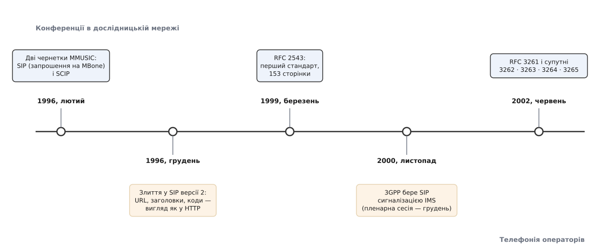

# 📜 Народження SIP: із запрошень на конференцію — у телефонну мережу світу

SIP придумали не телефоністи й не для телефонії: у 1996 році в дослідницькій мережі MBone бракувало способу **покликати конкретну людину** на багатоадресну конференцію, і протокол народився саме як механізм запрошення. Усе, що сьогодні виглядає дивно в телефонному SIP — адреса, схожа на поштову, розгалуження виклику на кілька апаратів, байдужість до самого медіа — залишилося з тих часів, коли телефонного дзвінка в задачі не було зовсім.

*Шість років між академічною чернеткою й протоколом, на якому стоїть мобільна телефонія. Дати — за архівом чернеток IETF і RFC Editor.*

### Мережа, у якій нікого не можна було покликати

MBone (від *Multicast Backbone* — «багатоадресний хребет») з 1992 року був накладеною мережею, де працювала [багатоадресна розсилка](topic:com-transport/multicast-and-discovery): один потік ішов усім охочим одразу. На ньому транслювали засідання IETF, семінари, запуски шатлів. Щоб дізнатися, що зараз іде, вмикали «довідник сеансів» — програму, яка слухала оголошення й показувала список: назва, час, адреса групи, кодеки. Опис сеансу мав формат [SDP](topic:com-protocol/rtsp-sdp), а розсилали ці оголошення **всім** — по тій самій багатоадресній розсилці.

І тут видно дірку. Оголошення — це афіша на стовпі: вона висить для кожного, хто йтиме повз. Але «повз» треба ще йти. Якщо конференція на трьох і починається за хвилину, афіша не годиться: треба **достукатися особисто** — знайти людину там, де вона зараз, змусити її апарат подати звук і дочекатися відповіді «так» або «ні». Оголошення нікого не питає; запрошення питає. Це різні дії, і другої в MBone не було.

### Дві чернетки одного лютого

У лютому 1996 року в робочій групі MMUSIC (*Multiparty Multimedia Session Control*) організації IETF з'явилися одразу дві незалежні відповіді на цю дірку.

Перша — `draft-ietf-mmusic-sip-00`, «Session Invitation Protocol» («протокол запрошення на сеанс»), автори **Марк Гендлі** (Mark Handley, тоді Університетський коледж Лондона — той-таки автор інструментів MBone і співавтор SDP) і **Ів Скулер** (Eve Schooler, Каліфорнійський технологічний інститут), яка керуванням багатосторонніми конференціями займалася ще з кінця 1980-х, у системі MMCC в ISI. Друга — `draft-ietf-mmusic-scip-00` від 22 лютого 1996 року, «Simple Conference Invitation Protocol» («простий протокол запрошення на конференцію») авторства **Геннінга Шульцрінне** (Henning Schulzrinne, Колумбійський університет, співавтор [RTP](topic:com-protocol/rtp-rtcp)). SCIP уже тоді пропонував те, що згодом стало прикметою SIP: упізнавати людину за адресою **поштового зразка**, переадресовувати виклик услід за нею й уміти стикуватися зі світом рекомендацій ITU-T.

Дві чернетки на одну задачу — звична для IETF розв'язка: їх злили. 2 грудня 1996 року вийшов `draft-ietf-mmusic-sip-01` за підписом усіх трьох, і в тексті прямо сказано, що документ є результатом злиття двох попередніх. Ім'я лишилося від першої чернетки, лише «invitation» стало «initiation» — «започаткування»: протокол уже не тільки запрошував, а й відкривав сеанс. Саме тоді ж він набув свого вигляду — запозичив у HTTP усе, що можна було запозичити: рядок запиту з методом, заголовки через двокрапку, тризначні коди відповідей, адресу у вигляді URL.

Через два роки з гаком, у **березні 1999-го**, ця лінія стала стандартом: **RFC 2543**, «SIP: Session Initiation Protocol», Proposed Standard, 153 сторінки, чотири автори — до трьох попередніх додався **Джонатан Розенберг** (Jonathan Rosenberg), тоді з Bell Labs. Розділити тут ролі варто чесно: ідея запрошення й перші чернетки — Гендлі, Скулер, Шульцрінне; фах доведення її до придатної до втілення специфікації, а потім і до другого видання — переважно Розенберг, який став першим автором RFC 3261 і майже всіх супутніх документів. Упровадження ж у мережах не робив ніхто з них: це вже виробники апаратів і оператори.

### Чому текст переміг двійковий H.323

На той момент протокол для мультимедіа поверх пакетних мереж уже існував і був старший. [**H.323**](topic:com-protocol/h323) ITU-T ухвалили 11 листопада 1996 року — рівно тоді, коли автори SIP зводили свої чернетки докупи. Назва першої редакції каже все про задум: «Візуальні телефонні системи й обладнання для локальних мереж, що не гарантують якості обслуговування». H.323 виріс із телефонії й тягнув її спадок: сигналізація на основі Q.931, тобто того самого набору повідомлень, що ставить дзвінки в цифровій телефонній мережі, а кодування — двійкове, за схемами ASN.1. Прочитати таке очима не можна; щоб побачити, що не так, потрібен інструмент, який знає схему.

Далі йде улюблена версія цієї історії: мовляв, текст переміг двійкове, бо текст читати легше. Це правда, але не вся, і як пояснення вона слабка — двійковий формат HTTP/2 ніхто не називає поразкою. Важило радше інше, і кожен пункт випливає з того, ким і як протокол писався.

Перше — **як його розширювати**. У SIP невідомий заголовок мовчки ігнорують, а новий метод додають окремим документом на кілька сторінок; у світі ITU-T зміна формату означає нову редакцію рекомендації, узгоджену цілком. Друге — **скільки коштує вхід**: чернетки й RFC лежать відкрито й безоплатно, рекомендації ITU тоді треба було купувати, і для студента чи стартапу це стіна. Третє — **готове знаряддя**: SIP брав із вебу вже зроблене — адреси-URL, пошук серверів через DNS, автентифікацію Digest, тіла повідомлень у форматі MIME, — тож стек будувався з наявних цеглин. Четверте, і на практиці вирішальне, — вибір 3GPP, про який далі.

Чесно й про інший бік: у перші роки H.323 виграв ринок. Шлюзи операторів і системи відеозв'язку кінця 1990-х були переважно H.323, бо він був готовий тоді, коли SIP іще дописували. SIP забрав спершу корпоративні станції та інтернет-телефонію, а потім — мережі мобільних операторів; відеоконференції ж пішли своїм шляхом і врешті осіли на [WebRTC](topic:com-transport/webrtc). Тож це була не одна битва, а кілька різних, і виграні вони в різні роки.

### RFC 3261: перше видання не витримало посередників

За три роки життя RFC 2543 стало видно, що специфікацію треба не латати, а переписувати. **У червні 2002 року** вийшов **RFC 3261** — 269 сторінок замість 153, вісім авторів на чолі з Розенбергом, і разом із ним одразу чотири супутні документи: **RFC 3262** (надійна доставка проміжних відповідей, метод `PRACK`), **RFC 3263** (як за іменем домену знайти сервер — через записи DNS NAPTR і SRV), **RFC 3264** (модель «пропозиція — відповідь» над SDP) і **RFC 3265** (підписка на події, `SUBSCRIBE`/`NOTIFY`, Адам Роуч).

Сам перелік показує, що саме боліло: усе це — речі, які в RFC 2543 або описані натяком, або лишені на розсуд того, хто пише код. Три поправки варто назвати окремо.

**Маршрут запиту.** У 2543 проксі, ведучи запит за списком `Route`, **затирав** адресу призначення в рядку запиту (так зване суворе маршрутування). Наслідок — початкову адресу вже не відновити, і будь-який сервер посередині ламав те, чого не розумів. RFC 3261 увів вільне маршрутування: рядок запиту лишається недоторканим, а посередники додають себе окремим параметром — і тепер шлях можна пройти, нічого не втративши.

**Ідентифікатор транзакції.** Мітка `branch` у заголовку `Via` мала бути унікальною, але в 2543 не була нею напевно, і два різні запити могли злитися в один. RFC 3261 зажадав, щоб мітка починалася з семи умовних символів `z9hG4bK`. Вони нічого не означають — це просто підпис «мітку зроблено за новими правилами»: сім символів досить довгі, щоб жодна давня реалізація випадково їх не згенерувала. Заразом шар транзакцій нарешті описали як явні скінченні автомати, а не як побажання.

**Безпека.** Схему на основі PGP з тексту прибрали, автентифікацію Basic — паролем відкритим текстом — заборонили, лишивши Digest.

### Листопад 2000: телефонія бере протокол конференцій

Найбільше в долі SIP важило рішення, ухвалене поза IETF. Восени 2000 року консорціум **3GPP** проєктував мультимедійну підсистему IMS — ту частину мобільної мережі, де голос і відео мали піти по IP замість комутації каналів, — і вибирав сигналізацію. Робоча група CN1 засідала з жовтня, зібралася в Кардіффі 20–24 листопада 2000 року, а результат винесла на пленарну сесію TSG CN у Бангкоку 6–8 грудня. Вибір упав на SIP; звідси й дата «листопад 2000», яку зазвичай наводять, — це рішення робочої групи, а не формальна публікація стандарту. IMS увійшов до п'ятого випуску специфікацій 3GPP, а свої вимоги до протоколу консорціум згодом переклав мовою IETF окремим документом, RFC 4083.

Наслідок вийшов не зовсім той, на який розраховували автори. Протокол, писаний для купки дослідників, що збираються на семінар, дістав за абонентів мільярди телефонів — і те, що добре працювало в академічній мережі, довелося підпирати. Багатослівний текст, головна принада SIP, на повільному радіоканалі коштує секунд затримки перед з'єднанням — тож для IMS довелося написати окремий стиск сигналізації, SigComp (RFC 3320). Знадобилися й власні заголовки з префіксом `P-`, і сувора модель довіри між мережами операторів, і тарифікація. Тож дивна для телефонії риса SIP — те, що ім'я вказує на людину, а не на дріт, і що виклик роздвоюється на всі її апарати, — не є ні винаходом телефоністів, ні їхнім побажанням. Це слід задачі 1996 року: покликати конкретну людину на конференцію, хай де вона зараз сидить.
