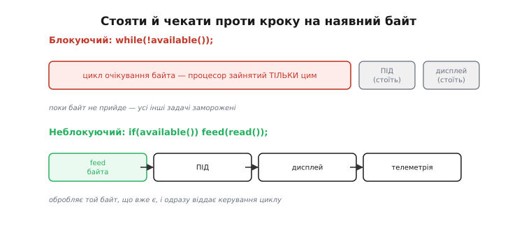
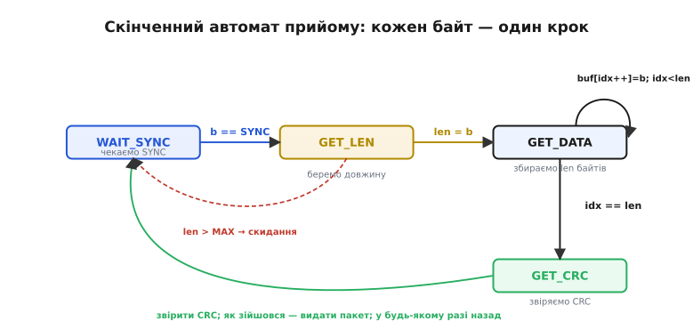
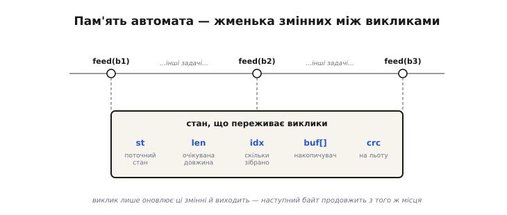
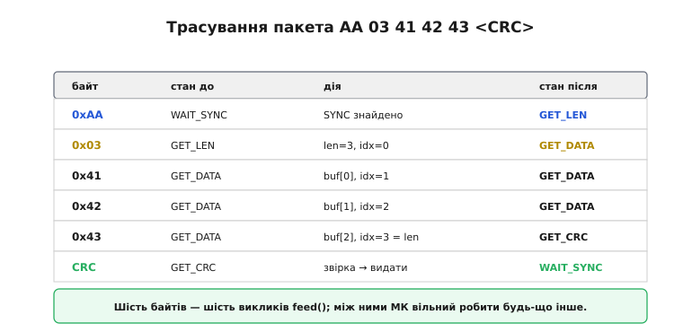
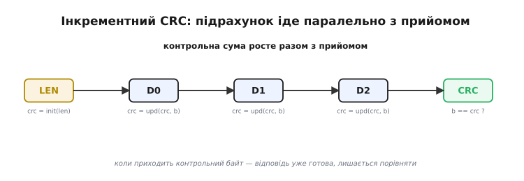
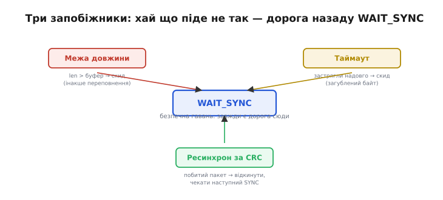
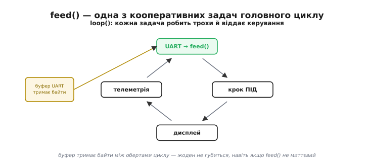

# Розбір потоку

Лінія зв'язку віддає програмі **потік** байтів — рівну низку, у якій немає жодної мітки, де закінчилося одне повідомлення й почалося наступне. UART, [спроєктований пакет](topic:com-transport/packet-design) чи будь-яка інша послідовна шина дають той самий сирий струмінь: байт, байт, байт. Щоб із цього струменя дістати осмислені повідомлення, потрібні дві речі — **кадрування** (англ. *framing*, «обрамлення»: домовленість, як розпізнати межі пакета в суцільному потоці) і той, хто це кадрування читає, — **розбирач** (англ. *parser*, від латин. *pars* — «частина»: він розкладає потік на частини). А оскільки байти прибувають у [буфер прийому](topic:com-transport/flow-control) повільно й непередбачувано, розбирати їх треба так, щоб програма ні на мить не спинялася: вона ж мусить робити сто інших справ — крутити ПІД-регулятор, оновлювати дисплей, слати телеметрію. Інструмент, що поєднує обидві вимоги, — **скінченний автомат** (англ. *finite state machine*: пристрій з кількох наперед відомих станів і переходів між ними). Він обробляє по одному байту за раз, **пам'ятає**, де зупинився, і ніколи не змушує програму чекати.

### Потік без меж повідомлень

Перше, що варто усвідомити: лінія не передає «повідомлень». Вона передає байти — і тільки. Відправник може надіслати три пакети поспіль, а може зробити паузу посеред одного; приймач бачить лише струмінь чисел і сам мусить здогадатися, де проходять межі. Саме тому будь-який послідовний протокол домовляється про **кадр** — впізнаваний візерунок, що окреслює пакет: маркер початку (часто його звуть **преамбулою**, від латин. *prae* — «перед» + *ambulare* — «йти»: те, що йде попереду даних), поле довжини, самі дані й контрольна сума наприкінці. Без такої домовленості потік байтів — просто шум, з якого нічого не вичитати.

Із цього випливає головна робота розбирача: не «прочитати повідомлення» (його як цілісної одиниці в лінії немає), а **назбирати** його з окремих байтів, упізнаючи дорогою елементи кадру. І робити це доводиться наосліп, по одному байту, бо саме так вони й приходять.

### Чому не можна «стояти й чекати»

Спокуслива на вигляд конструкція «чекай, поки прийде байт, тоді бери» насправді — пастка. Поки програма крутиться в циклі очікування, мікроконтролер **не робить більше нічого**: не реагує на давачі, не оновлює керування, не обслуговує інші лінії.


*Дві стратегії прийому. Угорі: блокуючий `while(!available());` застрягає в очікуванні — усі інші задачі стоять, поки не прийде байт. Унизу: неблокуючий підхід — `if(available()) feed(read());` — обробляє той байт, що вже є, і одразу віддає керування циклу; між байтами спокійно працює решта програми.*

Різниця принципова. Блокуючий код **присвоює собі** процесор, доки лінія не зволить надіслати байт; а лінія повільна (на 9600 бод один [кадр UART](topic:com-devices/uart-frame) іде ≈1 мс — для процесора це вічність). Неблокуючий код працює навпаки: він **ніколи не чекає**, а лише реагує на те, що вже прийшло, і миттєво повертає керування. Уся хитрість у тому, як обробити **частину** пакета й коректно продовжити з наступним байтом — і саме це робить автомат.

> 🔧 **Навіщо це.** На борту дрона чи будь-якого апарата прийом даних — лише одна з багатьох задач, і найповільніша. Якщо дозволити їй блокувати процесор, ПІД-регулятор пропустить такт, давач не зчитається вчасно, апарат смикнеться. Неблокуючий розбір — це не оптимізація «на потім», а умова, щоб зв'язок узагалі співіснував із керуванням реального часу.

### Скінченний автомат прийому

Ідея автомата: розбити прийом на кілька **станів**, і в кожен момент пам'ятати, у якому ми зараз. Кожен прийнятий байт просуває автомат рівно на один крок — і це все, що робить виклик; далі керування повертається.


*Чотири стани прийому. WAIT_SYNC — відкидаємо все, поки не побачимо SYNC. GET_LEN — запам'ятовуємо довжину. GET_DATA — збираємо рівно len байтів, лишаючись у цьому стані. GET_CRC — звіряємо CRC й повертаємось до WAIT_SYNC. Підписи на стрілках — умови переходів; пунктирна — захисний скид, якщо len завелика.*

Прочитаймо діаграму як історію одного пакета. Спершу автомат у **WAIT_SYNC** — ігнорує всі байти, поки не натрапить на SYNC; це і є те [самовідновлення, що його дає байт-маркер пакета](topic:com-transport/packet-design). Побачив SYNC — переходить у **GET_LEN**, де наступний байт стає довжиною. У **GET_DATA** автомат лишається й накопичує байти, аж поки їх не набереться рівно `len` — тоді переходить у **GET_CRC**. Там приймає контрольний байт, звіряє — і **в будь-якому разі** повертається в WAIT_SYNC, готовий до наступного пакета (видавши повідомлення, якщо CRC зійшовся).

Цей повернення в WAIT_SYNC з будь-якого стану — не випадковість, а суть **ресинхронізації**. Якщо в потоці трапився збій — загубився байт, прийшло сміття, побився пакет, — автомат не «зависає» назавжди: він відкидає недоладне й знову полює на SYNC. Так розбирач сам відновлює лад у потоці, що його не контролює.

### Стан, що живе між викликами

Що ж робить цей автомат неблокуючим? Те, що його «пам'ять» — кілька змінних — **переживає** між викликами `feed()`. Виклик не тримає процесор; він лише оновлює ці змінні й виходить, а наступний байт продовжить з того самого місця.


*Що переживає виклики. Між викликами feed() зберігаються `st` (поточний стан), `len` (очікувана довжина), `idx` (скільки даних уже зібрано), `buf[]` (накопичувач) і `crc` (що рахується на льоту). Саме ця жменька змінних дає автоматові змогу «пам'ятати» половину зібраного пакета, нічого не блокуючи.*

Це принципова відмінність від звичайної функції, що відпрацювала й забула все. Автомат-розбирач **зберігає контекст**: для нього байт, який щойно прийшов, має сенс лише в світлі того, що було раніше. Тому його стан тримають у змінних, які не зникають між викликами — статичних або полях структури. Забути про це — типова помилка: якщо `idx` чи `st` обнуляються щовиклику, автомат ніколи не збере й двох байтів поспіль.

### Трасування: байт за байтом

Найкраще автомат розкривається на трасуванні. Проженімо крізь нього приклад [пакета](topic:com-transport/packet-design) — `AA 03 41 42 43 <CRC>`.


*Шість байтів — шість переходів. SYNC переводить у GET_LEN; довжина 3 — у GET_DATA; три байти даних накопичуються (на третьому idx досягає len); контрольний байт звіряється, пакет видається, автомат вертається у WAIT_SYNC. Між цими шістьма викликами мікроконтролер вільний робити будь-що інше.*

**Приклад (повний побайтовий автомат-розбирач кадру на C).** Кадр: преамбула `0xAA`, байт довжини, рівно стільки байтів даних, далі однобайтовий CRC. Функцію `feed()` викликають на кожен прийнятий байт; вона робить крихітну роботу й виходить.

:::tabs
```c
#include <stdint.h>
#define SYNC   0xAA
#define MAXLEN 32

enum state { WAIT_SYNC, GET_LEN, GET_DATA, GET_CRC };

static enum state st = WAIT_SYNC;        // стан, що живе між викликами
static uint8_t buf[MAXLEN];
static uint8_t len, idx, crc;

// простий XOR-CRC задля прикладу: ініціалізація і покрокове оновлення
static uint8_t crc_init(uint8_t b)            { return b; }
static uint8_t crc_update(uint8_t c, uint8_t b) { return c ^ b; }

void feed(uint8_t b) {
    switch (st) {
    case WAIT_SYNC:
        if (b == SYNC) st = GET_LEN;          // інакше просто ігноруємо
        break;
    case GET_LEN:
        if (b == 0 || b > MAXLEN) {           // захист: 0 або завелика довжина
            st = WAIT_SYNC; break;
        }
        len = b; idx = 0; crc = crc_init(b);  // CRC накриває й байт довжини
        st = GET_DATA;
        break;
    case GET_DATA:
        buf[idx++] = b;
        crc = crc_update(crc, b);             // CRC рахуємо на льоту
        if (idx == len) st = GET_CRC;
        break;
    case GET_CRC:
        if (b == crc) handle_packet(buf, len);// цілий пакет — у роботу
        st = WAIT_SYNC;                        // у будь-якому разі — наново
        break;
    }
}
```
```python
SYNC   = 0xAA
MAXLEN = 32

WAIT_SYNC, GET_LEN, GET_DATA, GET_CRC = range(4)


class Parser:
    # весь стан — у полях; він переживає між викликами feed()
    def __init__(self, on_packet):
        self.st = WAIT_SYNC
        self.buf = bytearray()
        self.length = 0
        self.crc = 0
        self.on_packet = on_packet

    def feed(self, b):
        if self.st == WAIT_SYNC:
            if b == SYNC:
                self.st = GET_LEN          # інакше просто ігноруємо
        elif self.st == GET_LEN:
            if b == 0 or b > MAXLEN:       # захист: 0 або завелика довжина
                self.st = WAIT_SYNC
                return
            self.length = b
            self.buf = bytearray()
            self.crc = b                   # CRC накриває й байт довжини
            self.st = GET_DATA
        elif self.st == GET_DATA:
            self.buf.append(b)
            self.crc ^= b                  # CRC рахуємо на льоту
            if len(self.buf) == self.length:
                self.st = GET_CRC
        elif self.st == GET_CRC:
            if b == self.crc:
                self.on_packet(bytes(self.buf))  # цілий пакет — у роботу
            self.st = WAIT_SYNC            # у будь-якому разі — наново
```
```micropython
SYNC   = const(0xAA)
MAXLEN = const(32)

WAIT_SYNC, GET_LEN, GET_DATA, GET_CRC = 0, 1, 2, 3

# стан живе в модульних змінних — переживає між викликами feed()
_st  = WAIT_SYNC
_buf = bytearray(MAXLEN)
_len = 0
_idx = 0
_crc = 0

def feed(b):
    global _st, _len, _idx, _crc
    if _st == WAIT_SYNC:
        if b == SYNC:
            _st = GET_LEN                  # інакше просто ігноруємо
    elif _st == GET_LEN:
        if b == 0 or b > MAXLEN:           # захист: 0 або завелика довжина
            _st = WAIT_SYNC
            return
        _len = b; _idx = 0; _crc = b       # CRC накриває й байт довжини
        _st = GET_DATA
    elif _st == GET_DATA:
        _buf[_idx] = b; _idx += 1
        _crc ^= b                          # CRC рахуємо на льоту
        if _idx == _len:
            _st = GET_CRC
    elif _st == GET_CRC:
        if b == _crc:
            handle_packet(_buf, _len)      # цілий пакет — у роботу
        _st = WAIT_SYNC                    # у будь-якому разі — наново
```
```go
const (
	sync   = 0xAA
	maxLen = 32
)

type state int

const (
	waitSync state = iota
	getLen
	getData
	getCRC
)

// весь стан — у полях; він переживає між викликами Feed()
type Parser struct {
	st       state
	buf      []byte
	length   int
	crc      byte
	onPacket func([]byte)
}

func (p *Parser) Feed(b byte) {
	switch p.st {
	case waitSync:
		if b == sync {
			p.st = getLen // інакше просто ігноруємо
		}
	case getLen:
		if b == 0 || int(b) > maxLen { // захист: 0 або завелика довжина
			p.st = waitSync
			return
		}
		p.length = int(b)
		p.buf = p.buf[:0]
		p.crc = b // CRC накриває й байт довжини
		p.st = getData
	case getData:
		p.buf = append(p.buf, b)
		p.crc ^= b // CRC рахуємо на льоту
		if len(p.buf) == p.length {
			p.st = getCRC
		}
	case getCRC:
		if b == p.crc {
			p.onPacket(p.buf) // цілий пакет — у роботу
		}
		p.st = waitSync // у будь-якому разі — наново
	}
}
```
:::

Прослідкуймо за станом на нашому пакеті `AA 03 41 42 43 43`, де останній байт — це CRC, рівний 03 ^ 41 ^ 42 ^ 43 = 0x43:

```
байт   стан до     дія                          стан після
AA     WAIT_SYNC   b==SYNC                       GET_LEN
03     GET_LEN     len=3, idx=0, crc=0x03        GET_DATA
41     GET_DATA    buf[0]=0x41, crc=0x42, idx=1  GET_DATA
42     GET_DATA    buf[1]=0x42, crc=0x00, idx=2  GET_DATA
43     GET_DATA    buf[2]=0x43, crc=0x43, idx=3  GET_CRC   (idx==len)
43     GET_CRC     b==crc (0x43) → handle_packet WAIT_SYNC
```

Шість байтів — шість викликів `feed()`, кожен з яких робить одну крихітну дію й одразу виходить. Між ними мікроконтролер вільний робити будь-що інше; пакет збирається «у проміжках».

Функція компактна й точно повторює діаграму: один `switch` за станом, жодних циклів очікування, кожна гілка робить крихітну роботу й виходить. Це і є канонічний вигляд неблокуючого розбору.

### CRC на льоту

У коді `crc_update` стоїть усередині GET_DATA — це **інкрементний** CRC. Замість збирати весь пакет і аж тоді рахувати контрольну суму, ми домішуємо кожен байт у поточний CRC одразу, щойно він прийшов.


*Підрахунок паралельно з прийомом. CRC ініціалізують на довжині, потім на кожному байті даних оновлюють. Коли приходить контрольний байт, відповідь уже готова — лишається тільки порівняти. Не треба ні зберігати весь пакет заради підрахунку, ні витрачати окремий час наприкінці.*

Це ощадливо подвійно: економить **пам'ять** (не треба тримати весь пакет лише щоб порахувати CRC) і **час** (підрахунок іде паралельно з прийомом). Той самий прийом працює й на передачі: нарощуємо CRC, доки формуємо пакет байт за байтом.

### Три запобіжники надійного автомата

Автомат із діаграми вже непоганий, але в суворому світі йому потрібні три **запобіжники**, без яких один збій здатен «повісити» прийом.


*Усі дороги ведуть у WAIT_SYNC. Межа довжини: якщо len більша за буфер — скидання (інакше побитий чи зловмисний LEN переповнить пам'ять). Таймаут: якщо застрягли посеред пакета надовго — скидання (загублений байт інакше заморозив би збирання назавжди). CRC не зійшовся: відкинути й чекати SYNC — у роботу йдуть лише цілі пакети.*

Перший — **перевірка межі** довжини (вона вже є в коді: `b == 0 || b > MAXLEN`): без неї спотворений байт довжини змусив би автомат читати, скажімо, 250 байтів у 32-байтовий буфер — класичне переповнення. Другий — **таймаут**: якщо посеред пакета байти раптом перестали надходити (один загубився при переповненні апаратного буфера), автомат застрягне в GET_DATA назавжди; тому варто скидати його в WAIT_SYNC, якщо новий байт не прийшов протягом розумного часу. Третій — **ресинхронізація за CRC**: побитий пакет просто відкидаємо й чекаємо наступного SYNC. Усі три зводяться до одного: хай що піде не так, автомат завжди має дорогу назад у WAIT_SYNC.

> 🔧 **Навіщо це.** Ці запобіжники — різниця між демонстрацією «працює на столі» й кодом, якому можна довірити реальний зв'язок. Перевірка довжини рятує від переповнення буфера (а отже, від хаотичних збоїв і вразливостей); таймаут — від «вічного зависання» на одному загубленому байті; ресинхрон за CRC — від того, щоб побитий пакет колись потрапив у керування. Пишеш розбір протоколу — закладай усі три одразу, а не «потім».

### Місце в головному циклі

Лишається побачити, як автомат живе в реальній програмі. Його `feed()` просто викликають у головному циклі поряд з усіма іншими задачами — і завдяки неблокуючості він нікому не заважає.


*Автомат серед інших задач. У `loop()` по черзі відпрацьовують усі задачі: читання UART із викликом feed(), крок ПІД, оновлення дисплея, телеметрія. Кожна робить трохи й віддає керування. Буфер UART тримає байти між обертами циклу, тож жоден не губиться, навіть якщо до feed() черга дійшла не миттєво.*

Це той самий **неблокуючий** стиль, що й патерн [`millis()` замість `delay()`](topic:sf-devices/nonblocking-time) чи [super-loop проти блокувань](root:embedded/super-loop-limits). Розбір потоку — лише ще один його приклад: робити маленький крок на кожному оберті циклу й ніколи нікого не змушувати чекати. За потреби `feed()` можна викликати навіть із [переривання UART](topic:hw-arch/interrupts) — тоді пакети збиратимуться зовсім «у фоні».

> 🔧 **Навіщо це.** Запам'ятай цей патерн як універсальний: **стан у кількох змінних + крок на байт + жодного очікування**. Він годиться не лише для UART, а для будь-якого розбору потоку — від рядків команд до бінарних протоколів на інших шинах. Опанувавши його, ти зможеш надійно «слухати» будь-яке джерело даних, не жертвуючи чуйністю решти програми.

Отже, розбір потоку зводиться до простої, але потужної ідеї. Лінія дає байти без меж — кадрування окреслює пакет, а скінченний автомат збирає його по байту, тримаючи весь свій контекст у жменьці змінних між викликами. Додай три запобіжники проти збоїв — і матимеш розбирач, що ніколи не зависне й ніколи не зупинить решту програми. Це робоче серце будь-якого послідовного зв'язку на мікроконтролері.
