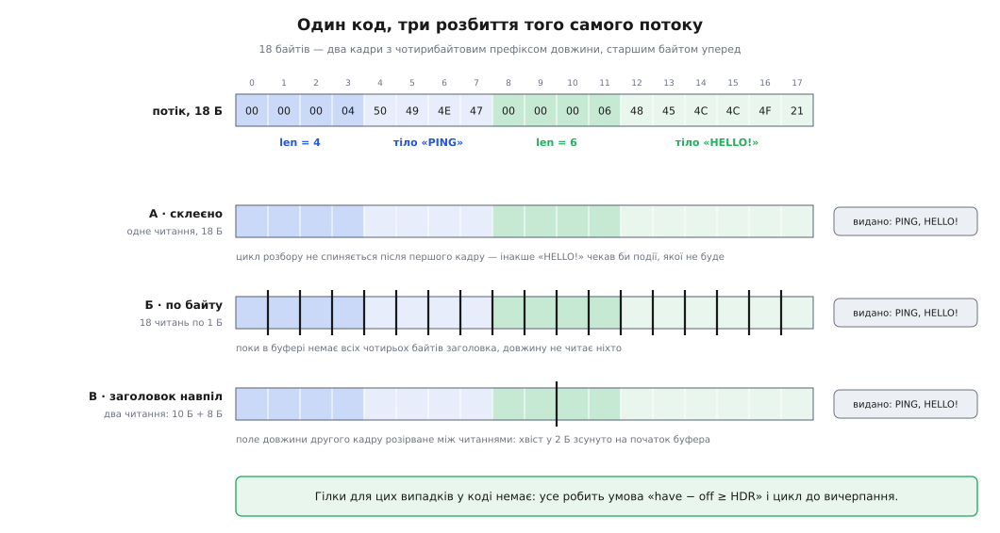
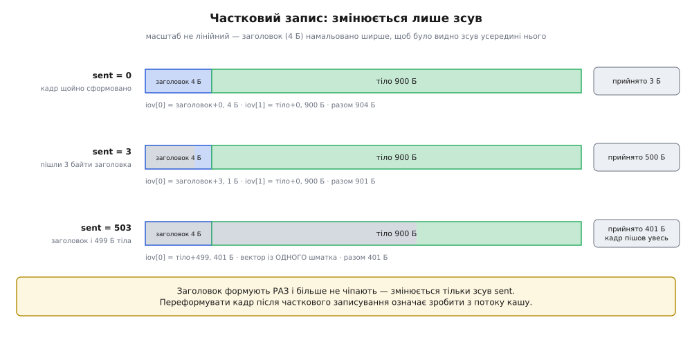

# ⚙️ Приймач і передавач кадрів із префіксом довжини: код, який не залежить від розбиття

Тут зібрано обидва кінці одного протоколу цілком — приймач із накопичувальним буфером і передавач із частковим записуванням, — бо саме в цих двох файлах живуть усі помилки, через які повідомлення не переживає дороги. Код компілюється як є (`-std=c11 -Wall -Wextra`), а наприкінці стоїть трасування: той самий приймач проганяють на трьох різних розбиттях того самого потоку й лічать, скільки разів байт копіюють дорогою від ядра до обробника.

## Завдання

Дві програми обмінюються повідомленнями по TCP. Формат прибито до підлоги — усі п'ять рядків нижче належать **специфікації протоколу**, а не коду однієї реалізації:

```
байт 0..3         len — довжина ТІЛА, беззнакове 32-бітове, старшим байтом уперед
байт 4..4+len-1   тіло — рівно len байтів, будь-які значення, зокрема нулі

len лічить ТІЛЬКИ тіло, заголовок у нього не входить
len = 0            законний кадр: порожнє повідомлення («я живий»)
len ≤ MAX_FRAME = 1 048 576 (1 МіБ); більше — порушення протоколу
```

Останній рядок часто лишають «на розсуд реалізації» — і дарма. Якщо стеля живе тільки в коді, кожна реалізація вигадає власну, і кадр, законний для одного вузла, стане помилкою для іншого. Так само не можна лишати «очевидним», що довжина не рахує заголовок: розбіжність у чотири байти зсуне всі наступні межі, і дві сторони до кінця життя вважатимуть одна одну зламаною.

Умови, які роблять код нетривіальним, теж варто назвати одразу:

- сокет **неблокуючий**, приймач живе в циклі подій і не має права заснути на одному співрозмовникові;
- будь-яке розбиття потоку читаннями законне — від «усі кадри одним шматком» до «по одному байту»;
- тіло віддають обробникові **без копіювання**;
- пам'ять на з'єднання **обмежена зверху** й не залежить від чужого числа;
- кінець потоку рівно на межі кадру й кінець посеред кадру — це **різні** події.

## Ідея: стан живе у з'єднанні, а буфер росте до стелі — і не далі

Розбір не можна тримати в стеку виклику: функція, що крутить цикл «читай, доки не набереться кадр», не повертається, доки співрозмовник мовчить. Тому весь стан переїжджає в об'єкт з'єднання — накопичувач і лічильник того, скільки в ньому байтів. Робота на кожну подію готовності складається з трьох дій: **дописати прийняте в кінець**, **забрати всі повні кадри**, **зсунути неповний хвіст на початок**.

Друга половина ідеї — про пам'ять. Буфер не виділяють одразу під найбільший законний кадр: мільйон байтів на з'єднання при десяти тисячах з'єднань — це десять гігабайтів, які майже завжди стоятимуть порожні. Буфер **росте на вимогу**, подвоєнням, і має жорстку стелю `HDR + MAX_FRAME`. Оскільки довжину звіряють зі стелею до того, як за нею щось рахувати, буфер ніколи не намагається вирости під чуже вигадане число.

З цих двох рішень випливає інваріант, на якому тримається решта коду: **після розбору в буфері завжди лишається місце щонайменше на один байт**. Хвіст — це початок неповного кадру, тобто менше, ніж йому треба; а місця виділено рівно стільки, скільки йому треба, або більше. Інваріант не декоративний: без нього настає стан «буфер повний, кадр неповний», читання отримує нульовий розмір, повертає нуль — і код бачить закриття з'єднання там, де його немає.

## Приймач

Спершу типи. Обробник кадру повертає ознаку: нуль — «беремо, читай далі», не нуль — «це повідомлення неприйнятне». Другого варіанта не уникнути, бо єдина коректна реакція на зіпсовану межу — розрив, і вирішує це той, хто дивиться на вміст.

```c
#include <errno.h>
#include <stddef.h>
#include <stdint.h>
#include <stdlib.h>
#include <string.h>
#include <sys/socket.h>
#include <sys/uio.h>

enum {
    HDR       = 4,          /* ширина поля довжини */
    MAX_FRAME = 1 << 20,    /* 1 МіБ — стеля тіла; належить специфікації */
    BUF_MIN   = 4096,       /* з чого починає накопичувач */
};

typedef enum {
    FR_OK = 0,      /* порція оброблена — чекаємо наступної події */
    FR_EOF,         /* потік скінчився РІВНО на межі кадру */
    FR_TRUNCATED,   /* потік обірвано ПОСЕРЕД кадру */
    FR_PROTO,       /* порушення кадрування або відмова обробника */
    FR_NOMEM,
    FR_IO,
} fr_status;

struct conn {
    int       fd;
    uint8_t  *buf;    /* накопичувач; NULL до першого читання */
    size_t    cap;    /* скільки байтів виділено */
    size_t    have;   /* скільки байтів лежить; завжди have <= cap */
    int     (*on_frame)(void *user, const uint8_t *body, uint32_t len);
    void     *user;
};
```

Читання числа із дроту пишуть руками, а не накладанням структури на буфер. Три причини: заголовок може стояти за непарною адресою (він настільки ж часто починається з байта 2, як і з байта 0), порядок байтів у файлі формату не залежить від порядку байтів у машині, а зайвих полів вирівнювання компілятор у цю пару функцій уже не додасть. Такий код працює однаково на будь-якій архітектурі — і в цьому сенс [явного розкладання числа на байти](root:sf-algorithms/bits-bytes-endianness).

```c
static uint32_t be32(const uint8_t *p)
{
    return ((uint32_t)p[0] << 24) | ((uint32_t)p[1] << 16)
         | ((uint32_t)p[2] <<  8) |  (uint32_t)p[3];
}

static void put_be32(uint8_t *p, uint32_t v)
{
    p[0] = (uint8_t)(v >> 24); p[1] = (uint8_t)(v >> 16);
    p[2] = (uint8_t)(v >>  8); p[3] = (uint8_t)v;
}
```

Далі — ріст буфера. Уся межа пам'яті з'єднання зосереджена в цій одній функції, і це навмисне: якщо стеля перевіряється в кількох місцях, рано чи пізно одне з них відстане від інших.

```c
/* Гарантує cap >= want. Вище стелі кадру не росте НІКОЛИ. */
static int reserve(struct conn *c, size_t want)
{
    const size_t ceiling = (size_t)HDR + MAX_FRAME;
    if (want > ceiling) return 0;      /* поза специфікацією — не наша справа */
    if (want <= c->cap)  return 1;

    size_t cap = c->cap ? c->cap : (size_t)BUF_MIN;
    while (cap < want) cap *= 2;
    if (cap > ceiling) cap = ceiling;

    uint8_t *p = realloc(c->buf, cap);
    if (!p) return 0;
    c->buf = p;
    c->cap = cap;
    return 1;
}
```

Тепер серце — цикл розбору. Він забирає **всі** повні кадри, ущільнює хвіст і наприкінці резервує місце під те, чого поточному кадрові ще бракує.

```c
static fr_status parse_all(struct conn *c)
{
    size_t off  = 0;      /* скільки байтів буфера вже розібрано */
    size_t need = HDR;    /* скільки байтів треба для наступного кроку */

    while (c->have - off >= HDR) {              /* заголовок цілий? */
        uint32_t len = be32(c->buf + off);
        if (len > MAX_FRAME) return FR_PROTO;   /* стеля — ДО будь-якої арифметики */

        need = (size_t)HDR + len;               /* тепер додавання безпечне */
        if (c->have - off < need) break;        /* тіло ще не все — чекаємо */

        if (c->on_frame(c->user, c->buf + off + HDR, len) != 0)
            return FR_PROTO;                    /* обробник відхилив кадр */

        off  += need;
        need  = HDR;
    }

    if (off) {                                  /* хвіст — на початок буфера */
        memmove(c->buf, c->buf + off, c->have - off);
        c->have -= off;
    }
    return reserve(c, need) ? FR_OK : FR_NOMEM;
}
```

Порядок двох рядків посередині — не стилістика, а вся безпека цієї функції. Спокуса написати `if (c->have - off < HDR + len)` однією умовою й перевіряти стелю потім виглядає нешкідливо, а на 32-бітному `size_t` перетворює приймач на решето: `len` близько чотирьох мільярдів робить із `HDR + len` [маленьке число](root:sf-lang/overflow-wraparound), умова «чи вміщується» проходить успішно для кадру, що не вміщується, і далі код читає тіло за межами буфера. Спершу порівняння зі стелею, і тільки після нього — додавання: після перевірки `len ≤ 1 048 576` сума не переповниться ніде.

Друга неочевидна річ — умова циклу `have - off >= HDR`. Це вона робить непотрібними всі спеціальні гілки для розірваних заголовків: поки в буфері немає всіх чотирьох байтів довжини, `be32` ніхто не кличе, а неповний заголовок просто лежить у хвості разом із рештою.

Нарешті — єдине місце, де кличуть ядро.

```c
fr_status conn_on_readable(struct conn *c)
{
    for (;;) {
        if (!reserve(c, c->have + 1)) return FR_NOMEM;   /* місце є завжди... */
        size_t room = c->cap - c->have;                  /* ...і воно > 0 */

        ssize_t n = recv(c->fd, c->buf + c->have, room, 0);

        if (n < 0) {
            if (errno == EINTR) continue;                /* перервано сигналом */
            if (errno == EAGAIN || errno == EWOULDBLOCK)
                return FR_OK;                            /* черга прийому порожня */
            return FR_IO;
        }
        if (n == 0)                                      /* інший бік закрив напрямок */
            return c->have == 0 ? FR_EOF : FR_TRUNCATED;

        c->have += (size_t)n;

        fr_status st = parse_all(c);
        if (st != FR_OK) return st;

        if ((size_t)n < room) return FR_OK;   /* прочитали менше, ніж просили */
    }
}

void conn_close(struct conn *c)
{
    free(c->buf);
    c->buf = NULL;
    c->cap = c->have = 0;
}
```

Зовнішній цикл тут — не оптимізація, а вимога: [сповіщення за фронтом](root:sys-unix/select-poll-epoll) розповідає про **зміну** стану, тож не вичерпавши чергу прийому до `EAGAIN`, ви більше не почуєте про байти, які в ній уже лежать. Останній рядок дозволяє вийти на один системний виклик раніше: якщо потокове читання віддало менше, ніж мало куди покласти, черга ядра порожня, і наступний виклик усе одно поверне `EAGAIN`. Байти, що прилетять пізніше, створять нову зміну стану — тобто нову подію.

> 🔧 **Навіщо це.** Виклик `reserve(c, c->have + 1)` виглядає зайвим — адже `parse_all` уже зарезервував `need`. Він тут заради доказу, а не заради пам'яті: після нього `room > 0` видно з двох сусідніх рядків, і не треба тримати в голові доведення через інваріант хвоста. Це той рідкісний випадок, коли зайвий рядок дешевший за міркування, яке доведеться повторювати кожному, хто читатиме код.

Одну властивість цієї конструкції треба знати напам'ять, бо компілятор про неї не попередить: **покажчик `body` чинний лише доти, доки не повернувся `on_frame`**. Далі буфер зсунуть або перевиділять, і збережений покажчик перетвориться на посилання в нікуди. Хто хоче пережити подію — копіює. З того самого коріння росте й заборона на повторний вхід: `on_frame` не має права сам читати з цього ж з'єднання, бо тоді буфер поїде під ногами в того, хто його розбирає.

## Три розбиття, один результат

Візьмімо потік із двох кадрів — вісімнадцять байтів разом:

```
зсув:   0  1  2  3   4  5  6  7    8  9 10 11  12 13 14 15 16 17
байт:  00 00 00 04  50 49 4E 47   00 00 00 06  48 45 4C 4C 4F 21
       └─ len = 4 ─┘└─ «PING» ──┘ └─ len = 6 ─┘└──── «HELLO!» ───┘
```


*Кольором позначено, до якого кадру належить байт; темніші клітинки — поле довжини. Чорні риски — межі читань. У трьох випадках межі різні, а видані кадри збігаються байт у байт, хоча гілки для жодного з цих випадків у коді немає.*

**Розбиття А — усе одним читанням.**

```
подія 1: recv → 18 Б                                have = 18
  off = 0   have−off = 18 ≥ 4  →  len = 4,  need = 8,  18 ≥ 8   → кадр «PING»
  off = 8   have−off = 10 ≥ 4  →  len = 6,  need = 10, 10 ≥ 10  → кадр «HELLO!»
  off = 18  have−off = 0  < 4  →  вихід із циклу
  ущільнення: memmove 0 байтів                      have = 0
```

Два кадри за одну подію — і саме тут ховається найдорожча помилка з усіх можливих у цьому коді. Якби цикл спинявся після першого кадру, «HELLO!» чекав би наступної події готовності сокета, а її не буде: співрозмовник надіслав усе й чекає відповіді. Виходить взаємне очікування, у якому обидві сторони поводяться бездоганно — дані отримано, але не розібрано.

**Розбиття Б — по одному байту, вісімнадцять читань.**

```
подія  1..3   have = 1, 2, 3   — менше за HDR, цикл не крутиться жодного разу
подія  4      have = 4         → len = be32(00 00 00 04) = 4,  need = 8,  4 < 8
                                 reserve(8): місце під увесь кадр уже є
подія  5..7   have = 5, 6, 7   — усе ще менше за need
подія  8      have = 8 ≥ need  → кадр «PING»;  off = 8;  have = 0
подія  9..11  have = 1, 2, 3   — заголовок другого кадру збирається наново
подія 12      have = 4         → len = 6,  need = 10
подія 13..17  have = 5 .. 9
подія 18      have = 10 ≥ need → кадр «HELLO!»;  have = 0
```

Вісімнадцять подій замість однієї, ті самі два кадри, жодного окремого рядка коду. Довжину не читають, доки в буфері немає всіх чотирьох її байтів, — тому «швидкий» варіант, у якому заголовок вичитують окремим викликом повз накопичувач, ламається саме тут і більше ніде.

**Розбиття В — заголовок навпіл: 10 Б + 8 Б.**

```
подія 1: recv → 10 Б  (00 00 00 04 50 49 4E 47 | 00 00)      have = 10
  off = 0   len = 4,  need = 8,  10 ≥ 8  → кадр «PING»;  off = 8
  off = 8   have−off = 2 < 4              → вихід із ПІВ заголовка в буфері
  ущільнення: memmove 2 байтів на початок                    have = 2

подія 2: recv → 8 Б   (00 06 48 45 4C 4C 4F 21)              have = 10
  буфер: 00 00 | 00 06 48 45 4C 4C 4F 21
  off = 0   len = be32(00 00 00 06) = 6,  need = 10,  10 ≥ 10 → кадр «HELLO!»
  ущільнення: memmove 0 байтів                               have = 0
```

Поле довжини другого кадру тут фізично розірване між двома читаннями: два його байти прилетіли в першій порції, два — у другій. Код цього не помічає й нічого з цим не робить — байти просто лежать у хвості, доки їх не стане чотири.

## Кінець потоку: два різні нулі

Нуль від читання означає «інший бік більше не надсилатиме», і тлумачити його доводиться за станом буфера — саме тому рядок `return c->have == 0 ? FR_EOF : FR_TRUNCATED;` стоїть **після** того, як `parse_all` ущільнив хвіст.

Порожній буфер означає, що потік скінчився рівно на межі кадру: з вами коректно попрощалися, усі надіслані повідомлення розібрані. Непорожній означає, що вам віддали початок кадру й замовкли. Обробити цей уламок як цілий — ухвалити рішення на підставі половини даних; мовчки викинути — втратити повідомлення, яке, можливо, ніколи й не було надіслане повністю. Обидва варіанти помилкові, і саме тому це окремий стан із власною назвою.

Дві сусідні пастки варто назвати відразу. По-перше, нуль від читання — це кінець **напрямку**, а не розмови: інший бік міг закрити свою половину й терпляче чекати вашої відповіді. По-друге, `FR_EOF` і `FR_TRUNCATED` вичерпують не всі кінці. Співрозмовник, що надіслав заголовок і замовк назавжди, не дасть вам жодного нуля — він триматиме буфер і слот з'єднання, скільки схоче, і зупинити його може лише [строк на операцію](root:sf-distributed/timeouts-deadlines), а не логіка розбору.

## Той самий приймач мовою мережевих серверів

Мовою, де на кожне з'єднання заводять окремий потік виконання, а планувальник сам знімає його з процесора на читанні, форма коду змінюється — і зміна ця повчальна. Накопичувач не зникає: він переїжджає в буферизований читач із бібліотеки, а цикл розбору перетворюється на прямий послідовний код.

```go
const (
	hdrLen   = 4
	maxFrame = 1 << 20 // 1 МіБ — та сама стеля зі специфікації
)

var ErrFrameTooLarge = errors.New("кадр більший за стелю")

// ReadFrames читає кадри, доки потік не скінчиться.
// body чинний ЛИШЕ до повернення з onFrame — далі його перезапишуть.
func ReadFrames(r io.Reader, onFrame func(body []byte) error) error {
	br := bufio.NewReaderSize(r, 64<<10) // накопичувач живе тут
	var hdr [hdrLen]byte
	body := make([]byte, 0, 4096)

	for {
		if _, err := io.ReadFull(br, hdr[:]); err != nil {
			if err == io.EOF {
				return nil // потік скінчився РІВНО на межі кадру
			}
			return err // ErrUnexpectedEOF — обірвано посеред заголовка
		}

		n := binary.BigEndian.Uint32(hdr[:])
		if n > maxFrame { // стеля — ДО виділення пам'яті
			return ErrFrameTooLarge
		}

		if cap(body) < int(n) { // буфер тіла росте, але не всихає
			body = make([]byte, n)
		}
		body = body[:n]

		if _, err := io.ReadFull(br, body); err != nil {
			if err == io.EOF {
				err = io.ErrUnexpectedEOF // тіла не було зовсім — теж обрив
			}
			return err
		}

		if err := onFrame(body); err != nil {
			return err
		}
	}
}
```

Порівняння двох версій показує, що саме в задачі істотне, а що — наслідок обраної моделі виконання. Зникли ущільнення хвоста, ручний зсув `off` і цикл до вичерпання: усе це тепер робить буферизований читач усередині себе. Не зникло **нічого зі специфіки кадрування**: стеля так само стоїть перед виділенням пам'яті, довжину так само читають старшим байтом уперед, тіло так само віддають покажчиком у чужий буфер із тим самим строком життя.

Найцікавіше — розрізнення двох кінців потоку. У версії мовою C його довелося писати руками; тут воно вже вбудоване в бібліотеку: читання «рівно стільки байтів» повертає `io.EOF`, якщо не прочитало жодного, і `io.ErrUnexpectedEOF`, якщо прочитало частину й уперлося в кінець. Це той самий поділ на чисте завершення й обірваний кадр, просто хтось уже витратив час на його формулювання.

## Передавач: заголовок формують раз

На передачі гострих місць два, і обидва — про те, що операційна система ріже ваші записи, як їй зручно.

Перше: виклик запису має право прийняти менше, ніж ви дали. Єдина можлива реакція — запам'ятати, скільки байтів кадру вже пішло, і продовжити з цього зсуву. Чого робити **не можна** — це переформувати кадр: заголовок уже в дорозі, і другий заголовок посеред тіла зробить із потоку кашу, з якої співрозмовник ніколи не вибереться, бо в потоці немає ні роздільників, ні точок повторної синхронізації — прочитавши зайві чотири байти як довжину, приймач зсуне всі наступні межі й більше на них не натрапить.

Друге: заголовок і тіло треба віддавати **одним** викликом. Два дрібні записи поспіль зводять докупи притримування дрібних сегментів і відкладене підтвердження — обидва механізми поодинці розумні, а разом [ставлять кадр у чергу до таймера](root:sf-os/socket-options) на десятки мілісекунд. Копіювати тіло в спільний буфер заради цього шкода, тож потрібен розсіяний запис: виклик, що бере кілька шматків пам'яті й віддає їх стекові як одну неперервну порцію. Пара `readv`/`writev` з'явилася в 4.2BSD і стандартизована в POSIX.1-2001; на сокетах зручніша її рідня `sendmsg`, бо той самий вектор вона поєднує з прапорцем, який глушить сигнал при записі в закрите з'єднання.

```c
struct out_frame {
    uint8_t        hdr[HDR];   /* заголовок формують РАЗ, на початку */
    const uint8_t *body;       /* тіло не копіюють — воно має пережити відправлення */
    uint32_t       len;
    size_t         sent;       /* скільки байтів кадру (заголовок + тіло) вже пішло */
};

static void out_begin(struct out_frame *o, const uint8_t *body, uint32_t len)
{
    put_be32(o->hdr, len);
    o->body = body;
    o->len  = len;
    o->sent = 0;
}

/* 1 — кадр пішов увесь; 0 — черга відправлення заповнилася, повторити
   на готовність до запису; -1 — помилка. */
static int out_flush(int fd, struct out_frame *o)
{
    const size_t total = (size_t)HDR + o->len;

    while (o->sent < total) {
        struct iovec iov[2];
        int nv = 0;

        if (o->sent < HDR) {                       /* заголовок ще не весь */
            iov[nv].iov_base = o->hdr + o->sent;
            iov[nv].iov_len  = HDR - o->sent;
            nv++;
        }
        size_t body_sent = (o->sent > HDR) ? o->sent - HDR : 0;
        if (body_sent < o->len) {                  /* тіло ще не все */
            iov[nv].iov_base = (void *)(o->body + body_sent);
            iov[nv].iov_len  = o->len - body_sent;
            nv++;
        }

        struct msghdr mh;
        memset(&mh, 0, sizeof mh);
        mh.msg_iov    = iov;
        mh.msg_iovlen = (size_t)nv;

        ssize_t n = sendmsg(fd, &mh, MSG_NOSIGNAL);
        if (n < 0) {
            if (errno == EINTR) continue;
            if (errno == EAGAIN || errno == EWOULDBLOCK) return 0;
            return -1;
        }
        o->sent += (size_t)n;
    }
    return 1;
}
```

Ось як цим користуються — і різниця між двома мовами тут не косметична. Мовою C кадр віддають у два кроки, бо цикл подій ваш власний і зсув недописаного мусить пережити повернення з функції; мовою мережевих серверів усе ховається в один виклик, бо цикл сидить усередині бібліотеки.

:::tabs
```c
/* Віддати один кадр. Цикл подій наш, тож недописаний кадр
   мусить пережити повернення з функції. */
struct conn_out { struct out_frame o; int busy; };

static int send_frame(int fd, struct conn_out *q,
                      const uint8_t *body, uint32_t len)
{
    if (q->busy)          return -1;   /* попередній кадр ще не пішов увесь */
    if (len > MAX_FRAME)  return -1;   /* власну стелю поважають і на передачі */

    out_begin(&q->o, body, len);
    int r = out_flush(fd, &q->o);
    q->busy = (r == 0);                /* 0 — сокет заповнився: доженемо на події */
    return r;                          /* body МУСИТЬ дожити, доки busy */
}
```
```go
// WriteFrame віддає кадр ОДНИМ записом: заголовок і тіло йдуть у стек
// разом, тіло нікуди не копіюється.
func WriteFrame(w io.Writer, body []byte) error {
	if len(body) > maxFrame {
		return ErrFrameTooLarge
	}
	var hdr [hdrLen]byte
	binary.BigEndian.PutUint32(hdr[:], uint32(len(body)))

	bufs := net.Buffers{hdr[:], body}
	_, err := bufs.WriteTo(w) // на TCP-з'єднанні — той самий розсіяний запис,
	return err                // а часткові записи WriteTo доганяє сама
}
```
:::


*Кадр із чотирибайтового заголовка й тіла на 900 байтів. Сірим — те, що вже пішло. Спершу вектор складається із заголовка й тіла; після часткового запису в трьох байтах перший шматок ужимається до одного байта; коли заголовок пішов увесь, вектор стискається до одного шматка — решти тіла. Заголовок при цьому не переформовують жодного разу.*

Три деталі, повз які легко пройти. Перша: доки попередній кадр не пішов увесь, починати наступний **заборонено** — черга відправлення мусить лишатися строго послідовною, з одним недописаним кадром за раз; прапорець `busy` — це правило, записане так, щоб його не можна було порушити випадково. Друга: `body` має дожити до кінця відправлення. При переході з блокуючого запису на неблокуючий це найчастіша аварія — тіло складали в тимчасовому буфері, який звільняли при поверненні, а тепер повернення настає посеред кадру. Третя: вектор має скінченну довжину. На сучасних ядрах Linux у нього влазить 1024 шматки (за часів Linux 2.0 було 16), а більше дає відмову з кодом `EINVAL` — тож збирач, що складає у вектор по шматку на кожне поле повідомлення, одного дня впреться в стелю, про яку не думав.

Лишається питання, що робити, коли `out_flush` віддає нуль надто часто. Складати кадри в чергу застосунку природно, але **черга без межі — це бомба**: пам'ять з'їсть найповільніший клієнт. Шар кадрування — правильне місце для рішення, бо тільки він знає, де проходять межі повідомлень і які з них можна викинути; це загальна задача [протитиску](root:sf-tasks/backpressure), і вибору тут не уникнути — можна лише зробити його мовчки й невдало.

## Скільки копій припадає на кадр

Порахуймо шлях одного байта тіла від дроту до обробника.

Мережева карта кладе його в чергу прийому ядра прямим доступом до пам'яті (англ. *direct memory access*) — процесор у цьому не бере участі. Виклик читання переносить його з черги ядра в накопичувач: **копія перша**, і без окремих технік її не уникнути. Обробникові байт віддають покажчиком у той самий накопичувач — **копій нуль**, у цьому й сенс. Ущільнення хвоста може перенести його ще раз — **копія друга, але не більше однієї**.

Ось чому не більше однієї. Ущільнення взагалі не відбувається, поки неповний кадр лежить сам на початку буфера: `off` дорівнює нулю, `memmove` рухає нуль байтів. Байт зсувають рівно тоді, коли він прилетів у тому ж читанні, що й кінець **попереднього** кадру. Після цього зсуву його кадр опиняється на початку буфера — і більше не зрушить із місця, доки не стане повним. У трасуваннях вище це видно прямо: розбиття А і Б не перемістили жодного байта, розбиття В перемістило два.

**Скільки коштує все копіювання на реальному навантаженні.** Сервер приймає 100 000 кадрів за секунду, тіло — 200 байтів.

```
трафік              100 000 × 204 Б                 = 20.4 МБ/с
копія з ядра        по одній на байт                = 20.4 МБ/с
ущільнення          ≤ 1 копія на байт; у середньому
                    хвіст ≈ пів кадру
                    100 000 × 102 Б                 ≈ 10.2 МБ/с
разом переміщено    20.4 + 10.2                     ≈ 30.6 МБ/с
частка смуги пам'яті (≈ 10 ГБ/с на ядро)
                    30.6·10⁶ / 10·10⁹               ≈ 0.3 %
```

А тепер те саме навантаження з боку системних викликів:

```
викликів recv       у найгіршому разі один на кадр  ≈ 100 000/с
вартість виклику    ≈ 1 мкс — порядок величини: залежить від ядра, машини
                    й захисних латок проти спекулятивних атак; важливе
                    тут відношення, а не саме число
разом               100 000 × 1 мкс = 0.1 с/с       ≈ 10 % ядра
```

Відношення виходить приблизно тридцятикратне: перехід у ядро коштує на порядок більше, ніж усі копіювання разом. Звідси єдиний практичний висновок про продуктивність цього коду — **оптимізувати треба кількість викликів, а не `memmove`**. Цикл до вичерпання, що знімає з одного читання десять кадрів, економить дев'ять переходів у ядро; [кільцевий буфер](root:sf-algorithms/ring-buffer), який прибирає ущільнення зовсім, економить третину від тих 0.3 %, зате приносить власну складність — у ньому кадр може лягти через стик і перестати бути суцільним шматком пам'яті, а розбирач хоче саме суцільний. Ця зміна виправдана рівно тоді, коли її користь виміряна, а не припущена.

Виняток із загального правила один і важливий: **велике тіло не варто пропускати через накопичувач узагалі**. Коли довжина вже прочитана й дорівнює, скажімо, мегабайту, розумніше виділити пам'ять саме під це тіло й читати мережу прямо в неї. Тоді великі дані переживають рівно одне копіювання, а накопичувач лишається маленьким і швидким для звичайних кадрів — і стеля `MAX_FRAME` перестає диктувати розмір буфера кожному з'єднанню.

## Що ламається поза цим кодом

Три речі цей приймач не робить, і жодну з них не можна лишити на потім.

Він не обмежує кількість ітерацій зовнішнього циклу. Співрозмовник, що безперервно шле дані, триматиме потік виконання на собі, доки решта з'єднань чекає — вичерпання черги перетворюється на монополію. Ліки прості: лічильник ітерацій або лічильник байтів на подію, після якого з'єднання повертають у чергу подій.

Він не має строку на неповний кадр. Заголовок надіслано, тіло не йде — і буфер із з'єднанням стоять зайняті скільки завгодно довго. Це найдешевша відома атака вичерпання ресурсів, і від неї рятує не логіка розбору, а таймер.

Він не перевіряє, чи має право цей співрозмовник надсилати кадр такого розміру. `MAX_FRAME` — межа протоколу, однакова для всіх; за нею ще мають стояти квоти на з'єднання й на клієнта. Бо стеля в мільйон байтів, помножена на десять тисяч з'єднань, — це рівно та сама вразливість, від якої стелю й вводили, просто зібрана з законних частин.
