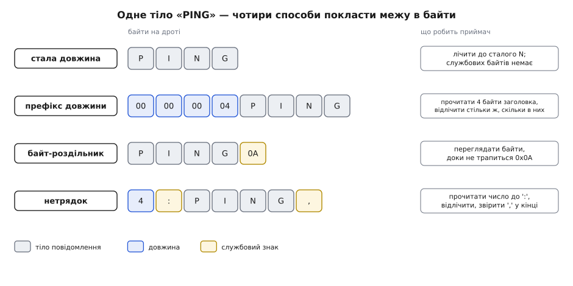

# Кадрування повідомлень у потоці TCP

<preknowlist>
- [Сокети TCP/UDP](root:sf-os/sockets-tcp-udp) — що таке сокет і що роблять виклики надсилання й читання на встановленому з'єднанні.
- [TCP проти UDP](root:com-transport/tcp-vs-udp) — що TCP дає надійний упорядкований потік байтів, а UDP — окремі датаграми зі збереженими межами.
- [Біти й порядок байтів](root:sf-algorithms/bits-bytes-endianness) — як число розкладається на байти й що таке старший та молодший порядок.
</preknowlist>

Одна програма тричі кличе `send`, щоразу з однією командою. Друга кличе `recv` — і дістає всі три склеєні в один шматок. Наступного разу дістає півтори: цілу команду й перші сім байтів наступної. Ніде нічого не зламалося: TCP доніс кожен байт, жодного не загубив і не переставив. Зникло те, чого він ніколи й не ніс, — **межа повідомлення**.

Її не існує в моделі TCP узагалі, і жодна опція сокета її не поверне. TCP нумерує байти, а не повідомлення: у заголовку є номер октета в потоці, а поля «тут закінчилося сьоме повідомлення» там немає. Отже, якщо застосунок мислить повідомленнями, а транспорт — байтами, межі мусить покласти в самі байти той, кому вони потрібні. Домовленість про те, як приймач їх звідти вичитає, — і код, що цю домовленість утілює, — зветься **кадруванням** (англ. *framing*, від *frame* — «рамка»).

## Чому межа не переживає дороги

Різати потік усе одно доводиться, і рішення про поділ ухвалюють у місцях, які ваших повідомлень не бачать.

Виклик надсилання не кладе дані в мережу — він копіює їх у чергу сокета й вертається. Два швидкі надсилання по 50 байтів застануть чергу непорожньою й поїдуть одним сегментом на 100 байтів: доки в дорозі є непідтверджені дані, стек навмисне притримує дрібні порції, щоб не витрачати пакет на кожні кілька байтів. Велике надсилання, навпаки, ріжеться — сегмент не може бути більший за MSS, а це на звичайному Ethernet близько 1460 байтів даних, тож повідомлення на 10 КБ поїде щонайменше сімома шматками.

На тому кінці виклик читання копіює з черги прийому стільки, скільки там **зараз є** і скільки влізе у ваш буфер. Він не чекає повного повідомлення — про повідомлення він нічого не знає. Дасть один байт, якщо в черзі один; дасть три склеєні команди, якщо там три.


*Один потік у трьох розбиттях. Угорі — як його порізав застосунок: три виклики надсилання. Посередині — як його порізав стек: A і B поїхали одним сегментом, а C розпалося на два. Унизу — як його побачив приймач: жодне читання не збіглося з межею повідомлення.*

Найпідступніше тут — що зламаний код зазвичай **працює**. На локальній петлі немає ні обмеження в 1500 байтів, ні затримки, ні втрат: одне надсилання майже завжди стає одним читанням. Код, який приймає повідомлення за виклик, проходить усі тести на машині розробника й падає при першому справжньому навантаженні. Тому припущення «одне надсилання — одне читання» не «майже правильне» — воно просто хибне, а тестова машина цього не показує.

> 🔧 **Навіщо це.** Це найчастіша причина мережевих багів, що «плавають». Симптом виглядає як зіпсовані дані, а причина — зсунута межа: розбирач прочитав хвіст одного повідомлення як голову наступного й дістав правдоподібне сміття. Правило просте: жоден рядок приймача не має права спиратися на те, **скільки** байтів прийшло за раз.

## Що TCP усе-таки дає

Знати це треба, щоб не захищатися від неіснуючих загроз. TCP обіцяє чотири речі: усі байти дійдуть; дійдуть у тому самому порядку; без дублікатів і без спотворень; кінець буде позначено — коли інший бік закриє свій напрямок, читання поверне нуль.

Звідси кадр у TCP простіший, ніж кадр на послідовній лінії. Там приймач може ввімкнутися посеред чужої передачі, тож кадр обов'язково має маркер початку й контрольну суму. У TCP з'єднання починається з відомої точки: перший прочитаний байт — це перший байт потоку. Хто знає, де починається перший кадр, той арифметично знає, де починаються всі наступні.

З тієї самої властивості випливає й правило, суворіше за все, що є на послідовних лініях: **ресинхронізації тут немає**. Якщо розбирач збився на байт, він збився не тимчасово — наступні чотири байти він прочитає як довжину, дістане правдоподібне число, відлічить за ним чуже сміття й піде далі, ніколи не дізнавшись про помилку. Шукати нема чого: будь-який візерунок байтів законно трапляється в даних, тож жодна послідовність не може означати «тут точно початок кадру». Тому єдина коректна реакція на порушення кадрування — **розірвати з'єднання**.

## Чим позначити межу

Вимога до кадрування рівно одна: приймач, маючи лише вже отримані байти й правила протоколу, мусить визначити, чи повідомлення закінчилося, — і визначити так само, як відправник. Способів це зробити небагато.

**Стала довжина.** Кожне повідомлення має рівно N байтів, приймач лічить до N. Ніякого пошуку — але перша ж зміна формату почне різати потік не там, і приймач цього не помітить.

**Префікс довжини.** Кожне повідомлення починається із заголовка сталого розміру, у якому записано, скільки байтів тіла йде далі. Це найпоширеніший спосіб у двійкових протоколах, і причин чотири: тіло лишається прозорим (будь-який байт — звичайні дані, екранувати нічого не треба), кінець обчислюється додаванням, пам'ять виділяється точно, а невідоме повідомлення можна пропустити, не розбираючи. Ціна одна: довжину треба знати до того, як писати перший байт. У специфікації протоколу доводиться прибити чотири речі — ширину поля, порядок байтів (класично старшим уперед), що саме лічить довжина (тіло чи тіло разом із заголовком) і стелю, більшу за яку кадр вважають помилкою.

**Роздільник.** Байт чи пара байтів, що позначають кінець і не можуть трапитися в тілі: класика — переведення рядка в текстових протоколах. Розмір знати наперед не треба, а дамп трафіку читає людина без жодних інструментів. Натомість кожен байт доводиться переглянути, двійкові дані — екранувати, а приймач не знає, скільки чекати.

**Кінець з'єднання.** Можна не позначати нічого: усе, що прийшло до закриття, і є повідомленням. Так працював HTTP до появи сталих з'єднань. Вади дві й обидві незцілимі: на з'єднання припадає рівно одне повідомлення, а обірване з'єднання не відрізнити від завершеного.


*Те саме тіло «PING» у чотирьох кадруваннях. Стала довжина не має службових байтів, але й не терпить змін. Префікс довжини платить сталим заголовком і дає точну межу без пошуку. Роздільник не має заголовка зовсім, але забороняє свій байт у тілі. Нетрядок — запис «довжина, двокрапка, тіло, кома» — додає до довжини контрольний хвіст, який негайно викриває збите кадрування. Праворуч — що саме приймач мусить зробити, щоб знайти межу.*

## Приймач, який нічого не припускає

Оскільки повне повідомлення може прийти за кілька читань, стан розбору мусить жити не в стеку виклику, а в об'єкті з'єднання: буфер і кількість накопичених у ньому байтів. Робота на кожну порцію байтів складається з трьох дій — дописати прийняте в кінець буфера, забрати з нього **всі** повні кадри, зсунути неповний хвіст на початок.

```c
c->have += n;                                // n байтів щойно дописано в кінець буфера
size_t off = 0;                              // скільки з буфера вже розібрано
while (c->have - off >= HDR) {               // заголовок цілий?
    uint32_t len = be32(c->buf + off);       // довжина зі старшим байтом уперед
    if (len > MAX_FRAME) return ERR_PROTO;   // стеля — ДО будь-якої арифметики
    if (c->have - off < HDR + len) break;    // тіло ще не все — чекаємо далі
    handle_frame(c->buf + off + HDR, len);
    off += HDR + len;
}
memmove(c->buf, c->buf + off, c->have - off);  // хвіст — на початок буфера
c->have -= off;
```

Три деталі тут неочевидні. По-перше, **заголовок теж приходить частинами** — чотирибайтовий префікс може прилетіти як 1 + 3 байти, тому й він іде через накопичувач, а не читається окремим «швидким» викликом. По-друге, розбирати треба **до вичерпання, а не по одному кадру за раз**: якщо в буфері лежали два повні кадри, а ви обробили один, другий чекатиме наступної події готовності сокета — а її може не бути ніколи, бо співрозмовник уже все надіслав і чекає відповіді. По-третє, **буфер мусить умістити найбільший законний кадр цілком**, інакше настане момент, коли буфер повний, кадр неповний, а місця для читання нема. Повний робочий приймач [зібраний окремо](root:com-protocol/tcp-message-framing/proj-framed-reader.md).

Симетричне правило для відправника: виклик запису має право прийняти менше, ніж ви дали, — тоді треба запам'ятати, скільки байтів кадру вже пішло, і продовжити з цього зсуву. Чого робити не можна — це переформувати кадр: заголовок уже в дорозі. І кадр варто складати в пам'яті цілим та віддавати **одним записом**: заголовок окремо, тіло окремо — це два дрібні сегменти поспіль, а тоді [притримування дрібних порцій зустрічається з відкладеним підтвердженням](root:sf-os/socket-options), і кадр чекає на таймер десятки мілісекунд на порожньому місці.

## Кадрування як межа довіри

Поле довжини — це число, яке надіслав співрозмовник, і воно керує вашою пам'яттю: за ним ви вирішуєте, скільки байтів виділити й скільки чекати. Найпряміша атака проста: надіслати заголовок із довжиною 4 ГіБ і не надсилати більше нічого. Тому стелю перевіряють **до** будь-якого виділення пам'яті й **до** будь-якої арифметики — вираз `HDR + len` на 32-бітних числах із великим `len` [обернеться на маленьке число](root:sf-lang/overflow-wraparound), і перевірка «чи вміщується» пройде для кадру, що не вміщується. Кадрування роздільником має свою версію тієї самої атаки — просто не надсилати роздільника, — тож пошук межі теж потребує межі пошуку.

І останнє, найтонше: **двозначність тут — це вразливість, а не питання сумісності**. Якщо в протоколі є дві межі водночас (канонічний приклад — довжина тіла HTTP, задана двома різними способами), дві реалізації можуть розійтися в тому, котра головніша: один вузол побачить у потоці одне повідомлення, наступний за ним — два, і другого ніхто не перевіряв. Так [чуже повідомлення підселяється до запиту наступного клієнта](root:com-protocol/http-request-smuggling). Тому правил рівно два, і обидва суворі: одна межа, визначена однозначно, і будь-яке порушення кадрування — розрив з'єднання.

Межа кадру виявляється точкою, у якій чужі байти стають вашим об'єктом: до неї у вас лише сирий потік, за який відповідає транспорт, після неї — повідомлення, на підставі якого програма щось робить. Вибір кадрування — це насправді вибір двох речей: скільки вашої пам'яті може попросити незнайомець одним числом і наскільки простим має бути код, що ухвалює рішення про межу, ще нічому не довіряючи.
