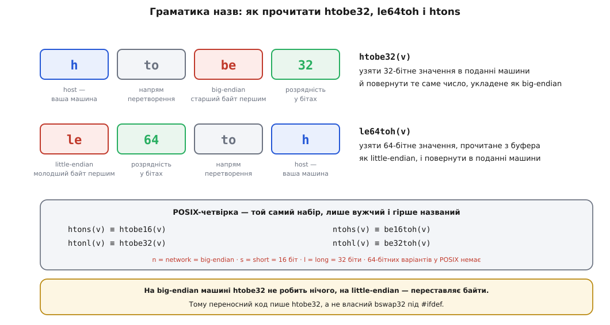

# 📋 Готові засоби для порядку байтів і пакування

Довідник того, що вже лежить у кожній платформі й мові, — заголовки, сигнатури, межі застосовності й пастки, — щоб не писати вручну перестановку байтів там, де вона є в компіляторі, і не сподіватися на функцію там, де її немає.

Усе, що нижче, відповідає рівно на три різні питання, і плутанина між ними — найчастіша причина помилок. **Перше:** як перевернути байти всередині вже наявного числа (`htobe32`, `std::byteswap`, `Integer.reverseBytes`). **Друге:** як прочитати або записати число за заданим зсувом у буфері (`be32dec`, `DataView.getUint32`, `binary.BigEndian.Uint32`) — це вже включає доступ до пам'яті, а отже й питання вирівнювання. **Третє:** як прибити розкладку структури до специфікації (`offsetof`, `alignof`, `static_assert`, `#pragma pack`). Засоби першої групи нічого не знають про буфери, засоби другої — про типи вашої програми, а третя не переставляє жодного байта.

## C і C++: перестановка байтів

### POSIX-четвірка

| Функція | Сигнатура | Що робить |
|---|---|---|
| `htons` | `uint16_t htons(uint16_t hostshort)` | 16 біт: подання машини → мережеве |
| `htonl` | `uint32_t htonl(uint32_t hostlong)` | 32 біти: подання машини → мережеве |
| `ntohs` | `uint16_t ntohs(uint16_t netshort)` | 16 біт: мережеве → подання машини |
| `ntohl` | `uint32_t ntohl(uint32_t netlong)` | 32 біти: мережеве → подання машини |

Заголовок — `<arpa/inet.h>` (історично їх часто підтягували через `<netinet/in.h>`, і на багатьох системах це досі спрацьовує). Мережевий порядок — старший байт першим, тож `htons` тотожний `htobe16`.

Обмеження цієї четвірки варто знати напам'ять, бо кожне з них колись коштувало комусь вечора:

- **64 бітів немає.** POSIX описує тільки 16- і 32-бітні перетворення. Для восьмибайтових полів — часових позначок, ідентифікаторів, лічильників — стандартної функції не існує, і кожна платформа розв'язує це по-своєму.
- **Немає напрямку на little-endian.** Якщо ваш формат укладено молодшим байтом уперед (а так робить, наприклад, MAVLink), четвірка не допоможе взагалі.
- **Це можуть бути макроси.** POSIX прямо каже: «On some implementations, these functions are defined as macros». Звідси два наслідки — не можна взяти адресу `htons` і передати її як покажчик на функцію, і не можна писати `htons(i++)`, бо аргумент має шанс обчислитися двічі.
- **`htons` і `ntohs` — та сама операція.** Обидві означають «переставити байти, якщо машина little-endian, інакше нічого не робити». Тому помилкове застосування `ntohs` там, де треба `htons`, ніколи не виявиться. Зате застосування перетворення **двічі** на одному боці — виявиться, і не одразу: на little-endian машині байти повернуться на місце й у мережу поїде сміття, а на big-endian усе працюватиме, бо там обидва виклики нічого не роблять.

### Родина `<endian.h>` (glibc, musl)

Дванадцять функцій, побудованих за одним правилом; чому вони так називаються — на фігурі нижче.

| Напрямок | 16 біт | 32 біти | 64 біти |
|---|---|---|---|
| машина → big-endian | `htobe16` | `htobe32` | `htobe64` |
| машина → little-endian | `htole16` | `htole32` | `htole64` |
| big-endian → машина | `be16toh` | `be32toh` | `be64toh` |
| little-endian → машина | `le16toh` | `le32toh` | `le64toh` |

Усі беруть і повертають беззнакове ціле відповідної ширини. Заголовок — `<endian.h>`. У glibc вони з'явилися у версії 2.9; щоб їх побачити, потрібен макрос перевірки можливостей: `_DEFAULT_SOURCE` починаючи з glibc 2.19, `_BSD_SOURCE` у старіших. Практично це означає рядок `#define _DEFAULT_SOURCE` **перед** усіма `#include` — або прапорець `-D_DEFAULT_SOURCE` у збірці. musl подає той самий заголовок і ту саму дванадцятку.


*Назва читається зліва направо як речення: «з `h` у `be`, 32 біти» або «з `le` 64 біти у `h`». `h` — це не «нічого», а порядок вашої машини, невідомий на етапі написання коду; саме тому те саме джерело переносне між платформами.*

Заразом glibc визначає макроси `__BYTE_ORDER`, `__LITTLE_ENDIAN`, `__BIG_ENDIAN`, а GCC і Clang — власні `__BYTE_ORDER__`, `__ORDER_LITTLE_ENDIAN__`, `__ORDER_BIG_ENDIAN__`, доступні без жодного заголовка:

```c
#if __BYTE_ORDER__ == __ORDER_BIG_ENDIAN__
/* тут перестановка не потрібна */
#endif
```

MSVC цих макросів **не** визначає — умовна компіляція, написана на них, там просто мовчки провалюється в гілку «за замовчуванням». Це одна з причин, чому вибір гілки за [порядком байтів машини](topic:sf-algorithms/bits-bytes-endianness) програє явним зсувам: гілка, яку компілятор на вашій машині не бачить, — це гілка, яку ніхто не збирав і не запускав.

### BSD: `<sys/endian.h>` і функції enc/dec

FreeBSD, NetBSD і OpenBSD дають ту саму дванадцятку `htobe*`/`*toh`, плюс голі `bswap16`, `bswap32`, `bswap64`, плюс те, чого немає більше ніде в C, — пару, що працює **з буфером, а не з числом**:

| Читання з буфера | Запис у буфер |
|---|---|
| `uint16_t be16dec(const void *)` | `void be16enc(void *, uint16_t)` |
| `uint32_t be32dec(const void *)` | `void be32enc(void *, uint32_t)` |
| `uint64_t be64dec(const void *)` | `void be64enc(void *, uint64_t)` |
| `uint16_t le16dec(const void *)` | `void le16enc(void *, uint16_t)` |
| `uint32_t le32dec(const void *)` | `void le32enc(void *, uint32_t)` |
| `uint64_t le64dec(const void *)` | `void le64enc(void *, uint64_t)` |

Аргумент — `void *`, тобто **будь-яка адреса**, без вимоги кратності. Це рівно та операція, яку насправді виконує кодек: «прочитати чотири байти за цим зсувом як big-endian».

> 🔧 **Навіщо це.** Різниця між `be32toh` і `be32dec` — не косметична. `be32toh(*(uint32_t *)p)` спершу читає `uint32_t` за адресою `p`, і якщо `p` не кратне чотирьом, це [невизначена поведінка](topic:sf-lang/undefined-behavior) — на Cortex-M0 чи SPARC ще й апаратний виняток, бо [не всяке залізо вміє невирівняний доступ](topic:hw-arch/alignment-hardware). `be32dec(p)` читає байтами й коректний за будь-якої адреси. Ось чому «функція перестановки» і «функція читання з буфера» — різні інструменти, і підміна одного одним дає код, що зелений на ноутбуці й падає в прошивці.

### macOS і решта Darwin

`<endian.h>` тут немає, зате є свій набір у `<libkern/OSByteOrder.h>`, помітно повніший за POSIX-івський:

| Що | Імена |
|---|---|
| голе обертання | `OSSwapInt16`, `OSSwapInt32`, `OSSwapInt64` |
| обертання сталої на етапі компіляції | `OSSwapConstInt16/32/64` |
| машина ↔ big-endian | `OSSwapHostToBigInt32`, `OSSwapBigToHostInt32` (і 16/64) |
| машина ↔ little-endian | `OSSwapHostToLittleInt32`, `OSSwapLittleToHostInt32` (і 16/64) |
| читання з буфера за зсувом | `OSReadBigInt32(base, off)`, `OSReadLittleInt32(base, off)` (і 16/64) |
| запис у буфер за зсувом | `OSWriteBigInt32(base, off, v)`, `OSWriteLittleInt32(base, off, v)` (і 16/64) |
| порядок машини під час виконання | `OSHostByteOrder()` |

Пара `OSReadBigInt32`/`OSWriteBigInt32` виглядає як точний відповідник BSD-івських `be32dec`/`be32enc`, але має тонку різницю: всередині вони читають крізь `volatile uint32_t *` за адресою `base + off`, тобто це **типізований** доступ із вимогою вирівнювання, а не побайтовий. На залізі, яке Apple підтримує (x86-64 і arm64), невирівняне читання проходить, тож різниця не проявляється; переносити такий код на процесор, що вимагає кратної адреси, не можна.

### Windows

| Засіб | Заголовок | Примітки |
|---|---|---|
| `htons`, `htonl`, `ntohs`, `ntohl` | `<winsock2.h>` | ті самі сигнатури, що в POSIX; лінкується з `Ws2_32.lib` |
| `htonll`, `ntohll` | `<winsock2.h>` | 64 біти, `unsigned __int64`; вбудовані у заголовок, тому без виклику в бібліотеку; мінімум — Windows 8 / Server 2012 |
| `unsigned short _byteswap_ushort(unsigned short)` | `<stdlib.h>` | голе обертання байтів |
| `unsigned long _byteswap_ulong(unsigned long)` | `<stdlib.h>` | голе обертання байтів |
| `unsigned __int64 _byteswap_uint64(unsigned __int64)` | `<stdlib.h>` | голе обертання байтів |

`<endian.h>` на MSVC немає. Родина `_byteswap_*` не знає нічого про порядок машини — вона просто перевертає, тож зробити з неї `htobe32` можна лише спираючись на те, що всі підтримувані Windows платформи — x86, x64 і ARM64 — little-endian.

### Вбудовані функції компілятора

`__builtin_bswap16`, `__builtin_bswap32`, `__builtin_bswap64` — GCC і Clang, без жодного заголовка. 32- і 64-бітні є від GCC 4.3, 16-бітна надійно доступна від GCC 4.8. Вони обчислюються на етапі компіляції, якщо аргумент сталий, а інакше згортаються в одну машинну команду: `bswap` на x86, `rev`/`rev16` на ARM. Саме на них найчастіше й спираються макроси з `<endian.h>`.

### Стандартні засоби C++

| Засіб | Заголовок | Версія | Сигнатура / значення |
|---|---|---|---|
| `std::endian` | `<bit>` | C++20 | `enum class endian { little, big, native }` |
| `std::byteswap` | `<bit>` | C++23 | `template<class T> constexpr T byteswap(T n) noexcept` |
| `std::bit_cast` | `<bit>` | C++20 | `template<class To, class From> constexpr To bit_cast(const From&) noexcept` |
| `std::has_unique_object_representations_v<T>` | `<type_traits>` | C++17 | `true`, якщо в типі немає бітів-заповнювачів |

`std::endian::native` дорівнює `std::endian::little` або `std::endian::big`; на змішаній машині — жодному з них, і саме так стандарт це й описує. Перевірка `if constexpr (std::endian::native == std::endian::little)` — законна й обчислюється на етапі компіляції.

`std::byteswap` бере участь у розв'язанні перевантажень лише для цілих типів (`integral`), а якщо тип має біти-заповнювачі, програма **ill-formed** — не тихо неправильна, а така, що не збереться. Практично це відсікає екзотичні платформи й типи на кшталт `bool`; дробових аргументів функція не приймає взагалі, тож біти `double` спершу дістають через `std::bit_cast<uint64_t>` (або `memcpy`, якщо стандарт старіший), і лише потім перевертають.

```cpp
#include <bit>
#include <cstdint>
#include <cstring>

// Записати double у буфер як 8 байтів big-endian — без приведення покажчиків.
void put_f64_be(std::uint8_t *b, double v)
{
    std::uint64_t bits = std::bit_cast<std::uint64_t>(v);   // C++20
    if constexpr (std::endian::native == std::endian::little)
        bits = std::byteswap(bits);                          // C++23
    std::memcpy(b, &bits, sizeof bits);
}
```

`std::bit_cast` вимагає рівних `sizeof` і тривіальної копійовності обох типів; він — законний спосіб подивитися на ті самі байти крізь інший тип, який не порушує [правил аліасування](topic:sf-lang/strict-aliasing), на відміну від приведення покажчика. Будова числа [IEEE 754](topic:hw-arch/floating-point) — знак, порядок, мантиса — при цьому не чіпається: переставляються лише байти вже готового подання.

Чого в стандарті немає й досі: функції «прочитати big-endian ціле з буфера за зсувом». Тобто третьої групи — тієї, що робить `be32dec`, — стандартна бібліотека не дає, і кодек усе одно доводиться писати зсувами або брати збоку. Найпоширеніший «збоку» — Boost.Endian: `boost::endian::big_to_native`, `native_to_big`, `endian_reverse` з `<boost/endian/conversion.hpp>` і типи-буфери `big_uint32_buf_t` з `<boost/endian/buffers.hpp>`, які самі перетворюють при читанні поля.

## C і C++: розкладка

Ці засоби не переставляють байтів — вони описують і **перевіряють** розкладку.

| Засіб | Звідки | Що дає |
|---|---|---|
| `uint8_t`, `int16_t`, `uint32_t`, `int64_t` | `<stdint.h>` / `<cstdint>` | [типи фіксованої ширини](topic:sf-lang/integer-types-c): або є й важать рівно стільки, скільки в назві, або їх немає |
| `PRIu32`, `PRId64` | `<inttypes.h>` | переносні специфікатори для `printf` тих самих типів |
| `offsetof(type, member)` | `<stddef.h>` | зсув поля в байтах від початку структури |
| `sizeof` | мова | повний розмір структури разом із хвостовим падінгом |
| `alignof(T)` / `alignas(n)` | C++11; C11 — `_Alignof`/`_Alignas` + `<stdalign.h>`; C23 — ключові слова | вимога вирівнювання типу; примусове вирівнювання об'єкта |
| `static_assert(вираз, "текст")` | C++11; C11 — `_Static_assert` + `<assert.h>`; C23 — ключове слово | [перевірка на етапі компіляції](topic:sf-lang/static-assert) |
| `__attribute__((packed))` | GCC, Clang | прибрати падінг у структурі |
| `__attribute__((aligned(n)))` | GCC, Clang | задати вирівнювання типу чи об'єкта |
| `#pragma pack(push, 1)` / `#pragma pack(pop)` | MSVC, GCC, Clang | те саме, але з областю дії до `pop` |
| `-Wpadded` | GCC, Clang | попереджати щоразу, коли компілятор вставив падінг |
| `-Waddress-of-packed-member` | GCC 9+, Clang | попереджати про взяття адреси упакованого поля |
| `pahole` | пакет `dwarves` | показати дірки в структурах готового об'єктного файлу за даними DWARF |

Мінімальне робоче застосування — прибити зсуви до специфікації так, щоб збірка падала, а не мовчала:

```c
#include <stdint.h>
#include <stddef.h>
#include <assert.h>

struct Header {           /* внутрішнє подання, НЕ те, що йде в мережу */
    uint16_t magic;
    uint8_t  ver;
    uint8_t  flags;
    uint16_t len;
    uint16_t rsv;
    uint64_t time_us;
};

static_assert(offsetof(struct Header, len)     == 4,  "зсув len поїхав");
static_assert(offsetof(struct Header, time_us) == 8,  "зсув time_us поїхав");
static_assert(sizeof(struct Header)            == 16, "розмір заголовка поїхав");
```

Зверніть увагу, що `alignof` і `offsetof` **описують** те, що вирішив компілятор за угодою платформи — [ABI](topic:sf-lang/abi-calling-convention), — а не задають це. Керує розкладкою лише `packed`/`pragma pack`, і ціна цього керування — невирівняні поля.

## Python: модуль `struct`

Перший символ форматного рядка задає порядок байтів, розміри й падінг одразу — і це найважливіший символ у всьому рядку.

| Символ | Порядок байтів | Розміри | Падінг |
|---|---|---|---|
| `@` (за замовчуванням) | рідний | рідні | **так, рідний** |
| `=` | рідний | стандартні | ні |
| `<` | little-endian | стандартні | ні |
| `>` | big-endian | стандартні | ні |
| `!` | мережевий (той самий big-endian) | стандартні | ні |

Пастка одна й груба: **за відсутності символу діє `@`**, тобто формат мовчки успадковує і порядок байтів вашої машини, і падінг вашої платформи. Рядок `struct.pack("BdH", ...)` дасть різні байти на 32- і 64-бітній збірці; `struct.pack(">BdH", ...)` — однакові скрізь.

Стандартні розміри (діють за будь-якого символу, крім `@`):

| Символ | Тип C | Байтів | Символ | Тип C | Байтів |
|---|---|---|---|---|---|
| `b` / `B` | signed / unsigned char | 1 | `q` / `Q` | long long | 8 |
| `h` / `H` | short | 2 | `e` | половинна точність | 2 |
| `i` / `I` | int | 4 | `f` | float | 4 |
| `l` / `L` | long | 4 | `d` | double | 8 |
| `?` | `_Bool` | 1 | `x` | байт-заповнювач | 1 |
| `<n>s` | масив байтів завдовжки n | n | `P` | `void *` | лише за `@` |

```python
import struct

# Заголовок: magic(2) ver(1) flags(1) len(2) rsv(2) time_us(8) = 16 байтів.
HEADER = struct.Struct(">2sBBHHQ")     # ">" — big-endian І без падінгу
assert HEADER.size == 16

buf = HEADER.pack(b"\xa7\x5e", 2, 0, 44, 0, 1_700_000_000_000_000)
magic, ver, flags, length, rsv, t_us = HEADER.unpack_from(buf, 0)
```

| Виклик | Що робить |
|---|---|
| `struct.pack(fmt, v1, …) -> bytes` | зібрати нові байти |
| `struct.unpack(fmt, buffer) -> tuple` | розібрати; довжина буфера має **точно** збігатися з `calcsize` |
| `struct.pack_into(fmt, buffer, offset, v1, …)` | записати в наявний **записуваний** буфер (`bytearray`, `memoryview`) |
| `struct.unpack_from(fmt, buffer, offset=0) -> tuple` | прочитати із зсуву; зайві байти позаду дозволені |
| `struct.calcsize(fmt) -> int` | розмір формату в байтах |
| `struct.iter_unpack(fmt, buffer)` | ітератор по однакових записах поспіль |
| `struct.Struct(fmt)` | заздалегідь скомпільований формат; ті самі методи без параметра `fmt` |

Для поодинокого числа модуль не потрібен: `v.to_bytes(4, "big")` і `int.from_bytes(b, "big", signed=True)` роблять те саме й самі дають знаковість. Починаючи з Python 3.11 у них є типові значення (`length=1`, `byteorder="big"`), у старіших версіях обидва аргументи обов'язкові, і виклик `int.from_bytes(b)` там падає з `TypeError`.

## Go: пакет `encoding/binary`

```go
import (
    "encoding/binary"
    "errors"
)

// Розбір заголовка magic(2) ver(1) flags(1) len(2) rsv(2) time_us(8), старший байт першим.
func decHeader(b []byte) (ver uint8, length uint16, tUs uint64, err error) {
    if len(b) < 16 {
        return 0, 0, 0, errors.New("короткий заголовок")
    }
    if binary.BigEndian.Uint16(b[0:]) != 0xa75e {
        return 0, 0, 0, errors.New("не той magic")
    }
    ver = b[2]
    length = binary.BigEndian.Uint16(b[4:])
    tUs = binary.BigEndian.Uint64(b[8:])
    return ver, length, tUs, nil
}
```

| Засіб | Сигнатура / зміст |
|---|---|
| `binary.BigEndian`, `binary.LittleEndian` | значення, що реалізують `ByteOrder` і `AppendByteOrder` |
| `binary.NativeEndian` | те саме для порядку машини — у протоколі не вживається ніколи |
| `ByteOrder` | `Uint16/Uint32/Uint64([]byte)`, `PutUint16/PutUint32/PutUint64([]byte, …)` |
| `AppendByteOrder` (Go 1.19) | `AppendUint16/32/64([]byte, …) []byte` — дописати в кінець зрізу |
| `binary.Read(r io.Reader, order ByteOrder, data any) error` | прочитати структуру чи зріз фіксованого розміру |
| `binary.Write(w io.Writer, order ByteOrder, data any) error` | записати те саме |
| `binary.Encode/Decode/Append` (Go 1.23) | те саме, але між зрізом байтів і значенням, без `io` |
| `binary.Uvarint`, `binary.PutUvarint` | цілі змінної довжини — окремий формат, не має стосунку до порядку байтів |

Три речі про цей пакет варто знати заздалегідь. `Uint32` і `PutUint32` **панікують**, якщо в зрізі менше чотирьох байтів, — це не вада, а вбудована перевірка меж; вона й робить одну перевірку `len(b) < 16` на вході достатньою, бо після неї жоден із чотирьох викликів не може вийти за буфер. `binary.Read`/`Write` ходять через рефлексію, тобто помітно повільніші за прямі `PutUint*`, і приймають лише типи фіксованого розміру — `int` чи `uint` вони відкидають помилкою, бо їхня ширина залежить від платформи. І, на відміну від C, `binary.Write` для структури пише поля **впритул**, без падінгу, у порядку оголошення.

## Rust: методи на самих числах

Тут перетворення — не бібліотека, а методи самих примітивних типів; для цілих вони стабільні з Rust 1.32.

| Метод | Тип | Зміст |
|---|---|---|
| `u32::to_be_bytes(self) -> [u8; 4]` | усі цілі | подання числа як big-endian |
| `u32::to_le_bytes`, `to_ne_bytes` | усі цілі | little-endian; порядок машини |
| `u32::from_be_bytes(bytes: [u8; 4]) -> u32` | усі цілі | зворотне читання |
| `from_le_bytes`, `from_ne_bytes` | усі цілі | те саме в інших порядках |
| `swap_bytes(self)` | усі цілі | голе обертання |
| `to_be(self)`, `from_be(self)` | усі цілі | обертання лише на little-endian машині |
| `f64::to_bits() -> u64`, `f64::from_bits(u64) -> f64` | `f32`, `f64` | біти IEEE 754 як ціле |

```rust
// Читання зі зрізу: from_be_bytes бере МАСИВ [u8; 4], тому зріз треба звузити.
// TryInto — у прелюдії від редакції 2021; у старіших потрібен `use std::convert::TryInto;`.
fn read_u32_be(buf: &[u8], off: usize) -> Option<u32> {
    let slice = buf.get(off..off + 4)?;          // None замість паніки на короткому буфері
    Some(u32::from_be_bytes(slice.try_into().ok()?))
}
```

Саме ця незручність — `try_into()` між зрізом і масивом — і є тут перевіркою меж: тип не дасть зібрати число з трьох байтів. `to_ne_bytes` у протоколі не має жодного застосування; він існує для роботи з чужою пам'яттю на тій самій машині. Для читання потоками зазвичай беруть крейт `byteorder` з розширеннями `ReadBytesExt`/`WriteBytesExt` (`rdr.read_u32::<BigEndian>()`).

## Java: `ByteBuffer`

```java
import java.nio.ByteBuffer;

static byte[] encHeader(int length, long tUs) {
    ByteBuffer b = ByteBuffer.allocate(16);   // типовий порядок нового буфера — BIG_ENDIAN
    b.putShort((short) 0xa75e);               // magic
    b.put((byte) 2).put((byte) 0);            // ver, flags
    b.putShort((short) length);
    b.putShort((short) 0);                    // rsv
    b.putLong(tUs);
    return b.array();
}

static int lengthOf(byte[] raw) {
    ByteBuffer b = ByteBuffer.wrap(raw);
    return Short.toUnsignedInt(b.getShort(4)); // абсолютне читання: позиція не рухається
}
```

| Засіб | Зміст |
|---|---|
| `ByteBuffer.allocate(n)`, `ByteBuffer.wrap(byte[])` | створити буфер |
| `order()` / `order(ByteOrder bo)` | прочитати / задати порядок; **типовий порядок нового буфера — завжди `BIG_ENDIAN`**, незалежно від машини |
| `ByteOrder.nativeOrder()` | порядок платформи — для швидкодії, не для протоколу |
| `putInt(v)`, `getInt()` | відносні: рухають позицію |
| `putInt(index, v)`, `getInt(index)` | абсолютні: працюють за зсувом, позиції не чіпають |
| `Short.reverseBytes`, `Integer.reverseBytes`, `Long.reverseBytes` | голе обертання без буфера |
| `Float.floatToIntBits`, `Double.doubleToLongBits` та зворотні | біти IEEE 754 як ціле |
| `Byte.toUnsignedInt`, `Short.toUnsignedInt`, `Integer.toUnsignedLong` | Java 8+; єдиний спосіб дістати беззнакове значення |
| `DataInputStream` / `DataOutputStream` | `readInt`/`writeInt` — **завжди** big-endian, без варіантів |

Головна особливість Java тут — відсутність беззнакових цілих. `b.getShort(4)` віддасть `short` зі знаком, і `0xFFFF` перетвориться на `−1`; поки значення не пропущено крізь `Short.toUnsignedInt`, воно поводиться не так, як вимагає специфікація. Це рівно та сама пастка, що й [знакове розширення](topic:hw-arch/twos-complement) при читанні байта в C.

## JavaScript / TypeScript: `DataView`

```ts
function encHeader(length: number, tUs: bigint): Uint8Array {
  const b = new Uint8Array(16);
  const v = new DataView(b.buffer);
  v.setUint16(0, 0xa75e);      // третього аргументу немає → big-endian
  v.setUint8(2, 2);            // ver
  v.setUint8(3, 0);            // flags
  v.setUint16(4, length);
  v.setUint16(6, 0);           // rsv
  v.setBigUint64(8, tUs);      // 64 біти — лише через BigInt
  return b;
}

function lengthOf(raw: Uint8Array): number {
  const v = new DataView(raw.buffer, raw.byteOffset, raw.byteLength);
  return v.getUint16(4);       // теж big-endian
}
```

| Метод | Підпис і зміст |
|---|---|
| `new DataView(buffer, byteOffset?, byteLength?)` | вікно в `ArrayBuffer`; зсув **будь-який**, вирівнювання не потрібне |
| `getUint8(off)`, `getInt8(off)` | без параметра порядку — його нема куди застосувати |
| `getUint16/getInt16/getUint32/getInt32(off, littleEndian?)` | **типове значення `littleEndian` — `false`, тобто big-endian** |
| `getFloat32/getFloat64(off, littleEndian?)` | те саме для IEEE 754 |
| `getBigUint64/getBigInt64(off, littleEndian?)` | повертають `BigInt`, а не `number` |
| `setUint16(off, value, littleEndian?)` і решта сетерів | симетрично |
| `Buffer.readUInt32BE(off)` / `writeUInt32BE(v, off)` | те саме в Node.js, з явним порядком у назві |

`DataView` — рідкісний випадок, коли типовим є саме мережевий порядок, тож забутий третій аргумент не шкодить протоколові з big-endian. Натомість шкодить інше: `raw.buffer` — це весь буфер, а не ваше вікно в ньому. Якщо `raw` отримано з `subarray` чи з мережевого читання, воно починається не з нуля, і `new DataView(raw.buffer)` мовчки читатиме чужі байти — саме тому в прикладі передано `raw.byteOffset` і `raw.byteLength`.

А от типовані масиви поводяться протилежно до `DataView`: `new Uint32Array(buffer)` читає в **порядку машини** (на практиці — little-endian) і вимагає, щоб `byteOffset` був кратним чотирьом, інакше кидає `RangeError`. Для розбору чужих байтів вони не годяться взагалі; їхнє місце — власні дані в пам'яті.

## Зведення

| Задача | C / C++ | Python | Go | Rust | Java | JS |
|---|---|---|---|---|---|---|
| перевернути ціле | `htobe32`, `std::byteswap` | — | `bits.ReverseBytes32` | `swap_bytes` | `Integer.reverseBytes` | — |
| прочитати з буфера як big-endian | `be32dec` (BSD) або зсуви | `unpack_from(">I", …)` | `binary.BigEndian.Uint32` | `u32::from_be_bytes` | `buf.getInt(i)` | `view.getUint32(i)` |
| 64 біти | `htobe64`, `htonll` (Win 8+) | `Q` | `Uint64` | `u64::from_be_bytes` | `getLong` | `getBigUint64` |
| дробові | `bit_cast` → ціле | `f`, `d` | `math.Float64bits` | `to_bits` | `doubleToLongBits` | `getFloat64` |
| дізнатися порядок машини | `std::endian::native`, `__BYTE_ORDER__` | `sys.byteorder` | — | `cfg!(target_endian = "big")` | `ByteOrder.nativeOrder()` | — |
| перевірити розмір запису | `sizeof` + `static_assert` | `Struct.size` | `binary.Size(v)` | `size_of::<T>()` | `buf.capacity()` | `buffer.byteLength` |

Рядок «дізнатися порядок машини» — найпідозріліший у всій таблиці. У кодеку він не потрібен ніде: порядок називають у кожному окремому виклику, і від того, якого порядку машина, результат не залежить. Щойно в розборі повідомлення з'являється `__BYTE_ORDER__` чи `sys.byteorder`, це майже завжди означає, що байти читають крізь тип, а не крізь зсув, — і формат знову прив'язано до платформи. Про решту наслідків цього вибору — у [серіалізації](topic:com-protocol/data-serialization).
