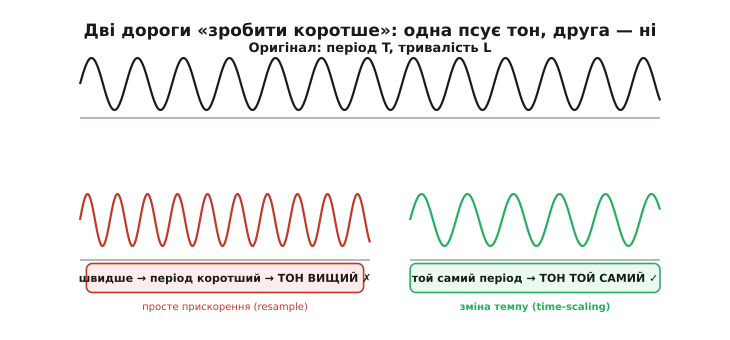
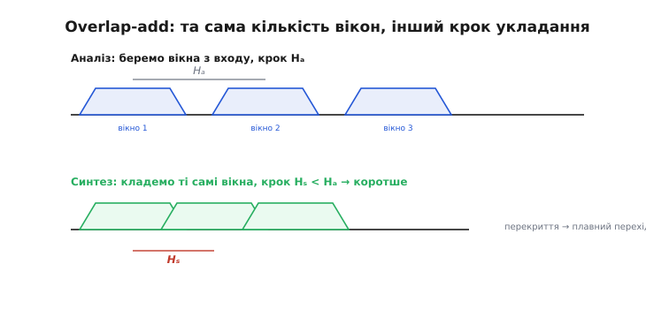
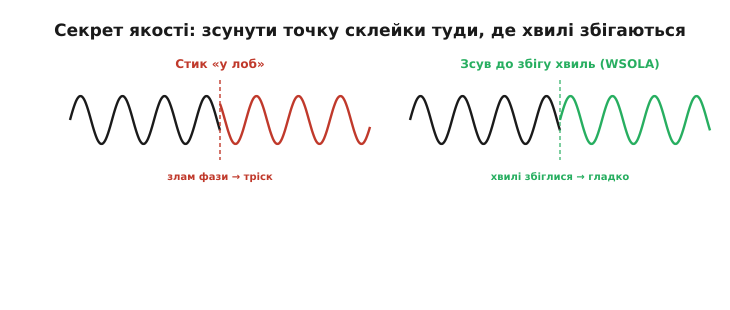
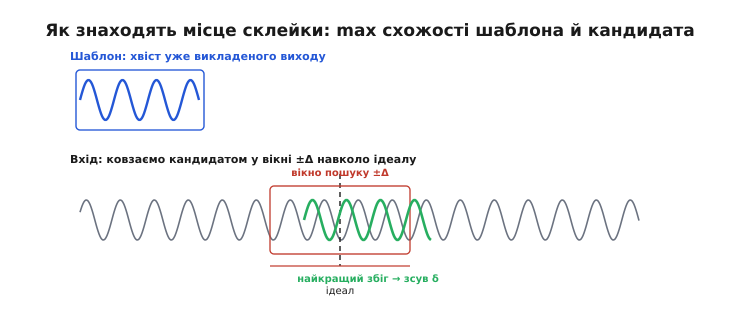

# Зміна темпу без зміни висоти тону

Увімкни платівку на швидшому обертанні — і голос співака перетвориться на писк бурундука. Пригальмуй стрічку — і той самий голос загуде, як у велетня. Це знайомий кожному досвід, і в ньому захована сама суть задачі: **звичайне прискорення звуку неминуче підіймає тон, а сповільнення — знижує**. А що, як треба інакше? Проглянути диктофонний запис лекції вдвічі швидше, але щоб голос лишився людським, не мультяшним. Підтягнути темп пісні під удари метронома, не розстроївши її. Розтягнути звук на кілька мілісекунд, щоб залатати діру від загубленого мережевого пакета, — і щоб слух нічого не помітив. Усе це вимагає розчепити дві речі, які в наївному підході намертво зчеплені: **як швидко минають події** і **якої висоти звучить тон**. Розберімо, чому вони зчеплені, і як їх усе-таки роз'єднати.

### Чому просте прискорення псує тон

Спершу треба зрозуміти, **чому** швидше програвання завжди підіймає тон — бо доки це не ясно, здається, що проблеми й немає. Цифровий звук — це послідовність **відліків** (англ. *sample* — зразок, проба): миттєвих значень тиску повітря, знятих багато тисяч разів на секунду. Висота тону визначається тим, **як часто повторюється хвиля**: нота «ля» першої октави — це 440 повторень форми хвилі за секунду, 440 герц. Період цієї хвилі — приблизно 2.3 мілісекунди.

Тепер уяви найпростіший спосіб «прискорити»: програвати ті самі відліки, але **частіше**, скажімо, вдвічі. Звук справді скінчиться вдвічі швидше — але разом із ним удвічі стиснулися й **усі періоди хвилі**. Те, що тривало 2.3 мс, тепер триває 1.15 мс, а отже, повторюється не 440, а 880 разів на секунду. Тон піднявся на цілу октаву. Прискорення й підйом тону — це **буквально та сама операція**, стиснення осі часу: не можна зробити одне, не зробивши іншого. Саме тому платівка «бурундукає». Цей спосіб — переміряти сигнал у нових точках — зветься **передискретизацією** (*resampling*); він змінює тривалість і тон **разом**, одним рухом, і роз'єднати їх у ньому неможливо в принципі.


*Дві дороги «зробити коротше». Ліворуч — просте прискорення: період хвилі стиснувся разом із тривалістю, тому тон поповз угору (ефект бурундука). Праворуч — те, чого ми хочемо: тривалість інша, а період хвилі той самий, отже, тон не змінився. Уся тема — про праву дорогу.*

Отже, ясна ціль: змінити **тривалість** запису, не чіпаючи **періоду хвилі**. Формально це називають **масштабуванням часу** (*time-scale modification*, TSM): розтягнути або стиснути звук у часі, лишивши висоту тону недоторканою. Зворотна задача — **зсув висоти** (*pitch shifting*): змінити тон, лишивши тривалість, — і, як побачимо наприкінці, це та сама монета з іншого боку.

### Ключова ідея: сигнал майже повторюється

Звідки взагалі береться надія роз'єднати нероздільне? З однієї фізичної властивості звуку: на коротких проміжках **він майже повторює сам себе**. Голосна «а», нота скрипки, гудіння двигуна — усе це майже періодичні сигнали: форма хвилі за один період дуже схожа на форму за сусідній період. Це і є та щілина, у яку можна протиснутися.

Подумай, що означає «сповільнити вдвічі, не чіпаючи тону». Тон визначається періодом хвилі — отже, **самі періоди чіпати не можна**, вони мусять лишитися такими, як були. Але їх має **вкластися вдвічі більше** на ту саму тривалість звучання. Розв'язок напрошується сам: якщо форма хвилі й так майже не міняється від періоду до періоду, то деякі періоди можна просто **повторити** — вставити ще одну майже-копію того, що вже звучало. Слух не помітить підміни, бо вставлений шматок звучить точнісінько як сусідній; а звук розтягнеться, бо періодів стало більше. Щоб **прискорити**, роблять навпаки: періоди час від часу **викидають**. Тон не рухається — кожен окремий період лишився собою, — а тривалість змінюється, бо міняється **кількість** періодів.

Ось і вся серцевина ідеї, до якої зводяться всі якісні методи: **не розтягуй і не стискай самі хвилі — додавай або прибирай їхні майже-копії**. Уся складність далі — суто інженерна: як нарізати сигнал на шматки, куди їх переставити й, найтонше, **як непомітно зшити** місця склейки. За це зшивання й точиться вся боротьба за якість.

### Overlap-add: нарізати, переставити, зшити

Найпряміший спосіб втілити ідею зветься **перекриття-і-додавання** (*overlap-add*, OLA). Робота йде так. Сигнал ріжуть на короткі шматки, що частково **перекриваються**, — їх звуть **зернами** або **кадрами** (*grain*, *frame*), завдовжки зазвичай 20–40 мілісекунд. Кожен кадр множать на плавне **вікно** (*window*) — обгортку, що м'яко наростає від нуля на початку кадру й спадає до нуля в кінці, щоб краї не обривалися різко. А тоді ці вікна-кадри **викладають назад у вихідний сигнал з іншим кроком**, ніж брали з вхідного.

Уся хитрість — саме в цих двох кроках. Крок, з яким кадри **беруть** із входу, позначимо `Hₐ` (крок аналізу, *analysis hop*), а крок, з яким їх **кладуть** у вихід, — `Hₛ` (крок синтезу, *synthesis hop*). Якщо класти щільніше, ніж брали (`Hₛ < Hₐ`), кадрів на одиницю виходу припаде **більше**, і звук **розтягнеться** — це сповільнення. Якщо класти рідше (`Hₛ > Hₐ`), звук **стиснеться** — прискорення. У точках, де сусідні вікна перекриваються, їхні значення просто **додають**; завдяки тому, що вікна плавно спадають до країв, у зоні перекриття один кадр згасає, а другий наростає — виходить плавний **перехресний перехід** (*cross-fade*), а не стик.


*Overlap-add двома кроками. Угорі кадри вирізають із входу рівним кроком Hₐ. Унизу ті самі кадри вкладають у вихід кроком Hₛ. Коли Hₛ менший за Hₐ, кадри лягають щільніше — виходить довше (сповільнення); коли більший — рідше, виходить коротше. У зонах перекриття кадри плавно перетікають один в одного.*

Відношення цих кроків і задає коефіцієнт зміни темпу:

```
α = Hₐ / Hₛ        α > 1 → швидше (стиснення часу)
                   α < 1 → повільніше (розтягнення)
```

Здавалося б, готово. Але якщо зробити рівно так — нарізати рівним кроком і зшити, — результат розчарує: чистий тон забринить, у голосі з'явиться металевий призвук, наче крізь бляшану трубу. Причина в тім, що **точки склейки випадкові щодо хвилі**. Кадр брали з одного місця сигналу, а кладуть у зовсім іншу фазу коливання — і на межі двох кадрів хвиля **стрибає**: щойно вона йшла вгору, а після склейки різко звалюється вниз. Такий раптовий злам форми — це стороння високочастотна складова, якої в сигналі не було; вухо чує її як тріск, дзижчання, металевий відзвук. Плавне вікно згладжує стрибок, але не прибирає його: **фаза** двох кадрів однаково не збігається.

### WSOLA: зсунути склейку туди, де хвилі збігаються

Ось тут і криється винахід, що робить масштабування часу по-справжньому якісним. Думка проста до геніальності: якщо стик псується там, де хвилі не збігаються за фазою, — **не ріжмо наосліп рівним кроком, а трохи посуньмо точку взяття кадру** так, щоб на склейці хвилі якнайкраще збіглися. Ідеальне місце для наступного кадру диктує коефіцієнт α, але ми дозволяємо собі відступити від нього на невеликий люфт — плюс-мінус кілька мілісекунд — і в межах цього люфту шукаємо ту точку, де новий кадр найкраще **продовжує** попередній без зламу.


*Секрет якості — у виборі точки склейки. Ліворуч кадри стикнули там, де випало: фази різні, форма зламується, вухо чує тріск. Праворуч другий кадр узяли трохи зсунутим — так, щоб його початок продовжив кінець попереднього без зламу. Той самий звук, але стик став непомітним.*

Цей прийом і дав назву цілій родині методів: **синхронне перекриття-додавання за подібністю форми хвилі** (*Waveform Similarity Overlap-Add*, WSOLA). Слово «синхронне» тут — про те, що склейку синхронізують із фазою хвилі, а не роблять сліпо по годиннику. Як саме знаходять найкращий зсув? Беруть уже викладений **хвіст виходу** — кілька останніх мілісекунд того, що вже зшито, — і використовують його як **шаблон**. Тоді у вхідному сигналі, у вікні пошуку навколо ідеального місця, ковзають цим шаблоном і питають для кожного положення: **наскільки цей шматок входу схожий на мій хвіст?** Положення з найбільшою схожістю й дає зсув `δ`: саме звідти взятий кадр найкраще продовжить уже зшите.


*Як знаходять місце склейки. Хвіст уже викладеного виходу — це шаблон (рамка ліворуч). Його ковзають по входу в невеликому вікні пошуку навколо ідеальної точки й для кожного положення міряють схожість. Кандидат із найбільшою схожістю (зелений) і задає зсув δ — місце, звідки взяти наступний кадр, щоб він гладко продовжив хвіст.*

Чим міряють схожість? Найпростіше — **взаємною кореляцією** (*cross-correlation*): перемножують шаблон і кандидат відлік-за-відліком і додають добутки. Коли форми збігаються — плюс множиться на плюс, мінус на мінус, усе додатне, сума велика; коли розходяться — добутки то додатні, то від'ємні, вони гасять одне одного, сума мала. Отже, **максимум суми добутків = найкращий збіг форми**. Знайшли максимум — узяли кадр звідти — зшили без зламу. Так робиться для кожного наступного кадру, і кожен стик виходить гладким, бо його **навмисно** поставили туди, де хвиля продовжується сама собою.

Найважливіше: **чому при цьому тон не рухається**. Кожен кадр — це шматок оригіналу, узятий **як є**, без розтягу чи стиску всередині. Його внутрішні періоди хвилі лишилися точно такими, як у джерелі, — отже, і висота тону в ньому та сама. Ми лише міняємо, **як часто** ці кадри лягають у вихід і **звідки саме** їх беремо, а не саму форму хвилі. Тому WSOLA й досягає нездійсненного на перший погляд: тривалість гнеться, а тон стоїть непорушно.

> 🔧 **Навіщо це.** Вікно пошуку — головна ручка WSOLA. Замалий люфт — і алгоритм не встигне знайти добру фазу, стики знову затріщать; завеликий — і кадр можна «затягти» так далеко від ідеального місця, що зміна темпу попливе, а на мову ляже відчутне «булькання». На практиці люфт беруть порядку **одного періоду** найнижчого тону, який треба зберегти: для людського голосу (основний тон від ~80 Гц) це близько 10–12 мс. Тобто вікно пошуку прив'язують не до числа з голови, а до **найнижчої частоти в сигналі** — саме її період мусить уміститися в люфт, щоб алгоритм міг зачепитися за фазу.

### Worked-приклад: скільки відліків узяти й куди покласти

Порахуймо кроки на конкретних числах — це найкраще показує, як три величини (`α`, `Hₐ`, `Hₛ`) керують усім. Нехай запис знято на **48000 відліків за секунду**, кадр — 30 мс, і ми хочемо **сповільнити** звук так, щоб він тривав у 1.5 раза довше (`α = 1/1.5 ≈ 0.667`).

**Умова: fs = 48000 Гц, кадр 30 мс, розтягнення в 1.5 раза.** Обчислюємо кроки й довжину пошукового вікна:

```cpp
// усе в відліках
const int   fs        = 48000;            // частота дискретизації, Гц
const int   frame     = fs * 30 / 1000;   // 30 мс кадру = 1440 відліків
const float alpha     = 1.0f / 1.5f;      // хочемо в 1.5 раза довше → 0.667

// синтез кладе кадри рівним кроком; беремо половину кадру (перекриття 50%)
const int   Hs        = frame / 2;        // крок синтезу = 720 відліків
const int   Ha        = (int)(Hs * alpha);// крок аналізу = 720·0.667 ≈ 480

// вікно пошуку: ±один період найнижчого тону, хай ~11 мс
const int   seek      = fs * 11 / 1000;   // ±528 відліків навколо ідеалу
```

Порахуймо ці числа крок за кроком і подивімося, що вони означають:

```
кадр      = 48000 · 30 / 1000            = 1440 відліків (30 мс)
Hs        = 1440 / 2                      =  720 відліків (кладемо кожні 15 мс)
Ha        = 720 · 0.667                   ≈  480 відліків (беремо кожні 10 мс)
```

Дивись, що вийшло. Кадри **кладуть** у вихід кожні 720 відліків, а **беруть** із входу лише кожні 480 — тобто по вхідному сигналу просуваються **повільніше**, ніж по вихідному. За той самий кадр входу встигає лягти більше виходу — звук розтягується рівно в `Hₛ/Hₐ = 720/480 = 1.5` раза, як і хотіли. При цьому кожен кадр — недоторканий шматок оригіналу завдовжки 1440 відліків, тому тон у ньому не змінився ні на йоту. А вікно пошуку ±528 відліків дає WSOLA люфт, щоб кожні 480 відліків трохи підправити точку взяття кадру й зшити стик по фазі.

Тепер — саме серце: пошук найкращого зсуву за кореляцією. Ось як він виглядає в коді, без прикрас:

```cpp
// Знайти зсув у [-seek, +seek], за якого кандидат зі входу
// найкраще продовжує хвіст уже викладеного виходу (шаблон).
// tail[]   — останні L відліків виходу (шаблон)
// in[]     — вхідний сигнал; base — ідеальна позиція кадру в ньому
int find_best_shift(const float* tail, int L,
                    const float* in, int base, int seek) {
    long  best_corr  = -2147483647L;   // якнайменше, щоб перший збіг переміг
    int   best_shift = 0;

    for (int d = -seek; d <= seek; ++d) {   // пробуємо кожен зсув
        long corr = 0;
        for (int i = 0; i < L; ++i)         // сума добутків = схожість форми
            corr += (long)(tail[i] * in[base + d + i]);
        if (corr > best_corr) {             // запам'ятати найсхожіший
            best_corr  = corr;
            best_shift = d;
        }
    }
    return best_shift;   // δ: звідси беремо наступний кадр
}
```

Цей подвійний цикл і є вся «наука» WSOLA: зовнішній перебирає можливі зсуви `d`, внутрішній рахує для кожного схожість шаблона й кандидата як суму добутків. Кадр із найбільшою сумою — найгладший стик. Далі кадр звідти множать на вікно, додають до хвоста виходу — і переходять до наступного. Усе. На мікроконтролері цей пошук — найдорожче місце (він квадратичний за довжиною шаблона й вікном пошуку), тож саме його оптимізують: беруть коротший шаблон, вужче вікно, рахують кореляцію в цілих числах. **Повний робочий приклад** — з віконною функцією, кільцевим накопиченням виходу та цілочисловою арифметикою — винесено окремо, бо він задовгий для тіла статті.

> ⚙️ **Код:** [Алгоритм масштабування аудіо WSOLA](root:com-signal/wsola-algorithm). Повна реалізація масштабування часу для мікроконтролера: віконна функція Ганна, взаємна кореляція в цілих числах, перекриття-додавання в кільцевому буфері, а також типові пастки — переповнення при множенні, вибір кроку й довжини пошуку.

### Інша дорога: працювати в спектрі

WSOLA працює прямо з формою хвилі в часі. Але є й зовсім інший підхід — перейти в **частотну область**. Сигнал ріжуть на кадри й кожен розкладають на складові частоти [швидким перетворенням Фур'є](root:com-signal/fft) — дістають, з якою силою та в якій фазі присутня кожна частота. Щоб змінити темп, кадри **переставляють у часі рідше або густіше**, лишаючи набір частот у кожному тим самим, — тон і тримається незмінним, адже частоти нікуди не зсунулися.

> 🔧 **Навіщо це.** [ШПФ](root:com-signal/fft) — це швидкий алгоритм розкладу шматка сигналу на складові частоти (з якою силою й фазою присутня кожна). Для спектрального масштабування часу він потрібен двічі на кожен кадр: раз — розкласти вхідний кадр на частоти, і раз — зібрати з підправлених частот вихідний кадр. Саме тому цей метод дорожчий за WSOLA: два перетворення проти простого пошуку зсуву.

Проблема тут своя й підступна. Переставивши кадри в часі, ми **збиваємо фазу** кожної частоти: між кадрами хвиля кожної складової встигає провернутися на інший кут, ніж мала б. Якщо цього не виправити, чисті тони «розмазуються», а голос набуває характерного примарного, «підводного» призвуку. Тому в спектральних методах фазу доводиться **дбайливо перераховувати** — стежити, щоб кожна частота продовжувалася плавно від кадру до кадру. Цей клас методів звуть **фазовим вокодером** (*phase vocoder*; від *voice coder* — «кодувальник голосу»), і саме морока з фазою — його головна складність і головна тема. Він дає прекрасний результат на музиці й тягучих звуках, але коштує дорожче й гірше зберігає різкі удари (клацання, атаку барабана), ніж WSOLA.

Історія цих методів повчальна: фазовий вокодер придумали задовго до того, як він знадобився для зміни темпу, а часові методи типу WSOLA прийшли значно пізніше й перемогли саме простотою.

> 📜 **Історія:** [Від телефонного стиснення до розтягнутого звуку](root:com-signal/audio-time-scaling/hist-time-scaling.md). Фазовий вокодер народили в Bell Labs 1966 року Фленаган і Ґолден — зовсім не для музикантів, а щоб економити смугу телефонного каналу; тільки згодом його обернули на інструмент зміни темпу. А прості й швидкі часові методи — SOLA (1985), PSOLA (1990), WSOLA (1993) — з'явилися пізніше й витіснили вокодер там, де важать швидкість і жива мова.

### Зсув висоти — та сама монета навпаки

Тепер найкрасивіше. Ми весь час міняли тривалість, не чіпаючи тону. А що, як треба навпаки — **змінити тон, лишивши тривалість**? Підняти голос на терцію, не пришвидшивши мову. Виявляється, це не окрема задача, а **комбінація двох, які ми вже вміємо**.

Згадаймо: просте прискорення (передискретизація) міняє тон і тривалість **разом**. А WSOLA вміє міняти тривалість, **не чіпаючи тону**. Склеїмо їх. Щоб підняти тон на октаву, не змінивши тривалості, роблять два кроки: спершу WSOLA **розтягує** звук удвічі (тон той самий, тривалість подвоїлась), а тоді передискретизація прокручує його вдвічі **швидше** (тон піднявся на октаву — і тривалість повернулася до вихідної). Розтягнули без зміни тону — і стиснули зі зміною тону; тривалість повернулась туди, де була, а тон піднявся. Так само донизу: WSOLA стискає, resample сповільнює назад.

```
підняти тон на октаву, зберігши тривалість:
  1) WSOLA:      × 2   тривалості  (тон незмінний)
  2) resample:   ÷ 2   тривалості  (тон × 2, тобто +октава)
  разом:         тривалість та сама, тон удвічі вищий
```

Ось чому масштабування часу — фундаментальніша операція, ніж здається: **опанувавши його, ти безкоштовно дістаєш і зсув висоти**, просто зчепивши з дешевою передискретизацією. Дві задачі, що виглядали протилежними, виявились одним інструментом, повернутим різними боками.

### Де це живе в реальному залізі

Масштабування часу — не лише студійна забавка. У вбудованих системах воно робить цілком приземлену роботу. Найпряміше застосування — **програвач зі змінною швидкістю**: диктофон чи медіаплеєр, де можна пришвидшити начитку до 1.5–2×, не перетворивши лектора на бурундука. Це майже завжди WSOLA — бо вона дешева, працює потоково й не потребує заглядати далеко вперед.

Найтонше застосування ховається в **зв'язку реального часу**. Коли звук іде через мережу, пакети приходять нерівно, і приймач тримає невеликий [буфер джитера](root:com-signal/jitter-buffer), щоб віддавати звук рівним потоком. Але буфер то підростає, то худне; якщо його підправляти грубо — викидати чи дублювати шматки, — у голосі клацає. Розумніші системи натомість **непомітно підганяють темп відтворення** масштабуванням часу: буфер повний — програти на частку відсотка швидше й розсмоктати запас; буфер порожніє — сповільнити й дати пакетам наздогнати. Слух такої мікрозміни темпу не чує, бо тон при цьому стоїть непорушно.

> 🔧 **Навіщо це.** WSOLA — стандартний інструмент **приховування втрат пакетів** у голосі. Загубився пакет — на його місці зяяла б тиша або клацання; натомість беруть останній наявний шматок звуку й масштабуванням часу **розтягують** його на потрібні мілісекунди, латаючи діру майже-копією того, що щойно звучало. Слух пропуску не помічає. Ця латка й уся механіка відновлення після втрат — окрема тема про [приховування втрат пакетів](root:com-signal/packet-loss-concealment).

Спорідненість тут глибока: і буфер джитера, і масштабування часу торгують дрібними спотвореннями заради плавності потоку. Тільки буфер платить **затримкою**, а масштабування — крихітною **зміною темпу**, яку вухо прощає, бо тон недоторканий. Разом вони й тримають живий звук у мережі рівним і чистим попри всі нерівності каналу.

### Що з цього лишається

Наївне прискорення звуку **не можна** відчепити від підйому тону — бо це буквально одна операція, стиснення осі часу разом із періодами хвилі. Роз'єднати їх дозволяє одна властивість звуку: на коротких проміжках він **майже повторює сам себе**, тож замість розтягувати самі хвилі можна **додавати або прибирати їхні майже-копії** — тоді кількість періодів (а з нею тривалість) міняється, а сам період (а з ним тон) стоїть. Найпростіше втілення, **overlap-add**, ріже сигнал на перекривні вікна й укладає їх у вихід з іншим кроком; але сліпа склейка тріщить, бо фази кадрів не збігаються. **WSOLA** лікує це, зсуваючи точку взяття кожного кадру в невеликому люфті туди, де хвилі найкраще збігаються (максимум взаємної кореляції з хвостом виходу), — і стики стають непомітні. Є й спектральна дорога, **фазовий вокодер**, що переставляє в часі кадри частот і дбайливо править фазу, — точніша на музиці, та дорожча й тендітніша на різких звуках. А **зсув висоти** — не окрема задача, а масштабування часу, зчеплене з передискретизацією. У залізі все це працює у програвачах змінної швидкості, у плавному підстроюванні буфера джитера й у приховуванні втрачених пакетів голосу — усюди, де треба зігнути час, не зачепивши тону.
