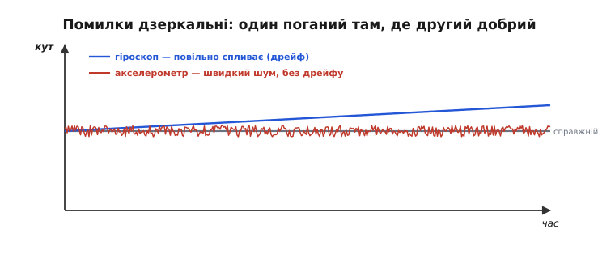
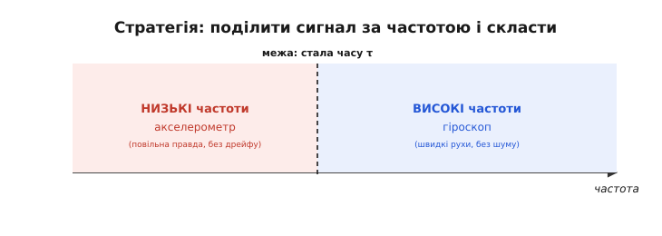
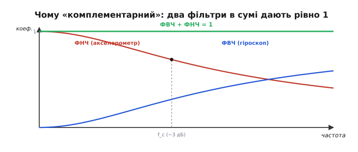
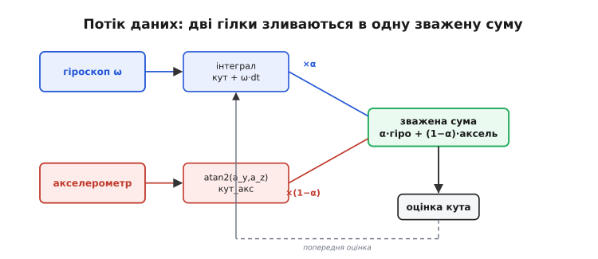
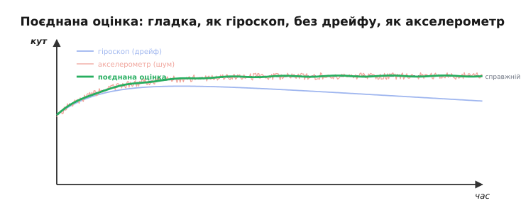
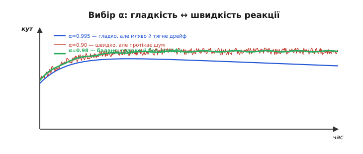
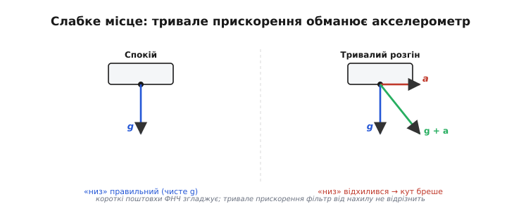

# Комплементарний фільтр: поєднати гіроскоп і акселерометр

Ані [гіроскоп](root:hw-sensing/gyroscope), ані [акселерометр](root:hw-sensing/accelerometer) **поодинці** не дають надійного кута нахилу. Гіроскоп міряє швидкість обертання — її треба інтегрувати, і дрібний зсув нуля з часом перетворюється на **дрейф**, що поволі «з'їдає» кут. Акселерометр дає кут прямо з напрямку тяжіння й **не дрейфує** — та він **шумить** і, гірше, плутає тяжіння з власним прискоренням апарата. Поодинці — двоє кульгавих. Але їхні вади **дзеркальні**, і це відкриває напрочуд просте й дешеве рішення — **комплементарний фільтр** (від лат. *complementum* — «доповнення»: дві частини, що доповнюють одна одну до цілого), робочий кінь усіх аматорських дронів і самобалансних роботів.

Назва звучить науково, та сам метод — чи не найпростіше, що є в усій інженерії орієнтації: одне множення й одне додавання на кожен кут, жодної важкої математики в циклі. Попри цю простоту він робить саме те, що треба, — і тому з нього варто починати знайомство з поєднанням давачів, перш ніж тягтися до строгого, але важчого [фільтра Калмана](root:com-signal/kalman-filter). Розберемо його до самих кісток: **чому** він працює, **як** його написати в один рядок і **де** він зраджує.

### Дзеркальні вади двох давачів

Уся краса в тому, що помилки двох давачів живуть у **різних частинах частотного спектра** — і саме протилежних. Проінтегрований гіроскоп **чудовий на коротких часах**: він точно ловить швидкі, різкі рухи, бо реагує миттєво й без шуму. Зате **на довгих часах** він безнадійний — дрейф накопичується й тягне кут кудись убік. Акселерометр — рівно навпаки: **на довгих часах** він бездоганний, бо завжди «знає», де низ (тяжіння нікуди не дівається), але **на коротких часах** його показ скаче від шуму й від кожного поштовху апарата.

Мовою [спектра](root:math-analysis/spectrum) це звучить чітко: помилка гіроскопа зосереджена в **низьких** частотах (повільний дрейф), а помилка акселерометра — у **високих** (швидкий шум). Дві вади майже не перекриваються в спектрі — і саме тому їх можна розділити частотним фільтром, не зачепивши корисного сигналу, що сидить десь посередині. Це і є та геометрія задачі, яка взагалі робить поєднання можливим: якби обидва давачі хибували в одній смузі частот, жодне розумне змішування не врятувало б.


*Сіра лінія — справжній кут. Синя (гіроскоп) тримається близько на коротких часах, але повільно спливає через дрейф. Червона (акселерометр) у середньому правильна, без дрейфу, та вкрита швидким шумом. Помилки дзеркальні: один поганий там, де другий добрий, — і навпаки.*

Це «дзеркало» — не випадковість, а ключ. Якщо два джерела хибують у протилежних діапазонах, то, узявши від кожного **тільки те, у чому воно сильне**, можна дістати оцінку, кращу за обидві. Гіроскоп хай відповідає за **швидкі зміни**, акселерометр — за **повільну правду**. Лишається технічно поділити сигнал за частотою — і скласти.

Корінь обох вад — у фізиці кожного давача. Гіроскоп дає **швидкість**, а нам потрібен **кут**, тож його доводиться інтегрувати — підсумовувати крок за кроком; і будь-який крихітний сталий [зсув нуля](root:hw-sensing/imu-noise-bias-drift) тоді теж підсумовується, наростаючи в лінійний дрейф. Акселерометр же міряє вектор сили, і в спокої цей вектор — чисте тяжіння, що завжди дивиться вниз; звідси і його кут, і незмінна в середньому правдивість. Але та сама чутливість до сили робить його жертвою кожного поштовху й вібрації мотора — звідси шум. Дві різні фізики — дві різні, дзеркальні вади.

> 🔧 **Навіщо це.** Ніколи не заводьте в контур керування **сирий** кут — ні з самого гіроскопа, ні з самого акселерометра. Перший за пів хвилини «попливе» й завалить апарат; другий тремтітиме й передасть у мотори вібрацію та хибні поштовхи. У будь-якому реальному стабілізаторі між давачами й керуванням **завжди** стоїть поєднання — найчастіше саме комплементарний фільтр. Це не косметичне покращення, а **необхідна умова** того, що апарат узагалі полетить.

### Ідея: поділити за частотою

Мовою частотної області «швидкі зміни» — це **високі** частоти, «повільна правда» — **низькі**. Тоді план стає кристально ясним. З проінтегрованого гіроскопа візьмемо лише **високочастотну** частину (швидкі рухи — там, де він сильний, а його повільний дрейф ми просто відкинемо). З акселерометра візьмемо лише **низькочастотну** частину (повільний, усереднений напрямок «униз» — там, де він сильний, а його швидкий шум ми відріжемо). І складемо.

Аналогія з двома свідками робить цю ідею відчутною. Уявіть, що про подію розповідають двоє. Перший чудово помічає **миттєві** деталі, кожен різкий рух, та має кепську довгу пам'ять і за годину вже плутає, з чого все почалося (це гіроскоп: точний у «зараз», ненадійний у «загалом»). Другий деталей моменту не ловить, відповідає повільно й плутано, зате його загальна, усереднена картина **завжди вірна** (це акселерометр). Розумний слідчий бере від першого швидкі подробиці, від другого — загальну канву, і складає правдиву історію. Комплементарний фільтр — рівно цей слідчий, тільки з давачів.


*Частотну вісь ділять на дві ділянки. Низькі частоти (повільне, усереднене) бере на себе акселерометр — він там без дрейфу. Високі (швидкі рухи) — гіроскоп, він там без шуму. Межу між ними задає одна стала τ; решта — скласти дві частини.*

### Два фільтри, що доповнюють одне одного

Технічно це робить пара [частотних фільтрів](root:com-signal/band-filters): **фільтр верхніх частот** (ФВЧ) на гіроскоп і **фільтр нижніх частот** (ФНЧ) на акселерометр. І тут ховається елегантність, що дала фільтрові назву: ці два фільтри роблять **взаємодоповняльними** так, щоб у сумі вони давали **рівно одиницю** на всіх частотах: ФВЧ(f) + ФНЧ(f) = 1.


*ФНЧ (червоний) пропускає низькі частоти від акселерометра; ФВЧ (синій) — високі від гіроскопа; на межі f_c кожен послаблений до −3 дБ. Складені, вони дають рівно 1 на всіх частотах (зелена пряма): справжній сигнал проходить без спотворення, а кожен давач «звучить» лише там, де він добрий.*

Ця умова — суми **точно** одиниця — і є серцем методу. Вона гарантує, що справжній сигнал (той спільний кут, який обидва давачі намагаються виміряти) проходить крізь фільтр **без жодного спотворення** — не послаблений, не зсунутий. Спотворюються лише **помилки**: дрейф гіроскопа гаситься фільтром верхніх частот (він повільний — його зріже ФВЧ), а шум акселерометра гаситься фільтром нижніх частот (він швидкий — його зріже ФНЧ). Кожна вада потрапляє рівно під той фільтр, що її прибирає.

Тут спрацювала вся машинерія частотного аналізу. Ми мислимо сигнал у **частотній області**, проєктуємо два фільтри з потрібними смугами пропускання й свідомо робимо їх **дзеркальними**, щоб сума давала одиницю. Це не випадковий трюк, а інженерний дизайн: саме частотний погляд на давачі підказав і ідею поєднання, і її точну форму. Без мови спектра комплементарний фільтр годі було б ні придумати, ні свідомо налаштувати — лишалося б тільки навмання крутити коефіцієнти.

### Один рядок коду

Найкраще те, що вся ця частотна краса згортається в **один рядок**, який крутиться на найдешевшому мікроконтролері. Не треба ні матриць, ні тригонометрії в циклі — лише додавання й множення. Ось він мовою прошивки, як його справді пишуть на C:

```c
// один крок фільтра, викликати кожні dt секунд
float acc = atan2f(ay, az);              // опорний кут із акселерометра, рад
angle = alpha * (angle + gyro * dt)      // швидка гілка: гіроскоп
      + (1.0f - alpha) * acc;            // повільна гілка: акселерометр

//  angle — поточна оцінка нахилу (її ж і оновлюємо), рад
//  gyro  — кутова швидкість від гіроскопа, рад/с
//  dt    — справжній період кроку, с
//  acc   — кут із акселерометра, atan2f(ay, az)
//  alpha — коефіцієнт довіри, близький до 1 (напр. 0.98f)
```


*Гіроскоп інтегрують (`angle + gyro·dt`) — це передбачення за швидкістю; акселерометр через `atan2` дає опорний кут. Зважена сума з вагою α на гіроскоп і (1−α) на акселерометр — і є новою оцінкою, що повертається назад як попередня. ФВЧ та ФНЧ тут сховані саме в цій одній формулі.*

Формула напрочуд прозора. Член `alpha * (angle + gyro * dt)` бере **попередню оцінку, докручену гіроскопом** на цей крок: це швидка, миттєва реакція (висока частота). Член `(1 - alpha) * acc` **легенько підтягує** оцінку до того, що каже акселерометр: це повільна корекція, що не дає гіроскопові втекти в дрейф (низька частота). Коефіцієнт α (зазвичай 0.95–0.99) задає, кому більше вірити. А ховається за ним та сама **стала часу** τ = α·dt/(1−α): рухи, швидші за 1/τ, беруться з гіроскопа, повільніші — з акселерометра.

**Приклад (один крок фільтра).** МК працює на 100 Гц (`dt = 0.01f`), `alpha = 0.98f`. На цьому кроці маємо `angle = 10.0°` (попередня оцінка), гіроскоп дає `gyro = 50°/с`, а акселерометр — `acc = 12.0°`. Кут тут у градусах: щоб не мати справи з радіанами, прошивка одразу переводить `atan2f` у градуси, а гіроскоп — у °/с.

```c
float dt = 0.01f, alpha = 0.98f;   // 100 Гц, τ = α·dt/(1−α) = 0.49 с
float angle = 10.0f;               // попередня оцінка, °
float gyro = 50.0f;                // кутова швидкість, °/с
float acc = 12.0f;                 // кут із акселерометра, °

angle = alpha * (angle + gyro * dt) + (1.0f - alpha) * acc;
//      0.98f * (10.0f + 50.0f*0.01f) + 0.02f * 12.0f
//      0.98f * 10.5f                 + 0.24f
//      10.29f                        + 0.24f          ==  10.53f
```

Оцінка пішла переважно за гіроскопом (швидко, до 10.5°) і лише трішки підтяглася до акселерометра (12°). За багато кроків ці крихітні підтягування **не дають** гіроскопу накопичити дрейф, а сам кут лишається гладким — без акселерометрового тремтіння.

Кілька практичних дрібниць, без яких формула не запрацює. По-перше, фільтр застосовують **до кожного кута окремо**: один екземпляр на крен, другий на тангаж, і кожен бере **свою** вісь гіроскопа з правильним знаком. По-друге, `dt` має бути **справжнім** періодом між викликами — не «номінальним» із даташита, а виміряним, бо саме на нього множиться швидкість; «плаваючий» dt тихо псує масштаб інтегрування. По-третє, оцінку на старті розумно **засіяти** показом акселерометра, а не нулем, — щоб фільтр не доганяв правду перші секунди. Дрібниці — та кожна з них колись комусь коштувала години відлагодження.

> ⚙️ Повний робочий модуль на C — структура стану `Comp`, `comp_init`/`comp_step`, крен і тангаж кожен своєю віссю, засів стартової оцінки, «вимикач довіри» до акселерометра під час розгону й покроковий числовий прогон одного такту на 100 Гц — у вставці [Комплементарний фільтр на C](root:com-signal/complementary-filter/proj-complementary-c.md).

> 🔧 **Навіщо це.** Перевірте **знаки й осі** на столі, перш ніж летіти. Нахиліть плату по крену — кут крену має зростати в правильний бік, а тангаж стояти; потім навпаки, по тангажу. Переплутані осі чи перевернутий знак гіроскопа дадуть фільтр, що замість стабілізації **розгойдує** апарат (бо діятиме «за» помилкою, а не проти неї). Цей тридцятисекундний тест на столі рятує апарати частіше, ніж будь-яка теорія.

### Що дає поєднання

Результат вартий своєї простоти: оцінка стає **гладкою, як гіроскоп, і не дрейфує, як акселерометр** — найкраще від обох.

Саме на цьому однорядковому фільтрі десятиліттями трималася аматорська робототехніка. Самобалансні роботи на кшталт сегвея, перші покоління польотних контролерів квадрокоптерів, нахиломіри в іграшках — усе це втримувало рівновагу комплементарним фільтром, бо він **достатньо добрий** і до того ж такий дешевий, що крутиться навіть на 8-бітному мікроконтролері за копійки, не з'їдаючи ні пам'яті, ні часу. Тому правило інженера просте: перш ніж тягтися до складніших методів орієнтації, майже завжди варто спершу спробувати комплементарний фільтр — і дуже часто цього виявляється цілком досить.


*На тлі дрейфливого гіроскопа (блідо-синій) і шумного акселерометра (блідо-червоний) поєднана оцінка (зелена) щільно тримається справжнього кута (сірий пунктир): вона гладка, без стрибків, і не спливає з часом. Один рядок коду перетворив двох кульгавих на одного зрячого.*

### Як вибрати α

Коефіцієнт α — єдине, що тут треба налаштувати, і це той самий [компроміс між згладжуванням і затримкою](root:com-signal/smoothing-vs-lag), що супроводжує будь-яку фільтрацію. Велике α (ближче до 1) — більше довіри гіроскопу: оцінка дуже гладка, майже без шуму, але дрейф виправляється **повільно**, і сильний нахил акселерометр «доганяє» неохоче. Мале α — більше довіри акселерометру: дрейф давиться швидко, зате в оцінку **протікає** шум і кожен поштовх апарата.

Найкраще думати про α не як про абстрактне число, а як про **секунди**. При dt = 0.01 с (100 Гц) α = 0.98 дає τ ≈ 0.5 с, α = 0.99 — близько 1 с, α = 0.995 — майже 2 с. Стала часу τ — це грубо той час, за який акселерометр перетягнув би оцінку до правди, якби гіроскоп раптом замовк. Пів секунди — добрий баланс для дрона: достатньо швидко, щоб дрейф не встиг нашкодити, і достатньо повільно, щоб шум та короткі поштовхи згладжувалися. Звідси й типові «магічні» 0.95–0.99 — за ними просто ховається τ від чверті секунди до секунди.


*Завелике α (0.995, синє) — гладко, але оцінка ще тягне залишковий дрейф і мляво реагує. Замале (0.90, червоне) — швидко тримає правду, та в неї протікає акселерометровий шум. Збалансоване (0.98, зелене) — гладко й без дрейфу. Як і всюди в фільтрації: гладкість проти швидкості реакції.*

> 🔧 **Навіщо це.** Починайте з α ≈ 0.98 на частоті близько 100 Гц — це добра відправна точка для дрона чи самобалансного робота. Якщо оцінка «нервова», тремтить від моторів — підніміть α (більше згладжування); якщо вона «в'яла», запізнюється за реальним нахилом — опустіть. Думайте не про саме α, а про **сталу часу** τ = α·dt/(1−α): саме вона каже, за скільки секунд акселерометр перебиває дрейф гіроскопа. Так налаштування стає осмисленим, а не ворожінням.

### Межі: коли акселерометр бреше

У комплементарного фільтра є вроджена слабкість, і її треба знати. Уся його довіра до акселерометра тримається на припущенні, що той міряє **чисте тяжіння**. Та щойно апарат довго розганяється чи входить у тривалий віраж, акселерометр міряє **суму** тяжіння й власного прискорення — і «низ» для нього **відхиляється**. Опорний кут стає хибним, і фільтр повільно тягне оцінку за цією хибою.


*У спокої акселерометр міряє лише тяжіння g і правильно показує «низ». Та коли апарат розганяється (вектор a), він міряє g + a, і вектор «низу» відхиляється — опорний кут бреше. На коротких поштовхах це згладжується, а от тривале прискорення комплементарний фільтр відрізнити від нахилу не вміє.*

На коротких поштовхах це не біда — їх давить фільтр нижніх частот. Проблема саме з **тривалим** прискоренням: його фільтр відрізнити від справжнього нахилу не здатний. Є й друге обмеження: акселерометр **не бачить рискання** (тяжіння симетричне навколо вертикалі), тож курс комплементарним фільтром «гіро+акселерометр» не виправити — для нього потрібен [магнітометр](root:hw-sensing/magnetometer) як третій давач (так само, через свій комплементарний канал).

З головною вадою — обманом від тривалого прискорення — на практиці борються хитро. Помітити обман нескладно: якщо **довжина** виміряного вектора помітно відрізняється від g, отже, до тяжіння домішалося власне прискорення, і акселерометру в цю мить вірити не можна. Тоді фільтр на час маневру **тимчасово зменшує** довіру до акселерометра (фактично піднімає α), спираючись майже лише на гіроскоп, а коли |a| знову повертається до g — відновлює звичну вагу. Цей простий «вимикач довіри» вже наближає комплементарний фільтр до того, що **строго й автоматично**, на кожному кроці, робить фільтр Калмана.

Звідки взялася сама ідея? Це класика **інерціальної навігації**: ще в авіаційних системах так поєднували, скажімо, барометричну висоту (точну в середньому, але повільну) з висотою від акселерометра (швидкою, але дрейфливою) — той самий комплементарний поділ за частотою. А ще комплементарний фільтр — це, по суті, **спрощений, з фіксованою довірою α**, родич знаменитого [фільтра Калмана](root:com-signal/kalman-filter), який обчислює оптимальну довіру **сам**, виходячи зі статистики шумів давачів. Коли постійного α замало — коли шуми міняються, а вірити давачам треба то більше, то менше, — настає час Калмана.

---
