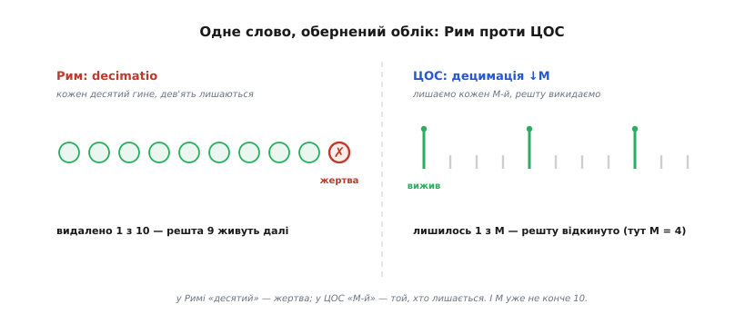
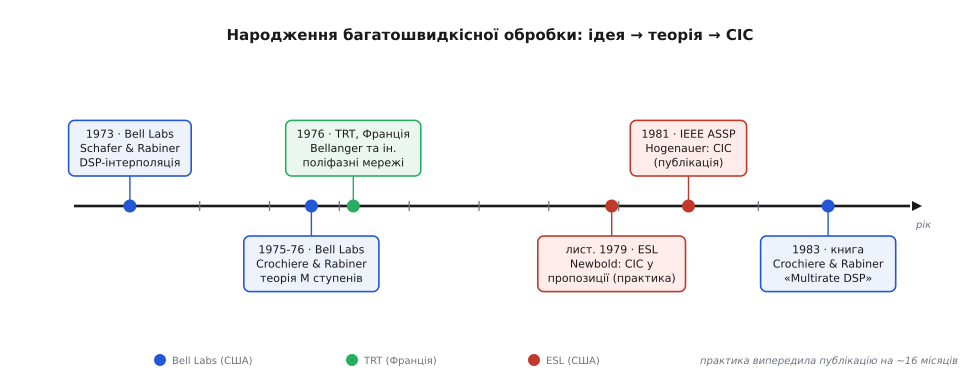

# 📜 Народження мультирейту: від римської кари до безмножникового CIC

Слово «децимація» старше за цифрову обробку сигналів на два тисячоліття, а сама багатошвидкісна обробка — та дисципліна, що вчить чесно міняти частоту відліків, — зібралася напрочуд швидко: за одне десятиліття, з 1973 по 1983 рік, у кількох лабораторіях по різні боки Атлантики. Ця вставка простежує дві нитки — звідки взялася назва й звідки взялися прийоми, — і принагідно розрізняє три речі, які легко сплутати: ідею, публікацію й практику. Бо в цій історії вони не збігаються між собою.

## Слово: decimatio, або як «десятий» помінявся ролями

Латинське **decimatio** (від *decimus* — «десятий») означало буквально «вилучення десятого» і не мало жодного стосунку до сигналів: то була кара в римському війську. Підрозділ, що завинив у боягузтві, заколоті чи дезертирстві, шикували, тягли жереб — і кожного десятого за жеребом решта забивали на смерть власними руками (*fustuarium*, кара киями). Уцілілих ще й переводили на ячмінь замість пшениці й виганяли ночувати за вал табору. Найдокладніший опис самого звичаю лишив грецький історик **Полібій** (гр. Πολύβιος) у шостій книзі «Історії». Найгучніший же випадок — пізніший: **Марк Ліциній Красс** (лат. Marcus Licinius Crassus) 71 року до н. е., під час війни зі Спартаком, за свідченням **Плутарха** відібрав 500 тих, хто першим кинувся тікати, розбив на 50 десятків і стратив по одному з кожного — п'ятдесят душ, «відновивши кару, що давно вийшла з ужитку». (Це переказ Плутарха, писаний майже за два століття по події, тож деталь про рівно 500 варто брати як його свідчення, а не як протокол.)

Тепер придивімося, що зробила з цим словом цифрова обробка, бо тут криється тонка іронія. У Римі decimatio **видаляла** десятого: один гине, дев'ять лишаються. У сигналах «децимація у M разів» веде **обернений облік** — вона лишає кожен M-й відлік, а решту M−1 викидає: тепер виживає один, а гине багато. «Десятий» помінявся ролями — з приреченого став єдиним уцілілим. І сам масштаб уже не десять: M — довільне число (4, 8, 64…), а не конче 10. Строго кажучи, це подвійна вільність зі словом, і прискіпливі автори не раз зауважували, що термін неточний; та він прижився в підручниках і лишився.


*Зліва — Рим: із десяти гине один (жертва), дев'ять лишаються. Справа — ЦОС: із кожних M відліків лишається один, решту відкидаємо. Той самий корінь, обернена дія: «десятий» із приреченого став єдиним уцілілим, а десятка перетворилася на довільне M.*

## Дві нитки теорії: Мюррей-Гілл і Франція

Прийоми, а не назва, народилися в 1970-х, і головна їхня колиска — **Bell Telephone Laboratories** у Мюррей-Гіллі (Нью-Джерсі), дослідницьке серце американської телефонної компанії AT&T. Першу цеглину поклали 1973 року **Рональд Шейфер** (англ. Ronald W. Schafer, нар. 1938) і **Лоуренс Рабінер** (англ. Lawrence R. Rabiner, нар. 1943, Бруклін) статтею «A Digital Signal Processing Approach to Interpolation» у *Proceedings of the IEEE*: вони показали, що зміну частоти відліків — і вгору, і вниз — можна робити ощадно, звичайним цифровим фільтром, а не громіздкими аналоговими викрутасами.

Далі естафету підхопив **Рональд Крошʼєр** (англ. Ronald E. Crochiere) — знову ж таки з Bell Labs — у парі з тим самим Рабінером. У серії робіт 1975–1976 років вони виклали загальну теорію **багатоступеневих** проріджувачів та інтерполяторів: як розкласти велике M на множники й спускати частоту сходами дешевих фільтрів замість одного непідйомного. Це та сама ідея, на якій тримається вся практична децимація з великим коефіцієнтом. Вінцем їхньої праці стала книга 1983 року «Multirate Digital Signal Processing» (Prentice-Hall) — перший цілісний том про предмет, що й дав дисципліні усталену назву та канон.

Було б несправедливо звести все до Bell Labs, бо паралельно й незалежно тяглася друга нитка, французька. 1976 року **Моріс Беланже** (фр. Maurice Bellanger, нар. 1941) із фірми TRT (французька філія Philips) у співавторстві з Бонро (Bonnerot) і Кудрезом (Coudreuse) опублікував поняття **поліфазної мережі** («Digital filtering by polyphase network»): спосіб так перебудувати фільтр, щоб він і проріджувач злилися в одну ощадну операцію, де жоден майбутній-викинутий відлік узагалі не рахується. Дві школи дивилися на одну задачу з різних боків — американська дала теорію багатоступеневого спуску, французька — [поліфазну структуру](root:com-signal/polyphase-fir) кожного шару, — і разом вони склали кістяк того, що ми звемо мультирейтом.


*Десятиліття, за яке зібралася дисципліна. Синє — Bell Labs (США): ідея (1973), теорія багатоступеневого спуску (1975-76), підсумкова книга (1983). Зелене — TRT (Франція): поліфазні мережі (1976). Червоне — ESL (США): CIC спершу в робочій пропозиції (кінець 1979), аж потім у пресі (1981).*

## Безмножниковий фільтр Гогенауера

Лишалося найгарячіше місце — самий вхід, де потік із [сигма-дельта-АЦП](root:hw-analog/sigma-delta-adc) летить на мегагерцах. Там навіть найдешевший КІХ задорогий, бо кожне **множення** на такій частоті коштує чимало кремнію й енергії. Потрібен був фільтр, що взагалі обходиться без множень.

Його дав **Юджин Гогенауер** (англ. Eugene B. Hogenauer) статтею «An Economical Class of Digital Filters for Decimation and Interpolation» (*IEEE Trans. ASSP*, том ASSP-29, квітень 1981, с. 155–162). Хитрість — зробити ковзне усереднення не «в лоб», а рекурсивно, самими додаваннями й відніманнями:

```
інтегратор (на високій частоті):   y[n] = y[n−1] + x[n]      ← лише «+»
      ↓M   (проріджування)
гребінка   (на низькій частоті):    z[m] = w[m] − w[m−1]      ← лише «−»
```

Кілька інтеграторів-суматорів стоять до проріджувача, стільки ж «гребінкових» відніматорів — після нього; усі коефіцієнти одиничні, тож не треба ні множників, ні пам'яті під таблицю коефіцієнтів. Цей **каскад інтегратор–гребінка** (англ. *cascaded integrator-comb*, CIC) відтоді — стандартний перший шар кожного сигма-дельта-АЦП і приймача програмного радіо; повну його механіку розібрано окремо як [CIC-фільтр](root:com-signal/cic-filter).

## Ідея, публікація, практика — три різні дати

А тепер обіцяне розрізнення, бо історія CIC — рідкісно чистий приклад того, як публікація **не** збігається ні з ідеєю, ні з першим робочим ужитком.

Публікація — квітень 1981-го. Але сам фільтр Гогенауер довів до пуття ще восени 1979-го, а рукопис подав у березні 1980-го. Ба більше: за розслідуванням інженера-практика **Рика Лайонса** (Rick Lyons, 2012), CIC працював в ESL — сигнальній фірмі з Кремнієвої долини, де служив Гогенауер, — ще **до** статті. Колега Гогенауера **Річард Ньюболд** (Richard Newbold) застосував фільтр у проєктній пропозиції, датованій 21 листопада 1979 року, за шістнадцять місяців до публікації; частотну характеристику Ньюболд рахував уручну на кишеньковому калькуляторі HP-35, і саме той його графік став Рисунком 3 у статті Гогенауера. У чорновику стаття згадувала й Ньюболда, і ще одного колегу, Гаррі Ґлейза (Harry Glaze), — але з остаточного, надрукованого варіанта ці імена зникли, з невідомих причин. Самого ж Гогенауера, коли Лайонс 2012 року спитав, як народилася ідея, той відповісти відмовився.

Що з цього випливає, варто сказати прямо, аби нікого не приписати зайвого й нікого не забути. **Ідея** CIC має непевне походження: її автор про генезу змовчав, тож коли саме й у чиїй голові вона зблиснула — документально невідомо. **Практика**, тобто робочий ужиток фільтра, задокументована пропозицією ESL кінця 1979-го й випередила пресу на півтора року. А **публікація** 1981-го — це те, що винесло CIC у світ, дало йому строгий аналіз, ім'я автора й закріпило термін. Три різні речі й три різні дати; злити їх в одне «Гогенауер винайшов CIC 1981 року» означало б стерти і Ньюболда з його HP-35, і той факт, що працюючий фільтр жив у пропозиції оборонного підрядника ще до того, як про нього дізналася наука. Честь за опубліковану теорію й акуратний аналіз — по праву Гогенауерова; але «опублікував» і «першим пустив у діло» — тут не одне й те саме.

За це десятиліття предмет пройшов увесь шлях: від тези «частоту можна міняти звичайним фільтром» до названої дисципліни з канонічною книгою й безмножниковим робочим коником на найгарячішому шарі. А в самій його назві досі живе перевернутий відгомін римського жереба.
