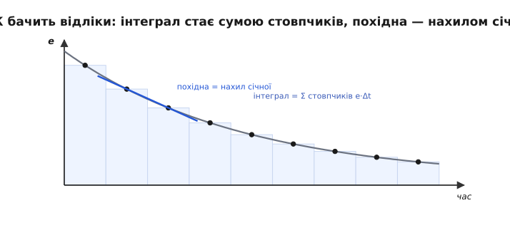
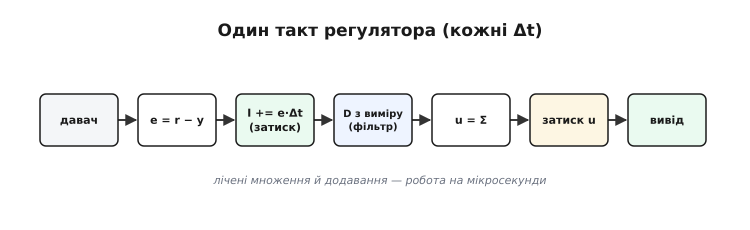
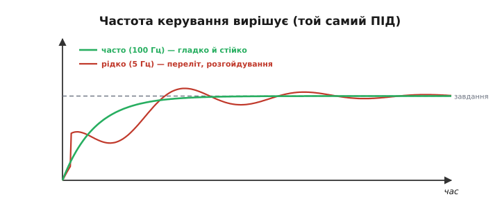
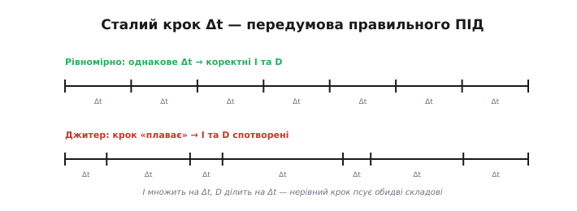
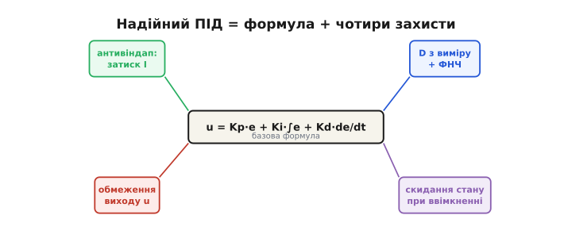
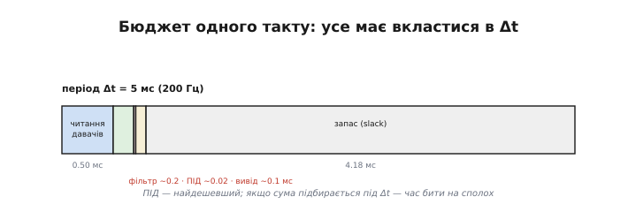

# Дискретний ПІД

Класичні формули ПІД (пропорційно-інтегрально-диференційний регулятор) — **неперервні**: [інтегральна](root:embedded/integral-control) і [похідна](root:embedded/derivative-control) складові означені для безперервного часу. Мікроконтролер же працює **тактами**: прокидається кожні Δt секунд, читає давачі, рахує, видає вплив — і засинає до наступного такту. Щоб ПІД ожив у коді, його треба перекласти на цю дискретну мову — а заразом додати кілька **захистів**, без яких підручникова формула в реальному залізі поводиться кепсько або й небезпечно.

Розрив між формулою й кодом більший, ніж здається. У підручнику ПІД — три гарні члени; у працездатній прошивці навколо них стоїть удвічі більше рядків «обв'язки»: вимірювання часу, захист від насичення, фільтри, обмеження виходу, скидання стану. Саме ця непоказна обв'язка й відрізняє регулятор, що **літає**, від того, що красиво виглядає на папері, а в залізі смикається чи перекидає апарат. Тож вартий уваги не лише переклад формул, а й уся потрібна довкола них обв'язка — бо вона тут не менш важлива за самі коефіцієнти.

### Від інтеграла й похідної — до суми й різниці

Переклад напрочуд прямий. Інтеграл — це площа, тобто сума тонких прямокутників; на кожному такті ми додаємо один прямокутник `e·Δt` до накопичувача. Похідна — це нахил, тобто різниця двох сусідніх вимірів, поділена на крок часу.

```
 неперервне   →   дискретне (крок Δt)

 ∫e dt        →   integral += e · Δt          (сума прямокутників)
 de/dt        →   (e − e_попередній) / Δt     (різниця сусідніх відліків)
```


*Неперервне стає дискретним. МК бачить помилку не як гладку криву, а як відліки через Δt. Інтеграл перетворюється на суму прямокутників `e·Δt`, похідна — на різницю двох сусідніх відліків, поділену на Δt (нахил січної). Що менший Δt, то точніше дискретне наближення повторює неперервний оригінал.*

Уся неперервна математика ПІД зводиться до двох простих дій над числами: **накопичувати** суму й **віднімати** сусідні відліки. Ні інтегралів, ні похідних у коді нема — лише додавання, віднімання й множення, що їх легко виконує найдешевший мікроконтролер.

Дискретні версії — це **наближення** неперервних, і точність наближення залежить від Δt. Сума прямокутників лише приблизно дорівнює справжній площі під кривою (це найпростіша, «прямокутна» квадратура — по суті метод Ейлера); різниця двох відліків лише приблизно дорівнює миттєвому нахилу. За малого Δt похибка наближення мізерна, і нею нехтують; за великого — наближення грубшає, і саме звідси частина проблем рідкої дискретизації. Тобто Δt впливає не лише на швидкість реакції, а й на саму **точність** математики ПІД.

### Один такт регулятора

Ось кістяк **надійного** дискретного ПІД — не голий підручниковий, а вже із захистами. Тут це псевдокод одного такту; повний компільований модуль на C з ініціалізацією, структурою стану й числовим прогоном — у вставці нижче.

```
// викликається РІВНОМІРНО кожні Δt (найкраще — з таймера)
e = setpoint − measurement;                       // помилка
integral += e * dt;                               // I: накопичуємо
integral = clamp(integral, I_min, I_max);         // антивіндап
deriv = (measurement_prev − measurement) / dt;    // D від виміру
deriv_f += (deriv − deriv_f) * dt / (dt + τ);     // ФНЧ на похідну
u = Kp*e + Ki*integral + Kd*deriv_f;              // сума трьох складових
u = clamp(u, u_min, u_max);                        // межі виконавчого органу
measurement_prev = measurement;                    // запам'ятати для наступного такту
output(u);                                          // видати вплив
```

> ⚙️ Повний робочий модуль на C — структура стану `PID`, `pid_init`/`pid_step`/`pid_reset`, усі чотири захисти в правильному порядку й покроковий числовий прогон одного такту на 200 Гц — у вставці [Надійний дискретний ПІД на C](topic:com-signal/discrete-pid/proj-pid-c.md).


*Що відбувається за один такт. Прочитати давач, порахувати помилку e, накопичити інтеграл із затиском, узяти похідну від виміру з фільтром, скласти три складові, обмежити вихід межами мотора, видати вплив і запам'ятати вимір. Дев'ять рядків, що крутяться сто разів на секунду, — і є серце стабілізації.*

Обчислень тут — лічені множення й додавання, тож сам ПІД виконується за **мікросекунди**. Уся складність не в арифметиці, а в **захистах** довкола неї та в **рівномірності** викликів.

Дві технічні тонкощі коду варті окремої уваги. **Порядок** дій важить: спершу оновлюємо інтеграл і **одразу** його затискаємо, лише потім складаємо вплив — інакше роздутий інтеграл устигне просочитися у вихід. І частина змінних — `integral`, `measurement_prev`, `deriv_f` — мусить **жити між викликами** (це **стан** регулятора), а не створюватися наново щотакту; у коді їх роблять статичними чи полями структури. Забути про збереження стану — типова помилка початківця, від якої інтеграл і похідна просто не працюють, бо щоразу починають з нуля.

### Період і частота дискретизації

Найперше питання — **як часто** викликати регулятор. Період Δt (і обернена до нього частота 1/Δt) має бути достатньо **малим**, щоб регулятор устигав за динамікою об'єкта. Груба засада: дискретизуйте **багато разів швидше** (умовно у 10–20 разів), ніж найшвидші рухи, які треба ловити. Для стабілізації дрона це сотні разів на секунду (типово 0.5–8 кГц у польотних контролерах), для повільної печі — кілька разів на секунду досить.


*Чому частота важлива: той самий ПІД, різна частота керування. Часта дискретизація (зелений) тримає вихід гладко й стійко. Рідка (червоний) — регулятор бачить світ уривками, реагує запізно, дає переліт і розгойдування, а на зовсім малій частоті взагалі втрачає стійкість. Замало тактів — і навіть бездоганно налаштований ПІД не врятує.*

Чому замала частота **руйнує** керування? Бо між тактами регулятор **сліпий**: вплив тримається сталим, а об'єкт тим часом живе своїм життям. Що рідші такти, то більше регулятор «відстає» від подій — а відставання [штовхає контур до коливань](root:embedded/loop-stability) і втрати стійкості. Тому перше, що варто перевірити в «капризному» контурі, — чи досить **швидко** він тактує.

Скільки саме — підказує природа об'єкта. Орієнтир: частота керування має бути в кілька десятків разів вищою за найшвидші коливання, які контур має приборкувати. Дрон зі своїми спритними рухами тактує сотні-тисячі разів на секунду; круїз-контроль авто — десятки; піч чи акваріум — одиниці. Брати частоту «із запасом» дешево (ПІД копійчаний за обчисленнями), тож радше тактуйте **частіше**, ніж ризикуйте занизити; єдина стеля тут — бюджет такту, тобто скільки роботи встигає вкластися в один період.

### Сталий крок — і чому це критично

Менш очевидна, але дуже підступна вимога: Δt має бути не лише малим, а й **сталим**. Адже інтеграл множить помилку на Δt, а похідна ділить на Δt — тож якщо крок «плаває» від такту до такту (то 5, то 8 мс), обидві складові рахуються з **хибним** масштабом, і регулятор поводиться непередбачувано.


*Сталий крок — передумова правильного ПІД. Угорі — рівномірні такти через однакове Δt: інтеграл і похідна рахуються коректно. Унизу — «плаваючі» такти (джитер, англ. jitter — «тремтіння»): то густо, то рідко. Оскільки I множить на Δt, а D ділить на Δt, нерівний крок спотворює обидві складові — регулятор «нервує» без видимої причини.*

Тому ПІД майже завжди запускають **з апаратного таймера** (переривання через рівні проміжки), а не «коли дійдуть руки» в головному циклі. Якщо ж рівномірність гарантувати не вдається, рятує другий прийом — **міряти справжній** Δt щоразу (за таймером-лічильником) і підставляти його фактичне значення у формули, а не номінальне з даташита.

Між підходами є чітка ієрархія надійності. Найкраще — **апаратний таймер**, що викликає регулятор через точно рівні проміжки незалежно від решти програми. Якщо таймера бракує, прийнятно **міряти** фактичний Δt лічильником і підставляти його у формули — тоді навіть нерівні виклики дадуть правильні I та D. А найгірше — припускати сталий **номінальний** Δt, тимчасом як виклики «плавають»: саме так народжуються найзагадковіші збої ПІД, що їх годі пояснити коефіцієнтами, бо причина — не в них, а в зіпсованому масштабі часу.

> 🔧 **Навіщо це.** Запускайте контур керування **за таймером**, а не в довільному місці головного циклу. У головному циклі повно непередбачуваного — обмін по радіо, запис на карту, інша робота, — і період «плаватиме», тихо псуючи інтеграл та похідну. Рівномірний такт від таймера (або, як мінімум, чесно виміряний фактичний Δt) — це фундамент, без якого жодні гарні коефіцієнти не дадуть стабільного ПІД. Першими підозрюйте саме нерівний такт, коли добре налаштований регулятор раптом «нервує».

### Захисти, без яких ПІД не злетить

Підручникова формула `u = Kp·e + Ki·∫e + Kd·de/dt` у реальному залізі **гола** й вразлива; щоб вона працювала, на неї нашаровують чотири обов'язкові доповнення.


*Чотири захисти надійного ПІД. На базову суму трьох складових нашаровують: антивіндап (затиск [інтеграла](root:embedded/integral-control)), похідну від виміру з фільтром ([D-складова](root:embedded/derivative-control)), обмеження виходу межами виконавчого органу й скидання стану при ввімкненні. Без них формула «літає» лише на папері; із ними — у реальному апараті.*

- **[Антивіндап](root:embedded/integral-control)** (anti-windup, від англ. *wind up* — «накручувати»): затискати інтеграл (чи припиняти його накопичення) у насиченні — інакше дикий переліт.
- **[Похідна від виміру](root:embedded/derivative-control) + фільтр**: брати −Δ(measurement)/Δt замість Δe/Δt (нема поштовху від зміни завдання) і згладжувати фільтром низьких частот (нема шумових сплесків).
- **Обмеження виходу**: затискати u у фізичні межі мотора чи серво — регулятор не повинен «вимагати» неможливого.
- **Скидання стану при ввімкненні**: обнуляти інтеграл (а часто й похідну) у момент зброєння/зльоту — інакше накопичений за простою «борг» вистрелить апарат (теж різновид windup).

Окремо варто згадати **плавне ввімкнення** (bumpless transfer, англ. — «перехід без поштовху»): коли контур перемикають у роботу, бажано, щоб вихід не стрибнув, — для цього стан регулятора підбирають так, щоб перший вплив збігся з поточним. Це робить вмикання непомітним, без ривка.

Кожен із цих захистів — латка на конкретну, добре відому аварію. Нема антивіндапу — дикий переліт після насичення. Похідна від помилки замість виміру — ривок виконавчого органу за кожної зміни завдання. Нема фільтра D — деренчання моторів від шуму. Нема обмеження виходу — регулятор «вимагає» від мотора неможливого й непередбачувано поводиться на межі. Не скинули стан при ввімкненні — стрибок у першу ж секунду. Тобто це не «прикраси», а відповіді на п'ять конкретних способів, якими голий ПІД ламається в реальному житті, — і досвідчений інженер закладає їх **наперед**, не чекаючи, поки кожен дасться взнаки.

### Бюджет реального часу

Регулятор живе в **жорсткому часі**: уся робота одного такту — прочитати давачі, поєднати їх (фільтр чи [Калман](topic:com-signal/kalman-filter)), порахувати ПІД і видати вплив — мусить **вкластися** в період Δt, ще й із запасом. ПІД тут найдешевший (мікросекунди), та решта такту теж важить.


*Бюджет одного такту Δt. У період (скажімо, 5 мс на 200 Гц) мусять уміститися читання давачів, поєднання (фільтр чи Калман), сам ПІД і вивід на виконавчий орган — і лишитися запас. Якщо робота не влазить у такт, регулятор почне «захлинатися», пропускати такти й втрачати потрібну рівномірність. Це той самий бюджет реального часу, що й у будь-якому цифровому фільтрі на МК.*

**Приклад (бюджет такту на 200 Гц).** Δt = 1/200 = 5 мс.

```
 читання IMU по I²C    ~ 0.5 мс
 поєднання (фільтр)    ~ 0.2 мс
 ПІД (×3 осі)          ~ 0.02 мс
 вивід на мотори       ~ 0.1 мс
 ─────────────────────────────
 разом                 ~ 0.8 мс   →  запас ≈ 4.2 мс  ✓
```

Запас великий — отже, можна або підняти частоту, або додати обчислень (складніше поєднання). Якби ж сума підбиралася під 5 мс, час було б бити на сполох: бракне запасу — і за першого ж стрибка навантаження такт «попливе».

Що робити, якщо робота не влазить у такт? Варіантів кілька: знизити частоту (більший Δt), спростити найдорожчий етап (зазвичай це поєднання або повільний давач), винести довгі операції — запис на карту, радіо — у нижчий пріоритет **поза** контуром керування, або перейти на швидший чип. Головне правило — **контур керування має бути найвищим пріоритетом**: усе інше зачекає, а такт ПІД — ні. У системах з операційкою реального часу так і роблять: стабілізація — найвищий пріоритет, решта — нижчий.

> 🔧 **Навіщо це.** Тримайте контур керування **найвищим пріоритетом** і стежте за **запасом** часу в такті. Виміряйте, скільки реально триває один такт (читання + поєднання + ПІД + вивід), і переконайтеся, що це помітно менше за Δt. Якщо запасу майже нема — рано чи пізно за стрибка навантаження такт «попливе», і апарат втратить стабільність у найгірший момент. Запас часу — така ж частина надійності, як антивіндап чи фільтр; без нього все інше марно.

### Цілі числа чи float

Останнє рішення — у чому рахувати. Сучасні 32-бітні мікроконтролери здебільшого мають апаратну **рухому кому** (FPU, англ. *floating-point unit*), тож ПІД пишуть просто на `float` — швидко й без мороки. На дешевих 8-бітних чипах без FPU рухома кома повільна, і тоді переходять на **цілочисельну** (фіксовану) арифметику — [формат Q](topic:com-signal/fixed-point-implementation) з його обережністю щодо масштабу й насичення. Головне — пам'ятати про **діапазон**: інтеграл, що довго накопичується, може **переповнити** ціле, тож його (як і всі проміжні величини) тримають у достатньо широкому типі й затискають межами.

Як зрозуміти, чи потрібна фіксована кома? Орієнтуйтесь на чип. Є FPU (більшість сучасних 32-бітних ARM Cortex-M4/M7, ESP32) — пишіть на `float` і не морочтеся; нема FPU (8-бітні AVR, найдешевші M0) і потрібна висока частота — рахуйте в цілих. Найпідступніша пастка цілочисельного ПІД — саме **переповнення інтеграла**: він єдиний накопичується необмежено, тож його тримають у широкому типі (32 чи 64 біти) і обов'язково затискають антивіндапом, який тут рятує одразу від двох бід — і від накопичувального насичення, і від арифметичного переповнення.

Існує й інша форма запису — **інкрементна** (швидкісна): замість самого впливу u регулятор рахує його **приріст** Δu за такт і додає до попереднього виходу. Вона зручна, коли виконавчий орган сам «інтегрує» (наприклад, кроковий двигун), і має приємний побічний ефект — природну стійкість до windup. Кістяк коду вище — це класична, **позиційна** форма (що рахує u цілком); інкрементна — корисна альтернатива для особливих випадків.

Для більшості задач — і точно для [стабілізації орієнтації](topic:sys-dron/roll-pitch-yaw-control) — позиційного ПІД із чотирма захистами цілком досить, і саме його варто опанувати першим. Інкрементну форму тримайте в пам'яті як інструмент для особливих випадків — інтегрувальні виконавчі органи, перемикання режимів без ривка, — а не як щоденний вибір. Надійний позиційний ПІД покриває переважну більшість того, що колись доведеться стабілізувати.

> 🔧 **Навіщо це.** Не пишіть «голий» ПІД із підручника — одразу закладайте **всі чотири захисти** (антивіндап, D від виміру + фільтр, обмеження виходу, скидання стану) і **рівномірний такт**. Саме брак цих дрібниць, а не формула, — найчастіша причина, чому «правильний» ПІД поводиться дивно: дикий переліт (нема антивіндапу), деренчання моторів (нема фільтра D), ривок за зміни завдання (похідна від помилки), стрибок при ввімкненні (не скинули інтеграл). Робочий ПІД — це формула **плюс** ця обв'язка.

Отже, дискретний ПІД, готовий крутитися на реальному мікроконтролері, складається не з самої формули, а з повного набору: переклад інтеграла й похідної на суму й різницю, рівномірний такт, чотири захисти й бюджет реального часу. Це робоче серце регулятора. Над ним стоять дві суто практичні надбудови — [добір трьох коефіцієнтів](root:embedded/pid-tuning-cascade) під конкретний апарат і поєднання кількох контурів у [каскади](topic:com-signal/stabilization-cascade), аж до стабілізації польоту. А налаштувати ПІД — окреме мистецтво: ті самі три числа можуть і впевнено підняти апарат у повітря, і кинути його об землю, тож братися до них варто з методом, а не навмання.
