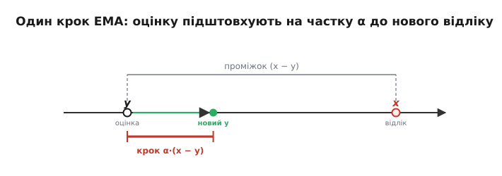
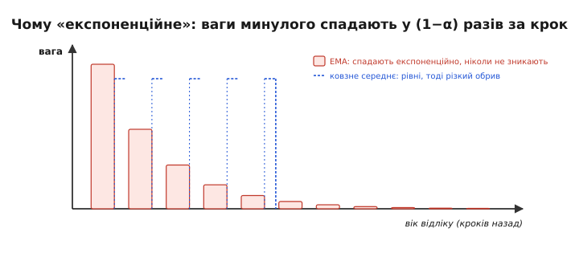
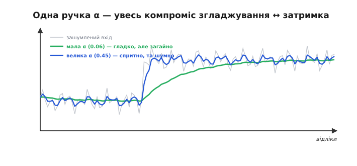
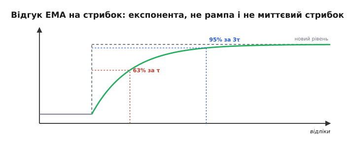
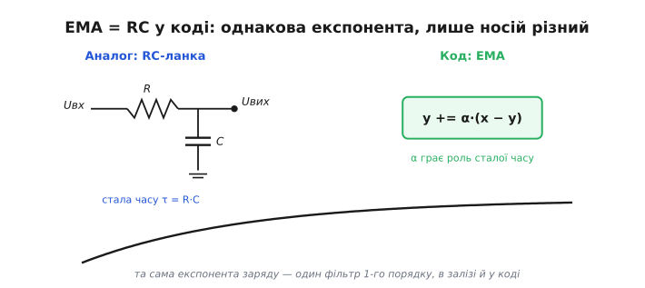
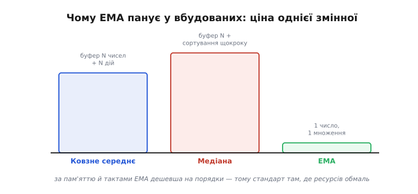

# Експоненційне згладжування (EMA)

Ковзне середнє й медіана мусили **зберігати** ціле вікно відліків. Експоненційне згладжування (*exponential moving average*, EMA) обходиться **одним-єдиним** збереженим числом — поточною оцінкою — і одним множенням на кожен новий відлік. Це найдешевший фільтр, який існує, і саме тому він панує у вбудованих системах: де на лічені байти пам'яті й кволе ядро не влізе буфер на сотню відліків, EMA працює залюбки. Замість того щоб **пам'ятати** минуле, він тримає одну згладжену оцінку й на кожному кроці легенько **підштовхує** її до свіжого показу.

### Ідея: один крок до нового відліку

Уся суть — в одному рядку. Маємо поточну оцінку y; прийшов новий відлік x; зсуваємо оцінку **на частку α** в бік нового значення:

```
y ← y + α · (x − y)        рівнозначно:   y ← α·x + (1−α)·y

α (від 0 до 1) — коефіцієнт згладжування
```


*Між поточною оцінкою y та новим відліком x є проміжок (x − y); фільтр зсуває оцінку на **частку α** цього проміжку. Маленька α — обережний крок (сильне згладжування), велика — широкий (слабке). Усе сховано в одному множенні.*

**Приклад (як оцінка наздоганяє відлік).** Хай α = 0.3, поточна оцінка y = 10, а давач раптом показав x = 20. Простежмо кілька кроків (відлік лишається 20):

```
крок 1:  y = 10 + 0.3·(20 − 10) = 13.0
крок 2:  y = 13 + 0.3·(20 − 13) = 15.1
крок 3:  y = 15.1 + 0.3·(20 − 15.1) = 16.57
…        оцінка плавно повзе до 20, ніколи не стрибаючи
```

Жодного буфера, жодного сортування — лише одне множення й одне додавання на крок. Дешевше вже не буває.

Інтуїтивно EMA — це **інерція довіри**: фільтр має усталену думку про величину й на кожен новий показ трохи її коригує, тим сильніше, чим більша α. Маленька α — упертий фільтр, що вірить накопиченому й ледь зважає на свіже; велика α — довірливий, що майже повторює останній показ. Та сама логіка, до речі, лежить в основі багатьох оцінювачів, аж до [фільтра Калмана](root:com-signal/kalman-filter): стара оцінка плюс поправка на нову інформацію. EMA — найпростіший представник цієї великої ідеї «оновлюй віру потроху».

### Чому «експоненційне»: пам'ять, що згасає

Звідки назва? Розкрутімо формулу назад. Сьогоднішній відлік входить у оцінку з вагою α; вчорашній — з вагою (1−α)·α; позавчорашній — (1−α)²·α; і так далі. Вага кожного давнішого відліку **множиться на (1−α)** — тобто спадає **експоненційно** з віком. EMA пам'ятає **всю** історію, але дедалі **слабше**: недавнє важить багато, давнє — дедалі менше, аж поки не загубиться.


*Найсвіжіший відлік важить α, кожен давніший — у (1−α) разів менше: ваги вишиковуються в експоненту, що згасає в минуле. На відміну від ковзного середнього (де N відліків важать порівну, а тоді різко випадають), EMA забуває старе **плавно** й пам'ятає його нескінченно довго, тільки дедалі слабше.*

Це принципова відмінність від [ковзного середнього](root:com-signal/moving-average): там вікно тримало N відліків **порівну** й різко їх викидало, а EMA згладжує плавно, без різкого краю пам'яті. Звідси й м'якший характер відгуку.

Варто перевірити, що EMA — **чесне** усереднення, а не просто множення. Усі ваги (α, (1−α)α, (1−α)²α, …) у сумі дають рівно одиницю — це нескінченна геометрична прогресія, що збігається до 1. Тому за сталого входу EMA точно сходиться до нього, не зміщуючи. Коефіцієнт (1−α) часто звуть **коефіцієнтом забування** (*forgetting factor*): він каже, яку частку «старої віри» фільтр переносить у наступний крок. Що ближче (1−α) до одиниці, то довша пам'ять і сильніше згладжування.

### α — єдина ручка згладжування

Уся поведінка EMA сидить в одному числі — α. **Мала** α (скажімо, 0.05) означає крихітний крок до нового відліку: оцінка майже не зважає на окремий показ, сильно згладжує, але й **повільно** реагує (довга пам'ять). **Велика** α (0.5) — широкий крок: спритна реакція, та слабке згладжування. У краю α = 1 фільтр зникає (оцінка = відлік), α → 0 — оцінка майже застигла.


*Мала α (зелене) дає гладку, але загайну оцінку; велика α (синє) спритно стежить за зміною, лишаючи шум. Це той самий компроміс згладжування ↔ затримка, тільки керований одним числом замість ширини вікна.*

Зручно перекласти α на звичну «ширину усереднення». Грубо, EMA з коефіцієнтом α поводиться як ковзне середнє з вікном:

```
N_еф ≈ 2/α − 1
```

**Приклад (α як еквівалентне вікно).** α = 0.1 згладжує приблизно як вікно:

```
N_еф ≈ 2/0.1 − 1 = 19 відліків
```

Тобто α = 0.1 ≈ усереднення ~19 відліків — але **без** буфера на 19 чисел. Ось у чому економність EMA: ефект широкого вікна за пам'ять однієї змінної.

Як обрати α на практиці? Зручно йти від звичного — **бажаної ширини усереднення** чи частоти зрізу. Хочеш згладжувати «як вікно 20» — бери α ≈ 2/(N+1) ≈ 0.1. Хочеш відрізати все швидше за певну частоту — α пов'язана з нею через ту саму формулу, що й [стала часу RC](root:hw-analog/rc-time-constant). Тобто α не доводиться вгадувати наосліп: її рахують із того, що ви й так знаєте про задачу — як швидко змінюється величина і який шум треба прибрати, — а далі підправляють на слух, дивлячись на вихід.

### Відгук на стрибок: експонента

Як EMA реагує на різку зміну? Не рампою (як ковзне середнє) і не стрибком (як медіана), а **експонентою**: оцінка спершу йде швидко, тоді дедалі повільніше наближається до нового рівня, ніколи його точно не сягаючи. За один характерний час вона долає ≈ 63% шляху, за три — ≈ 95%.


*На вхідний стрибок EMA відповідає кривою, що швидко рушає й плавно доходить до нового рівня (≈63% за один «час сталої», ≈95% за три). Менша α — повільніша, гладкіша експонента; більша — крутіша.*

Звідси важлива практична дрібниця — **ініціалізація**. Якщо стартувати з y = 0, оцінка довго «повзтиме» від нуля до справжнього значення, видаючи на старті дурниці. Тому y ініціалізують **першим відліком**: тоді фільтр одразу стоїть біля істини й лише згладжує, а не наздоганяє її здалеку.

Швидкодію EMA зручно міряти **сталою часу** — числом кроків, за яке оцінка долає 63% стрибка. Вона приблизно дорівнює 1/α відліків: для α = 0.1 це ≈ 10 кроків, для α = 0.5 — ≈ 2. Повне ж «доходження» (до ~95%) триває близько трьох таких сталих. Це й є чесна затримка EMA — не різкий обрив, як у вікна, а плавне підтягування: фільтр ніколи не «застрягає» на старому, він безперервно повзе до нового, просто тим повільніше, чим менша α.

**Приклад (за скільки усталиться).** α = 0.2. Стала часу ≈ 1/0.2 = 5 кроків; усталення (≈95%) ≈ 3 сталих ≈ 15 кроків:

```
τ ≈ 1/α = 1/0.2 = 5 відліків
усталення ≈ 3·τ = 15 відліків
```

Тобто після різкої зміни EMA з α=0.2 дасть надійне нове число приблизно через 15 відліків — стільки коштує її згладжування.

> 🔧 **Навіщо це.** Дві дрібниці рятують EMA на старті. Ініціалізуйте оцінку **першим відліком**, а не нулем, — інакше перші миті фільтр повзтиме від нуля й брехатиме. І якщо рахуєте цілими (fixed-point), тримайте оцінку в **ширшому, дробовому** масштабі (скажімо, помноженою на 256), інакше дрібні кроки α·(x−y) округлятимуться до нуля, і фільтр «застрягне», не дійшовши до істини. Найдешевший фільтр прощає недбалість найменше.

### EMA — це цифровий RC-фільтр

Тут варто впізнати старого знайомого. Експоненційний відгук, експоненційне згасання пам'яті — це **точно** поведінка [RC-ланки низьких частот](root:hw-analog/rc-low-pass)! EMA — це **програмний двійник** аналогового RC-фільтра: [конденсатор](root:hw-components/capacitor) так само «підтягується» до вхідної напруги за експонентою, а коефіцієнт α грає роль сталої часу RC.


*Аналогова RC-ланка заряджає конденсатор до входу за експонентою; EMA підтягує оцінку до відліку за тією самою експонентою. Це один і той самий фільтр низьких частот першого порядку — лише один в залізі, інший у програмі. Усе, що ви знаєте про RC, діє і для EMA.*

Це не просто гарна аналогія, а спосіб **думати** про EMA: він фільтр низьких частот першого порядку, з тими самими властивостями, що й RC, — м'який спад, плавна затримка, нема прицільних нулів на частотах (на відміну від ковзного середнього).

Глибина цієї рідні в тому, що обидва — фільтри **першого порядку** з одним «полюсом»: їхня частотна характеристика спадає полого, на 6 децибел за октаву, без різких провалів. Тому EMA успадковує і чесноти RC (простота, плавність, стійкість), і його межі (не дуже круте відрізання). Якщо колись захочете крутіший спад, доведеться з'єднати **кілька** EMA поспіль — рівно як кілька RC-ланок дають [фільтр вищого порядку](root:com-signal/band-filters). Один порядок — одна ручка α, один компроміс; більше порядків — крутіше відрізання, але й складніше налаштування.

### Найдешевший на мікроконтролері

Підрахуймо ціну, бо саме вона зробила EMA королем вбудованих систем. Пам'ять — **одна** змінна (поточна оцінка), і жодного буфера. Обчислення — **одне** множення й одне додавання на крок. Порівняйте: ковзне середнє тримає N відліків і робить кілька дій, медіана щокроку сортує. EMA — поза конкуренцією: вона дає згладжування широкого вікна за ціну однієї змінної. Саме ця разюча нерівність «велика користь — мізерна ціна» й зробила її стандартним вибором для крихітних прошивок, де кожен байт пам'яті й кожен такт на рахунку.


*Ковзне середнє тримає буфер на N відліків; медіана щокроку сортує вікно; EMA зберігає **одну** змінну й робить одне множення. За пам'яттю й тактами EMA дешевша на порядки — тому вона стандарт там, де ресурсів обмаль.*

Найкраще ця дешевизна видно в коді — увесь фільтр уміщається в кілька рядків. Стан — одна змінна `y` плюс прапорець, чи вона вже стартувала першим відліком:

**Приклад (увесь EMA на C).** Згладжуємо потік з АЦП. Хочемо усереднення «як вікно 20», тож беремо α ≈ 2/(N+1) ≈ 0.1; перший відлік кладемо в оцінку, далі лише підштовхуємо її:

:::tabs
```c
#include <stdbool.h>

typedef struct {
    float y;          // поточна згладжена оцінка
    float alpha;      // коефіцієнт згладжування, 0..1
    bool  primed;     // чи вже ініціалізовано першим відліком
} ema_t;

void ema_init(ema_t *f, float alpha) {
    f->alpha  = alpha;
    f->primed = false;   // y задамо першим же відліком, не нулем
}

float ema_step(ema_t *f, float x) {
    if (!f->primed) {            // старт біля істини, а не від нуля
        f->y = x;
        f->primed = true;
    } else {
        f->y += f->alpha * (x - f->y);   // одне множення, одне додавання
    }
    return f->y;
}
```
```python
class Ema:
    def __init__(self, alpha):
        self.alpha = alpha    # коефіцієнт згладжування, 0..1
        self.y = None         # y задамо першим же відліком, не нулем

    def step(self, x):
        if self.y is None:            # старт біля істини, а не від нуля
            self.y = x
        else:
            self.y += self.alpha * (x - self.y)   # одне множення, одне додавання
        return self.y
```
:::

Вибір α тут не з голови: для усереднення «як вікно N» беруть α ≈ 2/(N+1), а для вікна 20 це рівно

```
α ≈ 2 / (20 + 1) ≈ 0.0952  ≈  0.1
```

Уся пам'ять фільтра — одна `float` плюс прапорець; уся робота на крок — одне віднімання, одне множення, одне додавання. Порівняти з кільцевим буфером ковзного середнього чи сортуванням медіани просто нема чого.

> 🔧 **Навіщо це.** Є й трюк зробити EMA зовсім без множення. Якщо взяти α степенем половини (α = 1/2, 1/4, 1/8…), то крок `y += α·(x − y)` перетворюється на `y += (x − y) >> k` — лише **зсув** [бітів](root:math-number-theory/positional-systems), найдешевша операція процесора. Тому в кволих прошивках α так часто дорівнює 1/8 чи 1/16, а не 0.1: одне віднімання, один зсув, одне додавання — і фільтр готовий, без жодного множення з плаваючою комою.

Через цю дешевизну EMA — те, що стоїть **за замовчуванням** усередині більшості «розумних» давачів і бібліотек згладжування: коли модуль віддає вже «трохи згладжений» показ, найімовірніше всередині саме EMA з якоюсь зашитою α. Знати це корисно з двох причин: по-перше, ви розумієте, **чому** показ давача трохи відстає від реальності; по-друге, якщо потрібна інша швидкодія, часто можна змінити цю α замість того, щоб будувати фільтр самому з нуля.

Цікаво зіставити затримку EMA й ковзного середнього при **однаковому** згладжуванні. Ковзне середнє з вікном N відстає рівно на (N−1)/2 — і ні на крок більше, бо найстаріший відлік різко випадає. EMA з еквівалентним згладжуванням відстає в середньому так само, але «хвіст» його пам'яті тягнеться нескінченно: найдавніші відліки ще ледь-ледь впливають. Тому на різких подіях EMA доходить трохи м'якше й довше «доганяє» останні відсотки, тоді як вікно обриває минуле начисто. Котрий кращий — знов залежить від того, що важливіше: різкий край пам'яті чи плавне забування.

### Межі й варіанти

За дешевизну є й плата. EMA — фільтр **лінійний** (а в мові фільтрів — **рекурсивний**, [IIR](root:com-signal/iir-filter), бо нова оцінка спирається на попередню), тож проти **викидів** він безсилий так само, як ковзне середнє: один спайк підштовхне оцінку й лишатиме слід, поки той не «згасне». Тому в потоці з викидами EMA, як і середнє, ставлять **після** [медіани](root:sf-algorithms/median-filter). Не вміє EMA й прицільно гасити конкретну частоту завади, як це робило ковзне середнє своїми нулями, — його спад плавний і без «зубів». Ще одна тонкість: EMA **не** має лінійної фази — різні частоти він затримує по-різному, тож форму швидких сигналів трохи спотворює (як і аналогова RC). Для повільного згладжування показу це байдуже, а от у точних вимірах форми це враховують.

> 🔧 **Навіщо це.** EMA — ваш фільтр за замовчуванням, коли тиснуть пам'ять і такти. Та пам'ятайте дві його сліпі плями: він **не вбиває викиди** (постав перед ним [медіану](root:sf-algorithms/median-filter)) і **не дає лінійної фази** (не бери його туди, де критична точна форма швидкого сигналу). Для більшості ж задач згладжування показу EMA — найкращий баланс ціни й користі, і саме тому він стоїть майже всюди.

Є й корисні варіанти. **Подвійне** EMA додає окрему оцінку **тренду** (куди й як швидко повзе величина), щоб не відставати від рівномірного руху. **Адаптивна** α більшає, коли фільтр помічає різку зміну, і меншає в спокої. Та основа всюди та сама — один крок до нового відліку.

Усі ці версії — чесний `float`-варіант, цілочисловий, що не застрягає, зовсім без множення на зсувах, а також подвійне й адаптивне EMA — зібрані разом готовим робочим кодом на C із розбором пасток у вставці [EMA на C](root:com-signal/ema/proj-ema-c.md).

Адаптивна α варта окремого слова, бо елегантно обходить головний компроміс. Ідея: стежити за **різницею** (x − y). Поки вона мала (давач спокійний), тримати α малою й сильно згладжувати; щойно різниця підскочила (величина різко змінилась) — тимчасово збільшити α, щоб спритно встигнути за подією, і знову опустити, коли вляжеться. Так фільтр сам перемикається між «гладко в спокої» і «швидко на події»: [компроміс згладжування й затримки](root:com-signal/smoothing-vs-lag) розв'язується не вибором однієї точки, а **рухом** по шкалі залежно від ситуації. Плата — хитріший код і ризик, що великий викид фільтр сприйме за «подію» й кинеться за ним; тому адаптивну α теж прикривають медіаною.

На практиці EMA трапляється всюди: ним згладжують показ заряду акумулятора, щоб не миготів від кожного імпульсу струму; ним заспокоюють кут нахилу з акселерометра перед подачею в стабілізацію; ним усереднюють рівень сигналу в радіо. Скрізь, де треба «трохи згладити» дешево й без зайвої пам'яті, першою рукою тягнуться саме до нього — і лише коли його плавної експоненти бракує (потрібні нулі на частоті, лінійна фаза чи захист від викидів), беруться до інших фільтрів.

Підсумок: EMA — найдешевший фільтр (одна змінна, одне множення чи навіть зсув), цифровий двійник RC-ланки, з плавною експоненційною пам'яттю, керований єдиним числом α. Він не б'є викидів і не має прицільних нулів, зате незрівнянний за економністю — тому й стоїть за замовчуванням майже в кожній вбудованій прошивці. Та хоч би яким дешевим він був, за гладкість EMA платить тим самим, що й будь-який згладжувальний фільтр, — **затримкою**; і саме цей [компроміс згладжування й затримки](root:com-signal/smoothing-vs-lag) виявляється головним рішенням усієї фільтрації.

---
