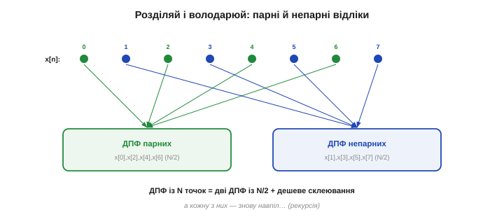
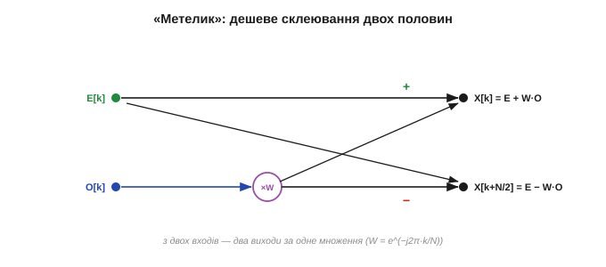
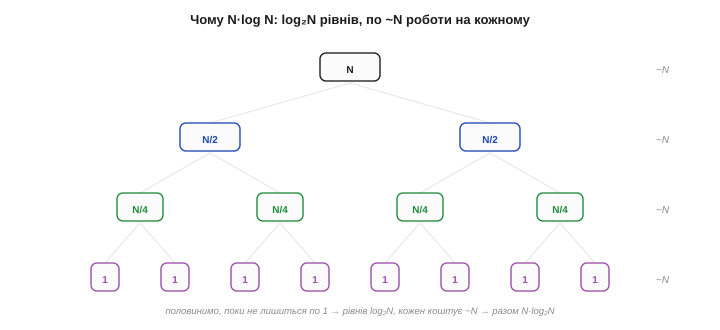
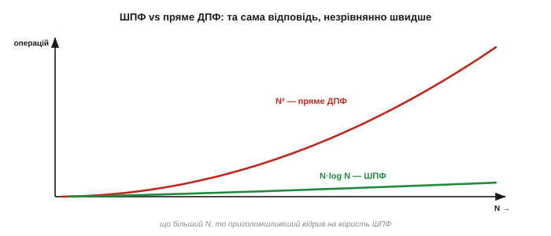
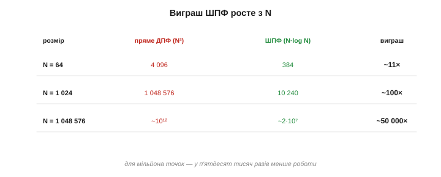
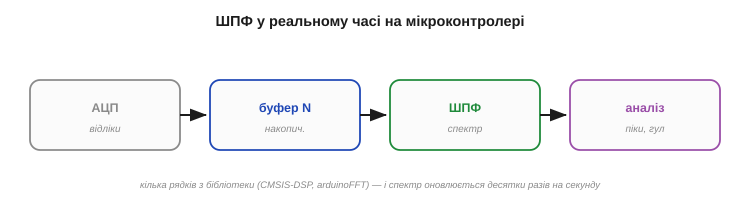

# Швидке перетворення Фур'є (ШПФ/FFT)

У звичайного [дискретного перетворення Фур'є](topic:com-signal/dft) є прикра вада: `N²` операцій роблять його майже непридатним — для тисячі відліків це мільйон множень на кожен спектр. І ось 1965 року з'являється алгоритм, що рахує **точно те саме** ДПФ, але в рази й рази швидше, перетворивши `N²` на скромне `N·log N`. Це **швидке перетворення Фур'є** (ШПФ, *Fast Fourier Transform, FFT*) — без перебільшення, один із найважливіших алгоритмів XX століття. Саме він робить **миттєвими** спектр у реальному часі, цифрове аудіо й відео, мобільний зв'язок, томографію. Розберімо, **як** він домагається такого прискорення — і чому це той самий результат, лише розумніше порахований.

Щоб оцінити вагу цього кроку: до ШПФ велике перетворення Фур'є рахували так довго, що часто його просто **не робили** — задача була теоретично зрозуміла, але практично неприступна. Після ШПФ вона стала миттєвою й буденною. Рідко буває, щоб один-єдиний алгоритм так розсунув межі можливого; тому варто розуміти не лише, що ШПФ швидке, а й **звідки** ця швидкість береться — бо та сама ідея «розділяй і володарюй» працює в безлічі інших задач.

### Та сама відповідь, менше роботи

Найперше, що треба засвоїти: **ШПФ не нове перетворення**. Воно дає **математично ті самі** числа `X[k]`, що й пряме [ДПФ](topic:com-signal/dft), — без жодного наближення (відрізнятися можуть хіба звичайні округлення дробових чисел). Різниця **лише** в кількості арифметики: пряме ДПФ рахує кожен бін «у лоб», наново перемножуючи й додаючи все, а ШПФ помічає, що в цих обчисленнях **сила-силенна повторень** — одні й ті самі добутки синусів рахуються знову і знову. Прибравши це марнотратство, воно дістає той самий відгук за частку зусиль. ШПФ — не магія й не апроксимація, а **ощадлива бухгалтерія**: та сама відповідь, але без переробляння однієї й тієї ж роботи.

Звідки ж беруться ті повторення? Кожен доданок ДПФ містить множник `cos`/`sin` кута `2π·k·n/N`. Але багато різних пар `(k, n)` дають **той самий** кут (бо кути «обертаються по колу» й повторюються), а отже — той самий синус і косинус. Пряме ДПФ слухняно перемелює кожну пару окремо, тисячократно рахуючи одне й те саме значення. ШПФ натомість упорядковує обчислення так, щоб кожен такий добуток порахувати **раз** і **перевикористати** скрізь, де він потрібен. Уся економія `N²→N·log N` — це, по суті, прибрана надмірність, а не якась нова математика.

Практичний наслідок цієї точності великий: ШПФ можна підставляти **скрізь**, де потрібне ДПФ, не задумуючись про похибку, — результат той самий до останнього біта (з точністю до звичайних округлень дробових чисел). Тому у світі ДПФ «у лоб» практично ніколи й не рахують: щойно треба спектр — беруть ШПФ. «Повільне» пряме ДПФ лишилося хіба в підручниках як **означення**, а вся реальна робота йде через швидкий алгоритм.

### Розділяй і володарюй: парні й непарні

Серце ідеї — **«розділяй і володарюй»** (*divide and conquer*). Ключове спостереження: ДПФ із `N` точок можна **розкласти на дві ДПФ удвічі меншого розміру**. Розділимо відліки на дві групи — з **парними** індексами (`x[0], x[2], x[4], …`) і з **непарними** (`x[1], x[3], x[5], …`), по `N/2` у кожній. Виявляється, повне ДПФ виражається через ДПФ цих двох половин плюс дешеве склеювання.


*Розділяй і володарюй. Відліки розбивають на парні (зелені) й непарні (сині) — по N/2 у кожній групі. Замість одного великого ДПФ рахують **два вдвічі менші** (від парних і від непарних) і дешево їх склеюють. А кожне з цих менших ДПФ розбивають знову навпіл — і так рекурсивно, аж до тривіального розміру 1.*

А далі — та сама хитрість **рекурсивно**: кожну половину знову ділимо навпіл, ті — ще навпіл, аж поки не лишаться шматочки розміру 1 (ДПФ одного числа — це саме це число). Велика задача розсипається на безліч крихітних, і саме на цьому розсипанні й заощаджується робота. Звідси, до речі, вимога, щоб `N` був **степенем двійки** — щоб ділення навпіл завжди було рівним до самого кінця.

Чому ж саме поділ на парні й непарні дає виграш? Бо порахувавши **раз** ДПФ половинок — `E[k]` і `O[k]`, — ми використовуємо їх **двічі**: і для виходу `X[k]`, і для `X[k+N/2]` (це й робить метелик нижче). Тобто половина спектра дістається майже задарма, «у комплекті» з другою. Саме це спільне використання проміжних результатів — а не якийсь хитрий трюк із синусами — і є справжнє джерело прискорення. Розділивши задачу навпіл, ми змусили кожен шматок роботи слугувати одразу **двом** відповідям.

Рекурсія десь же мусить спинитися — і спиняється на найдрібнішому: ДПФ **одного** числа є саме це число, рахувати нема чого. Тому, поділивши масив навпіл `log₂N` разів, ми доходимо до тривіальних одиничок, а тоді збираємо відповідь назад, рівень за рівнем, метеликами. На практиці бібліотеки навіть не рекурсують «углиб»: вони розгортають усе у `log₂N` послідовних проходів по масиву — так само швидко, але без накладних витрат на виклики функцій.

### Метелик: дешеве склеювання

Лишається зрозуміти, що це за «дешеве склеювання» двох половинок. Нехай `E[k]` — ДПФ парних відліків, `O[k]` — ДПФ непарних. Тоді повний спектр збирається так:

```
X[k]      = E[k] + W·O[k]
X[k+N/2]  = E[k] − W·O[k]        W = e^(−j2π·k/N)   — «поворотний» множник (twiddle)
```


*Базова операція ШПФ — «метелик». Бере одне значення з ДПФ парних (E[k]) і одне з непарних (O[k]), домножає друге на поворотний множник W — і за **одне** множення видає **два** виходи спектра: суму (X[k]) і різницю (X[k+N/2]). Перехрестя ліній і дало назву «метелик». Із таких метеликів складено все ШПФ.*

Ця крихітна операція й зветься **«метеликом»** (*butterfly*) — за схему з перехрестям ліній. Її краса в тому, що з пари входів вона дає **пару** виходів усього за **одне** множення (на `W`) і два додавання. Замість того щоб для кожного з `N` бінів перемелювати всі `N` доданків, ШПФ укладає все обчислення в мережу таких метеликів — і кожен добуток рахується **раз**, а не сотні разів. Уся економія — звідси.

Полічімо її просто. На кожному рівні ділення всі `N` значень укладаються в `N/2` метеликів — отже, лише `~N/2` множень на рівень. Рівнів `log₂N`, тож множень разом — близько `(N/2)·log₂N`, тобто порядку `N·log N`. Пряме ж ДПФ робить близько `N²` множень — по `N` на кожен із `N` бінів. Для `N = 1024` це різниця між кількома тисячами множень і цілим мільйоном: те саме ДПФ — у двісті разів менше арифметики, лише завдяки тому, що нічого не рахується двічі.

### Чому N·log N

Тепер порахуймо вартість і побачимо диво. Скільки **рівнів** ділення навпіл від `N` до 1? Рівно `log₂N` (для `N = 1024` це 10, для мільйона — близько 20). Логарифм тут — це просто «**скільки разів можна поділити навпіл**»: поділіть 1024 навпіл — 512, ще раз — 256, і так далі, рівно **десять** кроків до одиниці, бо 1024 = 2¹⁰. Ось чому `log₂N` — мала, повільна величина: навіть для мільйона точок це лише близько двадцяти. На **кожному** рівні всі `N` чисел проходять через метелики — це `~N` операцій. Перемножуємо:

```
рівнів ділення:      log₂N
роботи на рівень:    ~N  (усі N значень крізь метелики)
разом:               N · log₂N   ← замість N²
```


*Звідки береться N·log N. Задачу половинять, поки не лишаться шматочки розміру 1, — це log₂N рівнів углиб. На кожному рівні разом обробляють усі N значень (~N операцій). Помножте кількість рівнів на роботу рівня — і дістанете N·log₂N замість квадрата.*

Замість `N²` — `N·log₂N`. Різниця здається дрібною, поки `N` малий, та з ростом `N` вона стає **прірвою**: логарифм росте мляво, а квадрат — нещадно.


*Та сама відповідь — несумірно дешевше. Крива N² (червона) злітає круто вгору; N·log N (зелена) повзе майже вздовж осі. Що більший запис, то приголомшливіший відрив на користь ШПФ — від десятків разів до десятків тисяч.*

### Виграш, що змінив усе

Перекладемо це в конкретні числа — і стане ясно, чому ШПФ називають алгоритмом, що змінив світ.

**Приклад (у скільки разів швидше).** Виграш — це приблизно `N / log₂N`:

```
N            пряме ДПФ (N²)      ШПФ (N·log₂N)      виграш ≈ N/log₂N
64           4 096              384                ~11×
1 024        1 048 576          10 240             ~100×
1 048 576    ~10¹²              ~2·10⁷             ~50 000×
```


*Виграш росте з N. Для тисячі точок ШПФ уже у ~сто разів ощадливіше за пряме ДПФ, а для мільйона — у ~п'ятдесят тисяч разів. Те, що «в лоб» рахувалося б годинами, ШПФ робить за мілісекунди — звідси й уся цифрова обробка реального часу.*

Сто разів для тисячі точок, п'ятдесят тисяч — для мільйона. Те, що прямим ДПФ рахувалося б годину, ШПФ робить за частку секунди. Саме цей стрибок **відчинив двері** цілим галузям: спектр у реальному часі, цифровий зв'язок, стиснення звуку й зображень, медична візуалізація — усе це стало можливим, бо перетворення Фур'є з дорогої теоретичної процедури зробилося **дешевою буденною операцією**. Ідея Фур'є чекала на цей алгоритм півтора століття, щоб нарешті по-справжньому запрацювати.

Аби відчути масштаб у людських мірках: мільйон точок прямим ДПФ — це ~10¹² операцій, тобто на процесорі в мільярд дій за секунду близько **сімнадцяти хвилин**; те саме ШПФ — ~2·10⁷ операцій, тобто **дві соті секунди**. Звідси й перелік галузей, що буквально стоять на ШПФ: [Wi-Fi](topic:com-transport/wifi), 4G і 5G (їхній OFDM рахує ШПФ на кожен переданий символ), стиснення MP3 і [JPEG](topic:com-signal/jpeg-intra), МРТ, радари й сонари, музичні тюнери. Недарма ШПФ внесли до списку найвпливовіших алгоритмів XX століття — мало яка ідея так змінила інженерну практику.

Уявімо це наочно, ближче до нашого заліза. Гітарний тюнер чи монітор вібрації мусить оновлювати спектр разів тридцять на секунду. Прямим ДПФ на буфері в тисячу точок це ~30 мільйонів множень за секунду — для копійчаного МК непідйомно. Тим самим ШПФ — лише ~300 тисяч: дрібниця, що лишає процесору купу часу на решту справ. Ось чому **кожен** реальний спектральний прилад — від тюнера до промислового аналізатора — усередині рахує саме ШПФ, а не ДПФ; інакше він просто не встигав би за сигналом.

### Степінь двійки — і де воно живе

На практиці варто знати кілька речей. По-перше, класичне ШПФ (*radix-2*) хоче, щоб `N` був **степенем двійки** — 256, 512, 1024…; якщо відліків інша кількість, масив **доповнюють нулями** (*zero-padding*) до найближчого степеня. По-друге, **не пишіть ШПФ самі** — для нього є вилизані бібліотеки: на ПК це `numpy.fft` чи FFTW, на мікроконтролерах — **CMSIS-DSP** (для ARM Cortex-M), `arduinoFFT` та подібні, оптимізовані під залізо. До слова, вимога «степінь двійки» — обмеження саме класичного *radix-2*; розумніші бібліотеки вміють ШПФ і для інших розмірів (мішані основи, алгоритм Блюстайна), тож на практиці ви передаєте будь-яке `N`, а підбір методу лишаєте бібліотеці. Та звичка брати степінь двійки лишається доброю: на ньому ШПФ найшвидше й найпростіше. По-третє, ШПФ настільки дешеве, що навіть **скромний мікроконтролер** легко рахує спектр десятки разів на секунду — те, про що інженери 1960-х і мріяти не могли.

Ще дві приємні дрібниці пояснюють, чому ШПФ так любить дрібне залізо. По-перше, його можна рахувати **на місці** (*in-place*): результат перезаписує вхідний масив, тож пам'яті треба лише на `N` чисел — критично для мікроконтролера з кілобайтами RAM. По-друге, через хитрий порядок метеликів виходи спершу опиняються «переплутаними» (у так званому **бітреверсному** порядку), і бібліотека наприкінці просто переставляє їх назад. Для вас це непомітно — лишень корисно знати, що ШПФ ощадливе не тільки за часом, а й за пам'яттю. І ще: для звичайного **дійсного** сигналу половина виходів [дзеркальна](topic:com-signal/dft), тож осмислені лише перші `N/2+1` бінів — недарма бібліотеки мають окремий «дійсний» ШПФ, удвічі дешевший.


*Спектр у реальному часі. АЦП наповнює буфер на N відліків → ШПФ перетворює його на спектр → аналіз шукає піки, гул, вібрації. Кілька рядків коду з готової бібліотеки — і мікроконтролер «бачить» сигнал у частоті, оновлюючи картинку десятки разів на секунду.*

> 🔧 **Навіщо це.** Беріть `N` степенем двійки (256, 512, 1024) — так лягає класичне ШПФ, а як відліків інше число, доповніть нулями. І не винаходьте велосипед: на МК підключіть **CMSIS-DSP** чи `arduinoFFT`, а не пишіть перетворення вручну — бібліотечне і швидше, і без помилок. Ваша робота — підготувати масив і прочитати спектр, а не реалізовувати метеликів.

> 🔧 **Навіщо це.** Завдяки ШПФ повноцінний **аналізатор спектра** вміщається в копійчаний мікроконтролер. Типовий конвеєр: зібрати `N` відліків з АЦП у буфер → викликати ШПФ → у вихідному масиві знайти піки (їхні частоти — `k·fs/N`, як [у спектрі ДПФ](topic:com-signal/dft)). Так на ESP32 чи STM32 роблять і визначники нот, і виявлювачі вібрації, і прості голосові тригери — усе на тому самому виклику ШПФ.

> 🔧 **Навіщо це.** Пам'ятайте: ШПФ дає **той самий** спектр, що й ДПФ, — тож усі [правила ДПФ](topic:com-signal/dft) лишаються чинними. Найквіст `fs/2`, роздільність `Δf = fs/N`, [небезпека аліасингу](topic:com-signal/nyquist-aliasing) — нікуди не діваються; ШПФ лише рахує швидше, а не «краще». Зокрема, антиаліасинговий фільтр перед АЦП потрібен так само: швидкий алгоритм не виправить погано знятих даних.

Ось так одна алгоритмічна ідея перетворила красиву теорему Фур'є на робочий інструмент у кожній кишені. Що цікаво, придумали її не вперше 1965 року — слід цього алгоритму тягнеться аж до Ґаусса, ще до того, як Фур'є оприлюднив свою теорію. Ця заплутана історія втрат і перевідкриттів варта окремої розповіді.

> 📜 **Історія:** [ШПФ: Кулі, Тьюкі — і алгоритм, що мав ще Ґаусс](topic:com-signal/fft/hist-fft.md). Як цей алгоритм знаходили, губили й перевідкривали впродовж півтора століття — і до чого тут холодна війна та ядерні випробування.

Є тут і практична засторога, про яку легко забути за самим прискоренням. Говорячи про спектр, ми мовчки припускаємо, що міряємо сигнал «увесь», від краю до краю, — та насправді і ДПФ, і ШПФ бачать лише **скінченний шматок** запису, грубо обрізаний з обох кінців рамкою фіксованої довжини. І цей раптовий обрив не минає безслідно: він **розмазує** чисті піки в горбики й породжує примарні бічні частоти, яких у сигналі не було. Швидкість ми здобули, але точність спектра впирається тепер у цю скінченність вікна. Те, як цей [витік спектра](topic:com-signal/windowing-leakage) виникає й чим його приборкують спеціальні вікна, — окрема велика тема обчислень над сигналом.

---
