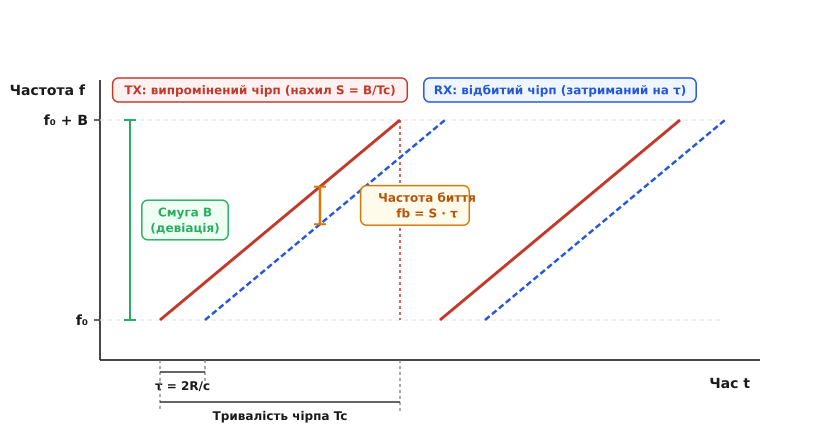
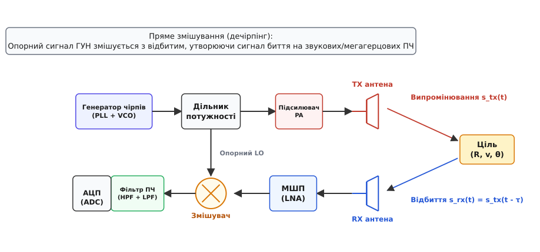
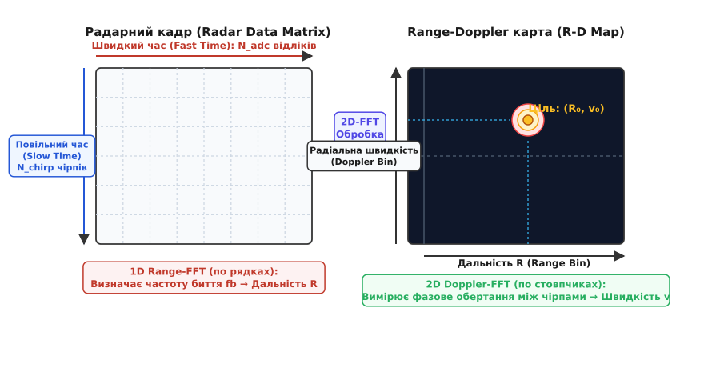
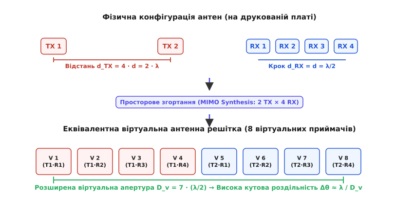

# FMCW-радар

<preknowlist>
- [Зсув фаз](topic:hw-components/phase-shift)
- [Ефект Доплера](topic:ph-waves/doppler-effect)
- [Змішувач частот](topic:hw-analog/mixer)
- [Швидке перетворення Фур'є](topic:com-signal/fft)
- [Антена](topic:com-medium/antenna)
</preknowlist>

Визначення дистанції до об'єкта класичним імпульсним радаром вимагає випромінювання надкороткого радіоімпульсу та точного відліку часу його повернення. Щоб досягти роздільної здатності за дальністю у 3.75 сантиметра, тривалість зондувального імпульсу не повинна перевищувати 250 пікосекунд (`τ = 2·ΔR / c`). Формування потужних субнаносекундних радіоімпульсів потребує пікових потужностей передавача в сотні ватів чи кіловати, а їх оцифрування на приймальному боці вимагає аналого-цифрових перетворювачів із частотою дискретизації понад 10–20 гігагерців. З іншого боку, звичайний немодульований радар неперервного випромінювання (CW-радар) випромінює постійну синусоїду міліватного рівня, що дозволяє виміряти швидкість за доплерівським зсувом, але в принципі унеможливлює вимірювання дальності через відсутність будь-якої часової мітки на сигналі.

Радар неперервного випромінювання з частотною модуляцією (Frequency Modulated Continuous Wave, FMCW) долає цей тупик, поєднуючи міліватну неперервну потужність випромінювання із сантиметровою роздільною здатністю. Замість короткого сплеску енергії передавач випромінює періодичний радіочастотний сигнал, частота якого безперервно й лінійно змінюється в часі — так званий чірп (LFM chirp). Затримка поширення відбитої хвилі перетворюється гомодинним змішувачем приймача безпосередньо у низькочастотний сигнал биття звукового чи мегагерцового діапазону. Це дозволяє здійснювати повне цифрове оброблення радарного кадру, вимірюючи дальність, радіальну швидкість і кутові координати цілі за допомогою стандартних АЦП із частотою дискретизації всього в одиниці мегагерців.

---

### Формування сигналу: лінійно-частотна модуляція (LFM)

Базовим елементом зондувального сигналу FMCW-радара є чірп (Chirp) — електромагнітне коливання, частота якого лінійно зростає від початкового значення `f₀` до кінцевого `f₀ + B` протягом інтервалу часу `T_c` (тривалість чірпа).


*Частотно-часова діаграма лінійно-частотної модуляції: затримка відбитого чірпа τ породжує постійну частоту биття f_b на виході змішувача.*

Основними параметрами чірпа є:
* **Несуча початкова частота `f₀`:** визначає робочий радіочастотний діапазон і довжину хвилі `λ = c / f₀`. В сучасних системах найчастіше використовують діапазони 24.0–24.25 ГГц (промисловий ISM-діапазон, `λ ≈ 12.5` мм) та 76–81 ГГц (міліметровий автомобільний діапазон mmWave, `λ ≈ 3.9` мм).
* **Смуга модуляції (девіація) `B`:** ширина частотного діапазону, що перекривається за один чірп (наприклад, 250 МГц у діапазоні 24 ГГц або 1–4 ГГц у діапазоні 77 ГГц).
* **Тривалість чірпа `T_c`:** час розгортки частоти, який зазвичай становить від 10 до 100 мікросекунд.
* **Швидкість зміни частоти (крутизна нахилу) `S`:** визначається як відношення смуги до тривалості:

```
S = B / T_c
```

Для чірпа зі смугою `B = 4` ГГц і тривалістю `T_c = 40` мкс крутизна нахилу становить `S = 10¹⁴` Гц/с (або 100 МГц за одну мікросекунду).

Миттєва частота випроміненого сигналу `f_tx(t)` на інтервалі `t ∈ [0, T_c]` описується лінійним рівнянням `f_tx(t) = f₀ + S·t`. Повна фаза сигналу передавача є інтегралом від миттєвої кутової швидкості:

```
φ_tx(t) = 2·π · ∫ (f₀ + S·u) du = 2·π · (f₀·t + 0.5·S·t²) + φ₀
```

У мікрохвильових радіочастотних монолітних інтегральних схемах (MMIC на основі технологій SiGe BiCMOS або RF-CMOS) генерація високолінійного нахилу здійснюється за допомогою генератора, керованого напругою (VCO), охопленого кільцем цифрового дробового фазового автопідстроювання частоти (Fractional-N PLL) із прямим цифровим накопичувачем фази.

---

### Топологія трансивера та процес дечірпінгу

Приймання сигналу в FMCW-радарах базується на прямому гомодинному перетворенні частоти вниз — так званому дечірпінгу (De-chirping).


*Архітектура прямого перетворення: опорний сигнал ГУН змішується з відбитим сигналом, формуючи низькочастотний сигнал биття в тракті ПЧ.*

Тракт передавача (TX) містить синтезатор частоти, дільник потужності та підсилювач потужності (Power Amplifier, PA), що живить передавальну антену. Частина генерованого сигналу відгалужується і подається безпосередньо на вхід гетеродина (LO) приймального змішувача.

Відбитий від цілі сигнал надходить на приймальну антену (RX) із запізненням на час подвійного пробігу дистанції `τ = 2·R / c`. Після підсилення у малошумному підсилювачі (Low Noise Amplifier, LNA) сигнал надходить на радіочастотний вхід квадратурного I/Q-змішувача:

```
s_rx(t) = A_rx · cos(φ_tx(t - τ))
```

Змішувач перемножує поточний випромінюваний чірп `s_lo(t) = s_tx(t)` із затриманим відбитим чірпом `s_rx(t)`. Згідно з тригонометричними тотожностями, добуток двох косинусів розпадається на сумарну та різницеву частотні складові. Сумарна високочастотна складова (`≈ 2·f₀ ≈ 154` ГГц) повністю блокується вихідними ємностями та аналоговим фільтром низьких частот. На виході змішувача залишається виключно низькочастотний сигнал різницевої фази, що називається **сигналом биття (Beat Signal)** або сигналом проміжної частоти (Intermediate Frequency, IF).

Аналітичне виведення повної різниці фаз сигналу биття, представлене в [математичному виведенні](topic:com-signal/fmcw-radar/math-beat-frequency.md), показує, що фаза сигналу биття описується виразом:

```
φ_b(t) = φ_tx(t) - φ_tx(t - τ) = 2·π · (S·τ·t + f₀·τ - 0.5·S·τ²)
```

Похідна від повної фази за часом дає постійну частоту биття `f_b`:

```
f_b = (1 / (2·π)) · (dφ_b / dt) = S · τ = (B / T_c) · (2·R / c)
```

Завдяки прямій пропорційності між затримкою `τ` та частотою `f_b`, просторова відстань до цілі однозначно транслюється у спектральну частоту аналогового сигналу на виході змішувача.

Тракт проміжної частоти містить фільтр високих частот (HPF) для компенсації радіолокаційного загасання. Оскільки потужність відбитого сигналу падає обернено пропорційно четвертому степеню відстані (`P_rx ∝ 1/R⁴`), а частота биття пропорційна відстані (`f_b ∝ R`), фільтр із крутизною підйому АЧХ +12...+20 дБ/декаду вирівнює рівні сигналів від близьких і далеких цілей, запобігаючи перевантаженню аналого-цифрового перетворювача (ADC).

---

### Квадратурне перетворення та розрізнення знака швидкості

Застосування виключно одного дійсного змішувача створює серйозну фізичну проблему: косинусоїдальний сигнал на проміжній частоті не несе інформації про знак частоти. Дійсний сигнал биття `cos(2·π·f_b·t)` має симетричний двосторонній спектр Фур'є, де додатні та від'ємні частоти нерозрізнені. Це унеможливлює визначення того, наближається ціль до радара чи віддаляється від нього.

Крім того, при накладанні шумів дзеркальний канал (Image Frequency) додає додаткові 3 дБ шуму до корисного сигналу, знижуючи граничну чутливість приймача.

Для усунення цієї невизначеності приймальний тракт будують за квадратурною I/Q-схемою. Опорний сигнал від ГУН ділиться на дві гілки: одна подається на синфазний змішувач (In-phase, I) безпосередньо, а друга проходить через фазообертач на 90° (`π/2` радіан) перед подачею на квадратурний змішувач (Quadrature, Q):

```
s_I(t) = A_b · cos(2·π·f_b·t + φ₀)
s_Q(t) = A_b · sin(2·π·f_b·t + φ₀)
```

Об'єднання двох каналів в один комплексний аналітичний сигнал `s_complex(t) = s_I(t) + j · s_Q(t) = A_b · exp(j · (2·π·f_b·t + φ₀))` створює односторонній спектр. Це дозволяє однозначно розрізняти наближення (`f_d > 0`, фазовий вектор обертається проти годинникової стрілки) від віддалення (`f_d < 0`, фазовий вектор обертається за годинниковою стрілкою).

#### Амплітудно-фазовий дисбаланс I/Q-каналів (I/Q Mismatch)
У реальних інтегральних схемах ідеального зсуву на 90° та однакового підсилення досягти неможливо через технологічний розкид параметрів транзисторів і паразитні ємності на кристалі. Якщо амплітудний дисбаланс становить `ε` (наприклад, підсилення каналу Q відрізняється на 0.5 дБ), а фазова похибка становить `Δθ` (наприклад, зсув 88° замість 90°), у комплексному спектрі виникає дзеркальний хибний пік (Image Ghost Target) на протилежній частоті `-f_b`.

Рівень придушення дзеркального каналу (Image Rejection Ratio, IRR) обчислюється як:

```
IRR ≈ 10 · log10(((1 + ε)² - 2·(1 + ε)·cos(Δθ) + 1) / ((1 + ε)² + 2·(1 + ε)·cos(Δθ) + 1))
```

При фазовій похибці всього в 2° та амплітудному перекосі 0.5 дБ дзеркальний пік пригнічується лише на -28 дБ. Якщо поруч із радаром рухається вантажівка з потужним відбиттям, її дзеркальний фантом на симетричній швидкості перевищить поріг виявлення і буде хибно зафіксований як зустрічний автомобіль. Для усунення цього ефекту в цифровому сигнальному процесорі застосовують алгоритм сліпої ортогоналізації Грама-Шмідта (GSOP) або калібрування за тестовим тоном перед кожним робочим циклом.


---

### Визначення дальності та роздільна здатність

Знаючи виміряну частоту сигналу биття `f_b`, дистанція до об'єкта обчислюється з базового рівняння FMCW:

```
R = (c · f_b · T_c) / (2 · B)
```

#### Роздільна здатність за дальністю (Range Resolution)
Роздільна здатність `ΔR` — це мінімальна відстань між двома цілями, розташованими на одному кутовому напрямку, за якої радар розрізняє їх як два окремі піки у спектрі, а не зливає в один спільний об'єкт.

Дві цілі на відстанях `R₁` та `R₂ = R₁ + ΔR` створюють у сигналі биття частоти `f_b1` та `f_b2`. Різниця частот становить `Δf_b = (2·B·ΔR) / (c·T_c)`.

За спектральним критерієм Релея, дві гармоніки можна розділити перетворенням Фур'є на інтервалі спостереження тривалістю `T_c`, якщо різниця їхніх частот не менша за зворотну тривалість вибірки:

```
Δf_b ≥ 1 / T_c
```

Підставивши вираз для різниці частот биття:

```
(2 · B · ΔR) / (c · T_c) ≥ 1 / T_c
⇒ ΔR = c / (2 · B)
```

Фундаментальний висновок: **роздільна здатність за дальністю залежить виключно від ширини смуги частотної модуляції `B`** і не залежить ні від тривалості чірпа, ні від несучої частоти.

* Для радара діапазону 24 ГГц із дозволеною смугою ISM `B = 250` МГц:
```
ΔR = (3 · 10⁸) / (2 · 250 · 10⁶) = 0.60 м = 60 см
```
* Для автомобільного радара діапазону 77–81 ГГц зі смугою `B = 4` ГГц:
```
ΔR = (3 · 10⁸) / (2 · 4 · 10⁹) = 0.0375 м = 3.75 см
```

Широка смуга в 4 ГГц забезпечує 16-кратне покращення деталізації простору, що дозволяє розрізняти бампер автомобіля від пішохода, що рухається поруч.

#### Максимальна однозначна дальність (Maximum Range)
Максимальна дальність виявлення `R_max` визначається найвищою частотою биття `f_b_max`, яку здатні пропустити аналоговий смуговий фільтр і оцифрувати АЦП із частотою дискретизації `f_s`. За теоремою Найквіста-Котельникова для комплексного I/Q оцифрування `f_b_max ≤ f_s`:

```
R_max = (c · T_c · f_s) / (2 · B)
```

Для чірпа з `B = 1` ГГц, `T_c = 50` мкс та АЦП із частотою дискретизації `f_s = 10` МГц максимальна вимірювана дальність становить:

```
R_max = (3 · 10⁸ · 50 · 10⁻⁶ · 10 · 10⁶) / (2 · 10⁹) = 75 м
```

---

### Визначення швидкості через міжчірповий доплерівський зсув фази

Якщо радіолокаційна ціль рухається з радіальною швидкістю `v`, відбитий сигнал зазнає подвійного фізичного впливу:

1. **Внутрішньочірповий доплерівський зсув частоти:** частота биття зміщується на величину `f_d = 2·v / λ`. Для типових автомобільних швидкостей (30 м/с або 108 км/год) та частоти 77 ГГц зсув становить `f_d ≈ 15.4` кГц. Оскільки роздільна здатність за частотою за час одного короткого чірпа (`T_c = 40` мкс) становить `1/T_c = 25` кГц, цей частотний зсув становить лише частку спектрального біна і не дозволяє надійно виміряти швидкість за один чірп.
2. **Міжчірповий фазовий набіг (Slow-Time Phase Shift):** хоча частотний зсув малопомітний, фаза коливання надзвичайно чутлива до найменших субміліметрових переміщень.

Початкова фаза сигналу биття на початку чірпа дорівнює:

```
φ₀_beat = 4·π · R₀ / λ
```

Для пачки з `N_chirp` чірпів, випромінених із періодом повторення `T_r` (де `T_r ≥ T_c`), положення рухомої цілі на `m`-му чірпі (`m = 0, 1, ..., N_chirp - 1`) змінюється на величину `ΔR = v · m · T_r`. Відповідно, початкова фаза сигналу биття для `m`-го чірпа набуває лінійного фазового набігу:

```
φ_m = (4·π · R₀ / λ) + (4·π · v · T_r / λ) · m
```

Різниця фаз між двома послідовними чірпами:

```
Δφ = φ_(m+1) - φ_m = (4·π · v · T_r) / λ
```

Для довжини хвилі `λ = 3.9` мм (77 ГГц) і переміщення всього на 1 міліметр фаза сигналу биття повертається на 184.6°.

Знаючи виміряну швидкість зміни фази між чірпами, радіальна швидкість знаходиться як:

```
v = (λ · Δφ) / (4·π · T_r)
```

#### Межа однозначності та роздільність за швидкістю
Дискретне перетворення Фур'є по послідовності чірпів може однозначно відновити фазовий зсув без циклічного переповнення лише за умови `|Δφ| < π`. Звідси випливає максимальна однозначна швидкість:

```
v_max = λ / (4 · T_r)
```

Для `λ = 3.9` мм і `T_r = 50` мкс максимальна вимірювана швидкість без неоднозначності становить `v_max = 19.5` м/с (70.2 км/год).

Роздільна здатність за радіальною швидкістю визначається загальним часом спостереження радарного кадру `T_frame = N_chirp · T_r`:

```
Δv = λ / (2 · T_frame) = λ / (2 · N_chirp · T_r)
```

Для кадру з `N_chirp = 128` чірпів і періодом `T_r = 50` мкс (`T_frame = 6.4` мс) роздільна здатність становить:

```
Δv = (3.9 · 10⁻³) / (2 · 6.4 · 10⁻³) = 0.305 м/с ≈ 1.1 км/год
```

---

### Двовимірне перетворення Фур'є (2D-FFT) та Range-Doppler обробка

Для одночасного та незалежного вимірювання дальності й швидкості багатьох цілей у кадрі цифровий сигнальний процесор (DSP) формує двовимірну матрицю відліків і виконує двовимірне швидке перетворення Фур'є (2D-FFT).


*Формування Range-Doppler карти: перше перетворення Range-FFT по рядках виділяє дальність, друге Doppler-FFT по стовпчиках — радіальну швидкість.*

Матриця кадру містить `N_chirp` рядків і `N_samples` стовпчиків:
1. **Перше перетворення — 1D Range-FFT (по рядках):**
   Кожен окремий рядок (відліки швидкого часу всередині одного чірпа) множиться на вагове вікно (Ганнінга або Блекмана) для пригнічення бічних пелюсток і перетворюється за допомогою БПФ. Результатом є матриця профілів дальності. У кожному рядку з'являються спектральні піки на частотах биття, відповідних відстаням до цілей.
2. **Друге перетворення — 2D Doppler-FFT (по стовпчиках):**
   Для кожного фіксованого стовпчика дальності (Range Bin) вибираються значення фази у всіх `N_chirp` чірпах вздовж повільного часу. До кожного стовпчика застосовується друге БПФ. Оскільки фазовий кут від чірпа до чірпа обертається з постійною частотою, пропорційною радіальній швидкості цілі, друге перетворення фокусує енергію цілі у вузький пік у площині «дальність — радіальна швидкість».
3. **Формування Range-Doppler карти (R-D Map):**
   Комплексні значення матриці перетворюються на амплітудну потужність `P(r, d) = I² + Q²`. Стаціонарні об'єкти (дорожнє покриття, знаки, стіни) групуються в нульовому доплерівському біні (`v = 0`), а рухомі об'єкти чітко сепаруються за їхніми радіальними швидкостями.

Детальна програмна реалізація алгоритму 2D-FFT та адаптивного детектора порогування представлена в [алгоритмічному проекті](topic:proj-range-doppler.md).

#### Адаптивне виявлення цілей (2D CA-CFAR)
Для автоматичного виділення піків цілей на фоні теплових шумів та інтерференційних відбиттів використовують алгоритм адаптивного порогу з постійною ймовірністю хибних тривог (Cell-Averaging Constant False Alarm Rate, CA-CFAR).

Двовимірна ковзна маска обходить кожну комірку карти (Cell Under Test, CUT). Навколо CUT виділяється захисна зона (Guard Cells) для виключення енергії самої цілі, а навколо неї — навчальна зона (Training Cells), по якій розраховується локальний середній рівень завад `P_noise`. Поріг виявлення встановлюється як `Threshold = α · P_noise`. Комірка вважається ціллю лише тоді, коли її потужність перевищує поріг і водночас є строгим локальним максимумом.

---

### Кутова пеленгація та концепція MIMO-радара

Для побудови тривимірної хмари точок радар повинен вимірювати не лише дальність і швидкість, але й просторові кути: азимут `θ` (у горизонтальній площині) та елевацію `φ` (у вертикальній площині).

#### Фазова інтерферометрія (Angle of Arrival, AoA)
Розглянемо дві приймальні антени RX1 та RX2, розташовані на відстані `d` одна від одної. Електромагнітна хвиля, що падає під кутом `θ` відносно нормалі, проходить до другої антени додатковий шлях `Δl = d · sin(θ)`.

Ця геометрична різниця ходу призводить до просторового зсуву фази між прийнятими сигналами:

```
Δφ_spatial = (2·π / λ) · d · sin(θ)
```

Кут приходу хвилі обчислюється через арксинус фазової різниці:

```
θ = arcsin((λ · Δφ_spatial) / (2·π · d))
```

Щоб уникнути просторової неоднозначності (просторового аліасингу у секторі кутів `[-90°, +90°]`), фазовий зсув не повинен перевищувати `π`, що накладає фундаментальну умову на геометрію антен:

```
d ≤ λ / 2
```

Для лінійної решітки з `N_rx` приймачів кут знаходиться за допомогою третього перетворення Фур'є (Angle-FFT / 3D-FFT), виконаного по відліках просторового масиву антен для кожної точки `(r, d)`, знайденої на Range-Doppler карті.

Кутова роздільна здатність лінійної решітки з апертурою `D = N_rx · d` обернено пропорційна її розміру:

```
Δθ ≈ λ / (D · cos(θ)) = λ / (N_rx · d · cos(θ)) рад
```

Щоб отримати високу роздільність у 1.5° на частоті 77 ГГц (`λ = 3.9` мм), фізична апертура решітки повинна містити понад 70–80 приймальних антен. Розміщення такої кількості незалежних приймальних каналів на одному напівпровідниковому кристалі є надзвичайно дорогим через обмеження площі кремнію та тепловиділення.

#### Віртуальна антенна решітка у MIMO FMCW радарах
Для подолання фізичних обмежень сучасні радарні системи використовують технологію MIMO (Multiple-Input Multiple-Output).


*Синтез віртуальної апертури: просторове згортання 2 передавальних та 4 приймальних антен утворює еквівалентну решітку з 8 віртуальних елементів.*

Принцип віртуальної решітки полягає у просторовій згортці координат передавальних (TX) та приймальних (RX) антен. Якщо радар має `N_tx` передавачів і `N_rx` приймачів, синтезована віртуальна решітка містить:

```
N_virtual = N_tx · N_rx
```

Як показано на схемі, 2 передавальні антени, рознесені на відстань `d_tx = 4·d = 2·λ`, у поєднанні з 4 приймальними антенами з кроком `d_rx = d = λ/2`, синтезують суцільну 8-елементну еквівалентну фазовану решітку з апертурою `D_v = 7 · (λ/2)`. Каскадування чотирьох таких чіпів у 4D-радарах формує віртуальну апертуру з сотнями елементів (наприклад, 12 TX × 16 RX = 192 віртуальні канали), забезпечуючи кутову роздільність рівня оптичних систем (менше ніж 1° за азимутом і елевацією).

#### Методи мультиплексування передавачів у MIMO
Для розділення сигналів від різних передавальних антен на приймальному боці використовують три основні методи:

1. **TDM-MIMO (Time-Division Multiplexing):** Передавачі випромінюють чірпи по черзі (TX1 → TX2 → TX1 → TX2). Метод простий у реалізації, але рух цілі під час перемикання антен вносить паразитний доплерівський фазовий набіг, який компенсують цифровим алгоритмом відновлення фази.
2. **BPM-MIMO (Binary Phase Modulation):** Усі передавачі випромінюють чірпи одночасно, але з чергуванням фаз `0°` та `180°` за кодом Адамара-Уолша. Це збільшує сумарну випромінювану потужність і покращує співвідношення сигнал/шум (SNR) на `10·log10(N_tx)` дБ.
3. **DDMA (Doppler Division Multiple Access):** Кожен передавач додає штучний невеликий фазовий зсув від чірпа до чірпа, що штучно розносить їхні спектральні відгуки в різні зони доплерівського простору на Range-Doppler карті.

---

### Енергетика, фазовий шум та радіозавади

#### Радіолокаційне рівняння для FMCW-радара
Потужність сигналу на вході приймача описується класичним рівнянням радіолокації з урахуванням когерентного накопичення енергії за час усього кадру:

```
P_rx = (P_tx · G_tx · G_rx · λ² · σ) / ((4·π)³ · R⁴)
```

де `P_tx` — потужність передавача (типово 10–50 мВт / +10...+17 дБм), `G_tx, G_rx` — коефіцієнти підсилення антен (12–18 дБі), `σ` — ефективна площа розсіювання цілі (ЕПР / RCS, від 0.5 м² для пішохода до 10–100 м² для легкового автомобіля чи вантажівки).

Завдяки двовимірному перетворенню Фур'є енергія сигналу когерентно інтегрується по всій вибірці з `N_samples · N_chirp` відліків, що дає виграш когерентного накопичення (Processing Gain):

```
G_proc = 10 · log10(N_samples · N_chirp)
```

Для матриці `1024 × 128` коефіцієнт підсилення становить `10 · log10(131072) ≈ +51.2` дБ. Саме цей математичний виграш дозволяє радару міліватного випромінювання надійно детектувати автомобілі на відстанях понад 200–250 метрів.

---

### Мікрохвильова схемотехніка MMIC та матеріали плат

Реалізація радіотракту на частотах 77–81 ГГц висуває граничні вимоги до технології напівпровідникових приладів та друкованих плат:

#### Напівпровідникові технології: SiGe BiCMOS проти RF-CMOS
* **SiGe BiCMOS (кремній-германієві гетеробіполярні транзистори):** Традиційна технологія для перших поколінь автомобільних радарів. Завдяки високій граничній частоті підсилення за струмом `f_T > 300` ГГц і максимальній частоті генерації `f_max > 400` ГГц, SiGe забезпечує високу вихідну потужність передавача (+15...+17 дБм) та низький коефіцієнт шуму LNA (10–12 дБ). Проте висока вартість кремнію та неможливість інтеграції складних цифрових ядер DSP на тому самому кристалі вимагала розділення системи на два чіпи: аналоговий RF-трансивер та окремий мікроконтролер.
* **Глибокий субмікронний RF-CMOS (45 нм / 28 нм / 16 нм FinFET):** Сучасний стандарт однокристальних систем (Radar-on-Chip). Дозволяє на єдиному кристалі площею 50–70 мм² об'єднати 3–4 передавальні канали, 4 приймальні канали, синтезатор ГУН/PLL, 12-розрядні АЦП, апаратні прискорювачі БПФ (HWA) та двоядерний процесор ARM Cortex-R5F. Це знизило енергоспоживання модуля до 1.5–2.5 Вт і зменшило його вартість у рази.

#### Конструкція антен та матеріали підкладок
На довжині хвилі `λ = 3.9` мм стандартні склотекстоліти типу FR-4 є повністю непридатними через колосальні діелектричні втрати (`tan δ > 0.02` на 77 ГГц, що призводить до загасання понад 3–5 дБ на сантиметр мікросмужкової лінії).

Для виготовлення високочастотних шарів плати використовують спеціалізовані радіочастотні ламінати:
* **Керамонаповнений PTFE (Rogers RO3003):** діелектрична проникність `ε_r = 3.00 ± 0.04`, тангенс кута втрат `tan δ = 0.0010` на 77 ГГц. Забезпечує стабільність хвильового опору ліній живлення та високий ККД мікросмужкових патч-антен (понад 70–80%).
* **Низьковтратні термореактивні матеріали (Panasonic Megtron 6/7, Isola I-Tera MT40):** дозволяють створювати гібридні багатошарові плати, де верхній шар є високочастотним ламінатом для антен і радіотракту, а нижні 4–6 шарів — звичайним недорогим FR-4 для цифрових інтерфейсів (CAN-FD, Ethernet) і кіл живлення.

#### Antenna-on-Package (AoP)
Для компактних застосувань (виявлення перешкод дронами, моніторинг сліпих зон мотоциклів, жестове керування) антени витравлюють безпосередньо на корпусі мікросхеми за технологією eWLB (embedded Wafer Level Ball Grid Array). Це повністю усуває необхідність у дорогих багатошарових радіочастотних платах: сенсор монтується на звичайну плату як стандартна мікросхема BGA.

---

### Динаміка синтезу чірпів: фазове автопідстроювання та нелінійність

Якість роботи FMCW-радара безпосередньо лімітується спектральною чистотою та лінійністю перестроювання частоти ГУН.

#### Контур фазового автопідстроювання (PLL)
У схемі Fractional-N PLL вихідна частота ГУН ділиться дільником із дробовим змінним коефіцієнтом ділення `N(t) = N_int + k(t)/M`, керованим сигма-дельта модулятором (SDM). Керівний код змінюється з тактовою частотою опорного кварцового генератора (40 або 50 МГц), змушуючи синтезатор перестроювати частоту з кроком у кілька кілогерців.

Ширина смуги петльового фільтра ФАПЧ `f_loop` (Loop Bandwidth) обирається як компроміс між двома протилежними вимогами:
1. **Швидкість встановлення (Settling Time):** Широка смуга петлі (1–3 МГц) необхідна для швидкого повернення частоти у вихідну точку між чірпами (`T_reset` менше 5–10 мкс) та збереження форми нахилу без динамічного відставання.
2. **Фільтрація шуму дробового дільника (Spur Suppression):** Занадто широка смуга пропускає шуми квантування сигма-дельта модулятора, що призводить до появи паразитних спектральних ліній (Fractional Spurs) у сигналі биття.

#### Фазовий шум та ефект кореляції дальності (Range Correlation Effect)
У гомодинному приймачі той самий генератор частоти одночасно живить передавач і виконує роль гетеродина для змішувача. Фазовий шум генератора на коротких затримках поширення є майже ідентичним в обох плечах. При відніманні фаз у змішувачі низькочастотний фазовий шум взаємно компенсується, що істотно знижує вимоги до фазового шуму інтегрального ГУН на кристалі для виявлення цілей на малих дистанціях.

#### Проблема взаємних завад (Mutual Interference)
З масовим впровадженням радарів в автомобільних системах допомоги водієві (ADAS) виникає явище взаємного опромінення радарів зустрічних і попутних машин. Коли чужий чірп перетинає за частотою чірп власного приймача, на виході змішувача утворюється короткочасний сплеск великої амплітуди (glitch).

У спектральній області цей імпульсний сплеск призводить до різкого підйому шумової полиці на 20–30 дБ по всій Range-Doppler карті, засліплюючи радар. Сучасні DSP-процесори виявляють такі сплески у часовому сигналі за допомогою вейвлет-аналізу або порогування амплітуди, вирізають уражені відліки (Blanking) і відновлюють пропущені дані авторегресійною екстраполяцією до початку обчислення 2D-FFT.

---

### Порівняння радарних частотних діапазонів

Вибір робочого діапазону FMCW-радара диктується нормативними регуляціями (ITU, FCC, ETSI) та фізикою поширення хвиль у земній атмосфері:

* **24 ГГц (ISM: 24.0–24.25 ГГц):** Вузька дозволена смуга 250 МГц обмежує роздільність за відстанню до 60 см. Довжина хвилі `λ = 12.5` мм вимагає габаритних антен (розмір решітки 8–10 см). Використовується в простих датчиках відкриття дверей, промислових рівнемірах рідин у резервуарах та системах моніторингу сліпих зон автомобілів ранніх поколінь.
* **60 ГГц (V-діапазон: 57–64 ГГц):** Діапазон має унікальну фізичну рису — пік резонансного поглинання радіохвиль молекулами кисню `O₂` (загасання до 15 дБ/км). Через це сигнал швидко згасає у просторі, що унеможливлює роботу на великих дистанціях, проте усуває взаємні перешкоди між сусідніми пристроями. Смуга до 4–7 ГГц забезпечує субсантиметрову роздільність (до 2.1 см). Ідеальний для застосування всередині салону автомобіля (In-Cabin Monitoring: виявлення залишеної дитини на задньому сидінні за мікрорухами грудної клітки при диханні, моніторинг серцевого ритму водія, безконтактне розпізнавання жестів).
* **76–81 ГГц (W-діапазон / mmWave Automotive):** Глобальний стандарт для автомобільних сенсорів автономного водіння. Діапазон 76–77 ГГц виділено для далекобійних радарів (Long-Range Radar), а 77–81 ГГц (смуга 4 ГГц) — для високоточних радарів ближньої та середньої дії (Corner / Imaging Radar). Низьке атмосферне загасання у вікні прозорості (менше 0.5 дБ/км) у поєднанні з високою проникністю крізь дощ, туман, сніг та пил забезпечує всепогодну дальність до 250–300 метрів.
* **140 ГГц / 300 ГГц (Субтерагерцовий діапазон Sub-THz):** Експериментальний напрямок для робототехніки нового покоління. Смуга модуляції понад 10–20 ГГц забезпечує міліметрову роздільність за дальністю (`ΔR < 1` см), що дозволяє будувати 4D-радари з щільністю хмари точок, порівнянною з лазерними лідарами (LiDAR), але зі збереженням стійкості до задимлення та оптичних завад.

---

### Конфігурації радарних сенсорів в автономному транспорті

Сучасний безпілотний або асистований автомобіль (ADAS рівня L2+/L3/L4) оснащується комплексом взаємодоповнюючих FMCW-радарів різної архітектури:

1. **Фронтальний далекобійний радар (Front Long-Range Radar, LRR):**
   * *Призначення:* Адаптивний круїз-контроль (ACC) на швидкостях до 200 км/год, автоматичне екстрене гальмування (AEB).
   * *Параметри:* Дальність до 250–300 м, вузьке поле зору (Field of View, FoV: `±10°`), висока роздільність за швидкістю (`Δv < 0.2` м/с).
   * *Конфігурація антен:* Вузькоспрямована решітка з високим коефіцієнтом підсилення (+18...+20 дБі), смуга модуляції `B = 500` МГц...1 ГГц (`ΔR = 15–30` см).
2. **Кутові радари ближньої та середньої дії (Corner Short/Medium Range Radar, SRR/MRR):**
   * *Призначення:* Моніторинг сліпих зон (BSD), асистент зміни смуги (LCA), попередження про поперечний трафік спереду та ззаду (FCTA/RCTA), автоматичне паркування.
   * *Параметри:* Дальність 50–100 м, надшироке поле зору (`FoV: ±60°...±75°`), кутова роздільність за азимутом і елевацією.
   * *Конфігурація антен:* MIMO-решітка з широкою діаграмою спрямованості поодиноких елементів, смуга `B = 2–4` ГГц (`ΔR = 3.75–7.5` см).
3. **4D візуалізуючий радар (4D Imaging Radar):**
   * *Призначення:* Побудова щільної хмари точок із високою роздільністю у чотирьох вимірах: Дальність, Радіальна швидкість, Азимут, Елевація.
   * *Апаратна структура:* Каскадування 4 монолітних MMIC чіпів (12 TX × 16 RX = 192 віртуальні канали) або спеціалізовані процесори з 48–64 апаратними каналами на єдиному кристалі. Здатний надійно розрізняти висоту перешкоди над дорогою (відрізняти міст або дорожній знак над трасою від нерухомого автомобіля на смузі руху), що вирішує головну критичну проблему помилкових гальмувань традиційних автомобільних радарів.

