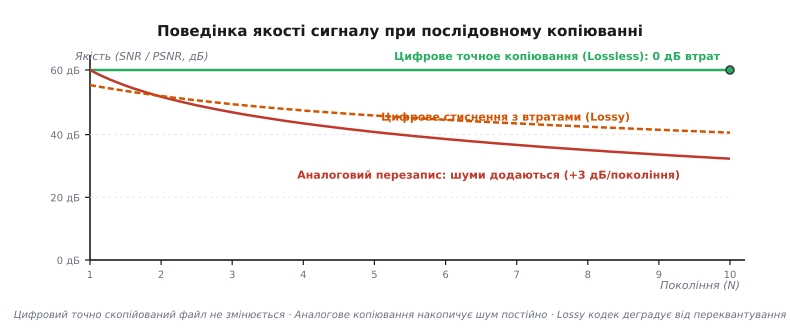
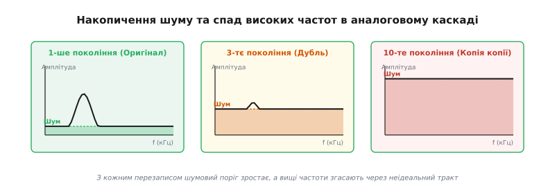
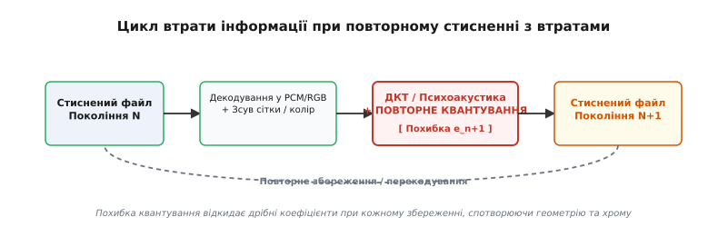
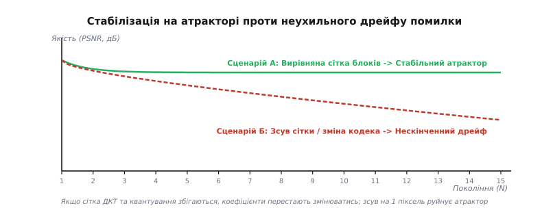

# Втрата поколінь: накопичення похибки при копіюванні

<preknowlist>
- [Дискретизація й квантування](root:hw-analog/sampling-quantization) — перетворення аналогового сигналу на числа та похибка квантування.
- [BER і SNR: крива надійності каналу](root:com-modulation/ber-snr-curve) — потужність сигналу й шуму та їх відношення у децибелах.
- [Спектр](root:math-analysis/spectrum) — амплітудно-частотне подання сигналу.
- [Колірне субдискретування](root:sf-visual/chroma-subsampling) — зниження роздільної здатності хроматичних компонентів у відео й зображеннях.
</preknowlist>

При копіюванні аудіокасети з одного магнітофона на інший готовий запис першого покоління звучить практично так само, як оригінал. Але якщо з цієї копії зробити другу, з другої третю, а з п'ятої десяту — на десятому поколінні замість музики чути суцільне шипіння, плавання висоти тону та змазані високі частоти. Кожна ланка ланцюга перезапису працювала однаково, проте підсумок виявився не просто гіршим, а непридатним до використання.

Чому однакова, здавалося б, дбайлива дія на кожному кроці не зберігає якість, а незворотно руйнує сигнал? І чому з появою цифрової техніки людство спершу повірило у повне зникнення цієї проблеми, а згодом зіткнулося з нею знову — у кодеках JPEG, MP3, H.264 та мережах соціальних медіа?

---

### Суть феномену втрати поколінь

**Втрата поколінь (*generation loss*)** — це накопичувальне, монотонне погіршення якості сигналу (зниження відношення сигнал/шум, зростання викривлень, накопичення похибок квантування та розмиття деталей), що виникає при кожному послідовному циклі копіювання, перезапису або перекодування даних.

В основі цього ефекту лежить фундаментальний принцип теорії інформації: **інформація, втрачена на будь-якій ланці обробки, не може бути відновлена наступними ланками без залучення апріорних знань про джерело**. 

Формально, якщо вхідний сигнал `s₀` на першому кроці отримує похибку `e₁`, утворюючи копію `s₁ = s₀ + e₁`, то наступна дія створює копію `s₂ = s₁ + e₂ = s₀ + e₁ + e₂`. Навіть якщо середня потужність похибки одного кроку `E[e_k²]` є дуже малою, при `N` послідовних кроках похибки сумуються.


*Зміна якості сигналу за поколіннями копіювання. Цифрове точне копіювання (Lossless) зберігає якість ідеально рівною. Аналоговий перезапис постійно накопичує шуми. Цифрове стиснення з втратами (Lossy) деградує від повторного квантування.*

Проблема втрати поколінь проходила крізь дві принципово різні епохи — аналогову та цифрову, у кожній із яких вона мала власну фізичну й математичну природу. Детальний огляд того, як інженери боролися з цим ефектом від стрічкових магнітофонів 1960-х до сучасних відеосерверів, висвітлює [історія накопичення шуму та боротьби з ним при перезаписі](root:com-signal/generation-loss/hist-magnetic-tape-cascade.md).

---

### Аналогова втрата поколінь: фізична неминучість

В аналогових системах (магнітофонах, вінілових платівках, аналогових відеомагнітофонах U-matic та Betacam, радіорелейних лініях зв'язку) сигнал подається у формі неперервної фізичної величини — напруги, струму або намагніченості доменів стрічки.

Жоден фізичний аналоговий тракт не є ідеальним. При кожному копіюванні сигнал проходить крізь підсилювачі, магнітні голівки та фізичний носій. На кожному етапі діють чотири руйнівні чинники:

1. **Додавання термодинамічного та магнітного шуму:**
   Підсилювачі додають тепловий шум Джонсона-Найквіста, а стрічка — шум зернистості магнітного шару (*tape hiss*). Оскільки ці шуми є незалежними гауссівськими процесами, їхні потужності сумуються. Для `N` ідентичних каскадів із постійним коефіцієнтом підсилення підсумкове відношення сигнал/шум знижується за законом:
   ```
   SNR_N = SNR₁ - 10 · log10(N)
   ```
   Кожне подвоєння кількості аналогових копій зменшує `SNR` приблизно на 3.01 дБ. На 10-му поколінні шум зростає на 10 дБ (у 10 разів за потужністю), перетворюючи тихі паузи на гучне шипіння.

2. **Затухання високих частот (Low-pass ефект):**
   Аналогова магнітна голівка має скінченну ширину зазору, а залізомагнітний шар стрічки — обмежену доменну роздільну здатність. Кожен перезапис виконує роль низькочастотного фільтра, обрізаючи верхні частоти. Після 4–5 поколінь звук втрачає прозорість (частоти вище 10 кГц згасають на 10–15 дБ), а у відеознімках розмиваються гострі межі об'єктів.

3. **Фазовий дрейф та детонація швидкості (*wow and flutter*):**
   Механічні приводи не можуть забезпечити абсолютно сталу швидкість руху носія. Дрібні коливання швидкості двох магнітофонів перемножуються, створюючи детонацію — мікроскопічне плавання висоти тону, яке руйнує музичну гармонію.

4. **Нелінійні спотворення (THD):**
   Магнітна петля гістерезису носія є нелінійною. Насичення стрічки при великих амплітудах формує вищі гармонічні спотворення, які накопичуються від копії до копії.


*Спектральний зріз сигналу за 1, 3 та 10 аналогових поколінь. Шумова полиця піднімається з -60 дБ до -25 дБ, повністю маскуючи слабкі складові сигналу, а високі частоти згасають.*

В аналоговому мовленні та студійній роботі це створювало жорсткі межі: вихідний майстер-запис мусив мати величезний запас за `SNR` (понад 65–70 дБ), щоб після 3–4 перезаписів ефірна копія лишалася придатною для трансляції.

---

### Цифрова революція: обіцянка точної копії

Винайдення цифрової обробки та запису сигналів спиралося на фундаментальну концепцію: **дискретизацію за часом та квантування за амплітудою**.

На відміну від аналогової напруги, цифрові дані — це послідовність дискретних чисел, виражених у двійковому коді. Коли цифровий сигнал передається кабелем або зчитується з компакт-диска, фізичні наводки й шум також впливають на електричні імпульси. Проте цифровий приймач не вимірює точне значення напруги — він лише порівнює її з **порогом**:
- Якщо напруга вища за поріг — це `1`.
- Якщо нижча — це `0`.

Доки амплітуда шуму не перевищує половину відстані між логічними рівнями, приймач повністю відновлює початковий прямокутний імпульс. Цей процес зветься **регенерацією сигналу**.

Більше того, застосування кодів виправлення помилок (ECC, кодів Ріда-Соломона, CRC) дозволяє виправляти дрібні збої, викликані подряпинами на диску або перешкодами в ефірі.

```text
Аналоговий тракт:  Сигнал + Шум  ──>  Спотворений сигнал (Шум невідокремлюваний)
Цифровий тракт:    Імпульс + Шум ──>  Поріг компаратора ──> Чистий імпульс (Шум видалено)
```

Завдяки цьому для точного (безвтратного, *lossless*) цифрового копіювання діє закон:

```text
Копія 1 = Копія 2 = ... = Копія 1000 = Оригінал (Bit-Exact)
```

Якщо файли пересилаються мережею TCP/IP, копіюються між SSD-накопичувачами або зчитуються з CD-ROM у вигляді сирих байтів, **втрата поколінь дорівнює нулю**.

---

### Повернення втрати поколінь у цифрову еру: стиснення з втратами

Чому ж сучасні цифрові медіасистем знову потерпають від деградації якості при копіюванні? 

Причина полягає в тому, що для економії пам'яті та смуги пропускання аудіо, фотографії та відео кодуються **алгоритмами стиснення з втратами (*lossy compression*)** — JPEG, WebP, MP3, AAC, H.264, HEVC, AVIF.

Коли користувач копіює готовий файл `.mp3` або `.jpg` з флешки на диск, відбуваються точні бітові операції — втрати поколінь немає. Але щойно виникає **цикл перекодування (*transcoding*)**, втрата поколінь повертається:

1. **Декодування:** Файл декодується з графічного або аудіоформату назад у несжаті пікселі (RGB/YUV) або аудіовідліки (PCM).
2. **Проміжна обробка:** Зображення кадрується, змінює розмір, піддається зсуву сітки або перетворюється в інший колірний простір.
3. **Повторне кодування:** Сигнал знову розкладається на частотні коефіцієнти (ДКТ або MDCT) і піддається **повторному квантуванню**.


*Петля перекодування медіафайлу. Похибка квантування відкидає дрібні частотні коефіцієнти на кожній ітерації збереження.*

---

### Анатомія деградації у частотно-часових кодеках

Джерелом похибки в цифрових кодеках є **квантувач частотних коефіцієнтів**. Перетворення ДКТ (*Discrete Cosine Transform*) чи MDCT (*Modified Discrete Cosine Transform*) самі по собі є оборотними й математично точними. Проте кодек ділить кожен частотний коефіцієнт `X[u,v]` на відповідне значення з матриці квантування `Q[u,v]` і округлює до найближчого цілого:

```text
Q_val = round( X[u,v] / Q[u,v] )
```

При такому округленні невисокі частотні коефіцієнти (дрібні деталі текстури, тихий високочастотний шум, градієнти) обнуляються. При зворотному відтворенні відновлений коефіцієнт дорівнює `X̂[u,v] = Q_val · Q[u,v]`. Різниця `e = X̂ - X` і є **похибкою квантування**.

При кожному наступному перекодуванні кодек заново оцінює психовізуальну або психоакустичну модель і заново квантує коефіцієнти. У результаті виникають три головні типи артефактів:

1. **Блочність (*blocking*):** 
   У графічних кодеках (JPEG) та відеокодеках (MPEG-2, H.264) кадри розбиваються на блоки 8x8 або 16x16 пікселів. На кожному ітераційному збереженні постійна складова ДКТ (DC-коефіцієнт) сусідніх блоків квантується трохи по-різному. Це створює різкі ступінчасті межі на плавних градієнтах неба або шкіри.

2. **Ореоли та дзвін (*ringing / corona effect*):**
   Довкола контрастних ліній (наприклад, чорного тексту на білому тлі) виникає характерний зернистий шум. Це наслідок відкидання високих частотних гармонік ДКТ (явище Ґіббса у частотній області). З кожним новим поколінням цей шум «розмазується» все далі від початкового контуру.

3. **Колірний дрейф та субдискретизація хрому:**
   Більшість відеокодеків перетворюють колірний простір з `RGB` у `YUV` і застосовують субдискретизацію хрому [колірне субдискретування 4:2:0](root:sf-visual/chroma-subsampling), стискаючи колірні компоненти `U` та `V` вдвічі по горизонталі й вертикалі. 
   
   При зворотному перетворенні `YUV420 → RGB` виконується інтерполяція кольору. Якщо це робити послідовно 5–10 разів, червоні та сині межі об'єктів розмиваються, створюючи брудні колірні патьоки (*chroma bleeding*).

```text
Цикл колірного дрейфу:
RGB  ──>  YUV444  ──>  Subsampling 4:2:0  ──>  Encode/Quantize
 ⌂                                                    │
 │────────────────── Decode/Interpolate <─────────────┘
```

Формула перетворення матриці `RGB` у `YUV` за стандартом BT.601 містить дробові коефіцієнти:

```text
Y =  0.299 · R + 0.587 · G + 0.114 · B
U = -0.169 · R - 0.331 · G + 0.500 · B
V =  0.500 · R - 0.419 · G - 0.081 · B
```

Через округлення результатів до 8-бітних цілих чисел `[0...255]` на кожному кроці перетворення `RGB ↔ YUV` виникають незворотні дробові похибки округлення, які зміщують загальний баланс білого й насиченість кадру.

---

### Деградація міжкадрового передбачення у відеокодеках (GOP та Motion Vectors)

У відеокодеках стандарту H.264, HEVC (H.265) та AV1 стиснення виконується не лише в межах одного кадру (інтра-кодування), а й уздовж осі часу (інтер-кодування). Послідовність відеокадрів об'єднується в групи кадрів (GOP, *Group of Pictures*), де ключові опорні кадри (I-кадри, *Intra*) зберігаються повністю, а проміжні P-кадри (*Predicted*) та B-кадри (*Bi-directional*) містять лише вектора руху (*motion vectors*) та різницеву похибку (*residual error*).

При повторному перекодуванні відеофайлу виникають додаткові специфічні джерела деградації:

1. **Неузгодженість структури GOP:**
   Якщо первинне відео кодувалося з довжиною GOP = 250 кадрів, а вихідне перекодовується з довжиною GOP = 30 кадрів, новий кодек змушений перетворювати колишні P-кадри та B-кадри на опорні I-кадри. Оскільки P-кадр вже містив накопичені похибки міжкадрового передбачення, його перетворення на I-кадр закріплює ці спотворення як еталон для наступних 30 кадрів нового GOP.

2. **Дрейф векторів руху (Motion Vector Drift):**
   Алгоритми оцінки руху шукають схожі макроблоки в попередніх кадрах. При перекодуванні кодек розраховує нові вектори руху `(dx, dy)`. Якщо через похибки квантування попередніх поколінь найменший зсув вектора руху змінюється хоча б на 0.5 пікселя (*sub-pixel motion estimation*), різницевий кадр `residual` отримує нову високу частотну енергію. У результаті відео проявляє характерне «пульсування» розмиття (*breathing effect*) з періодом, рівним довжині GOP.

3. **Аудіодеградація у кодеках MP3, AAC та Opus:**
   У кодуванні аудіосигналу використовується банк фільтрів MDCT із 512 або 1024 смугами та психоакустична модель маскування. Тихі звуки поряд із гучними (наприклад, тихий шелест після удару барабана) свідомо вилучаються (*temporal and frequency masking*). 
   
   При послідовному 5-разовому перекодуванні файлу MP3 з бітрейтом 128 кбіт/с у кодек AAC або Opus психоакустичні моделі кожного кодека зрізають власні «непомітні» смуги частот. Підсумковий аудіопотік втрачає високі частоти вище 15 кГц, а фазовий зсув у частотних смугах створює підводний «металевий» присмак звуку (*phase smearing / flanging*).

---

### Атрактори кодеків проти нескінченного дрейфу

Вирішальним математичним питанням є таке: **чи падає якість цифрового файлу нескінченно при `N → ∞`, чи вона зупиняється на деякому рівні?**

Відповідь залежить від того, чи є алгоритм повторного квантування **ідемпотентним**.

#### Сценарій А: Вирівняна сітка та стабільний атрактор

Якщо при повторному збереженні файлу (наприклад, у формі JPEG) виконуються чотири умови:
1. Зображення **не зсувалося** ані на один піксель (сітка блоків 8x8 залишилася абсолютно тією ж).
2. Колірний простір і субдискретизація хрому **не змінювалися**.
3. Матриця квантування `Q[u,v]` **абсолютно ідентична** першому збереженню.
4. Алгоритм ДКТ застосовує однакову точність обчислень.

Тоді після першого збереження всі частотні коефіцієнти вже стали точними кратними `Q[u,v]`. Обчислення другого збереження дає:

```text
Q_val_2 = round( (Q_val_1 · Q[u,v]) / Q[u,v] ) = round( Q_val_1 ) = Q_val_1
```

Похибка другого квантування дорівнює **нулю**. 

Це означає, що система потрапляє в нерухому точку — **атрактор кодека**. Після 2–3 збережень якість файлу повністю стабілізується й більше **не деградує взагалі**, скільки б сотень разів ви його не перезберігали з цими ж параметрами!

#### Сценарій Б: Нескінченний дрейф помилки

На практиці умови Сценарію А порушуються майже завжди:
- **Зсув сітки на 1 піксель (Crop / Offset):** Якщо зображення зсунути бодай на один піксель убік, нова сітка блоків 8x8 накриє зовсім інші комбінації пікселів. Базисні функції ДКТ сформують нові коефіцієнти, які **не є кратними** `Q[u,v]`. Квантувач заново округлить їх, відкинувши нову порцію енергії сигналу.
- **Зміна кодека або бітрейту (Transcoding):** Перекодування із JPEG у WebP, з MP3 в AAC або з H.264 у HEVC використовує принципово різні математичні базиси (ОФКТ, хвильові перетворення, змінні розміри блоків від 4x4 до 64x64).
- **Зміна розміру (Resampling):** Масштабування кадру повністю перераховує сітку пікселів.
- **Міжкадрове передбачення у відео:** Зсув векторів руху в P-кадрах та B-кадрах спричиняє накопичення похибки вздовж всієї групи кадрів.

У Сценарії Б властивість ідемпотентності руйнується. З кожним новим поколінням похибка квантування перемішується по частотних субсмугах. Показник пікового відношення сигналу до шуму (`PSNR`) монотонно знижується:

```text
PSNR_N = 10 · log10( MAX² / (σ₁² + (N - 1) · α · σ_e²) )
```

Зображення або аудіо зазнають неухильного дрейфу, поки корисна інформація повністю не розчиниться в артефактах кодека.


*Порівняння змішування за поколіннями: при вирівняній сітці (Сценарій А) якість після 2-го покоління виходить на плато (атрактор). При зсуві сітки (Сценарій Б) якість неухильно падає.*

Строгий вивід математичних формул накопичення аддитивного шуму та коефіцієнтів квантування наведено у [математичному аналізі накопичення похибки та стабілізації атрактора](root:com-signal/generation-loss/math-noise-accumulation.md).

---

### Практичний експеримент із вимірювання втрати поколінь

Щоб наочно побачити різницю між стабільним атрактором та неухильним дрейфом, розроблено тестову програму. Вона генерує гармонійний сигнал і пропускає його крізь 10 послідовних поколінь квантування в двох режимах: з вирівняною сіткою та зі зсувом.

Симуляція реалізована мовами C та C++ (перемикання у вкладках):

:::tabs
```c
// Витяг з алгоритму аналізу SNR (C99)
double snr_aligned[11];
double snr_drift[11];

for (int gen = 1; gen <= 10; ++gen) {
    // Режим 1: Вирівняна сітка -> SNR виходить на плато (31.24 дБ)
    quantize_aligned(data_a, len, step);
    
    // Режим 2: Дрейфуюча сітка зі зсувом -> SNR падає з 31.21 дБ до 17.95 дБ
    quantize_misaligned(data_b, len, step, drift_eps);
}
```
```cpp
// Витяг з ідемпотентного симулятора (C++20)
struct GenerationMetrics {
    int gen;
    double snr_stable;
    double snr_drifting;
};

// Використання std::span та RAII для аналізу масивів
```
:::

Повний сирцевий код програми та детальний аналіз таблиці результатів висвітлює [проєкт моделювання переквантування сигналу в N поколіннях](root:com-signal/generation-loss/proj-generation-cascade-c.md).

---

### Втрата поколінь у відеоконференціях та IP-мережах (WebRTC / RTP)

Специфічним проявом цифрової втрати поколінь у сучасних комунікаціях є каскадне перекодування під час мережевих відеодзвінків (Zoom, Microsoft Teams, WebRTC).

Коли учасник конференції вмикає демонстрацію екрана (*screen sharing*), на якому відтворюється вже стиснене відео або демонстрація екрана іншого учасника (ефект Дросте / «дзеркальний коридор»), виникає миттєвий ланцюг перекодувань:

1. **Первинний кодек:** Передавач стискає відео кадру у формі H.264/AV1 з плаваючим бітрейтом (VBR) під поточну смугу каналу.
2. **Мережевий адаптер (SFU / MCU):** Сервер відеоконференцій декодує потік або динамічно змінює роздільну здатність під можливості слабших приймачів.
3. **Повторне захоплення:** Клієнтський додаток зчитує відтворені пікселі з дисплея та заново кодує їх для наступного учасника.

Вже на 3–4 поколінні такого «перезахоплення екрана» дрібний шрифт програмного коду або інтерфейсу стає повністю нечитабельним. Двовимірне перетворення ДКТ у поєднанні з просторовим зміщенням вікон розмиває контрастні текстові гліфи, перетворюючи їх на сірі розмиті плями.

---

### Простеження деградації через утиліти FFmpeg та обчислення метрик PSNR / VMAF

У реальній інженерній практиці розробники медіаконвеєрів вимірюють втрату поколінь не на око, а за допомогою об'єктивних метрик якості: `PSNR` (Peak Signal-to-Noise Ratio), `SSIM` (Structural Similarity Index) та `VMAF` (Video Multi-Method Assessment Fusion, розробленої компанією Netflix).

Для автоматизованого розрахунку втрати якості між оригінальним майстер-файлом `master.mp4` та копією `generation_5.mp4` застосовують утиліту `ffmpeg`:

```bash
# Обчислення метрики PSNR та SSIM між оригіналом та копією 5-го покоління
ffmpeg -i master.mp4 -i generation_5.mp4 -filter_complex "[0:v][1:v]psnr;[0:v][1:v]ssim" -f null -
```

Якщо показник `PSNR` вищий за 45 дБ, людське око не здане відрізнити копію від оригіналу. При `PSNR` від 35 до 40 дБ артефакти помітні лише при детальному порівнянні. Якщо ж внаслідок 10 поколінь перекодування `PSNR` опускається нижче 30 дБ (а значення метрики `VMAF` падає нижче 70 зі 100), копія вважається непридатною для мовлення.

---

### Інженерні методи захисту від втрати поколінь

Розуміння механізмів деградації сигналу дозволяє розробникам мультимедійних систем, відеосерверів та мережевих протоколів будувати архітектури, повністю захищені від втрати поколінь.

1. **Застосування монтажних / проміжних кодеків (*Mezzanine Codecs*):**
   У професійному відеовиробництві (кіно, телебачення) проміжні матеріали **ніколи** не зберігають у споживчих кодеках типу H.264/H.265. Замість них використовують кодеки з внутрішньокадровим стисненням (*intra-frame only*) та високим бітрейтом: Apple ProRes, Avid DNxHR, Sony XAVC або FFV1. Вони мають мінімальний крок квантування, завдяки чому після 10–15 монтажних перекодувань `PSNR` залишається вищим за 45 дБ (непомітно для ока).

2. **Принцип «Smart Rendering» та «Stream Copy»:**
   Якщо при монтажі відео або аудіо фрагмент файлу не піддавався колірокорекції чи накладанню ефектів, медіаредактор не повинен декодувати й заново квантувати цей фрагмент. У консольній утиліти `ffmpeg` для цього використовують прапор прямого копіювання потоку `-c copy`:
   ```bash
   # Копіювання відеопотоку без декодування й квантування (0% втрати поколінь)
   ffmpeg -i input.mp4 -ss 00:01:00 -to 00:02:00 -c copy output.mp4
   ```
   Сучасні системи копіюють стиснені пакети ДКТ/H.264 напряму з вхідного файлу у вихідний контейнер. Втрата поколінь для незачіплених ділянок дорівнює нулю.

3. **Уникання гібридних ланцюгів ЦАП ↔ АЦП (*Analog Loops*):**
   При передачі аудіо між студійними приладами або відео між серверами слід уникати проміжних перетворень «Цифра → Аналог → Цифра». Кожне таке перетворення додає шуми квантування АЦП, джиттер клоку та нелінійність підсилювачів. Зв'язок має здійснюватися виключно цифровими протоколами (SDI, HDMI, AES/EBU, Dante, NDI).

4. **Захист від багаторазового перекодування в медіасерверах:**
   Архітектура сучасних медіаплатформ (YouTube, Netflix, Telegram) дотримується правила: **оригінальний завантажений файл зберігається в первинному вигляді (Master File)**. Усі робочі копії для користувачів (1080p, 720p, 480p, WebP-прев'ю) генеруються **в один крок напряму з майстра**, а не копіюються одна з одної в ланцюжку.

> 🔧 **Навіщо це.** Якщо ти будуєш медіасервер або бот для обробки зображень/відео, найпоширеніша архітектурна помилка — перезаписувати той самий файл `.jpg` або `.mp4` на кожному етапі конвеєра (наприклад: зняли з камери → наклали водяний знак і зберегли в JPEG → змінили розмір і зберегли в JPEG → стисли для мобільної версії). Через 3 кроки фото буде зіпсоване артефактами блочності. Правильно: зберігати початковий несжатий масив пікселів у пам'яті (чи безвтратний PNG/TIFF) і виконувати **усі** трансформації (водяний знак, масштабування, колір) над ним, виконуючи **єдине фінальне кодування в JPEG** у самому кінці конвеєра.
