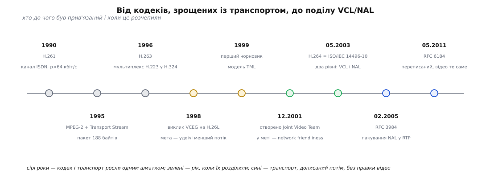

# 📜 Як відео відчепили від дроту: народження поділу VCL/NAL

Поділ H.264 на рівень відеокодування (VCL) і рівень абстракції від мережі (NAL) виглядає очевидним інженерним рішенням — стиснення окремо, пакування окремо. Але до 2001 року жоден поширений відеостандарт так не робив, і причина цьому була не дурість, а історія: кожен кодек народжувався під конкретний дріт і разом із ним. Ця вставка — про те, як мережі змінилися швидше за стандарти, хто і коли зважився розчепити відео й транспорт, і що з цього задуму справді прижилося, а що лишилося на папері.



*Сіре — коли кодек і його транспорт росли одним шматком; зелене — рік розчеплення; синє — транспорт, дописаний уже після відео.*

## Кодек, що знав свій дріт на дотик

H.261, ухвалений ITU-T 1990 року, називався «Video codec for audiovisual services at p×64 kbit/s» — швидкість каналу стояла просто в назві. Це не метафора: кодек проєктували під ISDN, під ціле число базових каналів по 64 кбіт/с, і вся його конструкція припускала синхронний потік бітів без втрат, який іде рівно з такою швидкістю, з якою його виробили. Бітовий потік H.261 — суцільна послідовність, розмічена зсередини власними стартовими кодами; жодного окремого поняття «пакет» у ньому не було, бо в каналі не було пакетів.

MPEG-2 пішов далі й забрав транспорт усередину сімейства стандартів. ISO/IEC 13818 складається з частин, де частина 2 — це саме відео, а частина 1 — Systems: пакетизований елементарний потік PES, програмний потік для дисків і транспортний потік із пакетами по 188 байтів для мовлення. Формально рівні розділені, і це вже був крок уперед. Практично ж вони проєктувалися разом, під одну модель доставки, і те, як відео ділиться на шматки, підганяли під те, як ці шматки поїдуть у Transport Stream. Механіка транспортного потоку — окрема тема: [188-байтний пакет, PID, PCR і безперервність лічильника](root:com-protocol/mpeg-ts) описують мовний канал, у якому дані течуть рівномірно, а приймач може ввійти в потік будь-коли.

H.263 (завершений 1995-го, ратифікований у березні 1996) робився насамперед під H.324 — відеотелефонію по звичайній телефонній лінії, де біти йдуть крізь мультиплекс H.223. І тут зрощення видно найкраще. Стійкість до помилок у H.263 — це набір режимів у самому кодеку: незалежне декодування сегментів, вибір опорної картинки, пряме виправлення помилок для відеосигналу. Кожен такий режим виходив із того, що канал псує **окремі біти**, бо саме так поводиться радіо чи телефонна лінія. Кодек лікував хворобу свого дроту.

> 🔧 **Навіщо це.** Коли режим стійкості вбудований у кодек, він неявно фіксує модель ушкоджень. Змініть дріт — і лікування стане непотрібним або шкідливим: у пакетній мережі біти не псуються поодинці, там або приходить увесь пакет цілим, або не приходить нічого.

## Коли дріт змінився, а стандарти — ні

Наприкінці 1990-х відео пішло туди, де ніякого «свого каналу» не було: IP, локальні мережі, перші мобільні пакетні служби. [Різниця між комутацією каналів і комутацією пакетів](root:com-transport/circuit-vs-packet-switching) тут не академічна: у каналі вам гарантують сталу смугу й порядок, у пакетній мережі — ні смуги, ні порядку, ні самої доставки. Помилка більше не виглядає як перевернутий біт. Вона виглядає як діра завдовжки в кілограм даних, що просто не прийшли.

Кодеки того часу до такої діри не були готові двічі. По-перше, їхні механізми стійкості лікували не ту хворобу. По-друге — і це болючіше — вихід кодека був суцільним потоком, який хтось мусив різати на пакети. Різати мав транспорт, а транспорт не знає, де в потоці проходять межі осмислених шматків і які з них важливіші. Тож кожне поєднання «кодек + мережа» вимагало власного клею: свого способу знайти межі, свого способу зрозуміти, що втрачено, свого способу вирішити, який шматок можна викинути першим. Клей писали окремо для кожної пари, і кожен раз наново.

Особливо дратував випадок заголовків потоку. Розмір картинки, кількість опорних кадрів, параметри квантування — усе, без чого не розібрати жоден кадр — жило на початку потоку. Приймач, що під'єднався пізніше або втратив саме той пакет, не міг декодувати нічого. Стандартною латкою було періодичне повторення заголовків у потоці: марна трата смуги в надії, що читач колись увімкнеться.

## H.26L: спершу ефективність, потім мережа

Робота, з якої виріс H.264, почалася в ITU-T як проєкт H.26L. На початку 1998 року група експертів VCEG оголосила конкурс пропозицій із метою вдвічі зменшити потік за тієї самої якості; групу тоді очолював Гері Салліван (Gary Sullivan), який прийшов у неї з PictureTel і згодом працював у Microsoft. Перший чорновий проєкт ухвалили в серпні 1999 року, і розвивався він у вигляді тестової моделі TML. 2000 року співголовою VCEG став Томас Віганд (Thomas Wiegand) з берлінського Інституту Гайнріха Герца.

Головною метою H.26L була ефективність стиснення — і саме нею проєкт привернув увагу з іншого боку. MPEG, що працював у ISO/IEC, побачив у чернетках H.26L якість, істотно кращу за власний MPEG-4 Visual. У грудні 2001 року VCEG і MPEG утворили спільну робочу групу — Joint Video Team (JVT), — щоб довести цю роботу до спільного стандарту. JVT очолювали втрьох: Салліван, Віганд і Аджай Лутра (Ajay Luthra) з Motorola. Модель була не нова: так само свого часу народжувалася пара H.262 / MPEG-2, один текст під двома номерами.

Саме в JVT «дружність до мережі» (network friendliness) стала оголошеною метою поряд із ефективністю, і саме тут конструкцію розрізали навпіл. VCL відповідає за одне: якнайкраще стиснути картинку. NAL відповідає за інше: подати те, що вийшло, у формі, придатній для найрізноманітніших способів доставки — RTP поверх IP, файл формату ISO, мультиплекс сімейства H.32x, транспортний потік MPEG-2. Ключова зміна тут не в новому синтаксисі, а в тому, **хто розставляє межі**. Межі шматків тепер визначає кодувальник, а не транспорт: він сам вирішує, де закінчується самодостатня одиниця, і сам ставить на неї етикетку з типом і мірою важливості. Транспортові лишається їх переносити.

Технічну роботу JVT завершив навесні 2003 року. ITU-T затвердив першу редакцію Рекомендації H.264 30 травня 2003 року; того ж року ISO/IEC видала той самий текст як 14496-10 — MPEG-4 Part 10, Advanced Video Coding. Перша редакція містила три профілі: Baseline, Main і Extended.

## Поділ слайса на частини: задум, що лишився кресленням

У переліку типів NAL є три сусіди — 2, 3 і 4, — які майже ніхто ніколи не бачив у реальному потоці. Це три частини одного розрізаного слайса: частина A з заголовком слайса, типами макроблоків, параметрами квантування й векторами руху; частина B з коефіцієнтами внутрішньокадрового кодування; частина C з коефіцієнтами міжкадрового.

Задум був гарний і чесно випливав із логіки NAL. Частини нерівноцінні: без A решта не значить нічого, а от без C кадр іще можна відновити приблизно — з векторами руху й попередньою картинкою. Отже, якщо мережа вміє захищати дані нерівномірно, дайте частині A сильніший захист, а частину C везіть як вийде. Ідея не була винаходом JVT: H.263 отримав режим поділу слайса на частини в Додатку V редакції 2000 року, а MPEG-4 Visual мав власний варіант того самого. NAL просто дав ідеї природну форму — окремі одиниці з окремими етикетками важливості.

Далі почалася арифметика реальності. Поділ на частини не увійшов ані в Baseline, ані в Main — тільки в Extended, профіль, задуманий під потокове мовлення й сам собою майже не вживаний. Мережі, яким адресувався задум, теж не з'явилися: у IP немає стандартного способу сказати «цей пакет вези надійніше», а мобільні канали з нерівномірним захистом лишилися нішею. Правила пакування H.264 в RTP чесно приписали частинам різні рівні пріоритету в заголовку — і на цьому все скінчилося, бо пріоритет у заголовку є, а мережі, яка його читає, здебільшого немає.

Наслідок видно в коді. У декодері FFmpeg — тому самому, крізь який проходить величезна частка світового відео — три типи оброблені так:

```c
case H264_NAL_DPA:
case H264_NAL_DPB:
case H264_NAL_DPC:
    avpriv_request_sample(avctx, "data partitioning");
    break;
```

Це не помилка й не недогляд: `avpriv_request_sample` означає «ми знаємо про цю можливість стандарту, вона не реалізована, надішліть нам файл, якщо ви його десь знайшли». За два десятиліття такого файлу не набралося. Кодувальник x264 їх не виробляє, апаратні кодери — теж. Стандартизована, документована, розписана в правилах транспорту можливість так і лишилася кресленням: ідея була правильна, профіль обрано невдало, а мережі, під яку її робили, не сталося.

Стійкість до втрат урешті пішла іншим шляхом — коротшими слайсами, вчасними точками входу, повторенням наборів параметрів і [добудовуванням втраченого на приймачі](root:com-signal/packet-loss-concealment), де діру закривають екстраполяцією з сусідніх кадрів замість того, щоб домовлятися про пріоритети з мережею.

## RTP: транспорт переписали двічі, відео не чіпнули

Найкращий доказ того, що поділ спрацював, дала не сама специфікація відео, а те, що з ним потім робили інші.

Пакування H.264 у RTP описали в IETF окремим документом — RFC 3984, який вийшов у лютому 2005 року за авторства Стефана Венгера, Міски Ганнуксели, Томаса Штокгаммера, Магнуса Вестерлунда й Девіда Сінґера. Документ узяв типи NAL, які стандарт відео лишив невизначеними, і надав їм транспортного змісту: пакети-агрегати, що складають кілька дрібних одиниць в один пакет, і фрагменти, що ріжуть одну велику одиницю на кілька. Додався режим передавання одиниць не в порядку декодування, з номером порядку в заголовку. Механіка самого [RTP і його зворотного каналу RTCP](root:com-protocol/rtp-rtcp) тут не змінювалася — змінювалося лише те, що кладуть у корисне навантаження.

У травні 2011 року вийшов RFC 6184 — Є-Куй Ван, Роні Івен, Том Крістенсен, Рендел Джесап — і замінив RFC 3984 повністю. За шість років практики знайшлися хиби опису, неоднозначності в узгодженні параметрів, потреба в акуратнішій сумісності.

І ось у чому суть: між лютим 2005-го й травнем 2011-го формат самого відео не змінився ані на біт. Той самий кодувальник, той самий декодер, той самий файл — а правила везіння переписали наново. Транспорт виявився змінною величиною, відео — сталою. Саме цього JVT і хотів, коли ставив між ними межу; до H.264 така переробка означала б новий кодек.

Межа виявилася довговічнішою за сам H.264. Наступні стандарти сімейства — [HEVC і його наступники](root:sf-visual/h265-hevc) — успадкували ту саму двошарову будову з майже незмінною ідеєю заголовка одиниці: тип, важливість, самодостатній вантаж. Один раз правильно проведена лінія поділу пережила три покоління кодеків.
