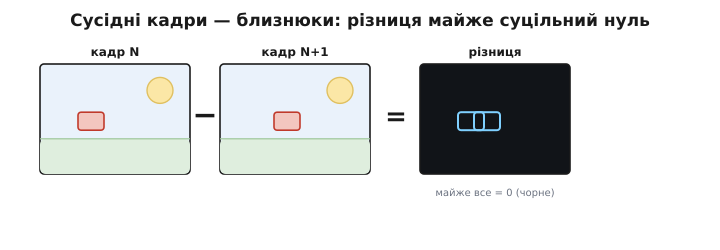
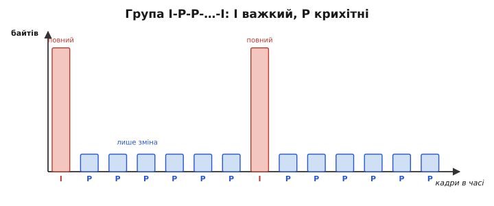
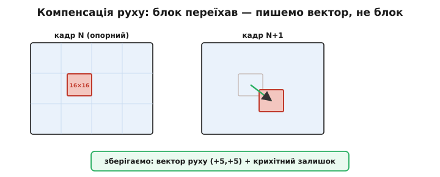
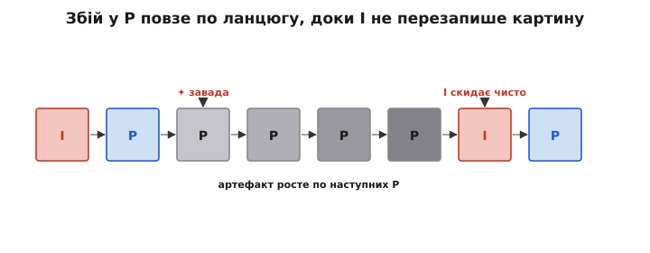

# Часова надмірність: міжкадрове стиснення (I/P/B-кадри)

[JPEG](topic:com-signal/jpeg-intra) вичавлює надлишок із **одного** кадру: прибирає схожість сусідніх пікселів. Та відео ховає ще багатший запас зайвини — **часовий** (inter-frame, лат. *inter* — між). Зніми будь-яке відео й порівняй два кадри підряд: за 1/30 секунди світ майже не змінюється. Рухається дрібка — об'єкт проїхав, камера ледь повелася, — а решта кадру стоїть нерухомо. Слати весь кадр щоразу, коли від нього лишилася жменя нових пікселів, — марнотратство. Розумніше слати тільки **те, що змінилося**. Саме цей крок піднімає стиск відео з десятків разів (стеля JPEG на окремих кадрах) у **сотні** — і робить можливими і Blu-ray, і YouTube, і цифрову картинку з твого дрона.

### Сусідні кадри — близнюки

Щоб побачити надлишок на власні очі, візьми два сусідні кадри польоту й **відніми** один від іншого, піксель за пікселем. Тло — земля, небо, обрій — у двох кадрах те саме, тож після віднімання дає **нуль**. Ненульовим лишиться хіба тонкий обідок там, де об'єкт зрушився, та легка кайма по краях, якщо камеру повело. Виходить, різниця двох кадрів — майже суцільний нуль із дрібними плямами зміни.


*Сусідні кадри — близнюки. Тло (земля, обрій, сонце) у кадрах N і N+1 однакове, тож їхня поканальна різниця майже суцільно чорна — нуль. Світиться лише обідок там, де об'єкт зрушився. Це й передають замість цілого кадру.*

А «майже суцільний нуль» — золото для стиснення. Поле нулів той самий [JPEG-конвеєр](topic:com-signal/jpeg-intra) ужимає до крихт: після квантування й кодування довгих серій довга низка нулів коштує лічені байти. Тому замість «ось новий кадр» кодувальник пише «ось різниця від попереднього» — і ця різниця після стиснення важить у рази менше за повний кадр. Отак часовий надлишок **множиться** на просторовий: спершу прибрали схожість пікселів усередині різниці, а ще раніше — схожість самих кадрів. Два двигуни стиснення, увімкнені послідовно, і дають ту прірву між десятками й сотнями разів.

### I-кадри й P-кадри

Та різницю треба від **чогось** віднімати — мусить бути перший кадр, повний і самодостатній, від якого почнеться відлік. Звідси два головні роди кадрів.

**I-кадр** (*Intra*, лат. *intra* — всередині; «у межах одного кадру») — повний, самодостатній кадр, стиснений сам по собі рівно як JPEG. Він ні від кого не залежить: відкрив його — і маєш цілу картину, не озираючись на сусідів. Платня за цю незалежність — вага: I-кадр містить **усе**, тож великий.

**P-кадр** (*Predicted*, лат. *prae-* — наперед; «передбачений») зберігає лише **зміну** від попереднього кадру. Декодер бере вже відновлений попередній кадр, накладає на нього цю зміну — і дістає новий. Оскільки зміна дрібна, P-кадр виходить **крихітним**: типово він важить лічені відсотки від I-кадру тієї самої сцени, бо переважна частина картини просто переписується зі вже наявного кадру, а кодуються самі поправки.


*Група кадрів I-P-P-P-…-I у байтах. I-кадр повний і самодостатній (стиснений як JPEG) — високий стовпчик; P-кадри несуть лише зміну від попереднього, тому низенькі. Бітрейт стрибає вгору на кожному I-кадрі (раптова велика порція), а між ними тече тонко — звідси й поштовхи затримки на вузькому каналі.*

Відео тому йде **групами кадрів** (GOP, *Group of Pictures*): на початку один I-кадр, а за ним низка P-кадрів, що по черзі нарощують зміни: I-P-P-P-…-P, далі знову I і нова група. Опорний I дає всю картину, кожен наступний P домальовує на неї рух. Звідси характерна риса відеопотоку — **нерівний бітрейт**: щоразу на I-кадрі канал отримує раптову велику порцію даних, а між ними — тоненький струмочок поправок. На широкому каналі це непомітно, а на вузькому стрибки даються взнаки поштовхами затримки, бо буфер раптом мусить проковтнути важкий I.

> 🔧 **Навіщо це.** Нерівний бітрейт — практична проблема живого відео. Якщо канал вузький (цифрове FPV, відео по стільниковій мережі), важкий I-кадр не встигає пройти за відведений йому такт, і картинка на мить підвисає чи рветься саме на зміні групи. Тому кодувальникам дають **обмеження бітрейту** (CBR/VBR), яке штучно «розмазує» вагу I-кадру на сусідні, дрібнячи його квантуванням, — ціною тимчасового падіння якості одразу після I. Знаєш, що стрибок іде від I, — знаєш, де крутити ручку.

### B-кадри: дивитися в обидва боки

P-кадр озирається лише **назад** — на вже показаний кадр. Та частину руху краще видно, якщо глянути ще й **вперед**. Уяви, що об'єкт на мить заслонив частину тла, а наступної миті від'їхав і відкрив його: чого зараз бракує в кадрі, у минулому немає, зате воно є в **майбутньому** кадрі. На це й розрахований **B-кадр** (*Bi-directional*, лат. *bi-* — двічі; «двобічний»): він бере опору і з попереднього, і з наступного кадру, а для кожного шматка вибирає, звідки прогноз точніший, або **усереднює** обидва. Маючи дві опори замість однієї, B-кадр майже завжди вгадує точніше, тож його різниця ще менша — він найлегший із трьох родів.

Та задарма не буває. Щоб закодувати B-кадр, потрібен **майбутній** кадр — а отже, кодувальник мусить його дочекатися, перш ніж випустити B. Декодер так само складає кадри **не в тому порядку**, у якому показує: спершу декодує обидві опори, потім B між ними. Це додає **затримки** — кадр чекає на сусіда з майбутнього. Для запису кіно чи стрімінгу затримка в кілька кадрів дрібниця, тому там B-кадрів повно. А от для **живого** відео керування — цифрового FPV, телеметрії дрона — кожен зайвий кадр затримки шкодить: пілот реагує на те, що вже сталося. Тому в режимах низької затримки B-кадри часто **вимикають** зовсім, лишаючи самі I та P.

> 🔧 **Навіщо це.** Бачиш у налаштуваннях кодувальника «zero-latency» чи «no B-frames» — це і є вимкнення B-кадрів заради відгуку. Для запису гарного відео з підвісу лиши B (менший файл за тієї самої якості); для відео, яким **кермуєш**, прибери їх — кожен кадр затримки коштує реакції.

### Компенсація руху: найрозумніший трюк

Просте «відняти попередній кадр» працює, доки картина стоїть. Та щойно камера повелася вбік, **усе** зрушилося на кілька пікселів — і поканальна різниця враз перестає бути нулем: кожен край, кожен контур дає ненульову смужку. Наївна різниця тут роздулася б. Тому кодувальник робить хитріше — **компенсацію руху** (*motion compensation*).


*Компенсація руху. Кодувальник ріже кадр на блоки й для кожного шукає в попередньому кадрі, звідки той міг приїхати. Знайшов — пише коротке «візьми отой блок і посунь на +5,+5»: вектор руху (кілька байтів) плюс крихітний залишок (що не збіглося після зсуву). Так панораму на пів екрана описує жменя однакових векторів.*

Працює це так. Кодувальник ріже кадр на **блоки** (у [H.264](root:embedded/mjpeg-vs-h264) базовий блок — макроблок 16×16 пікселів, який за потреби дробиться аж до 4×4) і для кожного блока **шукає** в попередньому кадрі ділянку, найсхожішу на нього. Знайшов — і замість «ось новий блок» пише дві речі: **вектор руху** (*motion vector*) — на скільки пікселів по горизонталі й вертикалі цей блок переїхав («візьми отой і посунь на +5, +5», лічені байти) — і **залишок** (*residual*), він же помилка передбачення: дрібну поправку на те, що **не** збіглося ідеально після зсуву. Залишок теж проганяють через DCT-конвеєр, тож і він стискається до крихт.

Звідси й уся сила. Панораму, де пів екрана їде однаково, описує жменя майже **однакових** векторів — замість тисяч пікселів. А вектор ще й не мусить указувати на цілий піксель: H.264 шукає збіг із точністю до **чверті пікселя** по яскравості, домальовуючи проміжні відтінки інтерполяцією, — і це ловить плавне ковзання, яке інакше лишило б помітний залишок. Компенсація руху — це і є те «розуміння», що світ не з'являється наново щокадру, а **рухається**: вона перетворює рух із дорогої зміни на дешевий вектор.

> 🧮 Сам пошук «звідки приїхав блок» — окрема задача з власною ціною: треба перебрати кандидатів-зсувів і виміряти схожість кожного. Як це роблять і чому саме оцінка руху з'їдає більшість часу кодувальника, розібрано в [математиці оцінки руху](topic:com-signal/inter-frame/math-motion-estimation.md).

### Скільки це економить

Порахуймо на пальцях, наскільки P-кадр легший за повний. Візьмемо кадр 1280×720, кольоровий, де на повний (I) кадр після JPEG-стиснення йде, скажімо, 60 КБ. Камера дивиться на майже нерухому сцену: між кадрами реально змінилося близько 5% площі (об'єкт проїхав), решта 95% — те саме тло, що після віднімання дало нуль.

```c
// Оцінка ваги P-кадру проти I-кадру тієї самої сцени.
// (ілюстративні числа: показуємо порядок економії, не точний бітрейт кодека)
int   W = 1280, H = 720;          // роздільність
int   I_kb = 60;                  // повний (I) кадр після стиснення, КБ
float changed = 0.05f;            // частка площі, що реально змінилася (5%)

// 1) Залишок (residual): кодуються лише змінені блоки.
//    Незмінені дають нуль і коштують майже задарма.
float resid_kb = I_kb * changed;          // 60 * 0.05 = 3.0 КБ

// 2) Вектори руху: ~ один MV на макроблок 16x16.
int   mb = (W / 16) * (H / 16);           // 80 * 45 = 3600 макроблоків
float mv_bytes = 1.5f;                    // ~1.5 байта на MV після стиснення
float mv_kb = mb * mv_bytes / 1024.0f;    // 3600 * 1.5 / 1024 = 5.27 КБ

// 3) Разом P-кадр і виграш проти I.
float P_kb = resid_kb + mv_kb;            // 3.0 + 5.27 = 8.27 КБ
float ratio = (float)I_kb / P_kb;         // 60 / 8.27 = 7.3
```

P-кадр вийшов **близько 8 КБ проти 60 КБ** в I-кадру — у понад **сім разів** легший, і це за досить стриманої сцени; на майже нерухомому кадрі виграш ще більший. Тепер уяви групу з одного I та чотирнадцяти P (GOP = 15): замість п'ятнадцяти повних кадрів (15 × 60 = 900 КБ) маємо 60 + 14 × 8 ≈ **172 КБ** — учетверо менше навіть на цій помірній сцені. Ось звідки той множник у сотні разів проти послідовності окремих фото: що довша спокійна сцена, то більше дешевих P припадає на один дорогий I.

> 🔧 **Навіщо це.** Ця арифметика прямо керує **довжиною GOP** у кодувальнику. Довший GOP (більше P на один I) — менший середній бітрейт, але повільніше відновлення після збою й гірший «перемот» (бо стрибати можна лише на I). Коротший GOP — навпаки. Коли підбираєш бітрейт під канал дрона, ти насправді торгуєш цією парою: скільки дешевих P можна нанизати, поки наступний дорогий I не псує картину.

### Група кадрів і ключовий кадр

Тепер видно, чому GOP — не просто «пачка кадрів», а одиниця, якою кодувальник міряє все. **GOP** (*Group of Pictures*) — відрізок від одного I-кадру до наступного: один опорний I плюс залежні від нього P (і, як є, B). Перший кадр групи — **ключовий** (*keyframe*): єдина точка, де картину видно **цілою**, не складаючи її з поправок. У [H.264](root:embedded/mjpeg-vs-h264) такий по-справжньому самодостатній ключовий кадр називають **IDR** (*Instantaneous Decoder Refresh* — миттєве оновлення декодера): дійшовши до нього, декодер має право **забути** всі попередні кадри, бо далі ніщо на них не спиратиметься.

Звідси два устрої груп. **Закрита** GOP замкнена в собі: жоден її кадр не зазирає за межу групи, тож декодер може почати рівно з ключового кадру й нічого не бракуватиме. **Відкрита** GOP економніша (її B-кадри на стику позичають опору із сусідньої групи), та починати відтворення з її середини не можна — забракне опор. Тому **точки входу** в потік — перемотування, перемикання каналу, під'єднання нового глядача до стріму — кладуть рівно на ключові (IDR) кадри: лише там картину видно з нуля.

> 🔧 **Навіщо це.** Коли плеєр «думає» секунду після перемотування — він домотує до найближчого ключового кадру, бо тільки звідти може почати. Рідкі ключові кадри (довгий GOP) роблять перемотування грубим і відновлення повільним; часті — навпаки, ціною бітрейту. У стрімінгу довжину GOP узгоджують із розміром сегмента, щоб кожен шматок починався ключовим кадром і його можна було віддати глядачеві окремо.

### Чому потрібні періодичні I-кадри

Лишилось одне «але», вирішальне для апарата. P-кадри спираються один на одного **ланцюжком**: P₃ будується на P₂, той на P₁, а той на опорному I. Поки ланцюг цілий, усе гаразд. Та варто **загубити одну ланку** — радіозбій, завада на каналі, — і всі **наступні** P, що спираються на втрачений, теж відновляться неправильно: помилка не зникає, а **тягнеться далі** по ланцюгу, накопичуючись із кадра в кадр.


*Чому потрібні періодичні I-кадри. Зіпсований завадою P-кадр отруює всі наступні P, що на нього спираються, — артефакт розмазується й росте. Повний I-кадр ні від кого не залежить, тож, прийшовши, скидає накопичену помилку начисто. Рідші I — менший бітрейт, та довше «гоїться»; частіші — швидке відновлення, та товстіший потік.*

Рятунок — **періодичні I-кадри**: повний кадр ні на кого не спирається, тож, прийшовши, він **перезаписує** всю картину начисто й обриває розповзання помилки. Що частіші I, то швидше «гоїться» збій — але тим вищий бітрейт, бо кожен I важкий. Тут і компроміс: рідкі I — компактний потік, та збій тримається довго; часті I — миттєве відновлення, та товстіший потік. **Ось чому цифрове FPV «розсипається квадратами» за завад**, на відміну від [аналогового відео](topic:com-modulation/analog-video), де завада псує лише ту мить, коли сталася: у цифрі загубився кадр — і артефакт повзе по ланцюгу P, доки не прийде наступний I. Тому для FPV нерідко роблять I-кадри **частими**, а в крайньому разі — взагалі **всі** кадри роблять I (intra-only): потік товщає, зате розмазування зникає, бо кожен кадр самостійний, точно як в аналозі.

> 🔧 **Навіщо це.** Якщо твоє цифрове FPV «зависає квадратами» й повільно відходить — це ланцюг P-кадрів несе збій до наступного I. Ліки прямі: **частіші I-кадри** (коротший GOP у кодувальнику) або intra-only режим — відновлення вмить, ціною бітрейту. Загальне правило: P-кадри дають стиск, але крихкість; I-кадри — стійкість, але вагу. На надійному каналі тисни довшим GOP; на ламкому радіоканалі вкорочуй його або переходь на intra-only.

> 📜 Хто звів усі ці прийоми — DCT, квантування, I/P/B-кадри, компенсацію руху — в єдині світові стандарти, на яких тримається вся відеоіндустрія, розказано в історії групи [MPEG](topic:com-signal/inter-frame/hist-mpeg.md).

### Підсумок теми

Часовий надлишок — це **схожість сусідніх кадрів**: за мить світ майже не міняється, тож слати варто лише **різницю**. Звідси роди кадрів: **I** — повний і самодостатній (як JPEG, важкий), **P** — лише зміна від попереднього (крихітний), **B** — зміна з опорою в обидва боки (найлегший, але з затримкою); відео йде **групами** від I до I, де перший кадр — ключовий (IDR), єдина точка входу. **Компенсація руху** робить різницю ще меншою: замість «новий блок» — «старий блок, посунутий на вектор» плюс крихітний залишок, тож рух камери й об'єктів ловиться майже задарма. Цей часовий трюк і піднімає стиск із десятків (JPEG) у **сотні** разів. Плата — **крихкість ланцюга**: загублений P розмазується по наступних, доки I не скине помилку, тож I роблять періодичними, а для живого FPV — частими чи всуціль. Просторовий і часовий надлишок — два двигуни стиснення; те, як їх по-різному поєднують реальні кодеки, добре видно на парі [MJPEG проти H.264](root:embedded/mjpeg-vs-h264).

---
