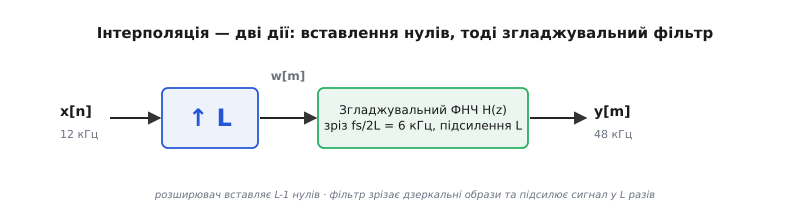
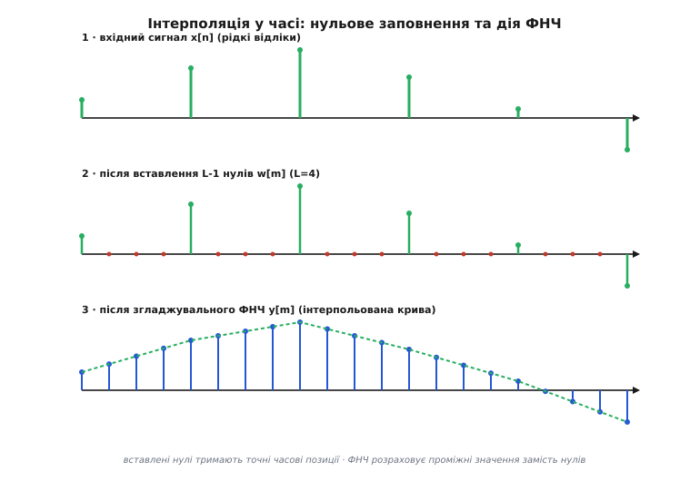
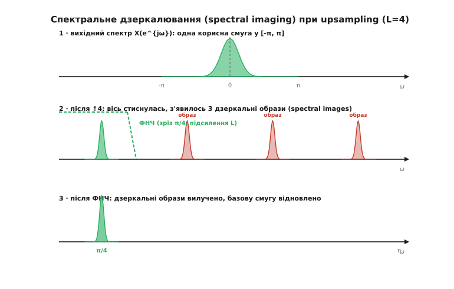
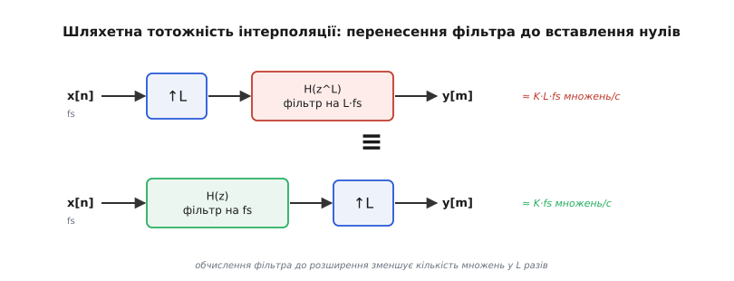
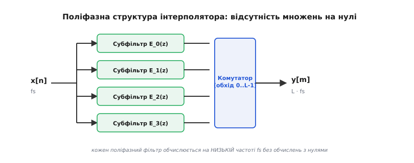

# Інтерполяція (upsampling): вставлення нулів і згладжувальний фільтр

<preknowlist>
- [Найквіст і аліасинг](topic:com-signal/nyquist-aliasing) — теорема відліків, спектральна періодичність та межа відновлення без спотворень.
- [Проріджування (decimation)](topic:com-signal/decimation) — зниження частоти дискретизації, децимація та антиаліасингова фільтрація.
- [Відновлення сигналу з відліків](topic:com-signal/sampling-reconstruction) — перетворення цифрового спектра назад у неперервний сигнал.
</preknowlist>

Коли цифровий аудіоплеєр відтворює запис високої якості з частотою дискретизації 44.1 кГц, подача цих відліків безпосередньо на цифро-аналоговий перетворювач (ЦАП) створює критичну схемотехнічну проблему. Згідно з теоремою Найквіста–Шеннона, вихідний спектр ЦАП містить не лише корисні звукові частоти від 0 до 20 кГц, а й нескінченну серію дзеркальних спектральних копій, розташованих навколо частоти дискретизації 44.1 кГц та її гармонік (88.2 кГц, 132.3 кГц тощо). Щоб відфільтрувати ці ультразвукові завади та не спалити високочастотний динамік, аналоговий фільтр нижніх частот після ЦАП повинен мати майже вертикальну спадну характеристику в смузі від 20 кГц до 24.1 кГц — тобто перехідну смугу шириною всього 4.1 кГц. Побудова такого аналогового фільтра вимагає високих порядків компонентів, спричиняє сильні нелінійні фазові спотворення та значно здорожчує пристрій.

Розв'язанням цієї проблеми є цифрове підвищення частоти дискретизації — інтерполяція (від латинського *interpolatio* — відновлення, переробка, вставлення між чимось). Якщо перед подачею на ЦАП підвищити частоту відліків у чотири рази (до 176.4 кГц) у цифровій формі, перша дзеркальна спектральна копія зміститься на частоту 176.4 кГц. У результаті перехідна смуга для аналогового фільтра розшириться з 4.1 кГц до понад 150 кГц. Це дозволяє замінити складний аналоговий фільтр високого порядку найпростішим RC-ланцюжком другого порядку, перенісши весь обчислювальний тягар у цифрову область, де фільтрація виконується зі строго лінійною фазою та безвідмовною точністю.

Аналогічна ситуація виникає у передавачах програмно-визначеного радіо (SDR, Software Defined Radio). Формування квадратурного baseband-сигналу стандарта Wi-Fi або LTE відбувається на відносно низькій частоті дискретизації (наприклад, 20 МГц), проте вихідний ЦАП повинен працювати на частоті в сотні мегагерц, щоб сформувати чисту радіочастотну несучу. Без цифрового підвищення частоти відліків дзеркальні спектральні образи залюють сусідні радіоканали, спричиняючи грубі порушення стандартів електромагнітної сумісності.

Процес цифрової інтерполяції (англ. *upsampling*) складається з двох послідовних кроків: часового розширення дискретної послідовності шляхом вставлення нульових відліків (операція *zero-stuffing* або *expansion*) та подальшої дискретної фільтрації за допомогою згладжувального (анти-іміджингового) фільтра нижніх частот.


*Канонічний ланцюг інтерполяції: вставлення L-1 нулів та анти-іміджинговий ФНЧ.*

## Вставлення нулів у часовій області: оператор розширення

Для підвищення частоти дискретизації початкової послідовності `x[n]` у ціле число `L` разів (де `L` називають коефіцієнтом інтерполяції або розширення) першим кроком формують нову послідовність `w[m]`, яка працює на частоті дискретизації `f_s' = L · f_s`.

Оператор розширення (позначається як `↑L`) вставляє `L - 1` нульових відліків між кожною парою сусідніх відліків початкового сигналу `x[n]`. Математично зв'язок між вхідним сигналом `x[n]` та розширеним сигналом `w[m]` виражається умові:

```
w[m] = x[m / L],  якщо m ділиться на L без залишку
w[m] = 0,        якщо m не ділиться на L
```

Для прикладу, якщо коефіцієнт інтерполяції `L = 4`, а вхідна послідовність має вигляд `x[n] = [x₀, x₁, x₂, ...]`, то після операції вставлення нулів розширений сигнал набуває форми:

```
w[m] = [x₀, 0, 0, 0, x₁, 0, 0, 0, x₂, 0, 0, 0, ...]
```

Постає фундаментальне питання: чому проміжні значення заповнюють саме чистими нулями, а не дублюють попередній відліковий рівень (як у фіксаторі нульового порядку, Sample-and-Hold / ZOH) і не з'єднують точки похилими відрізками (як у лінійній інтерполяції)?

Причина полягає у збереженні точної часової та амплітудної інформації початкового сигналу. Вставлення нулів є єдиною математично нейтральною операцією, яка не додає до сигналу сторонньої енергії та залишає початкові відліки `x[n]` абсолютно недоторканими в часових позиціях `m = n · L`. Нулі виконують роль «вільного полотна» у часовій сітці високої частоти, на якому подальший цифровий фільтр розрахує точні проміжні значення огинаючої.


*Сигнал у часовій області: початкові відліки, zero-stuffing та результатуюча згладжена крива після фільтрації.*

Якщо ж замість нулів повторити значення `x[n]` кілька разів поспіль, сигнал у часі набуде східчастої форми. У частотній області це відповідатиме множенню спектра на функцію `sinc`, що призведе до сильних спадів амплітудно-частотної характеристики на високих частотах і створить значні залишкові спотворення, які складно виправити подальшою фільтрацією.

Вставлення нулів зберігає миттєву амплітуду початкових точок, проте зменшує середню енергію сигналу на один відлік у `L` разів, оскільки на один значущий відлік тепер припадає `L - 1` нульових точок. Цю енергетичну зміну враховують і компенсують на наступному етапі фільтрації шляхом пропорційного підсилення.

## Спектральні наслідки: дзеркалювання спектра (spectral imaging)

Для розуміння того, що відбувається зі спектром сигналу при вставленні нулів, звернемося до дискретного перетворення Фур'є з часовими відліками (DTFT).

У часовій області операція `↑L` розтягує часову сітку, збільшуючи кількість відліків на одиницю часу у `L` разів. За властивістю двоїстості перетворення Фур'є, розтягування часу призводить до відповідного стискання осі частот у `L` разів. Якщо позначити нормовану кругову частоту вхідного сигналу як `ω` (де `ω = 2 · π · f / f_s`), то після розширення сигналу нормована частота нових відліків дорівнюватиме `ω' = ω / L`.

Підставивши вирази в означення DTFT, отримуємо фундаментальне співвідношення між спектром вхідного сигналу `X(e^{jω})` та спектром розширеного сигналу `W(e^{jω})`:

```
W(e^{jω}) = X(e^{j·ω·L})
```

Це співвідношення показує, що спектр `W(e^{jω})` є результатом стискання початкового спектра `X(e^{jω})` уздовж осі частот у `L` разів.


*Зміна спектра при upsampling: стискання часової осі створює дзеркальні образи (spectral images), які вирізає ФНЧ.*

Оскільки спектр будь-якого дискретного сигналу є періодичним із періодом `2·π`, стискання осі у `L` разів призводить до того, що у новий фундаментальний діапазон частот від `-π` до `+π` вміщується `L` повних періодів початкового спектра. 

Один із цих періодів (розташований коло нульової частоти) являє собою корисний базовий спектр сигналу. Решта `L - 1` періодів, розташованих навколо частот `2 · π · k / L` (для `k = 1, 2, ..., L - 1`), називаються **дзеркальними образами** (від англійського *spectral images* або *spectral imaging*).

Вкрай важливо розрізняти два близьких поняття теорії цифрової обробки сигналів:
1. **Аліасинг (Aliasing)** виникає при зниженні частоти дискретизації (децимації), коли високочастотні складові незворотно накладаються на низькочастотний спектр, псуючи корисну інформацію.
2. **Дзеркалювання (Spectral Imaging)** виникає при підвищенні частоти дискретизації (інтерполяції), коли вставлення нулів створює дублікати початкового спектра на вищих частотах. При цьому сам корисний спектр не псується і не накладається сам на себе — дзеркальні образи стоять ізольовано один від одного і можуть бути повністю вилучені за допомогою фільтра нижніх частот.

Детальне математичне виведення спектрального стискання та властивостей періодичності наведено у вставці `[математичний вивід спектрального дзеркалювання](topic:com-signal/interpolation-upsampling/math-spectral-imaging.md)`.

## Згладжувальний / анти-іміджинговий фільтр (Anti-Imaging Filter)

Якщо залишити сигнал `w[m]` після вставлення нулів без змін, дзеркальні образи проявляться у вигляді високочастотного писку, клацань або позасмугових завад у радіоефірі. Роль згладжувального (анти-іміджингового) фільтра `H(z)` полягає у вилученні всіх `L - 1` дзеркальних образів і збереженні лише корисного спектрального горба в діапазоні `[-π/L, π/L]`.

### Параметри ідеального фільтра

Ідеальний анти-іміджинговий фільтр є цифровим ФНЧ із прямокутною амплітудно-частотною характеристикою:
- **Частота зрізу (Cutoff Frequency)**: `ω_c = π / L` (у фізичних частотах це відповідає початковій частоті Найквіста `f_s / 2`).
- **Смуга пропускання**: від `0` до `π / L`.
- **Смуга загородження**: від `π / L` до `π`.
- **Коефіцієнт підсилення в смузі пропускання**: `H(0) = L`.

Вимога підсилення `H(0) = L` є критичною для збереження енергетичного балансу. Оскільки вставлення `L - 1` нулів зменшує середню амплітуду сигналу у часі у `L` разів (енергія розподіляється на `L` разів більшу кількість відліків), фільтр нижніх частот мусить підсилювати амплітуду базової гармоніки у `L` разів. Без цього підсилення інтерпольований сигнал виявиться у `L` разів тихішим за вхідний.

```
Імпульсна характеристика ідеального ФНЧ:
h[m] = L · sinc(m / L) = L · sin(π·m / L) / (π·m / L)
```

Оскільки ідеальна функція `sinc` має нескінченну тривалість у часі й не задовольняє умові фізичної реалізовності (причинності), на практиці використовують скінченні імпульсні характеристики (FIR/ФІР) або нескінченні імпульсні характеристики (IIR/БІР).

### Порівняння ядер інтерполяції

Залежно від вимог до обчислювальної складності та точності відтворення сигналу застосовують різні класи згладжувальних фільтрів:

1. **Фіксатор нульового порядку (Sample-and-Hold / ZOH)**:
   - Імпульсна характеристика: прямокутний імпульс шириною `L` відліків.
   - Частотна характеристика: `H(e^{jω}) = sinc(ω·L / 2)`.
   - Придушення дзеркальних образів: дуже слабке (всього ~13 дБ для першого бокового пелюстка). Спричиняє помітний спад амплітуди на верхніх частотах смуги пропускання.
2. **Лінійна інтерполяція (First-Order Hold / FOH)**:
   - Імпульсна характеристика: трикутний імпульс шириною `2·L` відліків.
   - Частотна характеристика: `sinc²(ω·L / 2)`.
   - Придушення дзеркальних образів: помірне (~26 дБ). Широко застосовується у графіці та простих датчиках, де важлива низька затримка.
3. **Кубічна та Ланцошева інтерполяція (Cubic Spline / Lanczos Resampling)**:
   - Використовує обмежені ядра `Lanczos-2` або `Lanczos-3` вигляду `sinc(x) · sinc(x / a)`.
   - Забезпечує високу чіткість при двовимірній інтерполяції растрових зображень та відеокадрів без виникнення розмиття та сходинок.
4. **FIR-фільтри високого порядку (Windowed Sinc / Equiripple)**:
   - Розраховуються за допомогою віконних функцій (Кейзера, Геммінга) або алгоритму Паркса–Макклеллана.
   - Придушення дзеркальних образів: регульоване (від 60 дБ до 140 дБ і вище).
   - Забезпечують строго лінійну фазову характеристику (постійну групову затримку), що є принциповим для звукозапису та цифрового зв'язку.

### Лінійна фаза та компенсація апаратного спаду ЦАП (Inverse Sinc Filter)

Використання симетричних КІХ-фільтрів для згладжування гарантує строго лінійну фазову характеристику. Це означає, що всі частотні складові сигналу зазнають однакової часової затримки, яка обчислюється за формулою:

```
τ_{group} = (K - 1) / (2 · L · f_s)
```

Завдяки цьому не виникає фазової дисперсії (коли високі частоти запізнюються відносно низьких), що є критично важливим для передачі цифрових даних у каналах 5G та збереження просторової сцени в звукозаписі.

Крім того, вихідний фізичний ЦАП реалізує ступінчасту фіксацію напруги на час відліку (Zero-Order Hold), що викликає додатковий апаратний спад амплітуди за законом `sinc(f / f_s')`. На частоті Найквіста цей спад досягає `-3.92` дБ. Для компенсації цього ефекту цифровий згладжувальний фільтр синтезують із невеликим зворотним підйомом АЧХ (Inverse Sinc FIR), що повністю вирівнює підсумкову характеристику аналогового тракту.

## Обчислювальний провал наївного підходу та шляхетна тотожність

Наївна програма цифрової інтерполяції виконує алгоритм буквально у два кроки:
1. Виділяє масив розміром `N · L` і заповнює його нулями.
2. Проганяє отриманий масив через стандартну функцію згортки з FIR-фільтром довжиною `K` відводів.

Проте такий підхід виявляється катастрофічно неефективним. Розглянемо кількість операцій: для обчислення кожного з вихідних відліків `y[m]` фільтр виконує `K` множень і додавань. Оскільки у вхідному потоці `w[m]` з кожних `L` відліків `L - 1` є нулями, ровно `(L - 1) / L` усіх математичних операцій зводяться до множення коефіцієнта фільтра на `0.0`.

Наприклад, при інтерполяції в `L = 8` разів із фільтром довжиною `K = 128` відводів, наївний алгоритм виконує `128` множень на кожен вихідний відлік. Проте `112` з цих множень є множеннями на нуль. Обчислювач витрачає 87.5% процесорного часу на абсолютно марні математичні операції.

Для оптимізації багатошвидкісних систем у теорії ЦОС використовують **шляхетні тотожності** (англ. *Noble Identities*).


*Шляхетна тотожність: перенесення фільтрації до оператора вставлення нулів оптимізує кількість обчислень у L разів.*

Шляхетна тотожність для інтерполяції стверджує: послідовне з'єднання оператора розширення `↑L` та передавальної функції `H(z^L)` еквівалентне виконанню фільтрації `H(z)` на НИЗЬКІЙ вхідній частоті `f_s` із наступним вставленням нулів `↑L`:

```
[ ↑L ] ---> [ H(z^L) ]   ≡   [ H(z) ] ---> [ ↑L ]
```

Ця тотожність відкриває шлях до побудови високоефективної структури — поліфазного інтерполятора.

## Поліфазна структура інтерполятора (Polyphase Interpolator)

Поліфазне розкладання (від грецького *πολύς* (poly) — багаторазовий, численний та *φάσις* (phasis) — фаза, стан) дозволяє повністю ліквідувати множення на нулі та перенести всі обчислення фільтра на низьку вхідну частоту дискретизації `f_s`.

Імпульсну характеристику згладжувального фільтра `h[k]` довжиною `K` розбивають на `L` окремих коротких масивів, які називаються **поліфазними субфільтрами** або **філіями** `e_p[n]`:

```
e_p[n] = h[n · L + p],   де p = 0, 1, ..., L - 1
```

Кожен субфільтр `e_p[n]` містить лише кожен `L`-й коефіцієнт початкового фільтра і має довжину всього `K / L` відводів.


*Поліфазна декомпозиція інтерполятора: паралельні субфільтри працюють на низькій частоті fs без обчислень з нулями.*

Архітектура поліфазного інтерполятора працює за таким принципом:
1. Вхідний відлік `x[n]` надходить із частотою `f_s` і одночасно подається на входи всіх `L` субфільтрів `e₀, e₁, ..., e_{L-1}`.
2. Кожен з `L` субфільтрів обчислює свій сверточний добуток на низькій частоті `f_s`. Оскільки у лінії затримки субфільтрів знаходяться лише реальні відліки `x[n]` без жодного нуля, кожна фаза виконує всього `K / L` множень.
3. Виходи всіх `L` субфільтрів опитуються вихідним демультиплексором (комутатором), який послідовно знімає значення з фаз від `0` до `L - 1`, формуючи вихідний потік `y[m]` зі швидкістю `L · f_s`.

Завдяки поліфазній структурі загальна кількість множень на один вихідний відлік зменшується з `K` до `K / L`. Кількість множень за секунду падає з `K · L · f_s` до `K · f_s`, що дає точний виграш в обчислювальній складності у `L` разів порівняно з прямою фільтрацією без множень на нуль і у `L²` разів порівняно з наївною фільтрацією на високій частоті.

Історію створення та впровадження поліфазного розкладання в лабораторіях Bell Labs описано у вставці `[історію створення поліфазної інтерполяції](topic:com-signal/interpolation-upsampling/hist-polyphase-birth.md)`.

Готові програмні реалізації класичного та поліфазного інтерполяторів мовами C та C++ наведено у вставці `[реалізацію поліфазного інтерполятора на C та C++](topic:com-signal/interpolation-upsampling/proj-interpolator-c.md)`.

## Дробова зміна частоти дискретизації та багатокаскадність

### Багатокаскадна інтерполяція (Multistage Interpolation) та CIC-інтерполятори

Коли коефіцієнт розширення є дуже великим (наприклад, `L = 64` або `L = 256` у дельта-сигма ЦАП чи цифрових модемах), побудова одного прямого поліфазного фільтра вимагає надзвичайно вузької смуги переходу (від `f_s/128` до `f_s/64`), що вимагає тисяч відводів `K`.

У таких випадках застосовують багатокаскадну інтерполяцію. Великий коефіцієнт `L` розкладають на прості множники: `L = L₁ · L₂ · L₃`.

Інтерполяція виконується послідовно через кілька каскадів:
- Перший каскад підвищує частоту дискретизації у `L₁` разів. Оскільки проміжна частота ще низька, перехідна смуга фільтра є відносно широкою, тому порядок фільтра є малим.
- На останніх каскадах високої частоти застосовують **каскадні інтеграторно-гребінчасті фільтри (CIC, Cascaded Integrator-Comb)**. У CIC-інтерполяторі гребінчасті ланки (Combs) працюють на низькій частоті `f_s`, далі виконується вставлення нулів `↑L`, після чого каскад цілочислових інтеграторів (Integrators) обробляє сигнал на високій частоті `L · f_s`. Оскільки CIC-фільтри взагалі не містять множників (використовуються лише цілочислові додавання), вони є ідеальними для апаратної реалізації на FPGA та ASIC.

Багатокаскадний підхід зменшує сумарний обсяг пам'яті коефіцієнтів та кількість обчислень у 5–10 разів порівняно з однокаскадним фільтром-велетом.

### Дробова інтерполяція (Resampling by L/M) та структура Фарроу

Якщо частоту дискретизації необхідно змінити у дробове відношення `L / M` (наприклад, перетворення аудіо з частоти `44.1` кГц у `48` кГц, де `L = 160`, `M = 147`), систему будують шляхом послідовного з'єднання інтерполятора `↑L` та дециматора `↓M`.

```
[ x[n] ] ---> [ ↑L ] ---> [ H(z) ] ---> [ ↓M ] ---> [ y[k] ]
 (f_s)                     (L·f_s)                   (L/M · f_s)
```

Замість використання двох окремих фільтрів (анти-іміджингового для `↑L` та антиаліасингового для `↓M`) їх об'єднують в **єдиний спільний ФНЧ** `H(z)`. Частота зрізу цього спільного фільтра вибирається за найсуворішою з двох вимог:

```
f_c = min( f_s / 2,  (f_s · L / M) / 2 )
```

У випадках, коли коефіцієнти `L` та `M` є надто великими або змінюються у процесі роботи в реальному часі (наприклад, при синхронізації символів у цифрових приймачах PSK/QAM), застосовують **структуру Фарроу (Farrow Structure)**. Вона представляє коефіцієнти КІХ-фільтра у вигляді поліномів від дробового запізнення `μ ∈ [0, 1)`, що дозволяє розраховувати інтерпольовані відліки для довільного безперервного часу без перевідкриття та переобрахунку великих масивів коефіцієнтів.

### Формування шуму квантування (Noise Shaping) та Oversampling в ЦАП

Важливим технологічним застосуванням інтерполяції є передискретизація з формуванням шуму квантування (Noise Shaping) у дельта-сигма перетворювачах.

Коли частоту дискретизації підвищують у `L` разів, сумарна потужність шуму квантування ЦАП розподіляється по розширеній у `L` разів частотній смузі від `0` до `L · f_s / 2`. Оскільки корисний звуковий сигнал знаходиться у вузькій смузі від `0` до `f_s / 2`, спектральна щільність шуму у робочій смузі зменшується у `L` разів (на `10 · log10(L)` децибел).

Додавання зворотного зв'язку за помилкою квантування (неперервний Noise Shaping другого чи третього порядку) зсуває основну потужність шуму у високочастотну область поза межами чутного спектра. Завдяки цьому прості 1-бітні або 4-бітні ЦАП отримують еквівалентну роздільну здатність у 24 біти з динамічним діапазоном понад 120 децибел, забезпечуючи найвищу якість відтворення звуку.

> 🔧 **Навіщо це.**
> 
> Інтерполяція сигналів є базовим кубиком сучасної цифрової інженерії:
> - **Hi-Fi аудіо та Oversampling ЦАП**: Сучасні аудіочипи (ESS Sabre, AKM) виконують 8-кратний або 128-кратний oversampling вхідного аудіопотоку. Це зсуває шум квантування за межі чутного діапазону (Noise Shaping) і дозволяє отримувати динамічний діапазон понад 120 дБ за допомогою простих аналогових вихідних каскадів.
> - **Цифрові передавачі Software Defined Radio (SDR)**: У трансиверах HackRF, USRP, LimeSDR базова смуга цифрового сигналу (наприклад, OFDM-символи Wi-Fi або LTE) формується на відносно низькій частоті відліків (10–20 МГц), після чудо цифровий інтерполятор підвищує частоту дискретизації до сотень мегагерц перед подачею на високошвидкісний ЦАП.
> - **Цифровий синтез частот (DDS / NCO)**: Генерирування точних високочастотних синусоїдальних та модульованих сигналів для вимірювальних ґенераторів та радарів.
> - **Обробка зображень і відеоскалювання**: Перетворення роздільної здатності кадру (наприклад, Full HD у 4K) є двовимірною інтерполяцією матриці пікселів за допомогою ядер Lanczos або бікубічних поліфазних фільтрів.
> - **Медична діагностика та ультразвук (Ultrasound Beamforming)**: Формування ультразвукового променя вимагає внесення високоточних дробових затримок у сигнальних каналах п'єзодатчиків, що реалізується поліфазною інтерполяцією відліків на FPGA.
