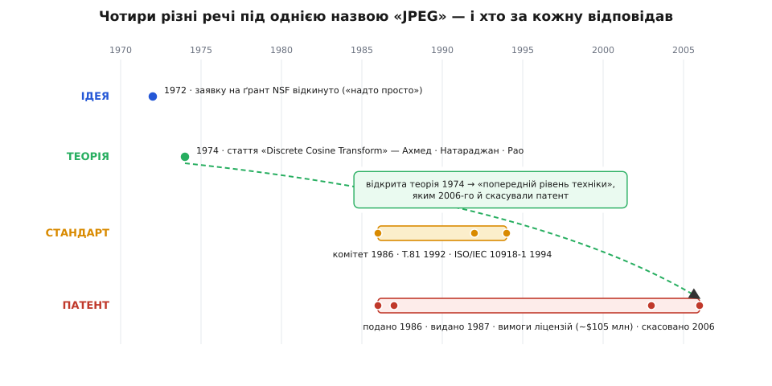

# 📜 Народження JPEG: ідея, теорія, стандарт, патент

Формат, у якому лежить майже кожна фотографія світу, народжувався чотири рази — і щоразу по-іншому. Спершу була **ідея**, якій відмовили в науковому ґранті. Потім — **теорія**, що довела ідею й дала їй швидкий алгоритм. Тоді — **стандарт**, себто угода комітету, який нічого не винайшов, а лише склеїв готові шматки в одне ціле. І нарешті — **патент**, яким одна компанія мало не обклала даниною півсвіту. Ці чотири речі раз у раз плутають, кажучи «JPEG винайшли тоді-то». Плутанина не безневинна: саме на ній хтось заробив близько $105 мільйонів. Тож розчепимо їх по черзі — бо історія формату і є історія того, чим ідея відрізняється від патенту.

*Одна назва «JPEG» накриває чотири різні речі з різними авторами. Відкриті ідея й теорія (1972–1974) лягають в основу стандарту (1986–1994) — і вони ж, лишившись у вільному доступі, стають «попереднім рівнем техніки», яким 2006 року скасують патент, поданий того самого 1986-го.*

## Ідея: перетворення, якому відмовили в ґранті

Щоб стиснути зображення, потрібне перетворення, яке **збирає** майже всю «суть» блока пікселів у кілька чисел, а решту лишає крихітною. Математики знали ідеально таке перетворення — [метод головних компонент](topic:sf-ml/pca) (він же перетворення Карунена–Лоева, англ. *Karhunen–Loève transform*): він розкладає сигнал по осях його власної статистики й декорелює його оптимально, краще за будь-яке інше. Одна біда — він **непрактичний**: у нього немає швидкого алгоритму, і він **залежить від конкретного зображення** (осі треба щоразу рахувати з коваріації саме цієї картинки та ще й передавати їх у файл). Оптимально, але задорого.

**Насір Ахмед** (Nasir Ahmed, нар. 1940 у Бангалорі, нині Бенгалуру) — індійсько-американський інженер, який працював у Канзаському державному університеті, — поставив питання інакше: а що, коли взяти одне **наперед задане** перетворення, те саме для всіх зображень, яке лише **близько підходить** до ідеального для тих сигналів, якими є фотографії (сусідні пікселі майже однакові)? Він припустив, що для цього годяться **косинуси**. 1972 року Ахмед подав цю думку на ґрант Національного наукового фонду США (NSF) — і дістав **відмову**: за його власним спогадом, одному рецензентові ідея видалася «надто простою». Це була ще **тільки ідея** — здогад, не доведення.

## Теорія: чому переміг саме косинус

Ідею врятувало те, що Ахмед не кинув її після відмови. Разом зі своїм аспірантом **Т. Натараджаном** (T. Natarajan) і колегою **К. Р. Рао** (K. R. Rao) він довів справу до робочого алгоритму й опублікував засадничу статтю: N. Ahmed, T. Natarajan, K. R. Rao, «Discrete Cosine Transform», *IEEE Transactions on Computers*, січень 1974 (т. 23, № 1, с. 90–93). Так на світ з'явилося **дискретне косинусне перетворення** (DCT).

Чому саме косинус, а не звичайне [перетворення Фур'є](topic:math-analysis/fourier-idea), що теж розкладає сигнал на частоти? Річ у тім, як кожне з них «домислює» блок за його краями. Фур'є трактує блок як **періодичний** — ніби за правим краєм одразу починається копія лівого. Якщо лівий і правий краї блока різні (а вони майже завжди різні), на стику виникає **стрибок**, різкий обрив — а різкий обрив це високі частоти. Косинус натомість «продовжує» блок **дзеркально**: за краєм іде віддзеркалення того самого блока. Дзеркало завжди сходиться з оригіналом на межі гладко, без стрибка, — і майже вся енергія збирається в **низьких** частотах, саме там, де її потім легко відкинути округленням.

Результат виявився майже казковим: за здатністю збирати енергію DCT підходить до **оптимального** методу головних компонент упритул — але, на відміну від нього, має **швидкий** алгоритм і не потребує рахувати нічого окремо для кожної картинки. Оце вже була не ідея, а **теорія**: доведена, опублікована, обчислювана. Саме вона стала двигуном, на якому за двадцять років закрутиться весь конвеєр JPEG. І — що виявиться вирішальним — вона лягла у **відкритий** доступ, у наукову статтю, яку міг прочитати будь-хто.

## Стандарт: комітет, що дав формату ім'я

Сама лишень теорія — ще не формат. Щоб мільйони пристроїв читали файли одне одного, потрібна **угода**, себто стандарт. Абревіатура **JPEG** — це і є назва комітету, який таку угоду уклав: **Joint Photographic Experts Group**, «спільна група експертів із фотографії». «Спільна» — бо її разом вели два органи: телекомунікаційний CCITT (нині ITU-T) і стандартизаційний ISO. Комітет зібрали **1986 року**.

Тут варто вловити тонкість: комітет **нічого не винайшов**. Ні DCT, ні квантування, ні [код Гаффмана](topic:math-information/huffman-coding) для фінального пакування — усе це вже існувало. Комітет зробив інше, не менш важливе: він **вибрав** із наявних цеглинок і **склеїв** їх в один точно описаний конвеєр, який кожен виробник реалізує однаково, — щоб знімок, збережений на одній камері, розгорнувся на будь-якому чужому екрані. Цінність стандарту не у винаході, а в **сумісності**. Текст ухвалили як Рекомендацію **ITU-T T.81** 18 вересня 1992 року; окремо його провели через ISO як **ISO/IEC 10918-1** у 1994-му. Тому «JPEG» — це передусім **комітет і його стандарт**, а не чийсь особистий винахід.

## Патент: як формат мало не поховали

А тепер найгостріше. Того **самого 1986 року**, коли збирали комітет, компанія Compression Labs подала до патентного відомства США заявку на «Coding system for reducing redundancy» — систему кодування, що прибирає надлишок, побудовану на тому ж таки DCT. Автори — **Вень-Сюн Чень** (Wen-Hsiung Chen) і **Деніел Кленке** (Daniel J. Klenke); патент US 4,698,672 видали 6 жовтня 1987-го. Тоді на нього ніхто не зважав.

Минуло півтора десятиліття. 1997 року патент разом із Compression Labs перейшов до компанії **Forgent Networks**, і десь від 2002-го та почала стверджувати, що її патент накриває **весь** стандарт JPEG. Логіка проста й нахабна: раз кожен .jpg проходить через DCT, то кожен, хто зберігає JPEG, порушує патент — платіть. Близько тридцяти компаній відкупилися ліцензіями, і Forgent зібрала майже **$105 мільйонів**; у квітні 2004-го вона позвала до суду ще десятки фірм. Формат, який усі вважали вільним, раптом опинився під даниною.

Контрудар прийшов звідти, звідки й мав. Некомерційна Public Patent Foundation (PUBPAT) у лютому 2006-го зажадала **перегляду** патенту, вказавши на очевидне: галузь стиснення зображень **відкрито публікувалася** більш ніж за десять років до заявки 1986 року — від тієї-таки статті Ахмеда 1974-го й далі. Іншими словами, патент намагався обгородити землю, яка давно була **спільною**. 26 травня 2006-го патентне відомство визнало ключові претензії патенту **недійсними** через цей **попередній рівень техніки** (англ. *prior art*) — та ще й зауважило, що про нього у Forgent знали, але змовчали. У листопаді 2006-го Forgent згорнула всі позови; сам патент того ж року й так добіг двадцятирічного кінця (заявку подано 27 жовтня 1986-го).

Ось де чотири слова заголовка сходяться в одну думку. Патент — єдиний із чотирьох, хто намагався зробити знання **приватним** і платним. І повалило його саме те, що ідея й теорія свого часу лишилися **відкритими**: опублікований 1974 року доказ став тим «попереднім рівнем техніки», об який через тридцять із гаком років розбилася спроба взяти з усіх плату. Формат, у якому ти щодня зберігаєш фото, безкоштовний не випадково — його серце було **віддане** у науковій статті, а не продане.
