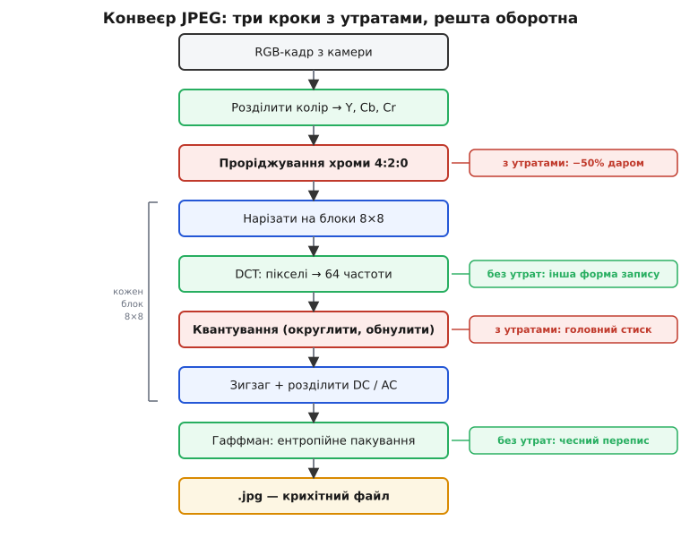
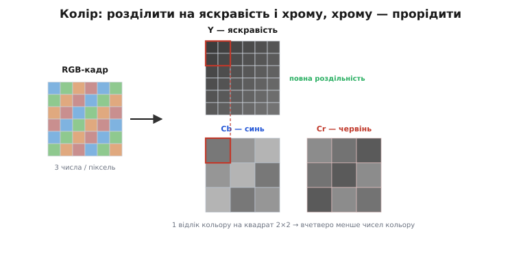
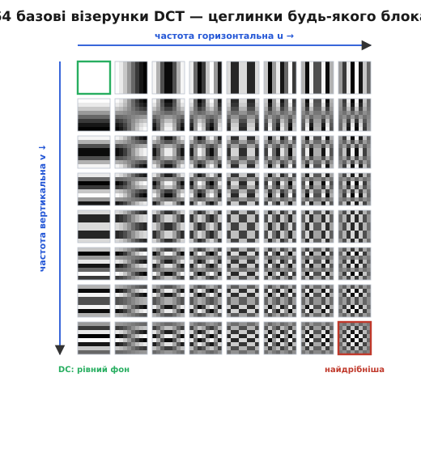
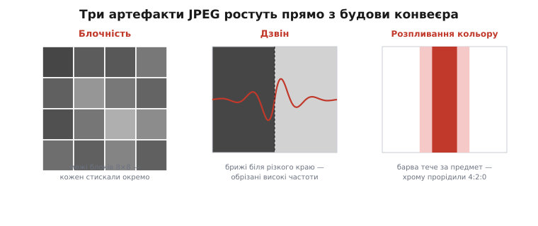

# JPEG: стиснення зображення з утратами

<preknowlist>
- [Ідея Фур'є](root:math-analysis/fourier-idea) — будь-який сигнал розкладається на суму хвиль різної частоти: повільні хвилі несуть плавне, швидкі — дрібні деталі.
- [Зображення як дані](root:sf-visual/image-as-data) — кадр це сітка пікселів, кожен зі своїми числами яскравості й кольору.
- [Код Гаффмана](root:math-information/huffman-coding) — найкоротший посимвольний префіксний код; ним пакують фінальний крок JPEG.
- [Ентропія](root:math-information/entropy) — скільки бітів щонайменше несе символ; межа, нижче якої без утрат не стиснути.
</preknowlist>

Фотографія з телефона — це мільйони пікселів, і кожен несе свої числа яскравості та кольору. Сирими, піксель за пікселем, дванадцятимегапіксельний кадр важить близько 36 мегабайтів. Той самий кадр у форматі **JPEG** (за назвою комітету *Joint Photographic Experts Group* — «об'єднана група експертів з фотографії») важить два-три мегабайти, а часто й менше — удесятеро-двадцятеро менший, і око різниці майже не бачить. Звідки такий виграш і чому саме він майже безкоштовний для ока?

Бо у звичайній фотографії ховається величезний **надлишок** — дані, які нічого нового не додають. Він двоякий. По-перше, сусідні пікселі майже однакові: небо, стіна, щока — це великі гладкі плями, де точка ледь відрізняється від сусідки, тож зберігати кожну повністю й окремо — марнотратство. Це **просторовий надлишок** (лат. *spatium* — простір). По-друге, саме око — недосконалий вимірювач: воно тонко розрізняє яскравість, але грубо — відтінок кольору, і зовсім не помічає слабких дрібних деталей на тлі сильних. Отже, частину інформації можна викинути **зовсім**, і глядач цього не зауважить — це **перцептивний надлишок** (лат. *perceptio* — сприйняття).

JPEG вичавлює обидва, працюючи з **одним** зображенням, не озираючись на інші кадри (тому кажуть **intra-frame**, лат. *intra* — всередині, «у межах кадру»; так само кодують окремі опорні кадри у відео). Весь фокус у тому, щоб перевести картинку у форму, де надлишок стає **видимим і відокремленим** — і тоді його легко відрізати. Конвеєр JPEG — це послідовність перетворень рівно з цією метою; розберімо кожне до дна. Народився цей формат наприкінці 1980-х у міжнародному комітеті, а перетворення в його серці — ще раніше; як усе було й крізь яку патентну бурю формат пройшов, оповідає [історія JPEG](root:com-signal/jpeg-intra/hist-jpeg.md).


*Повний конвеєр JPEG. Спершу колір розділяють на яскравість і дві хроми та проріджують хрому (око її не помічає). Далі кожну площину ріжуть на блоки 8×8 і кожен незалежно проводять крізь DCT (пікселі → частоти), квантування (єдина втрата — грубе округлення), зигзаг (нулі в хвіст), окреме кодування DC і AC та фінальне ентропійне пакування Гаффманом. Три кроки з утратами — проріджування хроми й квантування; решта оборотна.*

## Колір: відокремити яскравість від барви

Камера віддає картинку в **RGB** — три числа на піксель: скільки червоного, зеленого, синього. Для стиснення це незручно з двох причин. Перша: три канали сильно **корельовані** — там, де яскраво, зазвичай великі всі три, тож вони втричі повторюють ту саму інформацію про світло. Друга, важливіша: у RGB немає окремого числа «яскравість», а саме до яскравості око чутливе найбільше — і немає за що вхопитися, щоб зекономити на тому, чого око не бачить.

Тому першим кроком RGB переводять у простір **YCbCr**: одне число яскравості (люма, від англ. *luminance*) Y і два числа кольоровості (хрома, від гр. *chrōma* — колір) Cb, Cr, що кажуть, наскільки піксель відхилений у синь та в червінь. Перетворення лінійне й **оборотне** — це просто інший запис тих самих трьох чисел:

```
Y  =  0.299·R + 0.587·G + 0.114·B
Cb = −0.169·R − 0.331·G + 0.500·B + 128
Cr =  0.500·R − 0.419·G − 0.081·B + 128
```

Коефіцієнти при Y невипадкові: зелений око бачить найяскравіше, синій — найтьмяніше, тому їхні ваги такі різні. Тепер уся «сила світла» зібрана в Y, а колір — окремо в Cb та Cr. Це саме по собі ще нічого не стискає, але **готує ґрунт**: тепер яскравість і барву можна обробляти по-різному, як вони того й заслуговують. Докладніше про різні способи описати колір — у статті [кольорові простори](root:ph-waves/color-spaces): там, чому таких перетворень багато й що кожне підкреслює.

Виграш приходить одразу за розділенням. Око має вдесятеро менше рецепторів кольору, ніж яскравості, тож дрібних барвистих деталей воно просто не розрізняє. Отже, площини Cb та Cr можна взяти **з меншою роздільністю** — усереднити колір по квадратиках 2×2 і зберігати вчетверо менше чисел кольору, лишивши яскравість повною. Це **проріджування хроми** (англ. *chroma subsampling*); запис «4:2:0» означає саме «на кожні чотири піксели яскравості — по одному відліку кожної хроми». Даром зникає половина всіх даних кадру, а картинка на око та сама. Як саме пікселі й проріджені площини лежать у пам'яті — у статті [формати пікселів](root:sf-visual/pixel-formats).


*Розділення кольору. RGB переходить у яскравість Y (повна роздільність) і дві хроми Cb, Cr. Оскільки око бачить колір грубо, хрому проріджують: у схемі 4:2:0 один відлік кольору покриває квадрат 2×2 пікселів яскравості. Половина даних кадру зникає ще до головного стиснення, і глядач цього не помічає.*

Далі кожну з трьох площин — Y, Cb, Cr — обробляють **однаково й незалежно**, тим самим конвеєром. Тому надалі говоритимемо про одну площину чисел яскравості; з хромою роблять те саме.

## Блоки й перехід до частот

Площину ріжуть на **квадратики 8×8 пікселів** — блоки — і кожен обробляють **окремо**. Чому не весь кадр разом і чому саме вісім? Бо надлишок — локальний: сусідні пікселі схожі, а от протилежні кути кадру між собою не пов'язані ніяк. Малий блок якраз накриває пляму, всередині якої пікселі однорідні, і водночас лишається достатньо великим, щоб у ньому було що аналізувати. Вісім — компроміс: більший блок дав би кращий стиск на гладких місцях, але помітніші «сходинки» на межах і важчі обчислення; 8×8 прижилося як золота середина.

Тепер головна ідея, заради якої все затівалося. Блок 8×8 — це 64 числа яскравості. Але дивитися на них як на 64 **окремі** значення — значить не бачити їхньої схожості. А що, як описати той самий блок **інакше** — не «яскравість у кожній точці», а «скільки в блоці плавного фону, скільки повільної хвилі, скільки дрібної ряботіні»? Це і є [ідея Фур'є](root:math-analysis/fourier-idea), прикладена до картинки: будь-який блок можна точно скласти із **суми простих візерунків-хвиль** різної частоти. Повільні хвилі (низькі частоти) малюють плавний перепад яскравості через увесь блок; швидкі (високі частоти) — дрібну текстуру, шум, різкі краї.

JPEG бере фіксований набір **64 базових візерунків** 8×8 — «цеглинок», з яких можна скласти **будь-який** блок. Кожна цеглинка — це добуток двох косинусних хвиль: одна біжить по горизонталі, друга по вертикалі, з наростанням частоти. Ліва-верхня цеглинка — рівна сірість (нульова частота, «постійна складова»), права-нижня — найдрібніша шахова ряботінь.


*64 базові візерунки DCT. Будь-який блок 8×8 — це зважена сума цих цеглинок. Угорі-ліворуч — рівний фон (нульова частота); праворуч частота росте по горизонталі, вниз — по вертикалі; правий-нижній кут — найдрібніша шахова ряботінь. DCT саме й каже, з якою вагою кожна цеглинка входить у блок.*

**Дискретне косинусне перетворення** (англ. *discrete cosine transform*, DCT) — це і є операція «розкласти блок на цеглинки»: вона бере 64 пікселі й видає 64 **коефіцієнти**, по одному на кожен візерунок, — вагу, з якою той візерунок входить у блок. Це заміна системи координат: ті самі дані, лише описані не «значеннями в точках», а «внесками частот». Формула прямого 2D-DCT для блока f(x,y):

```
F(u,v) = ¼ · C(u)·C(v) · Σ  Σ  f(x,y)·cos[(2x+1)·u·π/16]·cos[(2y+1)·v·π/16]
                        x=0..7 y=0..7
         де C(0) = 1/√2,   C(k) = 1 для k > 0
```

Індекси u,v — це «номер частоти» по горизонталі та вертикалі; чим вони більші, тим дрібніший візерунок. Перетворення **без утрат**: за 64 коефіцієнтами зворотне DCT точно відновлює всі 64 пікселі. Чому саме косинуси, а не повне Фур'є з синусами й уявними числами, і чому це дає **краще** зосередження енергії — розписано в математичній вставці [чому DCT і як він зосереджує енергію](root:com-signal/jpeg-intra/math-dct.md); коротко — косинус із півкроковим зсувом дає дзеркальне продовження блока без штучного стрибка на межі, тож уся «суть» стікає в кілька низькочастотних коефіцієнтів, а коефіцієнти — дійсні, без фази.

Тут і криється причина, чому перехід до частот узагалі корисний. У гладкому блоці (небо, щока) **майже вся** енергія збирається в кількох низькочастотних коефіцієнтах ліворуч-угорі, а високочастотні — крихітні або нульові. Це зветься **зосередженням енергії** (англ. *energy compaction*). Пікселі були всі приблизно рівнозначні — а коефіцієнти вже ні: кілька важать багато, решта — майже нічого. Надлишок став **видимим**: ось ці великі числа несуть картинку, а ось ця купа дрібних — майже нічого. Лишилося їх відрізати.

## Квантування: єдина справжня втрата

DCT нічого не викинув — він лише переставив інформацію так, щоб непотрібне впадало в око. Викидає **квантування** (лат. *quantum* — «скільки, яка кількість») — і саме воно робить усю роботу стиснення й дає всю втрату якості.

Ідея проста до зухвалості: кожен коефіцієнт **ділять** на своє число з **таблиці квантування** 8×8 і **округлюють** до цілого. Дрібні коефіцієнти після ділення на велике число обертаються на **нуль** — і зникають. А таблицю підбирають так, щоб **високі** частоти ділити на **великі** числа. Це прямий переклад того, що око не бачить дрібних деталей: раз їх не видно, їх можна огрубити найдужче. Ось стандартна таблиця для яскравості (з додатка K стандарту, приблизно «середня якість»):

```
16  11  10  16  24  40  51  61
12  12  14  19  26  58  60  55
14  13  16  24  40  57  69  56
14  17  22  29  51  87  80  62
18  22  37  56  68 109 103  77
24  35  55  64  81 104 113  92
49  64  78  87 103 121 120 101
72  92  95  98 112 100 103  99
```

Ліворуч-угорі (низькі частоти, куди DCT зібрав головне) дільники малі — 16, 11, 10, — тож ці коефіцієнти зберігаються майже точно. Праворуч-унизу (найдрібніша ряботінь) дільники за сотню — і ці коефіцієнти майже гарантовано стануть нулями. Для хроми таблиця ще грубіша, бо колір око пробачає легше.

Погляньмо, як це працює на справжньому блоці.

**Блок 8×8, який містить різкий світлий перепад (числа яскравості 0…255):**

```
52  55  61  66  70  61  64  73
63  59  55  90 109  85  69  72
62  59  68 113 144 104  66  73
63  58  71 122 154 106  70  69
67  61  68 104 126  88  68  70
79  65  60  70  77  68  58  75
85  71  64  59  55  61  65  83
87  79  69  68  65  76  78  94
```

Спершу від кожного пікселя віднімають 128 (зсув рівня — щоб числа стали приблизно симетричні навколо нуля, від −128 до 127; так DCT працює з відхиленнями, а не з великими додатними значеннями). Потім — пряме DCT. Ось що воно видає (округлено):

```
-415  -30  -61   27   56  -20   -2    0
   4  -22  -61   10   13   -7   -9    5
 -47    7   77  -25  -29   10    5   -6
 -49   12   34  -15  -10    6    2    2
  12   -7  -13   -4   -2    2   -3    3
  -8    3    2   -6   -2    1    4    2
  -1    0    0   -2   -1   -3    4   -1
   0    0   -1   -4   -1    0    0    2
```

Подивіться на розкид: ліворуч-угорі число −415 (це «постійна складова» — середня яскравість блока, помножена на 8), поряд ще кілька десятків, а до правого-нижнього кута все спадає до одиниць і нулів. Оце й є зосередження енергії — DCT стягнув майже все в лівий-верхній кут. Тепер ділимо кожен коефіцієнт на відповідне число таблиці й округлюємо:

```
-26   -3   -6    2    2   -1    0    0
  0   -2   -4    1    1    0    0    0
 -3    1    5   -1   -1    0    0    0
 -3    1    2   -1    0    0    0    0
  1    0    0    0    0    0    0    0
  0    0    0    0    0    0    0    0
  0    0    0    0    0    0    0    0
  0    0    0    0    0    0    0    0
```

**Було 64 ненульові числа — лишилося 20, а 44 стали нулями.** Уся права-нижня половина блока — суцільні нулі. І зберігати їх, як побачимо, коштуватиме копійки. Ось де стиснення: не в хитрому пакуванні, а в тому, що більшість чисел просто **зникла** — і зникла та, якої око не бачить.

Тут-таки сидить і **ручка якості**. Помножте всю таблицю на два — дільники стануть удвічі більші, нулів побільшає, файл схудне, але картинка огрубіє. Поділіть таблицю навпіл — навпаки. Те, що ви крутите повзунком «якість 90 / 50 / 10» у редакторі, — це і є **масштаб таблиці квантування**. Стандартна формула: для якості Q береться множник S = 5000/Q при Q < 50 і S = 200 − 2·Q при Q ≥ 50, після чого кожне число таблиці масштабують на S/100. Порахуймо, у що це виливається для двох кутів таблиці — низькочастотного (дільник 16) і найвисокочастотного (дільник 99):

```
Якість 90:  S = 20%   → дільники стають  3  і  20   (тонко: майже все зберігається)
Якість 50:  S = 100%  → дільники       16  і  99   (стандарт)
Якість 10:  S = 500%  → дільники       80  і 255   (грубо: виживають лічені коефіцієнти)
```

За якості 10 навіть низькі частоти діляться на 80 — від блока лишається кілька чисел, і саме тому сильно стиснений JPEG розсипається на плями. І це **єдина** точка всього конвеєра, де JPEG **безповоротно губить** інформацію: округлення не відкотити, поділене й забуте не повернути. Усі інші кроки — і DCT до цього, і пакування після — оборотні дощенту.

> 🔧 **Навіщо це.** «Якість» у налаштуваннях камери, скриншотера чи відеокодера — це прямо масштаб таблиці квантування. Тиснеш сильніше (нижча якість) — менший файл і менша затримка передачі, але грубіша картинка. Для архівного фото став якість високо; для прев'ю в стрічці чи для відео у вузькому радіоканалі — низько, аби потік уліз; а якщо картинку далі аналізуватиме [машинне бачення](root:sf-visual/object-detection) — стережися перетиску, бо артефакти квантування збивають детектори фальшивими краями. Взаємозв'язок стиску, якості й ширини каналу докладніше — у статті [якість і бітрейт](root:com-signal/quality-bitrate).

## Зигзаг і розділення DC та AC

Після квантування блок має характерний вигляд: жменя ненульових чисел тулиться в лівому-верхньому куті, решта — нулі. Треба записати це якнайкоротше. Наївний обхід рядками чергував би числа з нулями й дробив би нулі на короткі уривки. А хочеться зібрати всі нулі в **один довгий безперервний хвіст** — його тоді можна закодувати однією позначкою «далі все нулі».

Саме це робить **зигзаг** — обхід блока по діагоналях, від лівого-верхнього кута до правого-нижнього:

```
 0 → 1   5 → 6  14 →15  27
   ↙   ↗   ↙   ↗   ↙   ↗
 2   4   7  13  16  26  28  42
 ↓ ↗ ↙ ...
```

Він іде **від низьких частот до високих**, тобто від імовірно-ненульових коефіцієнтів до імовірно-нульових. Тому всі нулі природно вишиковуються в кінець. Проженемо наш квантований блок зигзагом — і 64 числа перетворюються на послідовність:

```
-26, -3, 0, -3, -2, -6, 2, -4, 1, -3, 1, 1, 5, 1, 2, -1, 1, -1, 2, потім суцільні нулі до кінця
```

Останнє ненульове число стоїть на 26-й позиції — а всі 38 позицій після нього нульові. Замість перелічувати ці 38 нулів кодер поставить одну позначку **кінця блока** (англ. *end of block*, EOB): «далі до кінця нулі». Тридцять вісім чисел зникли в одному символі.

Перше число послідовності — коефіцієнт нульової частоти, його звуть **DC** (від англ. *direct current* — постійний струм, за аналогією з електрикою: складова, що не коливається). Він дорівнює середній яскравості блока. Решта 63 — це **AC** (*alternating current* — змінний струм), коливні складові. DC і AC кодують **по-різному**, і на те є вагома причина.

DC — це середня яскравість блока, велике число. Але сусідні блоки в зображенні майже завжди схожі за середньою яскравістю: небо в сусідніх квадратиках однаково світле. Тож зберігати повний DC кожного блока — знову марнотратство. Замість цього зберігають **різницю** DC поточного блока й DC попереднього: DIFFᵢ = DCᵢ − DCᵢ₋₁. Різниці малі й купчаться біля нуля, а малі числа кодуються коротше. Це **різницеве кодування** (англ. *DPCM, differential pulse-code modulation*): передавати не значення, а зміну. По суті це той самий здогад, що й у [міжкадровому стисненні](root:com-signal/inter-frame), тільки між сусідніми блоками, а не кадрами.

AC-коефіцієнти кодують парами **(довжина серії нулів, розмір)**: скільки нулів стоїть перед черговим ненульовим числом і скільки бітів займе саме число. Це поєднання [кодування довжин серій](root:sf-algorithms/rle) (для нулів між числами) з компактним записом самого числа. Довгі прогони нулів усередині блока злітають майже задарма, а на кінець ставиться EOB.

## Ентропійне пакування: останній чесний тиск

Дотепер ми **прорідили** дані — зробили так, що чисел лишилося мало й вони дрібні. Але записані вони ще марнотратно: кожне число, кожна пара «серія-розмір» — це символ, і різні символи трапляються з дуже різною частотою (нулів і малих чисел — сила-силенна, великих — одиниці). А коли частоти нерівні, звичайний запис фіксованої довжини бере на кожен символ більше бітів, ніж той несе насправді. Різницю між «скільки бітів витрачаємо» і «скільки біт інформації насправді в символі» задає [ентропія](root:math-information/entropy) — і саме цю різницю вичавлює останній крок.

Пари «серія-розмір» і величини DC-різниць проганяють через [код Гаффмана](root:math-information/huffman-coding): частим символам він дає короткі бітові коди, рідкісним — довгі, і в підсумку витрачає на кожен символ близько стількох бітів, скільки той справді несе. Це **без утрат** — оборотний перепис. Історія цього коду сама по собі гарна: 1951 року студент MIT **Девід Гаффман**, щоб не складати іспит, за пропозицією професора взявся знайти найкоротший можливий код — і, будуючи дерево від найрідших символів угору, знайшов оптимальний, кращий за той, що мали Шеннон із Фано. Опублікований 1952-го, він і досі пакує фінальний крок JPEG, ZIP і MP3.

> 🔧 **Навіщо це.** Гаффман тут дотискає вже проріджені дані — це «безкоштовний» верхній шар без утрати якості. Ще щільніше вміє **арифметичне кодування**, не прив'язане до цілого числа бітів на символ; стандарт JPEG його дозволяє (варіант дає на 5–10% менший файл), але роками його обходили через патенти, тож у справжніх файлах панує Гаффман. Докладніше — [арифметичне кодування](root:math-information/arithmetic-coding).

На цьому конвеєр завершено. Стисло весь ланцюг: **колір розділили** (Y/Cb/Cr) → **хрому прорідили** (−50% даром) → нарізали на **блоки 8×8** → **DCT** переклав пікселі в частоти (зосередив енергію) → **квантування** огрубило й обнулило те, чого око не бачить (тут уся втрата й головний стиск) → **зигзаг** зібрав нулі в хвіст → **DC** закодували різницею, **AC** — парами «серія-розмір» → **Гаффман** дотиснув без утрат. Три різні надлишки — між сусідніми пікселями (DCT + квантування), між сусідніми блоками (DC-різниця) і статистичний (Гаффман) — кожен вирізаний своїм інструментом.

Щоб побачити всі ці кроки як робочий код — від зсуву рівня й DCT до квантування, зигзагу та кодування пар, — є розбір [кодера одного блока JPEG](root:com-signal/jpeg-intra/proj-jpeg-encode.md) мовою C: там числа течуть крізь конвеєр на власні очі.

## Як це лежить у файлі та як розкодовується

Готовий `.jpg` — це не суцільний потік бітів, а низка **сегментів**, кожен зі своїм маркером-заголовком (два байти, що починаються на 0xFF). Декодеру треба знати, за якою таблицею квантування ділили й за яким кодом Гаффмана пакували, — тож ці таблиці **лежать у самому файлі**, попереду стиснутих даних: сегмент DQT несе таблиці квантування, DHT — таблиці Гаффмана, SOF описує розміри й проріджування, а SOS відкриває власне стиснутий потік. Повний перелік маркерів і будову сегментів зібрано в довідці [маркери й будова JPEG-файлу](root:com-signal/jpeg-intra/api-markers.md).

Розкодування — це весь конвеєр **навпаки**, крок за кроком: ентропійний декодер за таблицями Гаффмана відновлює пари й числа → їх розкладають назад у блок 8×8 у зигзаг-порядку → **деквантування** множить кожен коефіцієнт назад на число таблиці → зворотне DCT (IDCT) перетворює частоти назад на 64 пікселі → площини Cb, Cr **добудовують** до повної роздільності (інтерполяцією) → YCbCr переводять назад у RGB. Тут важливо бачити межу оборотності: деквантування множить назад, але **округлення вже сталося** — помножити 0 на 16 дасть 0, а не втрачений коефіцієнт. Тому декодер відновлює не оригінал, а його огрублену версію; усе, що квантування стерло, пропало назавжди. Решта кроків повертають усе точно.

## Прогресивний варіант

Описаний порядок — коли блоки йдуть один за одним, кожен повністю, — зветься **базовим** (англ. *baseline*). Є й інший — **прогресивний** (англ. *progressive*): ті самі коефіцієнти передають кількома проходами. Перший прохід несе лише DC та кілька найнижчих частот усіх блоків — виходить розмита, але повна картинка одразу; кожен наступний прохід додає вищі частоти й уточнює. Через це прогресивний JPEG на повільному з'єднанні «проявляється»: спершу мутний весь кадр, потім різкішає. Даних стільки ж — інший лише порядок їх викладення; корисно, коли картинку видно ще до повного завантаження.

## Ціна: артефакти

За стиск платиться, і що грубіше квантування — то помітніша плата. Артефакти (від лат. *arte factum* — «зроблене штучно») JPEG упізнавані, бо ростуть прямо з будови конвеєра.

**Блочність.** Кожен квадратик 8×8 квантували **окремо**, нічого не знаючи про сусідів. За сильного стиску середні яскравості сусідніх блоків округляться по-різному — і на межах блоків виникають видимі **сходинки**. Картинка розпадається на ту саму сітку 8×8, у якій її обробляли. Це фірмовий підпис JPEG: побачив на пересланому мемі квадратну «решітку» — знай, його передавили.

**Дзвін** (англ. *ringing* — «дзвеніння»). Біля різкого контуру — межа тексту, гілка на тлі неба — з'являються слабкі хвильки-відлуння, наче брижі. Різкий перепад яскравості — це високі частоти; квантування їх грубо обрізало, а обрізаний різкий край, складений назад із небагатьох частот, дає коливання обабіч себе. Це той самий ефект Ґіббса, що й у будь-якому усіченні спектра.

**Розпливання кольору.** Оскільки хрому прорідили (4:2:0), колір «тече» за межі свого предмета — червона літера на білому тлі дає рожевий ореол. Яскравість чітка, а барва розмазана на квадрат 2×2.


*Три артефакти JPEG. Блочність — межі квадратів 8×8, бо кожен стискали окремо. Дзвін — брижі біля різких контурів, бо квантування обрізало високі частоти. Розпливання кольору — барва тече за предмет через проріджування хроми. Для машинного бачення все троє небезпечне: детектор бачить краї й кольори, яких у сцені немає.*

Для ока за нормальної якості цього не видно. А от для [машинного бачення](root:sf-visual/object-detection) артефакти — справжня халепа: блочність і дзвін творять фальшиві «краї», яких у сцені нема, а розпливання кольору збиває порогування за відтінком. Тому дані для аналізу тримають у високій якості або без утрат зовсім.

Усе це вичавило лише надлишок **усередині одного кадру** — схожість пікселів, блоків і статистику символів. Відео ховає ще один, багатший запас: сусідні **кадри** майже однакові між собою, бо за соту частку секунди світ ледь змінюється. На ньому будується [міжкадрове стиснення](root:com-signal/inter-frame), що додає ще десятки разів понад те, чого досяг JPEG у межах однієї картинки.
