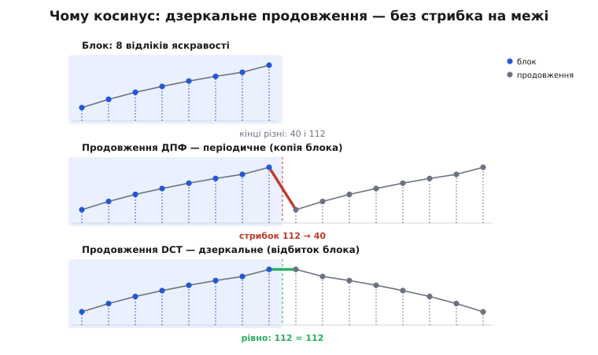
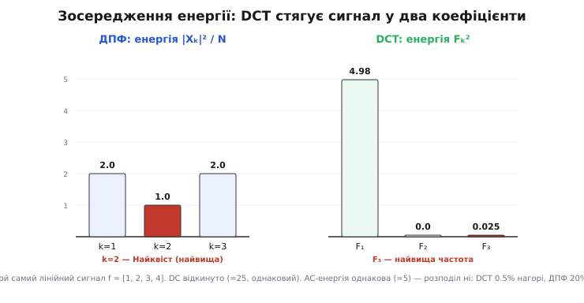

# 🧮 Математика DCT: чому косинуси зосереджують енергію

Це — алгебра й геометрія перетворення, що стоїть у серці JPEG: як 64 пікселі блока 8×8 стають 64 коефіцієнтами, чому це перетворення точно оборотне й зберігає енергію, і чому саме косинус (а не повне Фур'є) стягує майже всю «суть» гладкого блока в кілька чисел. Усе випливе з однієї властивості базису — ортонормальності; з неї ж — і оборотність, і збереження енергії, і близькість до найкращого можливого перетворення.

## Одновимірний DCT: базис і нормування

Двовимірний DCT розкладається на два однакові одновимірні (це доведемо нижче), тож почнімо з одного виміру. Дано N відліків f(0),…,f(N−1) — для JPEG N=8. **Дискретне косинусне перетворення другого роду** (DCT-II) означує N коефіцієнтів:

```
F(u) = α(u) · Σ  f(x)·cos[(2x+1)·u·π / (2N)],     x = 0..N−1,  u = 0..N−1
              x
де  α(0) = √(1/N),   α(u) = √(2/N)  для u > 0
```

Кожен коефіцієнт F(u) — це проєкція сигналу на одну **базисну хвилю**:

```
φᵤ(x) = α(u)·cos[(2x+1)·u·π / (2N)]
```

Хвиля номер u вкладає рівно u півперіодів косинуса в проміжок блока: φ₀ — стала (нульова частота), φ₁ — половина косинусної хвилі, φ₇ — найдрібніша ряботінь. Множники α(u) поки виглядають довільними; за мить побачимо, що вони — єдиний вибір, за якого базис виходить ортонормальним.

Формула JPEG для двовимірного випадку записана трохи інакше — з ¼ спереду й C(0)=1/√2 замість α — але це те саме число. Для N=8 маємо α(0)=√(1/8)=1/(2√2) і α(u)=√(2/8)=½. Винесімо спільне ½ з кожного виміру: пишемо α(u)=½·C(u), де C(0)=1/√2 дає ½·1/√2=1/(2√2)=α(0), а C(u)=1 дає ½=α(u). Два виміри перемножують ці множники: (½·C(u))·(½·C(v)) = ¼·C(u)·C(v). Ось звідки «¼·C(u)·C(v)» у стандарті — це просто α(u)·α(v), розписане так, щоб спільний ½ стояв попереду.

## Ортонормальність: одне доведення, з якого все випливає

Уся сила DCT тримається на одному факті: базисні хвилі φ₀,…,φ_{N−1} **взаємно ортогональні й одиничної довжини**. Доведімо його — а нормувальні множники α(u) випадуть самі.

Скалярний добуток двох хвиль — це сума добутків косинусів. Розкриваємо добуток тотожністю cos A·cos B = ½[cos(A−B) + cos(A+B)]:

```
Σ φᵤ(x)·φᵥ(x) = α(u)·α(v)·½ · Σ { cos[(2x+1)(u−v)π/(2N)] + cos[(2x+1)(u+v)π/(2N)] }
 x                              x
```

Усе звелося до однієї суми — суми косинусів на непарних кроках. Порахуймо її для довільного цілого m:

```
S(m) = Σ cos[(2x+1)·m·π / (2N)],     x = 0..N−1
        x
```

Це геометрична прогресія в комплексній формі: cos θ = Re e^{iθ}, а Σ e^{i(2x+1)θ} — сума геометричного ряду зі знаменником e^{i2θ}. Згорнувши її й узявши дійсну частину, дістаємо напрочуд просту відповідь:

```
S(m) = sin(m·π) / [ 2·sin(m·π / (2N)) ]
```

Для будь-якого цілого m чисельник sin(mπ)=0. Отже S(m)=0 — **за винятком** випадку, коли й знаменник нуль, тобто коли m кратне 2N (тоді вираз 0/0, а пряма сума дає S=N). У межах наших індексів це просто:

```
S(0) = N;      S(m) = 0  для будь-якого цілого m ≠ 0 з |m| < 2N
```

Тепер підставмо. Індекси u,v лежать у 0..N−1, тож і u−v, і u+v за модулем менші за 2N.

- **u ≠ v.** Тоді u−v ≠ 0 і u+v ≠ 0, обидва в дозволеному діапазоні → S(u−v)=S(u+v)=0 → скалярний добуток нуль. Хвилі **ортогональні**.
- **u = v ≠ 0.** Перший доданок cos(0)=1 дає Σ1=N; другий — це S(2u)=0 (бо 0<2u<2N). Разом ½·N. Помножено на α(u)²=2/N — рівно **1**.
- **u = v = 0.** Обидва доданки — по N; ½·2N=N, помножено на α(0)²=1/N — знову **1**.

Ось звідки взялися α(u): це єдиний масштаб, за якого довжина кожної хвилі точно одинична. Базис ортонормальний. Склавши хвилі рядками матриці C (Cᵤₓ=α(u)·cos[(2x+1)uπ/(2N)]), маємо це коротко:

```
C·Cᵀ = I      (рядки одиничні й попарно ортогональні)
```

Для N=4 матриця — з рівно порахованих косинусів:

```
        x=0      x=1      x=2      x=3
u=0  +0.5000  +0.5000  +0.5000  +0.5000
u=1  +0.6533  +0.2706  −0.2706  −0.6533
u=2  +0.5000  −0.5000  −0.5000  +0.5000
u=3  +0.2706  −0.6533  +0.6533  −0.2706
```

Перевірмо руками рядок 1 сам на себе: 0.6533² + 0.2706² + 0.2706² + 0.6533² = 2·(0.4268 + 0.0732) = 1.000. А рядок 0 на рядок 1: 0.5·(0.6533 + 0.2706 − 0.2706 − 0.6533) = 0. Так само зникають усі інші пари, тож C·Cᵀ=I.

Найважливіший наслідок ортонормальності: обернена матриця дорівнює транспонованій, C⁻¹=Cᵀ. Тому зворотне перетворення (синтез) — це просто

```
f = Cᵀ·F        (1D)
```

тими самими числами, без жодної втрати. DCT **оборотний точно**: 64 коефіцієнти несуть рівно стільки ж, скільки 64 пікселі, — це заміна системи координат, а не наближення.

## Роздільність: 2D — це рядки, потім стовпці

Двовимірний DCT блока f(x,y) означують так само, але з добутком двох косинусів — по горизонталі й по вертикалі:

```
F(u,v) = α(u)·α(v) · Σ Σ f(x,y)·cos[(2x+1)uπ/(2N)]·cos[(2y+1)vπ/(2N)]
                     x y
```

На вигляд це подвійна сума на кожен із N² коефіцієнтів — начебто велика робота. Але косинус по x не залежить від y, тож множники розчіплюються. Згрупуймо суму по y всередину:

```
F(u,v) = α(u) Σ cos[(2x+1)uπ/(2N)] · { α(v) Σ f(x,y)·cos[(2y+1)vπ/(2N)] }
              x                              y
                                          └────── 1D-DCT стовпця x ──────┘
```

Вираз у дужках — це одновимірний DCT одного стовпця блока. Отже 2D-DCT = **спершу 1D-DCT кожного стовпця, потім 1D-DCT кожного рядка отриманого** (порядок байдужий). У матричному записі, з тією самою матрицею C:

```
F = C · f · Cᵀ           (зворотне —  f = Cᵀ · F · C)
```

Ця роздільність — не лише охайність, а й швидкість. Полічімо множення для блока N×N:

```
навпростець (подвійна сума на кожен коеф.):    N² виходів × N² доданків  →  O(N⁴)
роздільно (2N проходів 1D-DCT, кожен O(N²)):   2N × N²                   →  O(N³)
швидкий 1D-DCT (O(N·log N) на прохід):          2N × N·log N             →  O(N²·log N)
```

Для 8×8 це грубо 4096 → 1024 → лічені сотні операцій. Звідки береться O(N·log N) на один прохід? Зі **спорідненості DCT із ДПФ**: N-точковий DCT можна порахувати через одне [дискретне перетворення Фур'є](root:com-signal/dft) (Дж. Махул, 1980, показав, що DCT-II дорівнює ДПФ від парного продовження сигналу), а ДПФ рахують швидким перетворенням Фур'є за N·log N. Ту саму косинусну суму, що ми згортали в доведенні, згортає й FFT — тому весь арсенал швидких алгоритмів Фур'є переноситься на DCT майже задарма.

## Збереження енергії: теорема Парсеваля

Оскільки C ортонормальна, перетворення зберігає **повну енергію** блока — суму квадратів. В одному вимірі це один рядок алгебри:

```
‖F‖² = Fᵀ·F = (C·f)ᵀ(C·f) = fᵀ·CᵀC·f = fᵀ·f = ‖f‖²        (бо CᵀC = I)
```

Для 2D — те саме через слід матриці (tr), користаючись циклічністю сліду й CᵀC=I:

```
‖F‖²_F = tr(FᵀF) = tr(C·fᵀCᵀ · C·f·Cᵀ) = tr(fᵀf · CᵀC) = tr(fᵀf) = ‖f‖²_F
```

Сума квадратів 64 коефіцієнтів дорівнює сумі квадратів 64 пікселів. Це [теорема Парсеваля](root:com-signal/parseval-theorem) для скінченного ортонормального базису: енергія не створюється й не зникає при зміні системи координат, лише перерозподіляється між осями. Перевіримо на лінійному сигналі f=[1,2,3,4]: ‖f‖²=1+4+9+16=30, а його DCT F=[5.00, −2.23, 0.00, −0.16] дає 25 + 4.97 + 0 + 0.03 = 30.0. Збіглося точно.

> 🔧 **Навіщо це.** Парсеваль перетворює квантування на кероване. Коли коефіцієнт F(u,v) округлюють і він зсувається на δ, реконструйований блок віддаляється від оригіналу рівно на δ² у сумі квадратів пікселів — бо зворотне DCT теж ортонормальне й переносить похибку без спотворення. Тому таблиця квантування — це прямий **бюджет спотворення по частотах**: огрубили частоту вдесятеро — знаєте наперед, скільки енергії похибки додасться в пікселях. Без ортонормальності похибка в коефіцієнтах і похибка в пікселях жили б різними життями, і квантувати «на око» було б неможливо.

## Чому косинус із півкроковим зсувом

Лишилося головне питання: чому косинус, а не повне Фур'є із синусами й уявними числами? Відповідь — у тому, як кожне перетворення **неявно продовжує** блок за його межі.

ДПФ трактує N відліків як один період нескінченно-**періодичного** сигналу: за останнім відліком одразу знову йде перший. Якщо кінці блока різні — а вони майже завжди різні, — на шві виникає **стрибок**. А стрибок дорого коштує в частотах: розрив розмазує енергію в увесь спектр аж до найвищих частот, спадаючи повільно (це той самий механізм, що дає [явище Гіббса](root:math-analysis/gibbs-phenomenon) й витік спектра). Саме те, чого стиск не хоче.

DCT продовжує блок інакше — **дзеркально**. Множник (2x+1) означає, що відліки сидять не в цілих точках 0,1,2,…, а в піврозмахових 0.5, 1.5, 2.5,…, і продовження — це відбиток блока в дзеркалі, поставленому на межі x=−½. Дзеркало **повторює** крайній відлік, а не перестрибує на протилежний кінець, тож на шві стрибка немає: значення переходить саме в себе. Неперервне продовження → спектр спадає швидко → енергія лишається на низьких частотах.


*Той самий блок із різними кінцями (40 і 112). ДПФ продовжує його періодично — на шві стрибок 112→40, і цей розрив живить високі частоти. DCT продовжує дзеркально — крайній відлік переходить сам у себе (112=112), продовження неперервне, і високих частот майже нема. У цьому вся різниця між синусно-косинусним Фур'є й чистим косинусом.*

Дзеркальне продовження **парне**, а перетворення Фур'є парної дійсної послідовності — **дійсне** (самі косинуси, без синусів). Формально: N-точковий DCT-II дорівнює ДПФ від 2N-точкового парного продовження блока (з точністю до дійсного повороту), а ДПФ дійсної парної послідовності не має уявної частини. Тому коефіцієнти DCT — **дійсні числа без фази**, тоді як коефіцієнти ДПФ комплексні: на кожну частоту припадає й амплітуда, і фаза. Для стиску це подвійний виграш — і чисел удвічі менше (нема окремої фази), і енергія стягнута донизу.

Побачмо це на числах. Візьмімо найпростіший неоднорідний блок — лінійний сигнал f=[1,2,3,4], що під періодичним продовженням дає стрибок 4→1. Порахуймо обидва перетворення:

**Лінійний сигнал f = [1, 2, 3, 4]: ДПФ проти DCT**

```
ДПФ:  X = [10,  −2+2i,  −2,  −2−2i]      |X| = [10.00, 2.83, 2.00, 2.83]   (комплексні!)
      енергія по бінах  |X|²/N = [25.0, 2.0, 1.0, 2.0]

DCT:  F = [5.00,  −2.23,  0.00,  −0.16]                                     (дійсні)
      енергія по коеф.  F²     = [25.0, 4.97, 0.0, 0.03]
```

Обидва зберігають повну енергію 30 (Парсеваль справджується для кожного). Але відкиньмо однакову для обох постійну складову (DC=25) і подивімося, як лягли **решта 5 одиниць** AC-енергії:

```
DCT:  4.97 у найнижчий AC-коеф. F₁,  а найвищий F₃ — лише 0.025   (0.5% від AC)
ДПФ:  розповзлась 2 / 1 / 2 по k=1,2,3,  з них ціла 1.0 у Найквіста  (20% від AC)
```


*AC-енергія однакова (5), а розподіл — ні. DCT кидає майже все в найнижчу частоту F₁, а на найвищу F₃ лишає 0.5%. ДПФ, «побачивши» стрибок на періодичному шві, розмазує енергію по всіх частотах, і 20% осідає аж на Найквісті (найвищій частоті, яку розрізняє сітка). Різниця — рівно в тому, що DCT продовжив сигнал без стрибка, а ДПФ — зі стрибком.*

Сорок разів менше енергії на верхній частоті — і саме її квантування викине майже без сліду для ока. Ось операційний зміст «косинус зосереджує енергію»: не гладкість формули, а відсутність штучного стрибка на межі блока.

## Зосередження енергії й оптимальний KLT

Досі ми показали, що DCT **уміє** стягувати енергію гладкого блока донизу. Лишилося довести, що це майже **найкраще**, що взагалі можливо. Для цього потрібна модель того, який сигнал стискаємо.

Рядок гладкого зображення добре описує **марковський процес першого порядку** (AR(1)): кожен піксель — це попередній, помножений на ρ, плюс невеликий незалежний поштовх, 0<ρ<1. Це і є [марковська](root:math-probability/markov-chain) властивість — майбутнє залежить від минулого лише через теперішнє. Кореляція такого процесу спадає геометрично з відстанню, тож [матриця коваріації](root:math-probability/covariance-matrix-intuition) блока — теплицева:

```
R[i,j] = σ²·ρ^|i−j|            для природних зображень  ρ ≈ 0.9…0.95
```

Яке перетворення розкладе такий сигнал найкраще? Відповідь дає лінійна алгебра: те, чиї базисні вектори — **[власні вектори](root:math-algebra/eigenvalues) матриці R**. Це **перетворення Карунена–Лоева** ([KLT](root:com-signal/karhunen-loeve-transform)). Воно оптимальне у двох точних сенсах: (1) повністю **декорелює** коефіцієнти — діагоналізує R, тож коефіцієнти стають незалежними осями; (2) серед **усіх** ортонормальних перетворень пакує найбільше енергії в перші k коефіцієнтів, і так для кожного k. Кращого зосередження енергії не існує — KLT його й означує.

У KLT одна вада, зате велика: він **залежить від даних**. Щоб побудувати його базис, треба знати ρ і щоразу рахувати власні вектори матриці — а швидкого алгоритму, як у Фур'є, для довільних власних векторів немає. Для кодека, що жме мільярди блоків, це неприйнятно.

І тут — ключова теорема (Ахмед, Натараджан і Рао, 1974, що й ввели DCT): для марковського процесу першого порядку власні вектори R **прямують до базису DCT-II, коли ρ→1**, а при ρ=1 KLT рівно збігається з DCT. Побачити чому можна так: обернена коваріаційна матриця R⁻¹ марковського процесу **тридіагональна** (кожен піксель зв'язаний лише із сусідами), власні вектори симетричної тридіагональної матриці — семпльовані косинуси, а крайові доданки на кінцях підбирають саме той піврозмаховий зсув, що дає косинуси DCT-II.

Отже DCT — це **фіксований, незалежний від даних, швидкий двійник KLT**, майже оптимальний саме для тієї високої кореляції (ρ близьке до 1), яку мають справжні зображення. Зосередження енергії — не щастя, а близькість до доведено-оптимального декорелятора. Тому JPEG і бере DCT: він майже такий добрий, як найкращий можливий, і при цьому рахується за N·log N замість власних векторів на кожен блок.

## Відновлення: блок як зважена сума 64 базисів

Зберімо все докупи через зворотне перетворення. Розкриваючи f = Cᵀ·F·C покоефіцієнтно, дістаємо синтез блока:

```
f(x,y) = Σ Σ F(u,v) · Bᵤᵥ(x,y),      де  Bᵤᵥ(x,y) = φᵤ(x)·φᵥ(y)
         u v
```

Кожна **базисна картинка** Bᵤᵥ — це зовнішній добуток двох одновимірних хвиль: одна біжить по горизонталі, друга по вертикалі. Їх рівно N²=64 — від рівного сірого фону B₀₀ до найдрібнішої шахової ряботіні B₇₇. Блок 8×8 — це буквально їхня **зважена сума**, а вага кожної картинки — відповідний коефіцієнт F(u,v).

Через ортонормальність ця вага має простий зміст — це проєкція блока на базисну картинку:

```
F(u,v) = ⟨ f, Bᵤᵥ ⟩ = Σ Σ f(x,y)·Bᵤᵥ(x,y)
                       x y
```

Пряме DCT питає «скільки кожної картинки в блоці», зворотне — «складімо картинки назад із цими вагами». Реконструкція точна, бо 64 картинки Bᵤᵥ утворюють ортонормальний базис усього 64-вимірного простору блоків 8×8: будь-який блок розкладається по них однозначно й повністю.

І тут замикається вся математика стиску. Квантування обертає більшість коефіцієнтів F(u,v) на нулі — а отже викидає їхні базисні картинки із суми. Блок відновлюється як сума **кількох** уцілілих низькочастотних картинок замість усіх 64. Ось чому пересічений JPEG-блок гладенький, а на різких місцях лишає «дзвін»: він фізично складений з жменьки плавних косинусних візерунків. Стиск — це і є укорочення цієї суми, а ортонормальний косинусний базис лише робить так, щоб укорочувати можна було майже без шкоди для ока.
