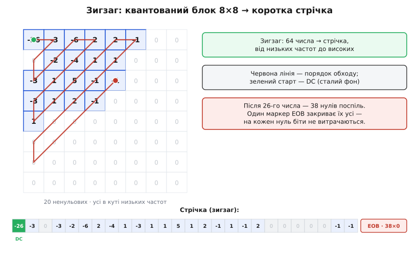
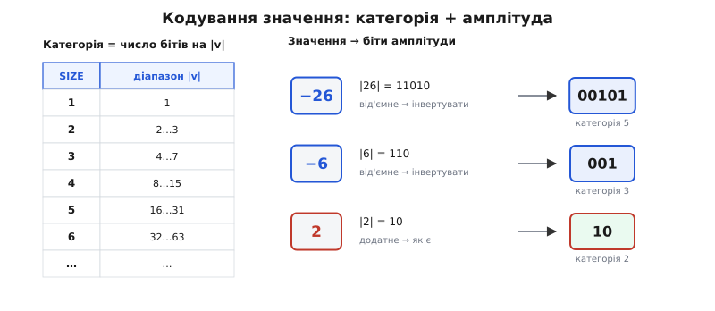

# ⚙️ Кодер блока JPEG: від пікселів до бітів

Одне діло — знати, ЧОМУ JPEG стискає; інше — написати кодер, що це робить. Тут ми беремо **один** блок 8×8 яскравості й женемо його крізь кодер до останнього біта, не пропускаючи жодного кроку. Мова — **C**: кодек живе в гарячому циклі (мільйони блоків на кадр), і кожен такт на рахунку. А щоб не вірити коду на слово, проженемо крізь нього **канонічний блок** — той самий, на якому JPEG показують усюди, — і наприкінці звіримо кожне число.

Ось блок: 64 відліки яскравості з фотографії, кожен у діапазоні 0…255.

```c
static const int pix[8][8] = {
    { 52, 55, 61,  66,  70,  61,  64,  73},
    { 63, 59, 55,  90, 109,  85,  69,  72},
    { 62, 59, 68, 113, 144, 104,  66,  73},
    { 63, 58, 71, 122, 154, 106,  70,  69},
    { 67, 61, 68, 104, 126,  88,  68,  70},
    { 79, 65, 60,  70,  77,  68,  58,  75},
    { 85, 71, 64,  59,  55,  61,  65,  83},
    { 87, 79, 69,  68,  65,  76,  78,  94},
};
```

### Крок 0. Зсув рівня: −128

Найперше кодер віднімає 128 від кожного відліку. Навіщо? Відліки додатні (0…255), із середнім десь посередині. Наступний крок — DCT — розкладе блок на «сталий фон плюс коливання навколо нього». Якщо фон висить на ~128, найперший коефіцієнт (той сталий фон) вийде велетенським, а решта — дрібні коливання. Зсунувши діапазон у [−128, 127], ми ставимо нуль у центр: числа стають симетричні навколо нуля, а їхні модулі на вході DCT — удвічі менші. Це не втрата (зсув оборотний — декодер додасть 128 назад), а гігієна: менші числа означають менший ризик переповнення й трохи компактніші коефіцієнти.

```c
double f[8][8];
for (int x = 0; x < 8; x++)
    for (int y = 0; y < 8; y++)
        f[x][y] = pix[x][y] - 128;      /* [0..255] → [-128..127] */
```

### Крок 1. Пряме DCT: пікселі → частоти

DCT виражає блок як зважену суму 64 сталих косинусних візерунків — від рівного фону до дрібної ряботини (це та сама ідея, що будь-який сигнал є [сумою хвиль різної частоти](root:math-analysis/fourier-idea)). Коефіцієнт F(u,v) каже, скільки візерунка (u,v) є в блоці. Порахувати всі 64 «в лоб» — то чотирикратна сума: для кожного з 64 коефіцієнтів пробігти всі 64 пікселі, разом 4096 множень.

Та DCT **роздільна**: двовимірне перетворення дорівнює одновимірному по кожному рядку, а тоді по кожному стовпцю. У матричній формі це `F = A · f · Aᵀ`, де `A` — косинусна матриця 8×8. Два матричні добутки — це 2·512 = 1024 множення замість 4096. Матрицю будуємо один раз:

```c
static double A[8][8];              /* косинусна матриця; будуємо раз */

static void build_dct_matrix(void) {
    for (int k = 0; k < 8; k++) {
        double a = (k == 0) ? sqrt(1.0 / 8.0) : sqrt(2.0 / 8.0);
        for (int n = 0; n < 8; n++)
            A[k][n] = a * cos((2 * n + 1) * k * M_PI / 16.0);
    }
}

/* F = A · f · Aᵀ : спершу стовпці (t = A·f), тоді рядки (F = t·Aᵀ) */
static void fdct(const double f[8][8], double F[8][8]) {
    double t[8][8];
    for (int u = 0; u < 8; u++)
        for (int y = 0; y < 8; y++) {
            double s = 0.0;
            for (int x = 0; x < 8; x++) s += A[u][x] * f[x][y];
            t[u][y] = s;
        }
    for (int u = 0; u < 8; u++)
        for (int v = 0; v < 8; v++) {
            double s = 0.0;
            for (int y = 0; y < 8; y++) s += t[u][y] * A[v][y];
            F[u][v] = s;
        }
}
```

Найлівіший-горішній коефіцієнт F(0,0) — це DC, сталий фон блока. З нашим нормуванням `A[0][n] = √(1/8)`, тож F(0,0) = (1/8)·(сума зсунутого блока). Сума зсунутих відліків нашого блока — рівно −3323, отже:

```
F(0,0) = -3323 / 8 = -415.375
```

Решта 63 коефіцієнти — це амплітуди косинусних брижів. Майже всі виходять крихітними: реальні блоки гладкі, тож їхня енергія збирається в жменьку низькочастотних чисел у горішньому-лівому куті. Саме на цьому й тримається весь стиск.

### Крок 2. Квантування: єдина втрата

Тепер кожен коефіцієнт ділимо на відповідне число з **таблиці квантування** й округлюємо. Таблиця тут — стандартна приклад-таблиця яскравості з JPEG (додаток K.1 стандарту): великі дільники стоять на високих частотах, тож ті коефіцієнти після округлення обертаються на нулі.

```c
/* стандартна приклад-таблиця яскравості (ISO/IEC 10918-1, Annex K.1) */
static const int Q[8][8] = {
    {16, 11, 10, 16,  24,  40,  51,  61},
    {12, 12, 14, 19,  26,  58,  60,  55},
    {14, 13, 16, 24,  40,  57,  69,  56},
    {14, 17, 22, 29,  51,  87,  80,  62},
    {18, 22, 37, 56,  68, 109, 103,  77},
    {24, 35, 55, 64,  81, 104, 113,  92},
    {49, 64, 78, 87, 103, 121, 120, 101},
    {72, 92, 95, 98, 112, 100, 103,  99},
};

static void quantize(const double F[8][8], int Sq[8][8]) {
    for (int u = 0; u < 8; u++)
        for (int v = 0; v < 8; v++)
            Sq[u][v] = (int) lround(F[u][v] / Q[u][v]);   /* ЄДИНА втрата */
}
```

Для нашого блока виходить:

```
-26  -3  -6   2   2  -1   0   0
  0  -2  -4   1   1   0   0   0
 -3   1   5  -1  -1   0   0   0
 -3   1   2  -1   0   0   0   0
  1   0   0   0   0   0   0   0
  0   0   0   0   0   0   0   0
  0   0   0   0   0   0   0   0
  0   0   0   0   0   0   0   0
```

DC: −415.375 / 16 = −25.96 → **−26**. Із 64 коефіцієнтів ненульовими лишилися лише **20**; решта 44 обнулилися. Це єдиний крок, що губить інформацію, — усе далі буде точна перепаковка.

> 🔧 **Навіщо це.** Уся «ручка якості» кодера сидить у таблиці `Q`. Помнож її на 2 — нулів побільшає, файл схудне, картинка згрубіє; поділи — навпаки. Решта коду (DCT, зигзаг, ентропія) не міняється ні на рядок. Тому «якість 90» проти «якості 10» — це буквально інша таблиця з 64 чисел, а не інший алгоритм.

### Крок 3. Зигзаг: 2D → стрічка

Ненульові числа купчаться в горішньому-лівому куті. Якби читати блок рядками, нулі чергувалися б із числами. А зигзаг іде по діагоналях — від низьких частот до високих — і всі нулі вишиковуються в один довгий хвіст. Порядок обходу зберігаємо як таблицю з 64 індексів (у порядку рядків):

```c
/* ZZ[k] — індекс (0..63, у порядку рядків) k-го коефіцієнта стрічки */
static const int ZZ[64] = {
     0,  1,  8, 16,  9,  2,  3, 10, 17, 24, 32, 25, 18, 11,  4,  5,
    12, 19, 26, 33, 40, 48, 41, 34, 27, 20, 13,  6,  7, 14, 21, 28,
    35, 42, 49, 56, 57, 50, 43, 36, 29, 22, 15, 23, 30, 37, 44, 51,
    58, 59, 52, 45, 38, 31, 39, 46, 53, 60, 61, 54, 47, 55, 62, 63,
};

const int *flat = &Sq[0][0];
int z[64];
for (int k = 0; k < 64; k++) z[k] = flat[ZZ[k]];   /* блок → стрічка */
```

Стрічка нашого блока:

```
-26 | -3 0 -3 -2 -6 2 -4 1 -3 1 1 5 1 2 -1 1 -1 2 | 0 0 0 0 0 | -1 -1 | 0 0 … 0
```

Остання ненульова стоїть на 26-й позиції; після неї — 38 суцільних нулів. Ось де зигзаг окупається: довгий хвіст нулів дасться закодувати майже задарма.


*Зигзаг перетворює 2D-блок на 1D-стрічку. Ненульові (сині) числа тримаються кута низьких частот; обхід по діагоналях (червона лінія) стягує їх на початок стрічки, а всі нулі — у хвіст. Після 26-го числа — 38 нулів поспіль, і кодер закриє їх одним маркером EOB, не витрачаючи бітів на кожен.*

### Крок 4. Категорія й амплітуда

Перш ніж пакувати число в біти, треба знати його розмір. JPEG кодує кожне значення двома частинами: **категорія** (SIZE) — скільки бітів треба на його модуль — і самі **біти амплітуди**.

```c
/* категорія: скільки значущих бітів у |v| (для нуля — нуль) */
static int category(int v) {
    int a = abs(v), s = 0;
    while (a) { s++; a >>= 1; }
    return s;
}

/* біти амплітуди в size розрядах: додатні — як є; від'ємні — (v−1) */
static unsigned amplitude(int v, int size) {
    if (v < 0) v -= 1;
    return (unsigned) v & ((1u << size) - 1);
}
```

Категорія — це просто позиція старшого значущого біта: |1| має 1 біт (категорія 1), |2|…|3| — 2 біти (категорія 2), |4|…|7| — 3, і так далі. А ось трюк зі знаком. У полі з `size` бітів рівно 2^size значень: половина під'ємні, половина від'ємні. Додатні `v` (від 2^(size−1) до 2^size−1) кладемо як є — їхній старший біт дорівнює 1, тобто верхня половина діапазону. Від'ємні кладемо як `v−1` — це та сама «одиничне доповнення до модуля», нижня половина, зі старшим бітом 0. Отже старший біт амплітуди **сам** несе знак, окремий біт не потрібен, а поле займає рівно `size` розрядів. Декодер відновлює навпаки: якщо старший біт 0, значення від'ємне й дорівнює `амплітуда − (2^size − 1)`.

Проженімо крізь це кілька чисел зі стрічки:

```
 -26  → |26| = 11010  → від'ємне: інвертувати біти → 00101   (категорія 5)
  -6  → |6|  = 110    → від'ємне: інвертувати       → 001     (категорія 3)
   2  → |2|  = 10     → додатне: як є                → 10      (категорія 2)
```

Перевірка для −26: амплітуда 00101 = 5, старший біт 0 → від'ємне, значення = 5 − (2⁵−1) = 5 − 31 = −26. Сходиться.


*Кодування значення в біти. Категорія (SIZE) — скільки бітів треба на модуль. Додатне число пишуть його ж бітами (старший біт 1, верхня половина); від'ємне — інвертованим модулем (старший біт 0, нижня половина). Так знак сидить у старшому біті амплітуди, і жодного зайвого біта.*

### Крок 5. DC — різницею із сусідом

DC-коефіцієнти сусідніх блоків майже однакові: сусідні клаптики картинки схожі за яскравістю. Тому JPEG зберігає не сам DC, а його **різницю** з DC попереднього блока (DIFF) — маленьке число, якому треба мало бітів. Для першого блока попередній DC вважаємо нулем, тож DIFF = −26 − 0 = −26. Категорію DIFF кодуємо кодом [Гаффмана](root:math-information/huffman-coding) за стандартною DC-таблицею, тоді дописуємо біти амплітуди:

```
DIFF = -26  →  категорія 5  →  код Гаффмана "110"  →  амплітуда "00101"
DC у потоці:  110 00101
```

### Крок 6. AC — парами (довжина серії, розмір)

Тепер 63 AC-коефіцієнти. Довгі [серії нулів](root:sf-algorithms/rle) тут — норма, тож кожен ненульовий AC кодують парою: **довжина серії нулів** перед ним (RUNLENGTH, 0…15) і **категорія** (SIZE), запаковані в один байт `RRRRSSSS`, закодований Гаффманом, а за ним — біти амплітуди. Плюс два особливі байти: **EOB** = 0x00 («усі решта нулі — стоп») і **ZRL** = 0xF0 («16 нулів поспіль» — на серії, довші за 15).

```c
static int prevDC = 0;   /* стан між блоками: DC попереднього блока */

static void encode_block(Bits *b, const int Sq[8][8]) {
    const int *flat = &Sq[0][0];
    int z[64];
    for (int k = 0; k < 64; k++) z[k] = flat[ZZ[k]];   /* зигзаг → стрічка */

    /* --- DC: різниця з попереднім блоком → категорія + амплітуда --- */
    int diff = z[0] - prevDC;
    prevDC = z[0];
    int s = category(diff);
    put(b, DC[s].code, DC[s].len);
    if (s) put(b, amplitude(diff, s), s);

    /* --- AC: пари (RUNLENGTH, SIZE) + амплітуда, з EOB і ZRL --- */
    int run = 0;
    for (int k = 1; k < 64; k++) {
        if (z[k] == 0) { run++; continue; }
        while (run > 15) {                       /* серія > 15 нулів → ZRL */
            put(b, AC[0xF0].code, AC[0xF0].len);
            run -= 16;
        }
        int sz  = category(z[k]);
        int sym = (run << 4) | sz;               /* байт RRRRSSSS */
        put(b, AC[sym].code, AC[sym].len);
        put(b, amplitude(z[k], sz), sz);
        run = 0;
    }
    if (run) put(b, AC[0x00].code, AC[0x00].len);   /* хвіст нулів → EOB */
}
```

Ось як розкладається наша стрічка по порядку — серія нулів перед числом, категорія, саме число та його біти амплітуди:

```
 1.  серія 0 · розмір 2 · v=-3  → amp 00
 2.  серія 1 · розмір 2 · v=-3  → amp 00     ← 1 нуль перед числом
 3.  серія 0 · розмір 2 · v=-2  → amp 01
 4.  серія 0 · розмір 3 · v=-6  → amp 001
 5.  серія 0 · розмір 2 · v=2   → amp 10
 6.  серія 0 · розмір 3 · v=-4  → amp 011
 7.  серія 0 · розмір 1 · v=1   → amp 1
 8.  серія 0 · розмір 2 · v=-3  → amp 00
 9.  серія 0 · розмір 1 · v=1   → amp 1
10.  серія 0 · розмір 1 · v=1   → amp 1
11.  серія 0 · розмір 3 · v=5   → amp 101
12.  серія 0 · розмір 1 · v=1   → amp 1
13.  серія 0 · розмір 2 · v=2   → amp 10
14.  серія 0 · розмір 1 · v=-1  → amp 0
15.  серія 0 · розмір 1 · v=1   → amp 1
16.  серія 0 · розмір 1 · v=-1  → amp 0
17.  серія 0 · розмір 2 · v=2   → amp 10
18.  серія 5 · розмір 1 · v=-1  → amp 0      ← 5 нулів перед числом!
19.  серія 0 · розмір 1 · v=-1  → amp 0
     EOB                                     ← далі 38 нулів
```

Зверни увагу на 18-ту пару: `серія 5`. Ті п'ять нулів перед −1 не коштували п'яти окремих символів — вони згорнулися в одне число 5 усередині байта `RRRRSSSS`. А фінальні 38 нулів не коштували взагалі нічого: один EOB, і блок закрито.

### Усе разом

Для повноти — код Гаффмана й побитовий запис (у готовому файлі ці означення стоять **перед** `encode_block`, бо він на них спирається). Таблиці JPEG стандартні; їх будують із двох масивів — `BITS` (скільки кодів кожної довжини) і `VALS` (символи в порядку зростання коду). Це «бойлерплейт», його можна пробігти очима:

```c
typedef struct { unsigned code; int len; } Sym;
static Sym DC[16], AC[256];

/* канонічна побудова кодів (Annex C): bits[i] — скільки кодів довжини i+1 */
static void build(const unsigned char *bits, const unsigned char *vals, Sym *tab) {
    unsigned code = 0; int k = 0;
    for (int len = 1; len <= 16; len++) {
        for (int i = 0; i < bits[len - 1]; i++, k++) {
            tab[vals[k]].code = code++;
            tab[vals[k]].len  = len;
        }
        code <<= 1;
    }
}

/* стандартні таблиці яскравості (Annex K.3) */
static const unsigned char BITS_DC[16] = {0,1,5,1,1,1,1,1,1,0,0,0,0,0,0,0};
static const unsigned char VALS_DC[12] = {0,1,2,3,4,5,6,7,8,9,10,11};
static const unsigned char BITS_AC[16] = {0,2,1,3,3,2,4,3,5,5,4,4,0,0,1,0x7d};
static const unsigned char VALS_AC[162] = {
    0x01,0x02,0x03,0x00,0x04,0x11,0x05,0x12,0x21,0x31,0x41,0x06,0x13,0x51,0x61,0x07,
    0x22,0x71,0x14,0x32,0x81,0x91,0xa1,0x08,0x23,0x42,0xb1,0xc1,0x15,0x52,0xd1,0xf0,
    0x24,0x33,0x62,0x72,0x82,0x09,0x0a,0x16,0x17,0x18,0x19,0x1a,0x25,0x26,0x27,0x28,
    0x29,0x2a,0x34,0x35,0x36,0x37,0x38,0x39,0x3a,0x43,0x44,0x45,0x46,0x47,0x48,0x49,
    0x4a,0x53,0x54,0x55,0x56,0x57,0x58,0x59,0x5a,0x63,0x64,0x65,0x66,0x67,0x68,0x69,
    0x6a,0x73,0x74,0x75,0x76,0x77,0x78,0x79,0x7a,0x83,0x84,0x85,0x86,0x87,0x88,0x89,
    0x8a,0x92,0x93,0x94,0x95,0x96,0x97,0x98,0x99,0x9a,0xa2,0xa3,0xa4,0xa5,0xa6,0xa7,
    0xa8,0xa9,0xaa,0xb2,0xb3,0xb4,0xb5,0xb6,0xb7,0xb8,0xb9,0xba,0xc2,0xc3,0xc4,0xc5,
    0xc6,0xc7,0xc8,0xc9,0xca,0xd2,0xd3,0xd4,0xd5,0xd6,0xd7,0xd8,0xd9,0xda,0xe1,0xe2,
    0xe3,0xe4,0xe5,0xe6,0xe7,0xe8,0xe9,0xea,0xf1,0xf2,0xf3,0xf4,0xf5,0xf6,0xf7,0xf8,
    0xf9,0xfa
};

/* побитовий запис: акумулюємо біти, виштовхуємо повні байти */
typedef struct { unsigned char *out; int pos; unsigned acc; int cnt; long nbits; } Bits;

static void put(Bits *b, unsigned code, int len) {
    b->nbits += len;
    for (int i = len - 1; i >= 0; i--) {
        b->acc = (b->acc << 1) | ((code >> i) & 1u);
        if (++b->cnt == 8) { b->out[b->pos++] = (unsigned char) b->acc; b->cnt = 0; }
    }
}
static void flush(Bits *b) {                 /* добити останній байт одиницями */
    while (b->cnt) {
        b->acc = (b->acc << 1) | 1u;
        if (++b->cnt == 8) { b->out[b->pos++] = (unsigned char) b->acc; b->cnt = 0; }
    }
}
```

І головна функція, що проганяє весь блок:

```c
#include <stdio.h>
#include <stdlib.h>
#include <math.h>
#ifndef M_PI
#define M_PI 3.14159265358979323846
#endif

int main(void) {
    build_dct_matrix();
    build(BITS_DC, VALS_DC, DC);
    build(BITS_AC, VALS_AC, AC);

    double f[8][8], F[8][8];
    int    Sq[8][8];
    for (int x = 0; x < 8; x++)
        for (int y = 0; y < 8; y++)
            f[x][y] = pix[x][y] - 128;      /* 0. зсув рівня */
    fdct(f, F);                             /* 1. пряме DCT   */
    quantize(F, Sq);                        /* 2. квантування */

    printf("DC F[0][0] = %.3f  ->  квант %d\n", F[0][0], Sq[0][0]);

    Bits b = { malloc(64), 0, 0, 0, 0 };
    encode_block(&b, Sq);                   /* 3-6. зигзаг + ентропія */
    flush(&b);

    printf("Потік блока: %ld біт -> %d байт\n", b.nbits, b.pos);
    for (int i = 0; i < b.pos; i++) printf("%02X ", b.out[i]);
    printf("\n");
    free(b.out);
    return 0;
}
```

Друкує:

```
DC F[0][0] = -415.375  ->  квант -26
Потік блока: 93 біт -> 12 байт
C5 4D 8B 0B 46 50 99 4B 02 1B D0 57
```

Ось і вся арифметика стиску: блок, що сирим важив 64 байти, ліг у **12** — приблизно вп'ятеро менше, і це лише один блок, без виграшу від різниці DC між блоками на всьому кадрі.

### Складність і дзеркальний декодер

На блок усе — **O(1)**: розмір 8 фіксований, тож DCT це 1024 множення, квантування — 64 ділення, ентропія — один прохід по 64 числах. Для кадру з N пікселів це N/64 блоків, разом **O(N)** — лінійно від кількості пікселів. (Швидкі DCT на кшталт AAN зводять ті 1024 множення до кількох, але на блок це все одно стала.)

Декодер дзеркальний, у зворотному порядку: ентропійно розшифрувати біти назад у стрічку → розкласти зигзаг у блок 8×8 → **де**квантувати (помножити на Q — але округлення вже втрачене, тож точні коефіцієнти не повернути) → обернене DCT (`f = Aᵀ · F · A`) → додати 128. Єдиний необоротний крок — квантування; решта перетворень чесно обертаються.

### Пастки

- **Переповнення в DCT.** Ми рахуємо в `double`, тож проблеми нема. Але швидкі кодери роблять DCT у цілих (фіксована кома), і там проміжні суми легко вилазять за 16 бітів — треба накопичувати в `int32` і стежити за масштабом косинусних сталих, інакше тихе переповнення зіпсує коефіцієнти.
- **Округлення.** Квантування має бути `round` (до найближчого), а не відкидання дробу: `(int)(F/Q)` відкидає до нуля й зсуває кожен коефіцієнт — картинка попливе. І округлення від'ємних мусить бути симетричним (тому `lround`, а не приведення до `int`).
- **Порядок обходу.** `ZZ[k]` — це індекс у порядку **рядків**; переплутати з порядком стовпців (транспонувати u↔v) — і стрічка вийде безладом, а декодер відновить сміття. Кодер і декодер мусять мати ту саму таблицю зигзагу.
- **Стан DC між блоками.** `prevDC` живе між викликами й скидається в нуль на початку кадру (і на кожному рестарт-маркері). Загубити цей стан — і всі DC поїдуть.
- **Набивання байта 0xFF.** У справжньому потоці будь-який байт 0xFF мусить супроводжуватися 0x00, інакше декодер сплутає його з маркером. Наш поблоковий приклад цього не робить — це вже турбота повного файлового записувача.
