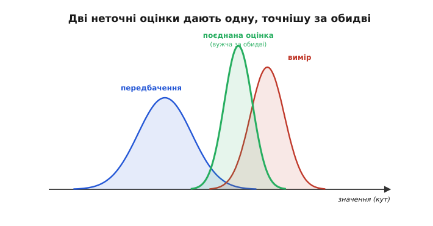
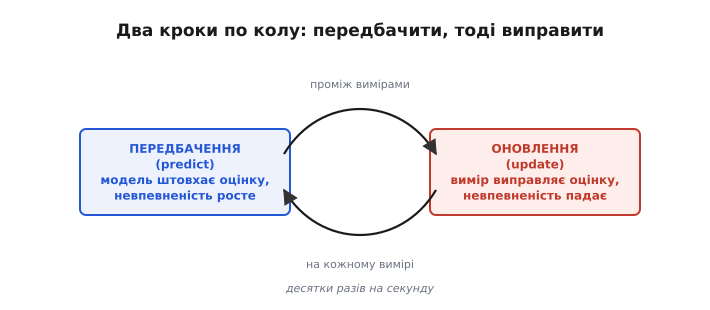
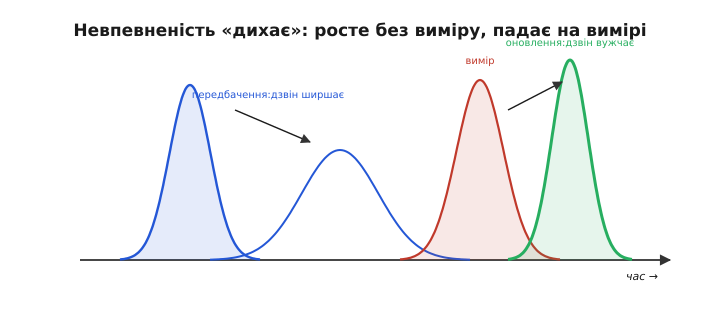
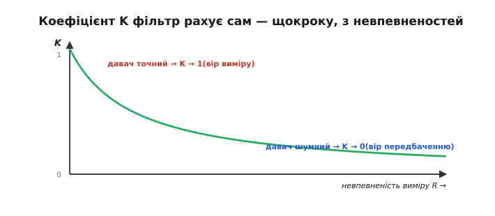
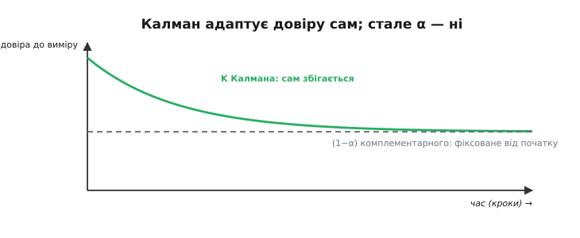
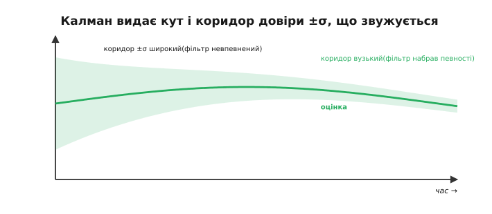
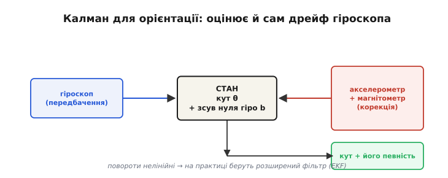

# Фільтр Калмана

[Комплементарний фільтр](root:com-signal/complementary-filter) має один наперед заданий коефіцієнт довіри α — і в цьому його межа. А що, як довіра до давачів **міняється** в часі? На старті, коли про кут ще нічого не відомо, варто більше слухати акселерометр; під час різкого маневру акселерометр бреше — варто більше вірити гіроскопу; у спокої — навпаки. Постійне α цього не вміє. **Фільтр Калмана** йде далі: він **обчислює оптимальну довіру сам, на кожному кроці**, виходячи з того, наскільки він **упевнений** у власній оцінці й наскільки шумний давач. Це той самий принцип поєднання, що й у комплементарного фільтра, але з адаптивною, математично **найкращою** вагою. Розберемо його ідею якісно — без матриць, на дзвоноподібних кривих імовірності. Це, мабуть, найважливіша ідея всієї прикладної оцінки стану — і водночас навдивовижу інтуїтивна, щойно подивитися на неї як на просте «зважування за певністю».

> 📜 **Перед матеріалом — історія:** [фільтр Калмана й «Аполлон»](root:com-signal/kalman-filter/hist-kalman.md). Метод винайшов угорсько-американський інженер **Рудольф Калман** (*Rudolf Kálmán*) близько 1960 року, а вже за кілька років та сама математика вела кораблі «Аполлона» до Місяця. Історія розкаже, як абстрактна теорія за лічені роки опинилася в бортовому комп'ютері космічного корабля.

### Дві оцінки, кожна зі своєю невпевненістю

В основі фільтра Калмана — проста думка: про будь-яку величину (скажімо, кут нахилу) ми зазвичай маємо **два** незалежні джерела, і **кожне неточне**. Перше — **передбачення** з моделі: ми знаємо, де кут був, і знаємо швидкість із гіроскопа, тож можемо передбачити, де він тепер. Друге — **вимір** з давача: акселерометр прямо каже кут. Жодному не можна вірити повністю: передбачення поволі дрейфує, вимір шумить. Але — і це ключ — кожне джерело має не лише значення, а й **міру невпевненості**: наскільки широко «розмазане» те, що воно стверджує.

Що означає ця «міра невпевненості»? Її зручно уявляти як **ширину дзвоноподібної кривої** довкола значення. Вузький, гострий дзвін — джерело каже «кут майже напевно отут»; широкий, розпливчастий — «десь у цих межах, точніше не скажу». Передбачення, що довго йшло без звірки з давачем, має широкий дзвін (накопичився дрейф); свіжий вимір тихого давача — вузький. Фільтр Калмана не просто зберігає число-оцінку, а **веде** цей дзвін — і значення, і його ширину — крок за кроком. Саме робота з шириною, з невпевненістю, і відрізняє Калмана від усього простішого.


*Серце фільтра Калмана. Передбачення (синя крива) і вимір (червона) — це не числа, а **розподіли**: значення ± невпевненість (ширина дзвона). Поєднуючи їх, Калман дає нову оцінку (зелена), що **вужча за обидві** — тобто **точніша**, ніж кожне джерело окремо, — і лежить ближче до того, кому більше довіри (тут — до вужчого виміру).*

Якщо уявити кожне твердження як «дзвін» (що вужчий — то впевненіший), то поєднання двох дзвонів дає **третій, ще вужчий** дзвін, що сидить між ними, ближче до впевненішого. Це не магія, а математика: дві незалежні неточні оцінки разом знають **більше**, ніж кожна окремо, — тож їхня спільна оцінка точніша за будь-яку з них. У цьому головна сила методу.

Технічно «поєднати два дзвони» означає взяти кожен із **вагою, оберненою до його невпевненості**: чим вужчий (певніший) дзвін, тим більша його вага. Підсумкова оцінка лягає ближче до певнішого джерела, а її невпевненість виходить **меншою за обидві** вхідні — бо два незалежні погляди разом обмежують істину тісніше, ніж кожен поодинці. Це правило — зважування за оберненою дисперсією — математично **оптимальне**: точнішої оцінки із цих двох джерел дістати взагалі неможливо.

**Приклад (один такт одновимірного фільтра: передбачення, тоді оновлення).** Нехай минулого такту оцінка кута була 16° з невпевненістю σ = 3° (дисперсія P = 9). Гіроскоп показує швидкість 6 °/с, такт Δt = 0.1 с, тож за такт кут зріс приблизно на 0.6°. Шум моделі за такт Q = 7 (град²), шум акселерометра R = 9 (град², тобто σ_вим = 3°). Надходить вимір акселерометра 22°.

```text
 ── Передбачення (predict): штовхаємо оцінку і РОЗШИРЮЄМО невпевненість ──
 θ⁻ = 16 + 6·0.1              = 16.6°
 P⁻ = P + Q = 9 + 7           = 16        (дзвін поширшав: σ⁻ = 4°)

 ── Оновлення (update): рахуємо посилення K і СТЯГУЄМО невпевненість ──
 K  = P⁻ / (P⁻ + R) = 16 / (16 + 9)      = 0.64
 θ  = θ⁻ + K·(22 − θ⁻) = 16.6 + 0.64·5.4 = 20.06°
 P  = (1 − K)·P⁻ = 0.36·16   = 5.76       (дзвін звузився: σ = 2.4°)
```

Підсумок: 20.1° ± 2.4° — за один такт фільтр спершу посунув кут гіроскопом і **втратив** певність (σ: 3° → 4°), а тоді вимір її **повернув із запасом** (σ: 4° → 2.4°, менше навіть за стартові 3°). Посилення K = 0.64 — це і є коефіцієнт Калмана, обчислений із самих лише невпевненостей, без жодного ручного підбору. У прошивці один такт лягає в кілька рядків:

:::tabs
```c
// одновимірний фільтр Калмана: стан theta, дисперсія P (град², град)
float theta = 16.0f, P = 9.0f;
const float Q = 7.0f, R = 9.0f;          // шум моделі та виміру за такт

void kalman_tick(float gyro_dps, float dt, float accel_deg) {
    // 1. передбачення: модель штовхає оцінку, невпевненість росте
    theta += gyro_dps * dt;
    P     += Q;
    // 2. оновлення: посилення зважує два джерела за певністю
    float K = P / (P + R);               // коефіцієнт Калмана, 0..1
    theta  += K * (accel_deg - theta);   // підтягуємо до виміру на частку K
    P      *= (1.0f - K);                // невпевненість падає
}
```
```py
# одновимірний фільтр Калмана: стан theta, дисперсія P (град², град)
Q, R = 7.0, 9.0                          # шум моделі та виміру за такт

class Kalman1D:
    def __init__(self):
        self.theta = 16.0
        self.P = 9.0

    def tick(self, gyro_dps, dt, accel_deg):
        # 1. передбачення: модель штовхає оцінку, невпевненість росте
        self.theta += gyro_dps * dt
        self.P += Q
        # 2. оновлення: посилення зважує два джерела за певністю
        K = self.P / (self.P + R)            # коефіцієнт Калмана, 0..1
        self.theta += K * (accel_deg - self.theta)  # підтягуємо до виміру на частку K
        self.P *= (1.0 - K)                  # невпевненість падає
```
:::

### Передбачити, тоді виправити

Працює фільтр Калмана **циклом** із двох кроків, що повторюються щомиті: **передбачення** (predict) і **оновлення** (update, або корекція).


*Два кроки по колу. **Передбачення:** модель (гіроскоп) штовхає оцінку вперед і **збільшує** невпевненість (модель недосконала, дрейф росте). **Оновлення:** надходить вимір — фільтр обчислює, кому більше вірити, підтягує оцінку до виміру й **зменшує** невпевненість. І так знову й знову, десятки разів на секунду.*

На кроці **передбачення** фільтр бере поточну оцінку й посуває її за моделлю (проінтегрував гіроскоп — і кут зрушив). Але разом зі значенням він посуває й невпевненість — і **збільшує** її: модель не ідеальна, тож що довше ми лише передбачаємо, не звіряючись із давачем, то менше впевнені (дзвін **ширшає**). На кроці **оновлення** надходить вимір — і фільтр **виправляє** передбачення, підтягуючи його до виміру; а оскільки вимір додав інформації, невпевненість **зменшується** (дзвін **вужчає**).

Знайома аналогія — навігатор у машині. Поки сигнал GPS є, він **виправляє** позицію виміром (оновлення). У тунелі GPS зникає — і навігатор **передбачає**, де ви, за останньою швидкістю й напрямом руху (модель), малюючи машину далі дорогою; та з кожною секундою без виміру його впевненість падає (коридор росте). Виїхали з тунелю — свіжий GPS миттю стягує оцінку назад і звужує коридор. Це точно цикл Калмана: передбачати між вимірами, виправлятися на вимірах — і весь час знати, наскільки ти зараз певний.

> 🔧 **Навіщо це.** Запам'ятайте поділ «передбачення ↔ оновлення» — він універсальний далеко за межами орієнтації: так поєднують GPS і одометрію в роботі, радар і камеру в авто, будь-яку «модель руху» з будь-яким «давачем». Щойно у вас є **дешеве часте передбачення** (гіроскоп, лічильник обертів) і **рідший точний вимір**, що не дрейфує (акселерометр, GPS), — це задача для фільтра калманівського типу. Навчившись бачити цю пару, ви одразу знатимете, який інструмент діставати.


*Невпевненість «дихає». На кроці передбачення оцінка зсувається за моделлю й **ширшає** (синій → блідий ширший дзвін). На кроці оновлення вимір (червоний) стягує її назад у **вужчий** підсумковий дзвін (зелений). Передбачення «втрачає» певність, вимір її «повертає» — і цикл тримає невпевненість обмеженою.*

### Коефіцієнт Калмана: адаптивна довіра

Як саме фільтр вирішує, кому більше вірити під час поєднання? Через **коефіцієнт Калмана** K — число від 0 до 1, що каже, **наскільки підтягувати** оцінку до виміру. І обчислюється воно щокроку з **відносної невпевненості** двох джерел: якщо вимір певний (давач тихий) — K близьке до 1, фільтр майже стрибає на вимір; якщо вимір непевний (давач шумить) або, навпаки, передбачення ще надійне — K близьке до 0, фільтр тримається передбачення.


*Коефіцієнт Калмана K — це **адаптивний коефіцієнт довіри до виміру** (адаптивне (1−α)). Коли невпевненість виміру мала (давач точний), K → 1: вір виміру. Коли вона велика (давач шумний), K → 0: вір передбаченню. Те, що в комплементарному фільтрі задають **руками** одним числом α, тут фільтр **обчислює сам** і **щокроку наново**.*

По суті, K — це **той самий** коефіцієнт довіри, що й (1−α) у [комплементарному фільтрі](root:com-signal/complementary-filter), тільки тепер його не задають раз і назавжди, а **обчислюють заново** на кожному кроці з поточних невпевненостей. Ось чому кажуть, що комплементарний фільтр — це Калман із **замороженим** коефіцієнтом: якщо невпевненості давачів сталі, K Калмана збігається до сталого значення, і два фільтри стають тотожні.

Звідки береться K, видно вже на одновимірному випадку: K = σ²_перед / (σ²_перед + σ²_вим). Якщо вимір ідеальний (σ²_вим → 0), то K → 1 — фільтр стрибає просто на вимір. Якщо вимір геть ненадійний (σ²_вим → ∞), то K → 0 — фільтр його ігнорує й тримається передбачення. Між цими крайнощами K плавно зважує два джерела за їхньою певністю. Уся «магія» Калмана в тому, що σ²_перед він теж рахує сам — нарощує на кроці передбачення, зменшує на кроці оновлення, — тож K завжди відповідає **поточній** обстановці, а не якомусь усередненому припущенню.

### Він сам себе налаштовує

Найкорисніша риса — фільтр **сам** підкручує K під обставини. На старті, коли він ще нічого не знає про кут, невпевненість велика, K високе — фільтр жадібно вбирає перші виміри. Згодом, коли оцінка устоялася, K спадає до робочого рівня. А якщо повідомити фільтру, що давач зашумів (піднявши його R), — він одразу й строго знизить до нього довіру.

У [комплементарного фільтра](root:com-signal/complementary-filter) «вимикач довіри» доводиться вмикати **вручну**, ловлячи моменти, коли |a| ≠ g. Калман перераховує K **безперервно й строго** — з тих невпевненостей, які йому **задано**: будь-яка зміна R чи Q одразу відбивається на K, і в межах цієї моделі зважування на кожному кроці найкраще можливе. Чесне застереження: сам собою фільтр не помітить, що давач **насправді** збрехав понад заявлений рівень шуму, — тому бойові фільтри (у PX4 чи ArduPilot) досі тримають і явні евристики на кшталт «якщо |a| ≠ g — тимчасово підняти R акселерометра». Сила Калмана в тому, що він дає цим евристикам строгу рамку: недовіру не вигадують з нуля, а акуратно вписують у ту саму арифметику невпевненостей.


*Самоналаштування. Коефіцієнт K (зелений) стартує високим — фільтр невпевнений і жадібно вбирає виміри, — а тоді **сам збігається** до сталого робочого значення. Комплементарний фільтр натомість тримає **фіксоване** (1−α) (сіра пряма) від самого початку, ще не знаючи обстановки. Калман адаптується; α — ні.*

> 🔧 **Навіщо це.** Практична відмінність від [комплементарного фільтра](root:com-signal/complementary-filter) — у двох речах. По-перше, Калман **не треба вручну підбирати α**: ви задаєте натомість **рівні шуму** давача й моделі (їх беруть із даташита або міряють), а оптимальну вагу фільтр виводить сам. По-друге, він видає не лише оцінку, а й **її невпевненість** — а це безцінно: система знає, коли довіряти власній орієнтації, а коли «осліпла». Якщо у вашій задачі шуми сталі й передбачувані — досить дешевого комплементарного фільтра; якщо вони міняються або потрібна оцінка надійності — час Калмана.

### Оцінка з мірою впевненості

Та найбільша перевага фільтра Калмана — не сам по собі кращий кут, а те, що він **разом із оцінкою видає її невпевненість**. Він завжди «знає», наскільки сам собі вірить.


*Калман видає кут **і** його невпевненість. Зелена — оцінка, що щільно тримається правди (сіра); затінений коридор — діапазон ±σ, у якому, на думку фільтра, лежить істина. Спершу коридор широкий (фільтр невпевнений), далі **звужується** — фільтр «набрав певності». Цього коридору комплементарний фільтр не дає взагалі.*

Це той самий «коридор довіри», яким користуються великі системи: автопілот, що бачить розширення коридору, розуміє, що орієнтація стала ненадійною (давач відмовив, пішла сильна вібрація), і може перейти в безпечний режим. Знати **наскільки** ти певний — часто важливіше, ніж сама оцінка.

> 🔧 **Навіщо це.** Не викидайте оцінку невпевненості, яку дає Калман, — вона нерідко корисніша за сам кут. За **шириною коридору** легко зробити **виявлення відмов**: якщо невпевненість різко зросла або черговий вимір вийшов далеко за свій очікуваний розкид, отже, давачу віри нема (відвалився, б'є вібрація, магнітна аномалія) — і час перейти в безпечний режим чи перемкнути джерело. Системи, що так стежать за власною певністю, падають значно рідше за ті, що сліпо вірять одному числу. Це, мабуть, найнедооціненіша перевага Калмана.

### Що це дає й куди далі

Отже, фільтр Калмана — це той самий принцип поєднання «передбачення + вимір», що й [комплементарний фільтр](root:com-signal/complementary-filter), але доведений до досконалості: він стежить за **невпевненістю** кожної оцінки й через неї щокроку обчислює **оптимальну** вагу K. За певних умов (лінійна модель, гаусів шум) він — **доказово найкращий** із можливих лінійних оцінювачів: ніщо не витисне з тих самих давачів точнішої оцінки.


*Калман для орієнтації. Стан фільтра — це не лише кут, а й, наприклад, **зсув нуля гіроскопа**: фільтр оцінює й сам дрейф, а тому гасить його значно краще. Передбачення йде від гіроскопа, корекція — від акселерометра й магнітометра. На виході — кут **і** його певність. Бо орієнтація нелінійна, на практиці беруть **розширений** фільтр Калмана (EKF).*

Дві практичні примітки. Перша: до **стану** фільтра зазвичай додають не лише кут, а й **зсув нуля гіроскопа** — тоді фільтр оцінює сам дрейф і давить його куди краще за будь-який комплементарний. Друга: позаяк орієнтація — річ **нелінійна** (повороти не додаються як числа), у дронах і AHRS застосовують [розширений фільтр Калмана](root:com-signal/kalman-ekf) (*EKF, Extended Kalman Filter*) — той самий принцип, пристосований до нелінійних задач. Саме EKF крутиться всередині більшості польотних контролерів, видаючи той надійний [кватерніон орієнтації](root:math-geometry/quaternions), яким апарат знає, як він повернутий.

За все це треба платити, і ціну варто назвати чесно. Фільтр Калмана потребує **моделі** системи й **чисел шуму**: Q — наскільки брехлива модель, R — наскільки шумний давач; їх доводиться оцінювати чи підбирати, і кепські Q, R дадуть кепський фільтр. Він важчий за один рядок комплементарного — це матриці, обернення, більше коду й обчислень (хоча сучасний мікроконтролер тягне його легко). А ще він строго оптимальний лише в теорії — для лінійних задач із гаусовим шумом; реальність нелінійна, тож на практиці беруть наближення (той-таки EKF, а подеколи «несцентований» UKF). Тому правило інженера просте: не ускладнюйте без потреби — Калман доречний там, де його переваги справді потрібні, а не сам по собі.

Де ви зустрінете фільтр Калмана на практиці? Майже скрізь, де щось рухається й має знати, **де** воно: у польотних контролерах дронів (PX4, ArduPilot, Betaflight), у модулях орієнтації AHRS, у GPS-приймачах, автомобільних системах допомоги водієві, кроковому підрахунку телефонів. Здебільшого він захований у бібліотеці, тож писати його з нуля вам навряд чи доведеться. Але тепер, **розуміючи** ідею «передбачення плюс вимір, зважені за певністю», ви свідомо задасте йому рівні шуму й правильно витлумачите його вихід, замість тицяти коефіцієнти навмання. А головне — ви відрізните задачу, де вистачить копійчаного комплементарного фільтра, від тієї, де справді потрібен Калман: це вміння економить і код, і години відлагодження.

Цим замикається все вміння «знати свою орієнтацію»: від наочних [кутів Ейлера](root:math-geometry/euler-angles) й [кватерніонів](root:math-geometry/quaternions) — через [поєднання давачів](root:com-signal/sensor-fusion) — до фільтра Калмана. Апарат **знає**, як він повернутий, і наскільки цьому можна вірити: і зручний для людини кут, і надійний кватерніон усередині, і оцінка власної певності на додачу. Знати свою орієнтацію — лише половина задачі автономного руху; друга половина — **тримати** бажану орієнтацію, замкнувши [зворотний зв'язок](root:embedded/open-vs-closed-loop), щоб апарат сам виправляв своє відхилення. Та оцінка кута з мірою довіри, яку дає Калман, — саме той вхід, на який спирається це керування.

---
