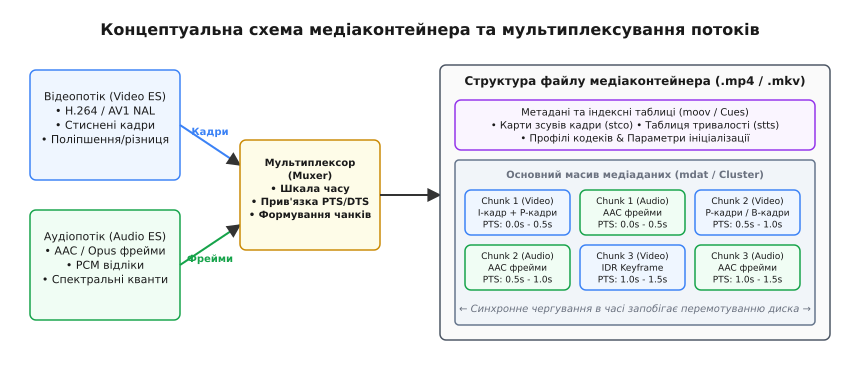
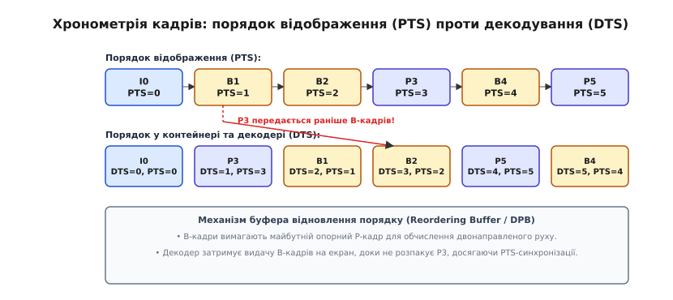
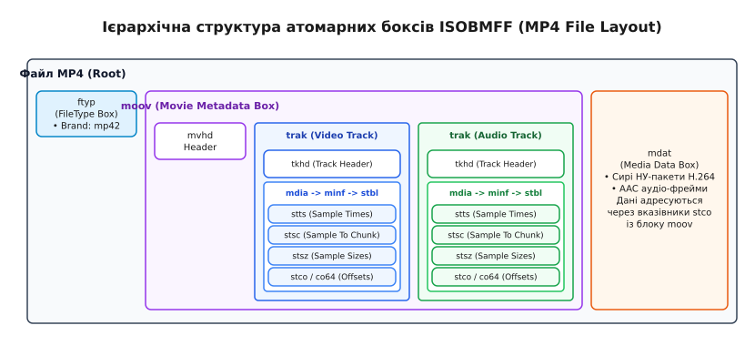

# Медіаконтейнер: як стиснені кадри складають у файл

<preknowlist>
- [Апаратний кодек H.264](root:com-signal/h264-hardware-codec) — формування елементарного потоку, NAL-одиниці та типи кадрів (I, P, B).
- [Роздільність та частота кадрів](root:com-signal/resolution-framerate) — часові інтервали між кадрами, дискретизація відеосигналу та обсяг даних.
</preknowlist>

Кодування відео високої чіткості за допомогою алгоритмів H.264 або AV1 перетворює послідовність піксельних матриць на неперервний двійковий потік NAL-одиниць (Network Abstraction Layer), а аудіокодек AAC стискає звукову хвилю у серію спектральних фреймів. Проте збереження цих двох сирих елементарних потоків (Elementary Streams, ES) у звичайні бінарні файли або їх пряма передача в мережевий кабель створює фундаментальну проблему: медіаплеєр не здатний об'єднати звук з відео, знайти довільну секунду запису чи відновити відтворення при втраті фрагмента даних. Для усунення цього розриву між математикою стиснення та фізичною файловою системою створено абстракцію медіаконтейнера.

Медіаконтейнер слугує впорядкованою цифровою оболонкою. Він розбиває неперервні потоки відео, аудіо, субтитрів та метаданих на окремі фрагменти, розміщує їх у спільному бінарному просторі за принципом часового чергування, постачає кожен кадр точними мітками часу та будує індексні таблиці для миттєвого пошуку.

## Фізичний розрив між елементарним потоком та файлом

Елементарний потік кодека відео являє собою безперервний ланцюг стиснених блоків. Наприклад, потік H.264 складається з NAL-одиниць різного типу: заголовків параметрів `SPS` та `PPS`, ключ-кадрів `IDR` та різницевих кадрів `P` і `B`. 

Спроба записати такий сирий потік у файл створює чотири технічні бар'єри:

1. **Відсутність концепції кількох каналів (Мультиплексування):** Сирий потік H.264 не має фізичних механізмів для розміщення поруч аудіодоріжки у форматі AAC чи дорожки субтитрів. Якщо просто записати аудіобайти услід за відеобайтами, декодер відео сприйме спектральні дані аудіо як пошкоджені NAL-блоки й зупинить обробку.
2. **Відсутність глобальної шкали часу (Timestamps):** Усередині кодованого кадру містяться лише відносні лічильники порядкових номерів. Сирий потік не знає, з якою саме фізичною швидкістю його потрібно показувати — 24, 30 чи 59.94 кадра на секунду, а також як прив'язати конкретний звуковий сплеск до моменту удару на відео.
3. **Неможливість довільного позиціонування (Seeking):** Оскільки стиснені кадри мають змінний розмір (Variable Bit Rate, VBR) — один I-кадр може займати 150 Кбайт, а B-кадр лише 4 Кбайт — неможливо обчислити байтовий зсув кадру за формулою прямої пропорційності від часу. Щоб перейти на 45-ту хвилину фільму у сирому потоці, плеєру довелося б послідовно прочитати й розібрати кожен байт від самого початку файлу.
4. **Втрата контексту при пошкодженні:** У сирому потоці відсутня глобальна метаінформація про формат, колірну матрицю, дозвіл та профілі декодування, що унеможливлює ініціалізацію апаратних декодерів до моменту зчитання заголовків з середніх секцій потоку.

Розв'язанням цих проблем став медіаконтейнер (лат. *containere* — вміщати), який бере на себе роль структурованої обгортки над елементарними потоками.

## Принцип мультиплексування та чергування даних

Процес упаковки декількох незалежних елементарних потоків у єдиний контейнерний файл називається **мультиплексуванням** (Muxing), а зворотний процес розпакування у плеєрі — **демультиплексуванням** (Demuxing).


*Концептуальна схема медіаконтейнера та мультиплексування потоків: від сирих елементарних потоків крізь мультиплексор до чергованої структури блоків на диску.*

Для забезпечення безперервного відтворення без затримок мультиплексор використовує механізм **чергування блоків** (Chunk Interleaving). 

Під час запису фільму мультиплексор накопичує кадри відео та аудіо у тимчасових буферах пам'яті. Коли обсяг накопичених даних досягає часового вікна чергування (наприклад, 0.5–2 секунди), модуль формує порцію медіаданих (Chunk) і послідовно записує її на диск:

- `Chunk 1 (Video)`: кадри відео від 0.0 до 0.5 с;
- `Chunk 1 (Audio)`: фрейми аудіо від 0.0 до 0.5 с;
- `Chunk 2 (Video)`: кадри відео від 0.5 до 1.0 с;
- `Chunk 2 (Audio)`: фрейми аудіо від 0.5 до 1.0 с.

### Забігання голівки накопичувача та буферизація демультиплексора

Фізична необхідність чергування випливає з обмеженої швидкості довільного доступу накопичувачів. Якби всі відеокадри 2-годинного фільму лежали в першій половині файлу, а всі аудіофрейми — у другій, то під час відтворення жорсткий диск (HDD) або навіть SSD змушений був би постійно виконувати тисячі операцій переміщення зчитувального покажчика між двома віддаленими секторами файлу.

При коректному чергуванні демультиплексор зчитує файл із диска послідовним блоком. Кадри відео відправляються у FIFO-буфер відеодекодера, а фрейми аудіо — у буфер аудіодекодера. Якщо чергування порушене (наприклад, відео забігає наперед аудіо на 10 секунд), буфер демультиплексора переповнюється (Demuxer Buffer Overflow), що призводить до зупинки відтворення або розсинхронізації звуку та зображення. 

Детальніший опис еволюції механізмів чергування від перших систем 1990-х років до сучасних стандартів дивіться у вставці про [історію розробки медіаконтейнерів](root:com-signal/media-container/hist-mp4-mpegts.md).

## Хронометрія контейнера: Часові шкали, PTS та DTS

Медіаконтейнер не оперує дійсними числами з плаваючою крапкою для збереження часу. Замість цього кожен трек контейнера має власну цілочисельну **часову шкалу** (Timescale або Clock Rate), яка визначає кількість відліків (тиків) на секунду.

Наприклад, у форматі MPEG-TS часова шкала відео становить строго `90000` Гц (один тик = 1/90000 секунди), а у форматі MP4 часова шкала аудіо зазвичай дорівнює частоті дискретизації сигналу (наприклад, `48000` Гц).

Кожен кадр, закодований у контейнері, постачається двома часовими мітками:

1. **PTS (Presentation Time Stamp):** часовий штамп відображення. Він вказує точний момент часу, коли цей кадр має бути виведений на екран монітора або виданий на динамік.
2. **DTS (Decode Time Stamp):** часовий штамп декодування. Він вказує момент часу, коли цей кадр має бути вилучений з контейнера й переданий в апаратний декодер для розпакування.

### Перевпорядкування кадрів через B-структури

У простих відеопотоках без B-кадрів порядок декодування повністю збігається з порядком відображення, тому `PTS = DTS`. Проте з появою двонаправленого Inter-прогнозування (B-кадрів) цей порядок руйнується.

B-кадри кодуються шляхом інтерполяції між двома опорними кадрами: один із минулого (попередній I або P-кадр), а другий із майбутнього (наступний P або I-кадр). Це означає, що майбутній опорний кадр має бути розпакований декодером **раніше**, ніж B-кадри, які від нього залежать.


*Хронометрія кадрів: порядок відображення на екрані (PTS) проти порядку передачі у контейнері та розпакування в декодері (DTS).*

Як видно з діаграми, для послідовності відображення `I0 -> B1 -> B2 -> P3` контейнер змінює порядок слідування кадрів у файлі на `I0 -> P3 -> B1 -> B2`. 

Декодер спочатку приймає й розпаковує кадр `P3` при `DTS = 1`, але утримує його у буфері розпакованих кадрів (Decoded Picture Buffer, DPB). Потім він декодує кадри `B1` та `B2`, і виводить їх на екран у момент часу відповідно до їхніх значень `PTS`: спочатку `B1` (`PTS = 1`), потім `B2` (`PTS = 2`), і лише після цього `P3` (`PTS = 3`).

Різниця між `PTS` та `DTS` називається зсувом часу композиції (Composition Time Offset). Нехтування цією різницею призводить до «смикання» відеопотоку та зворотного стрибка кадрів у часі. Детальний математичний апарат конвертації шкал та формули обчислення дрейфу наведено у вставці про [математику обчислення PTS/DTS та розсинхронізації](root:com-signal/media-container/math-pts-dts-drift.md).

## Змінна частота кадрів (VFR) та мульти-трекова інфраструктура

Сучасні джерела відео (смартфони, трансляції ігрового процесу, відеоконференції) часто використовують режим **змінної частоти кадрів (Variable Frame Rate, VFR)**. При зйомці динамічних сцен камера записує 60 кадрів/с, а при фіксації статичного тексту чи паузи знижує частоту до 1 кадру/с для економії акумулятора та пам'яті.

Медіаконтейнер реалізує підтримку VFR без розривів відтворення:
- У таблиці `stts` контейнера MP4 кожен кадр отримує індивідуальне значення тривалості у тиках.
- У контейнері Matroska кожен блок `BlockAdditions` постачається точним штампом часу `Timecode` у мілісекундах.

### Обслуговування кількох аудіодоріжок та субтитрів

Контейнер дозволяє пакувати в один файл десяток альтернативних доріжок:
- **Багатомовний дубляж:** Кілька аудіотреків AAC, AC3 чи Opus із позначенням мовних тегів ISO 639-2 (`eng`, `ukr`, `fra`).
- **Субтитри:** Текстові (SRT, WebVTT) чи графічні (PGS у Blu-ray) доріжки з точним картографуванням часу появи й зникнення.
- **Спеціальні графічні елементи:** Контейнери MKV та MP4 дозволяють вкладати прямо всередину файлу шрифти (TTF/OTF) для візуалізації векторних субтитрів ASS, а також обкладинки альбомів (JPEG/PNG) у метаданих ID3/iTunes.

## Індексація та позиціонування (Seeking Mechanics)

Коли користувач перетягує повзунок відтворення у відеоплеєрі на позначку 01:15:00, демультиплексор виконує операцію **позиціонування** (Seeking).

Оскільки стиснене відео має змінний бітрейт (VBR), обчислити позицію в байтах методом пропорції неможливо. Щоб миттєво знайти потрібну точку без сканування всього файлу, медіаконтейнер підтримує спеціальні **індексні таблиці** (Index Tables).

### Будова індексних таблиць на прикладі ISOBMFF / MP4

У контейнерах сімейства MP4/MOV метадані індексації зосереджені всередині атома `moov -> trak -> mdia -> minf -> stbl` (Sample Table Box). Таблиця `stbl` складається з п'яти зв'язаних суб-структур:

1. **`stts` (Time-to-Sample Box):** таблиця тривалостей кадрів. Задає послідовність чисел `(count, delta)`, яка визначає, скільки тиків часової шкали триває кожен кадр.
2. **`stsz` (Sample Size Box):** масив розмірів усіх кадрів у байтах `[size_1, size_2, ..., size_N]`.
3. **`stsc` (Sample-to-Chunk Box):** карта розбиття кадрів по чанках. Вказує, які кадри об'єднані в один чанк.
4. **`stco` / `co64` (Chunk Offset Box):** абсолютні байтові адреси (32 або 64 біти) початку кожного чанку від початку файлу.
5. **`stss` (Sync Sample Box):** список номерів усіх **опорних кадрів** (Sync/IDR Keyframes).

### Алгоритм точного пошуку (Sample-Exact Seek)

При отриманні запиту на перехід у час `T_target` демультиплексор виконує таку послідовність дій:

1. **Конвертація часу:** переводить `T_target` у тики часової шкали: `Ticks = T_target · Timescale`.
2. **Пошук кадру за часом:** сканує таблицю `stts` і знаходить порядковий номер кадру `N_sample`, чий `PTS` найближчий до `Ticks`.
3. **Пошук опорної точки (Keyframe Alignment):** оскільки P та B-кадри неможливо декодувати без попереднього I-кадру, демультиплексор звертається до таблиці `stss` і знаходить найближчий **попередній опорний кадр** `N_key <= N_sample`.
4. **Обчислення байтового зсуву:** за допомогою комбінації таблиць `stsc`, `stsz` та `stco` обчислює точний байтовий зсув кадру `N_key` на диску.
5. **Зчитування та декодування:** демультиплексор моментально переміщує зчитувальний покажчик диска на знайдений зсув, зчитує кадри починаючи від `N_key`, відправляє їх у декодер, але приховує демонстрацію на екрані до моменту досягнення кадру `N_sample`.

Це гарантує точність переходу до конкретного кадру без візуальних артефактів розсипання блоків.

## Порівняльний аналіз провідних архітектур медіаконтейнерів

У сучасній інженерній практиці найбільше поширення здобули чотири класи архітектур медіаконтейнерів, кожен з яких оптимізований під власні задачі.

### 1. ISOBMFF (MP4 / MOV / 3GP)

Контейнер MP4 побудовано на основі древоподібної структури вкладених блоків — **атомів або боксів** (Atoms / Boxes). Кожен бокс починається з заголовка: 4 байти розміру (Length) та 4 байти імені типу (FourCC Tag), після чого слідує корисне навантаження.


*Ієрархічна структура атомарних боксів ISOBMFF: кореневі бокси ftyp, moov, mdat та внутрішнє дерево індексної таблиці stbl.*

Головні бокси MP4:
- `ftyp` (File Type Box): вказує на сумісність зі стандартами (brand `isom`, `mp42`);
- `moov` (Movie Box): містить усі метадані, структури треків та індексні таблиці `stbl`;
- `mdat` (Media Data Box): сирий масив стиснених кадрів відео та аудіо.

**Проблема розташування `moov` та оптимізація FastStart:** За замовчуванням енкодери записують бокс `moov` наприкінці файлу, оскільки точні розміри кадрів та індексні таблиці стають відомими лише після завершення кодування всього відео. Проте при спробі відтворити такий MP4-файл через Інтернет плеєр не може почати показ, доки не завантажить увесь файл до самого кінця.

Для розв'язання цієї проблеми використовують оптимізацію `qt-faststart`: утиліта переставляє атоми місцями, вираховує нові зсуви і переміщує бокс `moov` на початок файлу (одразу після `ftyp`). Це дозволяє плеєрам моментально починати відтворення потоку (Progressive Download).

Для веб-трансляцій у режимі реального часу використовують **Fragmented MP4 (fMP4)**, де файл розбивається на серію коротких фрагментів з власною парою боксів `moof` (Movie Fragment Header) та `mdat`. Ознайомитися з прикладом розбору атомарного дерева MP4 у коді можна у вставці про [практичну реалізацію C/C++ парсера MP4-боксів](root:com-signal/media-container/proj-mp4-parser.md).

### 2. Matroska (MKV / WebM)

На відміну від MP4, контейнер Matroska побудований на основі відкритого двійкового стандарту **EBML (Extensible Binary Meta Language)**. Замість 4-байтових фіксованих заголовків EBML використовує кодування полів змінною довжиною (VINT — Variable-Length Integer), аналогічно кодуванню UTF-8.

Структура MKV складається з кореневого елемента `Segment`, всередині якого розміщуються розділи:
- `Info`: загальні метадані (назва, тривалість, генератор);
- `Tracks`: характеристики відео, аудіо та субтитрів;
- `Cues`: індексна таблиця ключових кадрів для швидкого позиціонування;
- `Cluster`: блоки медіаданих, розділені на короткі часові інтервали.

Matroska є найгнучкішим контейнером: він підтримує практично будь-які існуючі відео та аудіокодеки, необмежену кількість доріжок субтитрів (ASS/SSA, SRT), меню, розділи (Chapters) та вкладені шрифти.

### 3. MPEG-TS (MPEG Transport Stream)

Розроблений для трансляції у втрачувальних мережах. Потік складається з жорстко фіксованих пакетів по **188 байтів**.

Кожен пакет починається з байта синхронізації `0x47` та містить 13-бітовий ідентифікатор `PID`. Контейнер не має єдиного заголовка файлу. Метадані передаються періодичним вкрапленням спецпакетів:
- `PAT` (Program Association Table, PID 0x0000): перелік усіх програм у потоці;
- `PMT` (Program Map Table): перелік PID-кодів відео, аудіо та системного годинника `PCR` для конкретної програми.

Завдяки пакетній структурі при обриві зв'язку декодер миттєво відновлює синхронізацію при появі наступного байта `0x47`.

### 4. Порівняльна таблиця характеристик

| Характеристика | MP4 (ISOBMFF) | Matroska (MKV) | MPEG-TS | AVI (RIFF) |
| :--- | :--- | :--- | :--- | :--- |
| **Базовий формат** | TLV (Atoms/Boxes) | EBML (VINT) | Фіксовані 188B пакети | RIFF Chunks |
| **Основна область** | Файли, VOD, Web | Архівування, ПК | Мовлення (DVB/RTSP) | Застарілі ПК |
| **Гнучкість кодеків** | Висока (Стандартизована) | Абсолютна (Будь-які) | Середня (MPEG/H.26x) | Низька |
| **Підтримка B-кадрів** | Повна (`ctts`) | Повна | Повна (`PTS/DTS`) | Обмежена (Хаки) |
| **Стійкість до збоїв** | Низька (у звичайному MP4) | Висока (покластерна) | Абсолютна | Низька |
| **Оверхед контейнера** | Дуже низький (< 1%) | Низький (1–2%) | Високий (10–15%) | Низький (2–4%) |

Для реалізації програмних систем розробники використовують стандартний контракт демультиплексора, наведений у вставці про [стандартний інженерний API демультиплексора](root:com-signal/media-container/api-container-demux.md).

## Інтеграція медіаконтейнерів у сучасні потокові протоколи (HLS та DASH)

З появою веб-відео високої якості виникла потреба динамічно адаптувати бітрейт відео під поточну швидкість Інтернету користувача. Ззвичайні суцільні MP4-файли не підходили для цієї задачі, оскільки перемикання між відеофайлами з різною якістю прямо під час перегляду викликало б зупинку відтворення.

Розв'язанням цієї задачі стала концепція **адаптивного потокового мовлення через HTTP** (Adaptive Bitrate Streaming, ABR), реалізована у протоколах Apple HLS (HTTP Live Streaming) та ISO MPEG-DASH.

### Механізм сегментації контейнерів

Замість одного великого файлу енкодер розбиває медіаконтейнер на сотні дрібних автономних сегментів тривалістю від 2 до 6 секунд.

- **HLS (HTTP Live Streaming):** Початково використовував класичні сегменти MPEG-TS (`.ts`). У сучасній версії HLS застосовує фрагментовані сегменти MP4 (`.m4s`). Доступ регулюється текстовим маніфестом `.m3u8` (M3U Extended Playlist).
- **MPEG-DASH:** Використовує підмножину fMP4 або WebM. Структура трансляції описується XML-файлом маніфесту MPD (Media Presentation Description).

При адаптивному відтворенні медіаплеєр у браузері спочатку зчитує маніфест, вибирає оптимальний якісний потік (наприклад 1080p при 5 Мбіт/с) і завантажує первинний ініціалізаційний сегмент `init.mp4` (що містить бокси `ftyp` та `moov`). Далі плеєр послідовно викачує фрагменти `segment_1.m4s`, `segment_2.m4s`. Якщо швидкість мережі падає, плеєр безшовно завантажує `segment_3.m4s` з альтернативного каталогу 720p без переривання декодування аудіо.

## Накладні витрати контейнера та проблема нефіналізованих файлів

Упаковка медіаданих вимагає витрат додаткового дискретного простору та мережевого бітрейту. У контейнері MP4 при тривалості відео 1 година обсяг індексних таблиць `stbl` становить близько 1–3 Мбайт, що при загальному розмірі файлу 2 Гбайт дає оверхед менше ніж **0.1%**. У той самий час у MPEG-TS за рахунок постійної дуплікації 4-байтових заголовків пакетів, адаптаційних полів та наповнення (padding) накладні витрати досягають **10–15%**.

Відношення розміру службових заголовків контейнера до загального обсягу файлу називається **накладними витратами контейнера** (Container Overhead).

Формула накладних витрат:

```
Overhead = (Size_container_total - Size_media_payload) / Size_container_total · 100%
```

### Проблема нефіналізованого файлу (Unclosed File Problem)

Найбільшим практичним ризиком при розробці систем відеоспостереження, автомобільних відеореєстраторів та безпілотників (дронів) є вимкнення живлення під час запису.

Якщо пристрій веде запис у стандартний контейнер MP4, енкодер складає стиснені кадри у шар `mdat`, а підсумковий бокс метаданих `moov` планує записати в самий кінець файлу після зупинки зйомки. Якщо у цей момент відбудеться обрив живлення або аварійне завершення процесу:
- Бокс `moov` не буде записаний на диск;
- Файл залишиться без індексних таблиць `stbl` та опису кодека;
- Жоден стандартний медіаплеєр не зможе відкрити цей файл, хоча 99.9% сирих медіаданих фізично лежать на диску.

Для запобігання втраті відеозаписів у відповідальних системах використовують контейнер **MKV** (де кожен `Cluster` записується автономно з власною індексацією) або **Fragmented MP4 (fMP4)**, де метадані скидаються на диск невеликими сегментами кожні 1-2 секунди.

> 🔧 **Навіщо це.**
>
> 1. **Вибір контейнера під задачу:** При розробці веб-сервісів відеохостингу використовуйте **fMP4** у зв'язці з маніфестами HLS (`.m3u8`) або DASH (`.mpd`) для адаптивного стримінгу. Для локального збереження фільмів із багаторазовими субтитрами обирайте **MKV**. Для систем реального часу у дронах та реєстраторах використовуйте **fMP4** або **TS**, щоб уникнути пошкодження відео при раптовому вимкненні акумулятора.
> 2. **Оптимізація для веб:** Завжди пропускайте згенеровані MP4-файли через утиліту FastStart (`ffmpeg -i in.mp4 -c copy -movflags +faststart out.mp4`). Це перемістить бокс `moov` на початок файлу й прискорить старт відтворення у браузері користувача з кількох секунд до мілісекунд.
