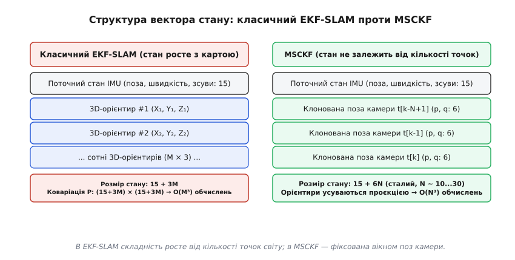
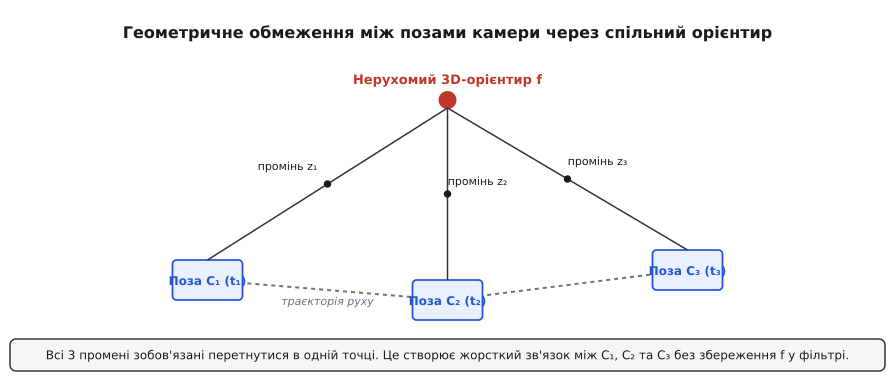
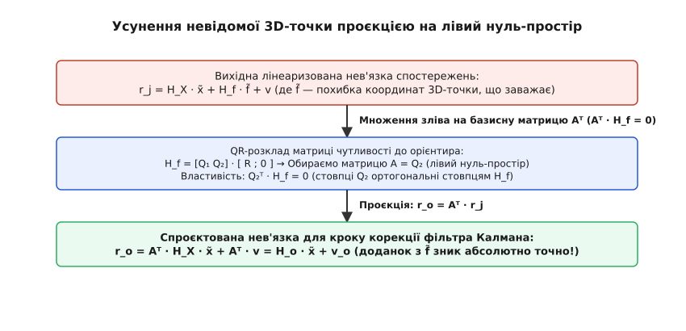
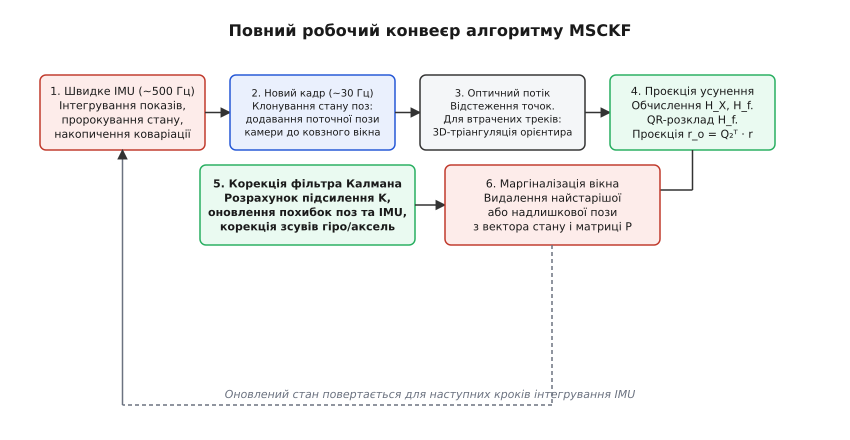

# Візуально-інерціальна одометрія MSCKF

<preknowlist>
- [Візуально-інерціальна одометрія](root:com-signal/visual-inertial-odometry) — злиття камери й IMU, дзеркальні вади та різниця темпів.
- [Розширений фільтр Калмана](root:com-signal/kalman-ekf) — оцінка нелінійного стану, матриця коваріацій і крок оновлення.
- [Інерційний вимірювальний модуль](root:hw-sensing/imu) — гіроскоп, акселерометр, інтегрування прискорення й дрейф зсувів.
- [Нев'язка й оновлення стану](root:com-signal/predict-vs-measure) — передбачення проти виміру, сигнал похибки.
- [Кватерніонне керування орієнтацією](root:sys-dron/quaternion-attitude-control) — орієнтація в тривимірному просторі без сингулярностей.
</preknowlist>

Квадрокоптер летить захаращеним цехом без супутникового зв'язку зі швидкістю 3 м/с. Бортова камера знімає 30 кадрів за секунду, виявляючи на кожному зображенні до 300 характерних точок, а інерційний давач (IMU) видає прискорення й кутові швидкості з частотою 500 Гц. Якщо запустити на бортовому комп'ютері класичний розширений фільтр Калмана для одночасної локалізації й картування (EKF-SLAM), де до вектора стану записуються тривимірні координати всіх трьохсот орієнтирів, розмірність стану сягне майже тисячі елементів. Матриця коваріацій матиме мільйон комірок, а її оновлення на кожному кадрі вимагатиме сотень мільйонів операцій множення, що забирає понад 150 мілісекунд процесорного часу легкого ARM-чипа. Але наступний кадр надходить уже через 33 мілісекунди. Процесор захлинається, оцінка запізнюється, подвійне інтегрування IMU без вчасних візуальних правок накопичує квадратичний дрейф, і дрон врізається в колону.

Цю обчислювальну пастку долає фільтр Калмана з обмеженнями багатьох станів (англ. *Multi-State Constraint Kalman Filter*, MSCKF; *фільтр* — від середньовіч. лат. *filtrum* «повсть для проціджування»; *констрейнт* або *обмеження* — від лат. *constringere* «стягувати, зв'язувати»). Замість того щоб утримувати в пам'яті координати сотень точок навколишнього світу й будувати вічну карту, алгоритм зберігає у векторі стану лише історію кількох недавніх поз самої камери — так зване ковзне вікно з 10–30 положень. Коли візуальна прикмета зникає з поля зору або виходить за межі вікна, алгоритм проєктує рівняння спостереження на лівий нуль-простір положення точки. Ця операція повністю знищує невідомі координати 3D-орієнтира, перетворюючи накопичені промені зору на пряме геометричне обмеження між позами камери, з яких цю точку було видно.

> 🔧 **Навіщо це.** MSCKF став фундаментальним алгоритмом для автономних літальних апаратів, шоломів доповненої реальності та космічних зондів (зокрема марсіанського вертольота Ingenuity). Він забезпечує точність тісно зв'язаної візуально-інерціальної одометрії за фіксованого обчислювального бюджету, який лінійно масштабується зі зростанням кількості спостережуваних візуальних прикмет.

## Пастка розмірності EKF-SLAM

Щоб зрозуміти необхідність MSCKF, простежмо математичну причину перевантаження класичного [розширеного фільтра Калмана (EKF)](root:com-signal/kalman-ekf) під час роботи з візуальними орієнтирами.

У традиційній схемі просторового фільтра стан системи об'єднує параметри рухомого апарата (поточна позиція, швидкість, орієнтація, зсуви акселерометра й гіроскопа) та координати `M` виявлених у просторі орієнтирів. Вектор стану має вигляд:

```
X = [ x_IMU,  f₁,  f₂,  ...,  f_M ]ᵀ
```

де `x_IMU` займає 15 змінних (3 положення, 3 швидкості, 3 кути орієнтації, 3 зміщення нуля гіроскопа, 3 зміщення нуля акселерометра), а кожен орієнтир `f_i` додає 3 просторові координати `(X_i, Y_i, Z_i)`.


*В EKF-SLAM вектор стану розростається разом із картою орієнтирів, роблячи розрахунок коваріації кубічно залежним від кількості точок. В MSCKF стан містить лише невелике вікно недавніх поз камери, а 3D-точки усуваються до оновлення коваріацій.*

Серцем фільтра Калмана є матриця коваріацій `P` (від лат. *con-* «разом» і *variare* «змінювати»), яка фіксує не лише власну дисперсію кожної змінної, а й взаємну кореляцію між усіма парами змінних. Якщо в стані зберігається 300 орієнтирів, розмірність вектора становить `15 + 3·300 = 915`, а матриця `P` містить `915 × 915 = 837 225` чисел із рухомою комою.

Під час коригування стану за вимірами камери фільтр повинен обчислити коефіцієнт підсилення Калмана `K`:

```
K = P · Hᵀ · (H · P · Hᵀ + R)⁻¹
```

Обчислення добутку `P · Hᵀ` та обернення квадратної матриці розмірністю в сотні рядків має обчислювальну складність порядка `O(M³)`. Навіть оптимізовані розріджені алгоритми вимагають щонайменше `O(M²)`. Якщо камера на багатій текстурою підлозі бачить 500 точок, обчислювальний потік зростає вчетверо. Робот потрапляє в парадоксальну ситуацію: що краща й чіткіша навколишня картинка, то швидше система зависає від браку обчислювальної потужності.

Для завдання локального керування польотом тривимірна карта кімнати чи складу не потрібна. Автопілоту необхідно точно знати власну швидкість, орієнтацію та зсув від точки старту. Координати камінців чи тріщин на підлозі — це лише тимчасові свідки власного руху, які після прольоту можна безжально забути.

## Клонування стану: ковзне вікно поз камери

MSCKF розриває зв'язок між кількістю візуальних точок і розміром матриці коваріацій. Замість додавання орієнтирів у стан алгоритм застосовує техніку стохастичного клонування (англ. *stochastic cloning*; *стохастичний* — від грец. *stokhastikos* «здатний до здогаду, випадковий»).

Вектор стану MSCKF складається з двох частин:
1. Поточний стан [інерційного модуля IMU](root:hw-sensing/imu) `x_IMU` (розмірність 15 або 16 із кватерніоном).
2. Ковзне вікно з `N` поз камери, збережених у моменти зйомки попередніх кадрів:

```
X = [ x_IMU,  p_C1,  q_C1,  p_C2,  q_C2,  ...,  p_CN,  q_CN ]ᵀ
```

Кожна поза камери у вікні представлена вектором положення `p_Ci` (3 координати) та кватерніоном орієнтації `q_Ci` (4 параметри, що несуть 3 ступені вільності похибки). Для фіксованого вікна розміром `N = 15` вектор похибки стану завжди має незмінний розмір `15 + 6·15 = 105` елементів. Скільки б сотень точок не спостерігала камера, розмір коваріаційної матриці лишається строго `105 × 105`.

Як нова поза потрапляє у стан? У мить отримання нового кадру `t_k` алгоритм виконує крок аугментації (розширення) стану:
1. За поточною оцінкою положення IMU `p_I` та його орієнтації `q_I` обчислюється поза камери через калібровану просторову трансформацію між корпусом і оптичним центром камери (зовнішні параметри екстринсиків `R_BC`, `p_BC`):

```
p_Ck = p_Ik + R_Ik · p_BC
q_Ck = q_Ik ⊗ q_BC
```

2. Нова поза додається в кінець вектора стану: `X ← [X, p_Ck, q_Ck]ᵀ`.
3. Матриця коваріацій `P` доповнюється новим блоком за допомогою якобіана клонування `J_clone = ∂(p_Ck, q_Ck) / ∂(x_IMU)`:

```
P_new = [      P          P · J_cloneᵀ     ]
        [ J_clone · P   J_clone · P · J_cloneᵀ ]
```

Цей крок точно переносить накопичену невизначеність і кореляцію з поточного стану IMU на щойно зафіксовану позу камери.

## Геометрія обмеження: орієнтир як свідок

Розглянемо нерухому просторову точку `f_j`, яку камера спостерігала з кількох збережених у вікні поз: `C₁, C₂, ..., C_M` (де `M ≤ N`).


*Нерухома 3D-точка f зв'язує промені спостереження з поз C₁, C₂ та C₃. Вимога перетину всіх променів у єдиній точці простору створює математичне обмеження суто на взаємне розташування поз.*

У кожній позі `C_i` проєкція точки на площину камери опиняється в піксельних координатах `z_i,j = [u_i, v_i]ᵀ`. Модель центральної проєкції записується як:

```
z_i,j = h( p_Ci, q_Ci, f_j ) + v_i,j
```

де `v_i,j` — білий гаусів шум вимірювання детектора кутів.

Лінеаризуючи цю модель навколо поточної оцінки поз камери та попередньої тривимірної оцінки положення точки `f̂_j`, отримуємо лінійне рівняння для [нев'язки спостереження](root:com-signal/predict-vs-measure) `r_i,j`:

```
r_i,j = z_i,j - h( p̂_Ci, q̂_Ci, f̂_j )
      ≈ H_X,i,j · x̃ + H_f,i,j · f̃_j + v_i,j
```

де:
- `x̃` — вектор похибки стану (похибки поз IMU та збережених камер);
- `f̃_j = f_j - f̂_j` — похибка просторових координат 3D-точки;
- `H_X,i,j` — матриця чутливості виміру до похибок поз камери;
- `H_f,i,j` — матриця чутливості виміру до положення 3D-точки (розмірність `2 × 3`).

Якщо об'єднати всі `M` спостережень точки `f_j` у єдиний вертикальний стовпчик, виникає блочна система рівнянь:

```
r_j = H_X,j · x̃ + H_f,j · f̃_j + v_j
```

Розмірність нев'язки `r_j` становить `2M × 1`, якобіан поз `H_X,j` має розмір `2M × (15 + 6N)`, а якобіан точки `H_f,j` має розмір `2M × 3`.

Головна перешкода тут полягає в доданку `H_f,j · f̃_j`. Ми не маємо похибки `f̃_j` у векторі стану фільтра й принципово не хочемо її туди записувати. Якби ми просто відкинули цей член, фільтр отримав би хибну інформацію і розійшовся б, оскільки неточність тріангуляції точки змішалася б із похибками навігації.

## Проєкція в лівий нуль-простір: знищення невідомої

Ось тут виникає центральна математична знахідка MSCKF. Простір, у якому живе доданок `H_f,j · f̃_j`, натягнутий на стовпці матриці `H_f,j`. Оскільки точка тривимірна, стовпців усього три. Але спостережень `2M` (наприклад, 8 спостережень дають 16 рядків). Це означає, що матриця `H_f,j` має великий лівий нуль-простір розмірності `2M - 3`.


*Множення рівняння нев'язки на матрицю лівого нуль-простору Q₂ᵀ обертає член із похибкою 3D-точки на точний нуль, залишаючи чисте обмеження на стан поз.*

Щоб знайти ортонормований базис цього лівого нуль-простору, застосовують QR-розклад (від лат. *quadratus* і *rectus*) матриці `H_f,j`:

```
H_f,j = [ Q₁   Q₂ ] · [ R ]
                      [ 0 ]
```

де:
- `Q₁` (розмір `2M × 3`) утворює ортогональний базис простору стовпців `H_f,j`;
- `Q₂` (розмір `2M × (2M - 3)`) утворює ортогональний базис лівого нуль-простору `H_f,j`;
- `R` (розмір `3 × 3`) — верхня трикутна матриця.

За фундаментальною властивістю ортогональності:

```
Q₂ᵀ · H_f,j = 0
```

Помножимо все лінеаризоване векторне рівняння нев'язки `r_j` зліва на `Q₂ᵀ`:

```
r_o,j = Q₂ᵀ · r_j
      = Q₂ᵀ · (H_X,j · x̃ + H_f,j · f̃_j + v_j)               [підстановка лінеаризованої нев'язки]
      = Q₂ᵀ · H_X,j · x̃ + (Q₂ᵀ · H_f,j) · f̃_j + Q₂ᵀ · v_j   [дистрибутивність множення матриць]
      = Q₂ᵀ · H_X,j · x̃ + 0 · f̃_j + Q₂ᵀ · v_j              [ортогональність нуль-простору: Q₂ᵀ · H_f = 0]
      = H_o,j · x̃ + v_o,j                                   [визначення спроєктованого якобіана H_o,j]
```

Член `f̃_j` повністю зникає. Жодного наближення чи спрощення тут немає: це точне аналітичне знищення змінної.

Результуюча спроєктована нев'язка `r_o,j` зв'язує безпосередньо похибки поз камери `x̃` із шумом спостереження `v_o,j = Q₂ᵀ · v_j`. Коваріаційна матриця цього спроєктованого шуму дорівнює:

```
R_o,j = Q₂ᵀ · (σ² · I) · Q₂ = σ² · (Q₂ᵀ · Q₂) = σ² · I
```

Оскільки стовпці `Q₂` взаємно ортонормовані, некорельований білий шум пікселів залишається некорельованим білим шумом із тією самою дисперсією `σ²`.

Повне виведення якобіанів центральної проєкції, блоків матриць та доведення збереження статистичних властивостей шуму розгорнуто в [математичному виведенні нуль-простору MSCKF](root:com-signal/msckf-odometry/math-nullspace-projection.md).

## Стиснення вимірів через тонкий QR-розклад

Коли на поточному кроці завершується відстеження багатьох орієнтирів (наприклад, 40 точок), ми об'єднуємо всі індивідуальні спроєктовані нев'язки в один спільний блок:

```
r_stack = [ r_o,1;  r_o,2;  ...;  r_o,K ]
H_stack = [ H_o,1;  H_o,2;  ...;  H_o,K ]
```

Сумарна кількість рядків `K_total = ∑ (2M_j - 3)` може сягати сотень або тисяч. Безпосереднє використання `H_stack` у стандартних формулах фільтра Калмана призвело б до потреби обертати матрицю `(H_stack · P · H_stackᵀ + R)` велетенського розміру `K_total × K_total`.

Щоб звести розмірність оновлення до мінімуму, застосовують операцію тонкого QR-стиснення (англ. *measurement compression*):

```
H_stack = [ Q_H1   Q_H2 ] · [ T_H ]
                            [  0  ]
```

де матриця `T_H` є верхньою трикутною і має розмір щонайбільше `D × D`, де `D = dim(x̃) = 15 + 6N` (розмірність вектора похибки стану).

Множачи вихідну систему на `Q_H1ᵀ`, отримуємо компактне рівняння оновлення:

```
r_compressed = Q_H1ᵀ · r_stack
H_compressed = T_H
```

Рядки, що відповідали матриці `Q_H2`, дають нульовий якобіан стану й несуть суто некорисний шум, тому їх безпечно відкидають. У результаті розмірність матриці для інверсії під час розрахунку коефіцієнта Калмана ніколи не перевищує `(15 + 6N) × (15 + 6N)`, незалежно від кількості виміряних точок.

Після обчислення приросту похибки `Δx = K · r_compressed`:
- До компонентів положення, швидкості й зсувів IMU додається векторна поправка: `x ← x + Δx`.
- Орієнтація коригується кватерніонним множенням: `q ← Δq(Δθ) ⊗ q`.
- Матриця коваріацій оновлюється за симетричною та чисельно стійкою формою Джозефа: `P ← (I - K H) P (I - K H)ᵀ + K R Kᵀ`.

## Повний цикл конвеєра та маргіналізація

Робота системи є циклічною й узгоджує два різні темпи надходження даних: високочастотний інерційний потік та дискретні кадри камери.


*Швидка петля IMU інтегрує динаміку між кадрами. Прихід кадру запускає клонування пози, супровід точок, нуль-просторову корекцію та маргіналізацію застарілих поз.*

Повний алгоритмічний цикл складається з шести послідовних кроків:

1. **Пророкування стану за IMU (~500 Гц):**
   На кожному кроці вимірювання гіроскопа й акселерометра інтегруються за допомогою нелінійних рівнянь кінематики твердого тіла. Одночасно матриця коваріацій похибки `P` просувається вперед за допомогою матриці переходу стану `Φ` і шуму процесу `Q`:
   ```
   P_k+1|k = Φ_k · P_k|k · Φ_kᵀ + Q_k
   ```

2. **Отримання кадру й клонування пози (~30 Гц):**
   Коли сенсор фіксує новий кадр, поточна поза камери обчислюється з оцінки IMU та додається до ковзного вікна через стохастичне клонування.

3. **Супровід точок та оптичний потік:**
   Алгоритм типу Lucas-Kanade або дескрипторний трекер зіставляє характерні точки між поточним і попередніми кадрами.

4. **Тріангуляція втрачених орієнтирів:**
   Для точок, супровід яких перервався (точка вийшла з кадру або була відсіяна перевіркою якості), збираються всі вектори спостережень. Метод найменших квадратів або оптимізація Гаусса-Ньютона визначає початкову тривимірну оцінку положення орієнтира `f̂_j`.

5. **Нуль-просторова корекція Калмана:**
   Для всіх завершених треків обчислюються якобіани, виконується QR-проєкція на нуль-простір, стиснення матриць та оновлення стану й коваріації `P`.

6. **Маргіналізація вікна:**
   Якщо кількість поз у вікні перевищує максимальну місткість `N_max`, найстаріша поза (або поза з найменшим просторовим базисом) підлягає видаленню (маргіналізації; від лат. *margo* «край, межа»). Її рядки та стовпці просто вирізаються з матриці `P` і вектора стану. Усі орієнтири, які бачила ця поза, примусово тріангулюються й утилізуються в кроці оновлення перед її видаленням.

Програмна реалізація структур даних, кроку клонування, нуль-просторової фільтрації та очищення коваріацій мовами C і C++ наведена у [практичному проекті конвеєра MSCKF](root:com-signal/msckf-odometry/proj-msckf-pipeline.md).

Зовнішній інтерфейс бібліотеки, формати пакетів і конфігураційні параметри зібрані у [довідці інтерфейсу MSCKF](root:com-signal/msckf-odometry/api-msckf.md).

## Інженерні крайові випадки та стійкість

Впровадження MSCKF на реальних робототехнічних платформах наражається на кілька специфічних фізичних і чисельних крайових умов:

**1. Проблема спостережуваності та конзистентності (FEJ).**
Візуально-інерціальна система за відсутності абсолютних орієнтирів (таких як магнітометр чи GNSS) має рівно 4 неспостережувані ступені вільності: абсолютне 3D-положення (3 координати) та кут курсу (yaw, рискання) навколо вектора гравітації. Гравітація робить крен і тангаж спостережуваними через акселерометр.

У стандартному EKF через лінеаризацію різних вимірів навколо оновлюваних оцінок стану виникає явище штучної спостережуваності: фільтр помилково зменшує дисперсію вздовж осі рискання, вважаючи, що він «навчився» визначати абсолютний північний курс. Це веде до надмірної самовпевненості фільтра й розбіжності оцінки. У сучасних версіях MSCKF (зокрема MSCKF 2.0 / FEJ-MSCKF) застосовують принцип першої оцінки якобіанів (англ. *First Estimate Jacobians*, FEJ), обчислюючи матриці переходу та вимірів суто відносно оцінки, яка була зафіксована в мить першої появи відповідного стану.

**2. Чисте обертання та вироджений рух.**
Якщо апарат обертається на місці без лінійного переміщення, просторовий базис між кадрами дорівнює нулю. Тріангуляція глибини 3D-точок стає математично невизначеною (відстань прямує до нескінченності). У цьому режимі спроба оцінити 3D-координати через звичайні декартіві координати призводить до чисельного зриву. Надійні реалізації MSCKF застосовують параметризацію зворотною глибиною (англ. *inverse depth* `ρ = 1/Z`) або тимчасово блокують обробку орієнтирів із паралаксом менше ніж 1.5–2.0 градуси, спираючись на гіроскопічну інформацію IMU.

**3. Фільтрація викидів (Chi-Square Gating).**
Оптичний потік може помилково зчепитися з рухомим об'єктом (наприклад, іншим дроном чи людиною, що проходить повз) або відблиском на склі. Якщо такий вимір потрапить у фільтр, він спотворить оцінку руху. Перед виконанням корекції Калмана кожна спроєктована нев'язка перевіряється за критерієм хі-квадрат (відстанню Махаланобіса):

```
γ = r_o,jᵀ · (H_o,j · P · H_o,jᵀ + R_o,j)⁻¹ · r_o,j  ≤  χ²_threshold
```

Якщо величина `γ` перевищує поріг для відповідного ступеня вільності (типово рівень довіри 95%), весь трек цієї точки відкидається як викид і не бере участі в оновленні стану.

Завдяки поєднанню геометричної суворості нуль-просторового усунення та стабільного обчислювального навантаження MSCKF залишається еталоном швидкої, надійної та ресурсоефективної візуально-інерціальної одометрії.
